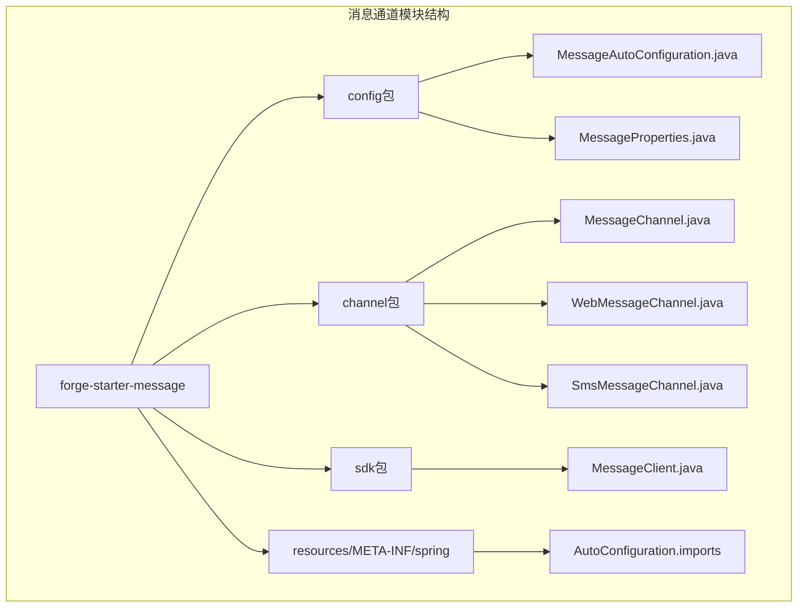
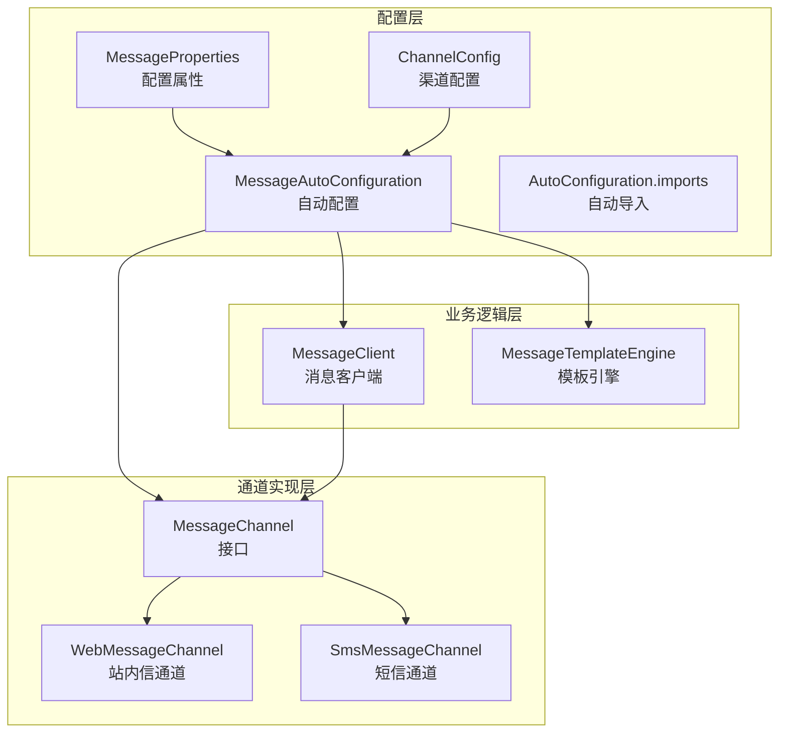
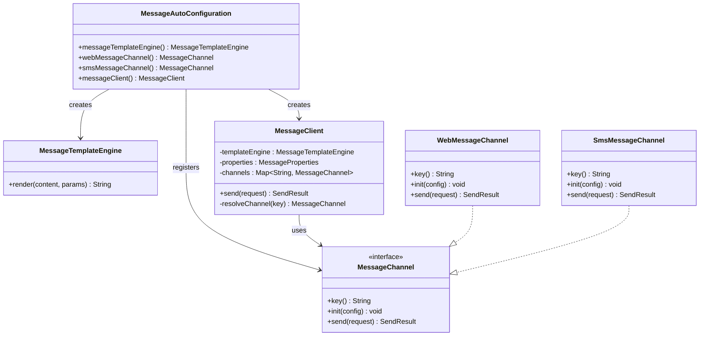
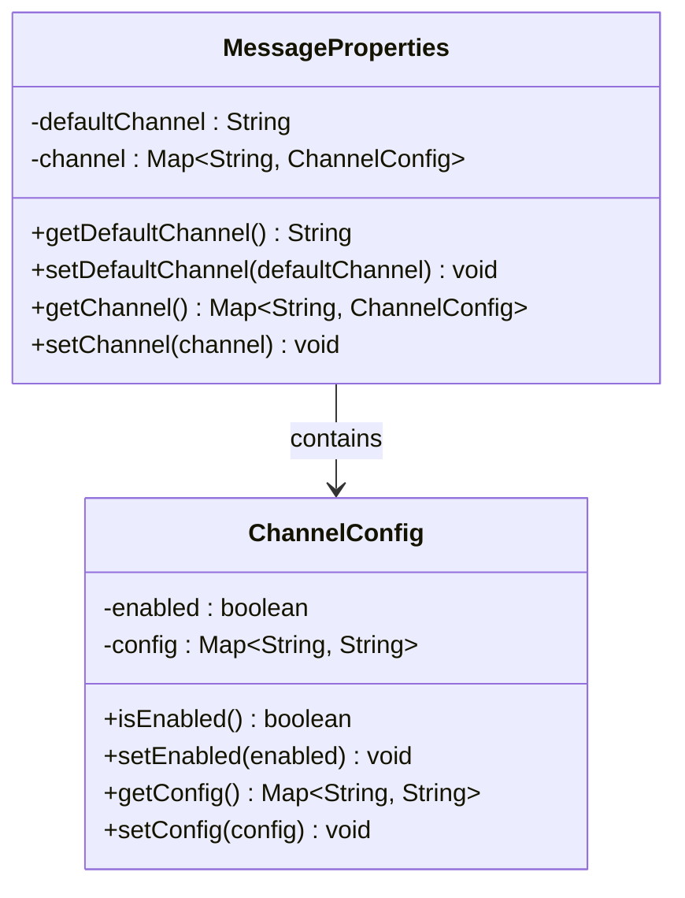
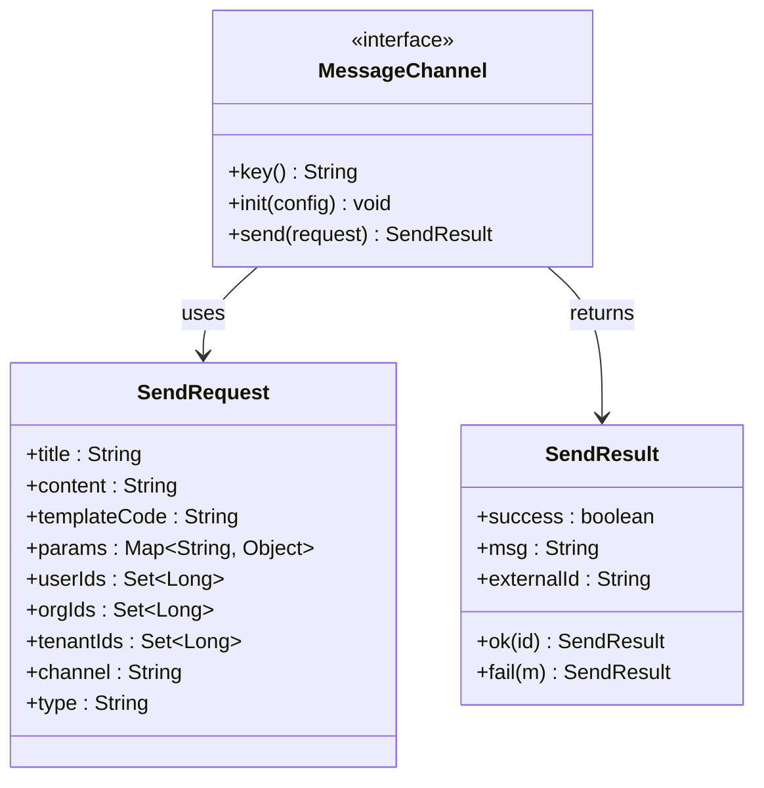
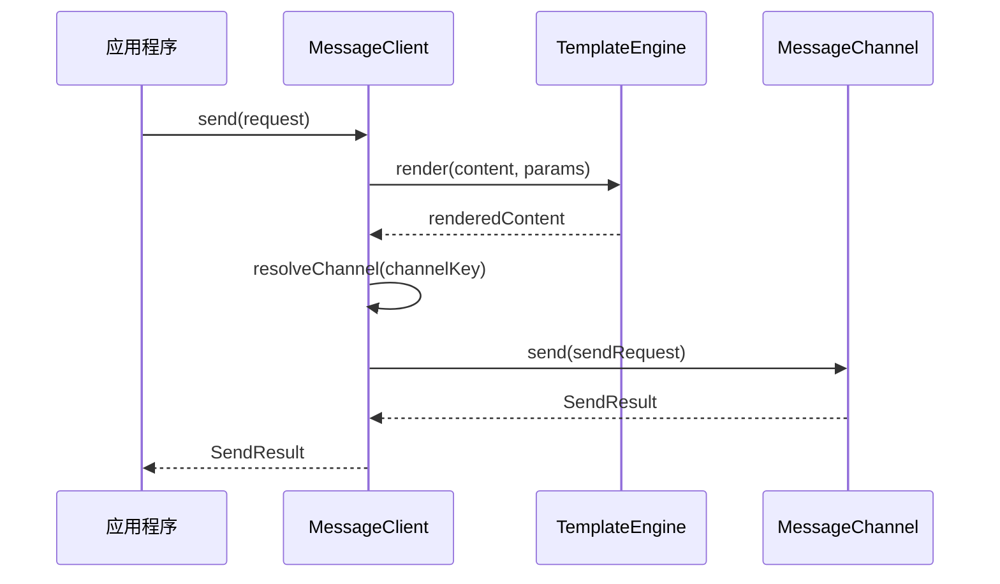
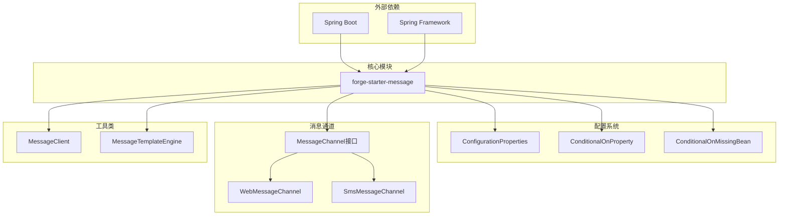

# 消息通道配置管理

<cite>
**本文档引用的文件**
- [MessageAutoConfiguration.java](file://forge/forge-framework/forge-starter-parent/forge-starter-message/src/main/java/com/mdframe/forge/starter/message/config/MessageAutoConfiguration.java)
- [MessageProperties.java](file://forge/forge-framework/forge-starter-parent/forge-starter-message/src/main/java/com/mdframe/forge/starter/message/config/MessageProperties.java)
- [MessageClient.java](file://forge/forge-framework/forge-starter-parent/forge-starter-message/src/main/java/com/mdframe/forge/starter/message/sdk/MessageClient.java)
- [MessageChannel.java](file://forge/forge-framework/forge-starter-parent/forge-starter-message/src/main/java/com/mdframe/forge/starter/message/channel/MessageChannel.java)
- [WebMessageChannel.java](file://forge/forge-framework/forge-starter-parent/forge-starter-message/src/main/java/com/mdframe/forge/starter/message/channel/WebMessageChannel.java)
- [SmsMessageChannel.java](file://forge/forge-framework/forge-starter-parent/forge-starter-message/src/main/java/com/mdframe/forge/starter/message/channel/SmsMessageChannel.java)
- [org.springframework.boot.autoconfigure.AutoConfiguration.imports](file://forge/forge-framework/forge-starter-parent/forge-starter-message/src/main/resources/META-INF/spring/org.springframework.boot.autoconfigure.AutoConfiguration.imports)
- [spring-configuration-metadata.json](file://forge/forge-framework/forge-starter-parent/forge-starter-message/target/classes/META-INF/spring-configuration-metadata.json)
</cite>

## 目录
1. [简介](#简介)
2. [项目结构](#项目结构)
3. [核心组件](#核心组件)
4. [架构概览](#架构概览)
5. [详细组件分析](#详细组件分析)
6. [依赖关系分析](#依赖关系分析)
7. [性能考虑](#性能考虑)
8. [故障排除指南](#故障排除指南)
9. [结论](#结论)

## 简介

Forge框架的消息通道配置管理系统是一个基于Spring Boot自动配置机制的模块化消息发送解决方案。该系统通过自动配置类、配置属性管理和消息通道接口设计，实现了灵活的消息发送能力，支持多种消息渠道（如站内信、短信等）的统一管理和动态配置。

本系统的核心目标是提供一个可扩展、可配置的消息发送基础设施，允许开发者通过简单的配置启用或禁用不同的消息渠道，并为每个渠道提供独立的配置参数。

## 项目结构

消息通道配置管理模块位于Forge框架的starter-parent项目中，采用标准的Spring Boot模块组织方式：

**图表来源**
- [MessageAutoConfiguration.java](file://forge/forge-framework/forge-starter-parent/forge-starter-message/src/main/java/com/mdframe/forge/starter/message/config/MessageAutoConfiguration.java#L1-L47)
- [MessageProperties.java](file://forge/forge-framework/forge-starter-parent/forge-starter-message/src/main/java/com/mdframe/forge/starter/message/config/MessageProperties.java#L1-L34)

**章节来源**
- [MessageAutoConfiguration.java](file://forge/forge-framework/forge-starter-parent/forge-starter-message/src/main/java/com/mdframe/forge/starter/message/config/MessageAutoConfiguration.java#L1-L47)
- [MessageProperties.java](file://forge/forge-framework/forge-starter-parent/forge-starter-message/src/main/java/com/mdframe/forge/starter/message/config/MessageProperties.java#L1-L34)

## 核心组件

消息通道配置管理系统由以下核心组件构成：

### 自动配置类
- **MessageAutoConfiguration**: 主要的自动配置类，负责注册消息相关的Bean
- 基于条件注解实现按需加载
- 管理消息模板引擎、消息客户端和各种消息渠道

### 配置属性类
- **MessageProperties**: 定义消息系统的配置属性
- 支持默认渠道设置和多渠道配置
- 提供ChannelConfig内部类管理具体渠道配置

### 消息通道接口
- **MessageChannel**: 定义消息通道的标准接口
- 包含key()、init()、send()方法
- 支持发送请求和结果的数据结构定义

**章节来源**
- [MessageAutoConfiguration.java](file://forge/forge-framework/forge-starter-parent/forge-starter-message/src/main/java/com/mdframe/forge/starter/message/config/MessageAutoConfiguration.java#L17-L46)
- [MessageProperties.java](file://forge/forge-framework/forge-starter-parent/forge-starter-message/src/main/java/com/mdframe/forge/starter/message/config/MessageProperties.java#L7-L33)
- [MessageChannel.java](file://forge/forge-framework/forge-starter-parent/forge-starter-message/src/main/java/com/mdframe/forge/starter/message/channel/MessageChannel.java#L5-L40)

## 架构概览

消息通道配置管理系统的整体架构采用分层设计，实现了配置驱动和接口抽象的分离：

**图表来源**
- [MessageAutoConfiguration.java](file://forge/forge-framework/forge-starter-parent/forge-starter-message/src/main/java/com/mdframe/forge/starter/message/config/MessageAutoConfiguration.java#L17-L46)
- [MessageProperties.java](file://forge/forge-framework/forge-starter-parent/forge-starter-message/src/main/java/com/mdframe/forge/starter/message/config/MessageProperties.java#L7-L33)
- [MessageClient.java](file://forge/forge-framework/forge-starter-parent/forge-starter-message/src/main/java/com/mdframe/forge/starter/message/sdk/MessageClient.java#L10-L56)

## 详细组件分析

### MessageAutoConfiguration自动配置类

自动配置类是整个消息通道系统的核心，负责在应用启动时自动注册必要的Bean：

**图表来源**
- [MessageAutoConfiguration.java](file://forge/forge-framework/forge-starter-parent/forge-starter-message/src/main/java/com/mdframe/forge/starter/message/config/MessageAutoConfiguration.java#L17-L46)
- [MessageClient.java](file://forge/forge-framework/forge-starter-parent/forge-starter-message/src/main/java/com/mdframe/forge/starter/message/sdk/MessageClient.java#L10-L56)
- [MessageChannel.java](file://forge/forge-framework/forge-starter-parent/forge-starter-message/src/main/java/com/mdframe/forge/starter/message/channel/MessageChannel.java#L5-L40)

#### 配置加载流程

自动配置类的执行流程如下：

1. **Bean注册阶段**：根据条件注解注册消息模板引擎和消息客户端
2. **渠道初始化**：扫描并注册可用的消息渠道Bean
3. **配置绑定**：将配置属性绑定到MessageProperties实例
4. **渠道配置**：遍历配置中的渠道，调用对应渠道的init方法进行初始化

**章节来源**
- [MessageAutoConfiguration.java](file://forge/forge-framework/forge-starter-parent/forge-starter-message/src/main/java/com/mdframe/forge/starter/message/config/MessageAutoConfiguration.java#L19-L45)

### MessageProperties配置属性

MessageProperties类定义了消息系统的配置属性，采用@ConfigurationProperties注解实现配置绑定：

**图表来源**
- [MessageProperties.java](file://forge/forge-framework/forge-starter-parent/forge-starter-message/src/main/java/com/mdframe/forge/starter/message/config/MessageProperties.java#L7-L33)

#### 配置属性详解

- **defaultChannel**: 设置默认消息渠道，默认值为"web"
- **channel**: Map类型，存储各个消息渠道的配置信息
- **ChannelConfig**: 内部类，包含每个渠道的启用状态和具体配置参数

**章节来源**
- [MessageProperties.java](file://forge/forge-framework/forge-starter-parent/forge-starter-message/src/main/java/com/mdframe/forge/starter/message/config/MessageProperties.java#L10-L27)

### 消息通道接口设计

消息通道接口定义了统一的消息发送标准：

**图表来源**
- [MessageChannel.java](file://forge/forge-framework/forge-starter-parent/forge-starter-message/src/main/java/com/mdframe/forge/starter/message/channel/MessageChannel.java#L5-L40)

#### 渠道实现类

系统提供了两个基础的渠道实现：

1. **WebMessageChannel**: 站内信渠道实现
   - key返回"web"
   - init方法为空实现（预留扩展点）
   - send方法返回模拟的成功结果

2. **SmsMessageChannel**: 短信渠道实现
   - key返回"sms"
   - init方法预留第三方短信网关集成
   - send方法返回模拟的成功结果

**章节来源**
- [WebMessageChannel.java](file://forge/forge-framework/forge-starter-parent/forge-starter-message/src/main/java/com/mdframe/forge/starter/message/channel/WebMessageChannel.java#L5-L15)
- [SmsMessageChannel.java](file://forge/forge-framework/forge-starter-parent/forge-starter-message/src/main/java/com/mdframe/forge/starter/message/channel/SmsMessageChannel.java#L5-L15)

### MessageClient消息客户端

MessageClient作为消息发送的核心入口，负责协调模板渲染和渠道选择：

**图表来源**
- [MessageClient.java](file://forge/forge-framework/forge-starter-parent/forge-starter-message/src/main/java/com/mdframe/forge/starter/message/sdk/MessageClient.java#L34-L45)

#### 发送流程分析

1. **模板渲染**：如果提供了模板内容和参数，先进行模板渲染
2. **渠道解析**：确定使用的消息渠道（优先使用请求指定的渠道）
3. **渠道选择**：根据渠道键获取对应的MessageChannel Bean
4. **消息发送**：调用渠道的send方法执行实际的消息发送

**章节来源**
- [MessageClient.java](file://forge/forge-framework/forge-starter-parent/forge-starter-message/src/main/java/com/mdframe/forge/starter/message/sdk/MessageClient.java#L34-L54)

## 依赖关系分析

消息通道配置管理系统的依赖关系体现了清晰的分层架构：

**图表来源**
- [MessageAutoConfiguration.java](file://forge/forge-framework/forge-starter-parent/forge-starter-message/src/main/java/com/mdframe/forge/starter/message/config/MessageAutoConfiguration.java#L17-L46)
- [org.springframework.boot.autoconfigure.AutoConfiguration.imports](file://forge/forge-framework/forge-starter-parent/forge-starter-message/src/main/resources/META-INF/spring/org.springframework.boot.autoconfigure.AutoConfiguration.imports#L1-L2)

### 组件耦合度分析

- **低耦合设计**：通过接口抽象实现了消息通道与具体实现的解耦
- **条件加载**：利用Spring条件注解实现按需加载，减少不必要的Bean创建
- **配置驱动**：通过配置属性实现运行时行为的灵活调整

**章节来源**
- [MessageAutoConfiguration.java](file://forge/forge-framework/forge-starter-parent/forge-starter-message/src/main/java/com/mdframe/forge/starter/message/config/MessageAutoConfiguration.java#L27-L37)
- [MessageClient.java](file://forge/forge-framework/forge-starter-parent/forge-starter-message/src/main/java/com/mdframe/forge/starter/message/sdk/MessageClient.java#L18-L32)

## 性能考虑

消息通道配置管理系统在设计时充分考虑了性能优化：

### Bean生命周期优化
- 使用`@ConditionalOnMissingBean`避免重复创建Bean
- 条件注解确保只在需要时创建特定渠道的Bean

### 内存使用优化
- 通过Map缓存已解析的消息渠道，避免重复查找
- 模板渲染结果的及时释放

### 配置访问优化
- 配置属性的延迟初始化
- 渠道配置的按需初始化

## 故障排除指南

### 常见问题及解决方案

#### 渠道不可用错误
**现象**：发送消息时返回"channel not available"错误
**原因**：指定的渠道未正确配置或Bean未被创建
**解决**：检查配置文件中的渠道启用设置

#### 模板渲染失败
**现象**：消息内容模板无法正确渲染
**原因**：模板参数不匹配或模板语法错误
**解决**：验证模板内容和参数的完整性

#### 渠道初始化异常
**现象**：应用启动时渠道初始化失败
**原因**：第三方服务配置错误或网络连接问题
**解决**：检查第三方服务的配置参数和网络连通性

### 调试建议

1. **启用调试日志**：查看消息发送过程中的详细日志信息
2. **配置验证**：使用Spring Boot的配置元数据验证配置的有效性
3. **单元测试**：为关键的配置逻辑编写单元测试

**章节来源**
- [MessageClient.java](file://forge/forge-framework/forge-starter-parent/forge-starter-message/src/main/java/com/mdframe/forge/starter/message/sdk/MessageClient.java#L41-L43)

## 结论

Forge框架的消息通道配置管理系统通过精心设计的架构实现了高度的模块化和可扩展性。系统采用自动配置机制，结合配置属性管理和接口抽象设计，为开发者提供了一个灵活、易用且功能强大的消息发送解决方案。

该系统的主要优势包括：

- **模块化设计**：清晰的分层架构便于维护和扩展
- **配置驱动**：通过配置文件实现运行时行为的灵活调整
- **接口抽象**：统一的消息通道接口支持多种渠道的无缝集成
- **条件加载**：按需加载机制提高了系统的启动效率
- **易于扩展**：标准化的接口设计便于添加新的消息渠道

未来可以考虑的功能增强包括：配置热更新机制、更丰富的渠道类型支持、消息发送的异步处理能力等。