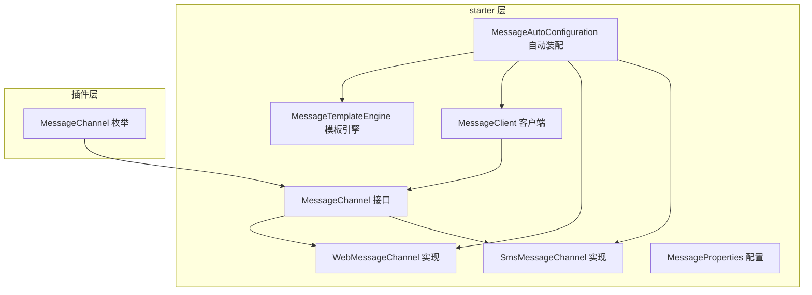
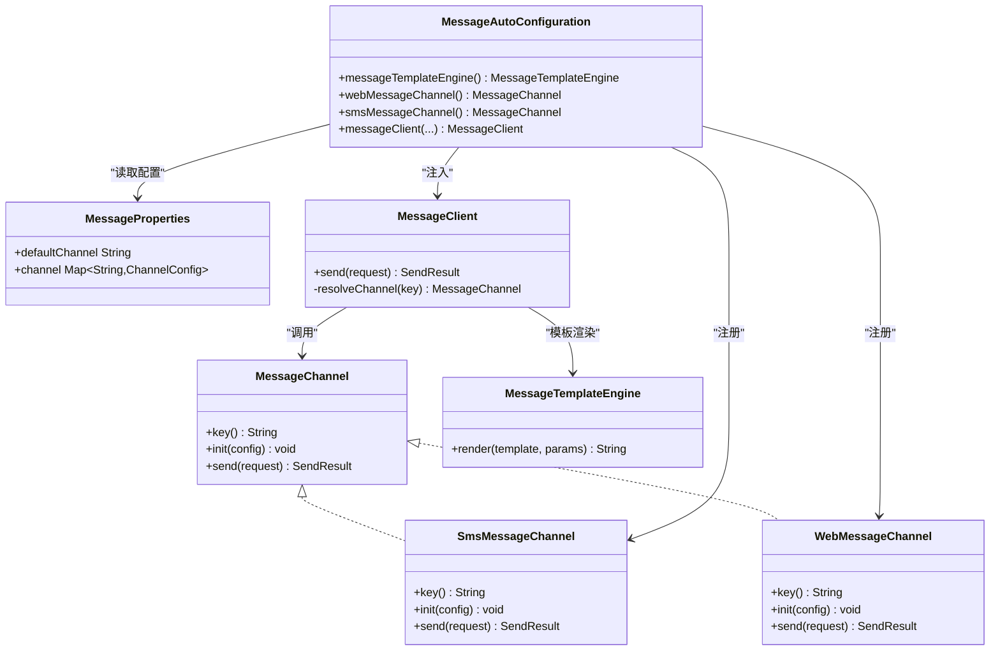
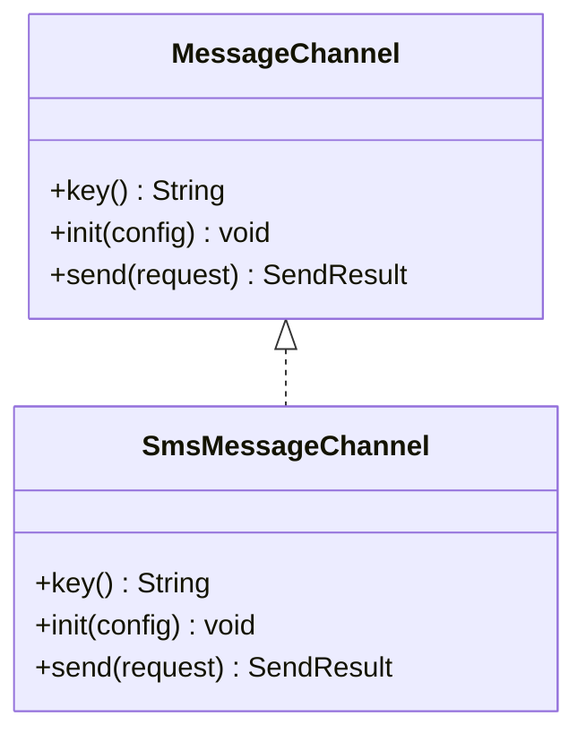
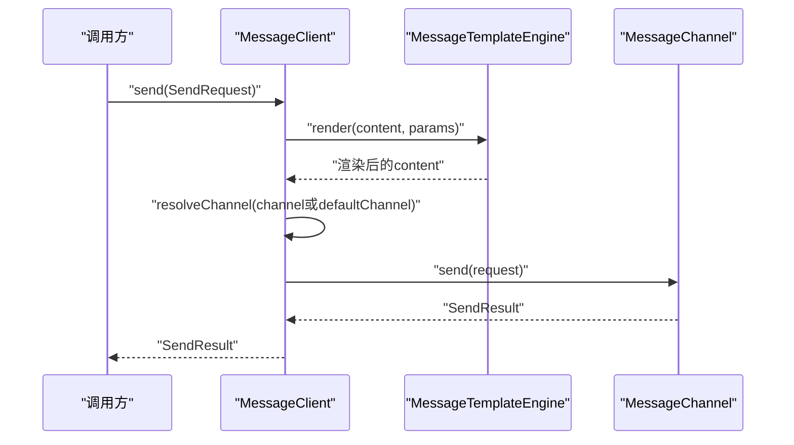
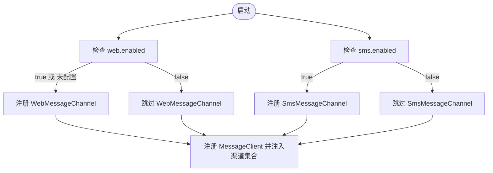
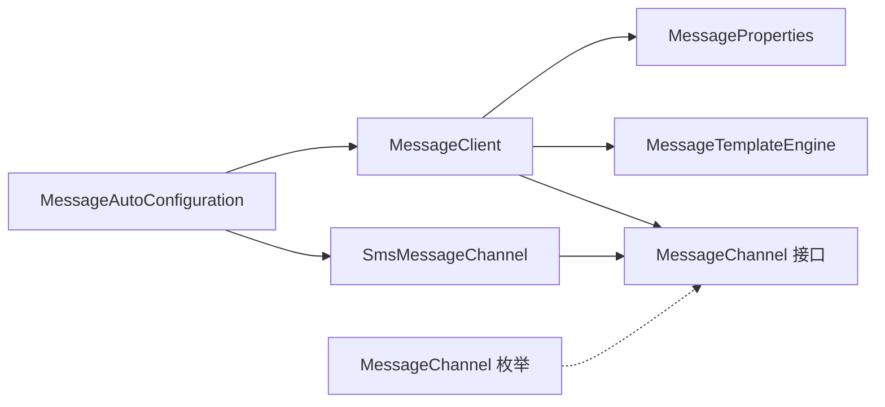

# 短信消息通道

<cite>
**本文档引用的文件**
- [SmsMessageChannel.java](file://forge/forge-framework/forge-starter-parent/forge-starter-message/src/main/java/com/mdframe/forge/starter/message/channel/SmsMessageChannel.java)
- [MessageChannel.java](file://forge/forge-framework/forge-starter-parent/forge-starter-message/src/main/java/com/mdframe/forge/starter/message/channel/MessageChannel.java)
- [WebMessageChannel.java](file://forge/forge-framework/forge-starter-parent/forge-starter-message/src/main/java/com/mdframe/forge/starter/message/channel/WebMessageChannel.java)
- [MessageAutoConfiguration.java](file://forge/forge-framework/forge-starter-parent/forge-starter-message/src/main/java/com/mdframe/forge/starter/message/config/MessageAutoConfiguration.java)
- [MessageProperties.java](file://forge/forge-framework/forge-starter-parent/forge-starter-message/src/main/java/com/mdframe/forge/starter/message/config/MessageProperties.java)
- [MessageClient.java](file://forge/forge-framework/forge-starter-parent/forge-starter-message/src/main/java/com/mdframe/forge/starter/message/sdk/MessageClient.java)
- [MessageTemplateEngine.java](file://forge/forge-framework/forge-starter-parent/forge-starter-message/src/main/java/com/mdframe/forge/starter/message/service/MessageTemplateEngine.java)
- [MessageChannel 枚举](file://forge/forge-framework/forge-plugin-parent/forge-plugin-message/src/main/java/com/mdframe/forge/plugin/message/domain/MessageChannel.java)
- [application.yml](file://forge/forge-admin/src/main/resources/application.yml)
</cite>

## 目录
1. [简介](#简介)
2. [项目结构](#项目结构)
3. [核心组件](#核心组件)
4. [架构概览](#架构概览)
5. [详细组件分析](#详细组件分析)
6. [依赖关系分析](#依赖关系分析)
7. [性能考虑](#性能考虑)
8. [故障排查指南](#故障排查指南)
9. [结论](#结论)
10. [附录](#附录)

## 简介
本文件面向Forge框架的短信消息通道实现，围绕SmsMessageChannel短信通道的架构设计、配置方法、第三方短信服务商对接、短信模板管理、并发控制、失败重试机制、发送状态回调处理等高可用性设计进行系统化技术说明，并提供配置参数、API调用示例、错误码处理与性能监控指南，同时覆盖短信发送的合规性要求、成本控制与质量保障措施。

## 项目结构
短信消息通道位于Forge框架的消息子系统中，采用“starter + 插件”的分层架构：
- starter层提供通用的消息通道抽象、自动装配、客户端SDK与模板引擎
- 插件层提供具体业务域的枚举与扩展（如消息渠道枚举）

图表来源
- [MessageAutoConfiguration.java](file://forge/forge-framework/forge-starter-parent/forge-starter-message/src/main/java/com/mdframe/forge/starter/message/config/MessageAutoConfiguration.java#L17-L46)
- [MessageChannel.java](file://forge/forge-framework/forge-starter-parent/forge-starter-message/src/main/java/com/mdframe/forge/starter/message/channel/MessageChannel.java#L5-L40)
- [SmsMessageChannel.java](file://forge/forge-framework/forge-starter-parent/forge-starter-message/src/main/java/com/mdframe/forge/starter/message/channel/SmsMessageChannel.java#L5-L15)
- [WebMessageChannel.java](file://forge/forge-framework/forge-starter-parent/forge-starter-message/src/main/java/com/mdframe/forge/starter/message/channel/WebMessageChannel.java#L5-L15)
- [MessageClient.java](file://forge/forge-framework/forge-starter-parent/forge-starter-message/src/main/java/com/mdframe/forge/starter/message/sdk/MessageClient.java#L10-L55)
- [MessageTemplateEngine.java](file://forge/forge-framework/forge-starter-parent/forge-starter-message/src/main/java/com/mdframe/forge/starter/message/service/MessageTemplateEngine.java#L5-L22)
- [MessageChannel 枚举](file://forge/forge-framework/forge-plugin-parent/forge-plugin-message/src/main/java/com/mdframe/forge/plugin/message/domain/MessageChannel.java#L9-L29)

章节来源
- [MessageAutoConfiguration.java](file://forge/forge-framework/forge-starter-parent/forge-starter-message/src/main/java/com/mdframe/forge/starter/message/config/MessageAutoConfiguration.java#L17-L46)
- [MessageChannel.java](file://forge/forge-framework/forge-starter-parent/forge-starter-message/src/main/java/com/mdframe/forge/starter/message/channel/MessageChannel.java#L5-L40)
- [SmsMessageChannel.java](file://forge/forge-framework/forge-starter-parent/forge-starter-message/src/main/java/com/mdframe/forge/starter/message/channel/SmsMessageChannel.java#L5-L15)
- [WebMessageChannel.java](file://forge/forge-framework/forge-starter-parent/forge-starter-message/src/main/java/com/mdframe/forge/starter/message/channel/WebMessageChannel.java#L5-L15)
- [MessageClient.java](file://forge/forge-framework/forge-starter-parent/forge-starter-message/src/main/java/com/mdframe/forge/starter/message/sdk/MessageClient.java#L10-L55)
- [MessageTemplateEngine.java](file://forge/forge-framework/forge-starter-parent/forge-starter-message/src/main/java/com/mdframe/forge/starter/message/service/MessageTemplateEngine.java#L5-L22)
- [MessageChannel 枚举](file://forge/forge-framework/forge-plugin-parent/forge-plugin-message/src/main/java/com/mdframe/forge/plugin/message/domain/MessageChannel.java#L9-L29)

## 核心组件
- MessageChannel接口：定义渠道统一能力（唯一键、初始化、发送）
- SmsMessageChannel：短信通道实现，预留第三方短信网关接入点
- WebMessageChannel：站内信通道实现（用于对比与参考）
- MessageAutoConfiguration：基于条件注解的自动装配，注册短信与站内信通道及客户端
- MessageProperties：消息通道配置模型，支持默认渠道与各渠道开关与配置
- MessageClient：消息发送门面，负责模板渲染、渠道解析与调用
- MessageTemplateEngine：简单模板渲染引擎，支持占位符替换
- MessageChannel 枚举：业务域消息渠道枚举（WEB/SMS/EMAIL/PUSH）

章节来源
- [MessageChannel.java](file://forge/forge-framework/forge-starter-parent/forge-starter-message/src/main/java/com/mdframe/forge/starter/message/channel/MessageChannel.java#L5-L40)
- [SmsMessageChannel.java](file://forge/forge-framework/forge-starter-parent/forge-starter-message/src/main/java/com/mdframe/forge/starter/message/channel/SmsMessageChannel.java#L5-L15)
- [WebMessageChannel.java](file://forge/forge-framework/forge-starter-parent/forge-starter-message/src/main/java/com/mdframe/forge/starter/message/channel/WebMessageChannel.java#L5-L15)
- [MessageAutoConfiguration.java](file://forge/forge-framework/forge-starter-parent/forge-starter-message/src/main/java/com/mdframe/forge/starter/message/config/MessageAutoConfiguration.java#L17-L46)
- [MessageProperties.java](file://forge/forge-framework/forge-starter-parent/forge-starter-message/src/main/java/com/mdframe/forge/starter/message/config/MessageProperties.java#L7-L33)
- [MessageClient.java](file://forge/forge-framework/forge-starter-parent/forge-starter-message/src/main/java/com/mdframe/forge/starter/message/sdk/MessageClient.java#L10-L55)
- [MessageTemplateEngine.java](file://forge/forge-framework/forge-starter-parent/forge-starter-message/src/main/java/com/mdframe/forge/starter/message/service/MessageTemplateEngine.java#L5-L22)
- [MessageChannel 枚举](file://forge/forge-framework/forge-plugin-parent/forge-plugin-message/src/main/java/com/mdframe/forge/plugin/message/domain/MessageChannel.java#L9-L29)

## 架构概览
短信消息通道采用“接口抽象 + 工厂注册 + 条件装配 + 模板渲染”的架构模式，具备良好的扩展性与可配置性。

图表来源
- [MessageChannel.java](file://forge/forge-framework/forge-starter-parent/forge-starter-message/src/main/java/com/mdframe/forge/starter/message/channel/MessageChannel.java#L5-L40)
- [SmsMessageChannel.java](file://forge/forge-framework/forge-starter-parent/forge-starter-message/src/main/java/com/mdframe/forge/starter/message/channel/SmsMessageChannel.java#L5-L15)
- [WebMessageChannel.java](file://forge/forge-framework/forge-starter-parent/forge-starter-message/src/main/java/com/mdframe/forge/starter/message/channel/WebMessageChannel.java#L5-L15)
- [MessageAutoConfiguration.java](file://forge/forge-framework/forge-starter-parent/forge-starter-message/src/main/java/com/mdframe/forge/starter/message/config/MessageAutoConfiguration.java#L17-L46)
- [MessageProperties.java](file://forge/forge-framework/forge-starter-parent/forge-starter-message/src/main/java/com/mdframe/forge/starter/message/config/MessageProperties.java#L7-L33)
- [MessageClient.java](file://forge/forge-framework/forge-starter-parent/forge-starter-message/src/main/java/com/mdframe/forge/starter/message/sdk/MessageClient.java#L10-L55)
- [MessageTemplateEngine.java](file://forge/forge-framework/forge-starter-parent/forge-starter-message/src/main/java/com/mdframe/forge/starter/message/service/MessageTemplateEngine.java#L5-L22)

## 详细组件分析

### SmsMessageChannel 组件分析
- 角色定位：短信通道实现，作为MessageChannel接口的实现类，负责短信发送逻辑的接入点
- 关键行为：
  - key() 返回渠道标识“sms”
  - init(config) 预留第三方短信网关接入（当前为占位）
  - send(request) 执行短信发送（当前为占位返回）
- 设计要点：
  - 通过init方法接收渠道配置，便于后续对接阿里云、华为云等第三方短信服务
  - send方法返回SendResult，包含success、msg、externalId等字段，便于上层统一处理

图表来源
- [MessageChannel.java](file://forge/forge-framework/forge-starter-parent/forge-starter-message/src/main/java/com/mdframe/forge/starter/message/channel/MessageChannel.java#L5-L40)
- [SmsMessageChannel.java](file://forge/forge-framework/forge-starter-parent/forge-starter-message/src/main/java/com/mdframe/forge/starter/message/channel/SmsMessageChannel.java#L5-L15)

章节来源
- [SmsMessageChannel.java](file://forge/forge-framework/forge-starter-parent/forge-starter-message/src/main/java/com/mdframe/forge/starter/message/channel/SmsMessageChannel.java#L5-L15)
- [MessageChannel.java](file://forge/forge-framework/forge-starter-parent/forge-starter-message/src/main/java/com/mdframe/forge/starter/message/channel/MessageChannel.java#L5-L40)

### MessageClient 发送流程
- 模板渲染：若请求包含content与params，则通过MessageTemplateEngine进行占位符替换
- 渠道解析：优先使用请求中的channel，否则回退到MessageProperties.defaultChannel
- 渠道选择：根据“渠道键+MessageChannel”规则在Spring容器中查找对应Bean
- 发送执行：调用对应MessageChannel.send(request)，并返回SendResult

图表来源
- [MessageClient.java](file://forge/forge-framework/forge-starter-parent/forge-starter-message/src/main/java/com/mdframe/forge/starter/message/sdk/MessageClient.java#L34-L54)
- [MessageTemplateEngine.java](file://forge/forge-framework/forge-starter-parent/forge-starter-message/src/main/java/com/mdframe/forge/starter/message/service/MessageTemplateEngine.java#L10-L21)

章节来源
- [MessageClient.java](file://forge/forge-framework/forge-starter-parent/forge-starter-message/src/main/java/com/mdframe/forge/starter/message/sdk/MessageClient.java#L10-L55)
- [MessageTemplateEngine.java](file://forge/forge-framework/forge-starter-parent/forge-starter-message/src/main/java/com/mdframe/forge/starter/message/service/MessageTemplateEngine.java#L5-L22)

### MessageAutoConfiguration 自动装配
- 注册模板引擎、短信通道、站内信通道与MessageClient
- 条件装配：
  - webMessageChannel默认启用（enabled=true，matchIfMissing=true）
  - smsMessageChannel需显式开启（enabled=true）
- 通过Map<String, MessageChannel>收集所有渠道Bean，供MessageClient统一调度

图表来源
- [MessageAutoConfiguration.java](file://forge/forge-framework/forge-starter-parent/forge-starter-message/src/main/java/com/mdframe/forge/starter/message/config/MessageAutoConfiguration.java#L27-L45)

章节来源
- [MessageAutoConfiguration.java](file://forge/forge-framework/forge-starter-parent/forge-starter-message/src/main/java/com/mdframe/forge/starter/message/config/MessageAutoConfiguration.java#L17-L46)

### MessageProperties 配置模型
- defaultChannel：默认渠道键（如web/sms/其他）
- channel：渠道配置Map，包含enabled与config两部分
- 作用：为MessageAutoConfiguration与MessageClient提供配置依据

章节来源
- [MessageProperties.java](file://forge/forge-framework/forge-starter-parent/forge-starter-message/src/main/java/com/mdframe/forge/starter/message/config/MessageProperties.java#L7-L33)

### MessageTemplateEngine 模板引擎
- 功能：对content模板进行占位符替换（${key} → params[key]）
- 行为：空值安全（空参数或空模板直接返回原值）

章节来源
- [MessageTemplateEngine.java](file://forge/forge-framework/forge-starter-parent/forge-starter-message/src/main/java/com/mdframe/forge/starter/message/service/MessageTemplateEngine.java#L5-L22)

### MessageChannel 枚举（插件层）
- 提供业务域消息渠道枚举（WEB/SMS/EMAIL/PUSH），与SmsMessageChannel形成语义一致的映射

章节来源
- [MessageChannel 枚举](file://forge/forge-framework/forge-plugin-parent/forge-plugin-message/src/main/java/com/mdframe/forge/plugin/message/domain/MessageChannel.java#L9-L29)

## 依赖关系分析
- SmsMessageChannel依赖MessageChannel接口与SendResult模型
- MessageClient依赖MessageTemplateEngine、MessageProperties与渠道集合
- MessageAutoConfiguration依赖MessageProperties、MessageTemplateEngine与MessageClient
- MessageChannel 枚举与MessageChannel接口无直接耦合，但语义一致

图表来源
- [SmsMessageChannel.java](file://forge/forge-framework/forge-starter-parent/forge-starter-message/src/main/java/com/mdframe/forge/starter/message/channel/SmsMessageChannel.java#L5-L15)
- [MessageClient.java](file://forge/forge-framework/forge-starter-parent/forge-starter-message/src/main/java/com/mdframe/forge/starter/message/sdk/MessageClient.java#L10-L55)
- [MessageAutoConfiguration.java](file://forge/forge-framework/forge-starter-parent/forge-starter-message/src/main/java/com/mdframe/forge/starter/message/config/MessageAutoConfiguration.java#L17-L46)
- [MessageChannel 枚举](file://forge/forge-framework/forge-plugin-parent/forge-plugin-message/src/main/java/com/mdframe/forge/plugin/message/domain/MessageChannel.java#L9-L29)

章节来源
- [MessageClient.java](file://forge/forge-framework/forge-starter-parent/forge-starter-message/src/main/java/com/mdframe/forge/starter/message/sdk/MessageClient.java#L10-L55)
- [MessageAutoConfiguration.java](file://forge/forge-framework/forge-starter-parent/forge-starter-message/src/main/java/com/mdframe/forge/starter/message/config/MessageAutoConfiguration.java#L17-L46)

## 性能考虑
- 模板渲染复杂度：O(N×M)，N为模板长度，M为参数数量；建议避免大模板与高频渲染
- 渠道解析：常量时间查找，性能开销极低
- 并发控制：当前实现未内置限流/队列；建议在SmsMessageChannel中引入线程池与令牌桶限流
- 缓存策略：对常用模板与参数组合进行缓存，减少重复渲染
- 异步发送：将第三方短信调用异步化，避免阻塞主线程
- 超时与重试：结合外部SDK设置合理超时与指数退避重试

## 故障排查指南
- 渠道不可用
  - 现象：返回SendResult.fail且提示“channel not available”
  - 排查：确认配置中sms.enabled为true，且Spring容器中存在名为“smsMessageChannel”的Bean
- 模板渲染异常
  - 现象：content未按预期替换
  - 排查：检查params是否为空，模板占位符格式是否正确
- 第三方短信网关异常
  - 现象：send返回失败或抛出异常
  - 排查：检查init阶段传入的config参数（如鉴权、签名、模板ID等）是否正确
- 配置未生效
  - 现象：defaultChannel未按预期生效
  - 排查：确认application.yml中forge.message.defaultChannel配置项是否存在

章节来源
- [MessageClient.java](file://forge/forge-framework/forge-starter-parent/forge-starter-message/src/main/java/com/mdframe/forge/starter/message/sdk/MessageClient.java#L34-L54)
- [MessageAutoConfiguration.java](file://forge/forge-framework/forge-starter-parent/forge-starter-message/src/main/java/com/mdframe/forge/starter/message/config/MessageAutoConfiguration.java#L27-L45)
- [MessageProperties.java](file://forge/forge-framework/forge-starter-parent/forge-starter-message/src/main/java/com/mdframe/forge/starter/message/config/MessageProperties.java#L7-L33)

## 结论
SmsMessageChannel作为短信通道的核心实现，遵循了接口抽象与条件装配的设计原则，具备良好的扩展性与可配置性。当前版本已提供模板渲染与渠道解析能力，建议在SmsMessageChannel中完善第三方短信网关对接、并发控制、失败重试与状态回调等高可用特性，以满足生产环境的稳定性与可靠性要求。

## 附录

### 配置参数与示例
- 启用短信通道
  - forge.message.channel.sms.enabled=true
- 设置默认渠道
  - forge.message.defaultChannel=sms
- 渠道配置（示例）
  - forge.message.channel.sms.config.key1=value1
  - forge.message.channel.sms.config.key2=value2
- 应用配置参考
  - application.yml中可添加上述配置项

章节来源
- [MessageAutoConfiguration.java](file://forge/forge-framework/forge-starter-parent/forge-starter-message/src/main/java/com/mdframe/forge/starter/message/config/MessageAutoConfiguration.java#L27-L45)
- [MessageProperties.java](file://forge/forge-framework/forge-starter-parent/forge-starter-message/src/main/java/com/mdframe/forge/starter/message/config/MessageProperties.java#L7-L33)
- [application.yml](file://forge/forge-admin/src/main/resources/application.yml#L1-L100)

### API 调用示例（步骤说明）
- 准备发送请求
  - 设置title/content/templateCode/params/userIds/orgIds/tenantIds/channel/type
- 调用客户端
  - 调用MessageClient.send(request)
- 处理结果
  - 判断SendResult.success，获取externalId用于后续状态查询

章节来源
- [MessageClient.java](file://forge/forge-framework/forge-starter-parent/forge-starter-message/src/main/java/com/mdframe/forge/starter/message/sdk/MessageClient.java#L34-L54)
- [MessageChannel.java](file://forge/forge-framework/forge-starter-parent/forge-starter-message/src/main/java/com/mdframe/forge/starter/message/channel/MessageChannel.java#L22-L40)

### 错误码与处理建议
- 渠道不可用
  - 错误码：channel not available
  - 处理：检查sms.enabled与Bean注册情况
- 发送失败
  - 错误码：fail返回，msg包含错误描述
  - 处理：记录日志、重试或降级为其他渠道
- 模板渲染失败
  - 错误码：模板或参数为空
  - 处理：校验模板与参数，必要时使用默认值

章节来源
- [MessageClient.java](file://forge/forge-framework/forge-starter-parent/forge-starter-message/src/main/java/com/mdframe/forge/starter/message/sdk/MessageClient.java#L41-L44)
- [MessageTemplateEngine.java](file://forge/forge-framework/forge-starter-parent/forge-starter-message/src/main/java/com/mdframe/forge/starter/message/service/MessageTemplateEngine.java#L10-L21)

### 高可用性设计建议
- 并发控制
  - 在SmsMessageChannel中引入线程池与限流器，限制QPS与并发数
- 失败重试
  - 对瞬时性错误（网络抖动、服务限流）进行指数退避重试
- 发送状态回调
  - 与第三方短信网关对接回调接口，定期轮询或实时回调更新发送状态
- 监控与告警
  - 记录发送耗时、成功率、失败原因、外部ID等指标，建立告警阈值

### 合规性、成本控制与质量保障
- 合规性
  - 严格遵守《互联网信息服务管理办法》与《通信短信息服务管理规定》，对敏感内容进行过滤与审核
- 成本控制
  - 通过模板复用、批量发送、灰度限流等方式降低发送成本
- 质量保障
  - 建立发送质量评估体系（送达率、退信率、用户反馈），持续优化模板与发送策略