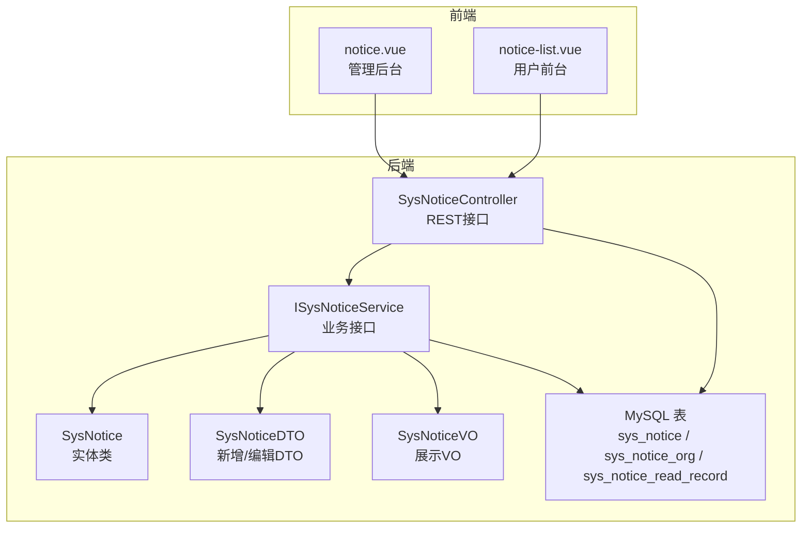
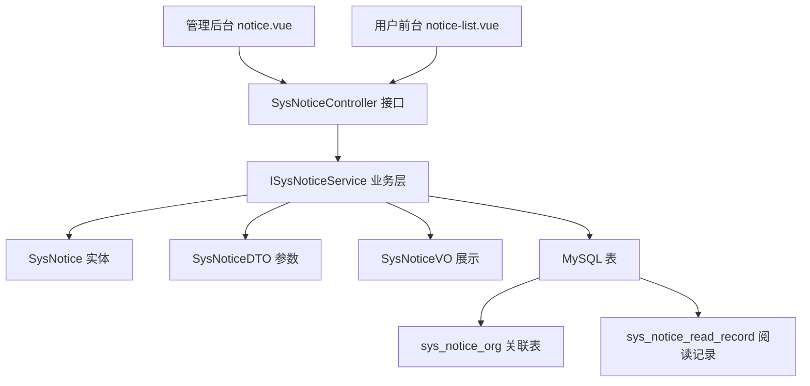
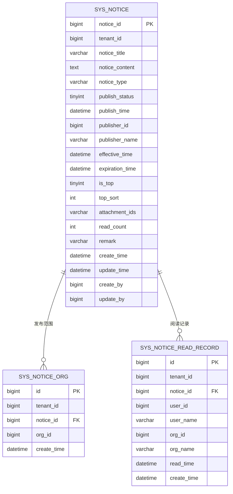
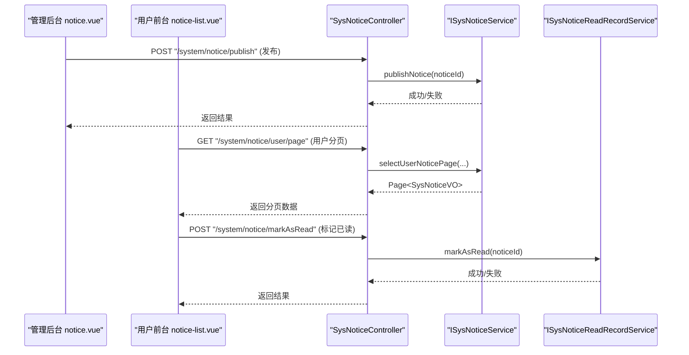
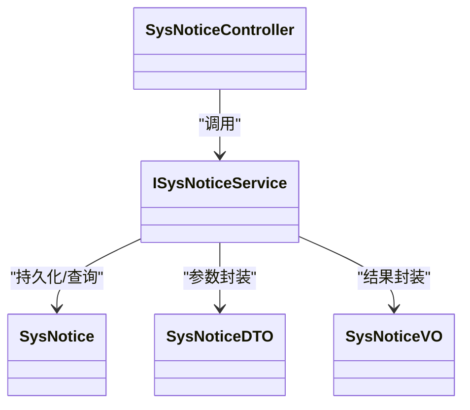

# 公告管理

<cite>
**本文引用的文件**
- [forge/forge-framework/forge-plugin-parent/forge-plugin-system/src/main/java/com/mdframe/forge/plugin/system/controller/SysNoticeController.java](file://forge/forge-framework/forge-plugin-parent/forge-plugin-system/src/main/java/com/mdframe/forge/plugin/system/controller/SysNoticeController.java)
- [forge/forge-framework/forge-plugin-parent/forge-plugin-system/src/main/java/com/mdframe/forge/plugin/system/entity/SysNotice.java](file://forge/forge-framework/forge-plugin-parent/forge-plugin-system/src/main/java/com/mdframe/forge/plugin/system/entity/SysNotice.java)
- [forge/forge-framework/forge-plugin-parent/forge-plugin-system/src/main/java/com/mdframe/forge/plugin/system/dto/SysNoticeDTO.java](file://forge/forge-framework/forge-plugin-parent/forge-plugin-system/src/main/java/com/mdframe/forge/plugin/system/dto/SysNoticeDTO.java)
- [forge/forge-framework/forge-plugin-parent/forge-plugin-system/src/main/java/com/mdframe/forge/plugin/system/vo/SysNoticeVO.java](file://forge/forge-framework/forge-plugin-parent/forge-plugin-system/src/main/java/com/mdframe/forge/plugin/system/vo/SysNoticeVO.java)
- [forge/forge-framework/forge-plugin-parent/forge-plugin-system/src/main/java/com/mdframe/forge/plugin/system/service/ISysNoticeService.java](file://forge/forge-framework/forge-plugin-parent/forge-plugin-system/src/main/java/com/mdframe/forge/plugin/system/service/ISysNoticeService.java)
- [forge/forge-framework/forge-plugin-parent/forge-plugin-system/src/main/resources/sql/sys_notice.sql](file://forge/forge-framework/forge-plugin-parent/forge-plugin-system/src/main/resources/sql/sys_notice.sql)
- [forge/forge-framework/forge-plugin-parent/forge-plugin-system/src/main/resources/sql/sys_notice_extend.sql](file://forge/forge-framework/forge-plugin-parent/forge-plugin-system/src/main/resources/sql/sys_notice_extend.sql)
- [forge/forge-framework/forge-plugin-parent/forge-plugin-system/src/main/resources/sql/sys_notice_dict.sql](file://forge/forge-framework/forge-plugin-parent/forge-plugin-system/src/main/resources/sql/sys_notice_dict.sql)
- [forge-admin-ui/src/views/system/notice.vue](file://forge-admin-ui/src/views/system/notice.vue)
- [forge-admin-ui/src/views/system/notice-list.vue](file://forge-admin-ui/src/views/system/notice-list.vue)
- [forge/forge-framework/forge-starter-parent/forge-starter-message/src/main/java/com/mdframe/forge/starter/message/channel/WebMessageChannel.java](file://forge/forge-framework/forge-starter-parent/forge-starter-message/src/main/java/com/mdframe/forge/starter/message/channel/WebMessageChannel.java)
</cite>

## 目录
1. [简介](#简介)
2. [项目结构](#项目结构)
3. [核心组件](#核心组件)
4. [架构总览](#架构总览)
5. [详细组件分析](#详细组件分析)
6. [依赖关系分析](#依赖关系分析)
7. [性能考虑](#性能考虑)
8. [故障排查指南](#故障排查指南)
9. [结论](#结论)
10. [附录](#附录)

## 简介
本文件面向Forge框架的企业内部公告管理能力，系统性梳理公告的全生命周期管理与前后端协同机制，覆盖公告发布、编辑、删除、状态管理、发布范围控制、阅读状态跟踪与统计分析、有效期控制、附件管理等关键能力，并提供完整的API接口清单、前端组件说明与典型业务场景示例，帮助快速构建稳定可靠的公告通知体系。

## 项目结构
公告管理功能由后端插件模块与前端UI两部分组成：
- 后端采用Forge插件化架构，核心在系统插件中实现公告实体、服务层、控制器与数据库脚本。
- 前端提供管理后台与用户前台两个视图，分别用于公告的后台治理与前台展示。

图表来源
- [forge/forge-framework/forge-plugin-parent/forge-plugin-system/src/main/java/com/mdframe/forge/plugin/system/controller/SysNoticeController.java](file://forge/forge-framework/forge-plugin-parent/forge-plugin-system/src/main/java/com/mdframe/forge/plugin/system/controller/SysNoticeController.java#L27-L201)
- [forge/forge-framework/forge-plugin-parent/forge-plugin-system/src/main/java/com/mdframe/forge/plugin/system/service/ISysNoticeService.java](file://forge/forge-framework/forge-plugin-parent/forge-plugin-system/src/main/java/com/mdframe/forge/plugin/system/service/ISysNoticeService.java#L16-L83)
- [forge/forge-framework/forge-plugin-parent/forge-plugin-system/src/main/java/com/mdframe/forge/plugin/system/entity/SysNotice.java](file://forge/forge-framework/forge-plugin-parent/forge-plugin-system/src/main/java/com/mdframe/forge/plugin/system/entity/SysNotice.java#L20-L117)
- [forge/forge-framework/forge-plugin-parent/forge-plugin-system/src/main/java/com/mdframe/forge/plugin/system/dto/SysNoticeDTO.java](file://forge/forge-framework/forge-plugin-parent/forge-plugin-system/src/main/java/com/mdframe/forge/plugin/system/dto/SysNoticeDTO.java#L13-L87)
- [forge/forge-framework/forge-plugin-parent/forge-plugin-system/src/main/java/com/mdframe/forge/plugin/system/vo/SysNoticeVO.java](file://forge/forge-framework/forge-plugin-parent/forge-plugin-system/src/main/java/com/mdframe/forge/plugin/system/vo/SysNoticeVO.java#L14-L181)
- [forge/forge-framework/forge-plugin-parent/forge-plugin-system/src/main/resources/sql/sys_notice.sql](file://forge/forge-framework/forge-plugin-parent/forge-plugin-system/src/main/resources/sql/sys_notice.sql#L2-L30)
- [forge-admin-ui/src/views/system/notice.vue](file://forge-admin-ui/src/views/system/notice.vue#L3-L104)
- [forge-admin-ui/src/views/system/notice-list.vue](file://forge-admin-ui/src/views/system/notice-list.vue#L3-L13)

章节来源
- [forge/forge-framework/forge-plugin-parent/forge-plugin-system/src/main/java/com/mdframe/forge/plugin/system/controller/SysNoticeController.java](file://forge/forge-framework/forge-plugin-parent/forge-plugin-system/src/main/java/com/mdframe/forge/plugin/system/controller/SysNoticeController.java#L27-L201)
- [forge/forge-framework/forge-plugin-parent/forge-plugin-system/src/main/resources/sql/sys_notice.sql](file://forge/forge-framework/forge-plugin-parent/forge-plugin-system/src/main/resources/sql/sys_notice.sql#L2-L30)
- [forge-admin-ui/src/views/system/notice.vue](file://forge-admin-ui/src/views/system/notice.vue#L3-L104)
- [forge-admin-ui/src/views/system/notice-list.vue](file://forge-admin-ui/src/views/system/notice-list.vue#L3-L13)

## 核心组件
- 实体模型：SysNotice（公告主表）、SysNoticeVO（前台展示）、SysNoticeDTO（新增/编辑参数）、字典映射（公告类型、发布状态）。
- 服务接口：ISysNoticeService（公告核心业务）、ISysNoticeReadRecordService（阅读记录与统计）。
- 控制器：SysNoticeController（统一REST接口入口）。
- 数据库：sys_notice（公告主表）、sys_notice_org（公告-组织关联）、sys_notice_read_record（阅读记录）。
- 前端：notice.vue（管理后台）、notice-list.vue（用户前台）。

章节来源
- [forge/forge-framework/forge-plugin-parent/forge-plugin-system/src/main/java/com/mdframe/forge/plugin/system/entity/SysNotice.java](file://forge/forge-framework/forge-plugin-parent/forge-plugin-system/src/main/java/com/mdframe/forge/plugin/system/entity/SysNotice.java#L20-L117)
- [forge/forge-framework/forge-plugin-parent/forge-plugin-system/src/main/java/com/mdframe/forge/plugin/system/vo/SysNoticeVO.java](file://forge/forge-framework/forge-plugin-parent/forge-plugin-system/src/main/java/com/mdframe/forge/plugin/system/vo/SysNoticeVO.java#L14-L181)
- [forge/forge-framework/forge-plugin-parent/forge-plugin-system/src/main/java/com/mdframe/forge/plugin/system/dto/SysNoticeDTO.java](file://forge/forge-framework/forge-plugin-parent/forge-plugin-system/src/main/java/com/mdframe/forge/plugin/system/dto/SysNoticeDTO.java#L13-L87)
- [forge/forge-framework/forge-plugin-parent/forge-plugin-system/src/main/java/com/mdframe/forge/plugin/system/service/ISysNoticeService.java](file://forge/forge-framework/forge-plugin-parent/forge-plugin-system/src/main/java/com/mdframe/forge/plugin/system/service/ISysNoticeService.java#L16-L83)
- [forge/forge-framework/forge-plugin-parent/forge-plugin-system/src/main/resources/sql/sys_notice.sql](file://forge/forge-framework/forge-plugin-parent/forge-plugin-system/src/main/resources/sql/sys_notice.sql#L2-L30)
- [forge/forge-framework/forge-plugin-parent/forge-plugin-system/src/main/resources/sql/sys_notice_extend.sql](file://forge/forge-framework/forge-plugin-parent/forge-plugin-system/src/main/resources/sql/sys_notice_extend.sql#L4-L43)
- [forge/forge-framework/forge-plugin-parent/forge-plugin-system/src/main/resources/sql/sys_notice_dict.sql](file://forge/forge-framework/forge-plugin-parent/forge-plugin-system/src/main/resources/sql/sys_notice_dict.sql#L4-L20)
- [forge-admin-ui/src/views/system/notice.vue](file://forge-admin-ui/src/views/system/notice.vue#L164-L625)
- [forge-admin-ui/src/views/system/notice-list.vue](file://forge-admin-ui/src/views/system/notice-list.vue#L84-L328)

## 架构总览
公告管理采用“控制器-服务-实体-数据库”的分层设计，前端通过REST接口与后端交互，后端基于MyBatis-Plus实现数据访问与分页查询，结合字典翻译与租户隔离能力，支撑多组织、多类型、多状态的公告管理需求。

图表来源
- [forge/forge-framework/forge-plugin-parent/forge-plugin-system/src/main/java/com/mdframe/forge/plugin/system/controller/SysNoticeController.java](file://forge/forge-framework/forge-plugin-parent/forge-plugin-system/src/main/java/com/mdframe/forge/plugin/system/controller/SysNoticeController.java#L27-L201)
- [forge/forge-framework/forge-plugin-parent/forge-plugin-system/src/main/java/com/mdframe/forge/plugin/system/service/ISysNoticeService.java](file://forge/forge-framework/forge-plugin-parent/forge-plugin-system/src/main/java/com/mdframe/forge/plugin/system/service/ISysNoticeService.java#L16-L83)
- [forge/forge-framework/forge-plugin-parent/forge-plugin-system/src/main/resources/sql/sys_notice.sql](file://forge/forge-framework/forge-plugin-parent/forge-plugin-system/src/main/resources/sql/sys_notice.sql#L2-L30)
- [forge/forge-framework/forge-plugin-parent/forge-plugin-system/src/main/resources/sql/sys_notice_extend.sql](file://forge/forge-framework/forge-plugin-parent/forge-plugin-system/src/main/resources/sql/sys_notice_extend.sql#L4-L43)
- [forge-admin-ui/src/views/system/notice.vue](file://forge-admin-ui/src/views/system/notice.vue#L3-L104)
- [forge-admin-ui/src/views/system/notice-list.vue](file://forge-admin-ui/src/views/system/notice-list.vue#L3-L13)

## 详细组件分析

### 公告实体模型与数据结构
- 主表字段涵盖公告ID、标题、内容、类型、发布状态、发布时间、发布人、生效/失效时间、置顶开关与排序、附件ID列表、阅读次数、备注等。
- 字典映射：公告类型（NOTICE/ANNOUNCEMENT/NEWS）、发布状态（草稿/已发布/已撤回）、是否置顶（是/否）。
- 关联表：公告-组织关联表用于限定发布范围；阅读记录表用于统计与追踪阅读行为。

图表来源
- [forge/forge-framework/forge-plugin-parent/forge-plugin-system/src/main/resources/sql/sys_notice.sql](file://forge/forge-framework/forge-plugin-parent/forge-plugin-system/src/main/resources/sql/sys_notice.sql#L2-L30)
- [forge/forge-framework/forge-plugin-parent/forge-plugin-system/src/main/resources/sql/sys_notice_extend.sql](file://forge/forge-framework/forge-plugin-parent/forge-plugin-system/src/main/resources/sql/sys_notice_extend.sql#L4-L43)

章节来源
- [forge/forge-framework/forge-plugin-parent/forge-plugin-system/src/main/java/com/mdframe/forge/plugin/system/entity/SysNotice.java](file://forge/forge-framework/forge-plugin-parent/forge-plugin-system/src/main/java/com/mdframe/forge/plugin/system/entity/SysNotice.java#L20-L117)
- [forge/forge-framework/forge-plugin-parent/forge-plugin-system/src/main/resources/sql/sys_notice.sql](file://forge/forge-framework/forge-plugin-parent/forge-plugin-system/src/main/resources/sql/sys_notice.sql#L2-L30)
- [forge/forge-framework/forge-plugin-parent/forge-plugin-system/src/main/resources/sql/sys_notice_extend.sql](file://forge/forge-framework/forge-plugin-parent/forge-plugin-system/src/main/resources/sql/sys_notice_extend.sql#L4-L43)

### 公告类型与状态字典
- 公告类型：通知公告、系统公告、新闻动态。
- 发布状态：草稿、已发布、已撤回。
- 字典初始化脚本确保系统启动时具备标准枚举值，便于前端渲染与后端校验。

章节来源
- [forge/forge-framework/forge-plugin-parent/forge-plugin-system/src/main/resources/sql/sys_notice_dict.sql](file://forge/forge-framework/forge-plugin-parent/forge-plugin-system/src/main/resources/sql/sys_notice_dict.sql#L4-L20)

### 控制器接口与业务流程
- 管理端接口：分页查询、列表查询、详情、新增、编辑、删除、批量删除、发布、撤回、置顶/取消置顶、前台用户分页、未读数量、标记已读、统计与用户列表。
- 前台接口：用户可见公告分页、未读数量、标记已读、详情（含阅读次数+1）。

图表来源
- [forge/forge-framework/forge-plugin-parent/forge-plugin-system/src/main/java/com/mdframe/forge/plugin/system/controller/SysNoticeController.java](file://forge/forge-framework/forge-plugin-parent/forge-plugin-system/src/main/java/com/mdframe/forge/plugin/system/controller/SysNoticeController.java#L41-L201)
- [forge-admin-ui/src/views/system/notice.vue](file://forge-admin-ui/src/views/system/notice.vue#L539-L583)
- [forge-admin-ui/src/views/system/notice-list.vue](file://forge-admin-ui/src/views/system/notice-list.vue#L185-L217)

章节来源
- [forge/forge-framework/forge-plugin-parent/forge-plugin-system/src/main/java/com/mdframe/forge/plugin/system/controller/SysNoticeController.java](file://forge/forge-framework/forge-plugin-parent/forge-plugin-system/src/main/java/com/mdframe/forge/plugin/system/controller/SysNoticeController.java#L41-L201)

### 前端组件与交互
- 管理后台（notice.vue）：提供CRUD、发布/撤回、置顶/取消置顶、发布范围（全部组织/指定组织）、组织树选择、富文本编辑、附件上传、统计弹窗（已读/未读用户列表）。
- 用户前台（notice-list.vue）：用户可见公告列表、未读角标、查看详情、标记已读、附件下载。

```mermaid
flowchart TD
Start(["进入公告页面"]) --> LoadList["加载公告列表"]
LoadList --> Action{"用户操作"}
Action --> |查看详情| Detail["打开详情弹窗<br/>标记为已读"]
Action --> |发布/撤回| Publish["调用后端接口"]
Action --> |置顶/取消置顶| Top["调用后端接口"]
Action --> |刷新| Refresh["重新加载列表"]
Detail --> End(["结束"])
Publish --> End
Top --> End
Refresh --> End
```

图表来源
- [forge-admin-ui/src/views/system/notice.vue](file://forge-admin-ui/src/views/system/notice.vue#L539-L613)
- [forge-admin-ui/src/views/system/notice-list.vue](file://forge-admin-ui/src/views/system/notice-list.vue#L185-L235)

章节来源
- [forge-admin-ui/src/views/system/notice.vue](file://forge-admin-ui/src/views/system/notice.vue#L164-L625)
- [forge-admin-ui/src/views/system/notice-list.vue](file://forge-admin-ui/src/views/system/notice-list.vue#L84-L328)

### 阅读状态跟踪与统计
- 阅读记录表记录用户对公告的阅读行为，支持按公告维度统计“应读人数、已读人数、未读人数、阅读率”。
- 前台详情接口在返回详情时增加阅读次数，同时提供“标记已读”能力，确保未读数准确。

章节来源
- [forge/forge-framework/forge-plugin-parent/forge-plugin-system/src/main/resources/sql/sys_notice_extend.sql](file://forge/forge-framework/forge-plugin-parent/forge-plugin-system/src/main/resources/sql/sys_notice_extend.sql#L20-L36)
- [forge/forge-framework/forge-plugin-parent/forge-plugin-system/src/main/java/com/mdframe/forge/plugin/system/controller/SysNoticeController.java](file://forge/forge-framework/forge-plugin-parent/forge-plugin-system/src/main/java/com/mdframe/forge/plugin/system/controller/SysNoticeController.java#L147-L169)

### 有效期与发布范围控制
- 生效/失效时间：公告在生效时间之后、失效时间之前才对外展示。
- 发布范围：支持“全部组织”或“指定组织”，通过sys_notice_org表关联组织ID列表实现定向发布。

章节来源
- [forge/forge-framework/forge-plugin-parent/forge-plugin-system/src/main/java/com/mdframe/forge/plugin/system/dto/SysNoticeDTO.java](file://forge/forge-framework/forge-plugin-parent/forge-plugin-system/src/main/java/com/mdframe/forge/plugin/system/dto/SysNoticeDTO.java#L55-L55)
- [forge/forge-framework/forge-plugin-parent/forge-plugin-system/src/main/resources/sql/sys_notice_extend.sql](file://forge/forge-framework/forge-plugin-parent/forge-plugin-system/src/main/resources/sql/sys_notice_extend.sql#L4-L15)

### 附件管理
- 附件ID列表以逗号分隔存储于公告主表，前端提供文件上传组件并绑定业务类型，支持多附件、大小限制与类型限制。

章节来源
- [forge/forge-framework/forge-plugin-parent/forge-plugin-system/src/main/java/com/mdframe/forge/plugin/system/dto/SysNoticeDTO.java](file://forge/forge-framework/forge-plugin-parent/forge-plugin-system/src/main/java/com/mdframe/forge/plugin/system/dto/SysNoticeDTO.java#L80-L80)
- [forge-admin-ui/src/views/system/notice.vue](file://forge-admin-ui/src/views/system/notice.vue#L383-L394)

### 通知通道与消息集成（可选扩展）
- Web消息通道示例展示了系统通知入库/推送的占位实现思路，便于后续接入消息中心或WebSocket推送。

章节来源
- [forge/forge-framework/forge-starter-parent/forge-starter-message/src/main/java/com/mdframe/forge/starter/message/channel/WebMessageChannel.java](file://forge/forge-framework/forge-starter-parent/forge-starter-message/src/main/java/com/mdframe/forge/starter/message/channel/WebMessageChannel.java#L5-L15)

## 依赖关系分析
- 控制器依赖服务接口，服务实现依赖实体、DTO、VO与数据库访问。
- 前端组件通过统一API配置与后端REST接口对接，管理端负责治理，用户端负责消费。

图表来源
- [forge/forge-framework/forge-plugin-parent/forge-plugin-system/src/main/java/com/mdframe/forge/plugin/system/controller/SysNoticeController.java](file://forge/forge-framework/forge-plugin-parent/forge-plugin-system/src/main/java/com/mdframe/forge/plugin/system/controller/SysNoticeController.java#L35-L36)
- [forge/forge-framework/forge-plugin-parent/forge-plugin-system/src/main/java/com/mdframe/forge/plugin/system/service/ISysNoticeService.java](file://forge/forge-framework/forge-plugin-parent/forge-plugin-system/src/main/java/com/mdframe/forge/plugin/system/service/ISysNoticeService.java#L16-L83)
- [forge/forge-framework/forge-plugin-parent/forge-plugin-system/src/main/java/com/mdframe/forge/plugin/system/entity/SysNotice.java](file://forge/forge-framework/forge-plugin-parent/forge-plugin-system/src/main/java/com/mdframe/forge/plugin/system/entity/SysNotice.java#L20-L117)
- [forge/forge-framework/forge-plugin-parent/forge-plugin-system/src/main/java/com/mdframe/forge/plugin/system/dto/SysNoticeDTO.java](file://forge/forge-framework/forge-plugin-parent/forge-plugin-system/src/main/java/com/mdframe/forge/plugin/system/dto/SysNoticeDTO.java#L13-L87)
- [forge/forge-framework/forge-plugin-parent/forge-plugin-system/src/main/java/com/mdframe/forge/plugin/system/vo/SysNoticeVO.java](file://forge/forge-framework/forge-plugin-parent/forge-plugin-system/src/main/java/com/mdframe/forge/plugin/system/vo/SysNoticeVO.java#L14-L181)

章节来源
- [forge/forge-framework/forge-plugin-parent/forge-plugin-system/src/main/java/com/mdframe/forge/plugin/system/controller/SysNoticeController.java](file://forge/forge-framework/forge-plugin-parent/forge-plugin-system/src/main/java/com/mdframe/forge/plugin/system/controller/SysNoticeController.java#L35-L36)
- [forge/forge-framework/forge-plugin-parent/forge-plugin-system/src/main/java/com/mdframe/forge/plugin/system/service/ISysNoticeService.java](file://forge/forge-framework/forge-plugin-parent/forge-plugin-system/src/main/java/com/mdframe/forge/plugin/system/service/ISysNoticeService.java#L16-L83)

## 性能考虑
- 索引优化：主表针对租户、发布状态、公告类型、生效/失效时间、置顶排序建立索引，提升查询效率。
- 分页查询：管理端与用户端均采用分页接口，避免一次性加载大量数据。
- 阅读统计：建议对阅读记录表按公告ID与用户ID建立联合唯一索引，保证统计准确性与性能。
- 附件处理：大文件建议异步上传与校验，避免阻塞主流程。

章节来源
- [forge/forge-framework/forge-plugin-parent/forge-plugin-system/src/main/resources/sql/sys_notice.sql](file://forge/forge-framework/forge-plugin-parent/forge-plugin-system/src/main/resources/sql/sys_notice.sql#L24-L29)
- [forge/forge-framework/forge-plugin-parent/forge-plugin-system/src/main/resources/sql/sys_notice_extend.sql](file://forge/forge-framework/forge-plugin-parent/forge-plugin-system/src/main/resources/sql/sys_notice_extend.sql#L32-L35)

## 故障排查指南
- 发布/撤回失败：检查公告状态流转逻辑与权限控制，确认接口返回码与日志。
- 置顶异常：核对置顶开关与排序字段，确保排序数值合理。
- 阅读统计不准确：检查阅读记录表数据完整性与去重策略。
- 前台未显示公告：确认生效/失效时间、发布范围与用户组织匹配关系。
- 附件下载失败：检查文件存储与下载地址拼接逻辑。

章节来源
- [forge/forge-framework/forge-plugin-parent/forge-plugin-system/src/main/java/com/mdframe/forge/plugin/system/controller/SysNoticeController.java](file://forge/forge-framework/forge-plugin-parent/forge-plugin-system/src/main/java/com/mdframe/forge/plugin/system/controller/SysNoticeController.java#L115-L142)
- [forge-admin-ui/src/views/system/notice.vue](file://forge-admin-ui/src/views/system/notice.vue#L539-L613)
- [forge-admin-ui/src/views/system/notice-list.vue](file://forge-admin-ui/src/views/system/notice-list.vue#L185-L217)

## 结论
Forge框架的公告管理功能以清晰的分层架构与完善的前后端协作机制，实现了从内容管理到发布控制、从阅读追踪到统计分析的完整闭环。通过字典化与租户隔离、范围控制与有效期管理，满足企业内部多样化公告场景的需求。建议在生产环境中配合缓存与异步任务进一步优化性能与用户体验。

## 附录

### API接口清单（后端）
- 分页查询公告列表：GET /system/notice/page
- 查询公告列表：GET /system/notice/list
- 根据ID查询公告详情：POST /system/notice/getById
- 新增公告：POST /system/notice/add
- 修改公告：POST /system/notice/edit
- 删除公告：POST /system/notice/remove
- 批量删除公告：POST /system/notice/removeBatch
- 发布公告：POST /system/notice/publish
- 撤回公告：POST /system/notice/revoke
- 置顶/取消置顶公告：POST /system/notice/top
- 用户可见公告分页：GET /system/notice/user/page
- 查询当前用户未读公告数量：GET /system/notice/user/unread-count
- 标记公告为已读：POST /system/notice/markAsRead
- 获取公告已读统计：GET /system/notice/statistics/{noticeId}
- 获取公告已读用户列表：GET /system/notice/read-users/{noticeId}
- 获取公告未读用户列表：GET /system/notice/unread-users/{noticeId}

章节来源
- [forge/forge-framework/forge-plugin-parent/forge-plugin-system/src/main/java/com/mdframe/forge/plugin/system/controller/SysNoticeController.java](file://forge/forge-framework/forge-plugin-parent/forge-plugin-system/src/main/java/com/mdframe/forge/plugin/system/controller/SysNoticeController.java#L41-L201)

### 前端组件说明
- 管理后台组件：notice.vue
  - 功能点：CRUD、发布/撤回、置顶/取消置顶、发布范围（全部/指定）、组织树选择、富文本编辑、附件上传、统计弹窗。
- 用户前台组件：notice-list.vue
  - 功能点：用户可见公告列表、未读角标、查看详情、标记已读、附件下载。

章节来源
- [forge-admin-ui/src/views/system/notice.vue](file://forge-admin-ui/src/views/system/notice.vue#L3-L104)
- [forge-admin-ui/src/views/system/notice.vue](file://forge-admin-ui/src/views/system/notice.vue#L164-L625)
- [forge-admin-ui/src/views/system/notice-list.vue](file://forge-admin-ui/src/views/system/notice-list.vue#L3-L13)
- [forge-admin-ui/src/views/system/notice-list.vue](file://forge-admin-ui/src/views/system/notice-list.vue#L84-L328)

### 典型业务场景示例
- 全员公告：选择“全部组织”，设置生效/失效时间，发布后全员可见。
- 部门公告：选择“指定组织”，仅限目标部门可见。
- 紧急通知：设置较短有效期，置顶提高曝光度。
- 统计分析：发布后查看阅读统计，识别传播效果与覆盖范围。

章节来源
- [forge/forge-framework/forge-plugin-parent/forge-plugin-system/src/main/resources/sql/sys_notice_dict.sql](file://forge/forge-framework/forge-plugin-parent/forge-plugin-system/src/main/resources/sql/sys_notice_dict.sql#L4-L20)
- [forge/forge-framework/forge-plugin-parent/forge-plugin-system/src/main/resources/sql/sys_notice_extend.sql](file://forge/forge-framework/forge-plugin-parent/forge-plugin-system/src/main/resources/sql/sys_notice_extend.sql#L4-L15)
- [forge-admin-ui/src/views/system/notice.vue](file://forge-admin-ui/src/views/system/notice.vue#L539-L613)
- [forge-admin-ui/src/views/system/notice-list.vue](file://forge-admin-ui/src/views/system/notice-list.vue#L185-L235)