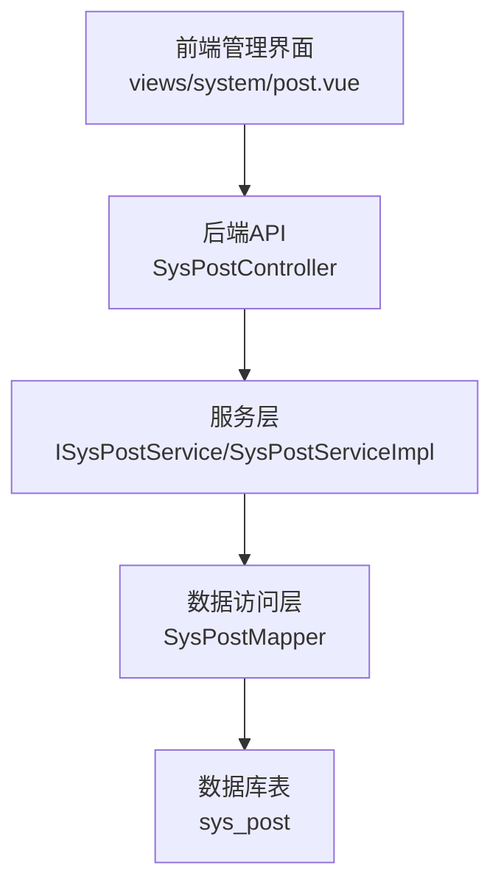
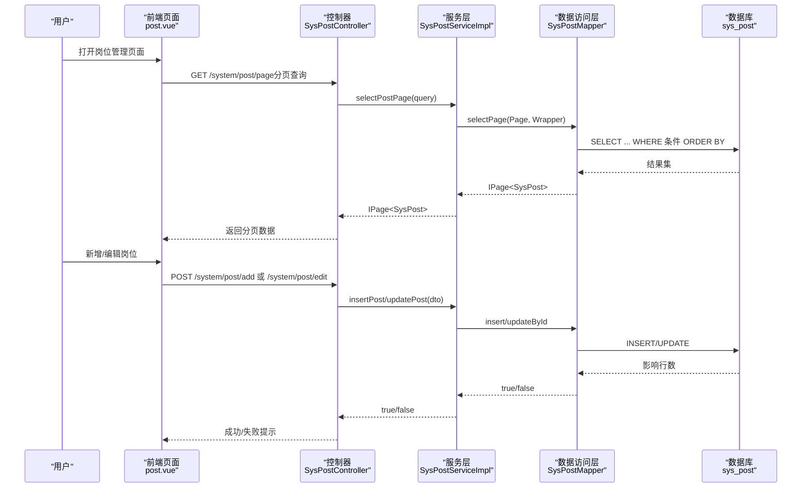
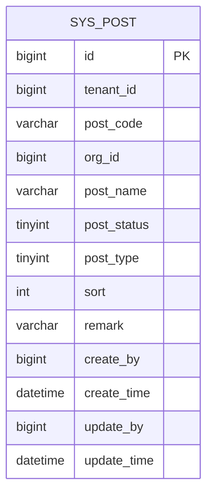
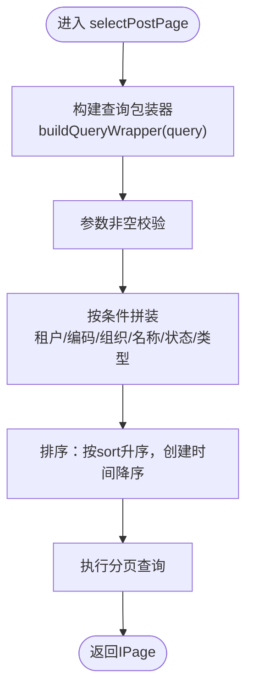
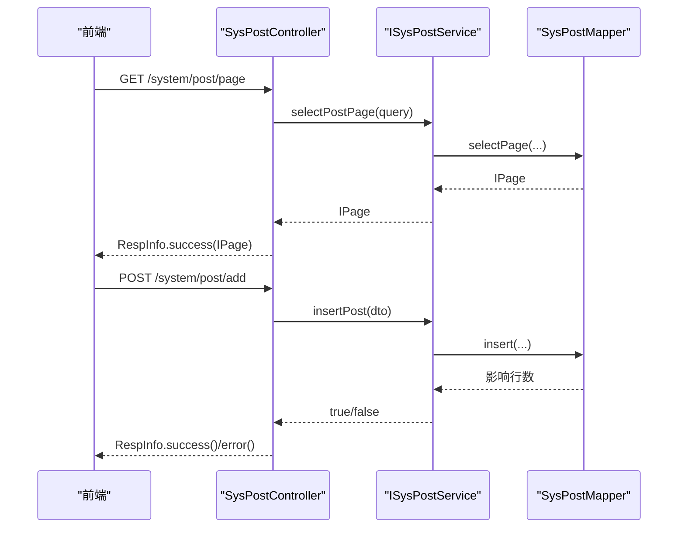
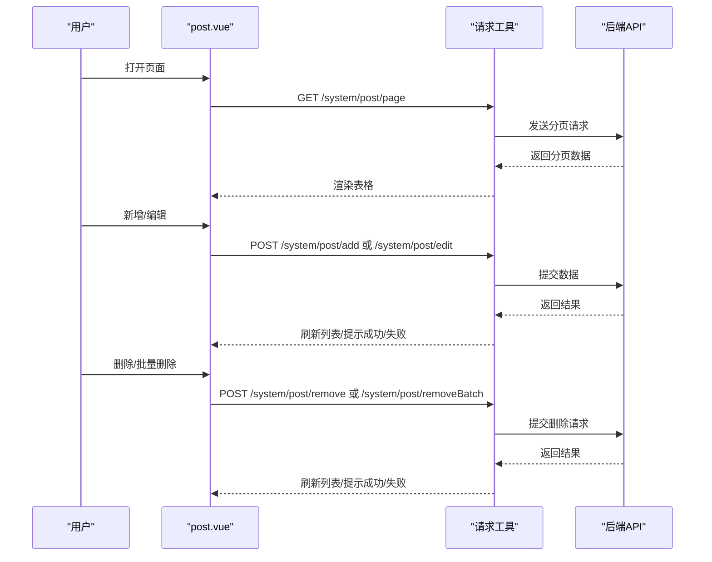
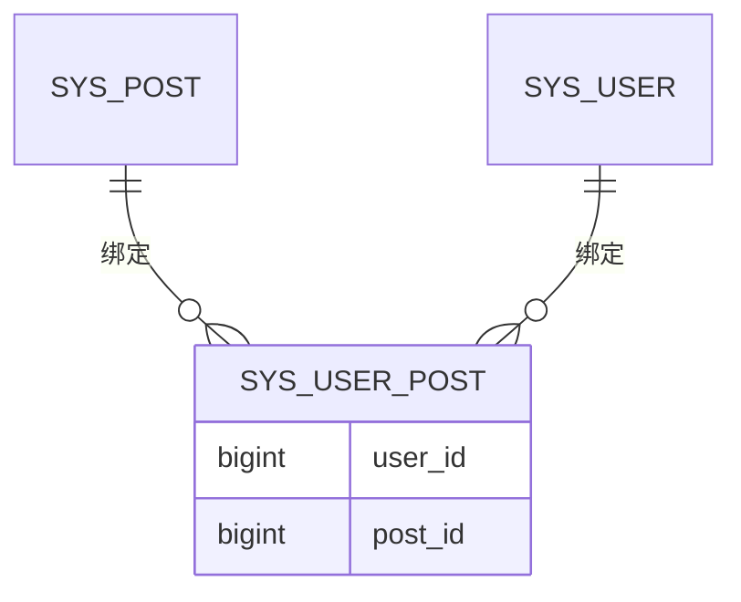
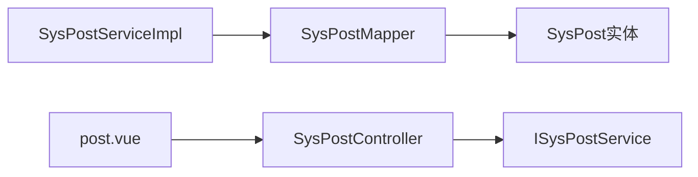

# 岗位管理

<cite>
**本文引用的文件**
- [forge/forge-framework/forge-plugin-parent/forge-plugin-system/src/main/java/com/mdframe/forge/plugin/system/entity/SysPost.java](file://forge/forge-framework/forge-plugin-parent/forge-plugin-system/src/main/java/com/mdframe/forge/plugin/system/entity/SysPost.java)
- [forge/forge-framework/forge-plugin-parent/forge-plugin-system/src/main/java/com/mdframe/forge/plugin/system/dto/SysPostDTO.java](file://forge/forge-framework/forge-plugin-parent/forge-plugin-system/src/main/java/com/mdframe/forge/plugin/system/dto/SysPostDTO.java)
- [forge/forge-framework/forge-plugin-parent/forge-plugin-system/src/main/java/com/mdframe/forge/plugin/system/dto/SysPostQuery.java](file://forge/forge-framework/forge-plugin-parent/forge-plugin-system/src/main/java/com/mdframe/forge/plugin/system/dto/SysPostQuery.java)
- [forge/forge-framework/forge-plugin-parent/forge-plugin-system/src/main/java/com/mdframe/forge/plugin/system/controller/SysPostController.java](file://forge/forge-framework/forge-plugin-parent/forge-plugin-system/src/main/java/com/mdframe/forge/plugin/system/controller/SysPostController.java)
- [forge/forge-framework/forge-plugin-parent/forge-plugin-system/src/main/java/com/mdframe/forge/plugin/system/service/ISysPostService.java](file://forge/forge-framework/forge-plugin-parent/forge-plugin-system/src/main/java/com/mdframe/forge/plugin/system/service/ISysPostService.java)
- [forge/forge-framework/forge-plugin-parent/forge-plugin-system/src/main/java/com/mdframe/forge/plugin/system/service/impl/SysPostServiceImpl.java](file://forge/forge-framework/forge-plugin-parent/forge-plugin-system/src/main/java/com/mdframe/forge/plugin/system/service/impl/SysPostServiceImpl.java)
- [forge/forge-framework/forge-plugin-parent/forge-plugin-system/src/main/java/com/mdframe/forge/plugin/system/mapper/SysPostMapper.java](file://forge/forge-framework/forge-plugin-parent/forge-plugin-system/src/main/java/com/mdframe/forge/plugin/system/mapper/SysPostMapper.java)
- [forge/forge-admin/sql/sys.sql](file://forge/forge-admin/sql/sys.sql)
- [forge-admin-ui/src/views/system/post.vue](file://forge-admin-ui/src/views/system/post.vue)
</cite>

## 目录
1. [简介](#简介)
2. [项目结构](#项目结构)
3. [核心组件](#核心组件)
4. [架构总览](#架构总览)
5. [详细组件分析](#详细组件分析)
6. [依赖关系分析](#依赖关系分析)
7. [性能考量](#性能考量)
8. [故障排查指南](#故障排查指南)
9. [结论](#结论)
10. [附录](#附录)

## 简介
本文件面向Forge框架的企业组织管理场景，系统化阐述“岗位管理”能力的设计与实现，覆盖岗位实体模型、岗位等级与类型设计、岗位与组织架构的关联、岗位状态控制、岗位数据范围配置（结合数据权限）、岗位与用户的绑定关系（通过用户-岗位关联表体现），并提供完整的岗位管理API接口清单、前端岗位管理组件使用说明以及典型业务使用示例，帮助开发者快速构建与扩展企业级岗位体系。

## 项目结构
岗位管理功能由后端系统插件与前端管理界面协同完成：
- 后端采用分层架构：Controller -> Service -> Mapper -> Entity，围绕SysPost表提供标准的增删改查与分页查询能力，并通过租户隔离与排序字段支持多租户与层级展示。
- 前端提供岗位管理页面，基于统一的CRUD组件封装，支持搜索、分页、编辑、删除与批量删除等操作，并联动组织树选择。

图表来源
- [forge-admin-ui/src/views/system/post.vue](file://forge-admin-ui/src/views/system/post.vue#L1-L57)
- [forge/forge-framework/forge-plugin-parent/forge-plugin-system/src/main/java/com/mdframe/forge/plugin/system/controller/SysPostController.java](file://forge/forge-framework/forge-plugin-parent/forge-plugin-system/src/main/java/com/mdframe/forge/plugin/system/controller/SysPostController.java#L1-L93)
- [forge/forge-framework/forge-plugin-parent/forge-plugin-system/src/main/java/com/mdframe/forge/plugin/system/service/impl/SysPostServiceImpl.java](file://forge/forge-framework/forge-plugin-parent/forge-plugin-system/src/main/java/com/mdframe/forge/plugin/system/service/impl/SysPostServiceImpl.java#L1-L87)
- [forge/forge-framework/forge-plugin-parent/forge-plugin-system/src/main/java/com/mdframe/forge/plugin/system/mapper/SysPostMapper.java](file://forge/forge-framework/forge-plugin-parent/forge-plugin-system/src/main/java/com/mdframe/forge/plugin/system/mapper/SysPostMapper.java#L1-L14)

章节来源
- [forge/forge-framework/forge-plugin-parent/forge-plugin-system/src/main/java/com/mdframe/forge/plugin/system/controller/SysPostController.java](file://forge/forge-framework/forge-plugin-parent/forge-plugin-system/src/main/java/com/mdframe/forge/plugin/system/controller/SysPostController.java#L1-L93)
- [forge-admin-ui/src/views/system/post.vue](file://forge-admin-ui/src/views/system/post.vue#L1-L367)

## 核心组件
- 实体模型：SysPost，承载岗位的标识、编码、名称、所属组织、状态、类型、排序与备注等字段，并继承租户实体以支持多租户隔离。
- 数据传输对象：SysPostDTO用于新增/修改；SysPostQuery用于分页与筛选。
- 控制器：SysPostController提供分页、列表、详情、新增、修改、删除、批量删除等REST接口。
- 服务层：ISysPostService定义规范，SysPostServiceImpl实现分页、列表、新增、修改、删除逻辑，并构造查询条件。
- 数据访问层：SysPostMapper继承MyBatis-Plus基础Mapper，复用通用CRUD能力。
- 数据库表：sys_post具备唯一索引（租户+编码、租户+组织+名称）与常用查询索引，保障唯一性与查询效率。

章节来源
- [forge/forge-framework/forge-plugin-parent/forge-plugin-system/src/main/java/com/mdframe/forge/plugin/system/entity/SysPost.java](file://forge/forge-framework/forge-plugin-parent/forge-plugin-system/src/main/java/com/mdframe/forge/plugin/system/entity/SysPost.java#L1-L60)
- [forge/forge-framework/forge-plugin-parent/forge-plugin-system/src/main/java/com/mdframe/forge/plugin/system/dto/SysPostDTO.java](file://forge/forge-framework/forge-plugin-parent/forge-plugin-system/src/main/java/com/mdframe/forge/plugin/system/dto/SysPostDTO.java#L1-L60)
- [forge/forge-framework/forge-plugin-parent/forge-plugin-system/src/main/java/com/mdframe/forge/plugin/system/dto/SysPostQuery.java](file://forge/forge-framework/forge-plugin-parent/forge-plugin-system/src/main/java/com/mdframe/forge/plugin/system/dto/SysPostQuery.java#L1-L46)
- [forge/forge-framework/forge-plugin-parent/forge-plugin-system/src/main/java/com/mdframe/forge/plugin/system/controller/SysPostController.java](file://forge/forge-framework/forge-plugin-parent/forge-plugin-system/src/main/java/com/mdframe/forge/plugin/system/controller/SysPostController.java#L1-L93)
- [forge/forge-framework/forge-plugin-parent/forge-plugin-system/src/main/java/com/mdframe/forge/plugin/system/service/ISysPostService.java](file://forge/forge-framework/forge-plugin-parent/forge-plugin-system/src/main/java/com/mdframe/forge/plugin/system/service/ISysPostService.java#L1-L51)
- [forge/forge-framework/forge-plugin-parent/forge-plugin-system/src/main/java/com/mdframe/forge/plugin/system/service/impl/SysPostServiceImpl.java](file://forge/forge-framework/forge-plugin-parent/forge-plugin-system/src/main/java/com/mdframe/forge/plugin/system/service/impl/SysPostServiceImpl.java#L1-L87)
- [forge/forge-framework/forge-plugin-parent/forge-plugin-system/src/main/java/com/mdframe/forge/plugin/system/mapper/SysPostMapper.java](file://forge/forge-framework/forge-plugin-parent/forge-plugin-system/src/main/java/com/mdframe/forge/plugin/system/mapper/SysPostMapper.java#L1-L14)
- [forge/forge-admin/sql/sys.sql](file://forge/forge-admin/sql/sys.sql#L90-L110)

## 架构总览
岗位管理遵循前后端分离的典型分层架构，前端通过统一的CRUD组件与后端API交互，后端通过控制器暴露REST接口，服务层负责业务编排与查询条件构建，数据访问层对接数据库。

图表来源
- [forge-admin-ui/src/views/system/post.vue](file://forge-admin-ui/src/views/system/post.vue#L1-L57)
- [forge/forge-framework/forge-plugin-parent/forge-plugin-system/src/main/java/com/mdframe/forge/plugin/system/controller/SysPostController.java](file://forge/forge-framework/forge-plugin-parent/forge-plugin-system/src/main/java/com/mdframe/forge/plugin/system/controller/SysPostController.java#L30-L91)
- [forge/forge-framework/forge-plugin-parent/forge-plugin-system/src/main/java/com/mdframe/forge/plugin/system/service/impl/SysPostServiceImpl.java](file://forge/forge-framework/forge-plugin-parent/forge-plugin-system/src/main/java/com/mdframe/forge/plugin/system/service/impl/SysPostServiceImpl.java#L29-L69)
- [forge/forge-framework/forge-plugin-parent/forge-plugin-system/src/main/java/com/mdframe/forge/plugin/system/mapper/SysPostMapper.java](file://forge/forge-framework/forge-plugin-parent/forge-plugin-system/src/main/java/com/mdframe/forge/plugin/system/mapper/SysPostMapper.java#L1-L14)

## 详细组件分析

### 实体模型与数据结构
- SysPost实体包含岗位主键、租户标识、岗位编码（租户内唯一）、所属组织ID、岗位名称、状态、类型、排序、备注等字段，并继承租户实体以支持多租户隔离。
- 数据库表sys_post具备以下关键约束与索引：
  - 唯一索引：租户+岗位编码、租户+组织+岗位名称
  - 辅助索引：租户+组织、岗位状态
  - 排序字段sort用于前端展示顺序控制
- 这些设计确保了岗位在租户内的唯一性、按组织维度的归属清晰、以及按排序与创建时间的稳定展示。

图表来源
- [forge/forge-admin/sql/sys.sql](file://forge/forge-admin/sql/sys.sql#L90-L110)

章节来源
- [forge/forge-framework/forge-plugin-parent/forge-plugin-system/src/main/java/com/mdframe/forge/plugin/system/entity/SysPost.java](file://forge/forge-framework/forge-plugin-parent/forge-plugin-system/src/main/java/com/mdframe/forge/plugin/system/entity/SysPost.java#L1-L60)
- [forge/forge-admin/sql/sys.sql](file://forge/forge-admin/sql/sys.sql#L90-L110)

### 查询与分页逻辑
- SysPostQuery作为分页查询参数载体，支持按租户、岗位编码、所属组织、岗位名称（模糊）、岗位状态、岗位类型进行过滤。
- SysPostServiceImpl.buildQueryWrapper对查询参数进行空值检查与动态拼装，最终按排序字段与创建时间倒序返回结果，保证展示一致性与可预期性。

图表来源
- [forge/forge-framework/forge-plugin-parent/forge-plugin-system/src/main/java/com/mdframe/forge/plugin/system/dto/SysPostQuery.java](file://forge/forge-framework/forge-plugin-parent/forge-plugin-system/src/main/java/com/mdframe/forge/plugin/system/dto/SysPostQuery.java#L1-L46)
- [forge/forge-framework/forge-plugin-parent/forge-plugin-system/src/main/java/com/mdframe/forge/plugin/system/service/impl/SysPostServiceImpl.java](file://forge/forge-framework/forge-plugin-parent/forge-plugin-system/src/main/java/com/mdframe/forge/plugin/system/service/impl/SysPostServiceImpl.java#L71-L85)

章节来源
- [forge/forge-framework/forge-plugin-parent/forge-plugin-system/src/main/java/com/mdframe/forge/plugin/system/dto/SysPostQuery.java](file://forge/forge-framework/forge-plugin-parent/forge-plugin-system/src/main/java/com/mdframe/forge/plugin/system/dto/SysPostQuery.java#L1-L46)
- [forge/forge-framework/forge-plugin-parent/forge-plugin-system/src/main/java/com/mdframe/forge/plugin/system/service/impl/SysPostServiceImpl.java](file://forge/forge-framework/forge-plugin-parent/forge-plugin-system/src/main/java/com/mdframe/forge/plugin/system/service/impl/SysPostServiceImpl.java#L71-L85)

### 控制器与API接口
- 分页查询：GET /system/post/page
- 列表查询：GET /system/post/list
- 获取详情：POST /system/post/getById
- 新增岗位：POST /system/post/add
- 修改岗位：POST /system/post/edit
- 删除岗位：POST /system/post/remove
- 批量删除：POST /system/post/removeBatch

图表来源
- [forge/forge-framework/forge-plugin-parent/forge-plugin-system/src/main/java/com/mdframe/forge/plugin/system/controller/SysPostController.java](file://forge/forge-framework/forge-plugin-parent/forge-plugin-system/src/main/java/com/mdframe/forge/plugin/system/controller/SysPostController.java#L30-L91)
- [forge/forge-framework/forge-plugin-parent/forge-plugin-system/src/main/java/com/mdframe/forge/plugin/system/service/ISysPostService.java](file://forge/forge-framework/forge-plugin-parent/forge-plugin-system/src/main/java/com/mdframe/forge/plugin/system/service/ISysPostService.java#L17-L49)
- [forge/forge-framework/forge-plugin-parent/forge-plugin-system/src/main/java/com/mdframe/forge/plugin/system/mapper/SysPostMapper.java](file://forge/forge-framework/forge-plugin-parent/forge-plugin-system/src/main/java/com/mdframe/forge/plugin/system/mapper/SysPostMapper.java#L1-L14)

章节来源
- [forge/forge-framework/forge-plugin-parent/forge-plugin-system/src/main/java/com/mdframe/forge/plugin/system/controller/SysPostController.java](file://forge/forge-framework/forge-plugin-parent/forge-plugin-system/src/main/java/com/mdframe/forge/plugin/system/controller/SysPostController.java#L1-L93)

### 前端岗位管理组件
- 页面组件：views/system/post.vue
- 功能特性：
  - 使用统一CRUD组件封装，配置API路径与方法映射
  - 支持搜索：岗位名称（模糊）、岗位编码、岗位类型、状态
  - 支持列表：岗位编码、名称、类型、排序、状态、备注、操作列
  - 支持编辑：岗位编码、名称、所属组织（树形下拉）、类型、排序、状态、备注
  - 支持删除与批量删除，删除前二次确认
  - 集成组织树加载，支持树形选择所属组织

图表来源
- [forge-admin-ui/src/views/system/post.vue](file://forge-admin-ui/src/views/system/post.vue#L1-L367)

章节来源
- [forge-admin-ui/src/views/system/post.vue](file://forge-admin-ui/src/views/system/post.vue#L1-L367)

### 岗位与用户绑定（用户-岗位关联）
- 在系统插件中存在用户-岗位关联实体与映射，用于建立用户与岗位的多对多关系，从而实现“某用户在某组织下拥有哪些岗位”的业务语义。
- 该关联关系是实现“岗位权限映射”与“数据范围隔离”的关键纽带：用户通过其岗位获得对应的角色与数据范围，进而影响其可访问的数据边界。

图表来源
- [forge/forge-framework/forge-plugin-parent/forge-plugin-system/src/main/java/com/mdframe/forge/plugin/system/entity/SysUserPost.java](file://forge/forge-framework/forge-plugin-parent/forge-plugin-system/src/main/java/com/mdframe/forge/plugin/system/entity/SysUserPost.java)

章节来源
- [forge/forge-framework/forge-plugin-parent/forge-plugin-system/src/main/java/com/mdframe/forge/plugin/system/entity/SysUserPost.java](file://forge/forge-framework/forge-plugin-parent/forge-plugin-system/src/main/java/com/mdframe/forge/plugin/system/entity/SysUserPost.java)

### 岗位等级与类型设计
- 岗位类型字段用于区分管理岗、技术岗、业务岗、其他等类别，便于后续在权限映射或报表统计中按类型聚合。
- 排序字段用于前端展示顺序控制，值越小越靠前，满足组织内部岗位层级展示需求。

章节来源
- [forge/forge-framework/forge-plugin-parent/forge-plugin-system/src/main/java/com/mdframe/forge/plugin/system/entity/SysPost.java](file://forge/forge-framework/forge-plugin-parent/forge-plugin-system/src/main/java/com/mdframe/forge/plugin/system/entity/SysPost.java#L45-L53)

### 岗位状态控制
- 岗位状态字段支持启用/禁用两种状态，配合控制器与服务层的查询条件，可实现对有效岗位的筛选与展示。

章节来源
- [forge/forge-framework/forge-plugin-parent/forge-plugin-system/src/main/java/com/mdframe/forge/plugin/system/entity/SysPost.java](file://forge/forge-framework/forge-plugin-parent/forge-plugin-system/src/main/java/com/mdframe/forge/plugin/system/entity/SysPost.java#L40-L43)

### 岗位与组织架构关联
- 岗位与组织通过orgId关联，数据库表具备“租户+组织”组合索引，便于按组织维度进行岗位查询与权限计算。

章节来源
- [forge/forge-framework/forge-plugin-parent/forge-plugin-system/src/main/java/com/mdframe/forge/plugin/system/entity/SysPost.java](file://forge/forge-framework/forge-plugin-parent/forge-plugin-system/src/main/java/com/mdframe/forge/plugin/system/entity/SysPost.java#L30-L33)
- [forge/forge-admin/sql/sys.sql](file://forge/forge-admin/sql/sys.sql#L90-L110)

### 岗位数据范围配置与数据隔离策略
- 数据范围配置通常与角色绑定，角色具备数据范围枚举（如全部数据、本租户、本组织、本组织及子组织、个人数据）。岗位通过用户-岗位关联间接影响用户的数据范围，因为用户会因岗位而获得相应角色，从而获得对应的数据范围。
- 在多租户场景下，SysPost继承租户实体，确保岗位数据天然受租户隔离；同时数据库层面也通过“租户+岗位编码/租户+组织+岗位名称”唯一索引强化隔离与唯一性。

章节来源
- [forge/forge-framework/forge-plugin-parent/forge-plugin-system/src/main/java/com/mdframe/forge/plugin/system/entity/SysPost.java](file://forge/forge-framework/forge-plugin-parent/forge-plugin-system/src/main/java/com/mdframe/forge/plugin/system/entity/SysPost.java#L1-L60)
- [forge/forge-admin/sql/sys.sql](file://forge/forge-admin/sql/sys.sql#L90-L110)

### 岗位权限映射机制
- 用户通过岗位获得角色集合，角色再映射到资源权限与数据范围，形成“岗位→角色→权限/数据范围”的链路。
- 该映射关系在系统插件中通过用户-岗位与用户-角色关联实现，岗位作为角色获取的中间层，有助于集中管理权限与数据范围。

章节来源
- [forge/forge-framework/forge-plugin-parent/forge-plugin-system/src/main/java/com/mdframe/forge/plugin/system/entity/SysUserPost.java](file://forge/forge-framework/forge-plugin-parent/forge-plugin-system/src/main/java/com/mdframe/forge/plugin/system/entity/SysUserPost.java)
- [forge/forge-framework/forge-plugin-parent/forge-plugin-system/src/main/java/com/mdframe/forge/plugin/system/entity/SysUserRole.java](file://forge/forge-framework/forge-plugin-parent/forge-plugin-system/src/main/java/com/mdframe/forge/plugin/system/entity/SysUserRole.java)

## 依赖关系分析
- 控制器依赖服务接口，服务实现依赖Mapper与查询包装器，Mapper依赖数据库表。
- 前端通过统一CRUD组件与后端API交互，API路径与方法在前端已明确配置。

图表来源
- [forge/forge-framework/forge-plugin-parent/forge-plugin-system/src/main/java/com/mdframe/forge/plugin/system/controller/SysPostController.java](file://forge/forge-framework/forge-plugin-parent/forge-plugin-system/src/main/java/com/mdframe/forge/plugin/system/controller/SysPostController.java#L1-L93)
- [forge/forge-framework/forge-plugin-parent/forge-plugin-system/src/main/java/com/mdframe/forge/plugin/system/service/ISysPostService.java](file://forge/forge-framework/forge-plugin-parent/forge-plugin-system/src/main/java/com/mdframe/forge/plugin/system/service/ISysPostService.java#L1-L51)
- [forge/forge-framework/forge-plugin-parent/forge-plugin-system/src/main/java/com/mdframe/forge/plugin/system/service/impl/SysPostServiceImpl.java](file://forge/forge-framework/forge-plugin-parent/forge-plugin-system/src/main/java/com/mdframe/forge/plugin/system/service/impl/SysPostServiceImpl.java#L1-L87)
- [forge/forge-framework/forge-plugin-parent/forge-plugin-system/src/main/java/com/mdframe/forge/plugin/system/mapper/SysPostMapper.java](file://forge/forge-framework/forge-plugin-parent/forge-plugin-system/src/main/java/com/mdframe/forge/plugin/system/mapper/SysPostMapper.java#L1-L14)
- [forge-admin-ui/src/views/system/post.vue](file://forge-admin-ui/src/views/system/post.vue#L1-L57)

章节来源
- [forge/forge-framework/forge-plugin-parent/forge-plugin-system/src/main/java/com/mdframe/forge/plugin/system/controller/SysPostController.java](file://forge/forge-framework/forge-plugin-parent/forge-plugin-system/src/main/java/com/mdframe/forge/plugin/system/controller/SysPostController.java#L1-L93)
- [forge/forge-framework/forge-plugin-parent/forge-plugin-system/src/main/java/com/mdframe/forge/plugin/system/service/impl/SysPostServiceImpl.java](file://forge/forge-framework/forge-plugin-parent/forge-plugin-system/src/main/java/com/mdframe/forge/plugin/system/service/impl/SysPostServiceImpl.java#L1-L87)
- [forge-admin-ui/src/views/system/post.vue](file://forge-admin-ui/src/views/system/post.vue#L1-L57)

## 性能考量
- 查询优化：利用数据库索引（租户+组织、岗位状态、唯一索引）减少全表扫描；服务层按需拼装查询条件，避免无效过滤。
- 分页策略：前端传入页码与大小，后端使用MyBatis-Plus分页组件，降低一次性返回大量数据的压力。
- 排序策略：默认按排序字段升序、创建时间降序，兼顾业务顺序与新鲜度。
- 前端渲染：表格列宽与固定列策略减少渲染抖动；树形选择仅在打开时加载组织树，避免不必要的网络请求。

## 故障排查指南
- 新增/修改失败
  - 检查岗位编码在租户内是否唯一（唯一索引约束）
  - 检查所属组织是否存在且有效
  - 检查必填字段是否完整
- 删除失败
  - 确认岗位是否存在且未被用户绑定（若被绑定可能触发外键约束或业务拦截）
- 查询无结果
  - 检查查询参数（租户、组织、状态、类型）是否正确
  - 检查排序与创建时间字段是否符合预期
- 前端交互异常
  - 确认API路径与方法映射正确
  - 检查组织树加载是否成功
  - 确认删除二次确认弹窗逻辑

章节来源
- [forge/forge-framework/forge-plugin-parent/forge-plugin-system/src/main/java/com/mdframe/forge/plugin/system/service/impl/SysPostServiceImpl.java](file://forge/forge-framework/forge-plugin-parent/forge-plugin-system/src/main/java/com/mdframe/forge/plugin/system/service/impl/SysPostServiceImpl.java#L71-L85)
- [forge-admin-ui/src/views/system/post.vue](file://forge-admin-ui/src/views/system/post.vue#L308-L354)

## 结论
Forge框架的岗位管理模块以SysPost为核心，结合统一的分层架构与前端CRUD组件，提供了从数据模型、查询条件、API接口到前端页面的完整闭环。通过租户隔离、唯一索引与排序字段，保障了岗位数据的唯一性与展示可控；通过用户-岗位关联与角色映射，为后续的权限与数据范围控制打下坚实基础。建议在实际业务中结合组织架构与角色体系，完善岗位到权限的映射规则与数据范围策略，以满足复杂企业的组织管理需求。

## 附录
- API接口清单（后端）
  - GET /system/post/page：分页查询
  - GET /system/post/list：列表查询
  - POST /system/post/getById：根据ID查询详情
  - POST /system/post/add：新增岗位
  - POST /system/post/edit：修改岗位
  - POST /system/post/remove：删除岗位
  - POST /system/post/removeBatch：批量删除岗位
- 前端页面使用要点
  - 搜索与筛选：岗位名称（模糊）、岗位编码、岗位类型、状态
  - 编辑与新增：岗位编码、名称、所属组织（树形选择）、类型、排序、状态、备注
  - 删除与批量删除：二次确认弹窗，删除成功后刷新列表

章节来源
- [forge/forge-framework/forge-plugin-parent/forge-plugin-system/src/main/java/com/mdframe/forge/plugin/system/controller/SysPostController.java](file://forge/forge-framework/forge-plugin-parent/forge-plugin-system/src/main/java/com/mdframe/forge/plugin/system/controller/SysPostController.java#L30-L91)
- [forge-admin-ui/src/views/system/post.vue](file://forge-admin-ui/src/views/system/post.vue#L86-L122)
- [forge-admin-ui/src/views/system/post.vue](file://forge-admin-ui/src/views/system/post.vue#L181-L271)