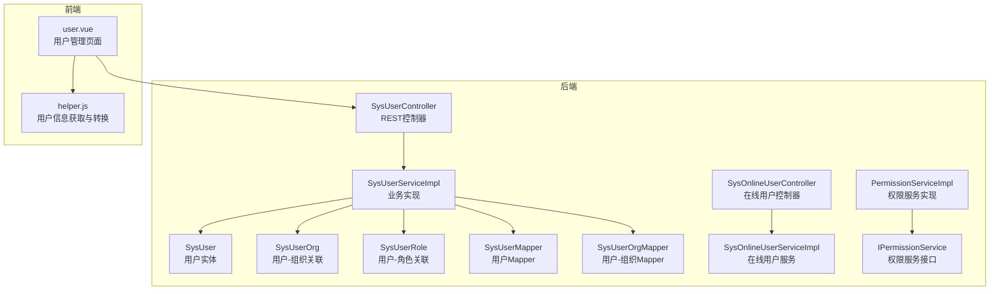
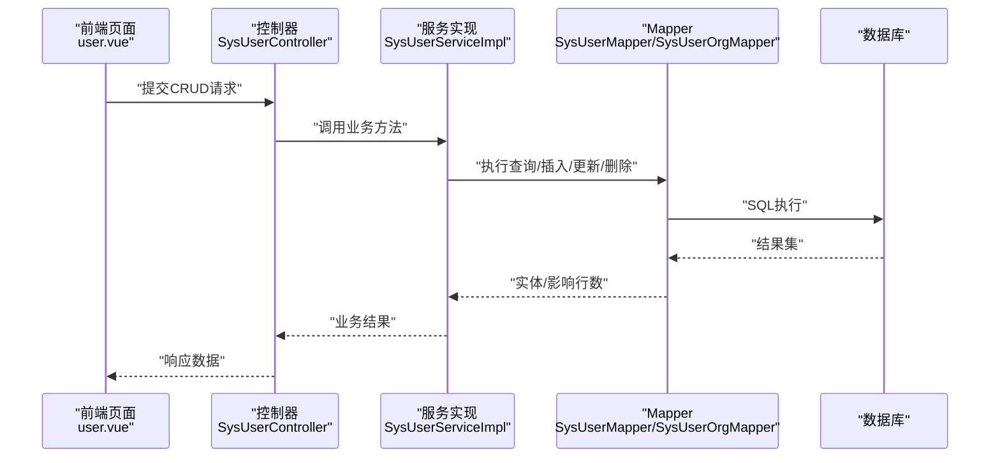
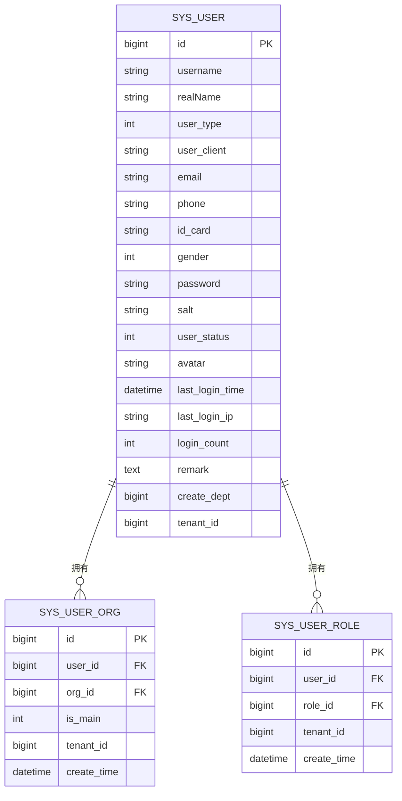
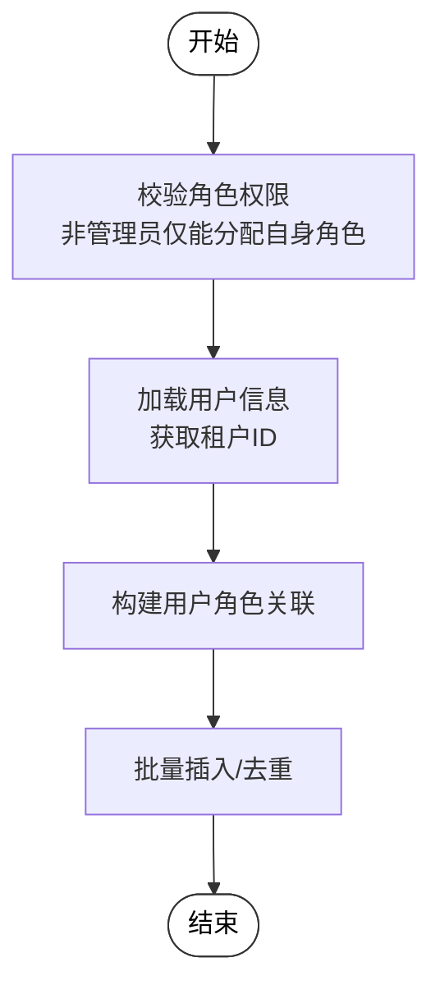
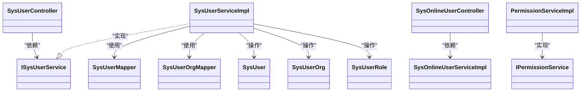

# 用户管理

<cite>
**本文引用的文件**
- [SysUserController.java](file://forge/forge-framework/forge-plugin-parent/forge-plugin-system/src/main/java/com/mdframe/forge/plugin/system/controller/SysUserController.java)
- [SysUserServiceImpl.java](file://forge/forge-framework/forge-plugin-parent/forge-plugin-system/src/main/java/com/mdframe/forge/plugin/system/service/impl/SysUserServiceImpl.java)
- [SysUser.java](file://forge/forge-framework/forge-plugin-parent/forge-plugin-system/src/main/java/com/mdframe/forge/plugin/system/entity/SysUser.java)
- [SysUserDTO.java](file://forge/forge-framework/forge-plugin-parent/forge-plugin-system/src/main/java/com/mdframe/forge/plugin/system/dto/SysUserDTO.java)
- [SysUserQuery.java](file://forge/forge-framework/forge-plugin-parent/forge-plugin-system/src/main/java/com/mdframe/forge/plugin/system/dto/SysUserQuery.java)
- [SysUserOrg.java](file://forge/forge-framework/forge-plugin-parent/forge-plugin-system/src/main/java/com/mdframe/forge/plugin/system/entity/SysUserOrg.java)
- [SysUserRole.java](file://forge/forge-framework/forge-plugin-parent/forge-plugin-system/src/main/java/com/mdframe/forge/plugin/system/entity/SysUserRole.java)
- [SysUserOrgMapper.java](file://forge/forge-framework/forge-plugin-parent/forge-plugin-system/src/main/java/com/mdframe/forge/plugin/system/mapper/SysUserOrgMapper.java)
- [SysUserMapper.java](file://forge/forge-framework/forge-plugin-parent/forge-plugin-system/src/main/java/com/mdframe/forge/plugin/system/mapper/SysUserMapper.java)
- [SysOnlineUserController.java](file://forge/forge-framework/forge-plugin-parent/forge-plugin-system/src/main/java/com/mdframe/forge/plugin/system/controller/SysOnlineUserController.java)
- [SysOnlineUserServiceImpl.java](file://forge/forge-framework/forge-plugin-parent/forge-plugin-system/src/main/java/com/mdframe/forge/plugin/system/service/impl/SysOnlineUserServiceImpl.java)
- [PermissionServiceImpl.java](file://forge/forge-framework/forge-plugin-parent/forge-plugin-system/src/main/java/com/mdframe/forge/plugin/system/service/impl/PermissionServiceImpl.java)
- [IPermissionService.java](file://forge/forge-framework/forge-plugin-parent/forge-plugin-system/src/main/java/com/mdframe/forge/plugin/system/service/impl/PermissionServiceImpl.java)
- [test_auth_data.sql](file://forge/forge-admin/src/main/resources/sql/test_auth_data.sql)
- [user.vue](file://forge-admin-ui/src/views/system/user.vue)
- [helper.js](file://forge-admin-ui/src/store/helper.js)
</cite>

## 目录
1. [简介](#简介)
2. [项目结构](#项目结构)
3. [核心组件](#核心组件)
4. [架构总览](#架构总览)
5. [详细组件分析](#详细组件分析)
6. [依赖关系分析](#依赖关系分析)
7. [性能与安全考虑](#性能与安全考虑)
8. [故障排查指南](#故障排查指南)
9. [结论](#结论)
10. [附录](#附录)

## 简介
本文件面向Forge框架的用户管理功能，提供从后端服务到前端页面的完整使用与扩展指南。内容涵盖用户实体模型、CRUD接口、角色与组织绑定、状态与在线管理、权限控制与安全策略，并给出API清单、前端组件说明与典型使用示例，帮助开发者快速集成与二次开发。

## 项目结构
用户管理功能由后端Spring Boot模块与前端Vue界面共同组成：
- 后端模块位于forge-plugin-system，包含控制器、服务、实体、映射与业务逻辑。
- 前端模块位于forge-admin-ui，包含用户管理页面、权限与会话工具。

图表来源
- [SysUserController.java](file://forge/forge-framework/forge-plugin-parent/forge-plugin-system/src/main/java/com/mdframe/forge/plugin/system/controller/SysUserController.java#L1-L181)
- [SysUserServiceImpl.java](file://forge/forge-framework/forge-plugin-parent/forge-plugin-system/src/main/java/com/mdframe/forge/plugin/system/service/impl/SysUserServiceImpl.java#L1-L337)
- [SysUser.java](file://forge/forge-framework/forge-plugin-parent/forge-plugin-system/src/main/java/com/mdframe/forge/plugin/system/entity/SysUser.java#L1-L114)
- [SysUserOrg.java](file://forge/forge-framework/forge-plugin-parent/forge-plugin-system/src/main/java/com/mdframe/forge/plugin/system/entity/SysUserOrg.java#L1-L51)
- [SysUserRole.java](file://forge/forge-framework/forge-plugin-parent/forge-plugin-system/src/main/java/com/mdframe/forge/plugin/system/entity/SysUserRole.java#L1-L46)
- [SysUserMapper.java](file://forge/forge-framework/forge-plugin-parent/forge-plugin-system/src/main/java/com/mdframe/forge/plugin/system/mapper/SysUserMapper.java#L1-L14)
- [SysUserOrgMapper.java](file://forge/forge-framework/forge-plugin-parent/forge-plugin-system/src/main/java/com/mdframe/forge/plugin/system/mapper/SysUserOrgMapper.java)
- [SysOnlineUserController.java](file://forge/forge-framework/forge-plugin-parent/forge-plugin-system/src/main/java/com/mdframe/forge/plugin/system/controller/SysOnlineUserController.java)
- [SysOnlineUserServiceImpl.java](file://forge/forge-framework/forge-plugin-parent/forge-plugin-system/src/main/java/com/mdframe/forge/plugin/system/service/impl/SysOnlineUserServiceImpl.java)
- [PermissionServiceImpl.java](file://forge/forge-framework/forge-plugin-parent/forge-plugin-system/src/main/java/com/mdframe/forge/plugin/system/service/impl/PermissionServiceImpl.java#L1-L32)
- [IPermissionService.java](file://forge/forge-framework/forge-plugin-parent/forge-plugin-system/src/main/java/com/mdframe/forge/plugin/system/service/impl/PermissionServiceImpl.java#L1-L25)
- [user.vue](file://forge-admin-ui/src/views/system/user.vue#L1-L304)
- [helper.js](file://forge-admin-ui/src/store/helper.js#L1-L56)

章节来源
- [SysUserController.java](file://forge/forge-framework/forge-plugin-parent/forge-plugin-system/src/main/java/com/mdframe/forge/plugin/system/controller/SysUserController.java#L1-L181)
- [SysUserServiceImpl.java](file://forge/forge-framework/forge-plugin-parent/forge-plugin-system/src/main/java/com/mdframe/forge/plugin/system/service/impl/SysUserServiceImpl.java#L1-L337)
- [user.vue](file://forge-admin-ui/src/views/system/user.vue#L1-L304)

## 核心组件
- 控制器层：提供用户管理REST接口，覆盖分页查询、详情、新增、修改、删除、角色绑定/解绑、组织绑定/解绑、批量删除、重置密码、更新状态、更新个人资料等。
- 服务层：实现业务逻辑，包括分页查询、用户增删改、角色与组织绑定、状态变更、密码重置、个人资料更新、权限溢出校验、主组织一致性维护等。
- 数据模型：用户实体、用户-组织关联、用户-角色关联，以及查询与传输DTO。
- 在线用户：提供在线用户查询与位置解析能力。
- 权限服务：基于登录用户上下文获取API权限列表与校验。

章节来源
- [SysUserController.java](file://forge/forge-framework/forge-plugin-parent/forge-plugin-system/src/main/java/com/mdframe/forge/plugin/system/controller/SysUserController.java#L34-L180)
- [SysUserServiceImpl.java](file://forge/forge-framework/forge-plugin-parent/forge-plugin-system/src/main/java/com/mdframe/forge/plugin/system/service/impl/SysUserServiceImpl.java#L42-L337)
- [SysUser.java](file://forge/forge-framework/forge-plugin-parent/forge-plugin-system/src/main/java/com/mdframe/forge/plugin/system/entity/SysUser.java#L18-L114)
- [SysUserOrg.java](file://forge/forge-framework/forge-plugin-parent/forge-plugin-system/src/main/java/com/mdframe/forge/plugin/system/entity/SysUserOrg.java#L14-L51)
- [SysUserRole.java](file://forge/forge-framework/forge-plugin-parent/forge-plugin-system/src/main/java/com/mdframe/forge/plugin/system/entity/SysUserRole.java#L14-L46)
- [SysUserDTO.java](file://forge/forge-framework/forge-plugin-parent/forge-plugin-system/src/main/java/com/mdframe/forge/plugin/system/dto/SysUserDTO.java#L11-L90)
- [SysUserQuery.java](file://forge/forge-framework/forge-plugin-parent/forge-plugin-system/src/main/java/com/mdframe/forge/plugin/system/dto/SysUserQuery.java#L12-L51)
- [SysOnlineUserController.java](file://forge/forge-framework/forge-plugin-parent/forge-plugin-system/src/main/java/com/mdframe/forge/plugin/system/controller/SysOnlineUserController.java)
- [SysOnlineUserServiceImpl.java](file://forge/forge-framework/forge-plugin-parent/forge-plugin-system/src/main/java/com/mdframe/forge/plugin/system/service/impl/SysOnlineUserServiceImpl.java)
- [PermissionServiceImpl.java](file://forge/forge-framework/forge-plugin-parent/forge-plugin-system/src/main/java/com/mdframe/forge/plugin/system/service/impl/PermissionServiceImpl.java#L23-L32)
- [IPermissionService.java](file://forge/forge-framework/forge-plugin-parent/forge-plugin-system/src/main/java/com/mdframe/forge/plugin/system/service/impl/PermissionServiceImpl.java#L8-L25)

## 架构总览
用户管理采用经典的MVC+分层架构，前后端通过REST API交互；服务层对事务、权限与数据一致性进行严格控制；前端通过统一的CRUD页面组件完成用户管理操作。

图表来源
- [SysUserController.java](file://forge/forge-framework/forge-plugin-parent/forge-plugin-system/src/main/java/com/mdframe/forge/plugin/system/controller/SysUserController.java#L34-L180)
- [SysUserServiceImpl.java](file://forge/forge-framework/forge-plugin-parent/forge-plugin-system/src/main/java/com/mdframe/forge/plugin/system/service/impl/SysUserServiceImpl.java#L42-L337)
- [SysUserMapper.java](file://forge/forge-framework/forge-plugin-parent/forge-plugin-system/src/main/java/com/mdframe/forge/plugin/system/mapper/SysUserMapper.java#L10-L14)
- [SysUserOrgMapper.java](file://forge/forge-framework/forge-plugin-parent/forge-plugin-system/src/main/java/com/mdframe/forge/plugin/system/mapper/SysUserOrgMapper.java)

## 详细组件分析

### 用户实体模型与数据结构
- 用户实体包含标识、认证信息、基本信息、状态与统计字段，支持租户隔离。
- 用户-组织关联记录用户所属组织及主组织标记。
- 用户-角色关联记录用户的角色集合。
- 查询与传输DTO分别用于分页查询参数与新增/修改数据封装。

图表来源
- [SysUser.java](file://forge/forge-framework/forge-plugin-parent/forge-plugin-system/src/main/java/com/mdframe/forge/plugin/system/entity/SysUser.java#L18-L114)
- [SysUserOrg.java](file://forge/forge-framework/forge-plugin-parent/forge-plugin-system/src/main/java/com/mdframe/forge/plugin/system/entity/SysUserOrg.java#L14-L51)
- [SysUserRole.java](file://forge/forge-framework/forge-plugin-parent/forge-plugin-system/src/main/java/com/mdframe/forge/plugin/system/entity/SysUserRole.java#L14-L46)

章节来源
- [SysUser.java](file://forge/forge-framework/forge-plugin-parent/forge-plugin-system/src/main/java/com/mdframe/forge/plugin/system/entity/SysUser.java#L18-L114)
- [SysUserOrg.java](file://forge/forge-framework/forge-plugin-parent/forge-plugin-system/src/main/java/com/mdframe/forge/plugin/system/entity/SysUserOrg.java#L14-L51)
- [SysUserRole.java](file://forge/forge-framework/forge-plugin-parent/forge-plugin-system/src/main/java/com/mdframe/forge/plugin/system/entity/SysUserRole.java#L14-L46)
- [SysUserDTO.java](file://forge/forge-framework/forge-plugin-parent/forge-plugin-system/src/main/java/com/mdframe/forge/plugin/system/dto/SysUserDTO.java#L11-L90)
- [SysUserQuery.java](file://forge/forge-framework/forge-plugin-parent/forge-plugin-system/src/main/java/com/mdframe/forge/plugin/system/dto/SysUserQuery.java#L12-L51)

### 控制器与API接口
- 分页查询：GET /system/user/page
- 详情查询：POST /system/user/getById
- 新增用户：POST /system/user/add
- 修改用户：POST /system/user/edit
- 删除用户：POST /system/user/remove
- 批量删除：POST /system/user/removeBatch
- 绑定角色：POST /system/user/{userId}/roles
- 解除角色：POST /system/user/{userId}/roles/unbind
- 绑定组织：POST /system/user/{userId}/org
- 解除组织：POST /system/user/{userId}/org/unbind
- 批量绑定组织：POST /system/user/{userId}/orgs
- 查询用户角色ID列表：GET /system/user/{userId}/roles
- 查询用户组织ID列表：GET /system/user/{userId}/orgs
- 重置密码：POST /system/user/resetPwd
- 更新状态：POST /system/user/updateStatus
- 更新个人资料：POST /system/user/updateProfile
- 解除封禁：POST /system/user/doUntieDisable

章节来源
- [SysUserController.java](file://forge/forge-framework/forge-plugin-parent/forge-plugin-system/src/main/java/com/mdframe/forge/plugin/system/controller/SysUserController.java#L34-L180)

### 服务层实现要点
- 分页查询：根据用户名、真实姓名、手机号、用户类型、状态、创建部门等条件过滤，按创建时间倒序分页。
- 新增/修改：DTO拷贝至实体；修改时忽略密码字段；新增时密码处理留待后续完善。
- 角色绑定：防权限溢出校验（非管理员仅能分配自身拥有的角色），自动补全租户ID，避免重复插入。
- 组织绑定：检查重复绑定；主组织设置时自动取消其他主组织标记；批量绑定时对比差异并更新。
- 状态与密码：提供状态更新与密码重置接口，密码重置使用安全工具进行加密。
- 个人资料：仅允许更新当前登录用户的基本信息。
- 解除封禁：调用统一平台解封并同步更新数据库状态。

图表来源
- [SysUserServiceImpl.java](file://forge/forge-framework/forge-plugin-parent/forge-plugin-system/src/main/java/com/mdframe/forge/plugin/system/service/impl/SysUserServiceImpl.java#L88-L133)

章节来源
- [SysUserServiceImpl.java](file://forge/forge-framework/forge-plugin-parent/forge-plugin-system/src/main/java/com/mdframe/forge/plugin/system/service/impl/SysUserServiceImpl.java#L42-L337)

### 在线用户与状态管理
- 在线用户：提供在线用户查询与位置解析能力，便于审计与风控。
- 用户状态：支持正常、禁用、锁定三种状态；可通过接口更新。
- 封禁解除：统一平台解封并同步数据库状态。

章节来源
- [SysOnlineUserController.java](file://forge/forge-framework/forge-plugin-parent/forge-plugin-system/src/main/java/com/mdframe/forge/plugin/system/controller/SysOnlineUserController.java)
- [SysOnlineUserServiceImpl.java](file://forge/forge-framework/forge-plugin-parent/forge-plugin-system/src/main/java/com/mdframe/forge/plugin/system/service/impl/SysOnlineUserServiceImpl.java)
- [SysUserServiceImpl.java](file://forge/forge-framework/forge-plugin-parent/forge-plugin-system/src/main/java/com/mdframe/forge/plugin/system/service/impl/SysUserServiceImpl.java#L298-L302)

### 权限控制与安全策略
- API权限：权限服务从登录用户上下文中读取API权限列表，支持通配符匹配。
- 登录态：前端通过统一接口获取用户信息，兼容新旧响应结构。
- 加密注解：控制器启用API加解密注解，提升传输安全性。

章节来源
- [IPermissionService.java](file://forge/forge-framework/forge-plugin-parent/forge-plugin-system/src/main/java/com/mdframe/forge/plugin/system/service/impl/PermissionServiceImpl.java#L8-L25)
- [PermissionServiceImpl.java](file://forge/forge-framework/forge-plugin-parent/forge-plugin-system/src/main/java/com/mdframe/forge/plugin/system/service/impl/PermissionServiceImpl.java#L23-L32)
- [helper.js](file://forge-admin-ui/src/store/helper.js#L5-L56)
- [SysUserController.java](file://forge/forge-framework/forge-plugin-parent/forge-plugin-system/src/main/java/com/mdframe/forge/plugin/system/controller/SysUserController.java#L24-L26)

### 前端页面组件说明
- 页面组件：基于统一的CRUD页面组件，配置API路径与Schema，支持分页、搜索、编辑、授权、组织绑定、重置密码等操作。
- 表单校验：包含密码长度等基础校验规则。
- 用户状态与类型：提供下拉选项供选择。
- 操作入口：在表格中提供编辑、授权、组织绑定、重置密码等快捷操作。

章节来源
- [user.vue](file://forge-admin-ui/src/views/system/user.vue#L1-L304)

## 依赖关系分析
- 控制器依赖服务接口，服务实现依赖Mapper与实体。
- 在线用户控制器与服务独立于用户管理核心流程，但共享会话与租户上下文。
- 权限服务依赖会话工具获取当前用户，用于API权限校验。

图表来源
- [SysUserController.java](file://forge/forge-framework/forge-plugin-parent/forge-plugin-system/src/main/java/com/mdframe/forge/plugin/system/controller/SysUserController.java#L29-L29)
- [SysUserServiceImpl.java](file://forge/forge-framework/forge-plugin-parent/forge-plugin-system/src/main/java/com/mdframe/forge/plugin/system/service/impl/SysUserServiceImpl.java#L36-L36)
- [SysUserMapper.java](file://forge/forge-framework/forge-plugin-parent/forge-plugin-system/src/main/java/com/mdframe/forge/plugin/system/mapper/SysUserMapper.java#L10-L14)
- [SysUserOrgMapper.java](file://forge/forge-framework/forge-plugin-parent/forge-plugin-system/src/main/java/com/mdframe/forge/plugin/system/mapper/SysUserOrgMapper.java)
- [SysUser.java](file://forge/forge-framework/forge-plugin-parent/forge-plugin-system/src/main/java/com/mdframe/forge/plugin/system/entity/SysUser.java#L18-L114)
- [SysUserOrg.java](file://forge/forge-framework/forge-plugin-parent/forge-plugin-system/src/main/java/com/mdframe/forge/plugin/system/entity/SysUserOrg.java#L14-L51)
- [SysUserRole.java](file://forge/forge-framework/forge-plugin-parent/forge-plugin-system/src/main/java/com/mdframe/forge/plugin/system/entity/SysUserRole.java#L14-L46)
- [SysOnlineUserController.java](file://forge/forge-framework/forge-plugin-parent/forge-plugin-system/src/main/java/com/mdframe/forge/plugin/system/controller/SysOnlineUserController.java)
- [SysOnlineUserServiceImpl.java](file://forge/forge-framework/forge-plugin-parent/forge-plugin-system/src/main/java/com/mdframe/forge/plugin/system/service/impl/SysOnlineUserServiceImpl.java)
- [IPermissionService.java](file://forge/forge-framework/forge-plugin-parent/forge-plugin-system/src/main/java/com/mdframe/forge/plugin/system/service/impl/PermissionServiceImpl.java#L8-L25)
- [PermissionServiceImpl.java](file://forge/forge-framework/forge-plugin-parent/forge-plugin-system/src/main/java/com/mdframe/forge/plugin/system/service/impl/PermissionServiceImpl.java#L23-L32)

## 性能与安全考虑
- 性能
  - 分页查询使用MyBatis Plus分页插件，建议在高频查询字段上建立索引（如username、realName、phone、userStatus）。
  - 角色与组织绑定采用批量插入与去重策略，避免重复写入。
  - 在线用户查询建议结合缓存与分页，降低数据库压力。
- 安全
  - 密码重置使用安全工具进行加密存储，新增时密码处理预留完善。
  - 非管理员角色分配受权限溢出校验保护，防止越权分配。
  - 控制器启用API加解密注解，增强传输层安全。
  - 建议在生产环境开启HTTPS与CORS白名单策略。

[本节为通用指导，不直接分析具体文件]

## 故障排查指南
- 新增/修改失败
  - 检查DTO字段是否符合要求，特别是新增时密码字段是否填写。
  - 查看服务层日志，确认是否存在权限溢出或租户ID不一致问题。
- 角色/组织绑定失败
  - 确认用户ID与目标ID有效且未重复绑定。
  - 对于主组织绑定，确保仅有一个主组织标记。
- 重置密码失败
  - 确认用户存在且密码加密流程正确。
- 在线用户查询异常
  - 检查在线用户服务是否正确解析IP与UA，必要时接入第三方IP库。
- 权限不足
  - 确认当前登录用户具备相应API权限，权限列表来源于登录用户上下文。

章节来源
- [SysUserServiceImpl.java](file://forge/forge-framework/forge-plugin-parent/forge-plugin-system/src/main/java/com/mdframe/forge/plugin/system/service/impl/SysUserServiceImpl.java#L88-L133)
- [SysUserServiceImpl.java](file://forge/forge-framework/forge-plugin-parent/forge-plugin-system/src/main/java/com/mdframe/forge/plugin/system/service/impl/SysUserServiceImpl.java#L149-L200)
- [SysUserServiceImpl.java](file://forge/forge-framework/forge-plugin-parent/forge-plugin-system/src/main/java/com/mdframe/forge/plugin/system/service/impl/SysUserServiceImpl.java#L305-L310)
- [SysOnlineUserServiceImpl.java](file://forge/forge-framework/forge-plugin-parent/forge-plugin-system/src/main/java/com/mdframe/forge/plugin/system/service/impl/SysOnlineUserServiceImpl.java)
- [PermissionServiceImpl.java](file://forge/forge-framework/forge-plugin-parent/forge-plugin-system/src/main/java/com/mdframe/forge/plugin/system/service/impl/PermissionServiceImpl.java#L26-L32)

## 结论
Forge框架的用户管理功能通过清晰的分层设计与完善的业务逻辑，提供了从实体建模到API接口、从前端页面到权限控制的完整能力。开发者可基于现有组件快速实现用户CRUD、角色与组织绑定、状态与在线管理、权限与安全策略，并在此基础上进行扩展与定制。

[本节为总结性内容，不直接分析具体文件]

## 附录

### API接口清单（后端）
- GET /system/user/page：分页查询用户列表
- POST /system/user/getById：根据ID查询用户详情
- POST /system/user/add：新增用户
- POST /system/user/edit：修改用户
- POST /system/user/remove：删除用户
- POST /system/user/removeBatch：批量删除用户
- POST /system/user/{userId}/roles：绑定角色
- POST /system/user/{userId}/roles/unbind：解除角色
- POST /system/user/{userId}/org：绑定组织
- POST /system/user/{userId}/org/unbind：解除组织
- POST /system/user/{userId}/orgs：批量绑定组织
- GET /system/user/{userId}/roles：查询用户角色ID列表
- GET /system/user/{userId}/orgs：查询用户组织ID列表
- POST /system/user/resetPwd：重置密码
- POST /system/user/updateStatus：更新状态
- POST /system/user/updateProfile：更新个人资料
- POST /system/user/doUntieDisable：解除封禁

章节来源
- [SysUserController.java](file://forge/forge-framework/forge-plugin-parent/forge-plugin-system/src/main/java/com/mdframe/forge/plugin/system/controller/SysUserController.java#L34-L180)

### 前端页面组件清单（前端）
- 页面：/views/system/user.vue
  - 功能：分页、搜索、编辑、授权、组织绑定、重置密码、状态切换
  - 配置：API路径与Schema、操作按钮、表单校验
- 工具：store/helper.js
  - 功能：获取用户信息、兼容新旧响应结构、提取角色与权限

章节来源
- [user.vue](file://forge-admin-ui/src/views/system/user.vue#L1-L304)
- [helper.js](file://forge-admin-ui/src/store/helper.js#L5-L56)

### 权限与菜单配置参考
- 测试数据中包含用户管理菜单与按钮、用户管理API的示例配置，可用于初始化权限体系。

章节来源
- [test_auth_data.sql](file://forge/forge-admin/src/main/resources/sql/test_auth_data.sql#L45-L54)