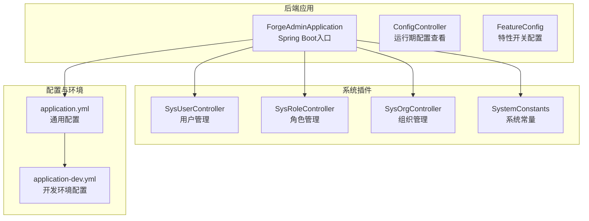
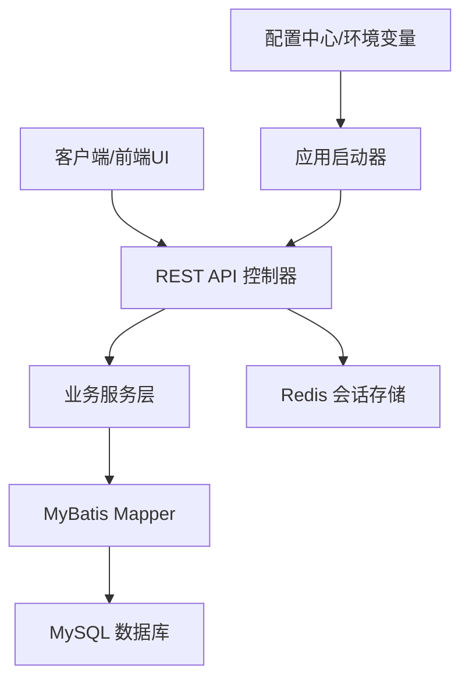
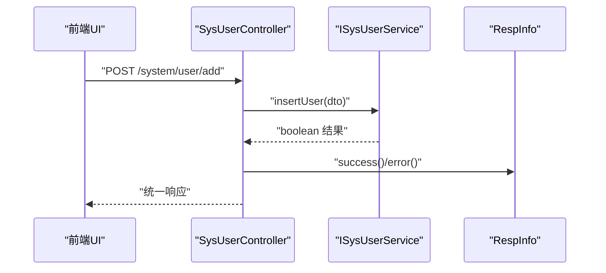
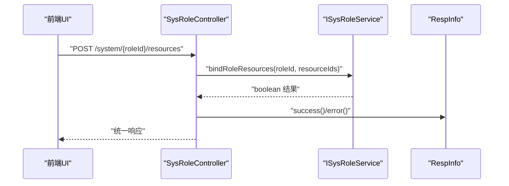
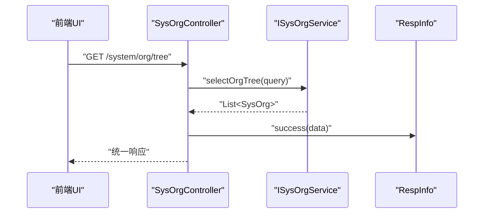
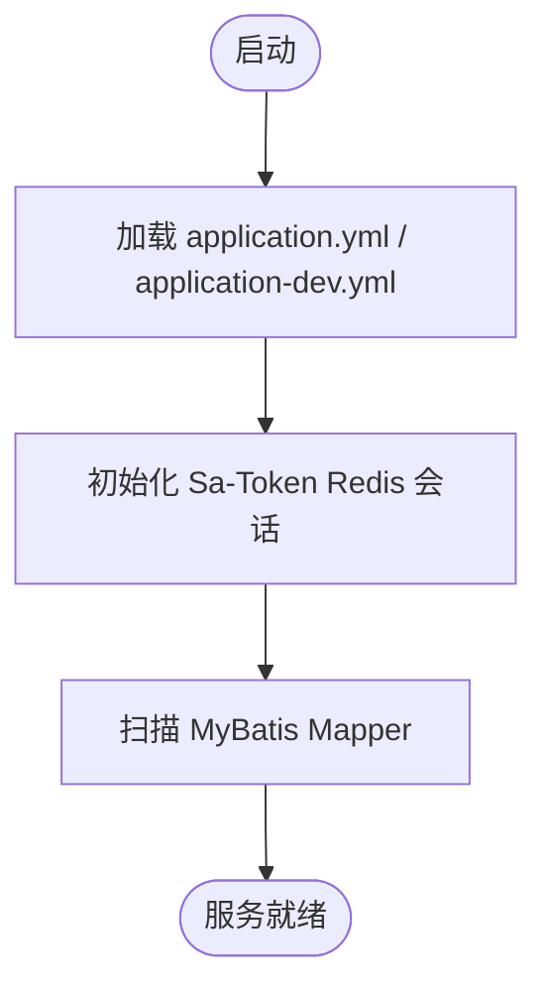
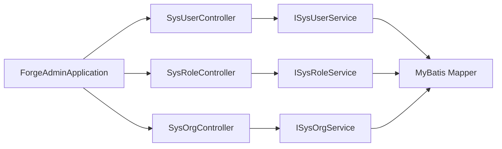

# 系统管理

<cite>
**本文引用的文件**
- [ForgeAdminApplication.java](file://forge/forge-admin/src/main/java/com/mdframe/forge/admin/ForgeAdminApplication.java)
- [ConfigController.java](file://forge/forge-admin/src/main/java/com/mdframe/forge/admin/ConfigController.java)
- [FeatureConfig.java](file://forge/forge-admin/src/main/java/com/mdframe/forge/admin/FeatureConfig.java)
- [application.yml](file://forge/forge-admin/src/main/resources/application.yml)
- [application-dev.yml](file://forge/forge-admin/src/main/resources/application-dev.yml)
- [SystemConstants.java](file://forge/forge-framework/forge-plugin-parent/forge-plugin-system/src/main/java/com/mdframe/forge/plugin/system/constant/SystemConstants.java)
- [SysUserController.java](file://forge/forge-framework/forge-plugin-parent/forge-plugin-system/src/main/java/com/mdframe/forge/plugin/system/controller/SysUserController.java)
- [SysRoleController.java](file://forge/forge-framework/forge-plugin-parent/forge-plugin-system/src/main/java/com/mdframe/forge/plugin/system/controller/SysRoleController.java)
- [SysOrgController.java](file://forge/forge-framework/forge-plugin-parent/forge-plugin-system/src/main/java/com/mdframe/forge/plugin/system/controller/SysOrgController.java)
</cite>

## 目录
1. [简介](#简介)
2. [项目结构](#项目结构)
3. [核心组件](#核心组件)
4. [架构总览](#架构总览)
5. [详细组件分析](#详细组件分析)
6. [依赖关系分析](#依赖关系分析)
7. [性能考量](#性能考量)
8. [故障排查指南](#故障排查指南)
9. [结论](#结论)
10. [附录](#附录)

## 简介
本文件面向Forge框架的系统管理能力，围绕用户管理、角色管理、菜单/资源管理、组织架构管理等核心模块，系统性阐述业务逻辑、数据模型、API接口设计与权限控制机制，并提供配置示例、最佳实践与常见问题解决方案，帮助开发者快速理解与扩展系统管理功能。

## 项目结构
Forge系统管理由“后端应用 + 插件系统 + 前端UI”三部分组成：
- 后端应用：以Spring Boot启动，扫描系统插件包，启用MyBatis Mapper扫描与AOP代理。
- 插件系统：提供系统管理相关控制器与常量定义，统一暴露REST接口。
- 前端UI：通过路由与页面组件承载系统管理界面，调用后端接口完成CRUD与权限控制。

**图示来源**
- [ForgeAdminApplication.java](file://forge/forge-admin/src/main/java/com/mdframe/forge/admin/ForgeAdminApplication.java#L8-L15)
- [ConfigController.java](file://forge/forge-admin/src/main/java/com/mdframe/forge/admin/ConfigController.java#L30-L36)
- [FeatureConfig.java](file://forge/forge-admin/src/main/java/com/mdframe/forge/admin/FeatureConfig.java#L10-L17)
- [application.yml](file://forge/forge-admin/src/main/resources/application.yml#L1-L100)
- [application-dev.yml](file://forge/forge-admin/src/main/resources/application-dev.yml#L1-L70)
- [SysUserController.java](file://forge/forge-framework/forge-plugin-parent/forge-plugin-system/src/main/java/com/mdframe/forge/plugin/system/controller/SysUserController.java#L21-L27)
- [SysRoleController.java](file://forge/forge-framework/forge-plugin-parent/forge-plugin-system/src/main/java/com/mdframe/forge/plugin/system/controller/SysRoleController.java#L20-L26)
- [SysOrgController.java](file://forge/forge-framework/forge-plugin-parent/forge-plugin-system/src/main/java/com/mdframe/forge/plugin/system/controller/SysOrgController.java#L20-L26)
- [SystemConstants.java](file://forge/forge-framework/forge-plugin-parent/forge-plugin-system/src/main/java/com/mdframe/forge/plugin/system/constant/SystemConstants.java#L6-L14)

**章节来源**
- [ForgeAdminApplication.java](file://forge/forge-admin/src/main/java/com/mdframe/forge/admin/ForgeAdminApplication.java#L8-L15)
- [application.yml](file://forge/forge-admin/src/main/resources/application.yml#L65-L86)
- [application-dev.yml](file://forge/forge-admin/src/main/resources/application-dev.yml#L1-L70)

## 核心组件
- 应用启动器：负责扫描系统包、启用MyBatis Mapper与AOP代理，作为系统管理服务的运行载体。
- 配置控制器：提供运行期配置查看接口，便于调试与运维观察。
- 特性开关：基于配置项动态启用/禁用特定功能，支持数据库驱动的特性控制。
- 系统常量：集中定义系统状态码等常量，如用户状态枚举，确保前后端一致性。

**章节来源**
- [ForgeAdminApplication.java](file://forge/forge-admin/src/main/java/com/mdframe/forge/admin/ForgeAdminApplication.java#L8-L15)
- [ConfigController.java](file://forge/forge-admin/src/main/java/com/mdframe/forge/admin/ConfigController.java#L30-L36)
- [FeatureConfig.java](file://forge/forge-admin/src/main/java/com/mdframe/forge/admin/FeatureConfig.java#L10-L17)
- [SystemConstants.java](file://forge/forge-framework/forge-plugin-parent/forge-plugin-system/src/main/java/com/mdframe/forge/plugin/system/constant/SystemConstants.java#L6-L14)

## 架构总览
系统管理采用“插件化控制器 + 统一响应封装”的架构风格，控制器层通过注解开启API加解密与权限忽略策略，服务层负责具体业务逻辑，持久层由MyBatis Plus承担。Redis用于会话存储，HikariCP作为连接池，开发环境配置了MySQL与Redis连接参数。

**图示来源**
- [application.yml](file://forge/forge-admin/src/main/resources/application.yml#L87-L99)
- [application-dev.yml](file://forge/forge-admin/src/main/resources/application-dev.yml#L1-L70)
- [ForgeAdminApplication.java](file://forge/forge-admin/src/main/java/com/mdframe/forge/admin/ForgeAdminApplication.java#L8-L15)

## 详细组件分析

### 用户管理模块
- 职责边界：提供用户全生命周期管理，包括分页查询、详情查询、新增、编辑、删除、批量删除、重置密码、更新状态、更新个人资料，以及用户与角色、组织的绑定/解绑。
- 关键接口
  - 分页查询：GET /system/user/page
  - 详情查询：POST /system/user/getById
  - 新增：POST /system/user/add
  - 编辑：POST /system/user/edit
  - 删除：POST /system/user/remove
  - 批量删除：POST /system/user/removeBatch
  - 绑定角色：POST /system/{userId}/roles
  - 解绑角色：POST /system/{userId}/roles/unbind
  - 绑定组织：POST /system/{userId}/org
  - 解绑组织：POST /system/{userId}/org/unbind
  - 查询用户角色ID列表：GET /system/{userId}/roles
  - 查询用户组织ID列表：GET /system/{userId}/orgs
  - 批量绑定组织：POST /system/{userId}/orgs
  - 重置密码：POST /system/user/resetPwd
  - 更新状态：POST /system/user/updateStatus
  - 更新资料：POST /system/user/updateProfile
- 权限与安全
  - 控制器层启用API加解密与权限忽略注解，便于在系统管理场景下简化鉴权流程；实际生产中建议结合具体权限策略调整。
- 数据模型要点
  - 用户状态可通过系统常量进行约束，例如锁定/解锁状态码，保证状态变更的一致性。
- 错误处理
  - 统一返回封装，成功/失败均有明确提示，便于前端展示与日志追踪。

**图示来源**
- [SysUserController.java](file://forge/forge-framework/forge-plugin-parent/forge-plugin-system/src/main/java/com/mdframe/forge/plugin/system/controller/SysUserController.java#L52-L56)
- [SystemConstants.java](file://forge/forge-framework/forge-plugin-parent/forge-plugin-system/src/main/java/com/mdframe/forge/plugin/system/constant/SystemConstants.java#L8-L13)

**章节来源**
- [SysUserController.java](file://forge/forge-framework/forge-plugin-parent/forge-plugin-system/src/main/java/com/mdframe/forge/plugin/system/controller/SysUserController.java#L34-L179)
- [SystemConstants.java](file://forge/forge-framework/forge-plugin-parent/forge-plugin-system/src/main/java/com/mdframe/forge/plugin/system/constant/SystemConstants.java#L8-L13)

### 角色管理模块
- 职责边界：提供角色全生命周期管理，包括分页查询、详情查询、新增、编辑、删除、批量删除，以及角色与资源（菜单/按钮/接口）的绑定/解绑。
- 关键接口
  - 分页查询：GET /system/role/page
  - 详情查询：POST /system/role/getById
  - 新增：POST /system/role/add
  - 编辑：POST /system/role/edit
  - 删除：POST /system/role/remove
  - 批量删除：POST /system/role/removeBatch
  - 绑定资源：POST /system/{roleId}/resources
  - 解绑资源：POST /system/{roleId}/resources/unbind
  - 查询资源ID列表：GET /system/{roleId}/resources
- 权限与安全
  - 控制器层同样启用API加解密与权限忽略注解，便于系统管理场景下的快速集成。
- 数据模型要点
  - 角色与资源的多对多关系通过中间表维护，接口提供资源ID集合的绑定/解绑能力。

**图示来源**
- [SysRoleController.java](file://forge/forge-framework/forge-plugin-parent/forge-plugin-system/src/main/java/com/mdframe/forge/plugin/system/controller/SysRoleController.java#L87-L91)

**章节来源**
- [SysRoleController.java](file://forge/forge-framework/forge-plugin-parent/forge-plugin-system/src/main/java/com/mdframe/forge/plugin/system/controller/SysRoleController.java#L33-L109)

### 组织架构管理模块
- 职责边界：提供组织全生命周期管理，包括分页查询、树形查询、详情查询、新增、编辑、删除。
- 关键接口
  - 分页查询：GET /system/org/page
  - 树形查询：GET /system/org/tree
  - 详情查询：POST /system/org/getById
  - 新增：POST /system/org/add
  - 编辑：POST /system/org/edit
  - 删除：POST /system/org/remove
- 数据模型要点
  - 树形查询用于构建组织树，支持层级展示与选择，便于用户与组织的多组织绑定场景。

**图示来源**
- [SysOrgController.java](file://forge/forge-framework/forge-plugin-parent/forge-plugin-system/src/main/java/com/mdframe/forge/plugin/system/controller/SysOrgController.java#L42-L46)

**章节来源**
- [SysOrgController.java](file://forge/forge-framework/forge-plugin-parent/forge-plugin-system/src/main/java/com/mdframe/forge/plugin/system/controller/SysOrgController.java#L33-L82)

### 菜单/资源管理与权限控制
- 资源维度：菜单、按钮、接口等资源实体通过“角色-资源”关联实现权限控制。
- 绑定策略：角色管理提供资源绑定/解绑接口，支持批量操作，便于精细化授权。
- 权限忽略：系统管理控制器层使用权限忽略注解，便于后台管理操作；实际业务接口建议按需开启权限校验。

**章节来源**
- [SysRoleController.java](file://forge/forge-framework/forge-plugin-parent/forge-plugin-system/src/main/java/com/mdframe/forge/plugin/system/controller/SysRoleController.java#L87-L109)

### 配置与运行时控制
- 应用配置：统一在application.yml中配置服务器、日志、MyBatis Plus、Sa-Token等参数；开发环境在application-dev.yml中配置数据源与Redis。
- 运行期配置：ConfigController提供统一的配置查看接口，便于调试与运维观察。
- 特性开关：FeatureConfig基于配置项动态启用特性，支持数据库驱动的特性控制。

**图示来源**
- [application.yml](file://forge/forge-admin/src/main/resources/application.yml#L1-L100)
- [application-dev.yml](file://forge/forge-admin/src/main/resources/application-dev.yml#L1-L70)
- [ForgeAdminApplication.java](file://forge/forge-admin/src/main/java/com/mdframe/forge/admin/ForgeAdminApplication.java#L8-L15)

**章节来源**
- [application.yml](file://forge/forge-admin/src/main/resources/application.yml#L1-L100)
- [application-dev.yml](file://forge/forge-admin/src/main/resources/application-dev.yml#L1-L70)
- [ConfigController.java](file://forge/forge-admin/src/main/java/com/mdframe/forge/admin/ConfigController.java#L30-L36)
- [FeatureConfig.java](file://forge/forge-admin/src/main/java/com/mdframe/forge/admin/FeatureConfig.java#L10-L17)

## 依赖关系分析
- 控制器到服务：各控制器均通过构造注入方式依赖对应服务接口，职责清晰、耦合度低。
- 服务到持久层：服务层通过Mapper访问数据库，遵循分层架构。
- 外部依赖：Redis用于会话存储，HikariCP用于数据库连接池，MyBatis Plus用于ORM映射。

**图示来源**
- [SysUserController.java](file://forge/forge-framework/forge-plugin-parent/forge-plugin-system/src/main/java/com/mdframe/forge/plugin/system/controller/SysUserController.java#L29-L29)
- [SysRoleController.java](file://forge/forge-framework/forge-plugin-parent/forge-plugin-system/src/main/java/com/mdframe/forge/plugin/system/controller/SysRoleController.java#L28-L28)
- [SysOrgController.java](file://forge/forge-framework/forge-plugin-parent/forge-plugin-system/src/main/java/com/mdframe/forge/plugin/system/controller/SysOrgController.java#L28-L28)
- [ForgeAdminApplication.java](file://forge/forge-admin/src/main/java/com/mdframe/forge/admin/ForgeAdminApplication.java#L8-L15)

**章节来源**
- [SysUserController.java](file://forge/forge-framework/forge-plugin-parent/forge-plugin-system/src/main/java/com/mdframe/forge/plugin/system/controller/SysUserController.java#L29-L29)
- [SysRoleController.java](file://forge/forge-framework/forge-plugin-parent/forge-plugin-system/src/main/java/com/mdframe/forge/plugin/system/controller/SysRoleController.java#L28-L28)
- [SysOrgController.java](file://forge/forge-framework/forge-plugin-parent/forge-plugin-system/src/main/java/com/mdframe/forge/plugin/system/controller/SysOrgController.java#L28-L28)

## 性能考量
- 连接池与缓存：HikariCP与Redis配置直接影响并发与会话性能，建议根据QPS与数据规模调优。
- 批量操作：用户/角色/组织支持批量删除与批量绑定，减少网络往返，提升吞吐。
- 分页查询：用户与组织提供分页接口，避免一次性拉取大量数据导致内存压力。
- 加解密开销：API加解密注解带来一定CPU开销，建议仅在必要接口启用或按需配置。

## 故障排查指南
- 启动失败
  - 检查application.yml与application-dev.yml中的数据源与Redis配置是否正确。
  - 确认Mapper扫描路径与包名一致，避免找不到Mapper。
- 接口异常
  - 查看统一响应封装的错误信息，定位具体失败原因。
  - 检查Sa-Token Redis连接参数，确认会话可用。
- 权限问题
  - 确认控制器层权限忽略注解的使用场景，避免误放导致鉴权缺失。
  - 校验角色与资源绑定是否正确，确保资源ID集合有效。

**章节来源**
- [application.yml](file://forge/forge-admin/src/main/resources/application.yml#L87-L99)
- [application-dev.yml](file://forge/forge-admin/src/main/resources/application-dev.yml#L1-L70)
- [SysUserController.java](file://forge/forge-framework/forge-plugin-parent/forge-plugin-system/src/main/java/com/mdframe/forge/plugin/system/controller/SysUserController.java#L24-L26)
- [SysRoleController.java](file://forge/forge-framework/forge-plugin-parent/forge-plugin-system/src/main/java/com/mdframe/forge/plugin/system/controller/SysRoleController.java#L23-L25)
- [SysOrgController.java](file://forge/forge-framework/forge-plugin-parent/forge-plugin-system/src/main/java/com/mdframe/forge/plugin/system/controller/SysOrgController.java#L23-L25)

## 结论
Forge框架的系统管理模块以插件化控制器为核心，配合统一响应封装与基础配置，形成可扩展、易维护的后台管理能力。通过用户、角色、组织与资源的协同，可快速搭建权限体系与组织架构。建议在生产环境中结合业务需求完善权限校验与审计日志，持续优化性能与稳定性。

## 附录
- 配置示例
  - 服务器端口与上下文路径：见application.yml。
  - 数据源与Redis：见application-dev.yml。
  - Sa-Token会话存储：见application.yml。
- 最佳实践
  - 将敏感接口纳入权限校验，谨慎使用权限忽略注解。
  - 使用批量接口处理大批量操作，降低网络与数据库压力。
  - 通过树形组织查询与多组织绑定，满足复杂组织架构场景。
- 常见问题
  - 启动找不到Mapper：检查Mapper扫描包名与实际包结构。
  - Redis连接失败：核对host/port/password/database等参数。
  - 角色无权限：确认角色已绑定相应资源且资源ID正确。

**章节来源**
- [application.yml](file://forge/forge-admin/src/main/resources/application.yml#L1-L100)
- [application-dev.yml](file://forge/forge-admin/src/main/resources/application-dev.yml#L1-L70)
- [SysUserController.java](file://forge/forge-framework/forge-plugin-parent/forge-plugin-system/src/main/java/com/mdframe/forge/plugin/system/controller/SysUserController.java#L24-L26)
- [SysRoleController.java](file://forge/forge-framework/forge-plugin-parent/forge-plugin-system/src/main/java/com/mdframe/forge/plugin/system/controller/SysRoleController.java#L23-L25)
- [SysOrgController.java](file://forge/forge-framework/forge-plugin-parent/forge-plugin-system/src/main/java/com/mdframe/forge/plugin/system/controller/SysOrgController.java#L23-L25)