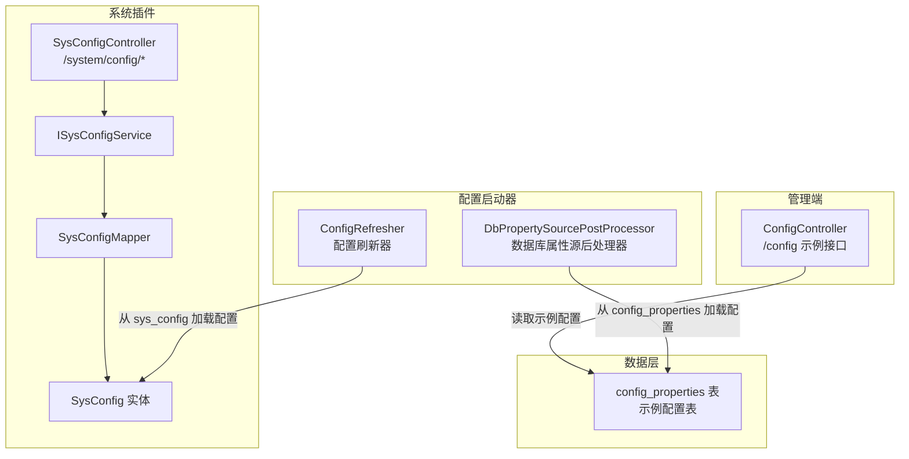
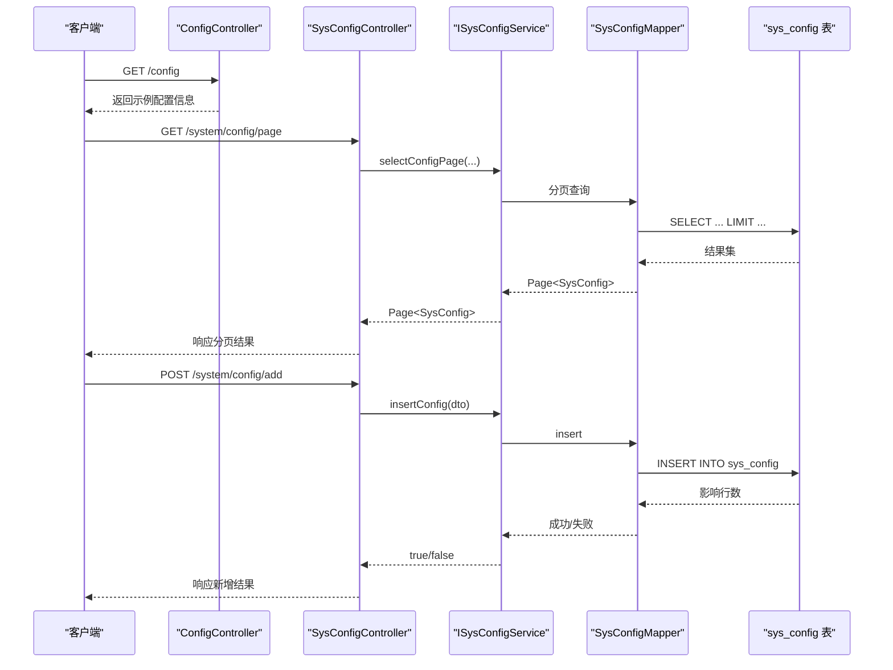
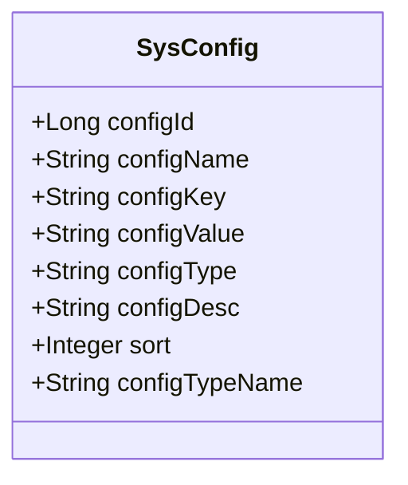
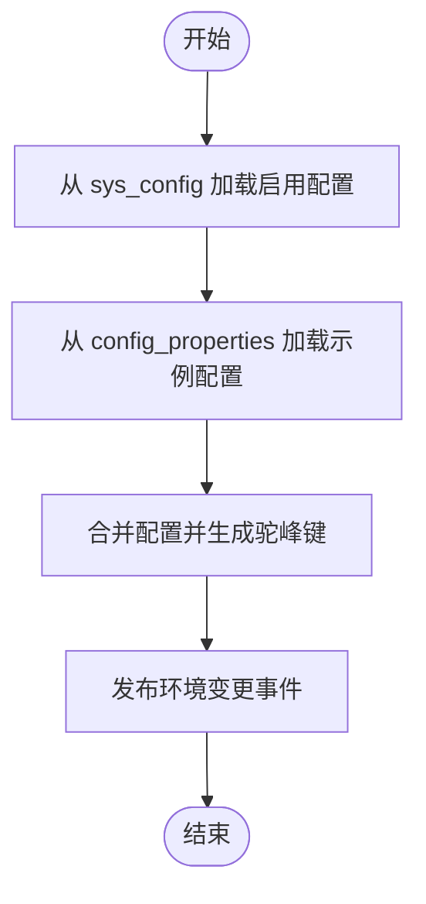
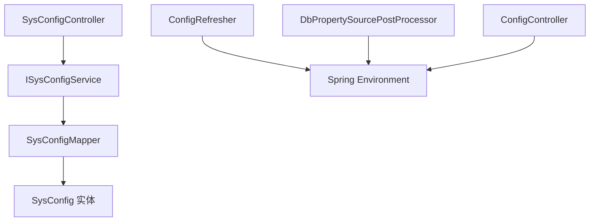

# 系统配置管理

<cite>
**本文引用的文件**
- [ConfigController.java](file://forge/forge-admin/src/main/java/com/mdframe/forge/admin/ConfigController.java)
- [SysConfigController.java](file://forge/forge-framework/forge-plugin-parent/forge-plugin-system/src/main/java/com/mdframe/forge/plugin/system/controller/SysConfigController.java)
- [SysConfig.java](file://forge/forge-framework/forge-plugin-parent/forge-plugin-system/src/main/java/com/mdframe/forge/plugin/system/entity/SysConfig.java)
- [ISysConfigService.java](file://forge/forge-framework/forge-plugin-parent/forge-plugin-system/src/main/java/com/mdframe/forge/plugin/system/service/ISysConfigService.java)
- [SysConfigMapper.java](file://forge/forge-framework/forge-plugin-parent/forge-plugin-system/src/main/java/com/mdframe/forge/plugin/system/mapper/SysConfigMapper.java)
- [config_properties.sql](file://forge/forge-starter-parent/forge-starter-config/sql/config_properties.sql)
- [ConfigRefresher.java](file://forge/forge-starter-parent/forge-starter-config/src/main/java/com/mdframe/forge/starter/property/refresh/ConfigRefresher.java)
- [DbPropertySourcePostProcessor.java](file://forge/forge-starter-parent/forge-starter-config/src/main/java/com/mdframe/forge/starter/property/DbPropertySourcePostProcessor.java)
</cite>

## 目录
1. [简介](#简介)
2. [项目结构](#项目结构)
3. [核心组件](#核心组件)
4. [架构总览](#架构总览)
5. [详细组件分析](#详细组件分析)
6. [依赖关系分析](#依赖关系分析)
7. [性能考虑](#性能考虑)
8. [故障排查指南](#故障排查指南)
9. [结论](#结论)
10. [附录](#附录)

## 简介
本文件面向Forge框架的系统配置管理能力，围绕“配置项创建、配置分类管理、配置值维护、配置状态控制”等核心功能进行系统化梳理，并结合现有代码库中的控制器、实体、服务与数据表结构，给出可落地的实现路径与最佳实践。同时，文档覆盖配置实体模型、配置分类设计、配置值类型管理、配置缓存机制与配置热更新策略，并提供完整的配置管理API接口定义、前端配置表单组件建议以及典型应用场景示例，帮助开发者快速构建灵活、可扩展的系统配置管理体系。

## 项目结构
Forge框架在配置管理方面主要由以下模块协同完成：
- 管理端控制器：提供配置查询与基础示例接口
- 系统插件（System Plugin）：提供系统配置的完整CRUD与分页查询能力
- 配置启动器（Starter Config）：负责从数据库加载配置到Spring Environment，支持热刷新与驼峰键兼容
- 数据库脚本：定义配置属性表结构及初始示例数据

图表来源
- [ConfigController.java](file://forge/forge-admin/src/main/java/com/mdframe/forge/admin/ConfigController.java#L30-L36)
- [SysConfigController.java](file://forge/forge-framework/forge-plugin-parent/forge-plugin-system/src/main/java/com/mdframe/forge/plugin/system/controller/SysConfigController.java#L24-L106)
- [ISysConfigService.java](file://forge/forge-framework/forge-plugin-parent/forge-plugin-system/src/main/java/com/mdframe/forge/plugin/system/service/ISysConfigService.java#L15-L56)
- [SysConfigMapper.java](file://forge/forge-framework/forge-plugin-parent/forge-plugin-system/src/main/java/com/mdframe/forge/plugin/system/mapper/SysConfigMapper.java#L10-L13)
- [SysConfig.java](file://forge/forge-framework/forge-plugin-parent/forge-plugin-system/src/main/java/com/mdframe/forge/plugin/system/entity/SysConfig.java#L18-L61)
- [config_properties.sql](file://forge/forge-starter-parent/forge-starter-config/sql/config_properties.sql#L1-L31)
- [ConfigRefresher.java](file://forge/forge-starter-parent/forge-starter-config/src/main/java/com/mdframe/forge/starter/property/refresh/ConfigRefresher.java#L98-L123)
- [DbPropertySourcePostProcessor.java](file://forge/forge-starter-parent/forge-starter-config/src/main/java/com/mdframe/forge/starter/property/DbPropertySourcePostProcessor.java#L87-L130)

章节来源
- [ConfigController.java](file://forge/forge-admin/src/main/java/com/mdframe/forge/admin/ConfigController.java#L1-L38)
- [SysConfigController.java](file://forge/forge-framework/forge-plugin-parent/forge-plugin-system/src/main/java/com/mdframe/forge/plugin/system/controller/SysConfigController.java#L1-L107)
- [ISysConfigService.java](file://forge/forge-framework/forge-plugin-parent/forge-plugin-system/src/main/java/com/mdframe/forge/plugin/system/service/ISysConfigService.java#L1-L57)
- [SysConfigMapper.java](file://forge/forge-framework/forge-plugin-parent/forge-plugin-system/src/main/java/com/mdframe/forge/plugin/system/mapper/SysConfigMapper.java#L1-L14)
- [SysConfig.java](file://forge/forge-framework/forge-plugin-parent/forge-plugin-system/src/main/java/com/mdframe/forge/plugin/system/entity/SysConfig.java#L1-L62)
- [config_properties.sql](file://forge/forge-starter-parent/forge-starter-config/sql/config_properties.sql#L1-L31)
- [ConfigRefresher.java](file://forge/forge-starter-parent/forge-starter-config/src/main/java/com/mdframe/forge/starter/property/refresh/ConfigRefresher.java#L85-L156)
- [DbPropertySourcePostProcessor.java](file://forge/forge-starter-parent/forge-starter-config/src/main/java/com/mdframe/forge/starter/property/DbPropertySourcePostProcessor.java#L87-L130)

## 核心组件
- 管理端配置示例接口：通过REST接口返回系统配置示例，便于演示配置读取效果
- 系统配置控制器：提供分页查询、列表查询、按键查询、新增、编辑、删除、批量删除等完整能力
- 系统配置实体：映射sys_config表，包含参数主键、名称、键名、键值、类型、描述、排序等字段
- 系统配置服务接口：定义配置管理的业务契约，包括分页、列表、按键查询、新增、编辑、删除等方法
- 系统配置Mapper：MyBatis-Plus基础Mapper，用于与数据库交互
- 配置刷新器：从数据库加载配置到Spring Environment，支持环境变更事件发布与驼峰键兼容
- 数据库属性源后处理器：从config_properties表加载配置，支持驼峰键兼容
- 配置属性表：定义配置键、值、分组、类型、启用状态、创建/更新时间等字段，并提供示例数据

章节来源
- [ConfigController.java](file://forge/forge-admin/src/main/java/com/mdframe/forge/admin/ConfigController.java#L30-L36)
- [SysConfigController.java](file://forge/forge-framework/forge-plugin-parent/forge-plugin-system/src/main/java/com/mdframe/forge/plugin/system/controller/SysConfigController.java#L36-L105)
- [SysConfig.java](file://forge/forge-framework/forge-plugin-parent/forge-plugin-system/src/main/java/com/mdframe/forge/plugin/system/entity/SysConfig.java#L22-L61)
- [ISysConfigService.java](file://forge/forge-framework/forge-plugin-parent/forge-plugin-system/src/main/java/com/mdframe/forge/plugin/system/service/ISysConfigService.java#L17-L55)
- [SysConfigMapper.java](file://forge/forge-framework/forge-plugin-parent/forge-plugin-system/src/main/java/com/mdframe/forge/plugin/system/mapper/SysConfigMapper.java#L10-L13)
- [ConfigRefresher.java](file://forge/forge-starter-parent/forge-starter-config/src/main/java/com/mdframe/forge/starter/property/refresh/ConfigRefresher.java#L98-L148)
- [DbPropertySourcePostProcessor.java](file://forge/forge-starter-parent/forge-starter-config/src/main/java/com/mdframe/forge/starter/property/DbPropertySourcePostProcessor.java#L87-L130)
- [config_properties.sql](file://forge/forge-starter-parent/forge-starter-config/sql/config_properties.sql#L1-L31)

## 架构总览
系统配置管理采用“控制器-服务-持久层-数据源”的分层架构，并通过配置启动器将数据库配置注入到Spring Environment，实现运行时热更新与兼容性支持。

图表来源
- [ConfigController.java](file://forge/forge-admin/src/main/java/com/mdframe/forge/admin/ConfigController.java#L30-L36)
- [SysConfigController.java](file://forge/forge-framework/forge-plugin-parent/forge-plugin-system/src/main/java/com/mdframe/forge/plugin/system/controller/SysConfigController.java#L36-L105)
- [ISysConfigService.java](file://forge/forge-framework/forge-plugin-parent/forge-plugin-system/src/main/java/com/mdframe/forge/plugin/system/service/ISysConfigService.java#L17-L55)
- [SysConfigMapper.java](file://forge/forge-framework/forge-plugin-parent/forge-plugin-system/src/main/java/com/mdframe/forge/plugin/system/mapper/SysConfigMapper.java#L10-L13)

## 详细组件分析

### 配置实体模型（SysConfig）
- 字段设计：参数主键、参数名称、参数键名、参数键值、系统内置标识、参数描述、排序等
- 继承关系：继承租户实体，支持多租户场景
- 字典翻译：系统内置标识通过字典翻译展示为可读文本
- 关系映射：MyBatis-Plus注解映射sys_config表

图表来源
- [SysConfig.java](file://forge/forge-framework/forge-plugin-parent/forge-plugin-system/src/main/java/com/mdframe/forge/plugin/system/entity/SysConfig.java#L18-L61)

章节来源
- [SysConfig.java](file://forge/forge-framework/forge-plugin-parent/forge-plugin-system/src/main/java/com/mdframe/forge/plugin/system/entity/SysConfig.java#L1-L62)

### 配置分类设计
- 分类字段：系统内置标识（Y/N），用于区分系统级配置与业务配置
- 字典翻译：通过字典注解将内部值转换为可读文本，便于前端展示
- 多租户：实体继承租户基类，支持按租户隔离配置

章节来源
- [SysConfig.java](file://forge/forge-framework/forge-plugin-parent/forge-plugin-system/src/main/java/com/mdframe/forge/plugin/system/entity/SysConfig.java#L46-L50)

### 配置值类型管理
- 类型枚举：系统内置标识（yes_no），用于区分系统内置与自定义配置
- 值域约束：通过字典翻译保证前端显示一致性
- 可扩展性：可在后续引入更细粒度的类型校验与序列化策略

章节来源
- [SysConfig.java](file://forge/forge-framework/forge-plugin-parent/forge-plugin-system/src/main/java/com/mdframe/forge/plugin/system/entity/SysConfig.java#L46-L50)

### 配置缓存机制与热更新策略
- 数据库加载：配置刷新器从sys_config表加载启用的配置项，并生成驼峰键以兼容Spring命名规范
- 属性源注入：数据库属性源后处理器从config_properties表加载示例配置，增强开发体验
- 环境变更事件：刷新完成后发布环境变更事件，触发监听器进行配置更新
- 兼容性：同时支持中划线与驼峰两种键格式，提升兼容性

图表来源
- [ConfigRefresher.java](file://forge/forge-starter-parent/forge-starter-config/src/main/java/com/mdframe/forge/starter/property/refresh/ConfigRefresher.java#L98-L123)
- [DbPropertySourcePostProcessor.java](file://forge/forge-starter-parent/forge-starter-config/src/main/java/com/mdframe/forge/starter/property/DbPropertySourcePostProcessor.java#L87-L130)

章节来源
- [ConfigRefresher.java](file://forge/forge-starter-parent/forge-starter-config/src/main/java/com/mdframe/forge/starter/property/refresh/ConfigRefresher.java#L85-L156)
- [DbPropertySourcePostProcessor.java](file://forge/forge-starter-parent/forge-starter-config/src/main/java/com/mdframe/forge/starter/property/DbPropertySourcePostProcessor.java#L87-L130)

### 配置管理API接口
- 分页查询配置列表
  - 方法：GET
  - 路径：/system/config/page
  - 请求参数：分页查询对象、查询条件对象
  - 响应：分页结果
- 查询配置列表
  - 方法：GET
  - 路径：/system/config/list
  - 请求参数：查询条件对象
  - 响应：列表
- 根据配置键名查询配置值
  - 方法：GET
  - 路径：/system/config/configKey/{configKey}
  - 响应：字符串值
- 根据ID查询配置详情
  - 方法：POST
  - 路径：/system/config/getById
  - 请求参数：配置ID
  - 响应：配置实体
- 新增配置
  - 方法：POST
  - 路径：/system/config/add
  - 请求参数：配置DTO
  - 响应：布尔结果
- 修改配置
  - 方法：POST
  - 路径：/system/config/edit
  - 请求参数：配置DTO
  - 响应：布尔结果
- 删除配置
  - 方法：POST
  - 路径：/system/config/remove
  - 请求参数：配置ID
  - 响应：布尔结果
- 批量删除配置
  - 方法：POST
  - 路径：/system/config/removeBatch
  - 请求参数：配置ID数组
  - 响应：布尔结果

章节来源
- [SysConfigController.java](file://forge/forge-framework/forge-plugin-parent/forge-plugin-system/src/main/java/com/mdframe/forge/plugin/system/controller/SysConfigController.java#L36-L105)

### 前端配置表单组件建议
- 基础表单组件：支持输入框、选择框、文本域、数字输入、布尔开关等
- 字典渲染：系统内置标识使用字典渲染，确保显示一致
- 校验规则：键名唯一性校验、键值格式校验（根据类型）、必填项校验
- 操作反馈：统一的成功/失败提示，错误信息友好化
- 列表展示：支持分页、排序、筛选、批量操作（删除）

章节来源
- [SysConfig.java](file://forge/forge-framework/forge-plugin-parent/forge-plugin-system/src/main/java/com/mdframe/forge/plugin/system/entity/SysConfig.java#L46-L50)

### 实际配置应用场景示例
- 系统参数配置：如最大上传大小、会话超时时间、API限流阈值等
- 业务配置管理：如功能开关（用户注册、邮件通知）、业务参数（折扣率、有效期）
- 配置热更新：通过配置刷新器自动拉取最新配置，无需重启服务
- 多租户隔离：不同租户拥有独立配置，避免相互影响

章节来源
- [config_properties.sql](file://forge/forge-starter-parent/forge-starter-config/sql/config_properties.sql#L20-L30)
- [ConfigRefresher.java](file://forge/forge-starter-parent/forge-starter-config/src/main/java/com/mdframe/forge/starter/property/refresh/ConfigRefresher.java#L98-L123)

## 依赖关系分析
系统配置管理的依赖关系如下：

图表来源
- [SysConfigController.java](file://forge/forge-framework/forge-plugin-parent/forge-plugin-system/src/main/java/com/mdframe/forge/plugin/system/controller/SysConfigController.java#L31-L31)
- [ISysConfigService.java](file://forge/forge-framework/forge-plugin-parent/forge-plugin-system/src/main/java/com/mdframe/forge/plugin/system/service/ISysConfigService.java#L15-L15)
- [SysConfigMapper.java](file://forge/forge-framework/forge-plugin-parent/forge-plugin-system/src/main/java/com/mdframe/forge/plugin/system/mapper/SysConfigMapper.java#L10-L10)
- [SysConfig.java](file://forge/forge-framework/forge-plugin-parent/forge-plugin-system/src/main/java/com/mdframe/forge/plugin/system/entity/SysConfig.java#L18-L18)
- [ConfigRefresher.java](file://forge/forge-starter-parent/forge-starter-config/src/main/java/com/mdframe/forge/starter/property/refresh/ConfigRefresher.java#L85-L93)
- [DbPropertySourcePostProcessor.java](file://forge/forge-starter-parent/forge-starter-config/src/main/java/com/mdframe/forge/starter/property/DbPropertySourcePostProcessor.java#L87-L104)
- [ConfigController.java](file://forge/forge-admin/src/main/java/com/mdframe/forge/admin/ConfigController.java#L30-L36)

章节来源
- [SysConfigController.java](file://forge/forge-framework/forge-plugin-parent/forge-plugin-system/src/main/java/com/mdframe/forge/plugin/system/controller/SysConfigController.java#L31-L31)
- [ISysConfigService.java](file://forge/forge-framework/forge-plugin-parent/forge-plugin-system/src/main/java/com/mdframe/forge/plugin/system/service/ISysConfigService.java#L15-L15)
- [SysConfigMapper.java](file://forge/forge-framework/forge-plugin-parent/forge-plugin-system/src/main/java/com/mdframe/forge/plugin/system/mapper/SysConfigMapper.java#L10-L10)
- [SysConfig.java](file://forge/forge-framework/forge-plugin-parent/forge-plugin-system/src/main/java/com/mdframe/forge/plugin/system/entity/SysConfig.java#L18-L18)
- [ConfigRefresher.java](file://forge/forge-starter-parent/forge-starter-config/src/main/java/com/mdframe/forge/starter/property/refresh/ConfigRefresher.java#L85-L93)
- [DbPropertySourcePostProcessor.java](file://forge/forge-starter-parent/forge-starter-config/src/main/java/com/mdframe/forge/starter/property/DbPropertySourcePostProcessor.java#L87-L104)
- [ConfigController.java](file://forge/forge-admin/src/main/java/com/mdframe/forge/admin/ConfigController.java#L30-L36)

## 性能考虑
- 数据库访问：分页查询与索引优化（按分组、启用状态建立索引），减少全表扫描
- 缓存策略：可引入本地缓存或分布式缓存，降低频繁查询数据库的压力
- 热更新频率：合理设置配置刷新周期，避免过于频繁的数据库查询
- 键格式兼容：驼峰键生成仅在加载阶段执行，避免运行时重复计算

章节来源
- [config_properties.sql](file://forge/forge-starter-parent/forge-starter-config/sql/config_properties.sql#L15-L17)
- [ConfigRefresher.java](file://forge/forge-starter-parent/forge-starter-config/src/main/java/com/mdframe/forge/starter/property/refresh/ConfigRefresher.java#L129-L148)

## 故障排查指南
- 配置无法生效：检查sys_config表中配置是否启用，确认键名与驼峰格式是否匹配
- 热更新失败：查看配置刷新器日志，确认数据库连接与SQL执行情况
- 接口异常：检查SysConfigController的请求参数与服务层实现，定位具体异常点
- 示例接口返回为空：确认application.yml中相关配置项是否存在或默认值是否正确

章节来源
- [ConfigRefresher.java](file://forge/forge-starter-parent/forge-starter-config/src/main/java/com/mdframe/forge/starter/property/refresh/ConfigRefresher.java#L89-L92)
- [SysConfigController.java](file://forge/forge-framework/forge-plugin-parent/forge-plugin-system/src/main/java/com/mdframe/forge/plugin/system/controller/SysConfigController.java#L36-L105)
- [ConfigController.java](file://forge/forge-admin/src/main/java/com/mdframe/forge/admin/ConfigController.java#L30-L36)

## 结论
Forge框架的系统配置管理通过“控制器-服务-持久层-数据源”的清晰分层，结合数据库驱动的配置加载与热更新机制，提供了从创建、分类、维护到状态控制的完整能力。配合字典翻译与多租户支持，能够满足复杂业务场景下的配置需求。建议在生产环境中进一步完善缓存策略、监控告警与权限控制，以提升稳定性与可观测性。

## 附录
- 数据库脚本：配置属性表结构与示例数据
- 配置刷新器：从数据库加载配置并发布环境变更事件
- 数据库属性源后处理器：从示例表加载配置，支持驼峰键兼容

章节来源
- [config_properties.sql](file://forge/forge-starter-parent/forge-starter-config/sql/config_properties.sql#L1-L31)
- [ConfigRefresher.java](file://forge/forge-starter-parent/forge-starter-config/src/main/java/com/mdframe/forge/starter/property/refresh/ConfigRefresher.java#L98-L148)
- [DbPropertySourcePostProcessor.java](file://forge/forge-starter-parent/forge-starter-config/src/main/java/com/mdframe/forge/starter/property/DbPropertySourcePostProcessor.java#L87-L130)