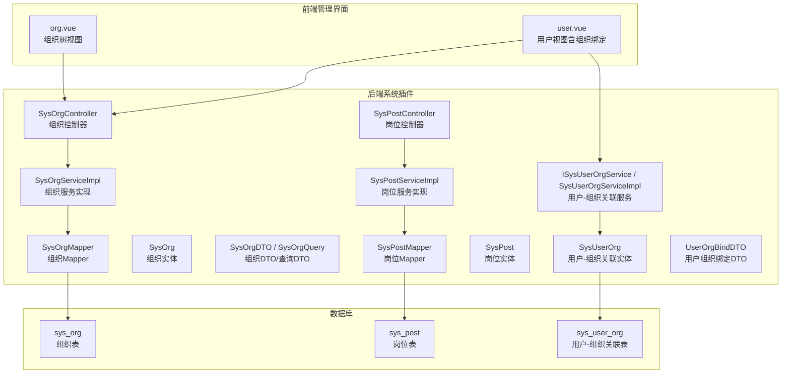
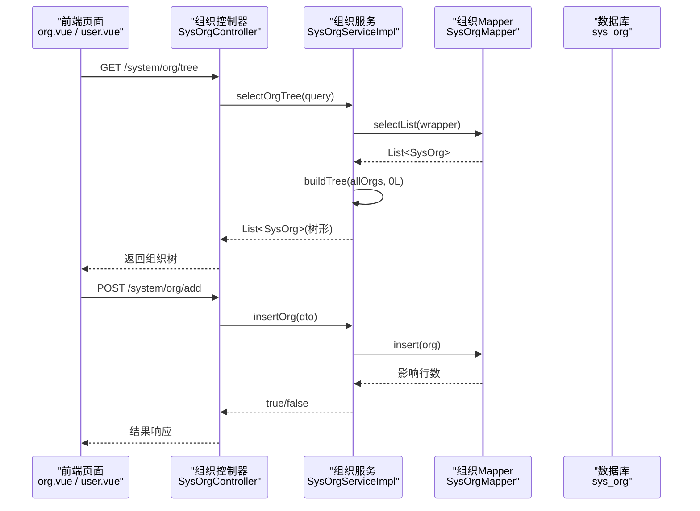
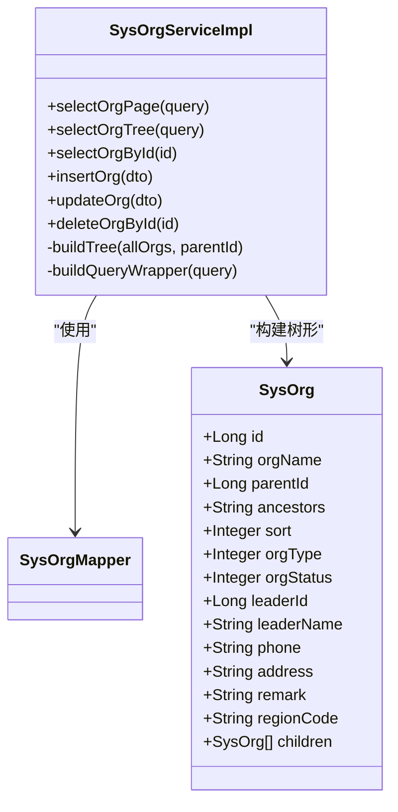
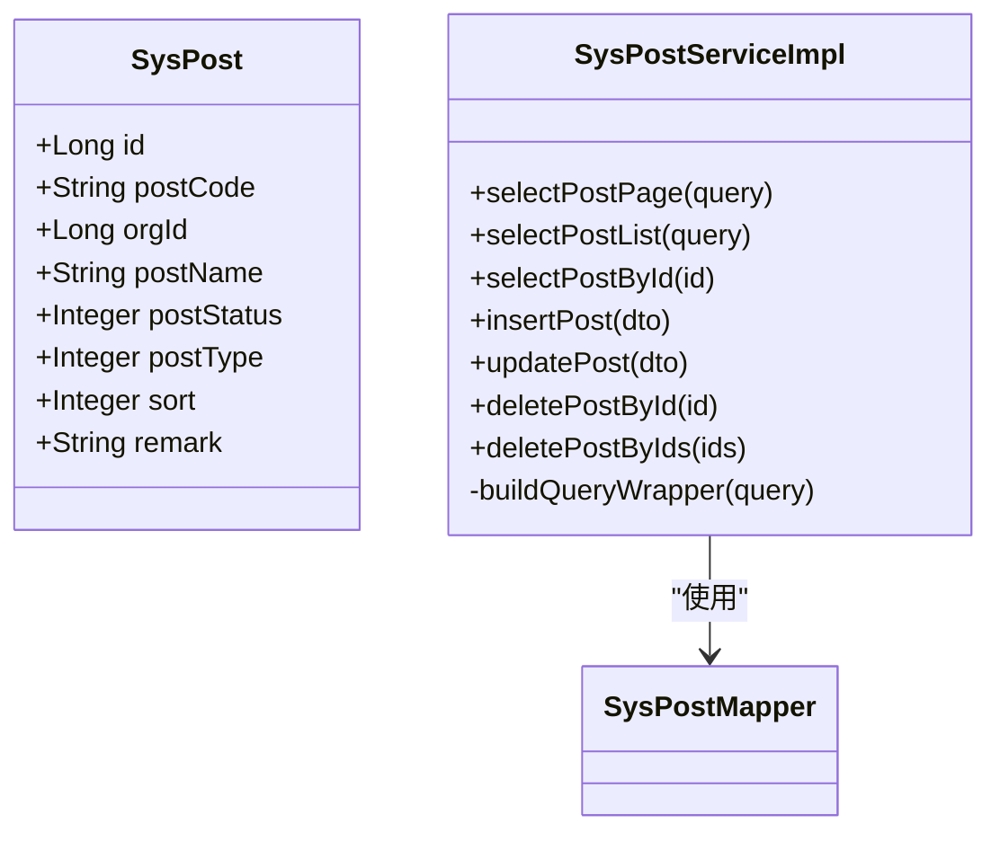
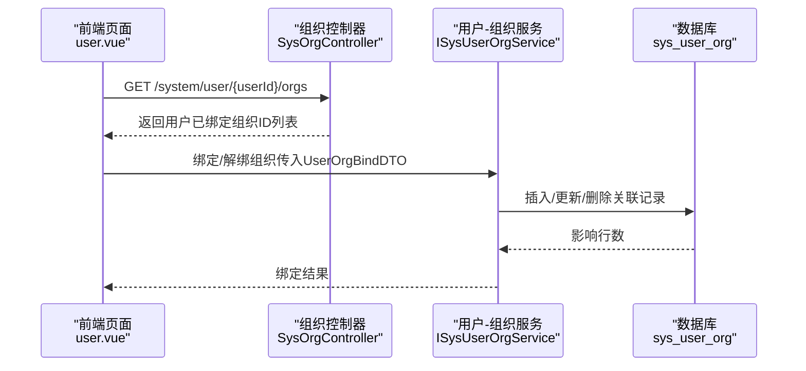
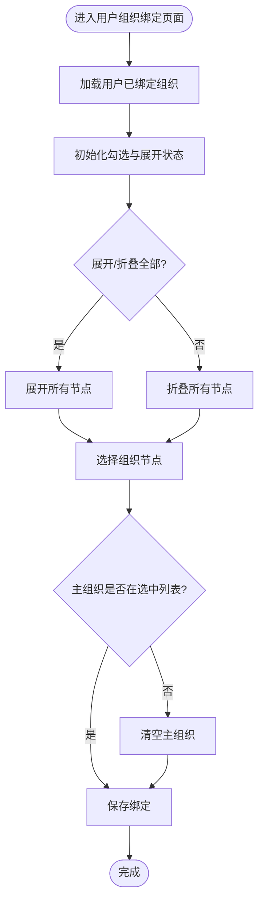
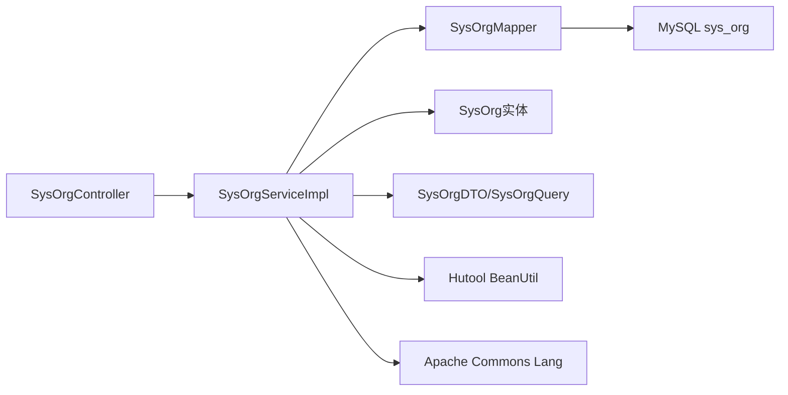

# 组织架构管理

<cite>
**本文引用的文件**
- [SysOrgController.java](file://forge/forge-framework/forge-plugin-parent/forge-plugin-system/src/main/java/com/mdframe/forge/plugin/system/controller/SysOrgController.java)
- [SysOrgServiceImpl.java](file://forge/forge-framework/forge-plugin-parent/forge-plugin-system/src/main/java/com/mdframe/forge/plugin/system/service/impl/SysOrgServiceImpl.java)
- [SysOrgMapper.java](file://forge/forge-framework/forge-plugin-parent/forge-plugin-system/src/main/java/com/mdframe/forge/plugin/system/mapper/SysOrgMapper.java)
- [SysOrgDTO.java](file://forge/forge-framework/forge-plugin-parent/forge-plugin-system/src/main/java/com/mdframe/forge/plugin/system/dto/SysOrgDTO.java)
- [SysOrgQuery.java](file://forge/forge-framework/forge-plugin-parent/forge-plugin-system/src/main/java/com/mdframe/forge/plugin/system/dto/SysOrgQuery.java)
- [SysOrg.java](file://forge/forge-framework/forge-plugin-parent/forge-plugin-system/src/main/java/com/mdframe/forge/plugin/system/entity/SysOrg.java)
- [SysPostController.java](file://forge/forge-framework/forge-plugin-parent/forge-plugin-system/src/main/java/com/mdframe/forge/plugin/system/controller/SysPostController.java)
- [SysPostServiceImpl.java](file://forge/forge-framework/forge-plugin-parent/forge-plugin-system/src/main/java/com/mdframe/forge/plugin/system/service/impl/SysPostServiceImpl.java)
- [SysPostMapper.java](file://forge/forge-framework/forge-plugin-parent/forge-plugin-system/src/main/java/com/mdframe/forge/plugin/system/mapper/SysPostMapper.java)
- [SysPost.java](file://forge/forge-framework/forge-plugin-parent/forge-plugin-system/src/main/java/com/mdframe/forge/plugin/system/entity/SysPost.java)
- [ISysUserOrgService.java](file://forge/forge-framework/forge-plugin-parent/forge-plugin-system/src/main/java/com/mdframe/forge/plugin/system/service/ISysUserOrgService.java)
- [SysUserOrgServiceImpl.java](file://forge/forge-framework/forge-plugin-parent/forge-plugin-system/src/main/java/com/mdframe/forge/plugin/system/service/impl/SysUserOrgServiceImpl.java)
- [SysUserOrg.java](file://forge/forge-framework/forge-plugin-parent/forge-plugin-system/src/main/java/com/mdframe/forge/plugin/system/entity/SysUserOrg.java)
- [UserOrgBindDTO.java](file://forge/forge-framework/forge-plugin-parent/forge-plugin-system/src/main/java/com/mdframe/forge/plugin/system/dto/UserOrgBindDTO.java)
- [sys.sql](file://forge/forge-admin/sql/sys.sql)
- [org.vue](file://forge-admin-ui/src/views/system/org.vue)
- [user.vue](file://forge-admin-ui/src/views/system/user.vue)
</cite>

## 目录
1. [简介](#简介)
2. [项目结构](#项目结构)
3. [核心组件](#核心组件)
4. [架构总览](#架构总览)
5. [详细组件分析](#详细组件分析)
6. [依赖分析](#依赖分析)
7. [性能考虑](#性能考虑)
8. [故障排查指南](#故障排查指南)
9. [结论](#结论)
10. [附录](#附录)

## 简介
本文件面向Forge框架的企业级组织架构管理能力，系统性阐述组织实体模型、树形结构设计、父子关系维护、组织数据范围配置、部门与岗位管理以及用户与组织绑定等核心功能。文档同时给出完整的API接口定义、前端组织树组件的交互流程与典型业务场景，帮助开发者快速构建符合企业需求的组织管理体系。

## 项目结构
组织架构管理由“系统插件模块”提供后端能力，“管理前端UI”提供可视化界面与交互。后端采用标准的Controller-Service-Mapper-Entity-DTO分层；数据库层面通过统一的租户字段支持多租户隔离，并在组织表上建立索引以支撑树形查询与范围筛选。

图表来源
- [SysOrgController.java](file://forge/forge-framework/forge-plugin-parent/forge-plugin-system/src/main/java/com/mdframe/forge/plugin/system/controller/SysOrgController.java#L1-L83)
- [SysOrgServiceImpl.java](file://forge/forge-framework/forge-plugin-parent/forge-plugin-system/src/main/java/com/mdframe/forge/plugin/system/service/impl/SysOrgServiceImpl.java#L1-L94)
- [SysOrgMapper.java](file://forge/forge-framework/forge-plugin-parent/forge-plugin-system/src/main/java/com/mdframe/forge/plugin/system/mapper/SysOrgMapper.java#L1-L14)
- [SysOrg.java](file://forge/forge-framework/forge-plugin-parent/forge-plugin-system/src/main/java/com/mdframe/forge/plugin/system/entity/SysOrg.java#L1-L92)
- [SysPostController.java](file://forge/forge-framework/forge-plugin-parent/forge-plugin-system/src/main/java/com/mdframe/forge/plugin/system/controller/SysPostController.java#L1-L93)
- [SysPostServiceImpl.java](file://forge/forge-framework/forge-plugin-parent/forge-plugin-system/src/main/java/com/mdframe/forge/plugin/system/service/impl/SysPostServiceImpl.java#L1-L87)
- [SysPostMapper.java](file://forge/forge-framework/forge-plugin-parent/forge-plugin-system/src/main/java/com/mdframe/forge/plugin/system/mapper/SysPostMapper.java#L1-L14)
- [SysPost.java](file://forge/forge-framework/forge-plugin-parent/forge-plugin-system/src/main/java/com/mdframe/forge/plugin/system/entity/SysPost.java#L1-L59)
- [ISysUserOrgService.java](file://forge/forge-framework/forge-plugin-parent/forge-plugin-system/src/main/java/com/mdframe/forge/plugin/system/service/ISysUserOrgService.java#L1-L12)
- [SysUserOrgServiceImpl.java](file://forge/forge-framework/forge-plugin-parent/forge-plugin-system/src/main/java/com/mdframe/forge/plugin/system/service/impl/SysUserOrgServiceImpl.java#L1-L17)
- [SysUserOrg.java](file://forge/forge-framework/forge-plugin-parent/forge-plugin-system/src/main/java/com/mdframe/forge/plugin/system/entity/SysUserOrg.java#L1-L50)
- [UserOrgBindDTO.java](file://forge/forge-framework/forge-plugin-parent/forge-plugin-system/src/main/java/com/mdframe/forge/plugin/system/dto/UserOrgBindDTO.java#L1-L23)
- [sys.sql](file://forge/forge-admin/sql/sys.sql#L64-L88)

章节来源
- [SysOrgController.java](file://forge/forge-framework/forge-plugin-parent/forge-plugin-system/src/main/java/com/mdframe/forge/plugin/system/controller/SysOrgController.java#L1-L83)
- [SysPostController.java](file://forge/forge-framework/forge-plugin-parent/forge-plugin-system/src/main/java/com/mdframe/forge/plugin/system/controller/SysPostController.java#L1-L93)
- [sys.sql](file://forge/forge-admin/sql/sys.sql#L64-L88)

## 核心组件
- 组织实体与模型
  - 组织实体包含组织ID、名称、父级ID、祖先链、排序、类型、状态、负责人、联系方式、地址、备注、行政区划编码等字段，并提供子组织列表用于树形渲染。
  - 支持租户隔离，便于多租户环境下独立维护组织树。
- 岗位实体与模型
  - 岗位实体包含岗位ID、编码、所属组织ID、名称、状态、类型、排序、备注等字段，支持按组织维度进行岗位管理。
- 用户-组织关联
  - 用户-组织关联实体记录用户与组织的绑定关系及是否为主组织标记，支持用户多组织绑定与主组织切换。
- 控制器与服务
  - 组织控制器提供分页查询、树形查询、详情查询、新增、修改、删除等接口。
  - 岗位控制器提供分页查询、列表查询、详情查询、新增、修改、删除、批量删除等接口。
  - 用户-组织服务提供基础CRUD能力，配合前端实现用户组织绑定与主组织设置。

章节来源
- [SysOrg.java](file://forge/forge-framework/forge-plugin-parent/forge-plugin-system/src/main/java/com/mdframe/forge/plugin/system/entity/SysOrg.java#L1-L92)
- [SysPost.java](file://forge/forge-framework/forge-plugin-parent/forge-plugin-system/src/main/java/com/mdframe/forge/plugin/system/entity/SysPost.java#L1-L59)
- [SysUserOrg.java](file://forge/forge-framework/forge-plugin-parent/forge-plugin-system/src/main/java/com/mdframe/forge/plugin/system/entity/SysUserOrg.java#L1-L50)
- [SysOrgController.java](file://forge/forge-framework/forge-plugin-parent/forge-plugin-system/src/main/java/com/mdframe/forge/plugin/system/controller/SysOrgController.java#L1-L83)
- [SysPostController.java](file://forge/forge-framework/forge-plugin-parent/forge-plugin-system/src/main/java/com/mdframe/forge/plugin/system/controller/SysPostController.java#L1-L93)
- [ISysUserOrgService.java](file://forge/forge-framework/forge-plugin-parent/forge-plugin-system/src/main/java/com/mdframe/forge/plugin/system/service/ISysUserOrgService.java#L1-L12)

## 架构总览
组织架构管理采用前后端分离架构：前端负责组织树展示与用户组织绑定交互，后端提供REST接口与数据持久化。树形结构通过服务层递归构建，查询条件通过LambdaQueryWrapper动态拼装，确保可扩展与高性能。

图表来源
- [SysOrgController.java](file://forge/forge-framework/forge-plugin-parent/forge-plugin-system/src/main/java/com/mdframe/forge/plugin/system/controller/SysOrgController.java#L30-L82)
- [SysOrgServiceImpl.java](file://forge/forge-framework/forge-plugin-parent/forge-plugin-system/src/main/java/com/mdframe/forge/plugin/system/service/impl/SysOrgServiceImpl.java#L28-L77)
- [SysOrgMapper.java](file://forge/forge-framework/forge-plugin-parent/forge-plugin-system/src/main/java/com/mdframe/forge/plugin/system/mapper/SysOrgMapper.java#L1-L14)

## 详细组件分析

### 组织实体与树形结构设计
- 实体模型
  - 字段覆盖组织标识、层级关系、排序、状态、负责人、联系方式、地址、备注、行政区划编码等，满足企业组织管理的通用需求。
  - 提供children字段用于树形渲染，不映射数据库列，避免ORM重复存储层级信息。
- 树形构建算法
  - 服务层先按查询条件获取全量组织，再以parentId过滤并递归构建子树，最终形成完整的树形结构。
  - 查询条件支持租户、名称模糊匹配、父级ID、类型、状态等，排序优先按sort升序，再按创建时间降序。
- 数据库设计
  - 组织表包含租户字段、唯一索引（租户+名称）、常用查询索引（租户+父级、状态、祖先链），保障多租户隔离与高效查询。

图表来源
- [SysOrg.java](file://forge/forge-framework/forge-plugin-parent/forge-plugin-system/src/main/java/com/mdframe/forge/plugin/system/entity/SysOrg.java#L1-L92)
- [SysOrgServiceImpl.java](file://forge/forge-framework/forge-plugin-parent/forge-plugin-system/src/main/java/com/mdframe/forge/plugin/system/service/impl/SysOrgServiceImpl.java#L19-L94)
- [SysOrgMapper.java](file://forge/forge-framework/forge-plugin-parent/forge-plugin-system/src/main/java/com/mdframe/forge/plugin/system/mapper/SysOrgMapper.java#L1-L14)

章节来源
- [SysOrg.java](file://forge/forge-framework/forge-plugin-parent/forge-plugin-system/src/main/java/com/mdframe/forge/plugin/system/entity/SysOrg.java#L1-L92)
- [SysOrgServiceImpl.java](file://forge/forge-framework/forge-plugin-parent/forge-plugin-system/src/main/java/com/mdframe/forge/plugin/system/service/impl/SysOrgServiceImpl.java#L19-L94)
- [SysOrgMapper.java](file://forge/forge-framework/forge-plugin-parent/forge-plugin-system/src/main/java/com/mdframe/forge/plugin/system/mapper/SysOrgMapper.java#L1-L14)
- [sys.sql](file://forge/forge-admin/sql/sys.sql#L64-L88)

### 组织API接口定义
- 组织管理接口
  - GET /system/org/page：分页查询组织列表
  - GET /system/org/tree：查询组织树形列表
  - POST /system/org/getById：根据ID查询组织详情
  - POST /system/org/add：新增组织
  - POST /system/org/edit：修改组织
  - POST /system/org/remove：删除组织
- 参数与返回
  - 查询参数：SysOrgQuery（租户ID、组织名称、父级ID、组织类型、组织状态）
  - 新增/修改参数：SysOrgDTO（除ID外包含组织基本信息）
  - 返回统一包装RespInfo，成功返回数据或空结果，失败返回错误信息

章节来源
- [SysOrgController.java](file://forge/forge-framework/forge-plugin-parent/forge-plugin-system/src/main/java/com/mdframe/forge/plugin/system/controller/SysOrgController.java#L30-L82)
- [SysOrgDTO.java](file://forge/forge-framework/forge-plugin-parent/forge-plugin-system/src/main/java/com/mdframe/forge/plugin/system/dto/SysOrgDTO.java#L1-L85)
- [SysOrgQuery.java](file://forge/forge-framework/forge-plugin-parent/forge-plugin-system/src/main/java/com/mdframe/forge/plugin/system/dto/SysOrgQuery.java#L1-L41)

### 岗位管理
- 实体与查询
  - 岗位实体包含岗位编码（租户内唯一）、所属组织ID、名称、状态、类型、排序、备注等。
  - 查询支持按编码、组织ID、名称模糊、状态、类型等条件组合。
- 接口能力
  - 分页查询、列表查询、详情查询、新增、修改、删除、批量删除
- 与组织的关系
  - 岗位属于组织，通过orgId关联组织，便于按组织维度进行岗位管理与权限控制。

图表来源
- [SysPost.java](file://forge/forge-framework/forge-plugin-parent/forge-plugin-system/src/main/java/com/mdframe/forge/plugin/system/entity/SysPost.java#L1-L59)
- [SysPostServiceImpl.java](file://forge/forge-framework/forge-plugin-parent/forge-plugin-system/src/main/java/com/mdframe/forge/plugin/system/service/impl/SysPostServiceImpl.java#L1-L87)
- [SysPostMapper.java](file://forge/forge-framework/forge-plugin-parent/forge-plugin-system/src/main/java/com/mdframe/forge/plugin/system/mapper/SysPostMapper.java#L1-L14)

章节来源
- [SysPostController.java](file://forge/forge-framework/forge-plugin-parent/forge-plugin-system/src/main/java/com/mdframe/forge/plugin/system/controller/SysPostController.java#L30-L91)
- [SysPostServiceImpl.java](file://forge/forge-framework/forge-plugin-parent/forge-plugin-system/src/main/java/com/mdframe/forge/plugin/system/service/impl/SysPostServiceImpl.java#L29-L85)

### 用户与组织绑定
- 绑定模型
  - 用户-组织关联实体记录用户ID、组织ID、是否主组织标记、创建时间等。
  - 用户组织绑定DTO包含组织ID列表与主组织ID，用于批量绑定与主组织设置。
- 服务能力
  - 用户-组织服务继承基础IService，提供CRUD能力，结合前端实现用户多组织绑定与主组织切换。
- 前端交互
  - 组织树组件支持展开/折叠、全选/反选、主组织选择等交互。
  - 用户视图加载用户已绑定组织，支持主组织识别与更新。

图表来源
- [user.vue](file://forge-admin-ui/src/views/system/user.vue#L839-L884)
- [UserOrgBindDTO.java](file://forge/forge-framework/forge-plugin-parent/forge-plugin-system/src/main/java/com/mdframe/forge/plugin/system/dto/UserOrgBindDTO.java#L1-L23)
- [ISysUserOrgService.java](file://forge/forge-framework/forge-plugin-parent/forge-plugin-system/src/main/java/com/mdframe/forge/plugin/system/service/ISysUserOrgService.java#L1-L12)
- [SysUserOrgServiceImpl.java](file://forge/forge-framework/forge-plugin-parent/forge-plugin-system/src/main/java/com/mdframe/forge/plugin/system/service/impl/SysUserOrgServiceImpl.java#L1-L17)
- [SysUserOrg.java](file://forge/forge-framework/forge-plugin-parent/forge-plugin-system/src/main/java/com/mdframe/forge/plugin/system/entity/SysUserOrg.java#L1-L50)

章节来源
- [user.vue](file://forge-admin-ui/src/views/system/user.vue#L839-L884)
- [UserOrgBindDTO.java](file://forge/forge-framework/forge-plugin-parent/forge-plugin-system/src/main/java/com/mdframe/forge/plugin/system/dto/UserOrgBindDTO.java#L1-L23)
- [ISysUserOrgService.java](file://forge/forge-framework/forge-plugin-parent/forge-plugin-system/src/main/java/com/mdframe/forge/plugin/system/service/ISysUserOrgService.java#L1-L12)
- [SysUserOrgServiceImpl.java](file://forge/forge-framework/forge-plugin-parent/forge-plugin-system/src/main/java/com/mdframe/forge/plugin/system/service/impl/SysUserOrgServiceImpl.java#L1-L17)
- [SysUserOrg.java](file://forge/forge-framework/forge-plugin-parent/forge-plugin-system/src/main/java/com/mdframe/forge/plugin/system/entity/SysUserOrg.java#L1-L50)

### 组织树组件与交互流程
- 展开/折叠
  - 支持展开全部、折叠全部，自动计算展开节点集合。
- 选择策略
  - 多选组织节点，若主组织不在选中列表则清空主组织，保证数据一致性。
- 加载逻辑
  - 获取用户已绑定组织，识别主组织，初始化勾选状态与展开状态。

图表来源
- [user.vue](file://forge-admin-ui/src/views/system/user.vue#L839-L884)

章节来源
- [user.vue](file://forge-admin-ui/src/views/system/user.vue#L839-L884)

## 依赖分析
- 组件耦合
  - 控制器仅依赖服务接口，服务实现依赖Mapper与实体，职责清晰、耦合度低。
  - 组织树构建在服务层完成，避免控制器承担过多业务逻辑。
- 外部依赖
  - MyBatis-Plus用于ORM与分页查询。
  - Hutool用于对象拷贝。
  - Apache Commons Lang用于字符串判空等工具方法。
- 数据库索引
  - 组织表对租户、父级、状态、祖先链建立索引，提升树形查询与范围筛选效率。

图表来源
- [SysOrgController.java](file://forge/forge-framework/forge-plugin-parent/forge-plugin-system/src/main/java/com/mdframe/forge/plugin/system/controller/SysOrgController.java#L1-L83)
- [SysOrgServiceImpl.java](file://forge/forge-framework/forge-plugin-parent/forge-plugin-system/src/main/java/com/mdframe/forge/plugin/system/service/impl/SysOrgServiceImpl.java#L1-L94)
- [SysOrgMapper.java](file://forge/forge-framework/forge-plugin-parent/forge-plugin-system/src/main/java/com/mdframe/forge/plugin/system/mapper/SysOrgMapper.java#L1-L14)
- [sys.sql](file://forge/forge-admin/sql/sys.sql#L64-L88)

章节来源
- [SysOrgServiceImpl.java](file://forge/forge-framework/forge-plugin-parent/forge-plugin-system/src/main/java/com/mdframe/forge/plugin/system/service/impl/SysOrgServiceImpl.java#L1-L94)
- [sys.sql](file://forge/forge-admin/sql/sys.sql#L64-L88)

## 性能考虑
- 树形构建
  - 一次性拉取全量组织后在内存中递归构建树，适合中等规模组织树；大规模组织树建议引入缓存或分页懒加载。
- 查询优化
  - 使用LambdaQueryWrapper动态拼装条件，避免冗余SQL；合理利用索引（租户、父级、状态、祖先链）。
- 分页与排序
  - 分页查询默认按sort升序、创建时间降序，兼顾展示顺序与新鲜度。
- 关联表设计
  - 用户-组织关联表支持多组织绑定与主组织标记，避免频繁跨表查询。

## 故障排查指南
- 组织树为空
  - 检查查询条件（租户ID、父级ID、状态）是否过严；确认数据库中是否存在符合条件的组织数据。
- 新增/修改失败
  - 校验DTO字段完整性与类型；查看服务层日志与数据库约束（如唯一索引）。
- 用户组织绑定异常
  - 确认UserOrgBindDTO中主组织ID存在于组织ID列表；检查用户-组织关联表数据一致性。
- 前端交互问题
  - 展开/折叠状态未同步：检查前端节点key与expandedKeys绑定；主组织清空逻辑需与选中状态联动。

章节来源
- [SysOrgController.java](file://forge/forge-framework/forge-plugin-parent/forge-plugin-system/src/main/java/com/mdframe/forge/plugin/system/controller/SysOrgController.java#L30-L82)
- [SysPostController.java](file://forge/forge-framework/forge-plugin-parent/forge-plugin-system/src/main/java/com/mdframe/forge/plugin/system/controller/SysPostController.java#L30-L91)
- [user.vue](file://forge-admin-ui/src/views/system/user.vue#L839-L884)

## 结论
Forge框架的组织架构管理以清晰的分层设计、完善的实体模型与灵活的树形结构为核心，结合岗位管理与用户组织绑定能力，能够满足企业级组织治理的多样化需求。通过标准化的API与前端组件，开发者可以快速搭建可扩展、易维护的组织管理体系。

## 附录
- 数据库脚本位置
  - 组织表、岗位表、用户-组织关联表的DDL定义位于管理端SQL脚本中，包含索引与约束说明。
- 前端组件参考
  - 组织树视图与用户组织绑定视图提供完整的交互示例，可直接复用或扩展。

章节来源
- [sys.sql](file://forge/forge-admin/sql/sys.sql#L64-L88)
- [org.vue](file://forge-admin-ui/src/views/system/org.vue)
- [user.vue](file://forge-admin-ui/src/views/system/user.vue)