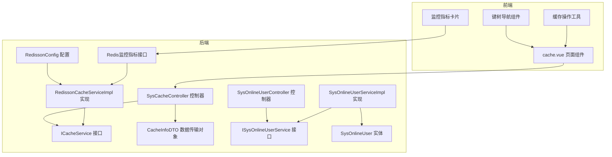
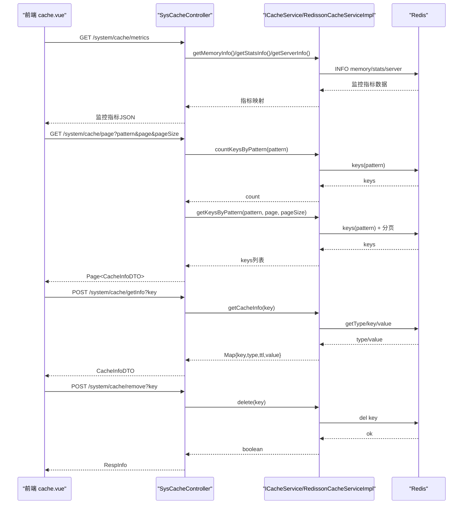
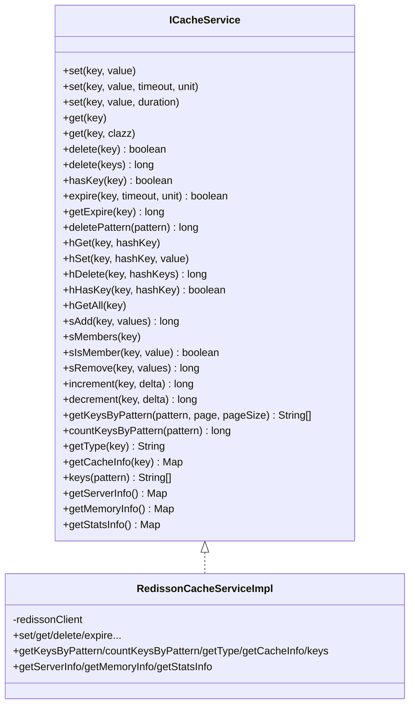
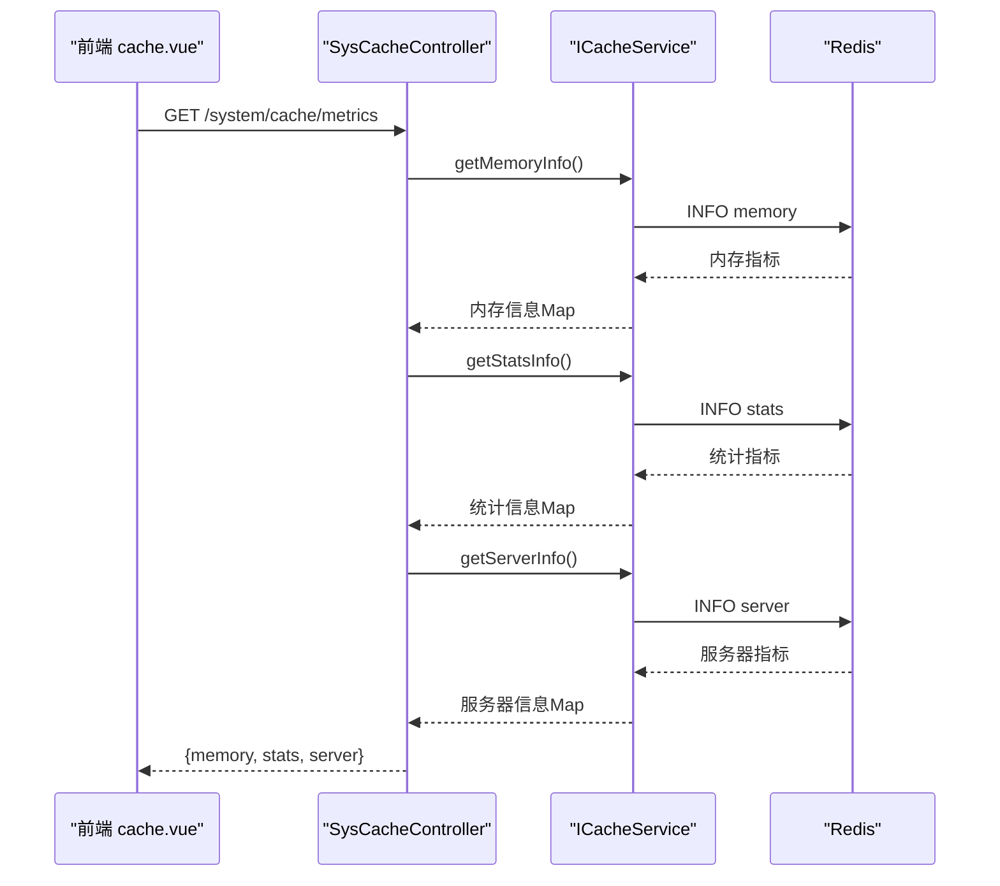
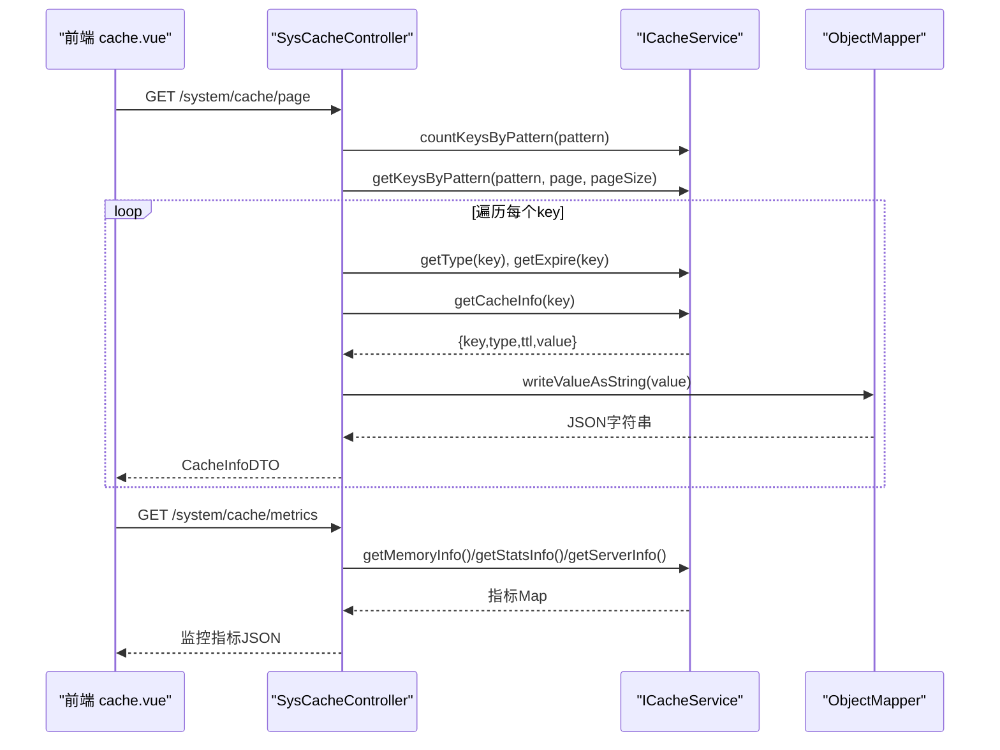
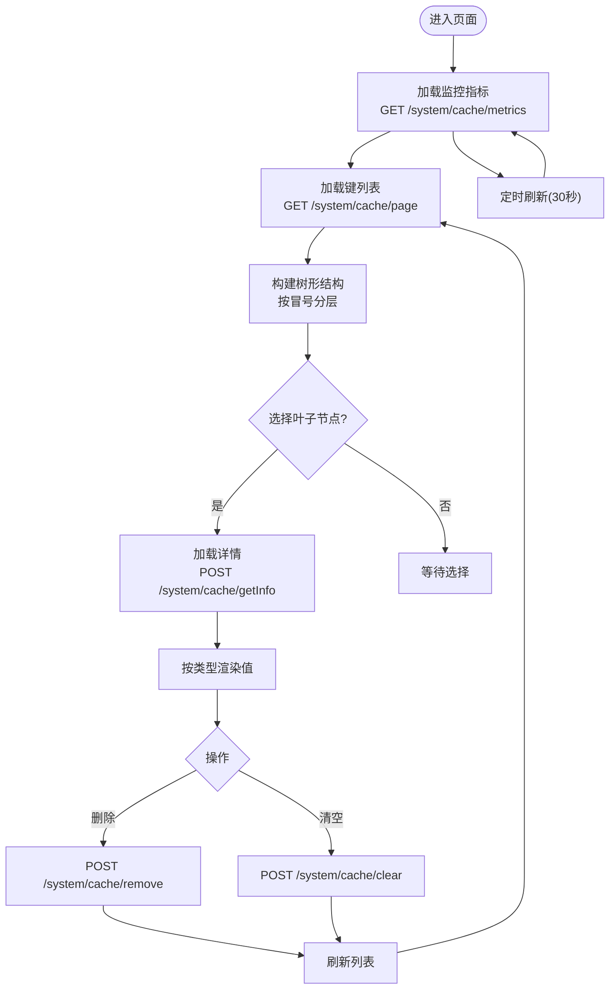
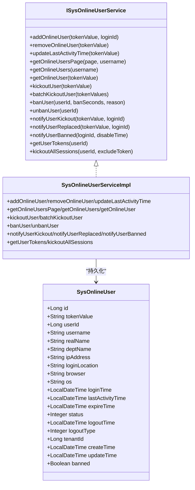
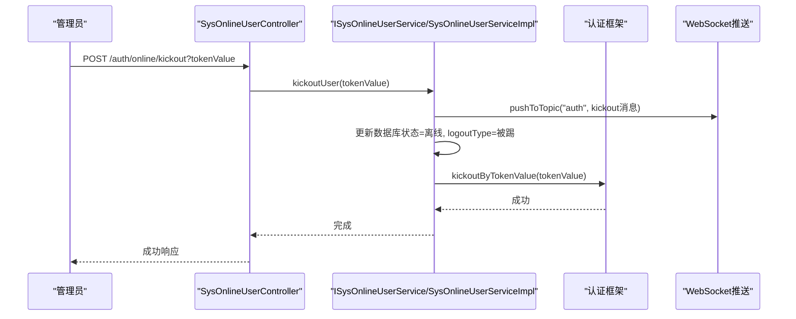
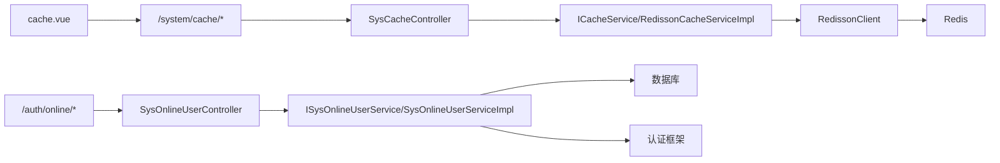

# 缓存管理

<cite>
**本文引用的文件**   
- [CACHE_MANAGEMENT_README.md](file://CACHE_MANAGEMENT_README.md)
- [ICacheService.java](file://forge/forge-framework/forge-starter-parent/forge-starter-cache/src/main/java/com/mdframe/forge/starter/cache/service/ICacheService.java)
- [RedissonCacheServiceImpl.java](file://forge/forge-framework/forge-starter-parent/forge-starter-cache/src/main/java/com/mdframe/forge/starter/cache/service/impl/RedissonCacheServiceImpl.java)
- [RedissonConfig.java](file://forge/forge-framework/forge-starter-parent/forge-starter-cache/src/main/java/com/mdframe/forge/starter/cache/config/RedissonConfig.java)
- [SysCacheController.java](file://forge/forge-framework/forge-plugin-parent/forge-plugin-system/src/main/java/com/mdframe/forge/plugin/system/controller/SysCacheController.java)
- [CacheInfoDTO.java](file://forge/forge-framework/forge-plugin-parent/forge-plugin-system/src/main/java/com/mdframe/forge/plugin/system/dto/CacheInfoDTO.java)
- [SysOnlineUserController.java](file://forge/forge-framework/forge-plugin-parent/forge-plugin-system/src/main/java/com/mdframe/forge/plugin/system/controller/SysOnlineUserController.java)
- [SysOnlineUser.java](file://forge/forge-framework/forge-plugin-parent/forge-plugin-system/src/main/java/com/mdframe/forge/plugin/system/entity/SysOnlineUser.java)
- [ISysOnlineUserService.java](file://forge/forge-framework/forge-plugin-parent/forge-plugin-system/src/main/java/com/mdframe/forge/plugin/system/service/ISysOnlineUserService.java)
- [SysOnlineUserServiceImpl.java](file://forge/forge-framework/forge-plugin-parent/forge-plugin-system/src/main/java/com/mdframe/forge/plugin/system/service/impl/SysOnlineUserServiceImpl.java)
- [cache.vue](file://forge-admin-ui/src/views/system/cache.vue)
</cite>

## 更新摘要
**变更内容**   
- 新增Redis监控指标可视化功能，包括内存使用、QPS、连接数、命中率等实时指标
- 改进键树导航结构，支持冒号分隔的层级展示和智能搜索
- 增强缓存操作工具，提供拖拽调整面板宽度、危险操作确认等用户体验优化
- 完善缓存管理API接口，新增监控指标查询接口

## 目录
1. [简介](#简介)
2. [项目结构](#项目结构)
3. [核心组件](#核心组件)
4. [架构总览](#架构总览)
5. [详细组件分析](#详细组件分析)
6. [依赖关系分析](#依赖关系分析)
7. [性能考量](#性能考量)
8. [故障排查指南](#故障排查指南)
9. [结论](#结论)
10. [附录](#附录)

## 简介
本文件面向Forge框架的缓存管理能力，覆盖缓存查询、缓存清理、在线用户管理、缓存监控等关键功能。文档围绕以下目标展开：
- 在线用户实体模型与会话管理机制
- 缓存数据结构设计与Redisson实现
- 缓存性能优化策略与运维场景
- 缓存管理API接口与前端监控组件
- 在线用户状态监控、强制下线、封禁与解封、会话超时控制
- **新增**：Redis监控指标可视化、键树导航增强、缓存操作工具优化

## 项目结构
缓存管理功能由"后端缓存服务 + 控制器 + DTO + 前端页面"构成，同时包含在线用户管理模块，二者共同支撑可视化缓存监控与运维操作。

**图表来源**
- [ICacheService.java:1-269](file://forge/forge-framework/forge-starter-parent/forge-starter-cache/src/main/java/com/mdframe/forge/starter/cache/service/ICacheService.java#L1-L269)
- [RedissonCacheServiceImpl.java:1-438](file://forge/forge-framework/forge-starter-parent/forge-starter-cache/src/main/java/com/mdframe/forge/starter/cache/service/impl/RedissonCacheServiceImpl.java#L1-L438)
- [SysCacheController.java:1-224](file://forge/forge-framework/forge-plugin-parent/forge-plugin-system/src/main/java/com/mdframe/forge/plugin/system/controller/SysCacheController.java#L1-L224)
- [CacheInfoDTO.java:1-45](file://forge/forge-framework/forge-plugin-parent/forge-plugin-system/src/main/java/com/mdframe/forge/plugin/system/dto/CacheInfoDTO.java#L1-L45)
- [ISysOnlineUserService.java:1-133](file://forge/forge-framework/forge-plugin-parent/forge-plugin-system/src/main/java/com/mdframe/forge/plugin/system/service/ISysOnlineUserService.java#L1-L133)
- [SysOnlineUserServiceImpl.java:1-446](file://forge/forge-framework/forge-plugin-parent/forge-plugin-system/src/main/java/com/mdframe/forge/plugin/system/service/impl/SysOnlineUserServiceImpl.java#L1-L446)
- [SysOnlineUser.java:1-127](file://forge/forge-framework/forge-plugin-parent/forge-plugin-system/src/main/java/com/mdframe/forge/plugin/system/entity/SysOnlineUser.java#L1-L127)
- [SysOnlineUserController.java:1-145](file://forge/forge-framework/forge-plugin-parent/forge-plugin-system/src/main/java/com/mdframe/forge/plugin/system/controller/SysOnlineUserController.java#L1-L145)
- [RedissonConfig.java:1-35](file://forge/forge-framework/forge-starter-parent/forge-starter-cache/src/main/java/com/mdframe/forge/starter/cache/config/RedissonConfig.java#L1-L35)
- [cache.vue:1-1133](file://forge-admin-ui/src/views/system/cache.vue#L1-L1133)

**章节来源**
- [CACHE_MANAGEMENT_README.md:1-190](file://CACHE_MANAGEMENT_README.md#L1-L190)
- [SysCacheController.java:1-224](file://forge/forge-framework/forge-plugin-parent/forge-plugin-system/src/main/java/com/mdframe/forge/plugin/system/controller/SysCacheController.java#L1-L224)
- [cache.vue:1-1133](file://forge-admin-ui/src/views/system/cache.vue#L1-L1133)

## 核心组件
- 缓存服务接口与实现：提供统一的缓存操作能力，包括键值存取、哈希、集合、原子计数、过期控制、按模式查询与删除等。
- **新增**：Redis监控指标服务：提供内存使用、QPS、连接数、命中率等Redis运行时指标的实时查询能力。
- 缓存控制器：提供分页查询、详情查看、删除、批量删除、清空、**新增**：监控指标查询等REST接口。
- 在线用户服务与实体：基于数据库持久化在线用户状态，支持强制下线、批量下线、封禁/解封、会话互踢等。
- 前端缓存监控页面：提供树形浏览、类型化展示、删除与清空等交互，**新增**：监控指标可视化展示。

**章节来源**
- [ICacheService.java:1-269](file://forge/forge-framework/forge-starter-parent/forge-starter-cache/src/main/java/com/mdframe/forge/starter/cache/service/ICacheService.java#L1-L269)
- [RedissonCacheServiceImpl.java:292-438](file://forge/forge-framework/forge-starter-parent/forge-starter-cache/src/main/java/com/mdframe/forge/starter/cache/service/impl/RedissonCacheServiceImpl.java#L292-L438)
- [SysCacheController.java:156-177](file://forge/forge-framework/forge-plugin-parent/forge-plugin-system/src/main/java/com/mdframe/forge/plugin/system/controller/SysCacheController.java#L156-L177)
- [CacheInfoDTO.java:1-45](file://forge/forge-framework/forge-plugin-parent/forge-plugin-system/src/main/java/com/mdframe/forge/plugin/system/dto/CacheInfoDTO.java#L1-L45)
- [SysOnlineUserController.java:1-145](file://forge/forge-framework/forge-plugin-parent/forge-plugin-system/src/main/java/com/mdframe/forge/plugin/system/controller/SysOnlineUserController.java#L1-L145)
- [SysOnlineUser.java:1-127](file://forge/forge-framework/forge-plugin-parent/forge-plugin-system/src/main/java/com/mdframe/forge/plugin/system/entity/SysOnlineUser.java#L1-L127)
- [ISysOnlineUserService.java:1-133](file://forge/forge-framework/forge-plugin-parent/forge-plugin-system/src/main/java/com/mdframe/forge/plugin/system/service/ISysOnlineUserService.java#L1-L133)
- [SysOnlineUserServiceImpl.java:1-446](file://forge/forge-framework/forge-plugin-parent/forge-plugin-system/src/main/java/com/mdframe/forge/plugin/system/service/impl/SysOnlineUserServiceImpl.java#L1-L446)
- [cache.vue:1-1133](file://forge-admin-ui/src/views/system/cache.vue#L1-L1133)

## 架构总览
后端采用"接口 + Redisson实现 + 控制器 + DTO"的分层设计；前端通过HTTP调用后端接口，实现缓存键树形浏览与详情展示，**新增**：实时监控指标可视化。

**图表来源**
- [SysCacheController.java:156-177](file://forge/forge-framework/forge-plugin-parent/forge-plugin-system/src/main/java/com/mdframe/forge/plugin/system/controller/SysCacheController.java#L156-L177)
- [ICacheService.java:248-268](file://forge/forge-framework/forge-starter-parent/forge-starter-cache/src/main/java/com/mdframe/forge/starter/cache/service/ICacheService.java#L248-L268)
- [RedissonCacheServiceImpl.java:292-438](file://forge/forge-framework/forge-starter-parent/forge-starter-cache/src/main/java/com/mdframe/forge/starter/cache/service/impl/RedissonCacheServiceImpl.java#L292-L438)

## 详细组件分析

### 缓存服务接口与实现
- 接口职责：统一的缓存操作契约，涵盖字符串、哈希、集合、原子计数、过期控制、按模式查询与删除、类型与详情获取等。
- **新增**：监控指标接口：提供getServerInfo()、getMemoryInfo()、getStatsInfo()三个方法，用于获取Redis服务器信息、内存使用情况和统计信息。
- 实现要点：
  - 基于Redisson客户端，使用RBucket/RMap/RSet/RList等原语实现不同数据类型的缓存操作。
  - 提供按模式分页遍历键的能力，避免一次性拉取过多键导致性能问题。
  - 在获取缓存详情时，针对反序列化失败场景提供兜底策略（字符串编码读取）。
  - **新增**：通过Redis INFO命令获取监控指标，解析为Map格式返回给前端。

**图表来源**
- [ICacheService.java:10-269](file://forge/forge-framework/forge-starter-parent/forge-starter-cache/src/main/java/com/mdframe/forge/starter/cache/service/ICacheService.java#L10-L269)
- [RedissonCacheServiceImpl.java:292-438](file://forge/forge-framework/forge-starter-parent/forge-starter-cache/src/main/java/com/mdframe/forge/starter/cache/service/impl/RedissonCacheServiceImpl.java#L292-L438)

**章节来源**
- [ICacheService.java:1-269](file://forge/forge-framework/forge-starter-parent/forge-starter-cache/src/main/java/com/mdframe/forge/starter/cache/service/ICacheService.java#L1-L269)
- [RedissonCacheServiceImpl.java:1-438](file://forge/forge-framework/forge-starter-parent/forge-starter-cache/src/main/java/com/mdframe/forge/starter/cache/service/impl/RedissonCacheServiceImpl.java#L1-L438)

### Redis监控指标服务
- **新增**：监控指标接口设计
  - getServerInfo()：获取Redis服务器基本信息，包括版本、操作系统、进程ID、运行时间等
  - getMemoryInfo()：获取内存使用情况，包括已用内存、峰值内存、总系统内存、内存碎片率等
  - getStatsInfo()：获取统计信息，包括QPS、连接数、过期Key数、驱逐Key数、命中率等
- **新增**：前端监控指标展示
  - 内存使用卡片：显示当前内存使用量和峰值内存
  - QPS卡片：显示实时查询每秒操作数
  - 连接数卡片：显示总连接数和已处理命令数
  - 命中率卡片：显示KeySpace命中率和命中/未命中次数
  - 过期Key卡片：显示过期Key数和驱逐Key数
  - Redis版本卡片：显示Redis版本和运行时间

**图表来源**
- [SysCacheController.java:156-177](file://forge/forge-framework/forge-plugin-parent/forge-plugin-system/src/main/java/com/mdframe/forge/plugin/system/controller/SysCacheController.java#L156-L177)
- [RedissonCacheServiceImpl.java:292-438](file://forge/forge-framework/forge-starter-parent/forge-starter-cache/src/main/java/com/mdframe/forge/starter/cache/service/impl/RedissonCacheServiceImpl.java#L292-L438)

**章节来源**
- [SysCacheController.java:156-177](file://forge/forge-framework/forge-plugin-parent/forge-plugin-system/src/main/java/com/mdframe/forge/plugin/system/controller/SysCacheController.java#L156-L177)
- [RedissonCacheServiceImpl.java:292-438](file://forge/forge-framework/forge-starter-parent/forge-starter-cache/src/main/java/com/mdframe/forge/starter/cache/service/impl/RedissonCacheServiceImpl.java#L292-L438)

### 缓存控制器与DTO
- 控制器职责：提供分页查询、详情查看、删除、批量删除、清空、**新增**：监控指标查询等接口；对TTL进行人性化展示；对值进行安全预览。
- **新增**：监控指标查询接口：/system/cache/metrics，聚合返回内存、统计、服务器三类指标。
- DTO职责：封装返回给前端的缓存信息，包含键、类型、值预览、TTL及其描述。

**图表来源**
- [SysCacheController.java:38-177](file://forge/forge-framework/forge-plugin-parent/forge-plugin-system/src/main/java/com/mdframe/forge/plugin/system/controller/SysCacheController.java#L38-L177)
- [CacheInfoDTO.java:10-44](file://forge/forge-framework/forge-plugin-parent/forge-plugin-system/src/main/java/com/mdframe/forge/plugin/system/dto/CacheInfoDTO.java#L10-L44)

**章节来源**
- [SysCacheController.java:1-224](file://forge/forge-framework/forge-plugin-parent/forge-plugin-system/src/main/java/com/mdframe/forge/plugin/system/controller/SysCacheController.java#L1-L224)
- [CacheInfoDTO.java:1-45](file://forge/forge-framework/forge-plugin-parent/forge-plugin-system/src/main/java/com/mdframe/forge/plugin/system/dto/CacheInfoDTO.java#L1-L45)

### 前端缓存监控组件
- **新增**：监控指标卡片布局：采用网格布局展示各类Redis监控指标，支持响应式设计。
- 树形浏览：按冒号分隔层级展示键空间，支持搜索与刷新。
- **新增**：键树导航增强：智能识别冒号分隔符，构建层级化的树形结构，支持文件夹计数显示。
- **新增**：缓存操作工具：拖拽调整左右面板宽度、危险操作确认对话框、格式化显示工具。
- 类型化展示：根据类型（STRING/HASH/SET/LIST）分别渲染表格或文本。
- **新增**：实时刷新机制：监控指标每30秒自动刷新一次。

**图表来源**
- [cache.vue:314-324](file://forge-admin-ui/src/views/system/cache.vue#L314-L324)
- [cache.vue:398-425](file://forge-admin-ui/src/views/system/cache.vue#L398-L425)
- [cache.vue:427-482](file://forge-admin-ui/src/views/system/cache.vue#L427-L482)

**章节来源**
- [cache.vue:1-1133](file://forge-admin-ui/src/views/system/cache.vue#L1-L1133)

### 在线用户实体模型与会话管理
- 实体字段：包含token值、用户标识、部门、登录IP/地点、浏览器/系统、登录/最后活动/过期时间、状态与登出类型等。
- 服务接口：提供添加、移除、更新活动时间、分页查询、强制下线、批量下线、封禁/解封、互踢等能力。
- 控制器接口：提供分页列表、列表查询、强制下线、批量下线、封禁、解封、查询用户所有Token等。

**图表来源**
- [SysOnlineUser.java:15-127](file://forge/forge-framework/forge-plugin-parent/forge-plugin-system/src/main/java/com/mdframe/forge/plugin/system/entity/SysOnlineUser.java#L15-L127)
- [ISysOnlineUserService.java:14-132](file://forge/forge-framework/forge-plugin-parent/forge-plugin-system/src/main/java/com/mdframe/forge/plugin/system/service/ISysOnlineUserService.java#L14-L132)
- [SysOnlineUserServiceImpl.java:44-446](file://forge/forge-framework/forge-plugin-parent/forge-plugin-system/src/main/java/com/mdframe/forge/plugin/system/service/impl/SysOnlineUserServiceImpl.java#L44-L446)

**章节来源**
- [SysOnlineUser.java:1-127](file://forge/forge-framework/forge-plugin-parent/forge-plugin-system/src/main/java/com/mdframe/forge/plugin/system/entity/SysOnlineUser.java#L1-L127)
- [ISysOnlineUserService.java:1-133](file://forge/forge-framework/forge-plugin-parent/forge-plugin-system/src/main/java/com/mdframe/forge/plugin/system/service/ISysOnlineUserService.java#L1-L133)
- [SysOnlineUserServiceImpl.java:1-446](file://forge/forge-framework/forge-plugin-parent/forge-plugin-system/src/main/java/com/mdframe/forge/plugin/system/service/impl/SysOnlineUserServiceImpl.java#L1-L446)
- [SysOnlineUserController.java:1-145](file://forge/forge-framework/forge-plugin-parent/forge-plugin-system/src/main/java/com/mdframe/forge/plugin/system/controller/SysOnlineUserController.java#L1-L145)

### 在线用户状态监控与强制下线流程
- 状态监控：分页查询在线用户，支持按用户名模糊搜索，按登录时间倒序排列，并标注是否被封禁。
- 强制下线：通过控制器触发服务层下线逻辑，先通知前端，再更新数据库状态，最后调用认证框架踢出会话。
- 互踢与封禁：同一账号多处登录时可互踢；支持按用户ID封禁并踢出所有会话，同时推送封禁消息。

**图表来源**
- [SysOnlineUserController.java:87-91](file://forge/forge-framework/forge-plugin-parent/forge-plugin-system/src/main/java/com/mdframe/forge/plugin/system/controller/SysOnlineUserController.java#L87-L91)
- [SysOnlineUserServiceImpl.java:210-235](file://forge/forge-framework/forge-plugin-parent/forge-plugin-system/src/main/java/com/mdframe/forge/plugin/system/service/impl/SysOnlineUserServiceImpl.java#L210-L235)

**章节来源**
- [SysOnlineUserController.java:1-145](file://forge/forge-framework/forge-plugin-parent/forge-plugin-system/src/main/java/com/mdframe/forge/plugin/system/controller/SysOnlineUserController.java#L1-L145)
- [SysOnlineUserServiceImpl.java:1-446](file://forge/forge-framework/forge-plugin-parent/forge-plugin-system/src/main/java/com/mdframe/forge/plugin/system/service/impl/SysOnlineUserServiceImpl.java#L1-L446)

### 缓存数据结构设计与性能优化
- 数据结构：支持STRING/HASH/SET/LIST等Redis原生类型；通过类型判断与序列化策略保障值读取稳定性。
- **新增**：监控指标优化：通过INFO命令获取Redis运行时指标，避免手动计算带来的误差。
- 性能优化：
  - 按模式分页遍历键，避免一次性拉取大量键。
  - 值预览限制长度，详情弹窗中按类型格式化展示。
  - TTL人性化展示，便于快速识别即将过期的键。
  - **新增**：监控指标缓存策略：前端定时刷新机制，减少频繁请求对Redis的压力。
  - **新增**：键树构建优化：使用冒号分隔符优先级，提升树形结构的层次感。
  - 前端树形结构按冒号分层，提升浏览体验。

**章节来源**
- [RedissonCacheServiceImpl.java:176-287](file://forge/forge-framework/forge-starter-parent/forge-starter-cache/src/main/java/com/mdframe/forge/starter/cache/service/impl/RedissonCacheServiceImpl.java#L176-L287)
- [SysCacheController.java:155-177](file://forge/forge-framework/forge-plugin-parent/forge-plugin-system/src/main/java/com/mdframe/forge/plugin/system/controller/SysCacheController.java#L155-L177)
- [cache.vue:298-353](file://forge-admin-ui/src/views/system/cache.vue#L298-L353)

## 依赖关系分析
- 后端依赖：Spring Boot + Redisson + MyBatis Plus；Redisson配置使用Jackson时间模块增强序列化能力。
- **新增**：监控指标依赖：通过Redis INFO命令获取实时指标，需要Redis服务器支持INFO命令。
- 前端依赖：Vue 3 + Naive UI + 自研AiCrudPage组件；通过HTTP请求与后端交互。

**图表来源**
- [cache.vue:270-476](file://forge-admin-ui/src/views/system/cache.vue#L270-L476)
- [SysCacheController.java:38-177](file://forge/forge-framework/forge-plugin-parent/forge-plugin-system/src/main/java/com/mdframe/forge/plugin/system/controller/SysCacheController.java#L38-L177)
- [RedissonCacheServiceImpl.java:292-438](file://forge/forge-framework/forge-starter-parent/forge-starter-cache/src/main/java/com/mdframe/forge/starter/cache/service/impl/RedissonCacheServiceImpl.java#L292-L438)
- [SysOnlineUserController.java:59-143](file://forge/forge-framework/forge-plugin-parent/forge-plugin-system/src/main/java/com/mdframe/forge/plugin/system/controller/SysOnlineUserController.java#L59-L143)

**章节来源**
- [RedissonConfig.java:19-33](file://forge/forge-framework/forge-starter-parent/forge-starter-cache/src/main/java/com/mdframe/forge/starter/cache/config/RedissonConfig.java#L19-L33)

## 性能考量
- 键扫描与分页：按模式分页获取键，避免一次性遍历全部键造成阻塞。
- 值读取与序列化：针对反序列化失败提供兜底策略，确保详情页可用性。
- **新增**：监控指标性能：定时刷新机制（30秒间隔），平衡实时性和性能开销。
- **新增**：键树构建优化：使用冒号分隔符优先级，提升树形结构的层次感和可读性。
- 前端渲染：树形结构限制最大展示数量并提供搜索，减少DOM压力。
- 操作风险提示：清空缓存采用危险提示与二次确认，降低误操作风险。

**章节来源**
- [RedissonCacheServiceImpl.java:216-275](file://forge/forge-framework/forge-starter-parent/forge-starter-cache/src/main/java/com/mdframe/forge/starter/cache/service/impl/RedissonCacheServiceImpl.java#L216-L275)
- [SysCacheController.java:142-153](file://forge/forge-framework/forge-plugin-parent/forge-plugin-system/src/main/java/com/mdframe/forge/plugin/system/controller/SysCacheController.java#L142-L153)
- [cache.vue:286-295](file://forge-admin-ui/src/views/system/cache.vue#L286-L295)

## 故障排查指南
- 菜单不显示：检查数据库菜单权限脚本是否执行成功，确认角色具备相应权限。
- 缓存列表为空：检查Redis连接状态、键空间是否存在、搜索模式是否正确。
- **新增**：监控指标显示异常：检查Redis服务器是否支持INFO命令、网络连接状态、Redis版本兼容性。
- **新增**：键树构建失败：检查键名中冒号分隔符的使用、键数量过多导致的性能问题。
- 删除操作失败：检查后端日志、确认键名正确、验证Redis服务状态。
- 强制下线无效：确认token有效、认证框架踢出会话成功、前端WebSocket订阅topic正确。

**章节来源**
- [CACHE_MANAGEMENT_README.md:167-189](file://CACHE_MANAGEMENT_README.md#L167-L189)
- [SysOnlineUserServiceImpl.java:210-235](file://forge/forge-framework/forge-plugin-parent/forge-plugin-system/src/main/java/com/mdframe/forge/plugin/system/service/impl/SysOnlineUserServiceImpl.java#L210-L235)

## 结论
Forge框架的缓存管理功能通过"接口抽象 + Redisson实现 + 控制器 + DTO + 前端页面"的完整链路，实现了缓存查询、详情查看、删除与清空等运维能力；结合在线用户管理模块，提供了会话监控、强制下线、封禁与互踢等高级运维能力。**新增的Redis监控指标可视化功能**显著提升了缓存系统的可观测性，通过内存使用、QPS、连接数、命中率等关键指标帮助运维人员快速定位性能瓶颈。**增强的键树导航和缓存操作工具**进一步优化了用户体验，使得缓存管理更加直观和高效。

## 附录
- 部署与权限：参考文档中的部署步骤与数据库配置说明，确保菜单与权限正确配置。
- **新增**：监控指标接口清单：
  - 获取监控指标：GET /system/cache/metrics
- API接口清单：
  - 分页查询缓存：GET /system/cache/page
  - 获取缓存详情：POST /system/cache/getInfo
  - 删除缓存：POST /system/cache/remove
  - 批量删除：POST /system/cache/removeBatch
  - 清空缓存：POST /system/cache/clear
  - **新增**：监控指标查询：GET /system/cache/metrics
  - 在线用户分页：GET /auth/online/page
  - 在线用户列表：GET /auth/online/list
  - 强制下线：POST /auth/online/kickout
  - 批量下线：POST /auth/online/batchKickout
  - 封禁用户：POST /auth/online/ban
  - 解封用户：POST /auth/online/unban
  - 查询用户Token：GET /auth/online/userTokens

**章节来源**
- [CACHE_MANAGEMENT_README.md:96-132](file://CACHE_MANAGEMENT_README.md#L96-L132)
- [SysCacheController.java:41-177](file://forge/forge-framework/forge-plugin-parent/forge-plugin-system/src/main/java/com/mdframe/forge/plugin/system/controller/SysCacheController.java#L41-L177)
- [SysOnlineUserController.java:59-143](file://forge/forge-framework/forge-plugin-parent/forge-plugin-system/src/main/java/com/mdframe/forge/plugin/system/controller/SysOnlineUserController.java#L59-L143)