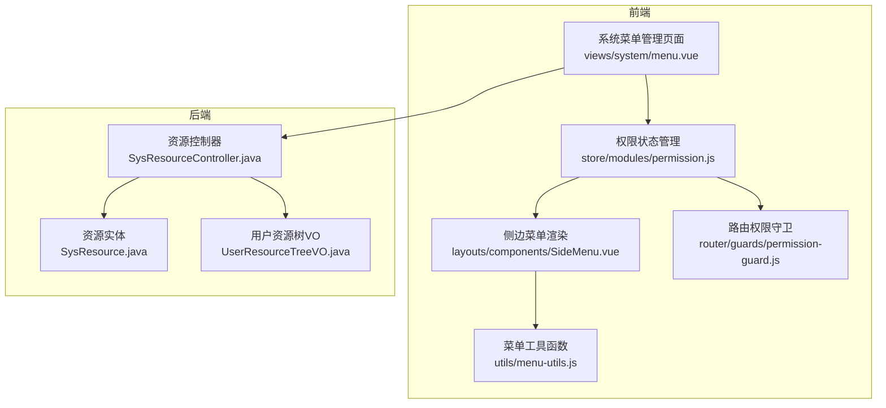
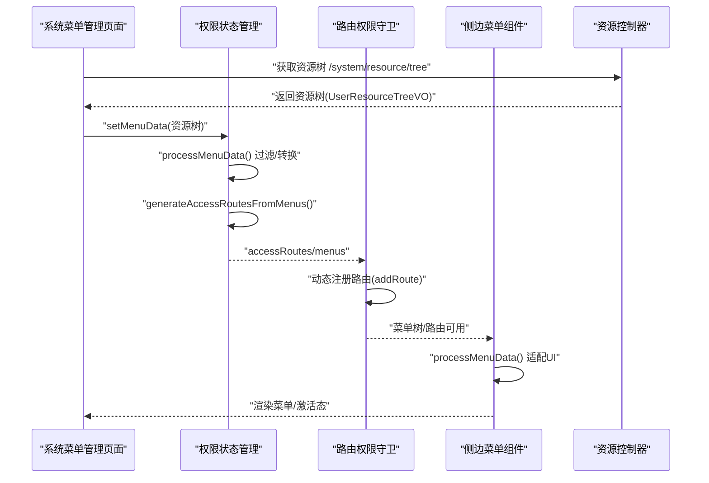
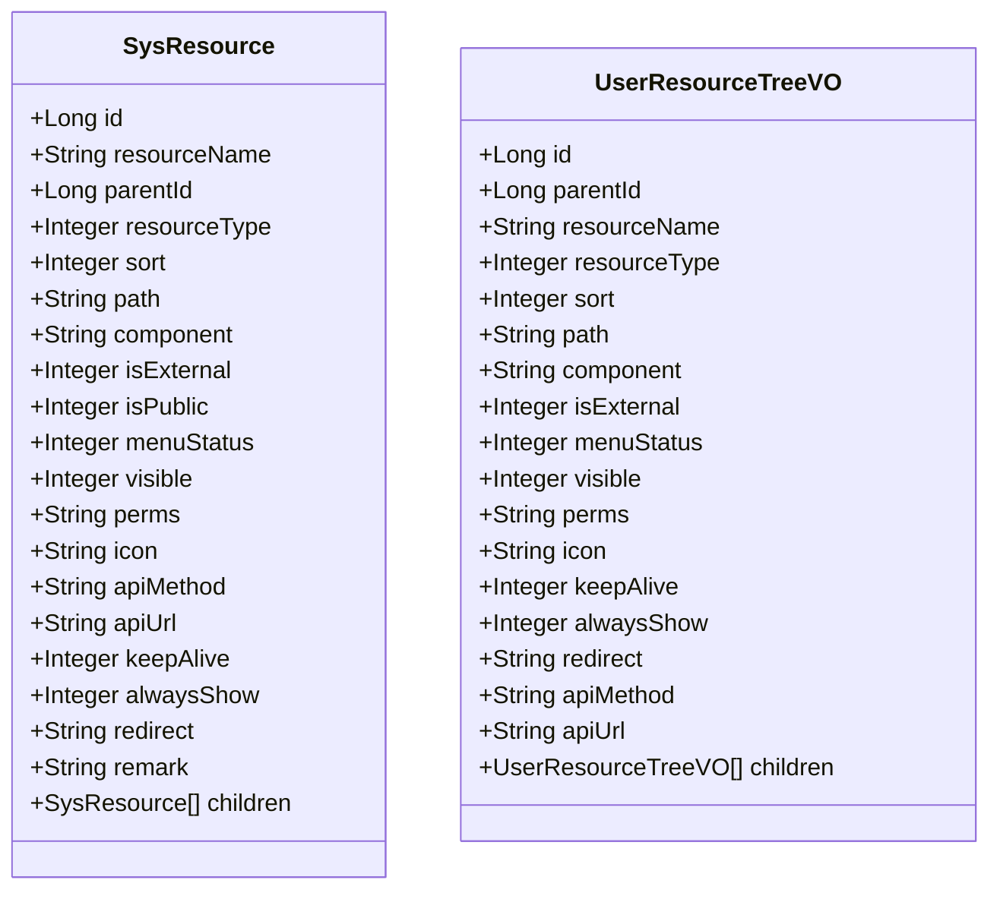
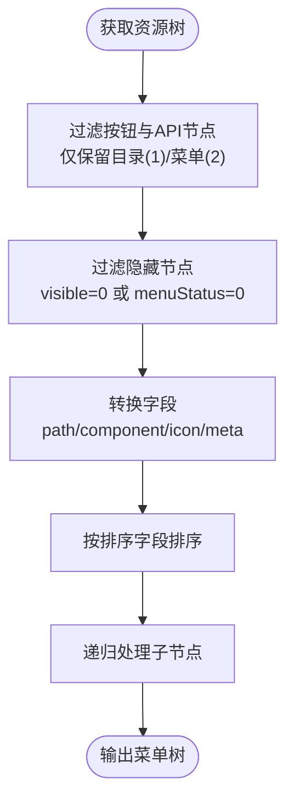
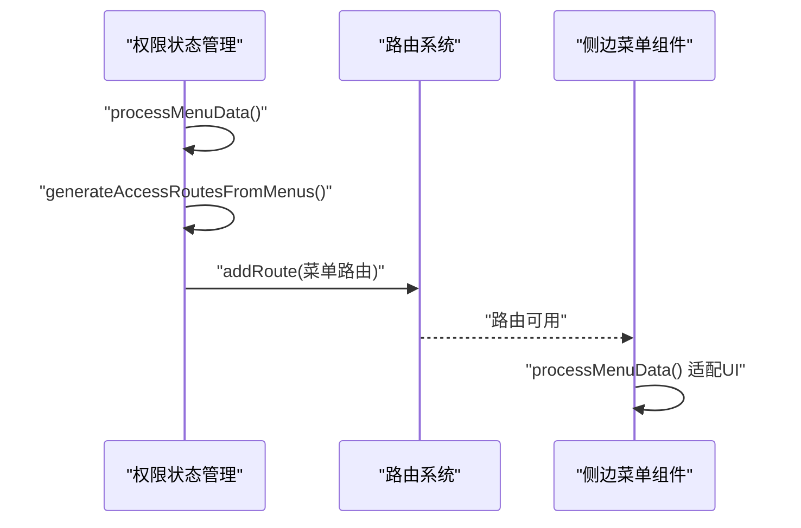
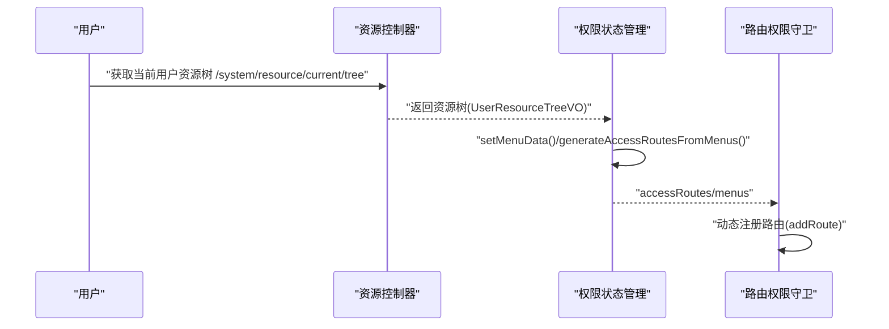
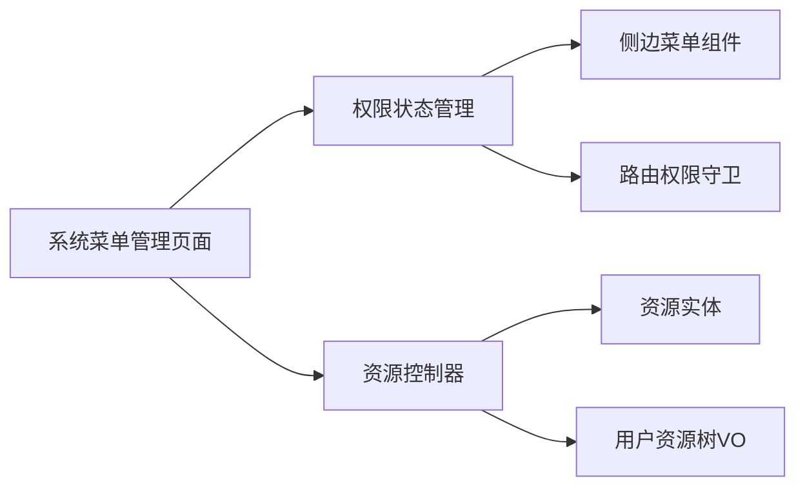

# 菜单管理

<cite>
**本文引用的文件**
- [forge-admin-ui/src/views/system/menu.vue](file://forge-admin-ui/src/views/system/menu.vue)
- [forge-admin-ui/src/views/system/components/Menu.vue](file://forge-admin-ui/src/views/system/components/Menu.vue)
- [forge-admin-ui/src/store/modules/permission.js](file://forge-admin-ui/src/store/modules/permission.js)
- [forge-admin-ui/src/utils/menu-utils.js](file://forge-admin-ui/src/utils/menu-utils.js)
- [forge-admin-ui/src/layouts/components/SideMenu.vue](file://forge-admin-ui/src/layouts/components/SideMenu.vue)
- [forge-admin-ui/src/router/guards/permission-guard.js](file://forge-admin-ui/src/router/guards/permission-guard.js)
- [forge/forge-framework/forge-plugin-parent/forge-plugin-system/src/main/java/com/mdframe/forge/plugin/system/controller/SysResourceController.java](file://forge/forge-framework/forge-plugin-parent/forge-plugin-system/src/main/java/com/mdframe/forge/plugin/system/controller/SysResourceController.java)
- [forge/forge-framework/forge-plugin-parent/forge-plugin-system/src/main/java/com/mdframe/forge/plugin/system/entity/SysResource.java](file://forge/forge-framework/forge-plugin-parent/forge-plugin-system/src/main/java/com/mdframe/forge/plugin/system/entity/SysResource.java)
- [forge/forge-framework/forge-plugin-parent/forge-plugin-system/src/main/java/com/mdframe/forge/plugin/system/vo/UserResourceTreeVO.java](file://forge/forge-framework/forge-plugin-parent/forge-plugin-system/src/main/java/com/mdframe/forge/plugin/system/vo/UserResourceTreeVO.java)
- [forge/forge-framework/forge-starter-parent/forge-starter-api-config/src/main/resources/sql/api_config_menu.sql](file://forge/forge-framework/forge-starter-parent/forge-starter-api-config/src/main/resources/sql/api_config_menu.sql)
- [forge/forge-admin/sql/cache_menu.sql](file://forge/forge-admin/sql/cache_menu.sql)
- [forge-admin-ui/src/api/mock/menu.js](file://forge-admin-ui/src/api/mock/menu.js)
</cite>

## 目录
1. [简介](#简介)
2. [项目结构](#项目结构)
3. [核心组件](#核心组件)
4. [架构总览](#架构总览)
5. [详细组件分析](#详细组件分析)
6. [依赖关系分析](#依赖关系分析)
7. [性能考量](#性能考量)
8. [故障排查指南](#故障排查指南)
9. [结论](#结论)
10. [附录](#附录)

## 简介
本文件面向Forge框架的菜单管理能力，系统化阐述菜单的创建、层级管理、权限控制、排序与动态生成机制。内容覆盖菜单实体模型、树形结构设计、动态菜单生成与权限验证流程，并对菜单类型（目录、菜单、按钮、API接口）、图标配置、外链菜单支持等进行详解。同时提供完整的菜单管理API接口、前端菜单组件渲染逻辑与权限路由配置示例，帮助开发者快速构建灵活可控的菜单权限体系。

## 项目结构
菜单管理涉及前后端协同：
- 前端：系统菜单管理界面、权限状态管理、侧边菜单渲染、路由守卫与权限校验、菜单工具函数
- 后端：资源管理控制器、实体与VO模型、资源树查询与用户资源树查询

图表来源
- [forge-admin-ui/src/views/system/menu.vue](file://forge-admin-ui/src/views/system/menu.vue#L1-L737)
- [forge-admin-ui/src/store/modules/permission.js](file://forge-admin-ui/src/store/modules/permission.js#L1-L269)
- [forge-admin-ui/src/layouts/components/SideMenu.vue](file://forge-admin-ui/src/layouts/components/SideMenu.vue#L1-L319)
- [forge-admin-ui/src/utils/menu-utils.js](file://forge-admin-ui/src/utils/menu-utils.js#L1-L170)
- [forge-admin-ui/src/router/guards/permission-guard.js](file://forge-admin-ui/src/router/guards/permission-guard.js#L1-L546)
- [forge/forge-framework/forge-plugin-parent/forge-plugin-system/src/main/java/com/mdframe/forge/plugin/system/controller/SysResourceController.java](file://forge/forge-framework/forge-plugin-parent/forge-plugin-system/src/main/java/com/mdframe/forge/plugin/system/controller/SysResourceController.java#L1-L117)
- [forge/forge-framework/forge-plugin-parent/forge-plugin-system/src/main/java/com/mdframe/forge/plugin/system/entity/SysResource.java](file://forge/forge-framework/forge-plugin-parent/forge-plugin-system/src/main/java/com/mdframe/forge/plugin/system/entity/SysResource.java#L1-L121)
- [forge/forge-framework/forge-plugin-parent/forge-plugin-system/src/main/java/com/mdframe/forge/plugin/system/vo/UserResourceTreeVO.java](file://forge/forge-framework/forge-plugin-parent/forge-plugin-system/src/main/java/com/mdframe/forge/plugin/system/vo/UserResourceTreeVO.java#L1-L108)

章节来源
- [forge-admin-ui/src/views/system/menu.vue](file://forge-admin-ui/src/views/system/menu.vue#L1-L737)
- [forge-admin-ui/src/store/modules/permission.js](file://forge-admin-ui/src/store/modules/permission.js#L1-L269)
- [forge-admin-ui/src/layouts/components/SideMenu.vue](file://forge-admin-ui/src/layouts/components/SideMenu.vue#L1-L319)
- [forge-admin-ui/src/utils/menu-utils.js](file://forge-admin-ui/src/utils/menu-utils.js#L1-L170)
- [forge-admin-ui/src/router/guards/permission-guard.js](file://forge-admin-ui/src/router/guards/permission-guard.js#L1-L546)
- [forge/forge-framework/forge-plugin-parent/forge-plugin-system/src/main/java/com/mdframe/forge/plugin/system/controller/SysResourceController.java](file://forge/forge-framework/forge-plugin-parent/forge-plugin-system/src/main/java/com/mdframe/forge/plugin/system/controller/SysResourceController.java#L1-L117)
- [forge/forge-framework/forge-plugin-parent/forge-plugin-system/src/main/java/com/mdframe/forge/plugin/system/entity/SysResource.java](file://forge/forge-framework/forge-plugin-parent/forge-plugin-system/src/main/java/com/mdframe/forge/plugin/system/entity/SysResource.java#L1-L121)
- [forge/forge-framework/forge-plugin-parent/forge-plugin-system/src/main/java/com/mdframe/forge/plugin/system/vo/UserResourceTreeVO.java](file://forge/forge-framework/forge-plugin-parent/forge-plugin-system/src/main/java/com/mdframe/forge/plugin/system/vo/UserResourceTreeVO.java#L1-L108)

## 核心组件
- 系统菜单管理页面：提供资源树形展示、增删改查、内联编辑（图标、排序）、展开/折叠、批量操作与权限刷新
- 权限状态管理：负责菜单数据处理、路由生成、访问路由集合维护、首页路径推断与菜单数据加载状态
- 侧边菜单渲染：将处理后的菜单数据适配UI组件库，支持图标渲染、外链与iframe模式、激活态计算
- 菜单工具函数：提供菜单数据展平、唯一ID生成、活跃顶级菜单定位、菜单项查找等
- 路由权限守卫：基于菜单树动态注册路由、处理组件缺失与异常回退
- 资源控制器与实体：提供资源树查询、用户资源树与权限标识查询、资源增删改接口

章节来源
- [forge-admin-ui/src/views/system/menu.vue](file://forge-admin-ui/src/views/system/menu.vue#L1-L737)
- [forge-admin-ui/src/store/modules/permission.js](file://forge-admin-ui/src/store/modules/permission.js#L1-L269)
- [forge-admin-ui/src/layouts/components/SideMenu.vue](file://forge-admin-ui/src/layouts/components/SideMenu.vue#L1-L319)
- [forge-admin-ui/src/utils/menu-utils.js](file://forge-admin-ui/src/utils/menu-utils.js#L1-L170)
- [forge-admin-ui/src/router/guards/permission-guard.js](file://forge-admin-ui/src/router/guards/permission-guard.js#L1-L546)
- [forge/forge-framework/forge-plugin-parent/forge-plugin-system/src/main/java/com/mdframe/forge/plugin/system/controller/SysResourceController.java](file://forge/forge-framework/forge-plugin-parent/forge-plugin-system/src/main/java/com/mdframe/forge/plugin/system/controller/SysResourceController.java#L1-L117)

## 架构总览
菜单管理采用“后端资源树 + 前端权限路由 + 侧边菜单渲染”的三层协作：
- 后端提供资源树与用户资源树接口，返回包含目录、菜单、按钮、API的树形结构
- 前端权限状态管理将资源树转换为菜单树，生成可导航路由，维护访问路由集合
- 侧边菜单组件消费菜单树，渲染图标、处理外链与iframe、计算激活态
- 路由守卫根据菜单树动态注册路由，确保访问控制与页面渲染一致

图表来源
- [forge-admin-ui/src/views/system/menu.vue](file://forge-admin-ui/src/views/system/menu.vue#L684-L697)
- [forge-admin-ui/src/store/modules/permission.js](file://forge-admin-ui/src/store/modules/permission.js#L23-L130)
- [forge-admin-ui/src/router/guards/permission-guard.js](file://forge-admin-ui/src/router/guards/permission-guard.js#L516-L546)
- [forge-admin-ui/src/layouts/components/SideMenu.vue](file://forge-admin-ui/src/layouts/components/SideMenu.vue#L27-L86)
- [forge/forge-framework/forge-plugin-parent/forge-plugin-system/src/main/java/com/mdframe/forge/plugin/system/controller/SysResourceController.java](file://forge/forge-framework/forge-plugin-parent/forge-plugin-system/src/main/java/com/mdframe/forge/plugin/system/controller/SysResourceController.java#L44-L48)

## 详细组件分析

### 菜单实体模型与类型
- 实体字段覆盖资源类型、父子关系、路由与组件、外链、缓存、总是显示、重定向、权限标识、图标、排序、可见性等
- 资源类型：1-目录、2-菜单、3-按钮、4-API接口
- 菜单状态与显示状态：菜单状态控制是否显示，显示状态控制所有资源通用可见性

图表来源
- [forge/forge-framework/forge-plugin-parent/forge-plugin-system/src/main/java/com/mdframe/forge/plugin/system/entity/SysResource.java](file://forge/forge-framework/forge-plugin-parent/forge-plugin-system/src/main/java/com/mdframe/forge/plugin/system/entity/SysResource.java#L1-L121)
- [forge/forge-framework/forge-plugin-parent/forge-plugin-system/src/main/java/com/mdframe/forge/plugin/system/vo/UserResourceTreeVO.java](file://forge/forge-framework/forge-plugin-parent/forge-plugin-system/src/main/java/com/mdframe/forge/plugin/system/vo/UserResourceTreeVO.java#L1-L108)

章节来源
- [forge/forge-framework/forge-plugin-parent/forge-plugin-system/src/main/java/com/mdframe/forge/plugin/system/entity/SysResource.java](file://forge/forge-framework/forge-plugin-parent/forge-plugin-system/src/main/java/com/mdframe/forge/plugin/system/entity/SysResource.java#L19-L113)
- [forge/forge-framework/forge-plugin-parent/forge-plugin-system/src/main/java/com/mdframe/forge/plugin/system/vo/UserResourceTreeVO.java](file://forge/forge-framework/forge-plugin-parent/forge-plugin-system/src/main/java/com/mdframe/forge/plugin/system/vo/UserResourceTreeVO.java#L18-L101)

### 菜单树形结构设计
- 后端返回资源树（含目录、菜单、按钮、API），前端按需过滤与转换
- 前端菜单树仅保留目录与菜单两类节点，按钮与API用于权限标识与路由元信息
- 支持外链与iframe模式：外链直接打开，iframe模式通过内置iframe页面承载

图表来源
- [forge-admin-ui/src/store/modules/permission.js](file://forge-admin-ui/src/store/modules/permission.js#L132-L204)
- [forge-admin-ui/src/layouts/components/SideMenu.vue](file://forge-admin-ui/src/layouts/components/SideMenu.vue#L34-L86)

章节来源
- [forge-admin-ui/src/store/modules/permission.js](file://forge-admin-ui/src/store/modules/permission.js#L132-L204)
- [forge-admin-ui/src/layouts/components/SideMenu.vue](file://forge-admin-ui/src/layouts/components/SideMenu.vue#L34-L86)

### 动态菜单生成机制
- 前端权限状态管理将菜单树转换为路由：仅对菜单类型且具备path与component的项生成路由
- 外链处理：外链组件替换为内置iframe页面，保留原始路径供iframe使用
- 首页路径推断：若未配置首页路径，自动从菜单树中选取首个叶子路径

图表来源
- [forge-admin-ui/src/store/modules/permission.js](file://forge-admin-ui/src/store/modules/permission.js#L78-L130)
- [forge-admin-ui/src/layouts/components/SideMenu.vue](file://forge-admin-ui/src/layouts/components/SideMenu.vue#L34-L86)

章节来源
- [forge-admin-ui/src/store/modules/permission.js](file://forge-admin-ui/src/store/modules/permission.js#L78-L130)
- [forge-admin-ui/src/layouts/components/SideMenu.vue](file://forge-admin-ui/src/layouts/components/SideMenu.vue#L34-L86)

### 权限验证流程
- 用户登录后获取当前用户资源树与权限标识
- 菜单管理页面提交成功后刷新菜单树，权限状态管理重新生成路由
- 路由守卫基于菜单树动态注册路由，确保访问控制与页面渲染一致

图表来源
- [forge/forge-framework/forge-plugin-parent/forge-plugin-system/src/main/java/com/mdframe/forge/plugin/system/controller/SysResourceController.java](file://forge/forge-framework/forge-plugin-parent/forge-plugin-system/src/main/java/com/mdframe/forge/plugin/system/controller/SysResourceController.java#L92-L115)
- [forge-admin-ui/src/store/modules/permission.js](file://forge-admin-ui/src/store/modules/permission.js#L23-L130)
- [forge-admin-ui/src/router/guards/permission-guard.js](file://forge-admin-ui/src/router/guards/permission-guard.js#L516-L546)

章节来源
- [forge/forge-framework/forge-plugin-parent/forge-plugin-system/src/main/java/com/mdframe/forge/plugin/system/controller/SysResourceController.java](file://forge/forge-framework/forge-plugin-parent/forge-plugin-system/src/main/java/com/mdframe/forge/plugin/system/controller/SysResourceController.java#L92-L115)
- [forge-admin-ui/src/store/modules/permission.js](file://forge-admin-ui/src/store/modules/permission.js#L23-L130)
- [forge-admin-ui/src/router/guards/permission-guard.js](file://forge-admin-ui/src/router/guards/permission-guard.js#L516-L546)

### 菜单类型与配置
- 目录：用于分组与导航，无路由与组件
- 菜单：包含路由、组件、图标、外链、缓存、总是显示、重定向等配置
- 按钮：用于细粒度权限控制，配置权限标识
- API接口：用于接口级权限控制，配置请求方法与地址

章节来源
- [forge/forge-framework/forge-plugin-parent/forge-plugin-system/src/main/java/com/mdframe/forge/plugin/system/entity/SysResource.java](file://forge/forge-framework/forge-plugin-parent/forge-plugin-system/src/main/java/com/mdframe/forge/plugin/system/entity/SysResource.java#L35-L93)
- [forge/forge-framework/forge-plugin-parent/forge-plugin-system/src/main/java/com/mdframe/forge/plugin/system/vo/UserResourceTreeVO.java](file://forge/forge-framework/forge-plugin-parent/forge-plugin-system/src/main/java/com/mdframe/forge/plugin/system/vo/UserResourceTreeVO.java#L33-L101)

### 图标配置与外链支持
- 图标：支持字符串图标类名，前端通过图标渲染组件展示
- 外链：当path为外链时，侧边菜单提供外链打开或站内iframe打开的选择
- iframe：通过内置iframe页面承载第三方页面

章节来源
- [forge-admin-ui/src/layouts/components/SideMenu.vue](file://forge-admin-ui/src/layouts/components/SideMenu.vue#L146-L179)
- [forge-admin-ui/src/store/modules/permission.js](file://forge-admin-ui/src/store/modules/permission.js#L94-L100)

### 前端菜单组件渲染逻辑
- 侧边菜单组件将菜单树转换为UI组件所需的数据结构，支持图标渲染、路径匹配与激活态计算
- 菜单工具函数提供唯一ID生成、展平处理、活跃顶级菜单定位与菜单项查找

章节来源
- [forge-admin-ui/src/layouts/components/SideMenu.vue](file://forge-admin-ui/src/layouts/components/SideMenu.vue#L27-L138)
- [forge-admin-ui/src/utils/menu-utils.js](file://forge-admin-ui/src/utils/menu-utils.js#L61-L115)

### 菜单管理API接口
- 资源树查询：GET /system/resource/tree
- 资源详情：POST /system/resource/getById
- 新增资源：POST /system/resource/add
- 修改资源：POST /system/resource/edit
- 删除资源：POST /system/resource/remove
- 当前用户资源树：GET /system/resource/current/tree
- 当前用户菜单树：GET /system/resource/current/menu
- 当前用户权限标识：GET /system/resource/current/permissions

章节来源
- [forge/forge-framework/forge-plugin-parent/forge-plugin-system/src/main/java/com/mdframe/forge/plugin/system/controller/SysResourceController.java](file://forge/forge-framework/forge-plugin-parent/forge-plugin-system/src/main/java/com/mdframe/forge/plugin/system/controller/SysResourceController.java#L33-L115)

### 示例：菜单初始化与权限注入
- 示例SQL：系统管理目录、API配置管理菜单、缓存管理菜单等
- 示例数据：模拟菜单树数据结构，包含资源名称、类型、路径、组件、权限标识、图标等

章节来源
- [forge/forge-framework/forge-starter-parent/forge-starter-api-config/src/main/resources/sql/api_config_menu.sql](file://forge/forge-framework/forge-starter-parent/forge-starter-api-config/src/main/resources/sql/api_config_menu.sql#L6-L16)
- [forge/forge-admin/sql/cache_menu.sql](file://forge/forge-admin/sql/cache_menu.sql#L10-L54)
- [forge-admin-ui/src/api/mock/menu.js](file://forge-admin-ui/src/api/mock/menu.js#L51-L111)

## 依赖关系分析
- 前端菜单管理页面依赖权限状态管理与资源树接口
- 权限状态管理依赖资源树VO与UI组件库
- 侧边菜单组件依赖权限状态管理与菜单工具函数
- 路由权限守卫依赖权限状态管理与路由系统
- 后端资源控制器依赖服务层与实体/VO模型

图表来源
- [forge-admin-ui/src/views/system/menu.vue](file://forge-admin-ui/src/views/system/menu.vue#L1-L737)
- [forge-admin-ui/src/store/modules/permission.js](file://forge-admin-ui/src/store/modules/permission.js#L1-L269)
- [forge-admin-ui/src/layouts/components/SideMenu.vue](file://forge-admin-ui/src/layouts/components/SideMenu.vue#L1-L319)
- [forge-admin-ui/src/router/guards/permission-guard.js](file://forge-admin-ui/src/router/guards/permission-guard.js#L1-L546)
- [forge/forge-framework/forge-plugin-parent/forge-plugin-system/src/main/java/com/mdframe/forge/plugin/system/controller/SysResourceController.java](file://forge/forge-framework/forge-plugin-parent/forge-plugin-system/src/main/java/com/mdframe/forge/plugin/system/controller/SysResourceController.java#L1-L117)
- [forge/forge-framework/forge-plugin-parent/forge-plugin-system/src/main/java/com/mdframe/forge/plugin/system/entity/SysResource.java](file://forge/forge-framework/forge-plugin-parent/forge-plugin-system/src/main/java/com/mdframe/forge/plugin/system/entity/SysResource.java#L1-L121)
- [forge/forge-framework/forge-plugin-parent/forge-plugin-system/src/main/java/com/mdframe/forge/plugin/system/vo/UserResourceTreeVO.java](file://forge/forge-framework/forge-plugin-parent/forge-plugin-system/src/main/java/com/mdframe/forge/plugin/system/vo/UserResourceTreeVO.java#L1-L108)

章节来源
- [forge-admin-ui/src/views/system/menu.vue](file://forge-admin-ui/src/views/system/menu.vue#L1-L737)
- [forge-admin-ui/src/store/modules/permission.js](file://forge-admin-ui/src/store/modules/permission.js#L1-L269)
- [forge-admin-ui/src/layouts/components/SideMenu.vue](file://forge-admin-ui/src/layouts/components/SideMenu.vue#L1-L319)
- [forge-admin-ui/src/router/guards/permission-guard.js](file://forge-admin-ui/src/router/guards/permission-guard.js#L1-L546)
- [forge/forge-framework/forge-plugin-parent/forge-plugin-system/src/main/java/com/mdframe/forge/plugin/system/controller/SysResourceController.java](file://forge/forge-framework/forge-plugin-parent/forge-plugin-system/src/main/java/com/mdframe/forge/plugin/system/controller/SysResourceController.java#L1-L117)
- [forge/forge-framework/forge-plugin-parent/forge-plugin-system/src/main/java/com/mdframe/forge/plugin/system/entity/SysResource.java](file://forge/forge-framework/forge-plugin-parent/forge-plugin-system/src/main/java/com/mdframe/forge/plugin/system/entity/SysResource.java#L1-L121)
- [forge/forge-framework/forge-plugin-parent/forge-plugin-system/src/main/java/com/mdframe/forge/plugin/system/vo/UserResourceTreeVO.java](file://forge/forge-framework/forge-plugin-parent/forge-plugin-system/src/main/java/com/mdframe/forge/plugin/system/vo/UserResourceTreeVO.java#L1-L108)

## 性能考量
- 菜单树渲染：前端对菜单树进行一次性转换与排序，避免重复计算
- 外链与iframe：外链直接打开，iframe模式减少主应用切换成本
- 路由动态注册：仅在菜单数据变更时触发，避免频繁注册
- 图标渲染：字符串图标类名统一通过图标组件渲染，减少DOM复杂度

## 故障排查指南
- 菜单不显示：检查菜单状态与显示状态字段，确认过滤条件
- 路由无法访问：确认菜单节点具备path与component，外链需特殊处理
- 激活态异常：检查路由路径与菜单路径匹配，必要时使用parentKey
- 权限不足：确认当前用户资源树与权限标识，刷新菜单树后重试

章节来源
- [forge-admin-ui/src/store/modules/permission.js](file://forge-admin-ui/src/store/modules/permission.js#L144-L151)
- [forge-admin-ui/src/layouts/components/SideMenu.vue](file://forge-admin-ui/src/layouts/components/SideMenu.vue#L88-L138)
- [forge-admin-ui/src/router/guards/permission-guard.js](file://forge-admin-ui/src/router/guards/permission-guard.js#L516-L546)

## 结论
Forge框架的菜单管理通过前后端协同，实现了灵活的菜单创建、层级管理、权限控制与动态生成。后端提供资源树与用户资源树接口，前端通过权限状态管理与侧边菜单组件完成渲染与路由注册，配合路由守卫实现访问控制。该体系支持目录、菜单、按钮、API四种类型，覆盖图标、外链、iframe等场景，能够满足复杂业务的菜单权限需求。

## 附录
- 示例SQL：系统管理目录、API配置管理菜单、缓存管理菜单等初始化脚本
- 示例数据：模拟菜单树数据结构，便于开发调试与演示

章节来源
- [forge/forge-framework/forge-starter-parent/forge-starter-api-config/src/main/resources/sql/api_config_menu.sql](file://forge/forge-framework/forge-starter-parent/forge-starter-api-config/src/main/resources/sql/api_config_menu.sql#L6-L16)
- [forge/forge-admin/sql/cache_menu.sql](file://forge/forge-admin/sql/cache_menu.sql#L10-L54)
- [forge-admin-ui/src/api/mock/menu.js](file://forge-admin-ui/src/api/mock/menu.js#L51-L111)