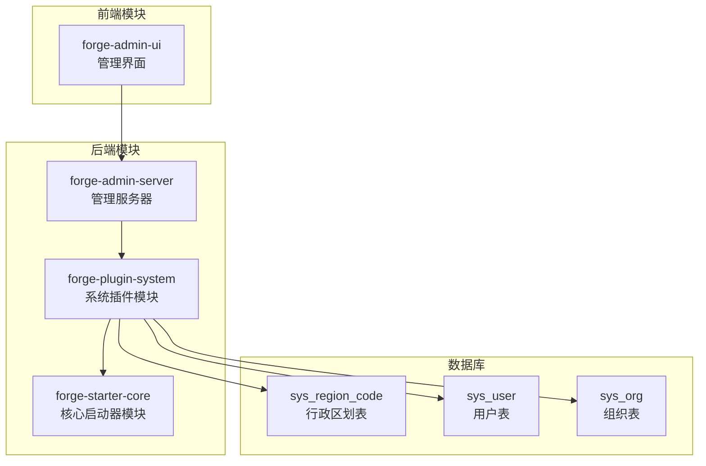
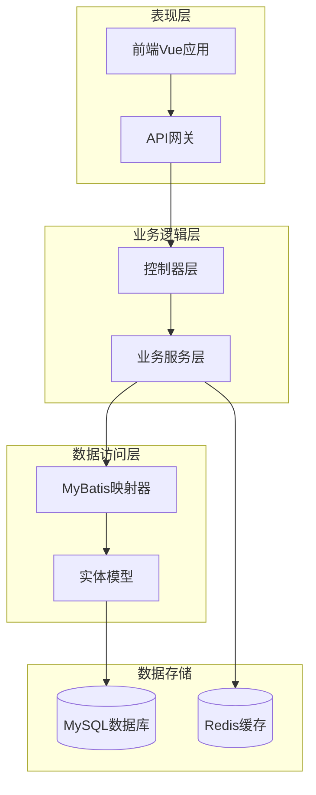
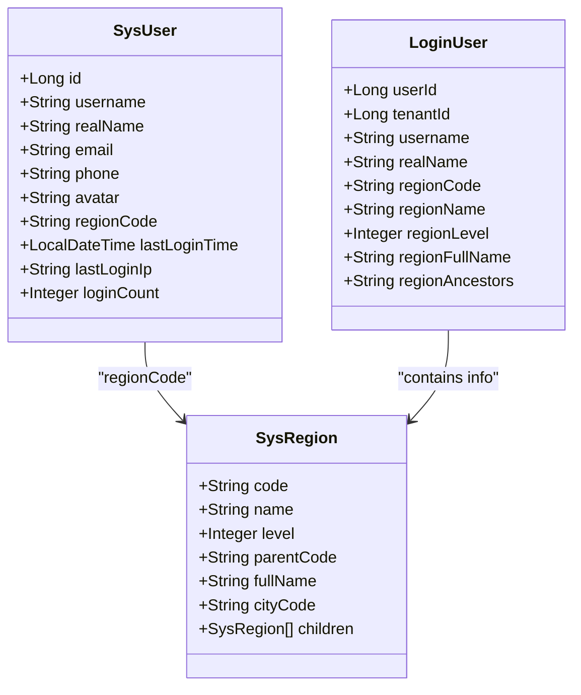
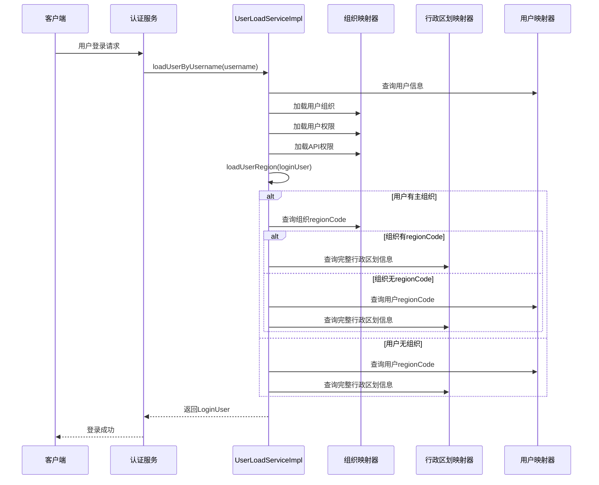
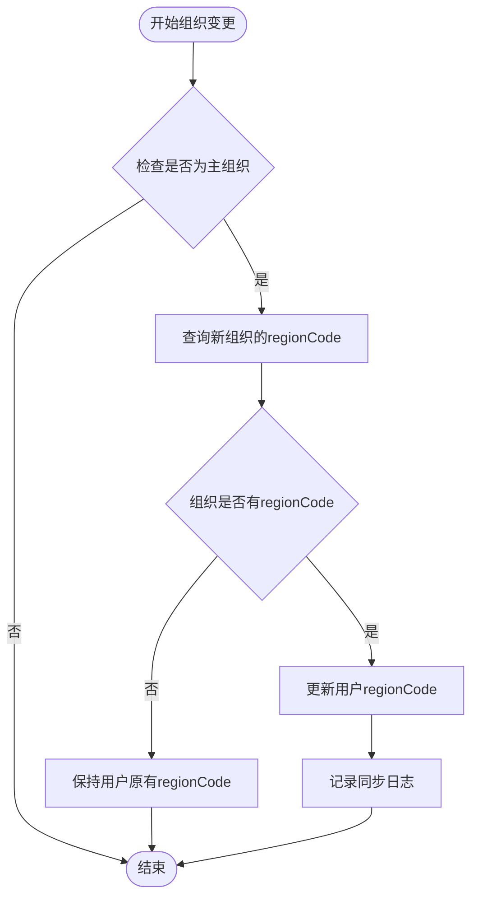
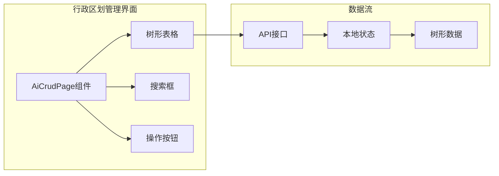
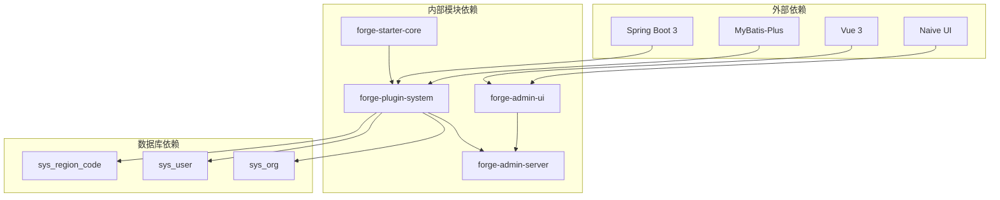

# 行政区域绑定系统

<cite>
**本文档引用的文件**
- [2025-04-28-region-binding-impl.md](file://docs/superpowers/plans/2025-04-28-region-binding-impl.md)
- [2025-04-28-region-binding-design.md](file://docs/superpowers/specs/2025-04-28-region-binding-design.md)
- [SysRegion.java](file://forge/forge-framework/forge-plugin-parent/forge-plugin-system/src/main/java/com/mdframe/forge/plugin/system/entity/SysRegion.java)
- [SysUser.java](file://forge/forge-framework/forge-plugin-parent/forge-plugin-system/src/main/java/com/mdframe/forge/plugin/system/entity/SysUser.java)
- [LoginUser.java](file://forge/forge-framework/forge-starter-parent/forge-starter-core/src/main/java/com/mdframe/forge/starter/core/session/LoginUser.java)
- [UserLoadServiceImpl.java](file://forge/forge-framework/forge-plugin-parent/forge-plugin-system/src/main/java/com/mdframe/forge/plugin/system/service/impl/UserLoadServiceImpl.java)
- [SysUserOrgServiceImpl.java](file://forge/forge-framework/forge-plugin-parent/forge-plugin-system/src/main/java/com/mdframe/forge/plugin/system/service/impl/SysUserOrgServiceImpl.java)
- [SysRegionController.java](file://forge/forge-framework/forge-plugin-parent/forge-plugin-system/src/main/java/com/mdframe/forge/plugin/system/controller/SysRegionController.java)
- [SysRegionServiceImpl.java](file://forge/forge-framework/forge-plugin-parent/forge-plugin-system/src/main/java/com/mdframe/forge/plugin/system/service/impl/SysRegionServiceImpl.java)
- [SysRegionDTO.java](file://forge/forge-framework/forge-plugin-parent/forge-plugin-system/src/main/java/com/mdframe/forge/plugin/system/dto/SysRegionDTO.java)
- [SysRegionTreeVO.java](file://forge/forge-framework/forge-plugin-parent/forge-plugin-system/src/main/java/com/mdframe/forge/plugin/system/vo/SysRegionTreeVO.java)
- [region.js](file://forge-admin-ui/src/api/system/region.js)
- [region.vue](file://forge-admin-ui/src/views/system/region.vue)
</cite>

## 目录
1. [简介](#简介)
2. [项目结构](#项目结构)
3. [核心组件](#核心组件)
4. [架构概览](#架构概览)
5. [详细组件分析](#详细组件分析)
6. [依赖关系分析](#依赖关系分析)
7. [性能考虑](#性能考虑)
8. [故障排除指南](#故障排除指南)
9. [结论](#结论)

## 简介

行政区域绑定系统是一个基于Forge框架开发的完整解决方案，旨在为组织管理和用户管理提供行政区划绑定功能。该系统支持组织和用户与行政区划的双向绑定，确保登录Session中包含完整的行政区划信息，为后续的数据权限控制和业务逻辑提供基础支撑。

系统采用Spring Boot 3 + MyBatis-Plus + Vue 3的技术栈，实现了完整的缓存方案，LoginUser存储完整的行政区划信息，登录时一次性加载，用户组织变更时同步更新regionCode。

## 项目结构

该项目采用模块化的Maven多模块架构，主要包含以下核心模块：

**图表来源**
- [2025-04-28-region-binding-impl.md:15-37](file://docs/superpowers/plans/2025-04-28-region-binding-impl.md#L15-L37)
- [2025-04-28-region-binding-design.md:39-74](file://docs/superpowers/specs/2025-04-28-region-binding-design.md#L39-L74)

**章节来源**
- [2025-04-28-region-binding-impl.md:13-37](file://docs/superpowers/plans/2025-04-28-region-binding-impl.md#L13-L37)
- [2025-04-28-region-binding-design.md:37-74](file://docs/superpowers/specs/2025-04-28-region-binding-design.md#L37-L74)

## 核心组件

### 数据模型组件

系统的核心数据模型包括三个关键实体：

1. **SysRegion** - 行政区划实体，存储行政区划的基本信息
2. **SysUser** - 用户实体，新增regionCode字段支持用户级行政区划绑定
3. **LoginUser** - 登录用户信息，新增五个行政区划相关字段

### 服务组件

系统提供了完整的CRUD服务层：

1. **ISysRegionService** - 行政区划服务接口
2. **SysRegionServiceImpl** - 行政区划服务实现，包含树形结构构建、搜索等功能
3. **UserLoadServiceImpl** - 用户加载服务，负责在登录时加载行政区划信息
4. **SysUserOrgServiceImpl** - 用户组织服务，处理组织变更时的行政区划同步

### 控制器组件

**SysRegionController** 提供RESTful API接口：

- `GET /system/region/tree` - 获取行政区划树形结构
- `GET /system/region/{code}` - 根据编码获取详情
- `POST /system/region/` - 新增行政区划
- `PUT /system/region/` - 更新行政区划
- `DELETE /system/region/{code}` - 删除行政区划
- `GET /system/region/children/{parentCode}` - 获取子级列表
- `GET /system/region/search?name={name}` - 搜索行政区划

### 前端组件

**章节来源**
- [SysRegion.java:14-56](file://forge/forge-framework/forge-plugin-parent/forge-plugin-system/src/main/java/com/mdframe/forge/plugin/system/entity/SysRegion.java#L14-L56)
- [SysUser.java:88-92](file://forge/forge-framework/forge-plugin-parent/forge-plugin-system/src/main/java/com/mdframe/forge/plugin/system/entity/SysUser.java#L88-L92)
- [LoginUser.java:110-134](file://forge/forge-framework/forge-starter-parent/forge-starter-core/src/main/java/com/mdframe/forge/starter/core/session/LoginUser.java#L110-L134)

## 架构概览

系统采用分层架构设计，实现了前后端分离和模块化开发：

**图表来源**
- [2025-04-28-region-binding-design.md:27-36](file://docs/superpowers/specs/2025-04-28-region-binding-design.md#L27-L36)

系统的核心优势在于其完整的缓存方案设计：

1. **LoginUser存储完整行政区划信息** - 包括编码、名称、级别、全名、祖级编码
2. **登录时一次性加载** - 避免重复查询，提升性能
3. **组织变更时同步更新** - 确保数据一致性
4. **支持多种查询场景** - 树形展示、搜索、懒加载等

**章节来源**
- [2025-04-28-region-binding-design.md:29-36](file://docs/superpowers/specs/2025-04-28-region-binding-design.md#L29-L36)

## 详细组件分析

### 数据模型设计

#### SysRegion实体类分析

SysRegion实体类设计遵循MyBatis-Plus的最佳实践：

**图表来源**
- [SysRegion.java:14-56](file://forge/forge-framework/forge-plugin-parent/forge-plugin-system/src/main/java/com/mdframe/forge/plugin/system/entity/SysRegion.java#L14-L56)
- [SysUser.java:18-119](file://forge/forge-framework/forge-plugin-parent/forge-plugin-system/src/main/java/com/mdframe/forge/plugin/system/entity/SysUser.java#L18-L119)
- [LoginUser.java:13-149](file://forge/forge-framework/forge-starter-parent/forge-starter-core/src/main/java/com/mdframe/forge/starter/core/session/LoginUser.java#L13-L149)

#### 字段设计规范

系统在字段设计上采用了严格的数据规范：

| 字段名称 | 类型 | 约束 | 描述 | 索引 |
|---------|------|------|------|------|
| code | VARCHAR(10) | PK | 行政区划代码 | 主键 |
| name | VARCHAR(50) | NOT NULL | 行政区划名称 | 无 |
| level | TINYINT | NOT NULL | 行政级别(1-省,2-市,3-区/县,4-街道) | 无 |
| parentCode | VARCHAR(10) | FK | 父级代码 | 无 |
| fullName | VARCHAR(200) | NOT NULL | 全名 | 无 |
| cityCode | VARCHAR(10) | NOT NULL | 地市编码 | 无 |

**章节来源**
- [SysRegion.java:20-49](file://forge/forge-framework/forge-plugin-parent/forge-plugin-system/src/main/java/com/mdframe/forge/plugin/system/entity/SysRegion.java#L20-L49)

### 服务层实现

#### UserLoadServiceImpl加载逻辑

UserLoadServiceImpl是系统的核心服务，负责在用户登录时加载完整的用户信息，包括行政区划信息：

**图表来源**
- [UserLoadServiceImpl.java:119-148](file://forge/forge-framework/forge-plugin-parent/forge-plugin-system/src/main/java/com/mdframe/forge/plugin/system/service/impl/UserLoadServiceImpl.java#L119-L148)
- [UserLoadServiceImpl.java:338-371](file://forge/forge-framework/forge-plugin-parent/forge-plugin-system/src/main/java/com/mdframe/forge/plugin/system/service/impl/UserLoadServiceImpl.java#L338-L371)

#### 组织变更同步机制

系统实现了智能的组织变更同步机制，确保用户行政区划信息的准确性：

**图表来源**
- [SysUserOrgServiceImpl.java:31-44](file://forge/forge-framework/forge-plugin-parent/forge-plugin-system/src/main/java/com/mdframe/forge/plugin/system/service/impl/SysUserOrgServiceImpl.java#L31-L44)
- [SysUserOrgServiceImpl.java:86-97](file://forge/forge-framework/forge-plugin-parent/forge-plugin-system/src/main/java/com/mdframe/forge/plugin/system/service/impl/SysUserOrgServiceImpl.java#L86-L97)

**章节来源**
- [UserLoadServiceImpl.java:332-391](file://forge/forge-framework/forge-plugin-parent/forge-plugin-system/src/main/java/com/mdframe/forge/plugin/system/service/impl/UserLoadServiceImpl.java#L332-L391)
- [SysUserOrgServiceImpl.java:28-97](file://forge/forge-framework/forge-plugin-parent/forge-plugin-system/src/main/java/com/mdframe/forge/plugin/system/service/impl/SysUserOrgServiceImpl.java#L28-L97)

### 前端实现

#### 行政区划管理页面

前端使用Vue 3和Naive UI构建了完整的行政区划管理界面：

**图表来源**
- [region.vue:3-38](file://forge-admin-ui/src/views/system/region.vue#L3-L38)
- [region.vue:71-118](file://forge-admin-ui/src/views/system/region.vue#L71-L118)

#### API接口设计

前端通过统一的API接口与后端交互：

| 接口方法 | URL路径 | 功能描述 |
|---------|---------|----------|
| GET | `/system/region/tree` | 获取行政区划树形结构 |
| GET | `/system/region/:code` | 获取行政区划详情 |
| POST | `/system/region/` | 新增行政区划 |
| PUT | `/system/region/` | 更新行政区划 |
| DELETE | `/system/region/:code` | 删除行政区划 |
| GET | `/system/region/children/:parentCode` | 获取子级列表 |
| GET | `/system/region/search` | 搜索行政区划 |

**章节来源**
- [region.vue:1-312](file://forge-admin-ui/src/views/system/region.vue#L1-L312)
- [region.js:1-50](file://forge-admin-ui/src/api/system/region.js#L1-L50)

## 依赖关系分析

系统采用清晰的依赖层次结构，避免循环依赖并确保模块间的松耦合：

**图表来源**
- [2025-04-28-region-binding-impl.md:7](file://docs/superpowers/plans/2025-04-28-region-binding-impl.md#L7)
- [2025-04-28-region-binding-design.md:9-17](file://docs/superpowers/specs/2025-04-28-region-binding-design.md#L9-L17)

系统的关键依赖关系包括：

1. **UserLoadServiceImpl** 依赖多个Mapper接口，包括SysOrgMapper、SysRegionMapper、SysUserMapper
2. **SysUserOrgServiceImpl** 依赖SysOrgMapper和SysUserMapper，实现组织变更时的同步逻辑
3. **SysRegionServiceImpl** 依赖SysRegionMapper，提供完整的CRUD操作

**章节来源**
- [UserLoadServiceImpl.java:31-41](file://forge/forge-framework/forge-plugin-parent/forge-plugin-system/src/main/java/com/mdframe/forge/plugin/system/service/impl/UserLoadServiceImpl.java#L31-L41)
- [SysUserOrgServiceImpl.java:25-26](file://forge/forge-framework/forge-plugin-parent/forge-plugin-system/src/main/java/com/mdframe/forge/plugin/system/service/impl/SysUserOrgServiceImpl.java#L25-L26)
- [SysRegionServiceImpl.java:471](file://forge/forge-framework/forge-plugin-parent/forge-plugin-system/src/main/java/com/mdframe/forge/plugin/system/service/impl/SysRegionServiceImpl.java#L471)

## 性能考虑

### 缓存策略

系统采用完整的缓存方案来优化性能：

1. **LoginUser缓存** - 登录时一次性加载所有行政区划信息到Session中
2. **树形结构缓存** - 行政区划树形结构可缓存到Redis中
3. **懒加载优化** - 前端实现懒加载机制，减少初始加载压力

### 查询优化

1. **索引设计** - 在sys_user表的region_code字段建立索引
2. **查询优化** - 使用LambdaQueryWrapper进行高效的条件查询
3. **批量操作** - 支持批量查询和更新操作

### 扩展性考虑

1. **数据导入** - 支持Excel导入大量行政区划数据
2. **缓存优化** - 可考虑在SysRegion表中增加ancestors字段预存储
3. **异步处理** - 对于大数据量的操作可考虑异步处理

## 故障排除指南

### 常见问题及解决方案

#### 登录后行政区划信息缺失

**问题描述**：用户登录后，LoginUser中的行政区划信息为空

**可能原因**：
1. 用户没有绑定组织或用户本身没有regionCode
2. 组织regionCode字段为空
3. 行政区划数据不完整

**解决步骤**：
1. 检查用户是否绑定了组织
2. 验证组织的regionCode字段是否正确设置
3. 确认sys_region_code表中是否存在对应的行政区划数据

#### 组织变更后行政区划未更新

**问题描述**：用户更换主组织后，行政区划信息没有同步更新

**解决步骤**：
1. 检查SysUserOrgServiceImpl的syncUserRegionCode方法是否被调用
2. 验证新组织的regionCode字段是否正确
3. 查看系统日志确认同步过程

#### 前端树形结构加载异常

**问题描述**：行政区划管理页面的树形结构无法正常加载

**解决步骤**：
1. 检查API接口 `/system/region/tree` 的响应
2. 验证前端的懒加载实现
3. 确认数据库连接和权限配置

**章节来源**
- [UserLoadServiceImpl.java:338-371](file://forge/forge-framework/forge-plugin-parent/forge-plugin-system/src/main/java/com/mdframe/forge/plugin/system/service/impl/UserLoadServiceImpl.java#L338-L371)
- [SysUserOrgServiceImpl.java:86-97](file://forge/forge-framework/forge-plugin-parent/forge-plugin-system/src/main/java/com/mdframe/forge/plugin/system/service/impl/SysUserOrgServiceImpl.java#L86-L97)

## 结论

行政区域绑定系统是一个设计完善、实现严谨的企业级解决方案。系统通过以下关键特性实现了高效的数据管理：

1. **完整的数据模型设计** - 包含SysRegion、SysUser、LoginUser三个核心实体，满足各种业务场景需求

2. **智能的加载机制** - 采用优先级规则确保行政区划信息的准确性和完整性

3. **完善的同步机制** - 组织变更时自动同步用户行政区划信息，保证数据一致性

4. **优秀的前端体验** - 基于Vue 3和Naive UI构建的现代化管理界面

5. **良好的扩展性** - 模块化设计便于后续功能扩展和维护

该系统为后续的数据权限控制、业务逻辑扩展奠定了坚实的基础，是Forge框架生态中的重要组成部分。