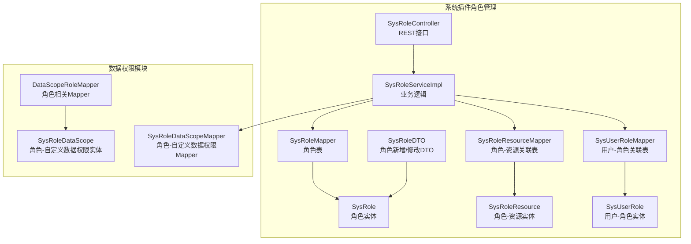
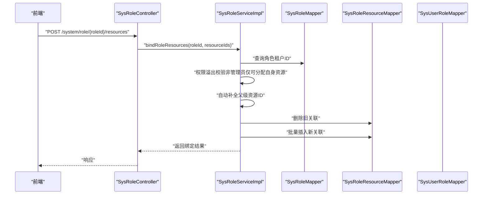
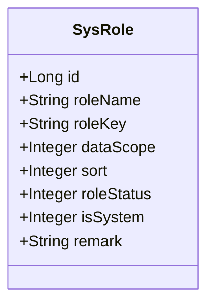
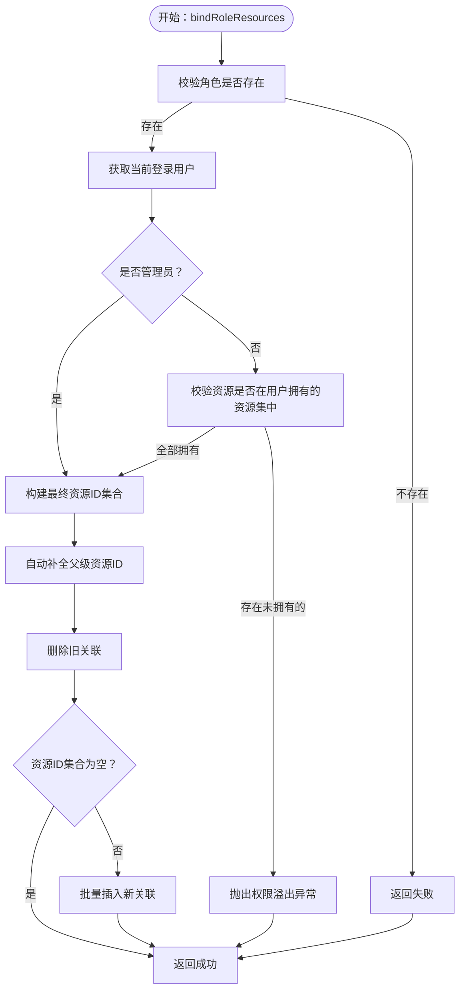
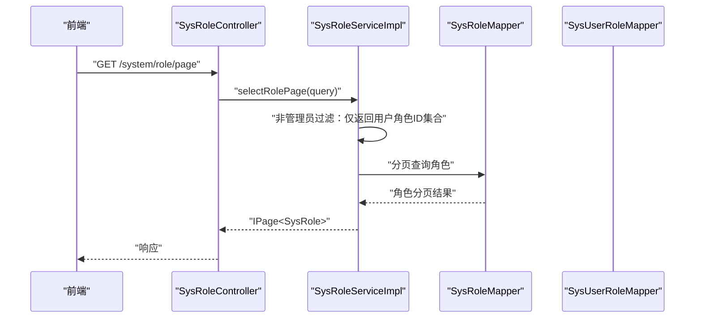
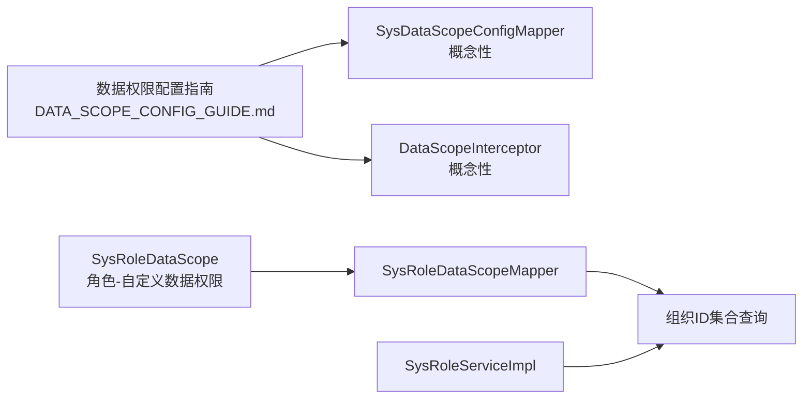
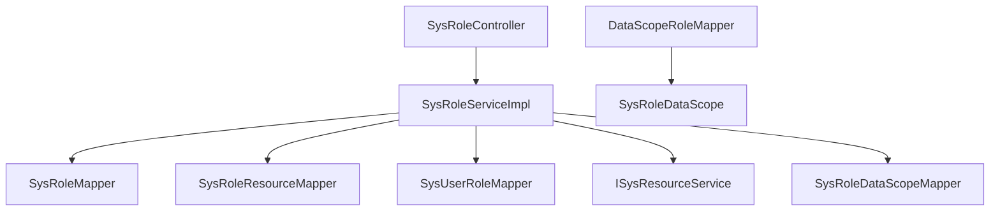

# 角色管理

<cite>
**本文引用的文件**
- [SysRole.java](file://forge/forge-framework/forge-plugin-parent/forge-plugin-system/src/main/java/com/mdframe/forge/plugin/system/entity/SysRole.java)
- [SysRoleResource.java](file://forge/forge-framework/forge-plugin-parent/forge-plugin-system/src/main/java/com/mdframe/forge/plugin/system/entity/SysRoleResource.java)
- [SysUserRole.java](file://forge/forge-framework/forge-plugin-parent/forge-plugin-system/src/main/java/com/mdframe/forge/plugin/system/entity/SysUserRole.java)
- [SysRoleController.java](file://forge/forge-framework/forge-plugin-parent/forge-plugin-system/src/main/java/com/mdframe/forge/plugin/system/controller/SysRoleController.java)
- [ISysRoleService.java](file://forge/forge-framework/forge-plugin-parent/forge-plugin-system/src/main/java/com/mdframe/forge/plugin/system/service/ISysRoleService.java)
- [SysRoleServiceImpl.java](file://forge/forge-framework/forge-plugin-parent/forge-plugin-system/src/main/java/com/mdframe/forge/plugin/system/service/impl/SysRoleServiceImpl.java)
- [SysRoleMapper.java](file://forge/forge-framework/forge-plugin-parent/forge-plugin-system/src/main/java/com/mdframe/forge/plugin/system/mapper/SysRoleMapper.java)
- [SysRoleResourceMapper.java](file://forge/forge-framework/forge-plugin-parent/forge-plugin-system/src/main/java/com/mdframe/forge/plugin/system/mapper/SysRoleResourceMapper.java)
- [SysUserRoleMapper.java](file://forge/forge-framework/forge-plugin-parent/forge-plugin-system/src/main/java/com/mdframe/forge/plugin/system/mapper/SysUserRoleMapper.java)
- [SysRoleDTO.java](file://forge/forge-framework/forge-plugin-parent/forge-plugin-system/src/main/java/com/mdframe/forge/plugin/system/dto/SysRoleDTO.java)
- [SysRoleDataScope.java](file://forge/forge-framework/forge-starter-parent/forge-starter-datascope/src/main/java/com/mdframe/forge/starter/datascope/entity/SysRoleDataScope.java)
- [SysRoleDataScopeMapper.java](file://forge/forge-framework/forge-starter-parent/forge-starter-datascope/src/main/java/com/mdframe/forge/starter/datascope/mapper/SysRoleDataScopeMapper.java)
- [DataScopeRoleMapper.java](file://forge/forge-framework/forge-starter-parent/forge-starter-datascope/src/main/java/com/mdframe/forge/starter/datascope/mapper/DataScopeRoleMapper.java)
- [DATA_SCOPE_CONFIG_GUIDE.md](file://forge/forge-framework/forge-starter-parent/forge-starter-datascope/DATA_SCOPE_CONFIG_GUIDE.md)
- [SysRoleController.java（前端路由）](file://forge-admin-ui/src/views/system/role.vue)
- [test_auth_data.sql](file://forge/forge-admin/src/main/resources/sql/test_auth_data.sql)
- [api_resources_example.sql](file://forge/forge-admin/src/main/resources/sql/api_resources_example.sql)
</cite>

## 目录
1. [简介](#简介)
2. [项目结构](#项目结构)
3. [核心组件](#核心组件)
4. [架构总览](#架构总览)
5. [详细组件分析](#详细组件分析)
6. [依赖关系分析](#依赖关系分析)
7. [性能考量](#性能考量)
8. [故障排查指南](#故障排查指南)
9. [结论](#结论)
10. [附录](#附录)

## 简介
本文件面向Forge框架的角色管理能力，系统化阐述角色实体模型、角色权限映射机制、数据范围配置与角色继承关系，并结合角色与用户的关联管理、角色与资源的权限绑定、角色状态控制等实现细节，提供完整的角色管理API接口、前端页面组件以及实际业务场景示例，帮助开发者构建灵活可控的角色权限管理体系。

## 项目结构
角色管理功能主要分布在系统插件模块与数据权限模块中，采用“控制器-服务-持久层”的分层设计，配合资源与用户-角色关联表实现权限闭环。前端通过系统管理下的角色页面进行可视化操作。

图表来源
- [SysRoleController.java](file://forge/forge-framework/forge-plugin-parent/forge-plugin-system/src/main/java/com/mdframe/forge/plugin/system/controller/SysRoleController.java#L1-L111)
- [SysRoleServiceImpl.java](file://forge/forge-framework/forge-plugin-parent/forge-plugin-system/src/main/java/com/mdframe/forge/plugin/system/service/impl/SysRoleServiceImpl.java#L1-L227)
- [SysRoleMapper.java](file://forge/forge-framework/forge-plugin-parent/forge-plugin-system/src/main/java/com/mdframe/forge/plugin/system/mapper/SysRoleMapper.java#L1-L14)
- [SysRoleResourceMapper.java](file://forge/forge-framework/forge-plugin-parent/forge-plugin-system/src/main/java/com/mdframe/forge/plugin/system/mapper/SysRoleResourceMapper.java#L1-L14)
- [SysUserRoleMapper.java](file://forge/forge-framework/forge-plugin-parent/forge-plugin-system/src/main/java/com/mdframe/forge/plugin/system/mapper/SysUserRoleMapper.java#L1-L14)
- [SysRole.java](file://forge/forge-framework/forge-plugin-parent/forge-plugin-system/src/main/java/com/mdframe/forge/plugin/system/entity/SysRole.java#L1-L60)
- [SysRoleResource.java](file://forge/forge-framework/forge-plugin-parent/forge-plugin-system/src/main/java/com/mdframe/forge/plugin/system/entity/SysRoleResource.java#L1-L46)
- [SysUserRole.java](file://forge/forge-framework/forge-plugin-parent/forge-plugin-system/src/main/java/com/mdframe/forge/plugin/system/entity/SysUserRole.java#L1-L46)
- [SysRoleDataScope.java](file://forge/forge-framework/forge-starter-parent/forge-starter-datascope/src/main/java/com/mdframe/forge/starter/datascope/entity/SysRoleDataScope.java#L1-L46)
- [SysRoleDataScopeMapper.java](file://forge/forge-framework/forge-starter-parent/forge-starter-datascope/src/main/java/com/mdframe/forge/starter/datascope/mapper/SysRoleDataScopeMapper.java#L1-L30)
- [DataScopeRoleMapper.java](file://forge/forge-framework/forge-starter-parent/forge-starter-datascope/src/main/java/com/mdframe/forge/starter/datascope/mapper/DataScopeRoleMapper.java#L1-L36)

章节来源
- [SysRoleController.java](file://forge/forge-framework/forge-plugin-parent/forge-plugin-system/src/main/java/com/mdframe/forge/plugin/system/controller/SysRoleController.java#L1-L111)
- [SysRoleServiceImpl.java](file://forge/forge-framework/forge-plugin-parent/forge-plugin-system/src/main/java/com/mdframe/forge/plugin/system/service/impl/SysRoleServiceImpl.java#L1-L227)

## 核心组件
- 角色实体模型：SysRole，包含角色名称、角色权限字符串、数据范围、排序、状态、是否系统内置、备注等字段，继承租户实体，支持多租户隔离。
- 角色-资源关联：SysRoleResource，记录角色与资源（菜单/按钮/API）的绑定关系，支持按租户隔离。
- 用户-角色关联：SysUserRole，记录用户与角色的绑定关系，支持按租户隔离。
- 角色服务接口与实现：ISysRoleService与SysRoleServiceImpl，提供角色分页查询、新增、修改、删除、资源绑定/解绑、查询角色资源ID列表、查询当前用户角色ID列表等能力。
- 控制器：SysRoleController，暴露REST接口，统一加密/解密与权限忽略注解，便于前后端交互。
- 数据范围配置：SysRoleDataScope及相关Mapper，支持基于角色的自定义组织维度数据权限；数据权限模块提供可视化配置指南。

章节来源
- [SysRole.java](file://forge/forge-framework/forge-plugin-parent/forge-plugin-system/src/main/java/com/mdframe/forge/plugin/system/entity/SysRole.java#L1-L60)
- [SysRoleResource.java](file://forge/forge-framework/forge-plugin-parent/forge-plugin-system/src/main/java/com/mdframe/forge/plugin/system/entity/SysRoleResource.java#L1-L46)
- [SysUserRole.java](file://forge/forge-framework/forge-plugin-parent/forge-plugin-system/src/main/java/com/mdframe/forge/plugin/system/entity/SysUserRole.java#L1-L46)
- [ISysRoleService.java](file://forge/forge-framework/forge-plugin-parent/forge-plugin-system/src/main/java/com/mdframe/forge/plugin/system/service/ISysRoleService.java#L1-L97)
- [SysRoleServiceImpl.java](file://forge/forge-framework/forge-plugin-parent/forge-plugin-system/src/main/java/com/mdframe/forge/plugin/system/service/impl/SysRoleServiceImpl.java#L1-L227)
- [SysRoleController.java](file://forge/forge-framework/forge-plugin-parent/forge-plugin-system/src/main/java/com/mdframe/forge/plugin/system/controller/SysRoleController.java#L1-L111)
- [SysRoleDataScope.java](file://forge/forge-framework/forge-starter-parent/forge-starter-datascope/src/main/java/com/mdframe/forge/starter/datascope/entity/SysRoleDataScope.java#L1-L46)
- [SysRoleDataScopeMapper.java](file://forge/forge-framework/forge-starter-parent/forge-starter-datascope/src/main/java/com/mdframe/forge/starter/datascope/mapper/SysRoleDataScopeMapper.java#L1-L30)
- [DataScopeRoleMapper.java](file://forge/forge-framework/forge-starter-parent/forge-starter-datascope/src/main/java/com/mdframe/forge/starter/datascope/mapper/DataScopeRoleMapper.java#L1-L36)

## 架构总览
角色管理遵循“控制器-服务-持久层”分层架构，结合资源与用户-角色关联表，形成角色-资源-用户的权限闭环。服务层对权限溢出进行防御性校验，确保非管理员无法分配自身未拥有的资源权限；同时在资源绑定时自动补全父级节点，保证菜单树渲染完整性。

图表来源
- [SysRoleController.java](file://forge/forge-framework/forge-plugin-parent/forge-plugin-system/src/main/java/com/mdframe/forge/plugin/system/controller/SysRoleController.java#L87-L91)
- [SysRoleServiceImpl.java](file://forge/forge-framework/forge-plugin-parent/forge-plugin-system/src/main/java/com/mdframe/forge/plugin/system/service/impl/SysRoleServiceImpl.java#L95-L168)
- [SysRoleMapper.java](file://forge/forge-framework/forge-plugin-parent/forge-plugin-system/src/main/java/com/mdframe/forge/plugin/system/mapper/SysRoleMapper.java#L1-L14)
- [SysRoleResourceMapper.java](file://forge/forge-framework/forge-plugin-parent/forge-plugin-system/src/main/java/com/mdframe/forge/plugin/system/mapper/SysRoleResourceMapper.java#L1-L14)

## 详细组件分析

### 角色实体模型与数据范围
- 字段说明
  - 角色ID、角色名称（租户内唯一）、角色权限字符串、数据范围、排序、角色状态、是否系统内置、备注。
  - 数据范围枚举值覆盖全部数据、本租户数据、本组织数据、本组织及子组织、个人数据。
- 设计要点
  - 继承租户实体，天然支持多租户隔离。
  - 角色状态用于快速启用/禁用角色，避免误删。
  - 角色权限字符串可用于扩展细粒度权限标识。

图表来源
- [SysRole.java](file://forge/forge-framework/forge-plugin-parent/forge-plugin-system/src/main/java/com/mdframe/forge/plugin/system/entity/SysRole.java#L1-L60)

章节来源
- [SysRole.java](file://forge/forge-framework/forge-plugin-parent/forge-plugin-system/src/main/java/com/mdframe/forge/plugin/system/entity/SysRole.java#L1-L60)

### 角色-资源关联与资源绑定流程
- 关联表SysRoleResource记录角色与资源的绑定关系，支持按租户隔离。
- 绑定流程要点
  - 权限溢出校验：非管理员仅能分配其自身拥有的资源，防止越权。
  - 自动补全父级资源ID：确保菜单树渲染完整，避免父节点缺失导致的UI异常。
  - 清空策略：当传入空集合时，表示清空该角色所有资源权限。
  - 批量插入：提升资源绑定效率。

图表来源
- [SysRoleServiceImpl.java](file://forge/forge-framework/forge-plugin-parent/forge-plugin-system/src/main/java/com/mdframe/forge/plugin/system/service/impl/SysRoleServiceImpl.java#L95-L168)

章节来源
- [SysRoleServiceImpl.java](file://forge/forge-framework/forge-plugin-parent/forge-plugin-system/src/main/java/com/mdframe/forge/plugin/system/service/impl/SysRoleServiceImpl.java#L95-L168)
- [SysRoleResource.java](file://forge/forge-framework/forge-plugin-parent/forge-plugin-system/src/main/java/com/mdframe/forge/plugin/system/entity/SysRoleResource.java#L1-L46)

### 用户-角色关联与角色查询
- 关联表SysUserRole记录用户与角色的绑定关系，支持按租户隔离。
- 查询策略
  - 非管理员用户仅能查询其自身拥有的角色，防止权限溢出。
  - 管理员可查询全量角色。
  - 提供查询当前用户角色ID列表的能力，用于权限计算与数据范围判定。

图表来源
- [SysRoleController.java](file://forge/forge-framework/forge-plugin-parent/forge-plugin-system/src/main/java/com/mdframe/forge/plugin/system/controller/SysRoleController.java#L33-L37)
- [SysRoleServiceImpl.java](file://forge/forge-framework/forge-plugin-parent/forge-plugin-system/src/main/java/com/mdframe/forge/plugin/system/service/impl/SysRoleServiceImpl.java#L41-L63)
- [SysUserRoleMapper.java](file://forge/forge-framework/forge-plugin-parent/forge-plugin-system/src/main/java/com/mdframe/forge/plugin/system/mapper/SysUserRoleMapper.java#L1-L14)

章节来源
- [SysRoleServiceImpl.java](file://forge/forge-framework/forge-plugin-parent/forge-plugin-system/src/main/java/com/mdframe/forge/plugin/system/service/impl/SysRoleServiceImpl.java#L41-L63)
- [SysUserRole.java](file://forge/forge-framework/forge-plugin-parent/forge-plugin-system/src/main/java/com/mdframe/forge/plugin/system/entity/SysUserRole.java#L1-L46)

### 数据范围配置与自定义数据权限
- 角色-自定义数据权限实体SysRoleDataScope，支持为角色绑定特定组织维度的自定义数据权限。
- 数据权限模块提供可视化配置指南，支持：
  - 资源编码、资源名称、Mapper方法、表别名、用户/组织/租户字段配置。
  - 简单模式与复杂SQL模式，支持占位符注入（用户ID、组织ID列表、租户ID等）。
  - 最小数据权限范围计算，用于合并多个角色的数据权限。
- 使用建议
  - 通过系统管理→角色管理为角色分配“数据权限配置”菜单及其子权限。
  - 配置修改后系统自动刷新缓存，立即生效。

图表来源
- [DATA_SCOPE_CONFIG_GUIDE.md](file://forge/forge-framework/forge-starter-parent/forge-starter-datascope/DATA_SCOPE_CONFIG_GUIDE.md#L1-L291)
- [SysRoleDataScope.java](file://forge/forge-framework/forge-starter-parent/forge-starter-datascope/src/main/java/com/mdframe/forge/starter/datascope/entity/SysRoleDataScope.java#L1-L46)
- [SysRoleDataScopeMapper.java](file://forge/forge-framework/forge-starter-parent/forge-starter-datascope/src/main/java/com/mdframe/forge/starter/datascope/mapper/SysRoleDataScopeMapper.java#L1-L30)
- [DataScopeRoleMapper.java](file://forge/forge-framework/forge-starter-parent/forge-starter-datascope/src/main/java/com/mdframe/forge/starter/datascope/mapper/DataScopeRoleMapper.java#L1-L36)

章节来源
- [DATA_SCOPE_CONFIG_GUIDE.md](file://forge/forge-framework/forge-starter-parent/forge-starter-datascope/DATA_SCOPE_CONFIG_GUIDE.md#L1-L291)
- [SysRoleDataScope.java](file://forge/forge-framework/forge-starter-parent/forge-starter-datascope/src/main/java/com/mdframe/forge/starter/datascope/entity/SysRoleDataScope.java#L1-L46)
- [SysRoleDataScopeMapper.java](file://forge/forge-framework/forge-starter-parent/forge-starter-datascope/src/main/java/com/mdframe/forge/starter/datascope/mapper/SysRoleDataScopeMapper.java#L1-L30)
- [DataScopeRoleMapper.java](file://forge/forge-framework/forge-starter-parent/forge-starter-datascope/src/main/java/com/mdframe/forge/starter/datascope/mapper/DataScopeRoleMapper.java#L1-L36)

### 角色API接口清单
- 分页查询角色列表
  - 方法：GET
  - 路径：/system/role/page
  - 请求参数：SysRoleQuery（支持租户ID、角色名称、角色权限字符串、状态等）
  - 响应：分页角色列表
- 根据ID查询角色详情
  - 方法：POST
  - 路径：/system/role/getById
  - 请求参数：id（角色ID）
  - 响应：角色详情
- 新增角色
  - 方法：POST
  - 路径：/system/role/add
  - 请求体：SysRoleDTO
  - 响应：操作结果
- 修改角色
  - 方法：POST
  - 路径：/system/role/edit
  - 请求体：SysRoleDTO
  - 响应：操作结果
- 删除角色
  - 方法：POST
  - 路径：/system/role/remove
  - 请求参数：id（角色ID）
  - 响应：操作结果
- 批量删除角色
  - 方法：POST
  - 路径：/system/role/removeBatch
  - 请求体：ids（角色ID数组）
  - 响应：操作结果
- 绑定角色资源
  - 方法：POST
  - 路径：/system/role/{roleId}/resources
  - 请求体：resourceIds（资源ID数组）
  - 响应：操作结果
- 解除角色资源
  - 方法：POST
  - 路径：/system/role/{roleId}/resources/unbind
  - 请求体：resourceIds（资源ID数组）
  - 响应：操作结果
- 查询角色的资源ID列表
  - 方法：GET
  - 路径：/system/role/{roleId}/resources
  - 响应：资源ID列表（优化：仅返回叶子节点）

章节来源
- [SysRoleController.java](file://forge/forge-framework/forge-plugin-parent/forge-plugin-system/src/main/java/com/mdframe/forge/plugin/system/controller/SysRoleController.java#L33-L109)
- [ISysRoleService.java](file://forge/forge-framework/forge-plugin-parent/forge-plugin-system/src/main/java/com/mdframe/forge/plugin/system/service/ISysRoleService.java#L17-L96)

### 前端页面组件
- 角色管理页面：位于系统管理模块，提供角色列表展示、新增/编辑、删除、资源授权、状态切换等操作入口。
- 页面组件职责
  - 列表查询：调用分页接口，支持筛选与排序。
  - 新增/编辑：提交SysRoleDTO，包含角色名称、权限字符串、数据范围、排序、状态、备注等。
  - 资源授权：打开授权弹窗，选择资源树，调用绑定/解绑接口。
  - 状态控制：支持启用/禁用角色。

章节来源
- [SysRoleController.java（前端路由）](file://forge-admin-ui/src/views/system/role.vue)

### 实际业务场景示例
- 场景一：超级管理员拥有所有接口权限
  - 说明：超级管理员类型用户自动拥有所有资源权限，无需额外绑定。
  - 参考：测试数据中超级管理员角色绑定全部资源。
- 场景二：普通用户仅有查询权限
  - 说明：普通用户仅被授予菜单查询与部分API查询权限，不包含新增/修改等敏感操作。
  - 参考：测试数据中普通用户角色仅绑定查询相关资源。
- 场景三：部门管理员拥有部门管理权限
  - 说明：部门管理员可进行用户管理的部分操作（查询、新增、修改），但受限于数据范围。
  - 参考：测试数据中部门管理员角色绑定组织管理相关资源。

章节来源
- [test_auth_data.sql](file://forge/forge-admin/src/main/resources/sql/test_auth_data.sql#L93-L122)
- [api_resources_example.sql](file://forge/forge-admin/src/main/resources/sql/api_resources_example.sql#L50-L64)

## 依赖关系分析
- 控制器依赖服务接口，服务实现依赖Mapper与资源服务，形成清晰的依赖链。
- 角色服务在资源绑定时依赖资源服务进行权限溢出校验与父级资源补全。
- 数据权限模块通过Mapper查询角色ID列表与最小数据范围，支撑数据权限拦截器的决策。

图表来源
- [SysRoleController.java](file://forge/forge-framework/forge-plugin-parent/forge-plugin-system/src/main/java/com/mdframe/forge/plugin/system/controller/SysRoleController.java#L1-L111)
- [SysRoleServiceImpl.java](file://forge/forge-framework/forge-plugin-parent/forge-plugin-system/src/main/java/com/mdframe/forge/plugin/system/service/impl/SysRoleServiceImpl.java#L1-L227)
- [SysRoleMapper.java](file://forge/forge-framework/forge-plugin-parent/forge-plugin-system/src/main/java/com/mdframe/forge/plugin/system/mapper/SysRoleMapper.java#L1-L14)
- [SysRoleResourceMapper.java](file://forge/forge-framework/forge-plugin-parent/forge-plugin-system/src/main/java/com/mdframe/forge/plugin/system/mapper/SysRoleResourceMapper.java#L1-L14)
- [SysUserRoleMapper.java](file://forge/forge-framework/forge-plugin-parent/forge-plugin-system/src/main/java/com/mdframe/forge/plugin/system/mapper/SysUserRoleMapper.java#L1-L14)
- [SysRoleDataScopeMapper.java](file://forge/forge-framework/forge-starter-parent/forge-starter-datascope/src/main/java/com/mdframe/forge/starter/datascope/mapper/SysRoleDataScopeMapper.java#L1-L30)
- [DataScopeRoleMapper.java](file://forge/forge-framework/forge-starter-parent/forge-starter-datascope/src/main/java/com/mdframe/forge/starter/datascope/mapper/DataScopeRoleMapper.java#L1-L36)

章节来源
- [SysRoleServiceImpl.java](file://forge/forge-framework/forge-plugin-parent/forge-plugin-system/src/main/java/com/mdframe/forge/plugin/system/service/impl/SysRoleServiceImpl.java#L1-L227)

## 性能考量
- 资源绑定批处理：批量插入新关联，减少多次数据库往返。
- 父级资源补全：一次性遍历资源树构建父级映射，避免重复查询。
- 分页查询优化：按排序与时间倒序，结合非管理员过滤，减少无效数据扫描。
- 数据权限缓存：数据权限配置变更后自动刷新缓存，降低运行时开销。

## 故障排查指南
- 绑定资源报错“权限溢出”
  - 现象：非管理员尝试分配自身未拥有的资源权限。
  - 处理：确认当前用户拥有的资源范围，或提升为管理员。
- 菜单树显示异常
  - 现象：父节点缺失导致子节点无法勾选。
  - 处理：重新绑定资源，服务层会自动补全父级资源ID。
- 查询不到角色
  - 现象：非管理员查询角色为空。
  - 处理：确认当前用户的角色ID集合是否为空，或检查角色是否被正确分配。
- 数据权限不生效
  - 现象：配置后查询结果异常。
  - 处理：检查配置是否启用、Mapper方法路径、表别名、字段名是否正确；必要时使用EXPLAIN分析SQL。

章节来源
- [SysRoleServiceImpl.java](file://forge/forge-framework/forge-plugin-parent/forge-plugin-system/src/main/java/com/mdframe/forge/plugin/system/service/impl/SysRoleServiceImpl.java#L107-L118)
- [DATA_SCOPE_CONFIG_GUIDE.md](file://forge/forge-framework/forge-starter-parent/forge-starter-datascope/DATA_SCOPE_CONFIG_GUIDE.md#L228-L260)

## 结论
Forge框架的角色管理以清晰的分层架构与完善的权限校验机制为基础，结合资源绑定的父级补全策略与数据权限模块的可视化配置，能够满足多租户、多组织、多角色的复杂权限需求。通过标准的REST接口与前端页面组件，开发者可快速搭建灵活可控的角色权限管理体系。

## 附录
- 角色状态枚举：0-禁用，1-正常
- 数据范围枚举：1-全部数据，2-本租户数据，3-本组织数据，4-本组织及子组织，5-个人数据
- API资源绑定说明：在资源表中配置API资源（资源类型=4），在URL字段填写接口路径（支持通配符），再将API资源分配给角色。

章节来源
- [SysRole.java](file://forge/forge-framework/forge-plugin-parent/forge-plugin-system/src/main/java/com/mdframe/forge/plugin/system/entity/SysRole.java#L36-L48)
- [api_resources_example.sql](file://forge/forge-admin/src/main/resources/sql/api_resources_example.sql#L50-L64)