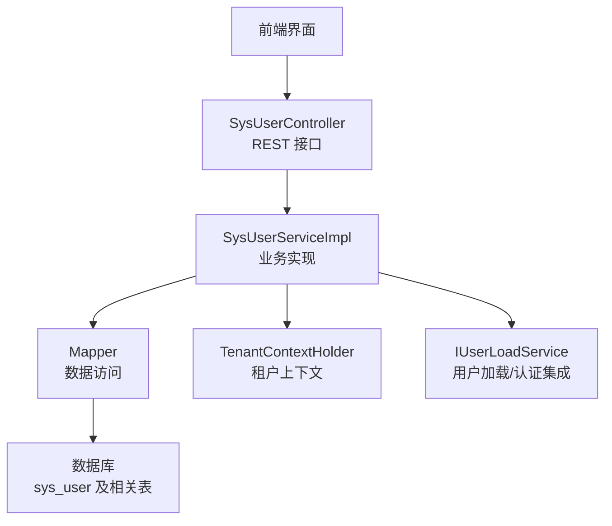
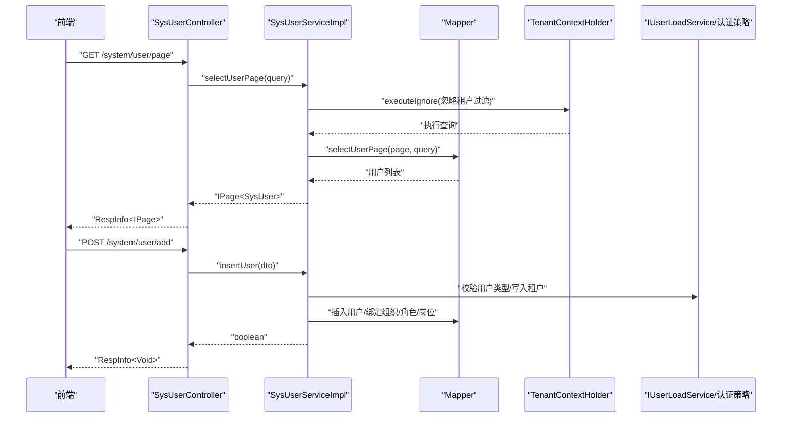
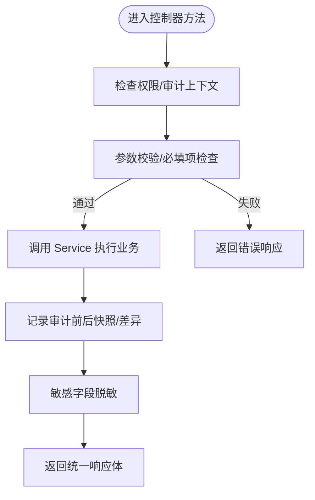
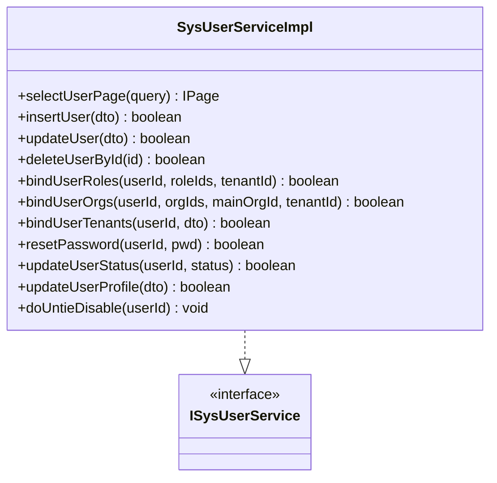
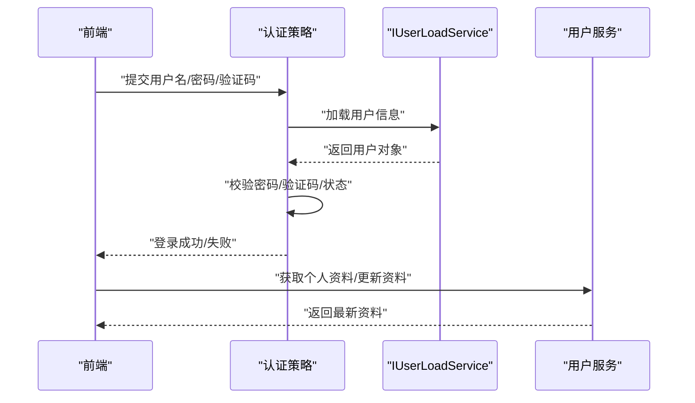
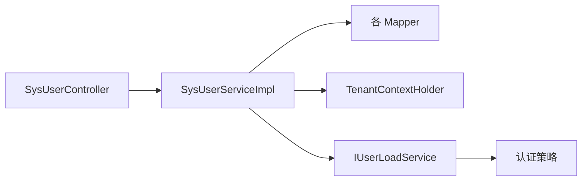

# 用户管理

<cite>
**本文引用的文件**
- [SysUserController.java](file://forge-server/forge-framework/forge-plugin-parent/forge-plugin-system/src/main/java/com/mdframe/forge/plugin/system/controller/SysUserController.java)
- [SysUserServiceImpl.java](file://forge-server/forge-framework/forge-plugin-parent/forge-plugin-system/src/main/java/com/mdframe/forge/plugin/system/service/impl/SysUserServiceImpl.java)
- [ISysUserService.java](file://forge-server/forge-framework/forge-plugin-parent/forge-plugin-system/src/main/java/com/mdframe/forge/plugin/system/service/ISysUserService.java)
- [SysUser.java](file://forge-server/forge-framework/forge-plugin-parent/forge-plugin-system/src/main/java/com/mdframe/forge/plugin/system/entity/SysUser.java)
- [UserLoadServiceImpl.java](file://forge-server/forge-framework/forge-plugin-parent/forge-plugin-system/src/main/java/com/mdframe/forge/plugin/system/service/impl/UserLoadServiceImpl.java)
- [UsernamePasswordAuthStrategy.java](file://forge-server/forge-framework/forge-plugin-parent/forge-plugin-system/src/main/java/com/mdframe/forge/plugin/system/strategy/UsernamePasswordAuthStrategy.java)
- [UsernamePasswordCaptchaAuthStrategy.java](file://forge-server/forge-framework/forge-plugin-parent/forge-plugin-system/src/main/java/com/mdframe/forge/plugin/system/strategy/UsernamePasswordCaptchaAuthStrategy.java)
- [SysOnlineUserController.java](file://forge-server/forge-framework/forge-plugin-parent/forge-plugin-system/src/main/java/com/mdframe/forge/plugin/system/controller/SysOnlineUserController.java)
</cite>

## 目录
1. [简介](#简介)
2. [项目结构](#项目结构)
3. [核心组件](#核心组件)
4. [架构总览](#架构总览)
5. [详细组件分析](#详细组件分析)
6. [依赖关系分析](#依赖关系分析)
7. [性能与扩展性](#性能与扩展性)
8. [故障排查指南](#故障排查指南)
9. [结论](#结论)
10. [附录：API 接口说明](#附录api-接口说明)

## 简介
本章节面向 Forge Admin 的用户管理功能，覆盖用户的增删改查、状态管理、角色绑定、组织与岗位绑定、租户绑定、数据权限、批量操作、导入导出、认证与安全策略（密码策略、登录限制）、以及用户与角色/部门/租户的关系模型。文档同时提供完整 API 说明与常见场景配置示例，帮助管理员快速上手并安全运维。

## 项目结构
用户管理后端位于系统插件模块中，采用 Controller-Service-Mapper 分层：
- 控制器层：暴露 REST 接口，负责参数校验、审计日志、脱敏输出等。
- 服务层：实现业务逻辑，包括用户主数据维护、角色/组织/岗位/租户的绑定与解绑、状态更新、资料更新等。
- 实体与映射：用户实体包含基础信息、安全字段、多租户与软删除标记；查询结果通过 VO/DTO 进行封装与脱敏。

**图表来源**
- [SysUserController.java:50-120](file://forge-server/forge-framework/forge-plugin-parent/forge-plugin-system/src/main/java/com/mdframe/forge/plugin/system/controller/SysUserController.java#L50-L120)
- [SysUserServiceImpl.java:66-145](file://forge-server/forge-framework/forge-plugin-parent/forge-plugin-system/src/main/java/com/mdframe/forge/plugin/system/service/impl/SysUserServiceImpl.java#L66-L145)
- [ISysUserService.java:19-51](file://forge-server/forge-framework/forge-plugin-parent/forge-plugin-system/src/main/java/com/mdframe/forge/plugin/system/service/ISysUserService.java#L19-L51)
- [SysUser.java:17-188](file://forge-server/forge-framework/forge-plugin-parent/forge-plugin-system/src/main/java/com/mdframe/forge/plugin/system/entity/SysUser.java#L17-L188)

**章节来源**
- [SysUserController.java:50-120](file://forge-server/forge-framework/forge-plugin-parent/forge-plugin-system/src/main/java/com/mdframe/forge/plugin/system/controller/SysUserController.java#L50-L120)
- [SysUserServiceImpl.java:66-145](file://forge-server/forge-framework/forge-plugin-parent/forge-plugin-system/src/main/java/com/mdframe/forge/plugin/system/service/impl/SysUserServiceImpl.java#L66-L145)
- [ISysUserService.java:19-51](file://forge-server/forge-framework/forge-plugin-parent/forge-plugin-system/src/main/java/com/mdframe/forge/plugin/system/service/ISysUserService.java#L19-L51)
- [SysUser.java:17-188](file://forge-server/forge-framework/forge-plugin-parent/forge-plugin-system/src/main/java/com/mdframe/forge/plugin/system/entity/SysUser.java#L17-L188)

## 核心组件
- 用户控制器：提供分页查询、详情获取、新增、编辑、删除、批量删除、角色/组织/岗位/租户绑定、状态更新、资料更新、密码重置、Excel 导入等接口。
- 用户服务：实现用户主数据的 CRUD、多租户隔离、角色/组织/岗位/租户的绑定与解绑、状态与资料更新、会话同步、数据范围校验等。
- 用户实体：定义用户主数据字段、安全字段、多租户与软删除、以及查询时填充的扩展字段。
- 认证与用户加载：通过 IUserLoadService 及认证策略完成用户名+密码、验证码等登录流程，支持外部身份与令牌撤销能力。

**章节来源**
- [SysUserController.java:63-419](file://forge-server/forge-framework/forge-plugin-parent/forge-plugin-system/src/main/java/com/mdframe/forge/plugin/system/controller/SysUserController.java#L63-L419)
- [SysUserServiceImpl.java:90-800](file://forge-server/forge-framework/forge-plugin-parent/forge-plugin-system/src/main/java/com/mdframe/forge/plugin/system/service/impl/SysUserServiceImpl.java#L90-L800)
- [ISysUserService.java:21-299](file://forge-server/forge-framework/forge-plugin-parent/forge-plugin-system/src/main/java/com/mdframe/forge/plugin/system/service/ISysUserService.java#L21-L299)
- [SysUser.java:17-188](file://forge-server/forge-framework/forge-plugin-parent/forge-plugin-system/src/main/java/com/mdframe/forge/plugin/system/entity/SysUser.java#L17-L188)

## 架构总览
下图展示用户管理的请求处理链路，从前端到控制器、服务、数据访问与租户上下文，体现多租户隔离与权限控制点。

**图表来源**
- [SysUserController.java:63-132](file://forge-server/forge-framework/forge-plugin-parent/forge-plugin-system/src/main/java/com/mdframe/forge/plugin/system/controller/SysUserController.java#L63-L132)
- [SysUserServiceImpl.java:90-145](file://forge-server/forge-framework/forge-plugin-parent/forge-plugin-system/src/main/java/com/mdframe/forge/plugin/system/service/impl/SysUserServiceImpl.java#L90-L145)

## 详细组件分析

### 用户控制器（SysUserController）
- 分页查询：返回用户列表并进行敏感信息脱敏。
- 详情查询：根据当前登录用户权限返回租户、角色、岗位、组织等信息。
- 新增/编辑/删除：记录审计前后快照，支持批量删除。
- 角色/组织/岗位/租户绑定：单条与批量接口，支持按租户维度操作。
- 状态更新与解封：支持禁用/启用、解除锁定。
- 资料更新：仅允许本人或管理员更新。
- 密码重置：管理员可重置用户密码。
- Excel 导入：复用通用导入框架，逐行写入并汇总错误。

**图表来源**
- [SysUserController.java:120-193](file://forge-server/forge-framework/forge-plugin-parent/forge-plugin-system/src/main/java/com/mdframe/forge/plugin/system/controller/SysUserController.java#L120-L193)
- [SysUserController.java:360-419](file://forge-server/forge-framework/forge-plugin-parent/forge-plugin-system/src/main/java/com/mdframe/forge/plugin/system/controller/SysUserController.java#L360-L419)
- [SysUserController.java:551-596](file://forge-server/forge-framework/forge-plugin-parent/forge-plugin-system/src/main/java/com/mdframe/forge/plugin/system/controller/SysUserController.java#L551-L596)

**章节来源**
- [SysUserController.java:63-419](file://forge-server/forge-framework/forge-plugin-parent/forge-plugin-system/src/main/java/com/mdframe/forge/plugin/system/controller/SysUserController.java#L63-L419)
- [SysUserController.java:551-596](file://forge-server/forge-framework/forge-plugin-parent/forge-plugin-system/src/main/java/com/mdframe/forge/plugin/system/controller/SysUserController.java#L551-L596)

### 用户服务（SysUserServiceImpl）
- 分页与导出：支持忽略租户过滤以跨租户查询。
- 新增用户：加密密码、设置强制修改密码标志、默认绑定主组织与角色/岗位。
- 编辑用户：不覆盖密码，按传入集合同步组织/角色/岗位。
- 删除用户：区分管理员与普通管理员，支持租户内移除与全局删除。
- 角色绑定：支持单用户与批量追加，含可见性与数据范围校验。
- 组织绑定：支持主组织切换、区域同步、会话同步。
- 租户绑定：仅超级管理员可绑定/批量加入租户，清理无关绑定并更新默认租户。
- 状态与资料：管理员可更新状态；本人可更新资料并同步会话。
- 解封：解除会话锁定并更新数据库状态。

**图表来源**
- [SysUserServiceImpl.java:90-800](file://forge-server/forge-framework/forge-plugin-parent/forge-plugin-system/src/main/java/com/mdframe/forge/plugin/system/service/impl/SysUserServiceImpl.java#L90-L800)
- [ISysUserService.java:19-299](file://forge-server/forge-framework/forge-plugin-parent/forge-plugin-system/src/main/java/com/mdframe/forge/plugin/system/service/ISysUserService.java#L19-L299)

**章节来源**
- [SysUserServiceImpl.java:90-800](file://forge-server/forge-framework/forge-plugin-parent/forge-plugin-system/src/main/java/com/mdframe/forge/plugin/system/service/impl/SysUserServiceImpl.java#L90-L800)
- [ISysUserService.java:19-299](file://forge-server/forge-framework/forge-plugin-parent/forge-plugin-system/src/main/java/com/mdframe/forge/plugin/system/service/ISysUserService.java#L19-L299)

### 用户实体（SysUser）
- 主键与基础信息：ID、用户名、真实姓名、用户类型、触点、邮箱、手机、身份证、性别。
- 安全字段：密码、盐值（JSON 忽略）。
- 状态与审计：用户状态、最后登录时间/IP、登录次数、强制修改密码标志、备注、创建部门。
- 多租户与软删除：继承租户实体，软删除标记。
- 查询扩展字段：组织名称、岗位名称、租户名称、角色/岗位/组织 ID 列表、主组织 ID。

**章节来源**
- [SysUser.java:17-188](file://forge-server/forge-framework/forge-plugin-parent/forge-plugin-system/src/main/java/com/mdframe/forge/plugin/system/entity/SysUser.java#L17-L188)

### 认证与登录流程
- 用户名+密码认证：通过 UsernamePasswordAuthStrategy 完成。
- 验证码认证：UsernamePasswordCaptchaAuthStrategy 在密码基础上增加验证码校验。
- 用户加载：UserLoadServiceImpl 提供统一的用户加载能力，供认证流程使用。
- 在线用户管理：SysOnlineUserController 提供在线用户相关能力（如踢出、查看等）。

**图表来源**
- [UsernamePasswordAuthStrategy.java](file://forge-server/forge-framework/forge-plugin-parent/forge-plugin-system/src/main/java/com/mdframe/forge/plugin/system/strategy/UsernamePasswordAuthStrategy.java)
- [UsernamePasswordCaptchaAuthStrategy.java](file://forge-server/forge-framework/forge-plugin-parent/forge-plugin-system/src/main/java/com/mdframe/forge/plugin/system/strategy/UsernamePasswordCaptchaAuthStrategy.java)
- [UserLoadServiceImpl.java](file://forge-server/forge-framework/forge-plugin-parent/forge-plugin-system/src/main/java/com/mdframe/forge/plugin/system/service/impl/UserLoadServiceImpl.java)
- [SysOnlineUserController.java](file://forge-server/forge-framework/forge-plugin-parent/forge-plugin-system/src/main/java/com/mdframe/forge/plugin/system/controller/SysOnlineUserController.java)

**章节来源**
- [UsernamePasswordAuthStrategy.java](file://forge-server/forge-framework/forge-plugin-parent/forge-plugin-system/src/main/java/com/mdframe/forge/plugin/system/strategy/UsernamePasswordAuthStrategy.java)
- [UsernamePasswordCaptchaAuthStrategy.java](file://forge-server/forge-framework/forge-plugin-parent/forge-plugin-system/src/main/java/com/mdframe/forge/plugin/system/strategy/UsernamePasswordCaptchaAuthStrategy.java)
- [UserLoadServiceImpl.java](file://forge-server/forge-framework/forge-plugin-parent/forge-plugin-system/src/main/java/com/mdframe/forge/plugin/system/service/impl/UserLoadServiceImpl.java)
- [SysOnlineUserController.java](file://forge-server/forge-framework/forge-plugin-parent/forge-plugin-system/src/main/java/com/mdframe/forge/plugin/system/controller/SysOnlineUserController.java)

## 依赖关系分析
- 控制器依赖服务接口，服务实现依赖多个 Mapper 与租户上下文，确保多租户隔离与数据范围控制。
- 认证策略与用户加载服务解耦，便于扩展多种登录方式。
- 在线用户管理与用户服务协作，支持会话级管控。

**图表来源**
- [SysUserController.java:50-120](file://forge-server/forge-framework/forge-plugin-parent/forge-plugin-system/src/main/java/com/mdframe/forge/plugin/system/controller/SysUserController.java#L50-L120)
- [SysUserServiceImpl.java:66-145](file://forge-server/forge-framework/forge-plugin-parent/forge-plugin-system/src/main/java/com/mdframe/forge/plugin/system/service/impl/SysUserServiceImpl.java#L66-L145)

**章节来源**
- [SysUserController.java:50-120](file://forge-server/forge-framework/forge-plugin-parent/forge-plugin-system/src/main/java/com/mdframe/forge/plugin/system/controller/SysUserController.java#L50-L120)
- [SysUserServiceImpl.java:66-145](file://forge-server/forge-framework/forge-plugin-parent/forge-plugin-system/src/main/java/com/mdframe/forge/plugin/system/service/impl/SysUserServiceImpl.java#L66-L145)

## 性能与扩展性
- 分页与导出：分页查询使用 MyBatis Plus Page，导出忽略租户过滤以提升效率。
- 批量操作：批量绑定角色/组织/租户采用去重与批量写入，减少数据库往返。
- 会话同步：组织/角色变更后同步当前用户会话，避免缓存不一致。
- 扩展点：认证策略可扩展更多登录方式；导入框架支持自定义模板与校验规则。

[本节为通用指导，无需特定文件引用]

## 故障排查指南
- 导入失败：检查必填字段（用户名、真实姓名、手机号、密码），关注导入错误行号与建议。
- 绑定失败：确认目标角色/组织/租户存在且启用，非管理员不可分配自身无权限的角色。
- 状态异常：管理员可更新状态；普通管理员仅能更新租户成员状态。
- 登录失败：检查用户名/密码/验证码是否正确，用户是否被禁用或锁定。
- 会话不同步：组织/角色变更后需刷新会话，必要时重新登录。

**章节来源**
- [SysUserController.java:551-596](file://forge-server/forge-framework/forge-plugin-parent/forge-plugin-system/src/main/java/com/mdframe/forge/plugin/system/controller/SysUserController.java#L551-L596)
- [SysUserServiceImpl.java:462-523](file://forge-server/forge-framework/forge-plugin-parent/forge-plugin-system/src/main/java/com/mdframe/forge/plugin/system/service/impl/SysUserServiceImpl.java#L462-L523)
- [SysUserServiceImpl.java:531-641](file://forge-server/forge-framework/forge-plugin-parent/forge-plugin-system/src/main/java/com/mdframe/forge/plugin/system/service/impl/SysUserServiceImpl.java#L531-L641)

## 结论
Forge Admin 的用户管理提供了完善的 CRUD、多租户隔离、角色/组织/岗位/租户绑定、状态与资料管理、认证与安全策略、以及批量操作与导入能力。通过清晰的控制器-服务-映射分层与灵活的认证策略扩展，能够满足企业级复杂用户治理需求。

[本节为总结，无需特定文件引用]

## 附录：API 接口说明
以下列出用户管理主要接口，包含路径、方法与用途说明。请求/响应格式遵循统一响应体 RespInfo。

- 分页查询用户
  - 路径：GET /system/user/page
  - 参数：SysUserQuery（页码、每页大小、筛选条件）
  - 响应：RespInfo<IPage<SysUser>>

- 查询用户详情
  - 路径：POST /system/user/getById
  - 参数：id
  - 响应：RespInfo<SysUser>

- 新增用户
  - 路径：POST /system/user/add
  - 参数：SysUserDTO（用户名、真实姓名、手机、邮箱、密码、角色/岗位/组织、租户等）
  - 响应：RespInfo<Void>

- 修改用户
  - 路径：POST /system/user/edit
  - 参数：SysUserDTO（不含密码）
  - 响应：RespInfo<Void>

- 删除用户
  - 路径：POST /system/user/remove
  - 参数：id
  - 响应：RespInfo<Void>

- 批量删除用户
  - 路径：POST /system/user/removeBatch
  - 参数：Long[] ids
  - 响应：RespInfo<Void>

- 绑定用户角色
  - 路径：POST /system/user/{userId}/roles
  - 参数：roleIds[], tenantId?
  - 响应：RespInfo<Void>

- 批量授权用户角色
  - 路径：POST /system/user/batch/roles
  - 参数：BatchUserRoleBindDTO（userIds[], roleIds[], tenantId?）
  - 响应：RespInfo<Void>

- 解除用户角色
  - 路径：POST /system/user/{userId}/roles/unbind
  - 参数：roleIds[]
  - 响应：RespInfo<Void>

- 绑定用户组织
  - 路径：POST /system/user/{userId}/org
  - 参数：orgId, isMain?
  - 响应：RespInfo<Void>

- 解除用户组织
  - 路径：POST /system/user/{userId}/org/unbind
  - 参数：orgId
  - 响应：RespInfo<Void>

- 查询用户角色ID列表
  - 路径：GET /system/user/{userId}/roles
  - 参数：tenantId?
  - 响应：RespInfo<List<Long>>

- 查询用户组织ID列表
  - 路径：GET /system/user/{userId}/orgs
  - 参数：tenantId?
  - 响应：RespInfo<List<Long>>

- 查询用户组织绑定详情
  - 路径：GET /system/user/{userId}/org-bindings
  - 参数：tenantId?
  - 响应：RespInfo<List<UserOrgBindingVO>>

- 查询用户租户绑定列表
  - 路径：GET /system/user/{userId}/tenants
  - 参数：无
  - 响应：RespInfo<List<SysUserTenantVO>>

- 绑定用户租户
  - 路径：POST /system/user/{userId}/tenants
  - 参数：UserTenantBindDTO（tenantIds[], defaultTenantId?, memberType?）
  - 响应：RespInfo<Void>

- 批量加入租户
  - 路径：POST /system/user/batch/tenants
  - 参数：BatchUserTenantBindDTO（userIds[], tenantId?, memberType?）
  - 响应：RespInfo<Void>

- 批量绑定用户组织
  - 路径：POST /system/user/{userId}/orgs
  - 参数：UserOrgBindDTO（orgIds[], mainOrgId?）, tenantId?
  - 响应：RespInfo<Void>

- 查询用户在指定组织下的角色ID列表
  - 路径：GET /system/user/{userId}/org-roles
  - 参数：orgId, tenantId?
  - 响应：RespInfo<List<Long>>

- 保存用户在指定组织下的角色
  - 路径：POST /system/user/{userId}/org-roles
  - 参数：UserOrgRoleBindDTO（orgId, roleIds[], tenantId?）
  - 响应：RespInfo<Void>

- 查询用户岗位ID列表
  - 路径：GET /system/user/{userId}/posts
  - 参数：tenantId?
  - 响应：RespInfo<List<Long>>

- 批量绑定用户岗位
  - 路径：POST /system/user/{userId}/posts
  - 参数：UserPostBindDTO（postIds[], mainPostId?）, tenantId?
  - 响应：RespInfo<Void>

- 重置用户密码
  - 路径：POST /system/user/resetPwd
  - 参数：id, password
  - 响应：RespInfo<Void>

- 更新用户状态
  - 路径：POST /system/user/updateStatus
  - 参数：id, status
  - 响应：RespInfo<Void>

- 更新用户资料
  - 路径：POST /system/user/updateProfile
  - 参数：SysUserDTO（本人资料）
  - 响应：RespInfo<Void>

- 获取当前登录用户的基本资料
  - 路径：GET /system/user/profile
  - 参数：无
  - 响应：RespInfo<SysUser>

- 批量导入用户
  - 路径：POST /system/user/import
  - 参数：MultipartFile file（Excel）
  - 响应：RespInfo<ImportResult<?>>

**章节来源**
- [SysUserController.java:63-419](file://forge-server/forge-framework/forge-plugin-parent/forge-plugin-system/src/main/java/com/mdframe/forge/plugin/system/controller/SysUserController.java#L63-L419)
- [SysUserController.java:551-596](file://forge-server/forge-framework/forge-plugin-parent/forge-plugin-system/src/main/java/com/mdframe/forge/plugin/system/controller/SysUserController.java#L551-L596)