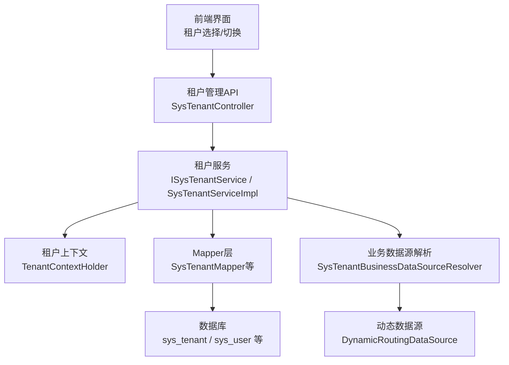
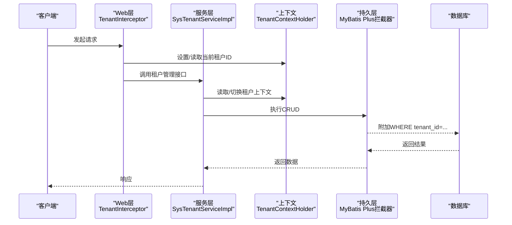
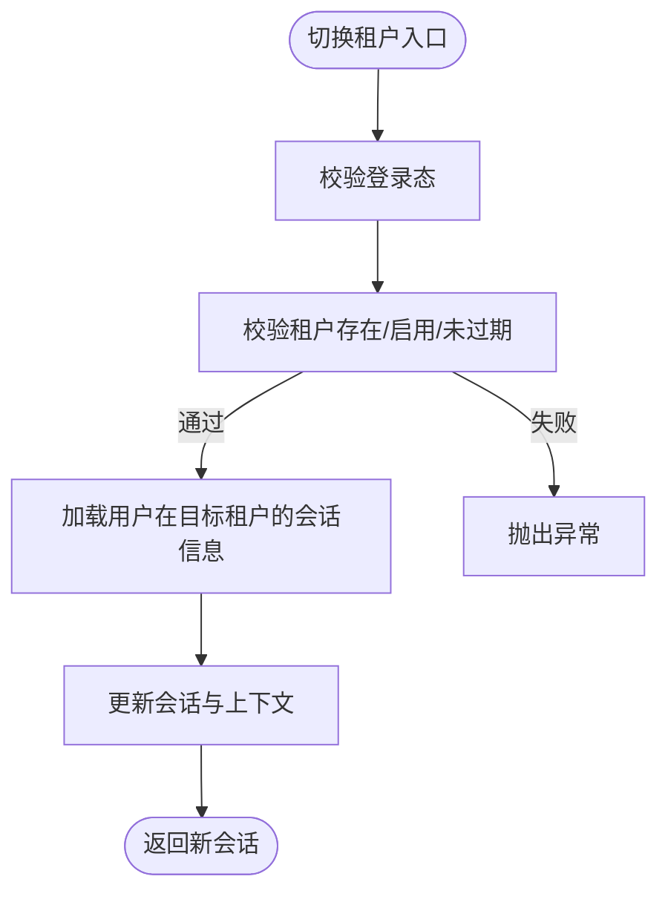
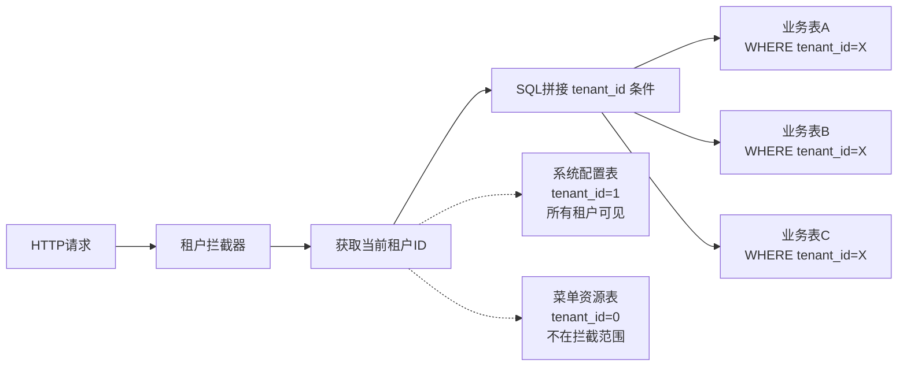
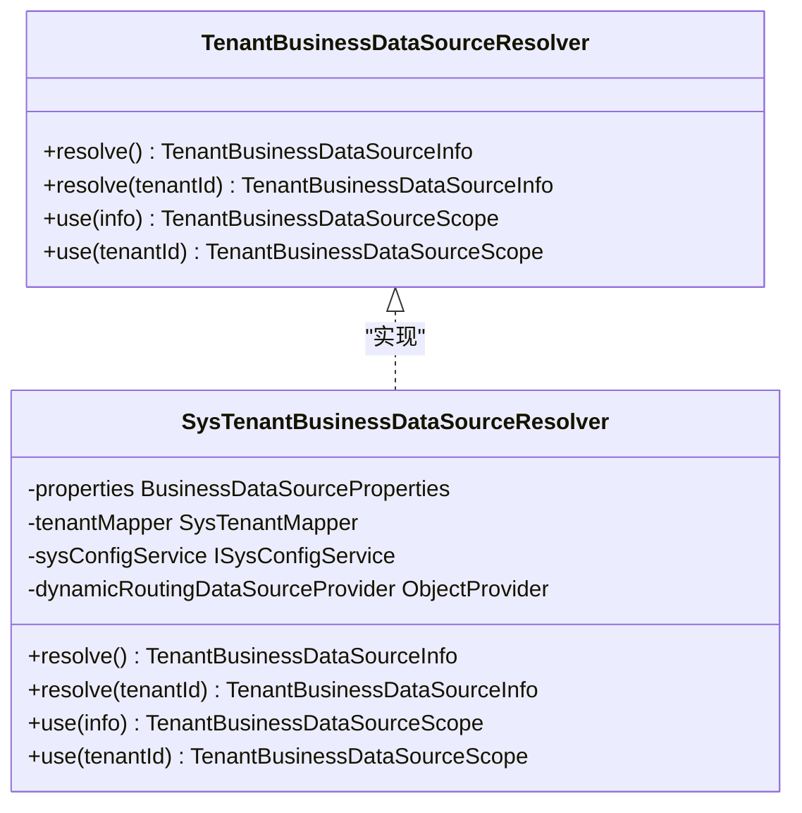
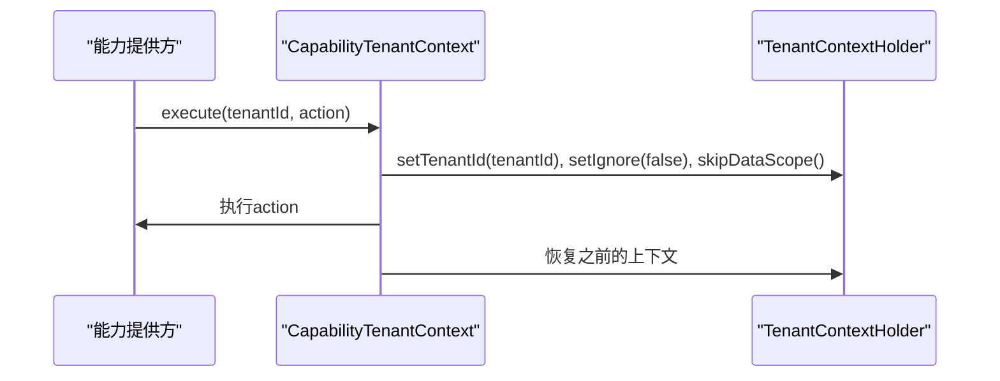
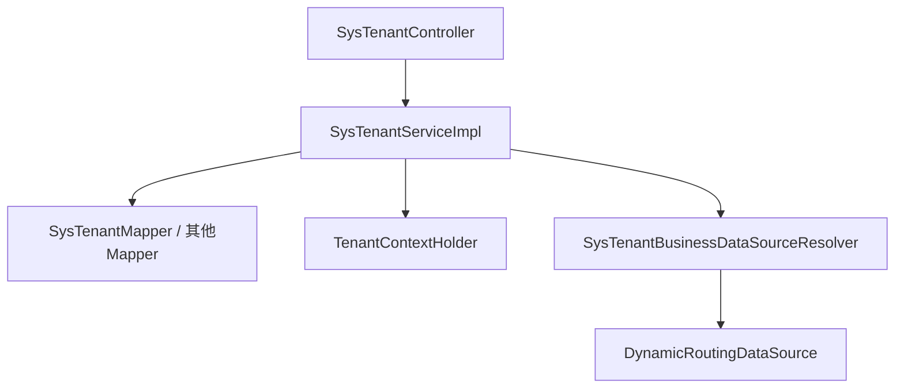

# 租户管理

<cite>
**本文引用的文件**
- [SysTenant.java](file://forge-server/forge-framework/forge-plugin-parent/forge-plugin-system/src/main/java/com/mdframe/forge/plugin/system/entity/SysTenant.java)
- [SysTenantController.java](file://forge-server/forge-framework/forge-plugin-parent/forge-plugin-system/src/main/java/com/mdframe/forge/plugin/system/controller/SysTenantController.java)
- [ISysTenantService.java](file://forge-server/forge-framework/forge-plugin-parent/forge-plugin-system/src/main/java/com/mdframe/forge/plugin/system/service/ISysTenantService.java)
- [SysTenantServiceImpl.java](file://forge-server/forge-framework/forge-plugin-parent/forge-plugin-system/src/main/java/com/mdframe/forge/plugin/system/service/impl/SysTenantServiceImpl.java)
- [tenant_migration.sql](file://forge-server/forge-framework/forge-starter-parent/forge-starter-tenant/src/main/resources/sql/tenant_migration.sql)
- [TenantContextHolder.java](file://forge-server/forge-framework/forge-starter-parent/forge-starter-tenant/src/main/java/com/mdframe/forge/starter/tenant/context/TenantContextHolder.java)
- [TenantAutoConfiguration.java](file://forge-server/forge-framework/forge-starter-parent/forge-starter-tenant/src/main/java/com/mdframe/forge/starter/tenant/config/TenantAutoConfiguration.java)
- [TenantBusinessDataSourceResolver.java](file://forge-server/forge-framework/forge-starter-parent/forge-starter-tenant/src/main/java/com/mdframe/forge/starter/tenant/datasource/TenantBusinessDataSourceResolver.java)
- [SysTenantBusinessDataSourceResolver.java](file://forge-server/forge-framework/forge-plugin-parent/forge-plugin-system/src/main/java/com/mdframe/forge/plugin/system/datasource/SysTenantBusinessDataSourceResolver.java)
- [CapabilityTenantContext.java](file://forge-server/forge-framework/forge-plugin-parent/forge-plugin-capability-parent/forge-plugin-capability-platform/src/main/java/com/mdframe/forge/plugin/capability/identity/security/CapabilityTenantContext.java)
- [LoginTenantOption.java](file://forge-server/forge-framework/forge-starter-parent/forge-starter-auth/src/main/java/com/mdframe/forge/starter/auth/domain/LoginTenantOption.java)
- [Architecture.md](file://docs/architecture.md)
</cite>

## 目录
1. [简介](#简介)
2. [项目结构](#项目结构)
3. [核心组件](#核心组件)
4. [架构总览](#架构总览)
5. [详细组件分析](#详细组件分析)
6. [依赖关系分析](#依赖关系分析)
7. [性能与监控](#性能与监控)
8. [故障排查指南](#故障排查指南)
9. [部署与最佳实践](#部署与最佳实践)
10. [结论](#结论)

## 简介
本文件面向 Forge Admin 的多租户管理能力，覆盖租户创建、配置、生命周期管理、数据隔离、上下文切换、权限控制、业务上线流程、监控与调优、故障排查以及部署方案。文档基于仓库中的实体、控制器、服务实现、SQL 迁移脚本与多租户基础设施进行系统化说明，帮助读者从“概念—实现—运维”全链路理解并落地多租户能力。

## 项目结构
围绕多租户的核心代码分布在系统插件与租户启动器中：
- 租户模型与接口：SysTenant、ISysTenantService、SysTenantController
- 租户服务实现：SysTenantServiceImpl（包含租户校验、用户绑定、切换等）
- 数据库迁移：tenant_migration.sql（新增 tenant_id 字段、sys_tenant 表、默认租户）
- 多租户上下文与拦截：TenantContextHolder、TenantAutoConfiguration
- 业务数据源路由：TenantBusinessDataSourceResolver、SysTenantBusinessDataSourceResolver
- 登录租户选项：LoginTenantOption
- 架构参考：docs/architecture.md

**图示来源**
- [SysTenantController.java:24-139](file://forge-server/forge-framework/forge-plugin-parent/forge-plugin-system/src/main/java/com/mdframe/forge/plugin/system/controller/SysTenantController.java#L24-L139)
- [ISysTenantService.java:18-104](file://forge-server/forge-framework/forge-plugin-parent/forge-plugin-system/src/main/java/com/mdframe/forge/plugin/system/service/ISysTenantService.java#L18-L104)
- [SysTenantServiceImpl.java:45-362](file://forge-server/forge-framework/forge-plugin-parent/forge-plugin-system/src/main/java/com/mdframe/forge/plugin/system/service/impl/SysTenantServiceImpl.java#L45-L362)
- [TenantContextHolder.java:1-63](file://forge-server/forge-framework/forge-starter-parent/forge-starter-tenant/src/main/java/com/mdframe/forge/starter/tenant/context/TenantContextHolder.java#L1-L63)
- [SysTenantBusinessDataSourceResolver.java:23-125](file://forge-server/forge-framework/forge-plugin-parent/forge-plugin-system/src/main/java/com/mdframe/forge/plugin/system/datasource/SysTenantBusinessDataSourceResolver.java#L23-L125)

**章节来源**
- [SysTenantController.java:24-139](file://forge-server/forge-framework/forge-plugin-parent/forge-plugin-system/src/main/java/com/mdframe/forge/plugin/system/controller/SysTenantController.java#L24-L139)
- [tenant_migration.sql:1-107](file://forge-server/forge-framework/forge-starter-parent/forge-starter-tenant/src/main/resources/sql/tenant_migration.sql#L1-L107)

## 核心组件
- 租户实体与配置：SysTenant 承载租户基本信息、品牌化配置、主题布局、默认业务数据源标识等。
- 租户管理API：SysTenantController 提供分页查询、详情、当前租户配置、可切换租户、用户列表、移出租户、切换租户、增删改等接口。
- 租户服务：ISysTenantService 定义能力边界；SysTenantServiceImpl 实现租户访问控制、可用性校验、删除保护、用户绑定清理与默认租户切换等。
- 多租户上下文：TenantContextHolder 使用 TransmittableThreadLocal 维护线程级 tenantId 与忽略标志，支持异步传递。
- SQL 拦截与自动装配：TenantAutoConfiguration 注册租户拦截器与 Web 拦截器，配合 MyBatis Plus 完成 SQL 注入与请求级上下文设置。
- 业务数据源路由：通过 TenantBusinessDataSourceResolver 扩展点与 SysTenantBusinessDataSourceResolver 实现按租户切换到指定业务库。
- 登录租户选项：LoginTenantOption 用于登录页展示可选工作区（租户）。

**章节来源**
- [SysTenant.java:11-123](file://forge-server/forge-framework/forge-plugin-parent/forge-plugin-system/src/main/java/com/mdframe/forge/plugin/system/entity/SysTenant.java#L11-L123)
- [SysTenantController.java:24-139](file://forge-server/forge-framework/forge-plugin-parent/forge-plugin-system/src/main/java/com/mdframe/forge/plugin/system/controller/SysTenantController.java#L24-L139)
- [ISysTenantService.java:18-104](file://forge-server/forge-framework/forge-plugin-parent/forge-plugin-system/src/main/java/com/mdframe/forge/plugin/system/service/ISysTenantService.java#L18-L104)
- [SysTenantServiceImpl.java:45-362](file://forge-server/forge-framework/forge-plugin-parent/forge-plugin-system/src/main/java/com/mdframe/forge/plugin/system/service/impl/SysTenantServiceImpl.java#L45-L362)
- [TenantContextHolder.java:1-63](file://forge-server/forge-framework/forge-starter-parent/forge-starter-tenant/src/main/java/com/mdframe/forge/starter/tenant/context/TenantContextHolder.java#L1-L63)
- [TenantAutoConfiguration.java:55-76](file://forge-server/forge-framework/forge-starter-parent/forge-starter-tenant/src/main/java/com/mdframe/forge/starter/tenant/config/TenantAutoConfiguration.java#L55-L76)
- [TenantBusinessDataSourceResolver.java:1-16](file://forge-server/forge-framework/forge-starter-parent/forge-starter-tenant/src/main/java/com/mdframe/forge/starter/tenant/datasource/TenantBusinessDataSourceResolver.java#L1-L16)
- [SysTenantBusinessDataSourceResolver.java:23-125](file://forge-server/forge-framework/forge-plugin-parent/forge-plugin-system/src/main/java/com/mdframe/forge/plugin/system/datasource/SysTenantBusinessDataSourceResolver.java#L23-L125)
- [LoginTenantOption.java:1-40](file://forge-server/forge-framework/forge-starter-parent/forge-starter-auth/src/main/java/com/mdframe/forge/starter/auth/domain/LoginTenantOption.java#L1-L40)

## 架构总览
多租户在请求进入时建立上下文，并在 SQL 层追加 tenant_id 条件，实现行级隔离；同时可通过业务数据源路由将不同租户的数据落至独立库或逻辑库。

**图示来源**
- [TenantAutoConfiguration.java:55-76](file://forge-server/forge-framework/forge-starter-parent/forge-starter-tenant/src/main/java/com/mdframe/forge/starter/tenant/config/TenantAutoConfiguration.java#L55-L76)
- [SysTenantServiceImpl.java:231-245](file://forge-server/forge-framework/forge-plugin-parent/forge-plugin-system/src/main/java/com/mdframe/forge/plugin/system/service/impl/SysTenantServiceImpl.java#L231-L245)
- [Architecture.md:410-433](file://docs/architecture.md#L410-L433)

## 详细组件分析

### 租户实体与配置项
- 基本信息：名称、负责人、联系方式、状态、过期时间、描述。
- 品牌化：浏览器图标、标签标题、系统名称、Logo、介绍、版权信息。
- 外观：系统布局、主题、主题配置。
- 数据源：默认业务数据源ID与编码，用于后续路由到独立库。
- 软删除：delFlag 标记。

这些字段为租户的“白标化”和“资源配额/限制”提供了基础支撑。

**章节来源**
- [SysTenant.java:11-123](file://forge-server/forge-framework/forge-plugin-parent/forge-plugin-system/src/main/java/com/mdframe/forge/plugin/system/entity/SysTenant.java#L11-L123)

### 租户管理API与服务
- 分页查询、详情、当前租户配置、可切换租户、租户下用户列表、移出租户、切换租户、增删改。
- 权限与访问控制：非管理员仅能操作自身租户；超级管理员可跨租户；删除前校验默认租户保护与用户/绑定存在性。
- 切换租户：校验租户可用（存在、启用、未过期），更新会话与上下文。

**图示来源**
- [SysTenantController.java:96-102](file://forge-server/forge-framework/forge-plugin-parent/forge-plugin-system/src/main/java/com/mdframe/forge/plugin/system/controller/SysTenantController.java#L96-L102)
- [SysTenantServiceImpl.java:231-245](file://forge-server/forge-framework/forge-plugin-parent/forge-plugin-system/src/main/java/com/mdframe/forge/plugin/system/service/impl/SysTenantServiceImpl.java#L231-L245)
- [SysTenantServiceImpl.java:325-336](file://forge-server/forge-framework/forge-plugin-parent/forge-plugin-system/src/main/java/com/mdframe/forge/plugin/system/service/impl/SysTenantServiceImpl.java#L325-L336)

**章节来源**
- [SysTenantController.java:24-139](file://forge-server/forge-framework/forge-plugin-parent/forge-plugin-system/src/main/java/com/mdframe/forge/plugin/system/controller/SysTenantController.java#L24-L139)
- [ISysTenantService.java:18-104](file://forge-server/forge-framework/forge-plugin-parent/forge-plugin-system/src/main/java/com/mdframe/forge/plugin/system/service/ISysTenantService.java#L18-L104)
- [SysTenantServiceImpl.java:60-362](file://forge-server/forge-framework/forge-plugin-parent/forge-plugin-system/src/main/java/com/mdframe/forge/plugin/system/service/impl/SysTenantServiceImpl.java#L60-L362)

### 数据隔离机制
- 行级隔离：通过 MyBatis Plus 的租户拦截器在 SQL 中追加 WHERE tenant_id=...，确保所有业务表查询均限定在当前租户范围。
- 特殊处理：系统配置表、菜单资源表可按策略不拦截或采用特殊值（如 tenant_id=0/1）表示全局可见。
- 上下文切换：切换租户后，后续请求继续以新租户上下文执行，保证隔离一致性。

**图示来源**
- [Architecture.md:410-433](file://docs/architecture.md#L410-L433)
- [TenantAutoConfiguration.java:55-76](file://forge-server/forge-framework/forge-starter-parent/forge-starter-tenant/src/main/java/com/mdframe/forge/starter/tenant/config/TenantAutoConfiguration.java#L55-L76)

**章节来源**
- [Architecture.md:410-433](file://docs/architecture.md#L410-L433)
- [TenantAutoConfiguration.java:55-76](file://forge-server/forge-framework/forge-starter-parent/forge-starter-tenant/src/main/java/com/mdframe/forge/starter/tenant/config/TenantAutoConfiguration.java#L55-L76)

### 业务数据源路由（按租户分库/分库键）
- 扩展点：TenantBusinessDataSourceResolver 定义 resolve/use 方法。
- 默认实现：SysTenantBusinessDataSourceResolver 根据租户配置的默认业务数据源编码，结合 dynamic-datasource 进行路由。
- 开关：可通过配置项控制是否启用租户路由；未启用则回退到主库。
- 安全校验：校验 dynamic-datasource 已启用且 dsKey 已注册，避免非法切换。

**图示来源**
- [TenantBusinessDataSourceResolver.java:1-16](file://forge-server/forge-framework/forge-starter-parent/forge-starter-tenant/src/main/java/com/mdframe/forge/starter/tenant/datasource/TenantBusinessDataSourceResolver.java#L1-L16)
- [SysTenantBusinessDataSourceResolver.java:23-125](file://forge-server/forge-framework/forge-plugin-parent/forge-plugin-system/src/main/java/com/mdframe/forge/plugin/system/datasource/SysTenantBusinessDataSourceResolver.java#L23-L125)

**章节来源**
- [TenantBusinessDataSourceResolver.java:1-16](file://forge-server/forge-framework/forge-starter-parent/forge-starter-tenant/src/main/java/com/mdframe/forge/starter/tenant/datasource/TenantBusinessDataSourceResolver.java#L1-L16)
- [SysTenantBusinessDataSourceResolver.java:23-125](file://forge-server/forge-framework/forge-plugin-parent/forge-plugin-system/src/main/java/com/mdframe/forge/plugin/system/datasource/SysTenantBusinessDataSourceResolver.java#L23-L125)

### 租户上下文与可信执行
- 上下文持有：TenantContextHolder 使用 TransmittableThreadLocal 保存 tenantId 与 ignore 标志，支持线程池场景下的上下文传递。
- 可信执行：CapabilityTenantContext 在能力协议完成凭据校验后，以可信租户身份执行敏感操作，并临时关闭数据范围过滤，确保跨域/跨租户内部调用的一致性。

**图示来源**
- [CapabilityTenantContext.java:1-33](file://forge-server/forge-framework/forge-plugin-parent/forge-plugin-capability-parent/forge-plugin-capability-platform/src/main/java/com/mdframe/forge/plugin/capability/identity/security/CapabilityTenantContext.java#L1-L33)
- [TenantContextHolder.java:1-63](file://forge-server/forge-framework/forge-starter-parent/forge-starter-tenant/src/main/java/com/mdframe/forge/starter/tenant/context/TenantContextHolder.java#L1-L63)

**章节来源**
- [CapabilityTenantContext.java:1-33](file://forge-server/forge-framework/forge-plugin-parent/forge-plugin-capability-parent/forge-plugin-capability-platform/src/main/java/com/mdframe/forge/plugin/capability/identity/security/CapabilityTenantContext.java#L1-L33)
- [TenantContextHolder.java:1-63](file://forge-server/forge-framework/forge-starter-parent/forge-starter-tenant/src/main/java/com/mdframe/forge/starter/tenant/context/TenantContextHolder.java#L1-L63)

### 登录与工作区选择
- 登录阶段：根据用户类型与绑定关系，收集可进入的工作区（租户）列表，返回 LoginTenantOption。
- 单租户自动进入：若仅一个可用租户，直接加载该租户用户会话。
- 多租户选择：否则提示选择工作区，前端渲染下拉并调用切换接口。

**章节来源**
- [LoginTenantOption.java:1-40](file://forge-server/forge-framework/forge-starter-parent/forge-starter-auth/src/main/java/com/mdframe/forge/starter/auth/domain/LoginTenantOption.java#L1-L40)
- [SysTenantServiceImpl.java:98-122](file://forge-server/forge-framework/forge-plugin-parent/forge-plugin-system/src/main/java/com/mdframe/forge/plugin/system/service/impl/SysTenantServiceImpl.java#L98-L122)

## 依赖关系分析
- 控制器依赖服务接口，服务实现依赖 Mapper、会话工具、上下文与配置服务。
- 数据源路由依赖 dynamic-datasource 与系统配置。
- 上下文贯穿请求与异步任务，确保隔离一致性。

**图示来源**
- [SysTenantController.java:24-139](file://forge-server/forge-framework/forge-plugin-parent/forge-plugin-system/src/main/java/com/mdframe/forge/plugin/system/controller/SysTenantController.java#L24-L139)
- [SysTenantServiceImpl.java:45-362](file://forge-server/forge-framework/forge-plugin-parent/forge-plugin-system/src/main/java/com/mdframe/forge/plugin/system/service/impl/SysTenantServiceImpl.java#L45-L362)
- [SysTenantBusinessDataSourceResolver.java:23-125](file://forge-server/forge-framework/forge-plugin-parent/forge-plugin-system/src/main/java/com/mdframe/forge/plugin/system/datasource/SysTenantBusinessDataSourceResolver.java#L23-L125)

**章节来源**
- [SysTenantController.java:24-139](file://forge-server/forge-framework/forge-plugin-parent/forge-plugin-system/src/main/java/com/mdframe/forge/plugin/system/controller/SysTenantController.java#L24-L139)
- [SysTenantServiceImpl.java:45-362](file://forge-server/forge-framework/forge-plugin-parent/forge-plugin-system/src/main/java/com/mdframe/forge/plugin/system/service/impl/SysTenantServiceImpl.java#L45-L362)
- [SysTenantBusinessDataSourceResolver.java:23-125](file://forge-server/forge-framework/forge-plugin-parent/forge-plugin-system/src/main/java/com/mdframe/forge/plugin/system/datasource/SysTenantBusinessDataSourceResolver.java#L23-L125)

## 性能与监控
- SQL 隔离开销：每句 SQL 追加 tenant_id 条件，建议在高频表上建立 (tenant_id, 常用查询列) 联合索引，减少扫描成本。
- 数据源路由：开启租户路由后，每次请求需解析租户数据源，建议缓存租户配置或降低解析频率。
- 上下文传递：使用 TransmittableThreadLocal 保障线程池上下文正确传递，避免额外同步开销。
- 监控指标：建议统计切换租户次数、路由命中率、慢查询占比、错误率（租户不存在/禁用/过期）。

[本节为通用指导，无需特定文件引用]

## 故障排查指南
- 切换租户失败
  - 现象：提示租户不存在/已禁用/已过期。
  - 定位：检查租户状态与过期时间；确认当前用户是否绑定该租户。
  - 依据：切换前的可用性校验逻辑。
- 无权访问租户
  - 现象：非管理员访问其他租户时报错。
  - 定位：检查当前登录用户的租户ID与权限。
  - 依据：服务层的访问控制断言。
- 无法删除租户
  - 现象：提示默认租户不能删除或租户下仍有用户/绑定。
  - 定位：先解绑用户或转移默认租户；再删除。
  - 依据：删除前的保护校验。
- 业务数据源路由失败
  - 现象：提示 dynamic-datasource 未启用或 dsKey 未配置。
  - 定位：检查租户默认业务数据源编码是否在 dynamic-datasource 中注册。
  - 依据：数据源解析器的校验逻辑。

**章节来源**
- [SysTenantServiceImpl.java:231-245](file://forge-server/forge-framework/forge-plugin-parent/forge-plugin-system/src/main/java/com/mdframe/forge/plugin/system/service/impl/SysTenantServiceImpl.java#L231-L245)
- [SysTenantServiceImpl.java:280-295](file://forge-server/forge-framework/forge-plugin-parent/forge-plugin-system/src/main/java/com/mdframe/forge/plugin/system/service/impl/SysTenantServiceImpl.java#L280-L295)
- [SysTenantServiceImpl.java:312-336](file://forge-server/forge-framework/forge-plugin-parent/forge-plugin-system/src/main/java/com/mdframe/forge/plugin/system/service/impl/SysTenantServiceImpl.java#L312-L336)
- [SysTenantBusinessDataSourceResolver.java:106-114](file://forge-server/forge-framework/forge-plugin-parent/forge-plugin-system/src/main/java/com/mdframe/forge/plugin/system/datasource/SysTenantBusinessDataSourceResolver.java#L106-L114)

## 部署与最佳实践
- 数据库初始化
  - 执行迁移脚本，为关键表添加 tenant_id 字段与索引，创建 sys_tenant 表并插入默认租户。
  - 对高频查询列建立联合索引以提升隔离查询性能。
- 多租户开关
  - 通过配置项控制是否启用租户业务数据源路由；未启用时回退到主库。
- 域名与品牌化
  - 利用租户的系统名称、Logo、主题与布局实现白标化；可在网关层按域名解析到对应租户ID并设置上下文。
- 资源配额
  - 使用 user_limit 与 expire_time 控制租户容量与有效期；在计费或运营侧做外部校验与提醒。
- 安全与审计
  - 严格限制超管操作；记录租户切换、数据源路由、删除等关键操作的审计日志。
- 高可用与扩容
  - 按租户拆分业务库时，注意连接池与锁竞争；跨库事务谨慎使用，必要时采用最终一致性。

**章节来源**
- [tenant_migration.sql:1-107](file://forge-server/forge-framework/forge-starter-parent/forge-starter-tenant/src/main/resources/sql/tenant_migration.sql#L1-L107)
- [SysTenantBusinessDataSourceResolver.java:90-96](file://forge-server/forge-framework/forge-plugin-parent/forge-plugin-system/src/main/java/com/mdframe/forge/plugin/system/datasource/SysTenantBusinessDataSourceResolver.java#L90-L96)
- [SysTenant.java:42-123](file://forge-server/forge-framework/forge-plugin-parent/forge-plugin-system/src/main/java/com/mdframe/forge/plugin/system/entity/SysTenant.java#L42-L123)

## 结论
Forge Admin 的多租户体系以“上下文+SQL拦截+数据源路由”为核心，实现了灵活而安全的租户隔离与白标化能力。通过完善的租户管理API与服务校验，覆盖了从创建、配置、切换到下线的全生命周期。结合合理的索引设计、配置开关与监控手段，可在生产环境稳定运行并持续演进。