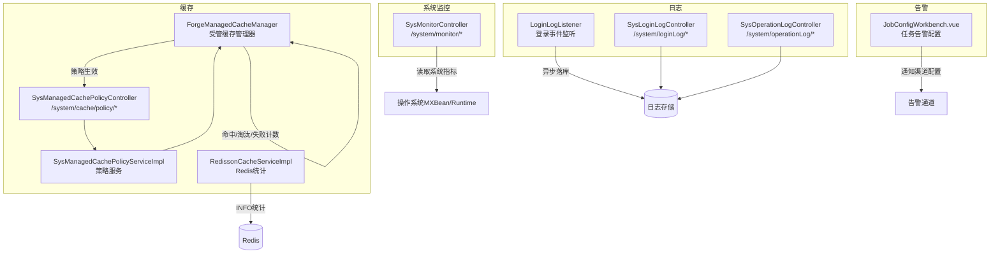
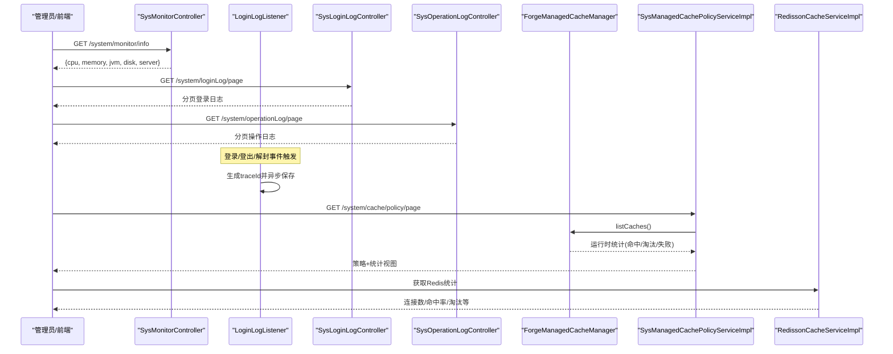
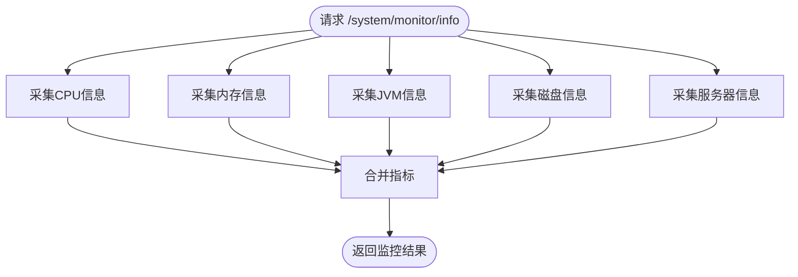
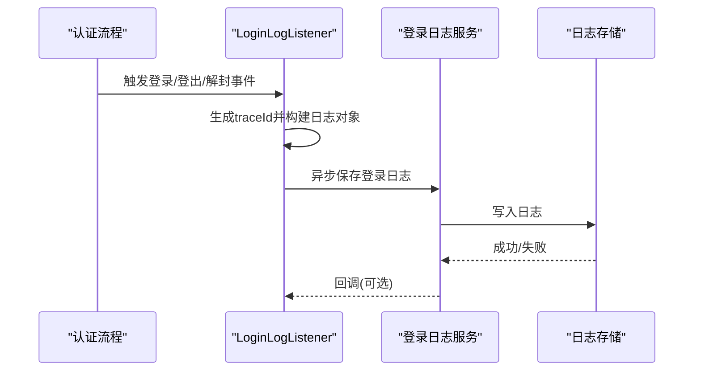
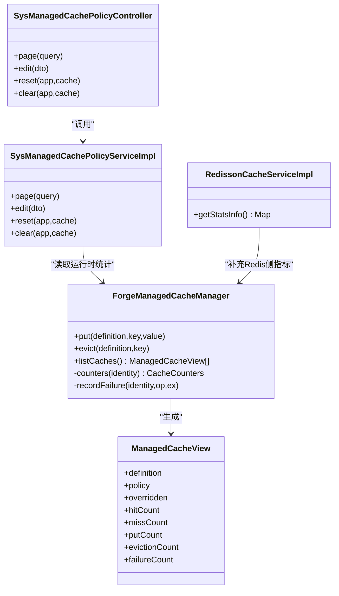
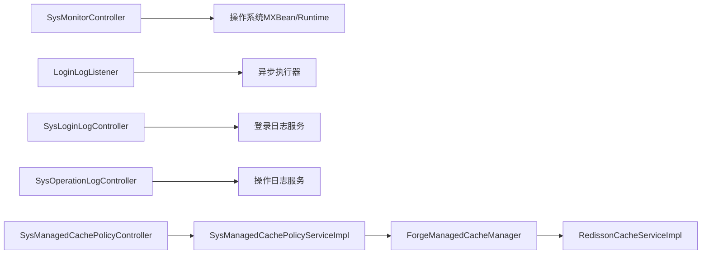

# 系统监控

<cite>
**本文引用的文件**
- [SysMonitorController.java](file://forge-server/forge-framework/forge-plugin-parent/forge-plugin-system/src/main/java/com/mdframe/forge/plugin/system/controller/SysMonitorController.java)
- [LoginLogListener.java](file://forge-server/forge-framework/forge-starter-parent/forge-starter-log/src/main/java/com/mdframe/forge/starter/log/listener/LoginLogListener.java)
- [SysLoginLogController.java](file://forge-server/forge-framework/forge-plugin-parent/forge-plugin-system/src/main/java/com/mdframe/forge/plugin/system/controller/SysLoginLogController.java)
- [SysOperationLogController.java](file://forge-server/forge-framework/forge-plugin-parent/forge-plugin-system/src/main/java/com/mdframe/forge/plugin/system/controller/SysOperationLogController.java)
- [ForgeManagedCacheManager.java](file://forge-server/forge-framework/forge-starter-parent/forge-starter-cache/src/main/java/com/mdframe/forge/starter/cache/managed/ForgeManagedCacheManager.java)
- [ManagedCacheView.java](file://forge-server/forge-framework/forge-starter-parent/forge-starter-cache/src/main/java/com/mdframe/forge/starter/cache/managed/model/ManagedCacheView.java)
- [SysManagedCachePolicyServiceImpl.java](file://forge-server/forge-framework/forge-plugin-parent/forge-plugin-system/src/main/java/com/mdframe/forge/plugin/system/service/impl/SysManagedCachePolicyServiceImpl.java)
- [SysManagedCachePolicyController.java](file://forge-server/forge-framework/forge-plugin-parent/forge-plugin-system/src/main/java/com/mdframe/forge/plugin/system/controller/SysManagedCachePolicyController.java)
- [RedissonCacheServiceImpl.java](file://forge-server/forge-framework/forge-starter-parent/forge-starter-cache/src/main/java/com/mdframe/forge/starter/cache/service/impl/RedissonCacheServiceImpl.java)
- [JobConfigWorkbench.vue](file://forge-admin-ui/src/views/system/job-config/components/JobConfigWorkbench.vue)
</cite>

## 目录
1. [简介](#简介)
2. [项目结构](#项目结构)
3. [核心组件](#核心组件)
4. [架构总览](#架构总览)
5. [详细组件分析](#详细组件分析)
6. [依赖关系分析](#依赖关系分析)
7. [性能考量](#性能考量)
8. [故障诊断指南](#故障诊断指南)
9. [结论](#结论)
10. [附录](#附录)

## 简介
本文件面向 Forge Admin 的系统监控能力，覆盖运行状态监控、登录日志记录、操作日志审计、缓存管理（查看、清理、策略配置）、系统健康检查与告警配置、监控报表等。文档从架构到实现细节逐层展开，帮助读者理解指标收集、性能监控、错误追踪、日志查询与分析的机制与最佳实践。

## 项目结构
围绕“系统监控”的关键代码分布在以下模块：
- 系统监控接口：提供 CPU、内存、JVM、磁盘、服务器信息聚合查询
- 登录日志：基于监听器异步记录登录/登出/解封等事件，并提供分页查询
- 操作日志：提供页面操作审计的分页查询与详情
- 受管缓存：提供缓存策略配置、运行时统计、清理与重置
- Redis 统计：通过 INFO 命令获取连接、命中率、淘汰等指标
- 任务告警：前端支持为任务配置通知渠道

图表来源
- [SysMonitorController.java:32-95](file://forge-server/forge-framework/forge-plugin-parent/forge-plugin-system/src/main/java/com/mdframe/forge/plugin/system/controller/SysMonitorController.java#L32-L95)
- [LoginLogListener.java:48-68](file://forge-server/forge-framework/forge-starter-parent/forge-starter-log/src/main/java/com/mdframe/forge/starter/log/listener/LoginLogListener.java#L48-L68)
- [SysLoginLogController.java:25-46](file://forge-server/forge-framework/forge-plugin-parent/forge-plugin-system/src/main/java/com/mdframe/forge/plugin/system/controller/SysLoginLogController.java#L25-L46)
- [SysOperationLogController.java:28-46](file://forge-server/forge-framework/forge-plugin-parent/forge-plugin-system/src/main/java/com/mdframe/forge/plugin/system/controller/SysOperationLogController.java#L28-L46)
- [ForgeManagedCacheManager.java:116-146](file://forge-server/forge-framework/forge-starter-parent/forge-starter-cache/src/main/java/com/mdframe/forge/starter/cache/managed/ForgeManagedCacheManager.java#L116-L146)
- [SysManagedCachePolicyController.java:38-63](file://forge-server/forge-framework/forge-plugin-parent/forge-plugin-system/src/main/java/com/mdframe/forge/plugin/system/controller/SysManagedCachePolicyController.java#L38-L63)
- [RedissonCacheServiceImpl.java:342-362](file://forge-server/forge-framework/forge-starter-parent/forge-starter-cache/src/main/java/com/mdframe/forge/starter/cache/service/impl/RedissonCacheServiceImpl.java#L342-L362)
- [JobConfigWorkbench.vue:237-251](file://forge-admin-ui/src/views/system/job-config/components/JobConfigWorkbench.vue#L237-L251)

章节来源
- [SysMonitorController.java:32-95](file://forge-server/forge-framework/forge-plugin-parent/forge-plugin-system/src/main/java/com/mdframe/forge/plugin/system/controller/SysMonitorController.java#L32-L95)
- [LoginLogListener.java:48-68](file://forge-server/forge-framework/forge-starter-parent/forge-starter-log/src/main/java/com/mdframe/forge/starter/log/listener/LoginLogListener.java#L48-L68)
- [SysLoginLogController.java:25-46](file://forge-server/forge-framework/forge-plugin-parent/forge-plugin-system/src/main/java/com/mdframe/forge/plugin/system/controller/SysLoginLogController.java#L25-L46)
- [SysOperationLogController.java:28-46](file://forge-server/forge-framework/forge-plugin-parent/forge-plugin-system/src/main/java/com/mdframe/forge/plugin/system/controller/SysOperationLogController.java#L28-L46)
- [ForgeManagedCacheManager.java:116-146](file://forge-server/forge-framework/forge-starter-parent/forge-starter-cache/src/main/java/com/mdframe/forge/starter/cache/managed/ForgeManagedCacheManager.java#L116-L146)
- [SysManagedCachePolicyController.java:38-63](file://forge-server/forge-framework/forge-plugin-parent/forge-plugin-system/src/main/java/com/mdframe/forge/plugin/system/controller/SysManagedCachePolicyController.java#L38-L63)
- [RedissonCacheServiceImpl.java:342-362](file://forge-server/forge-framework/forge-starter-parent/forge-starter-cache/src/main/java/com/mdframe/forge/starter/cache/service/impl/RedissonCacheServiceImpl.java#L342-L362)
- [JobConfigWorkbench.vue:237-251](file://forge-admin-ui/src/views/system/job-config/components/JobConfigWorkbench.vue#L237-L251)

## 核心组件
- 系统监控控制器：统一暴露 CPU、内存、JVM、磁盘、服务器信息，供前端或外部系统采集
- 登录日志监听器：在登录/登出/解封等关键认证事件发生时，生成带追踪ID的日志并异步落库
- 登录/操作日志控制器：提供分页查询与详情接口，支撑审计与排障
- 受管缓存管理器：集中管理缓存定义、策略、命中/淘汰/失败统计，支持按应用+缓存名维度查看与清理
- 缓存策略服务：将运行时视图与持久化策略合并，提供分页查询、编辑、重置、清空
- Redis 统计服务：通过 INFO 命令拉取连接数、命中率、淘汰键等指标
- 任务告警配置：在前端工作台中为定时任务配置通知渠道，便于异常及时触达

章节来源
- [SysMonitorController.java:32-95](file://forge-server/forge-framework/forge-plugin-parent/forge-plugin-system/src/main/java/com/mdframe/forge/plugin/system/controller/SysMonitorController.java#L32-L95)
- [LoginLogListener.java:48-68](file://forge-server/forge-framework/forge-starter-parent/forge-starter-log/src/main/java/com/mdframe/forge/starter/log/listener/LoginLogListener.java#L48-L68)
- [SysLoginLogController.java:25-46](file://forge-server/forge-framework/forge-plugin-parent/forge-plugin-system/src/main/java/com/mdframe/forge/plugin/system/controller/SysLoginLogController.java#L25-L46)
- [SysOperationLogController.java:28-46](file://forge-server/forge-framework/forge-plugin-parent/forge-plugin-system/src/main/java/com/mdframe/forge/plugin/system/controller/SysOperationLogController.java#L28-L46)
- [ForgeManagedCacheManager.java:116-146](file://forge-server/forge-framework/forge-starter-parent/forge-starter-cache/src/main/java/com/mdframe/forge/starter/cache/managed/ForgeManagedCacheManager.java#L116-L146)
- [SysManagedCachePolicyServiceImpl.java:153-180](file://forge-server/forge-framework/forge-plugin-parent/forge-plugin-system/src/main/java/com/mdframe/forge/plugin/system/service/impl/SysManagedCachePolicyServiceImpl.java#L153-L180)
- [SysManagedCachePolicyController.java:38-63](file://forge-server/forge-framework/forge-plugin-parent/forge-plugin-system/src/main/java/com/mdframe/forge/plugin/system/controller/SysManagedCachePolicyController.java#L38-L63)
- [RedissonCacheServiceImpl.java:342-362](file://forge-server/forge-framework/forge-starter-parent/forge-starter-cache/src/main/java/com/mdframe/forge/starter/cache/service/impl/RedissonCacheServiceImpl.java#L342-L362)
- [JobConfigWorkbench.vue:237-251](file://forge-admin-ui/src/views/system/job-config/components/JobConfigWorkbench.vue#L237-L251)

## 架构总览
下图展示了监控数据流：系统指标由控制器直接采集；登录事件经监听器异步落库；操作日志通过注解切面落地；缓存策略与运行时统计由管理器与服务协同；Redis 指标通过 INFO 命令获取；任务告警通过前端配置下发。

图表来源
- [SysMonitorController.java:32-95](file://forge-server/forge-framework/forge-plugin-parent/forge-plugin-system/src/main/java/com/mdframe/forge/plugin/system/controller/SysMonitorController.java#L32-L95)
- [LoginLogListener.java:48-68](file://forge-server/forge-framework/forge-starter-parent/forge-starter-log/src/main/java/com/mdframe/forge/starter/log/listener/LoginLogListener.java#L48-L68)
- [SysLoginLogController.java:25-46](file://forge-server/forge-framework/forge-plugin-parent/forge-plugin-system/src/main/java/com/mdframe/forge/plugin/system/controller/SysLoginLogController.java#L25-L46)
- [SysOperationLogController.java:28-46](file://forge-server/forge-framework/forge-plugin-parent/forge-plugin-system/src/main/java/com/mdframe/forge/plugin/system/controller/SysOperationLogController.java#L28-L46)
- [SysManagedCachePolicyController.java:38-63](file://forge-server/forge-framework/forge-plugin-parent/forge-plugin-system/src/main/java/com/mdframe/forge/plugin/system/controller/SysManagedCachePolicyController.java#L38-L63)
- [SysManagedCachePolicyServiceImpl.java:153-180](file://forge-server/forge-framework/forge-plugin-parent/forge-plugin-system/src/main/java/com/mdframe/forge/plugin/system/service/impl/SysManagedCachePolicyServiceImpl.java#L153-L180)
- [ForgeManagedCacheManager.java:240-266](file://forge-server/forge-framework/forge-starter-parent/forge-starter-cache/src/main/java/com/mdframe/forge/starter/cache/managed/ForgeManagedCacheManager.java#L240-L266)
- [RedissonCacheServiceImpl.java:342-362](file://forge-server/forge-framework/forge-starter-parent/forge-starter-cache/src/main/java/com/mdframe/forge/starter/cache/service/impl/RedissonCacheServiceImpl.java#L342-L362)

## 详细组件分析

### 系统监控与健康检查
- 功能要点
  - 提供 /system/monitor/info 聚合接口，返回 CPU、内存、JVM、磁盘、服务器信息
  - 各子项独立接口：/system/monitor/cpu|memory|jvm|disk|server
  - 使用操作系统 MXBean 与 Runtime 获取指标，包含进程/系统CPU负载、堆/物理/交换内存、GC 次数与耗时、线程数、类加载、磁盘占用率等
- 健康检查建议
  - 结合阈值告警：如堆使用率、系统负载、磁盘可用空间低于阈值时触发告警
  - 周期性采集：通过定时任务调用上述接口，形成时间序列用于趋势分析与报表
- 安全与权限
  - 控制器前置校验仅允许平台管理员访问

图表来源
- [SysMonitorController.java:32-95](file://forge-server/forge-framework/forge-plugin-parent/forge-plugin-system/src/main/java/com/mdframe/forge/plugin/system/controller/SysMonitorController.java#L32-L95)
- [SysMonitorController.java:100-148](file://forge-server/forge-framework/forge-plugin-parent/forge-plugin-system/src/main/java/com/mdframe/forge/plugin/system/controller/SysMonitorController.java#L100-L148)
- [SysMonitorController.java:150-229](file://forge-server/forge-framework/forge-plugin-parent/forge-plugin-system/src/main/java/com/mdframe/forge/plugin/system/controller/SysMonitorController.java#L150-L229)
- [SysMonitorController.java:231-296](file://forge-server/forge-framework/forge-plugin-parent/forge-plugin-system/src/main/java/com/mdframe/forge/plugin/system/controller/SysMonitorController.java#L231-L296)
- [SysMonitorController.java:298-362](file://forge-server/forge-framework/forge-plugin-parent/forge-plugin-system/src/main/java/com/mdframe/forge/plugin/system/controller/SysMonitorController.java#L298-L362)

章节来源
- [SysMonitorController.java:32-95](file://forge-server/forge-framework/forge-plugin-parent/forge-plugin-system/src/main/java/com/mdframe/forge/plugin/system/controller/SysMonitorController.java#L32-L95)
- [SysMonitorController.java:100-148](file://forge-server/forge-framework/forge-plugin-parent/forge-plugin-system/src/main/java/com/mdframe/forge/plugin/system/controller/SysMonitorController.java#L100-L148)
- [SysMonitorController.java:150-229](file://forge-server/forge-framework/forge-plugin-parent/forge-plugin-system/src/main/java/com/mdframe/forge/plugin/system/controller/SysMonitorController.java#L150-L229)
- [SysMonitorController.java:231-296](file://forge-server/forge-framework/forge-plugin-parent/forge-plugin-system/src/main/java/com/mdframe/forge/plugin/system/controller/SysMonitorController.java#L231-L296)
- [SysMonitorController.java:298-362](file://forge-server/forge-framework/forge-plugin-parent/forge-plugin-system/src/main/java/com/mdframe/forge/plugin/system/controller/SysMonitorController.java#L298-L362)

### 登录日志记录与查询
- 记录机制
  - 基于登录事件监听器，在登录成功、登出、账号解封等场景触发
  - 每次记录生成 traceId 并写入 MDC，便于链路追踪
  - 采用异步方式落库，避免阻塞主流程
- 查询能力
  - 提供分页查询与详情接口，支持时间范围过滤
- 日志级别与存储
  - 监听器内部对异常进行捕获并记录错误日志，确保记录失败不影响主流程
  - 具体存储由服务层负责（数据库表），可通过分页接口检索

图表来源
- [LoginLogListener.java:48-68](file://forge-server/forge-framework/forge-starter-parent/forge-starter-log/src/main/java/com/mdframe/forge/starter/log/listener/LoginLogListener.java#L48-L68)
- [LoginLogListener.java:215-244](file://forge-server/forge-framework/forge-starter-parent/forge-starter-log/src/main/java/com/mdframe/forge/starter/log/listener/LoginLogListener.java#L215-L244)
- [SysLoginLogController.java:25-46](file://forge-server/forge-framework/forge-plugin-parent/forge-plugin-system/src/main/java/com/mdframe/forge/plugin/system/controller/SysLoginLogController.java#L25-L46)

章节来源
- [LoginLogListener.java:48-68](file://forge-server/forge-framework/forge-starter-parent/forge-starter-log/src/main/java/com/mdframe/forge/starter/log/listener/LoginLogListener.java#L48-L68)
- [LoginLogListener.java:215-244](file://forge-server/forge-framework/forge-starter-parent/forge-starter-log/src/main/java/com/mdframe/forge/starter/log/listener/LoginLogListener.java#L215-L244)
- [SysLoginLogController.java:25-46](file://forge-server/forge-framework/forge-plugin-parent/forge-plugin-system/src/main/java/com/mdframe/forge/plugin/system/controller/SysLoginLogController.java#L25-L46)

### 操作日志审计
- 功能要点
  - 提供分页查询与详情接口，用于页面操作审计
  - 接口本身被标注为操作日志，形成“审计的审计”，便于追溯管理行为
- 查询优化建议
  - 服务端应基于时间范围、操作类型、用户等字段建立索引
  - 分页参数限制最大条数，避免大结果集拖慢查询

章节来源
- [SysOperationLogController.java:28-46](file://forge-server/forge-framework/forge-plugin-parent/forge-plugin-system/src/main/java/com/mdframe/forge/plugin/system/controller/SysOperationLogController.java#L28-L46)

### 缓存管理与性能监控
- 受管缓存管理器
  - 维护缓存定义与策略，支持本地/Redis/多级模式
  - 记录命中、未命中、写入、淘汰、失败等计数器，供监控展示
  - 提供列表接口汇总各缓存的运行快照
- 策略服务与控制器
  - 将运行时视图与持久化策略合并，提供分页查询、编辑、重置、清空
  - 仅平台管理员可访问
- Redis 统计
  - 通过 INFO 命令获取连接数、命令处理量、瞬时吞吐、淘汰键、命中率等
- 前端校验与展示
  - 前端对 TTL、容量、多级缓存约束进行校验
  - 展示失败计数，辅助定位问题

图表来源
- [ForgeManagedCacheManager.java:116-146](file://forge-server/forge-framework/forge-starter-parent/forge-starter-cache/src/main/java/com/mdframe/forge/starter/cache/managed/ForgeManagedCacheManager.java#L116-L146)
- [ForgeManagedCacheManager.java:240-266](file://forge-server/forge-framework/forge-starter-parent/forge-starter-cache/src/main/java/com/mdframe/forge/starter/cache/managed/ForgeManagedCacheManager.java#L240-L266)
- [ForgeManagedCacheManager.java:505-521](file://forge-server/forge-framework/forge-starter-parent/forge-starter-cache/src/main/java/com/mdframe/forge/starter/cache/managed/ForgeManagedCacheManager.java#L505-L521)
- [ManagedCacheView.java:1-13](file://forge-server/forge-framework/forge-starter-parent/forge-starter-cache/src/main/java/com/mdframe/forge/starter/cache/managed/model/ManagedCacheView.java#L1-L13)
- [SysManagedCachePolicyController.java:38-63](file://forge-server/forge-framework/forge-plugin-parent/forge-plugin-system/src/main/java/com/mdframe/forge/plugin/system/controller/SysManagedCachePolicyController.java#L38-L63)
- [SysManagedCachePolicyServiceImpl.java:153-180](file://forge-server/forge-framework/forge-plugin-parent/forge-plugin-system/src/main/java/com/mdframe/forge/plugin/system/service/impl/SysManagedCachePolicyServiceImpl.java#L153-L180)
- [RedissonCacheServiceImpl.java:342-362](file://forge-server/forge-framework/forge-starter-parent/forge-starter-cache/src/main/java/com/mdframe/forge/starter/cache/service/impl/RedissonCacheServiceImpl.java#L342-L362)

章节来源
- [ForgeManagedCacheManager.java:116-146](file://forge-server/forge-framework/forge-starter-parent/forge-starter-cache/src/main/java/com/mdframe/forge/starter/cache/managed/ForgeManagedCacheManager.java#L116-L146)
- [ForgeManagedCacheManager.java:240-266](file://forge-server/forge-framework/forge-starter-parent/forge-starter-cache/src/main/java/com/mdframe/forge/starter/cache/managed/ForgeManagedCacheManager.java#L240-L266)
- [ForgeManagedCacheManager.java:505-521](file://forge-server/forge-framework/forge-starter-parent/forge-starter-cache/src/main/java/com/mdframe/forge/starter/cache/managed/ForgeManagedCacheManager.java#L505-L521)
- [ManagedCacheView.java:1-13](file://forge-server/forge-framework/forge-starter-parent/forge-starter-cache/src/main/java/com/mdframe/forge/starter/cache/managed/model/ManagedCacheView.java#L1-L13)
- [SysManagedCachePolicyController.java:38-63](file://forge-server/forge-framework/forge-plugin-parent/forge-plugin-system/src/main/java/com/mdframe/forge/plugin/system/controller/SysManagedCachePolicyController.java#L38-L63)
- [SysManagedCachePolicyServiceImpl.java:153-180](file://forge-server/forge-framework/forge-plugin-parent/forge-plugin-system/src/main/java/com/mdframe/forge/plugin/system/service/impl/SysManagedCachePolicyServiceImpl.java#L153-L180)
- [RedissonCacheServiceImpl.java:342-362](file://forge-server/forge-framework/forge-starter-parent/forge-starter-cache/src/main/java/com/mdframe/forge/starter/cache/service/impl/RedissonCacheServiceImpl.java#L342-L362)

### 告警配置与监控报表
- 告警配置
  - 前端任务工作台支持为任务开启告警并选择通知渠道，便于异常即时触达
- 监控报表
  - 建议基于 /system/monitor/* 与缓存、日志统计接口，构建时序数据库与可视化看板
  - 报表维度：CPU/内存/JVM/磁盘趋势、缓存命中率与淘汰率、登录失败率、操作审计热点

章节来源
- [JobConfigWorkbench.vue:237-251](file://forge-admin-ui/src/views/system/job-config/components/JobConfigWorkbench.vue#L237-L251)

## 依赖关系分析
- 控制器之间无直接耦合，均通过各自服务或系统API获取数据
- 登录日志监听器依赖会话上下文与异步执行器，不阻塞主流程
- 缓存管理器依赖策略服务与Redis客户端，运行时统计通过原子累加器保证并发安全
- Redis 统计服务通过 INFO 命令与 Redis 交互，属于外部依赖

图表来源
- [SysMonitorController.java:32-95](file://forge-server/forge-framework/forge-plugin-parent/forge-plugin-system/src/main/java/com/mdframe/forge/plugin/system/controller/SysMonitorController.java#L32-L95)
- [LoginLogListener.java:48-68](file://forge-server/forge-framework/forge-starter-parent/forge-starter-log/src/main/java/com/mdframe/forge/starter/log/listener/LoginLogListener.java#L48-L68)
- [SysLoginLogController.java:25-46](file://forge-server/forge-framework/forge-plugin-parent/forge-plugin-system/src/main/java/com/mdframe/forge/plugin/system/controller/SysLoginLogController.java#L25-L46)
- [SysOperationLogController.java:28-46](file://forge-server/forge-framework/forge-plugin-parent/forge-plugin-system/src/main/java/com/mdframe/forge/plugin/system/controller/SysOperationLogController.java#L28-L46)
- [SysManagedCachePolicyController.java:38-63](file://forge-server/forge-framework/forge-plugin-parent/forge-plugin-system/src/main/java/com/mdframe/forge/plugin/system/controller/SysManagedCachePolicyController.java#L38-L63)
- [SysManagedCachePolicyServiceImpl.java:153-180](file://forge-server/forge-framework/forge-plugin-parent/forge-plugin-system/src/main/java/com/mdframe/forge/plugin/system/service/impl/SysManagedCachePolicyServiceImpl.java#L153-L180)
- [ForgeManagedCacheManager.java:240-266](file://forge-server/forge-framework/forge-starter-parent/forge-starter-cache/src/main/java/com/mdframe/forge/starter/cache/managed/ForgeManagedCacheManager.java#L240-L266)
- [RedissonCacheServiceImpl.java:342-362](file://forge-server/forge-framework/forge-starter-parent/forge-starter-cache/src/main/java/com/mdframe/forge/starter/cache/service/impl/RedissonCacheServiceImpl.java#L342-L362)

## 性能考量
- 指标采集
  - 系统监控接口应避免高频调用，建议后台定时任务聚合后缓存短时效结果
  - 对 CPU/内存/JVM 等指标采集做异常保护，防止因底层 API 不可用导致接口失败
- 日志写入
  - 登录日志采用异步落库，降低对认证主路径的影响
  - 建议对日志表建立合理索引（时间、用户、类型）并定期归档
- 缓存统计
  - 命中/淘汰/失败计数使用原子累加器，避免锁竞争
  - 策略变更需考虑热更新与版本控制，避免频繁重启
- Redis 统计
  - INFO 命令可能带来额外开销，建议按需采样与限流

## 故障诊断指南
- 登录失败排查
  - 通过登录日志分页查询，筛选失败记录，结合 traceId 关联其他日志
  - 关注客户端类型、登录消息、时间范围
- 操作审计
  - 通过操作日志分页查询，定位敏感操作与异常时间点
- 缓存问题定位
  - 查看受管缓存策略与运行时统计，重点关注失败计数、淘汰率、命中率
  - 若命中率低且淘汰率高，评估 TTL 与容量配置是否合理
- Redis 健康
  - 通过 Redis 统计接口观察连接数、瞬时吞吐、淘汰键、命中率等指标
- 系统资源瓶颈
  - 通过系统监控接口观察 CPU 负载、堆使用率、GC 次数与耗时、磁盘可用空间

章节来源
- [SysLoginLogController.java:25-46](file://forge-server/forge-framework/forge-plugin-parent/forge-plugin-system/src/main/java/com/mdframe/forge/plugin/system/controller/SysLoginLogController.java#L25-L46)
- [SysOperationLogController.java:28-46](file://forge-server/forge-framework/forge-plugin-parent/forge-plugin-system/src/main/java/com/mdframe/forge/plugin/system/controller/SysOperationLogController.java#L28-L46)
- [ForgeManagedCacheManager.java:240-266](file://forge-server/forge-framework/forge-starter-parent/forge-starter-cache/src/main/java/com/mdframe/forge/starter/cache/managed/ForgeManagedCacheManager.java#L240-L266)
- [RedissonCacheServiceImpl.java:342-362](file://forge-server/forge-framework/forge-starter-parent/forge-starter-cache/src/main/java/com/mdframe/forge/starter/cache/service/impl/RedissonCacheServiceImpl.java#L342-L362)
- [SysMonitorController.java:32-95](file://forge-server/forge-framework/forge-plugin-parent/forge-plugin-system/src/main/java/com/mdframe/forge/plugin/system/controller/SysMonitorController.java#L32-L95)

## 结论
Forge Admin 的系统监控能力以“指标采集—日志记录—缓存治理—告警配置”为主线，提供了从系统级到业务级的可观测性。通过统一的监控接口、异步可靠的日志记录、细粒度的缓存策略与统计、以及灵活的任务告警配置，能够有效支撑生产环境的稳定性保障与问题快速定位。建议结合时序数据库与可视化看板，持续沉淀监控报表，完善告警阈值与演练机制。

## 附录
- 常用接口参考
  - 系统监控：/system/monitor/info、/system/monitor/cpu|memory|jvm|disk|server
  - 登录日志：/system/loginLog/page、/system/loginLog/{id}
  - 操作日志：/system/operationLog/page、/system/operationLog/{id}
  - 缓存策略：/system/cache/policy/page、/system/cache/policy/edit、/system/cache/policy/reset、/system/cache/policy/clear
- 配置建议
  - 开启登录日志并设置合理的保留周期
  - 为缓存策略设置合适的 TTL 与容量，启用多级缓存以提升命中率
  - 为任务配置告警渠道，确保异常及时触达
  - 对监控接口进行限流与权限控制，仅管理员可访问