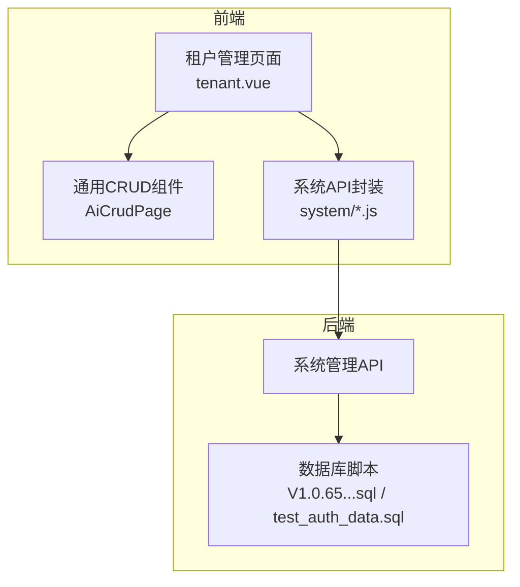
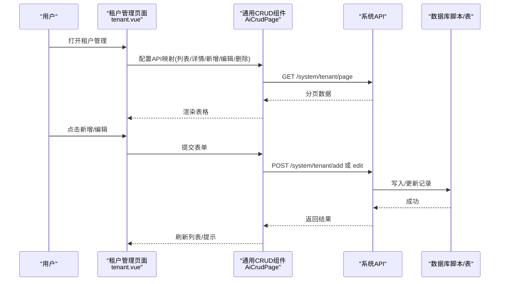
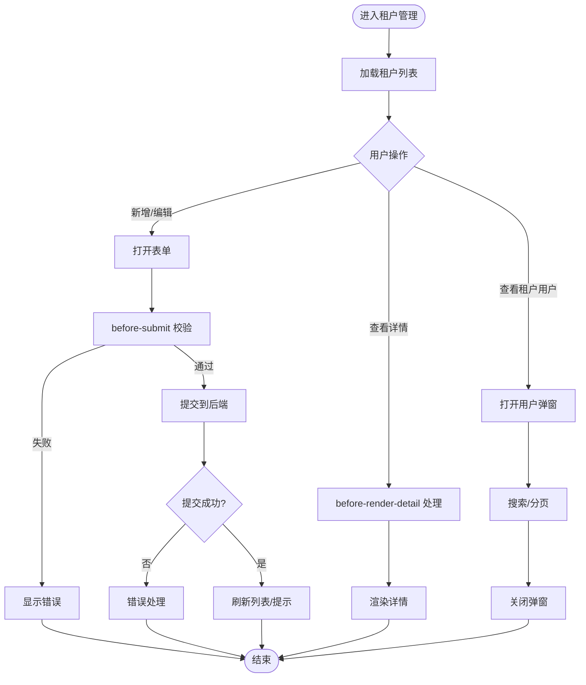
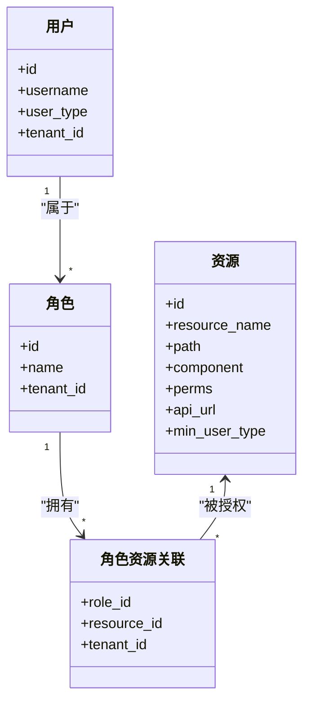
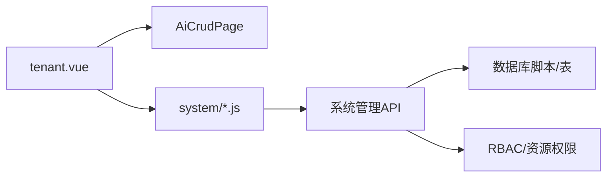

# 系统管理模块

<cite>
**本文引用的文件**
- [forge-admin-ui/src/views/system/tenant.vue](file://forge-admin-ui/src/views/system/tenant.vue)
- [forge-server/db/backup/V1.0.65__harden_user_type_permission_boundaries.sql](file://forge-server/db/backup/V1.0.65__harden_user_type_permission_boundaries.sql)
- [forge-server/db/seed/test_auth_data.sql](file://forge-server/db/seed/test_auth_data.sql)
- [forge-admin-ui/src/api/system/job.js](file://forge-admin-ui/src/api/system/job.js)
- [forge-admin-ui/src/api/system/region.js](file://forge-admin-ui/src/api/system/region.js)
</cite>

## 目录
1. [简介](#简介)
2. [项目结构](#项目结构)
3. [核心组件](#核心组件)
4. [架构总览](#架构总览)
5. [详细组件分析](#详细组件分析)
6. [依赖关系分析](#依赖关系分析)
7. [性能考虑](#性能考虑)
8. [故障排查指南](#故障排查指南)
9. [结论](#结论)
10. [附录](#附录)

## 简介
本模块为 Forge Admin 的系统管理子系统，覆盖用户管理、角色权限、菜单管理、部门组织、租户管理等核心能力。文档面向产品与研发人员，既提供界面操作与配置说明，也给出 RBAC 权限模型、数据权限控制、多租户隔离机制等技术细节，并附带 API 接口说明与前端组件使用示例，帮助快速理解与落地。

## 项目结构
系统管理模块由前后端协同实现：
- 前端（Vue）：以页面与通用 CRUD 组件为主，封装租户、用户、角色、菜单、组织等管理界面，并通过统一的 HTTP 客户端调用后端 API。
- 后端（Java/Spring）：提供 RESTful API，承载权限、资源、租户、组织等业务逻辑；数据库脚本负责初始化与演进。

图表来源
- [forge-admin-ui/src/views/system/tenant.vue:1-200](file://forge-admin-ui/src/views/system/tenant.vue#L1-L200)
- [forge-server/db/backup/V1.0.65__harden_user_type_permission_boundaries.sql:1-38](file://forge-server/db/backup/V1.0.65__harden_user_type_permission_boundaries.sql#L1-L38)
- [forge-server/db/seed/test_auth_data.sql:93-122](file://forge-server/db/seed/test_auth_data.sql#L93-L122)

章节来源
- [forge-admin-ui/src/views/system/tenant.vue:1-200](file://forge-admin-ui/src/views/system/tenant.vue#L1-L200)
- [forge-server/db/backup/V1.0.65__harden_user_type_permission_boundaries.sql:1-38](file://forge-server/db/backup/V1.0.65__harden_user_type_permission_boundaries.sql#L1-L38)
- [forge-server/db/seed/test_auth_data.sql:93-122](file://forge-server/db/seed/test_auth_data.sql#L93-L122)

## 核心组件
- 租户管理页面：基于通用 AiCrudPage 构建，支持分页、搜索、新增/编辑/删除、详情渲染钩子、表单自定义插槽（如布局选择器、主题预设）。
- 权限与资源：通过资源表与最小用户类型字段限制可访问范围；测试数据展示超级管理员、普通用户、部门管理员的权限分配样例。
- 系统API封装：按功能域拆分（如 job、region），便于前端统一调用与维护。

章节来源
- [forge-admin-ui/src/views/system/tenant.vue:1-200](file://forge-admin-ui/src/views/system/tenant.vue#L1-L200)
- [forge-server/db/backup/V1.0.65__harden_user_type_permission_boundaries.sql:1-38](file://forge-server/db/backup/V1.0.65__harden_user_type_permission_boundaries.sql#L1-L38)
- [forge-server/db/seed/test_auth_data.sql:93-122](file://forge-server/db/seed/test_auth_data.sql#L93-L122)
- [forge-admin-ui/src/api/system/job.js](file://forge-admin-ui/src/api/system/job.js)
- [forge-admin-ui/src/api/system/region.js](file://forge-admin-ui/src/api/system/region.js)

## 架构总览
系统管理采用“前端页面 + 通用CRUD + 后端REST + 数据库脚本”的分层架构。租户管理作为典型入口，通过 AiCrudPage 发起请求，后端根据资源与角色进行鉴权，结合数据权限与租户上下文返回结果。

图表来源
- [forge-admin-ui/src/views/system/tenant.vue:1-200](file://forge-admin-ui/src/views/system/tenant.vue#L1-L200)

## 详细组件分析

### 租户管理页面（tenant.vue）
- 功能要点
  - 使用 AiCrudPage 声明式配置 API 映射：列表、详情、新增、编辑、批量删除。
  - 提供表单插槽：系统布局选择器、主题预设选择器，增强租户外观与体验配置。
  - 内置租户用户弹窗：支持按用户名、姓名、手机号、状态筛选，分页展示与刷新。
  - 权限控制：仅管理员可见新增/批量删除/选择列。
- 关键交互
  - before-submit：提交前校验与转换。
  - before-render-detail：详情渲染前处理。
  - submit-success：成功后回调（如刷新列表）。
- 界面与配置
  - 表格列定义、搜索 schema、编辑表单 schema 均通过配置项注入。
  - 模态框宽度、栅格间距、表单类名等均可定制。

图表来源
- [forge-admin-ui/src/views/system/tenant.vue:1-200](file://forge-admin-ui/src/views/system/tenant.vue#L1-L200)

章节来源
- [forge-admin-ui/src/views/system/tenant.vue:1-200](file://forge-admin-ui/src/views/system/tenant.vue#L1-L200)

### RBAC 权限模型与资源边界
- 资源最小用户类型：sys_resource 表新增 min_user_type 字段，限制最低可访问用户类型（系统管理员、租户管理员、普通用户）。
- 系统管理相关资源（系统管理、用户管理、角色管理、组织管理、岗位管理）被限定为租户管理员及以上可访问。
- 测试数据展示了不同角色的资源绑定样例：超级管理员拥有全部权限，普通用户仅有查询权限，部门管理员具备部分新增/修改权限。

图表来源
- [forge-server/db/backup/V1.0.65__harden_user_type_permission_boundaries.sql:1-38](file://forge-server/db/backup/V1.0.65__harden_user_type_permission_boundaries.sql#L1-L38)
- [forge-server/db/seed/test_auth_data.sql:93-122](file://forge-server/db/seed/test_auth_data.sql#L93-L122)

章节来源
- [forge-server/db/backup/V1.0.65__harden_user_type_permission_boundaries.sql:1-38](file://forge-server/db/backup/V1.0.65__harden_user_type_permission_boundaries.sql#L1-L38)
- [forge-server/db/seed/test_auth_data.sql:93-122](file://forge-server/db/seed/test_auth_data.sql#L93-L122)

### 数据权限控制
- 数据权限通常基于租户、组织、角色与用户维度进行过滤，确保各主体只能访问其范围内的数据。
- 在系统管理中，结合 min_user_type 与角色资源绑定，形成“功能权限 + 数据权限”的双重控制。

章节来源
- [forge-server/db/backup/V1.0.65__harden_user_type_permission_boundaries.sql:1-38](file://forge-server/db/backup/V1.0.65__harden_user_type_permission_boundaries.sql#L1-L38)
- [forge-server/db/seed/test_auth_data.sql:93-122](file://forge-server/db/seed/test_auth_data.sql#L93-L122)

### 多租户隔离机制
- 租户上下文贯穿登录、鉴权、数据访问链路，所有系统管理资源默认带租户隔离。
- 租户管理页面支持租户级配置（如布局、主题），并提供租户内用户管理与业务数据源查看能力。

章节来源
- [forge-admin-ui/src/views/system/tenant.vue:1-200](file://forge-admin-ui/src/views/system/tenant.vue#L1-L200)

### 菜单管理
- 菜单与路由通过资源 path/component/perms 等字段进行控制，前端根据当前用户角色与资源权限动态生成菜单。
- 系统管理相关菜单受 min_user_type 约束，非租户管理员不可见。

章节来源
- [forge-server/db/backup/V1.0.65__harden_user_type_permission_boundaries.sql:1-38](file://forge-server/db/backup/V1.0.65__harden_user_type_permission_boundaries.sql#L1-L38)

### 部门组织
- 组织管理菜单与权限同样受 min_user_type 保护，保证组织数据的访问边界。
- 部门管理员可通过角色资源绑定获得对组织的新增/修改等操作权限。

章节来源
- [forge-server/db/backup/V1.0.65__harden_user_type_permission_boundaries.sql:1-38](file://forge-server/db/backup/V1.0.65__harden_user_type_permission_boundaries.sql#L1-L38)
- [forge-server/db/seed/test_auth_data.sql:93-122](file://forge-server/db/seed/test_auth_data.sql#L93-L122)

### 用户管理
- 用户管理页面与租户用户弹窗共同构成用户管理能力，支持按条件检索、分页浏览与状态切换。
- 用户类型与状态通过字典驱动，便于扩展与维护。

章节来源
- [forge-admin-ui/src/views/system/tenant.vue:1-200](file://forge-admin-ui/src/views/system/tenant.vue#L1-L200)

### API 接口说明（系统管理）
- 租户管理
  - 列表：GET /system/tenant/page
  - 详情：POST /system/tenant/getById
  - 新增：POST /system/tenant/add
  - 编辑：POST /system/tenant/edit
  - 批量删除：POST /system/tenant/removeBatch
- 其他系统模块
  - 任务管理：参考 system/job.js
  - 地区管理：参考 system/region.js

章节来源
- [forge-admin-ui/src/views/system/tenant.vue:1-200](file://forge-admin-ui/src/views/system/tenant.vue#L1-L200)
- [forge-admin-ui/src/api/system/job.js](file://forge-admin-ui/src/api/system/job.js)
- [forge-admin-ui/src/api/system/region.js](file://forge-admin-ui/src/api/system/region.js)

### 前端组件使用示例（AiCrudPage）
- 基本用法
  - 通过 api-config 指定列表、详情、新增、编辑、删除的接口映射。
  - 使用 search-schema、columns、edit-schema 配置搜索、表格列与编辑表单。
  - 使用 row-key、edit-grid-cols、edit-x-gap、edit-y-gap 调整布局与交互。
- 高级用法
  - 使用插槽自定义表单控件（如布局选择器、主题预设）。
  - 使用 before-submit、before-render-detail、submit-success 钩子实现业务逻辑。
  - 通过 userStore.isAdmin 控制按钮显隐与选择列。

章节来源
- [forge-admin-ui/src/views/system/tenant.vue:1-200](file://forge-admin-ui/src/views/system/tenant.vue#L1-L200)

## 依赖关系分析
- 前端依赖
  - tenant.vue 依赖 AiCrudPage 与系统 API 封装，依赖 store 获取用户信息。
- 后端依赖
  - 系统管理 API 依赖数据库脚本定义的表结构与初始数据。
- 权限与资源
  - sys_resource 的 min_user_type 与角色资源绑定共同决定功能可见性与可操作范围。

图表来源
- [forge-admin-ui/src/views/system/tenant.vue:1-200](file://forge-admin-ui/src/views/system/tenant.vue#L1-L200)
- [forge-server/db/backup/V1.0.65__harden_user_type_permission_boundaries.sql:1-38](file://forge-server/db/backup/V1.0.65__harden_user_type_permission_boundaries.sql#L1-L38)
- [forge-server/db/seed/test_auth_data.sql:93-122](file://forge-server/db/seed/test_auth_data.sql#L93-L122)

章节来源
- [forge-admin-ui/src/views/system/tenant.vue:1-200](file://forge-admin-ui/src/views/system/tenant.vue#L1-L200)
- [forge-server/db/backup/V1.0.65__harden_user_type_permission_boundaries.sql:1-38](file://forge-server/db/backup/V1.0.65__harden_user_type_permission_boundaries.sql#L1-L38)
- [forge-server/db/seed/test_auth_data.sql:93-122](file://forge-server/db/seed/test_auth_data.sql#L93-L122)

## 性能考虑
- 列表分页与远程搜索：减少首屏数据量，提升响应速度。
- 表单栅格与间距：合理设置 edit-grid-cols、edit-x-gap、edit-y-gap，优化复杂表单渲染性能。
- 权限预取与缓存：将角色与资源权限在前端缓存，减少重复请求。
- 数据库索引：为常用查询字段（如租户ID、用户类型、资源路径）建立索引，提高查询效率。

[本节为通用指导，不直接分析具体文件]

## 故障排查指南
- 无法看到系统管理菜单
  - 检查当前用户的 min_user_type 是否满足资源要求。
  - 确认角色是否绑定了相应资源。
- 租户用户弹窗无数据
  - 检查搜索参数是否正确，确认分页配置与后端接口一致。
- 新增/编辑失败
  - 查看 before-submit 校验逻辑与后端返回错误信息。
- 权限不足
  - 核对角色资源绑定与资源最小用户类型设置。

章节来源
- [forge-server/db/backup/V1.0.65__harden_user_type_permission_boundaries.sql:1-38](file://forge-server/db/backup/V1.0.65__harden_user_type_permission_boundaries.sql#L1-L38)
- [forge-server/db/seed/test_auth_data.sql:93-122](file://forge-server/db/seed/test_auth_data.sql#L93-L122)
- [forge-admin-ui/src/views/system/tenant.vue:1-200](file://forge-admin-ui/src/views/system/tenant.vue#L1-L200)

## 结论
系统管理模块以租户为核心，围绕用户、角色、菜单、组织等资源构建了完善的 RBAC 与数据权限体系。通过 AiCrudPage 等通用组件，大幅降低了开发成本并提升了可维护性。建议在实际项目中结合业务场景细化角色与资源绑定，完善数据权限策略，并持续优化前端交互与后端查询性能。

[本节为总结，不直接分析具体文件]

## 附录
- 常见配置场景
  - 为新租户启用推荐布局与主题预设。
  - 为部门管理员授予组织新增/修改权限。
  - 限制普通用户仅能查看系统管理相关菜单与API。
- 实体关系概览
  - 用户属于角色，角色拥有资源，资源具有最小用户类型限制，所有数据按租户隔离。

[本节为补充说明，不直接分析具体文件]