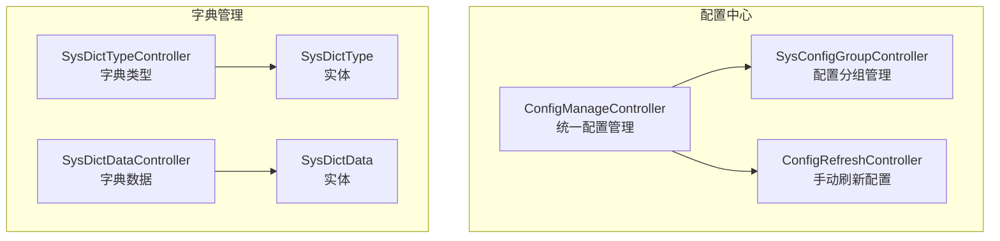
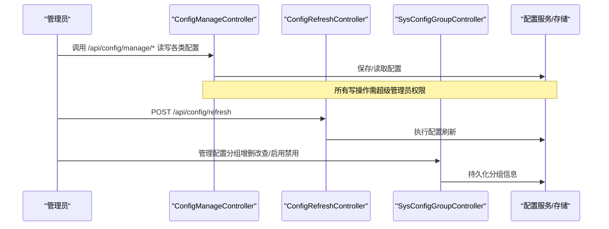
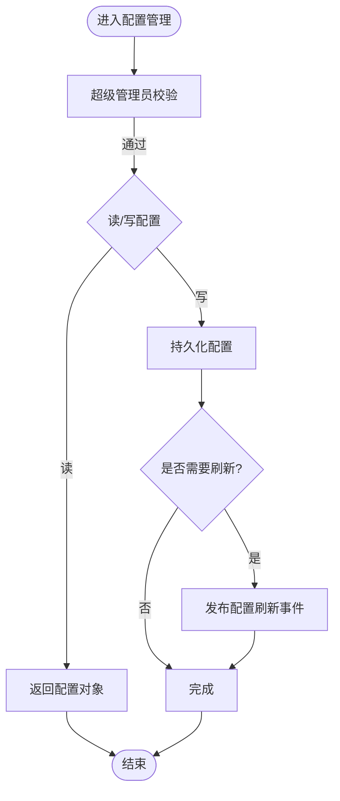
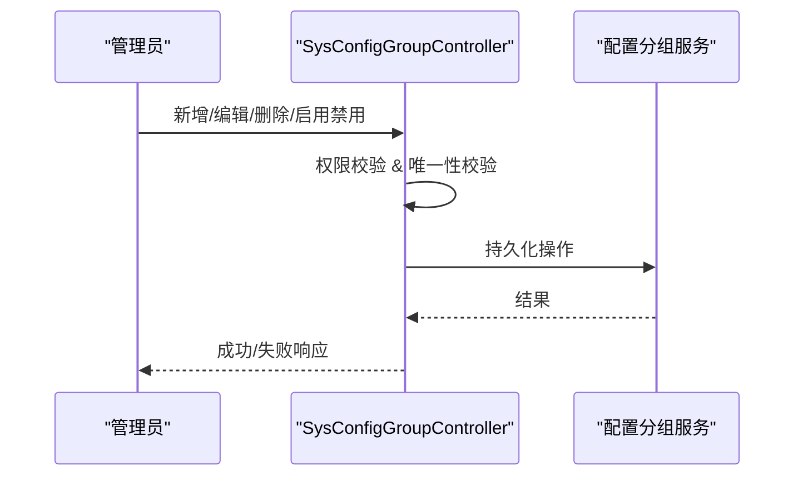
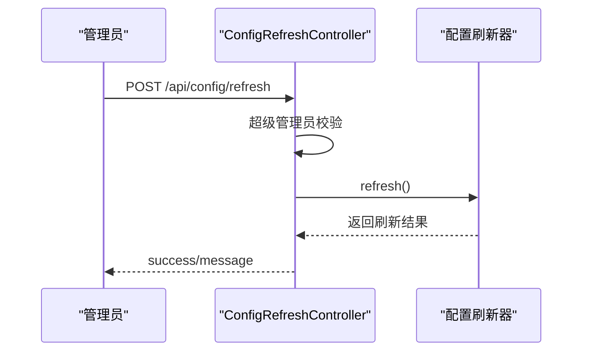
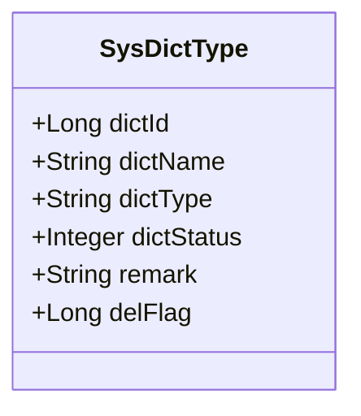
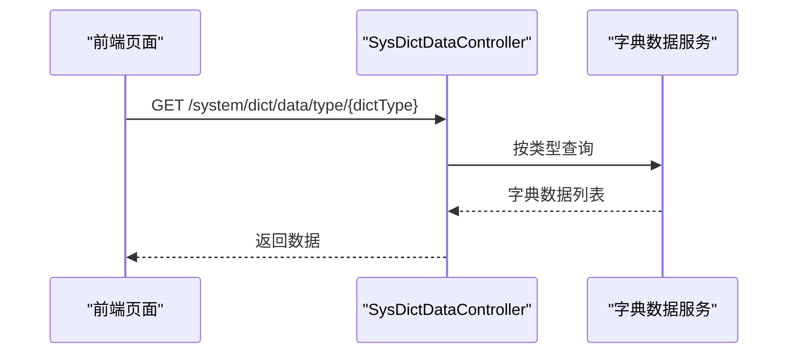
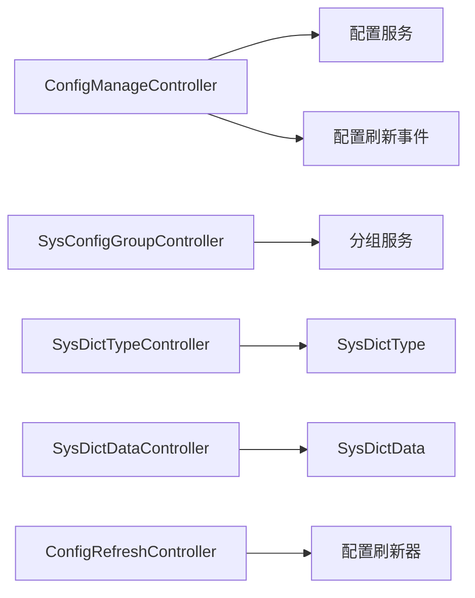

# 系统配置

<cite>
**本文引用的文件**
- [ConfigManageController.java](file://forge-server/forge-framework/forge-starter-parent/forge-starter-config/src/main/java/com/mdframe/forge/starter/config/controller/ConfigManageController.java)
- [SysConfigGroupController.java](file://forge-server/forge-framework/forge-starter-parent/forge-starter-config/src/main/java/com/mdframe/forge/starter/config/controller/SysConfigGroupController.java)
- [ConfigRefreshController.java](file://forge-server/forge-framework/forge-starter-parent/forge-starter-config/src/main/java/com/mdframe/forge/starter/property/controller/ConfigRefreshController.java)
- [SysDictTypeController.java](file://forge-server/forge-framework/forge-plugin-parent/forge-plugin-system/src/main/java/com/mdframe/forge/plugin/system/controller/SysDictTypeController.java)
- [SysDictDataController.java](file://forge-server/forge-framework/forge-plugin-parent/forge-plugin-system/src/main/java/com/mdframe/forge/plugin/system/controller/SysDictDataController.java)
- [SysDictType.java](file://forge-server/forge-framework/forge-plugin-parent/forge-plugin-system/src/main/java/com/mdframe/forge/plugin/system/entity/SysDictType.java)
- [SysDictData.java](file://forge-server/forge-framework/forge-plugin-parent/forge-plugin-system/src/main/java/com/mdframe/forge/plugin/system/entity/SysDictData.java)
</cite>

## 目录
1. [简介](#简介)
2. [项目结构](#项目结构)
3. [核心组件](#核心组件)
4. [架构总览](#架构总览)
5. [详细组件分析](#详细组件分析)
6. [依赖关系分析](#依赖关系分析)
7. [性能考虑](#性能考虑)
8. [故障排查指南](#故障排查指南)
9. [结论](#结论)
10. [附录](#附录)

## 简介
本文件面向Forge Admin的系统配置能力，覆盖系统参数配置、配置中心管理、字典类型与字典数据维护等。重点说明：
- 配置项的分类管理与动态刷新机制
- 配置版本控制与审计思路（结合现有接口与权限）
- 字典机制的实现原理与前端使用方式
- 完整操作流程：新增、修改、生效验证
- 安全控制、备份恢复建议与最佳实践

## 项目结构
系统配置相关能力主要分布在两个模块：
- 配置中心：提供统一配置管理、分组管理、动态刷新等能力
- 字典管理：提供字典类型与字典数据的CRUD及按类型查询能力

图表来源
- [ConfigManageController.java:1-180](file://forge-server/forge-framework/forge-starter-parent/forge-starter-config/src/main/java/com/mdframe/forge/starter/config/controller/ConfigManageController.java#L1-L180)
- [SysConfigGroupController.java:1-153](file://forge-server/forge-framework/forge-starter-parent/forge-starter-config/src/main/java/com/mdframe/forge/starter/config/controller/SysConfigGroupController.java#L1-L153)
- [ConfigRefreshController.java:1-45](file://forge-server/forge-framework/forge-starter-parent/forge-starter-config/src/main/java/com/mdframe/forge/starter/property/controller/ConfigRefreshController.java#L1-L45)
- [SysDictTypeController.java:1-92](file://forge-server/forge-framework/forge-plugin-parent/forge-plugin-system/src/main/java/com/mdframe/forge/plugin/system/controller/SysDictTypeController.java#L1-L92)
- [SysDictDataController.java:1-103](file://forge-server/forge-framework/forge-plugin-parent/forge-plugin-system/src/main/java/com/mdframe/forge/plugin/system/controller/SysDictDataController.java#L1-L103)
- [SysDictType.java:1-51](file://forge-server/forge-framework/forge-plugin-parent/forge-plugin-system/src/main/java/com/mdframe/forge/plugin/system/entity/SysDictType.java#L1-L51)
- [SysDictData.java:1-91](file://forge-server/forge-framework/forge-plugin-parent/forge-plugin-system/src/main/java/com/mdframe/forge/plugin/system/entity/SysDictData.java#L1-L91)

章节来源
- [ConfigManageController.java:1-180](file://forge-server/forge-framework/forge-starter-parent/forge-starter-config/src/main/java/com/mdframe/forge/starter/config/controller/ConfigManageController.java#L1-L180)
- [SysConfigGroupController.java:1-153](file://forge-server/forge-framework/forge-starter-parent/forge-starter-config/src/main/java/com/mdframe/forge/starter/config/controller/SysConfigGroupController.java#L1-L153)
- [ConfigRefreshController.java:1-45](file://forge-server/forge-framework/forge-starter-parent/forge-starter-config/src/main/java/com/mdframe/forge/starter/property/controller/ConfigRefreshController.java#L1-L45)
- [SysDictTypeController.java:1-92](file://forge-server/forge-framework/forge-plugin-parent/forge-plugin-system/src/main/java/com/mdframe/forge/plugin/system/controller/SysDictTypeController.java#L1-L92)
- [SysDictDataController.java:1-103](file://forge-server/forge-framework/forge-plugin-parent/forge-plugin-system/src/main/java/com/mdframe/forge/plugin/system/controller/SysDictDataController.java#L1-L103)
- [SysDictType.java:1-51](file://forge-server/forge-framework/forge-plugin-parent/forge-plugin-system/src/main/java/com/mdframe/forge/plugin/system/entity/SysDictType.java#L1-L51)
- [SysDictData.java:1-91](file://forge-server/forge-framework/forge-plugin-parent/forge-plugin-system/src/main/java/com/mdframe/forge/plugin/system/entity/SysDictData.java#L1-L91)

## 核心组件
- 统一配置管理控制器：提供登录、水印、安全、系统、加解密、认证、日志等配置的读取与更新；支持触发全局配置刷新事件
- 配置分组控制器：对配置分组进行分页、列表、详情、新增、编辑、删除、启用/禁用、按编码获取等操作，并对敏感字段进行脱敏处理
- 配置刷新控制器：提供手动刷新配置的REST接口，受开关控制并需管理员权限
- 字典类型控制器：字典类型的分页、列表、详情、新增、编辑、删除、批量删除
- 字典数据控制器：字典数据的分页、列表、按类型查询、详情、新增、编辑、删除、批量删除

章节来源
- [ConfigManageController.java:1-180](file://forge-server/forge-framework/forge-starter-parent/forge-starter-config/src/main/java/com/mdframe/forge/starter/config/controller/ConfigManageController.java#L1-L180)
- [SysConfigGroupController.java:1-153](file://forge-server/forge-framework/forge-starter-parent/forge-starter-config/src/main/java/com/mdframe/forge/starter/config/controller/SysConfigGroupController.java#L1-L153)
- [ConfigRefreshController.java:1-45](file://forge-server/forge-framework/forge-starter-parent/forge-starter-config/src/main/java/com/mdframe/forge/starter/property/controller/ConfigRefreshController.java#L1-L45)
- [SysDictTypeController.java:1-92](file://forge-server/forge-framework/forge-plugin-parent/forge-plugin-system/src/main/java/com/mdframe/forge/plugin/system/controller/SysDictTypeController.java#L1-L92)
- [SysDictDataController.java:1-103](file://forge-server/forge-framework/forge-plugin-parent/forge-plugin-system/src/main/java/com/mdframe/forge/plugin/system/controller/SysDictDataController.java#L1-L103)

## 架构总览
系统配置能力由“配置中心 + 字典管理”两部分组成，通过统一的REST接口暴露能力，配合权限校验与加密/解密注解保障数据安全。

图表来源
- [ConfigManageController.java:1-180](file://forge-server/forge-framework/forge-starter-parent/forge-starter-config/src/main/java/com/mdframe/forge/starter/config/controller/ConfigManageController.java#L1-L180)
- [ConfigRefreshController.java:1-45](file://forge-server/forge-framework/forge-starter-parent/forge-starter-config/src/main/java/com/mdframe/forge/starter/property/controller/ConfigRefreshController.java#L1-L45)
- [SysConfigGroupController.java:1-153](file://forge-server/forge-framework/forge-starter-parent/forge-starter-config/src/main/java/com/mdframe/forge/starter/config/controller/SysConfigGroupController.java#L1-L153)

## 详细组件分析

### 配置中心管理（统一配置）
- 功能范围
  - 登录、水印、安全、系统、加解密、认证、日志等配置的读取与更新
  - 统一入口：/api/config/manage/*
  - 全局刷新：POST /api/config/manage/refresh，发布配置刷新事件
- 安全控制
  - 所有写操作强制超级管理员校验
  - 请求级加解密注解保护传输安全
- 典型流程
  - 管理员通过界面提交配置 -> 控制器鉴权 -> 服务层持久化 -> 可选触发刷新事件

图表来源
- [ConfigManageController.java:1-180](file://forge-server/forge-framework/forge-starter-parent/forge-starter-config/src/main/java/com/mdframe/forge/starter/config/controller/ConfigManageController.java#L1-L180)

章节来源
- [ConfigManageController.java:1-180](file://forge-server/forge-framework/forge-starter-parent/forge-starter-config/src/main/java/com/mdframe/forge/starter/config/controller/ConfigManageController.java#L1-L180)

### 配置分组管理
- 功能范围
  - 配置分组分页、列表、详情、新增、编辑、删除、启用/禁用、按编码获取、仅启用分组
- 安全与合规
  - 所有操作需超级管理员权限
  - 写入时检测是否包含部署级密钥字段，防止误写敏感值
  - 输出时对敏感字段进行脱敏处理
- 关键约束
  - 分组编码唯一性校验（新增/编辑）
  - 状态切换用于控制分组是否参与加载

图表来源
- [SysConfigGroupController.java:1-153](file://forge-server/forge-framework/forge-starter-parent/forge-starter-config/src/main/java/com/mdframe/forge/starter/config/controller/SysConfigGroupController.java#L1-L153)

章节来源
- [SysConfigGroupController.java:1-153](file://forge-server/forge-framework/forge-starter-parent/forge-starter-config/src/main/java/com/mdframe/forge/starter/config/controller/SysConfigGroupController.java#L1-L153)

### 动态配置刷新
- 能力概述
  - 提供手动刷新配置的REST接口：POST /api/config/refresh
  - 可通过配置开关控制是否启用该端点
  - 需要超级管理员权限
- 触发方式
  - 统一配置管理也支持发布刷新事件，便于在保存特定配置后联动刷新

图表来源
- [ConfigRefreshController.java:1-45](file://forge-server/forge-framework/forge-starter-parent/forge-starter-config/src/main/java/com/mdframe/forge/starter/property/controller/ConfigRefreshController.java#L1-L45)

章节来源
- [ConfigRefreshController.java:1-45](file://forge-server/forge-framework/forge-starter-parent/forge-starter-config/src/main/java/com/mdframe/forge/starter/property/controller/ConfigRefreshController.java#L1-L45)

### 字典类型管理
- 功能范围
  - 字典类型分页、列表、详情、新增、编辑、删除、批量删除
  - 路由前缀：/system/dict/type
- 数据模型要点
  - 主键、名称、类型标识、状态、备注、逻辑删除标志
  - 类型标识在租户内唯一

图表来源
- [SysDictType.java:1-51](file://forge-server/forge-framework/forge-plugin-parent/forge-plugin-system/src/main/java/com/mdframe/forge/plugin/system/entity/SysDictType.java#L1-L51)

章节来源
- [SysDictTypeController.java:1-92](file://forge-server/forge-framework/forge-plugin-parent/forge-plugin-system/src/main/java/com/mdframe/forge/plugin/system/controller/SysDictTypeController.java#L1-L92)
- [SysDictType.java:1-51](file://forge-server/forge-framework/forge-plugin-parent/forge-plugin-system/src/main/java/com/mdframe/forge/plugin/system/entity/SysDictType.java#L1-L51)

### 字典数据维护
- 功能范围
  - 字典数据分页、列表、按类型查询、详情、新增、编辑、删除、批量删除
  - 路由前缀：/system/dict/data
- 数据模型要点
  - 排序、标签、键值、所属类型、样式扩展、默认标记、上级编码、关联类型/值、状态、备注、逻辑删除标志
- 前端使用方式
  - 通过按类型查询接口获取字典数据列表，渲染下拉框或选项

图表来源
- [SysDictDataController.java:1-103](file://forge-server/forge-framework/forge-plugin-parent/forge-plugin-system/src/main/java/com/mdframe/forge/plugin/system/controller/SysDictDataController.java#L1-L103)

章节来源
- [SysDictDataController.java:1-103](file://forge-server/forge-framework/forge-plugin-parent/forge-plugin-system/src/main/java/com/mdframe/forge/plugin/system/controller/SysDictDataController.java#L1-L103)
- [SysDictData.java:1-91](file://forge-server/forge-framework/forge-plugin-parent/forge-plugin-system/src/main/java/com/mdframe/forge/plugin/system/entity/SysDictData.java#L1-L91)

## 依赖关系分析
- 控制器与服务/实体的耦合
  - 配置管理控制器依赖配置服务与上下文，负责鉴权与事件发布
  - 配置分组控制器依赖分组服务与脱敏工具，负责分组生命周期管理
  - 字典控制器分别依赖各自的服务与实体
- 外部依赖
  - 权限与会话工具：用于超级管理员校验
  - 加解密注解：用于请求/响应安全
  - 配置刷新器：用于手动刷新

图表来源
- [ConfigManageController.java:1-180](file://forge-server/forge-framework/forge-starter-parent/forge-starter-config/src/main/java/com/mdframe/forge/starter/config/controller/ConfigManageController.java#L1-L180)
- [SysConfigGroupController.java:1-153](file://forge-server/forge-framework/forge-starter-parent/forge-starter-config/src/main/java/com/mdframe/forge/starter/config/controller/SysConfigGroupController.java#L1-L153)
- [SysDictTypeController.java:1-92](file://forge-server/forge-framework/forge-plugin-parent/forge-plugin-system/src/main/java/com/mdframe/forge/plugin/system/controller/SysDictTypeController.java#L1-L92)
- [SysDictDataController.java:1-103](file://forge-server/forge-framework/forge-plugin-parent/forge-plugin-system/src/main/java/com/mdframe/forge/plugin/system/controller/SysDictDataController.java#L1-L103)
- [ConfigRefreshController.java:1-45](file://forge-server/forge-framework/forge-starter-parent/forge-starter-config/src/main/java/com/mdframe/forge/starter/property/controller/ConfigRefreshController.java#L1-L45)

章节来源
- [ConfigManageController.java:1-180](file://forge-server/forge-framework/forge-starter-parent/forge-starter-config/src/main/java/com/mdframe/forge/starter/config/controller/ConfigManageController.java#L1-L180)
- [SysConfigGroupController.java:1-153](file://forge-server/forge-framework/forge-starter-parent/forge-starter-config/src/main/java/com/mdframe/forge/starter/config/controller/SysConfigGroupController.java#L1-L153)
- [SysDictTypeController.java:1-92](file://forge-server/forge-framework/forge-plugin-parent/forge-plugin-system/src/main/java/com/mdframe/forge/plugin/system/controller/SysDictTypeController.java#L1-L92)
- [SysDictDataController.java:1-103](file://forge-server/forge-framework/forge-plugin-parent/forge-plugin-system/src/main/java/com/mdframe/forge/plugin/system/controller/SysDictDataController.java#L1-L103)
- [ConfigRefreshController.java:1-45](file://forge-server/forge-framework/forge-starter-parent/forge-starter-config/src/main/java/com/mdframe/forge/starter/property/controller/ConfigRefreshController.java#L1-L45)

## 性能考虑
- 配置读取路径应优先走缓存，避免频繁数据库访问
- 字典数据按类型查询适合缓存，减少重复IO
- 批量操作（如批量删除）注意事务边界与锁粒度
- 配置刷新应幂等，避免重复刷新造成抖动

[本节为通用指导，不直接分析具体文件]

## 故障排查指南
- 权限问题
  - 配置相关写操作与刷新均要求超级管理员，若报错请检查当前会话身份
- 敏感字段写入限制
  - 配置分组新增/编辑会拦截部署级密钥字段的写入，请确认配置值是否包含敏感内容
- 刷新失败
  - 检查刷新端点是否启用以及刷新器实现是否正常
- 字典数据异常
  - 确认字典类型是否存在且启用；检查键值唯一性与排序冲突

章节来源
- [SysConfigGroupController.java:1-153](file://forge-server/forge-framework/forge-starter-parent/forge-starter-config/src/main/java/com/mdframe/forge/starter/config/controller/SysConfigGroupController.java#L1-L153)
- [ConfigRefreshController.java:1-45](file://forge-server/forge-framework/forge-starter-parent/forge-starter-config/src/main/java/com/mdframe/forge/starter/property/controller/ConfigRefreshController.java#L1-L45)

## 结论
Forge Admin提供了完善的系统配置与字典管理能力：
- 统一配置管理接口覆盖多类运行时配置，支持动态刷新
- 配置分组具备细粒度控制与安全校验
- 字典机制以类型+数据的方式支撑前端展示与业务枚举
- 通过权限、加解密、脱敏等手段保障配置安全
建议在生产环境结合审计与备份策略，形成完整的配置治理闭环。

[本节为总结，不直接分析具体文件]

## 附录

### 操作流程清单
- 新增配置分组
  - 调用分组新增接口，确保分组编码唯一且不包含部署级密钥
- 修改配置分组
  - 调用分组编辑接口，再次校验唯一性与敏感字段
- 启用/禁用配置分组
  - 调用状态切换接口，影响分组是否参与加载
- 新增/修改字典类型
  - 调用字典类型新增/编辑接口，确保类型标识在租户内唯一
- 新增/修改字典数据
  - 调用字典数据新增/编辑接口，设置正确的类型、键值与排序
- 配置生效验证
  - 修改配置后，调用刷新接口或等待自动刷新；再读取对应配置验证

[本节为操作指引，不直接分析具体文件]

### 安全与审计建议
- 安全控制
  - 所有写操作必须超级管理员
  - 使用加解密注解保护传输
  - 输出敏感字段脱敏
- 审计
  - 建议在服务层记录关键操作的审计日志（操作人、时间、变更前后值）
- 备份与恢复
  - 定期导出配置表与字典表数据
  - 建立回滚脚本与恢复流程，确保可快速复原

[本节为通用建议，不直接分析具体文件]