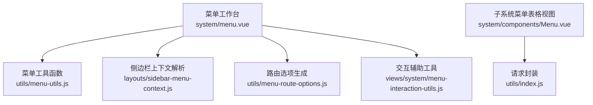
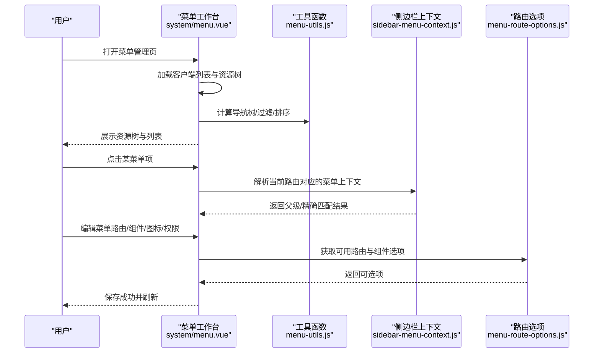
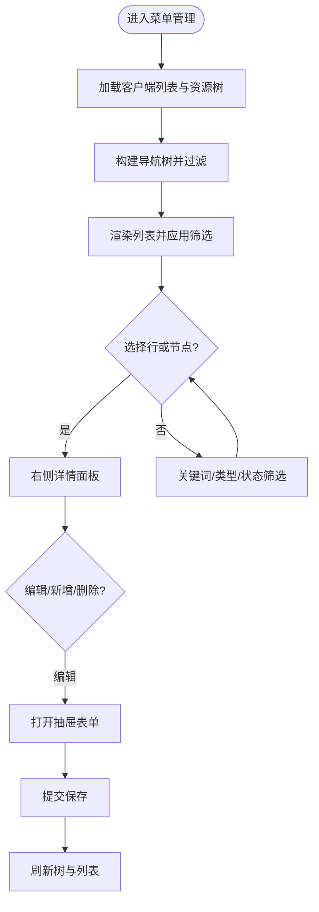
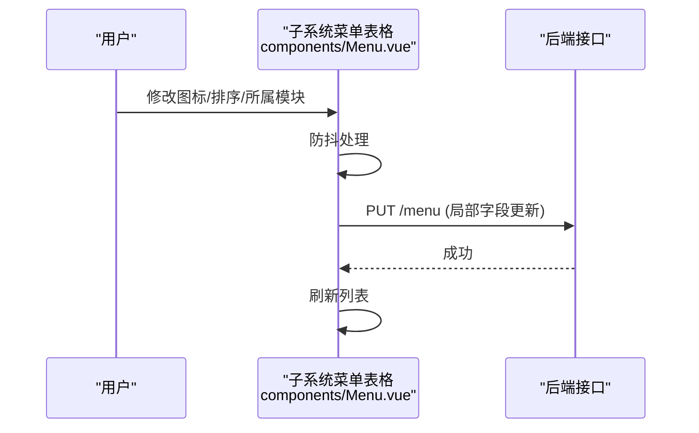
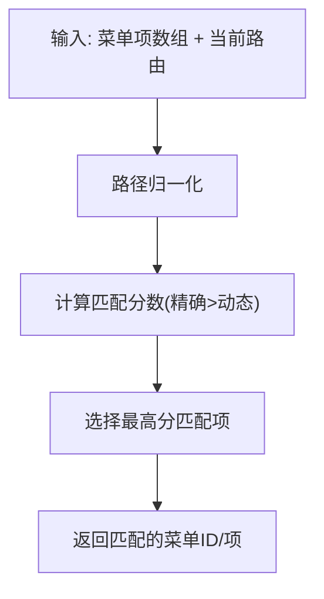
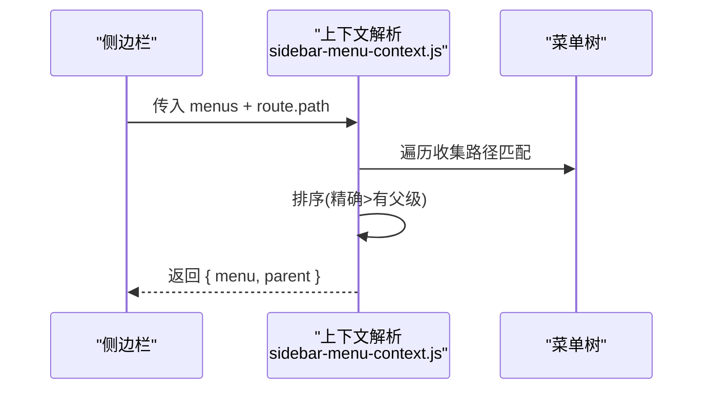
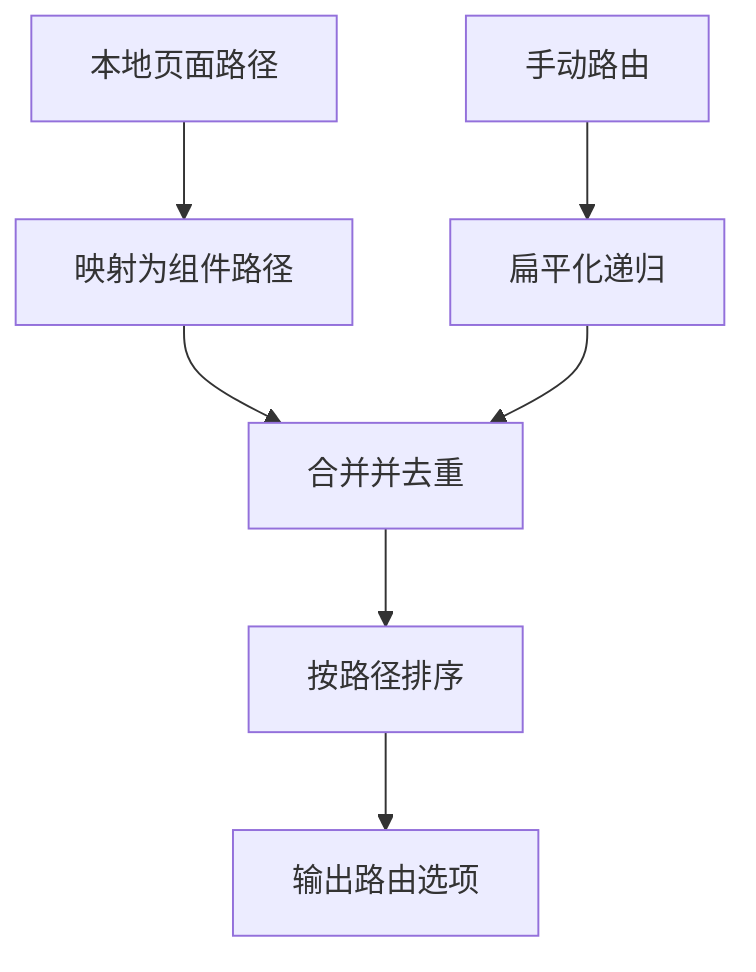
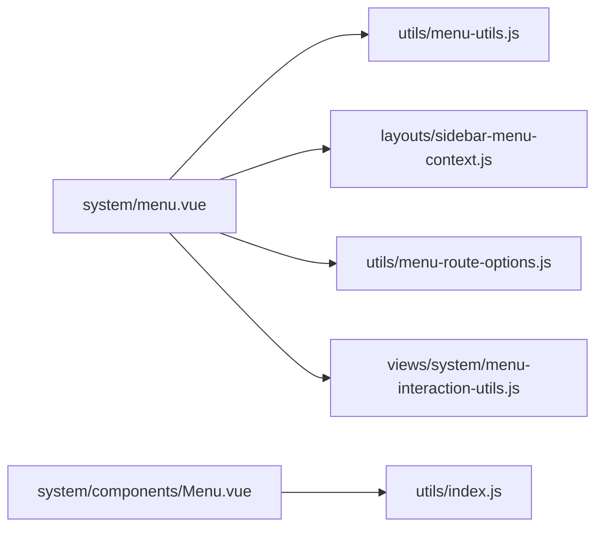

# 菜单管理

<cite>
**本文引用的文件**
- [menu.vue](file://forge-admin-ui/src/views/system/menu.vue)
- [Menu.vue](file://forge-admin-ui/src/views/system/components/Menu.vue)
- [menu-utils.js](file://forge-admin-ui/src/utils/menu-utils.js)
- [sidebar-menu-context.js](file://forge-admin-ui/src/layouts/sidebar-menu-context.js)
- [menu-route-options.js](file://forge-admin-ui/src/utils/menu-route-options.js)
- [menu-interaction-utils.js](file://forge-admin-ui/src/views/system/menu-interaction-utils.js)
</cite>

## 目录
1. [简介](#简介)
2. [项目结构](#项目结构)
3. [核心组件](#核心组件)
4. [架构总览](#架构总览)
5. [详细组件分析](#详细组件分析)
6. [依赖关系分析](#依赖关系分析)
7. [性能与缓存](#性能与缓存)
8. [故障排查指南](#故障排查指南)
9. [结论](#结论)
10. [附录：配置示例与最佳实践](#附录：配置示例与最佳实践)

## 简介
本文件面向 Forge Admin 的“菜单管理”能力，覆盖树形资源（目录/菜单/按钮/API）的管理、路由与权限绑定、前端动态路由生成、多级菜单渲染、拖拽排序与显示顺序控制、图标配置、外部链接与 iframe 嵌入、批量操作与迁移等。文档同时给出缓存策略、性能优化建议以及常见配置问题的解决方案，帮助读者快速掌握并高效使用菜单管理功能。

## 项目结构
菜单管理在前端由多个模块协同完成：
- 页面视图层：系统级菜单工作台与子系统内菜单表格视图
- 工具与逻辑层：菜单路径匹配、高亮、侧边栏上下文解析、路由选项生成
- 交互辅助：扁平化树、上下文行解析、新鲜数据行查找

图表来源
- [menu.vue:1-800](file://forge-admin-ui/src/views/system/menu.vue#L1-L800)
- [menu-utils.js:1-287](file://forge-admin-ui/src/utils/menu-utils.js#L1-L287)
- [sidebar-menu-context.js:1-97](file://forge-admin-ui/src/layouts/sidebar-menu-context.js#L1-L97)
- [menu-route-options.js:1-98](file://forge-admin-ui/src/utils/menu-route-options.js#L1-L98)
- [menu-interaction-utils.js:1-30](file://forge-admin-ui/src/views/system/menu-interaction-utils.js#L1-L30)
- [Menu.vue:1-576](file://forge-admin-ui/src/views/system/components/Menu.vue#L1-L576)

章节来源
- [menu.vue:1-800](file://forge-admin-ui/src/views/system/menu.vue#L1-L800)
- [Menu.vue:1-576](file://forge-admin-ui/src/views/system/components/Menu.vue#L1-L576)

## 核心组件
- 系统级菜单工作台（system/menu.vue）
  - 提供资源树、列表、详情面板、抽屉编辑表单、批量迁移弹窗
  - 支持按客户端筛选、关键词过滤、类型与可见性筛选
  - 支持行内排序、显隐切换、批量选择与删除
  - 集成图标选择器（字体/图片）、路由与组件自动补全
- 子系统菜单表格视图（system/components/Menu.vue）
  - 基于分页表格展示菜单，支持新增/编辑/删除、图标与排序即时保存
  - 支持所属模块选择（子系统-模块树）
  - 支持打开方式（路由/iframe）

章节来源
- [menu.vue:1-800](file://forge-admin-ui/src/views/system/menu.vue#L1-L800)
- [Menu.vue:1-576](file://forge-admin-ui/src/views/system/components/Menu.vue#L1-L576)

## 架构总览
菜单管理的整体流程包括：加载资源树与列表、构建导航树、过滤与搜索、编辑保存、侧边栏高亮与上下文解析、动态路由选项生成。

图表来源
- [menu.vue:1-800](file://forge-admin-ui/src/views/system/menu.vue#L1-L800)
- [menu-utils.js:1-287](file://forge-admin-ui/src/utils/menu-utils.js#L1-L287)
- [sidebar-menu-context.js:1-97](file://forge-admin-ui/src/layouts/sidebar-menu-context.js#L1-L97)
- [menu-route-options.js:1-98](file://forge-admin-ui/src/utils/menu-route-options.js#L1-L98)

## 详细组件分析

### 系统级菜单工作台（system/menu.vue）
- 树形结构与导航
  - 通过构建导航树并配合关键词过滤，实现左侧“资源结构”的快速定位
  - 支持展开/折叠全部节点，维护展开键集合与选中键集合
- 列表与筛选
  - 列表支持关键词（名称/路由/权限/API）、类型（目录/菜单/按钮/API）、状态（显示/隐藏）组合筛选
  - 支持行内排序输入与显隐切换，减少跳转成本
- 详情面板
  - 展示基础信息（客户端、排序、路由、组件、权限标识、API）、子资源概览与备注
- 抽屉编辑
  - 支持图标选择（字体图标/图片上传）
  - 路由与组件自动补全，基于已注册页面与手动路由生成
- 批量操作
  - 批量选择、批量删除、批量迁移归属（目标上级资源）

图表来源
- [menu.vue:1-800](file://forge-admin-ui/src/views/system/menu.vue#L1-L800)

章节来源
- [menu.vue:1-800](file://forge-admin-ui/src/views/system/menu.vue#L1-L800)

### 子系统菜单表格视图（system/components/Menu.vue）
- 表格列包含：选择、名称、路径、图标、所属模块、排序、iframe 标记、操作
- 图标与排序变更采用防抖后直接调用接口更新，提升体验
- 所属模块通过子系统-模块树选择，便于多业务域隔离
- 打开方式支持路由与 iframe 两种模式

图表来源
- [Menu.vue:1-576](file://forge-admin-ui/src/views/system/components/Menu.vue#L1-L576)

章节来源
- [Menu.vue:1-576](file://forge-admin-ui/src/views/system/components/Menu.vue#L1-L576)

### 菜单工具函数（utils/menu-utils.js）
- 路径归一化与匹配
  - 支持外部链接识别、路径规范化、哈希与查询参数剥离
  - 支持动态路由匹配（含 :param），并提供评分机制以优先精确匹配
- 菜单数据处理
  - processTopMenus/processMenuData：将原始菜单转换为适合显示的层级结构，处理 subapp/module 等类型
  - findActiveTopMenu/findMenuItem/findMenuIdByPath：根据当前路由查找活跃菜单项或匹配 ID

图表来源
- [menu-utils.js:1-287](file://forge-admin-ui/src/utils/menu-utils.js#L1-L287)

章节来源
- [menu-utils.js:1-287](file://forge-admin-ui/src/utils/menu-utils.js#L1-L287)

### 侧边栏上下文解析（layouts/sidebar-menu-context.js）
- 根据当前路由在菜单树中收集所有路径匹配项，并按“是否精确匹配”“是否有父级”进行排序，返回最合适的上下文
- 支持隐藏子页面的逻辑父级（meta.parentKey）场景

图表来源
- [sidebar-menu-context.js:1-97](file://forge-admin-ui/src/layouts/sidebar-menu-context.js#L1-L97)

章节来源
- [sidebar-menu-context.js:1-97](file://forge-admin-ui/src/layouts/sidebar-menu-context.js#L1-L97)

### 路由选项生成（utils/menu-route-options.js）
- 从本地页面路径与手动路由中生成可用的路由选项，供菜单编辑时自动补全
- 忽略特定路径（如登录、404），并对重复路径去重，优先保留带 component 的选项

图表来源
- [menu-route-options.js:1-98](file://forge-admin-ui/src/utils/menu-route-options.js#L1-L98)

章节来源
- [menu-route-options.js:1-98](file://forge-admin-ui/src/utils/menu-route-options.js#L1-L98)

### 交互辅助工具（views/system/menu-interaction-utils.js）
- flattenResourceTree：将树形资源展平为一维数组，便于列表渲染与筛选
- resolveResourceContextRows：根据当前节点决定展示其直接子项或包含后代
- resolveFreshResourceRow：从展平列表中查找最新的数据行，避免引用失效

章节来源
- [menu-interaction-utils.js:1-30](file://forge-admin-ui/src/views/system/menu-interaction-utils.js#L1-L30)

## 依赖关系分析
- menu.vue 依赖：
  - menu-utils.js：路径匹配、菜单数据处理、高亮与活跃项查找
  - sidebar-menu-context.js：侧边栏高亮与上下文解析
  - menu-route-options.js：路由与组件自动补全
  - menu-interaction-utils.js：树展平与上下文行解析
- Menu.vue 依赖：
  - 请求封装 utils/index.js：用于增删改查与局部更新
  - IconSelector/ImageUpload：图标与图片上传

图表来源
- [menu.vue:1-800](file://forge-admin-ui/src/views/system/menu.vue#L1-L800)
- [menu-utils.js:1-287](file://forge-admin-ui/src/utils/menu-utils.js#L1-L287)
- [sidebar-menu-context.js:1-97](file://forge-admin-ui/src/layouts/sidebar-menu-context.js#L1-L97)
- [menu-route-options.js:1-98](file://forge-admin-ui/src/utils/menu-route-options.js#L1-L98)
- [menu-interaction-utils.js:1-30](file://forge-admin-ui/src/views/system/menu-interaction-utils.js#L1-L30)
- [Menu.vue:1-576](file://forge-admin-ui/src/views/system/components/Menu.vue#L1-L576)

章节来源
- [menu.vue:1-800](file://forge-admin-ui/src/views/system/menu.vue#L1-L800)
- [Menu.vue:1-576](file://forge-admin-ui/src/views/system/components/Menu.vue#L1-L576)

## 性能与缓存
- 前端缓存策略建议
  - 菜单数据缓存：将菜单树与列表数据缓存至内存（如 store 或单例对象），并在用户切换客户端或主动刷新时失效
  - 路由选项缓存：menu-route-options.js 生成的路由选项可在会话内复用，避免重复计算
  - 懒加载与虚拟滚动：当菜单层级较深或列表较长时，考虑按需加载子树或使用虚拟列表
- 网络与渲染优化
  - 增量更新：对图标、排序、所属模块等小改动采用局部更新接口，减少整表刷新
  - 防抖与节流：编辑输入与频繁操作使用防抖，降低请求频率
  - 骨架屏与占位：在加载期间展示骨架屏，提升感知性能
- 路由与权限
  - 动态路由生成应延迟到权限数据就绪后再执行，避免重复注册
  - 菜单权限过滤应在服务端完成，前端仅做展示与交互控制

[本节为通用指导，不直接分析具体文件]

## 故障排查指南
- 菜单高亮异常
  - 检查路径归一化是否正确（去除多余斜杠、哈希与查询参数）
  - 确认动态路由匹配规则是否生效（含 :param）
  - 参考路径匹配与评分逻辑
- 侧边栏上下文错误
  - 若存在隐藏子页面，需确保 meta.parentKey 正确设置
  - 校验菜单树中是否存在对应 key/id
- 路由自动补全缺失
  - 确认页面路径与手动路由是否被纳入选项生成
  - 检查 ignorePaths 是否误过滤了必要路由
- 批量迁移失败
  - 检查目标上级是否为合法节点，避免循环引用
  - 确认已选根节点不包含被选中的祖先节点

章节来源
- [menu-utils.js:1-287](file://forge-admin-ui/src/utils/menu-utils.js#L1-L287)
- [sidebar-menu-context.js:1-97](file://forge-admin-ui/src/layouts/sidebar-menu-context.js#L1-L97)
- [menu-route-options.js:1-98](file://forge-admin-ui/src/utils/menu-route-options.js#L1-L98)

## 结论
Forge Admin 的菜单管理提供了完整的树形资源管理能力，涵盖目录/菜单/按钮/API 四类资源，支持路由与权限绑定、图标与显示顺序配置、批量操作与迁移。结合路径匹配、侧边栏上下文解析与路由选项生成，实现了灵活的多级菜单渲染与高亮。通过合理的缓存与性能优化策略，可在复杂场景下保持良好体验。

[本节为总结，不直接分析具体文件]

## 附录：配置示例与最佳实践

- 菜单类型与用途
  - 目录：用于分组与组织下级菜单，通常无 path 或仅作为容器
  - 菜单：指向具体页面，配置 path 与 component，参与路由与高亮
  - 按钮：用于页面内操作权限控制，通常配置 perms 标识
  - API：用于接口级权限控制，配置 apiMethod 与 apiUrl
- 路由与组件
  - 使用自动补全选择已有页面路由或组件路径，避免手写错误
  - 外部链接：path 可为 http(s) 等协议地址；iframe 嵌入可通过打开方式配置
- 权限绑定
  - 菜单级：perms 标识用于按钮/操作级权限控制
  - 接口级：apiMethod + apiUrl 用于细粒度接口访问控制
- 显示顺序与排序
  - sort 字段控制同级排序，支持行内编辑与批量调整
- 图标配置
  - 支持字体图标与图片图标，建议在统一规范下管理图标资源
- 动态菜单
  - 根据角色/租户/客户端动态加载菜单树，前端缓存菜单数据并在权限变化时刷新
- 常见问题
  - 路径重复或格式不规范导致高亮异常：使用路径归一化工具统一处理
  - 动态路由未命中：确保菜单 path 与实际路由一致，必要时使用动态段
  - 批量迁移冲突：避免将子节点迁移到其子孙节点下

[本节为概念性内容，不直接分析具体文件]