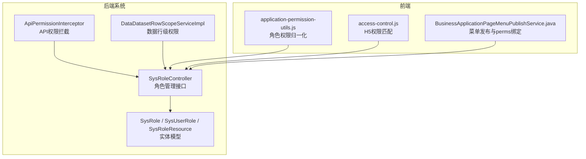
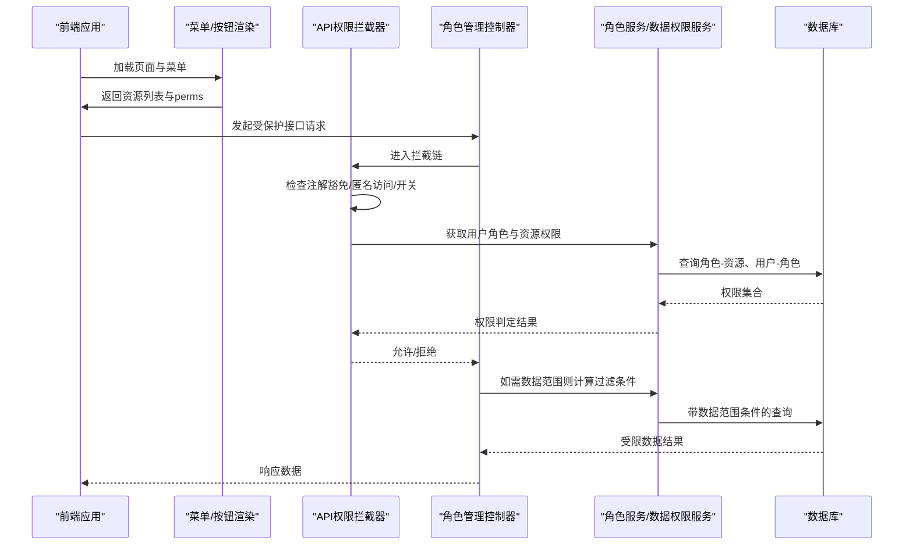
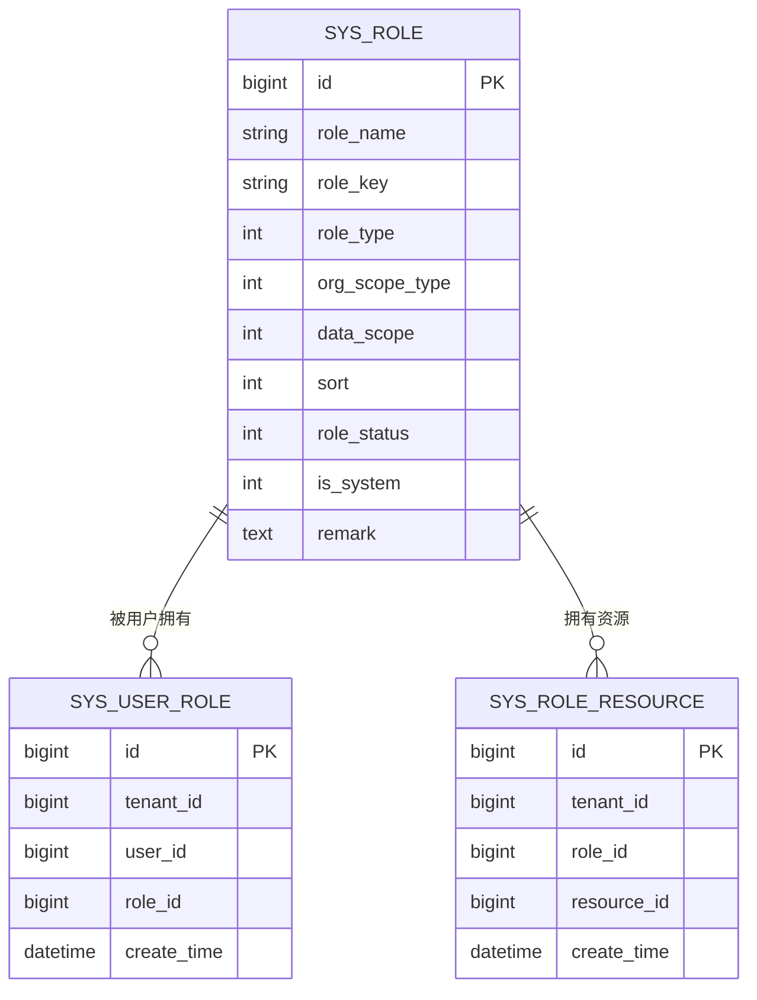
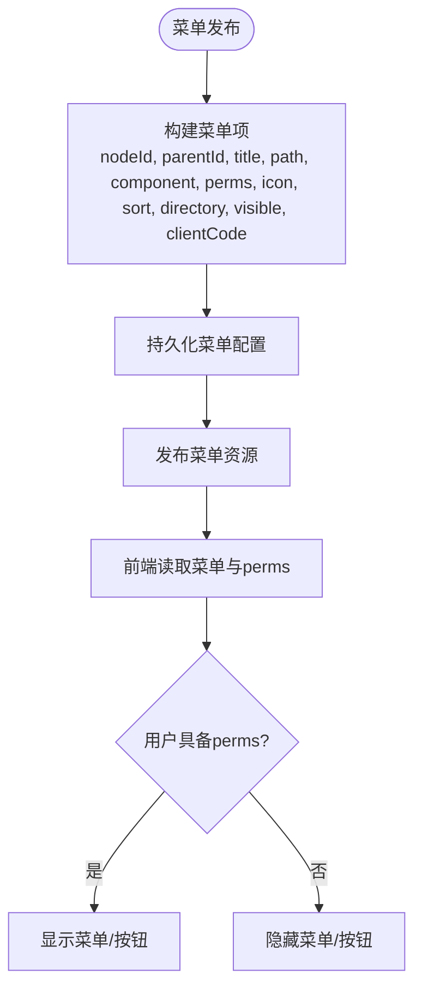
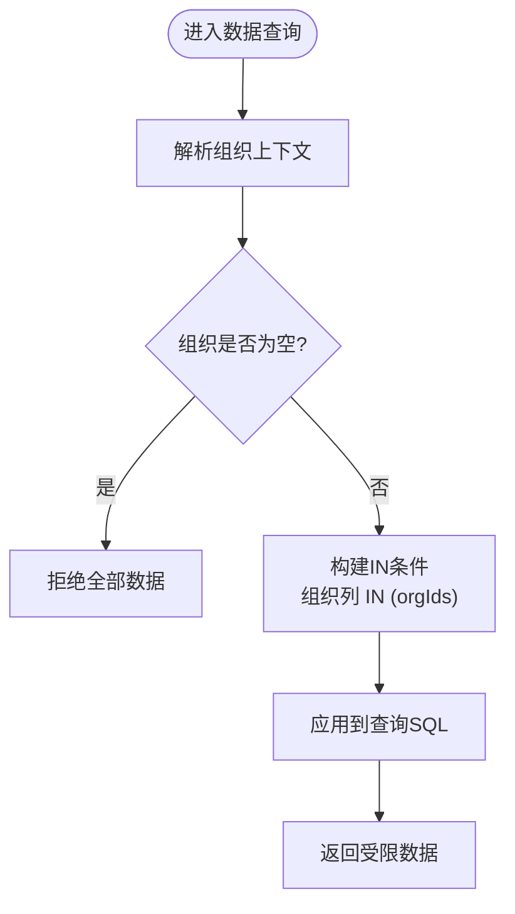
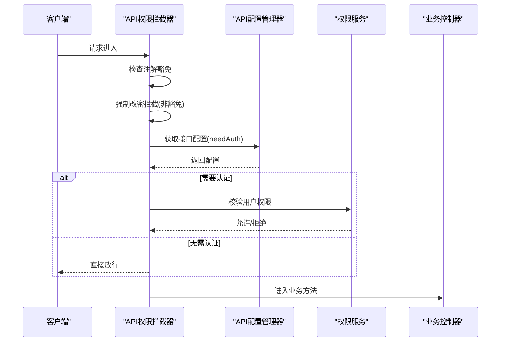
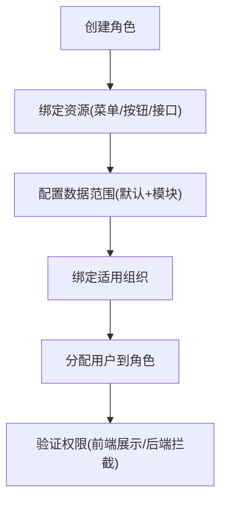
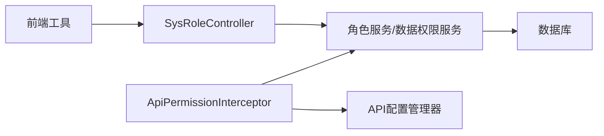

# 角色权限管理

<cite>
**本文引用的文件**
- [SysRole.java](file://forge-server/forge-framework/forge-plugin-parent/forge-plugin-system/src/main/java/com/mdframe/forge/plugin/system/entity/SysRole.java)
- [SysUserRole.java](file://forge-server/forge-framework/forge-plugin-parent/forge-plugin-system/src/main/java/com/mdframe/forge/plugin/system/entity/SysUserRole.java)
- [SysRoleResource.java](file://forge-server/forge-framework/forge-plugin-parent/forge-plugin-system/src/main/java/com/mdframe/forge/plugin/system/entity/SysRoleResource.java)
- [SysRoleController.java](file://forge-server/forge-framework/forge-plugin-parent/forge-plugin-system/src/main/java/com/mdframe/forge/plugin/system/controller/SysRoleController.java)
- [ApiPermissionInterceptor.java](file://forge-server/forge-framework/forge-starter-parent/forge-starter-auth/src/main/java/com/mdframe/forge/starter/auth/interceptor/ApiPermissionInterceptor.java)
- [DataDatasetRowScopeServiceImpl.java](file://forge-server/forge-framework/forge-plugin-parent/forge-plugin-data/src/main/java/com/mdframe/forge/plugin/data/service/impl/DataDatasetRowScopeServiceImpl.java)
- [application-permission-utils.js](file://forge-admin-ui/src/views/app-center/application-permission-utils.js)
- [access-control.js](file://forge-h5-ui/src/utils/access-control.js)
- [BusinessApplicationPageMenuPublishService.java](file://forge-server/forge-framework/forge-plugin-parent/forge-plugin-generator/src/main/java/com/mdframe/forge/plugin/generator/service/businessapp/BusinessApplicationPageMenuPublishService.java)
</cite>

## 目录
1. [简介](#简介)
2. [项目结构](#项目结构)
3. [核心组件](#核心组件)
4. [架构总览](#架构总览)
5. [详细组件分析](#详细组件分析)
6. [依赖关系分析](#依赖关系分析)
7. [性能考虑](#性能考虑)
8. [故障排查指南](#故障排查指南)
9. [结论](#结论)
10. [附录](#附录)

## 简介
本文件面向Forge Admin的角色权限管理功能，系统性阐述基于RBAC的权限模型实现与落地实践。内容覆盖：
- 角色定义、菜单权限分配、按钮级权限控制、数据权限设置
- 角色与用户、角色的关系映射与权限继承机制
- 数据权限控制原理（部门数据范围、自定义数据规则）
- 从角色创建到权限分配的完整操作流程
- 权限缓存与校验的技术细节
- 最佳实践与常见问题解决方案

## 项目结构
权限相关能力横跨后端系统插件、认证拦截器、数据行级权限服务以及前端权限工具与页面配置。关键位置如下：
- 系统实体与控制器：角色、用户-角色关联、角色-资源关联及角色管理接口
- 认证与API权限拦截：统一入口拦截并执行API权限校验
- 数据权限：按组织/子组织等维度生成行级过滤条件
- 前端权限：资源标识规范化、模块数据范围处理、H5端权限匹配
- 菜单发布：将菜单节点与权限标识绑定并发布为可鉴权资源

图表来源
- [SysRoleController.java:20-180](file://forge-server/forge-framework/forge-plugin-parent/forge-plugin-system/src/main/java/com/mdframe/forge/plugin/system/controller/SysRoleController.java#L20-L180)
- [SysRole.java:1-82](file://forge-server/forge-framework/forge-plugin-parent/forge-plugin-system/src/main/java/com/mdframe/forge/plugin/system/entity/SysRole.java#L1-L82)
- [SysUserRole.java:1-46](file://forge-server/forge-framework/forge-plugin-parent/forge-plugin-system/src/main/java/com/mdframe/forge/plugin/system/entity/SysUserRole.java#L1-L46)
- [SysRoleResource.java:1-46](file://forge-server/forge-framework/forge-plugin-parent/forge-plugin-system/src/main/java/com/mdframe/forge/plugin/system/entity/SysRoleResource.java#L1-L46)
- [ApiPermissionInterceptor.java:51-80](file://forge-server/forge-framework/forge-starter-parent/forge-starter-auth/src/main/java/com/mdframe/forge/starter/auth/interceptor/ApiPermissionInterceptor.java#L51-L80)
- [DataDatasetRowScopeServiceImpl.java:127-148](file://forge-server/forge-framework/forge-plugin-parent/forge-plugin-data/src/main/java/com/mdframe/forge/plugin/data/service/impl/DataDatasetRowScopeServiceImpl.java#L127-L148)
- [application-permission-utils.js:1-59](file://forge-admin-ui/src/views/app-center/application-permission-utils.js#L1-L59)
- [access-control.js:51-64](file://forge-h5-ui/src/utils/access-control.js#L51-L64)
- [BusinessApplicationPageMenuPublishService.java:145-169](file://forge-server/forge-framework/forge-plugin-parent/forge-plugin-generator/src/main/java/com/mdframe/forge/plugin/generator/service/businessapp/BusinessApplicationPageMenuPublishService.java#L145-L169)

章节来源
- [SysRoleController.java:20-180](file://forge-server/forge-framework/forge-plugin-parent/forge-plugin-system/src/main/java/com/mdframe/forge/plugin/system/controller/SysRoleController.java#L20-L180)
- [SysRole.java:1-82](file://forge-server/forge-framework/forge-plugin-parent/forge-plugin-system/src/main/java/com/mdframe/forge/plugin/system/entity/SysRole.java#L1-L82)
- [SysUserRole.java:1-46](file://forge-server/forge-framework/forge-plugin-parent/forge-plugin-system/src/main/java/com/mdframe/forge/plugin/system/entity/SysUserRole.java#L1-L46)
- [SysRoleResource.java:1-46](file://forge-server/forge-framework/forge-plugin-parent/forge-plugin-system/src/main/java/com/mdframe/forge/plugin/system/entity/SysRoleResource.java#L1-L46)
- [ApiPermissionInterceptor.java:51-80](file://forge-server/forge-framework/forge-starter-parent/forge-starter-auth/src/main/java/com/mdframe/forge/starter/auth/interceptor/ApiPermissionInterceptor.java#L51-L80)
- [DataDatasetRowScopeServiceImpl.java:127-148](file://forge-server/forge-framework/forge-plugin-parent/forge-plugin-data/src/main/java/com/mdframe/forge/plugin/data/service/impl/DataDatasetRowScopeServiceImpl.java#L127-L148)
- [application-permission-utils.js:1-59](file://forge-admin-ui/src/views/app-center/application-permission-utils.js#L1-L59)
- [access-control.js:51-64](file://forge-h5-ui/src/utils/access-control.js#L51-L64)
- [BusinessApplicationPageMenuPublishService.java:145-169](file://forge-server/forge-framework/forge-plugin-parent/forge-plugin-generator/src/main/java/com/mdframe/forge/plugin/generator/service/businessapp/BusinessApplicationPageMenuPublishService.java#L145-L169)

## 核心组件
- 角色与资源模型
  - 角色实体包含角色名称、角色键、类型、组织适用范围、默认数据权限、排序、状态、是否系统内置等字段，用于承载RBAC中的“角色”概念与基础数据权限。
  - 用户-角色关联表维护多对多关系，支撑“用户属于哪些角色”。
  - 角色-资源关联表维护角色与菜单/按钮/接口等资源的多对多关系，支撑“角色拥有哪些资源”。

- 角色管理接口
  - 提供分页查询、新增、修改、删除、批量删除、绑定/解绑资源、查询资源ID列表、查询/保存数据范围、绑定适用组织、查询/添加/移除角色用户等能力。

- API权限拦截
  - 在请求进入业务方法前进行鉴权：支持注解豁免、匿名访问判断、开关控制、以及调用API配置管理器进行权限判定。

- 数据行级权限
  - 根据登录用户当前组织或指定组织集合，结合数据范围策略，生成SQL过滤条件，限制查询结果的数据范围。

- 前端权限工具
  - 角色权限归一化：标准化资源ID、模块数据范围，构建提交负载，比较差异，统计授权效果。
  - H5权限匹配：支持通配符模式匹配，实现细粒度按钮/操作级权限控制。

- 菜单发布
  - 将菜单节点转换为可发布的菜单项，携带权限标识（perms），供前端路由与按钮显隐使用。

章节来源
- [SysRole.java:1-82](file://forge-server/forge-framework/forge-plugin-parent/forge-plugin-system/src/main/java/com/mdframe/forge/plugin/system/entity/SysRole.java#L1-L82)
- [SysUserRole.java:1-46](file://forge-server/forge-framework/forge-plugin-parent/forge-plugin-system/src/main/java/com/mdframe/forge/plugin/system/entity/SysUserRole.java#L1-L46)
- [SysRoleResource.java:1-46](file://forge-server/forge-framework/forge-plugin-parent/forge-plugin-system/src/main/java/com/mdframe/forge/plugin/system/entity/SysRoleResource.java#L1-L46)
- [SysRoleController.java:20-180](file://forge-server/forge-framework/forge-plugin-parent/forge-plugin-system/src/main/java/com/mdframe/forge/plugin/system/controller/SysRoleController.java#L20-L180)
- [ApiPermissionInterceptor.java:51-80](file://forge-server/forge-framework/forge-starter-parent/forge-starter-auth/src/main/java/com/mdframe/forge/starter/auth/interceptor/ApiPermissionInterceptor.java#L51-L80)
- [DataDatasetRowScopeServiceImpl.java:127-148](file://forge-server/forge-framework/forge-plugin-parent/forge-plugin-data/src/main/java/com/mdframe/forge/plugin/data/service/impl/DataDatasetRowScopeServiceImpl.java#L127-L148)
- [application-permission-utils.js:1-59](file://forge-admin-ui/src/views/app-center/application-permission-utils.js#L1-L59)
- [access-control.js:51-64](file://forge-h5-ui/src/utils/access-control.js#L51-L64)
- [BusinessApplicationPageMenuPublishService.java:145-169](file://forge-server/forge-framework/forge-plugin-parent/forge-plugin-generator/src/main/java/com/mdframe/forge/plugin/generator/service/businessapp/BusinessApplicationPageMenuPublishService.java#L145-L169)

## 架构总览
下图展示从前端到后端的权限链路：前端通过资源标识与模块数据范围进行展示控制；后端通过API权限拦截器进行接口访问控制；数据层通过数据行级权限服务注入SQL过滤条件；菜单发布将权限标识注入菜单，形成端到端闭环。

图表来源
- [ApiPermissionInterceptor.java:51-80](file://forge-server/forge-framework/forge-starter-parent/forge-starter-auth/src/main/java/com/mdframe/forge/starter/auth/interceptor/ApiPermissionInterceptor.java#L51-L80)
- [SysRoleController.java:20-180](file://forge-server/forge-framework/forge-plugin-parent/forge-plugin-system/src/main/java/com/mdframe/forge/plugin/system/controller/SysRoleController.java#L20-L180)
- [DataDatasetRowScopeServiceImpl.java:127-148](file://forge-server/forge-framework/forge-plugin-parent/forge-plugin-data/src/main/java/com/mdframe/forge/plugin/data/service/impl/DataDatasetRowScopeServiceImpl.java#L127-L148)

## 详细组件分析

### RBAC模型与实体关系
- 角色实体承载角色基本信息与默认数据权限范围。
- 用户-角色关联表建立用户与角色的多对多关系。
- 角色-资源关联表建立角色与菜单/按钮/接口的多对多关系。
- 通过上述三张表，可实现“用户→角色→资源”的权限推导。

图表来源
- [SysRole.java:1-82](file://forge-server/forge-framework/forge-plugin-parent/forge-plugin-system/src/main/java/com/mdframe/forge/plugin/system/entity/SysRole.java#L1-L82)
- [SysUserRole.java:1-46](file://forge-server/forge-framework/forge-plugin-parent/forge-plugin-system/src/main/java/com/mdframe/forge/plugin/system/entity/SysUserRole.java#L1-L46)
- [SysRoleResource.java:1-46](file://forge-server/forge-framework/forge-plugin-parent/forge-plugin-system/src/main/java/com/mdframe/forge/plugin/system/entity/SysRoleResource.java#L1-L46)

章节来源
- [SysRole.java:1-82](file://forge-server/forge-framework/forge-plugin-parent/forge-plugin-system/src/main/java/com/mdframe/forge/plugin/system/entity/SysRole.java#L1-L82)
- [SysUserRole.java:1-46](file://forge-server/forge-framework/forge-plugin-parent/forge-plugin-system/src/main/java/com/mdframe/forge/plugin/system/entity/SysUserRole.java#L1-L46)
- [SysRoleResource.java:1-46](file://forge-server/forge-framework/forge-plugin-parent/forge-plugin-system/src/main/java/com/mdframe/forge/plugin/system/entity/SysRoleResource.java#L1-L46)

### 菜单权限与按钮级权限
- 菜单发布时将菜单节点转为菜单项，并携带权限标识（perms），用于前端路由守卫与按钮显隐控制。
- 前端通过资源ID与模块数据范围进行展示控制；H5端通过权限模式匹配实现按钮级控制。

图表来源
- [BusinessApplicationPageMenuPublishService.java:145-169](file://forge-server/forge-framework/forge-plugin-parent/forge-plugin-generator/src/main/java/com/mdframe/forge/plugin/generator/service/businessapp/BusinessApplicationPageMenuPublishService.java#L145-L169)
- [application-permission-utils.js:1-59](file://forge-admin-ui/src/views/app-center/application-permission-utils.js#L1-L59)
- [access-control.js:51-64](file://forge-h5-ui/src/utils/access-control.js#L51-L64)

章节来源
- [BusinessApplicationPageMenuPublishService.java:145-169](file://forge-server/forge-framework/forge-plugin-parent/forge-plugin-generator/src/main/java/com/mdframe/forge/plugin/generator/service/businessapp/BusinessApplicationPageMenuPublishService.java#L145-L169)
- [application-permission-utils.js:1-59](file://forge-admin-ui/src/views/app-center/application-permission-utils.js#L1-L59)
- [access-control.js:51-64](file://forge-h5-ui/src/utils/access-control.js#L51-L64)

### 数据权限控制（部门数据范围与自定义规则）
- 数据行级权限服务根据登录用户的当前组织或指定组织集合，结合数据范围策略，生成SQL过滤条件：
  - 当组织为空时，拒绝所有数据访问
  - 当存在组织集合时，生成IN条件以限定数据范围
  - 支持组织及其子组织的递归扩展
- 该机制确保不同角色/用户在查询同一数据集时仅能访问其有权范围内的数据。

图表来源
- [DataDatasetRowScopeServiceImpl.java:127-148](file://forge-server/forge-framework/forge-plugin-parent/forge-plugin-data/src/main/java/com/mdframe/forge/plugin/data/service/impl/DataDatasetRowScopeServiceImpl.java#L127-L148)

章节来源
- [DataDatasetRowScopeServiceImpl.java:127-148](file://forge-server/forge-framework/forge-plugin-parent/forge-plugin-data/src/main/java/com/mdframe/forge/plugin/data/service/impl/DataDatasetRowScopeServiceImpl.java#L127-L148)

### 权限校验流程（API权限拦截）
- 拦截器在进入业务方法前执行：
  - 检查注解豁免（如匿名访问）
  - 强制改密拦截（非豁免接口）
  - 检查是否启用API权限校验
  - 通过API配置管理器判断是否需要认证
  - 最终依据用户角色与资源权限进行放行或拒绝

图表来源
- [ApiPermissionInterceptor.java:51-80](file://forge-server/forge-framework/forge-starter-parent/forge-starter-auth/src/main/java/com/mdframe/forge/starter/auth/interceptor/ApiPermissionInterceptor.java#L51-L80)

章节来源
- [ApiPermissionInterceptor.java:51-80](file://forge-server/forge-framework/forge-starter-parent/forge-starter-auth/src/main/java/com/mdframe/forge/starter/auth/interceptor/ApiPermissionInterceptor.java#L51-L80)

### 权限配置操作流程（从角色创建到权限分配）
- 创建角色：调用新增角色接口，填写角色名称、角色键、类型、组织适用范围、默认数据权限、排序、状态等。
- 绑定资源：为角色绑定菜单/按钮/接口等资源ID，支持按客户端代码区分。
- 配置数据范围：设置角色默认数据范围与业务模块数据范围，支持按模块粒度配置。
- 绑定组织：为角色绑定适用组织，限制角色生效的组织范围。
- 分配用户：将用户添加到角色，完成“用户→角色→资源”的最终授权。

章节来源
- [SysRoleController.java:20-180](file://forge-server/forge-framework/forge-plugin-parent/forge-plugin-system/src/main/java/com/mdframe/forge/plugin/system/controller/SysRoleController.java#L20-L180)
- [application-permission-utils.js:1-59](file://forge-admin-ui/src/views/app-center/application-permission-utils.js#L1-L59)

### 权限缓存与继承机制
- 缓存策略：系统提供缓存策略管理能力，可对特定应用与缓存名进行本地与Redis TTL、最大容量、空值缓存等配置，便于权限相关数据的缓存优化。
- 权限继承：通过“用户→角色→资源”的多对多关系实现权限继承，即用户继承其所属角色的所有资源权限；同时可通过组织适用范围与数据范围进一步收敛权限。

章节来源
- [SysRoleController.java:20-180](file://forge-server/forge-framework/forge-plugin-parent/forge-plugin-system/src/main/java/com/mdframe/forge/plugin/system/controller/SysRoleController.java#L20-L180)
- [SysRole.java:1-82](file://forge-server/forge-framework/forge-plugin-parent/forge-plugin-system/src/main/java/com/mdframe/forge/plugin/system/entity/SysRole.java#L1-L82)
- [SysUserRole.java:1-46](file://forge-server/forge-framework/forge-plugin-parent/forge-plugin-system/src/main/java/com/mdframe/forge/plugin/system/entity/SysUserRole.java#L1-L46)
- [SysRoleResource.java:1-46](file://forge-server/forge-framework/forge-plugin-parent/forge-plugin-system/src/main/java/com/mdframe/forge/plugin/system/entity/SysRoleResource.java#L1-L46)

## 依赖关系分析
- 控制器依赖服务层进行角色CRUD、资源绑定、数据范围配置、组织绑定与用户分配。
- 拦截器依赖API配置管理器与权限服务进行接口级鉴权。
- 数据权限服务依赖组织上下文与数据库方言生成SQL条件。
- 前端工具依赖后端返回的资源与模块数据范围进行展示控制。

图表来源
- [SysRoleController.java:20-180](file://forge-server/forge-framework/forge-plugin-parent/forge-plugin-system/src/main/java/com/mdframe/forge/plugin/system/controller/SysRoleController.java#L20-L180)
- [ApiPermissionInterceptor.java:51-80](file://forge-server/forge-framework/forge-starter-parent/forge-starter-auth/src/main/java/com/mdframe/forge/starter/auth/interceptor/ApiPermissionInterceptor.java#L51-L80)
- [DataDatasetRowScopeServiceImpl.java:127-148](file://forge-server/forge-framework/forge-plugin-parent/forge-plugin-data/src/main/java/com/mdframe/forge/plugin/data/service/impl/DataDatasetRowScopeServiceImpl.java#L127-L148)

章节来源
- [SysRoleController.java:20-180](file://forge-server/forge-framework/forge-plugin-parent/forge-plugin-system/src/main/java/com/mdframe/forge/plugin/system/controller/SysRoleController.java#L20-L180)
- [ApiPermissionInterceptor.java:51-80](file://forge-server/forge-framework/forge-starter-parent/forge-starter-auth/src/main/java/com/mdframe/forge/starter/auth/interceptor/ApiPermissionInterceptor.java#L51-L80)
- [DataDatasetRowScopeServiceImpl.java:127-148](file://forge-server/forge-framework/forge-plugin-parent/forge-plugin-data/src/main/java/com/mdframe/forge/plugin/data/service/impl/DataDatasetRowScopeServiceImpl.java#L127-L148)

## 性能考虑
- 减少重复查询：通过缓存策略管理权限相关数据（如角色资源集合、菜单资源），降低数据库压力。
- 合理索引：为用户-角色、角色-资源关联表建立合适索引，提升权限查询效率。
- 数据范围优化：在数据权限服务中尽量使用IN条件与组织递归查询优化，避免全表扫描。
- 前端展示优化：利用权限工具对资源与模块数据范围进行归一化处理，减少不必要的渲染与请求。

[本节为通用性能建议，不直接分析具体文件]

## 故障排查指南
- 接口无权限但前端可见
  - 检查菜单发布是否正确设置权限标识（perms）
  - 确认API权限拦截器是否启用，接口是否被标记为匿名访问
  - 核对用户是否已分配到对应角色且角色已绑定相应资源
- 数据范围不符合预期
  - 检查登录用户当前组织上下文是否正确
  - 确认数据范围策略是否配置了正确的组织列与范围类型
  - 查看生成的SQL条件是否符合预期
- 前端按钮未显示
  - 检查前端权限匹配逻辑是否支持所需权限模式
  - 确认资源ID与模块数据范围是否已正确归一化并提交

章节来源
- [ApiPermissionInterceptor.java:51-80](file://forge-server/forge-framework/forge-starter-parent/forge-starter-auth/src/main/java/com/mdframe/forge/starter/auth/interceptor/ApiPermissionInterceptor.java#L51-L80)
- [DataDatasetRowScopeServiceImpl.java:127-148](file://forge-server/forge-framework/forge-plugin-parent/forge-plugin-data/src/main/java/com/mdframe/forge/plugin/data/service/impl/DataDatasetRowScopeServiceImpl.java#L127-L148)
- [application-permission-utils.js:1-59](file://forge-admin-ui/src/views/app-center/application-permission-utils.js#L1-L59)
- [access-control.js:51-64](file://forge-h5-ui/src/utils/access-control.js#L51-L64)

## 结论
Forge Admin的角色权限管理以RBAC为核心，通过清晰的实体关系与完善的接口体系，实现了菜单、按钮与接口的细粒度权限控制，并结合数据行级权限保障数据安全。配合前端权限工具与菜单发布机制，形成了端到端的权限闭环。建议在生产环境中结合缓存策略与索引优化，持续提升权限系统的性能与稳定性。

[本节为总结性内容，不直接分析具体文件]

## 附录
- 最佳实践
  - 明确角色边界：为不同职责创建独立角色，避免过度聚合导致权限扩散
  - 最小权限原则：仅授予完成任务所需的最小资源集合
  - 数据范围收敛：优先使用组织与模块数据范围限制数据可见性
  - 定期审计：定期审查角色与资源绑定关系，清理无效授权
- 常见问题
  - 权限变更后未生效：检查缓存策略与前端缓存刷新
  - 跨租户权限混淆：确保租户隔离与组织适用范围正确配置
  - 菜单与按钮不一致：核对菜单发布与前端资源标识一致性

[本节为通用指导，不直接分析具体文件]