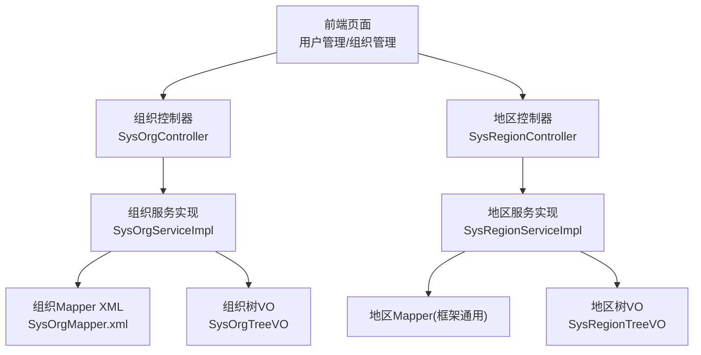
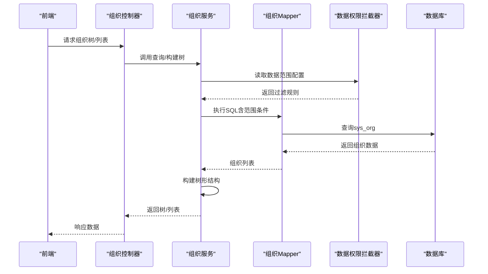
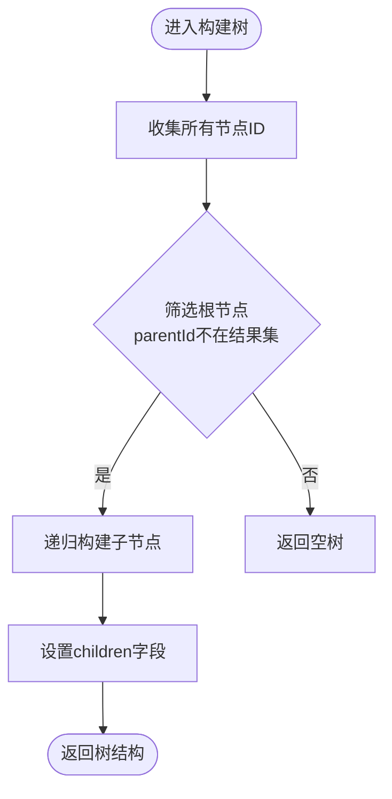
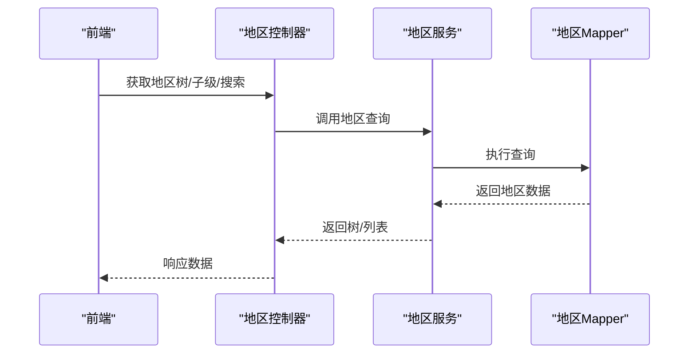
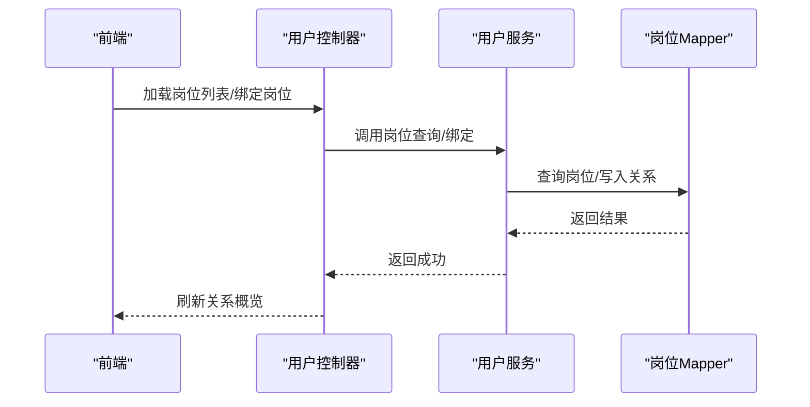
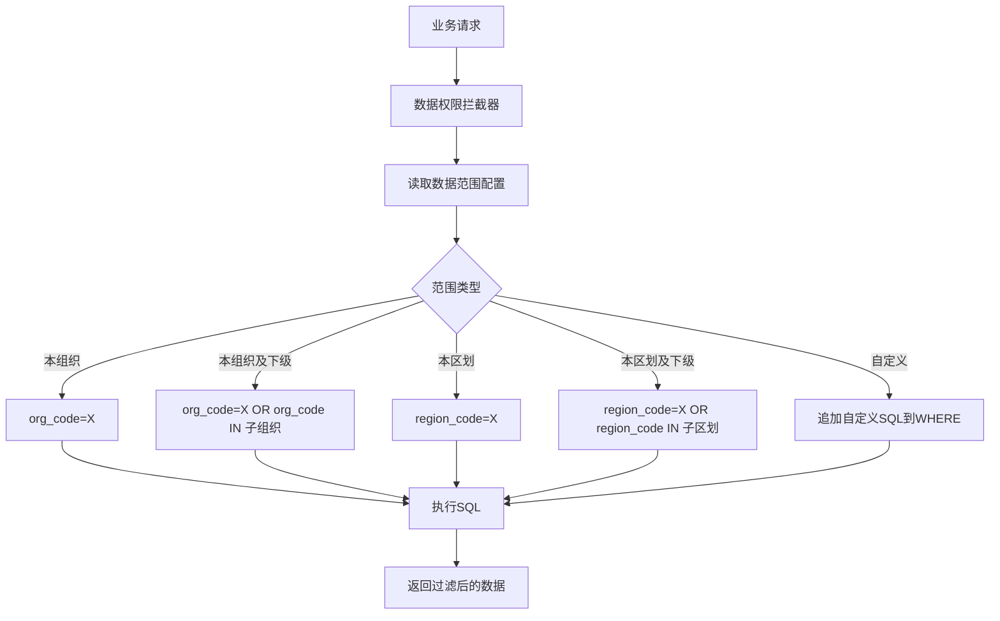
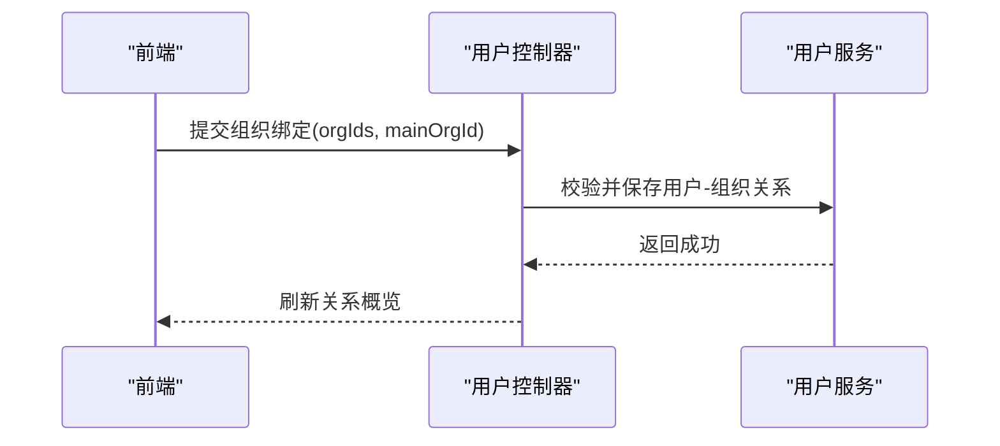
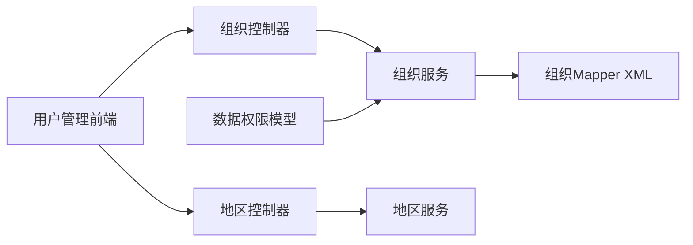

# 部门组织管理

<cite>
**本文引用的文件**
- [SysOrgController.java](file://forge-server/forge-framework/forge-plugin-parent/forge-plugin-system/src/main/java/com/mdframe/forge/plugin/system/controller/SysOrgController.java)
- [SysOrgServiceImpl.java](file://forge-server/forge-framework/forge-plugin-parent/forge-plugin-system/src/main/java/com/mdframe/forge/plugin/system/service/impl/SysOrgServiceImpl.java)
- [SysOrgMapper.xml](file://forge-server/forge-framework/forge-plugin-parent/forge-plugin-system/src/main/resources/mapper/SysOrgMapper.xml)
- [SysOrgTreeVO.java](file://forge-server/forge-framework/forge-plugin-parent/forge-plugin-system/src/main/java/com/mdframe/forge/plugin/system/vo/SysOrgTreeVO.java)
- [SysOrg.java](file://forge-server/forge-framework/forge-plugin-parent/forge-plugin-system/src/main/java/com/mdframe/forge/plugin/system/entity/SysOrg.java)
- [SysRegionController.java](file://forge-server/forge-framework/forge-plugin-parent/forge-plugin-system/src/main/java/com/mdframe/forge/plugin/system/controller/SysRegionController.java)
- [SysRegionServiceImpl.java](file://forge-server/forge-framework/forge-plugin-parent/forge-plugin-system/src/main/java/com/mdframe/forge/plugin/system/service/impl/SysRegionServiceImpl.java)
- [SysRegion.java](file://forge-server/forge-framework/forge-plugin-parent/forge-plugin-system/src/main/java/com/mdframe/forge/plugin/system/entity/SysRegion.java)
- [SysRegionTreeVO.java](file://forge-server/forge-framework/forge-plugin-parent/forge-plugin-system/src/main/java/com/mdframe/forge/plugin/system/vo/SysRegionTreeVO.java)
- [DataScopeOrgInfo.java](file://forge-server/forge-framework/forge-starter-parent/forge-starter-datascope/src/main/java/com/mdframe/forge/starter/datascope/model/DataScopeOrgInfo.java)
- [architecture.md](file://docs/architecture.md)
- [region-binding-design.md](file://docs/superpowers/specs/2025-04-28-region-binding-design.md)
- [user.vue](file://forge-admin-ui/src/views/system/user.vue)
</cite>

## 目录
1. [简介](#简介)
2. [项目结构](#项目结构)
3. [核心组件](#核心组件)
4. [架构总览](#架构总览)
5. [详细组件分析](#详细组件分析)
6. [依赖关系分析](#依赖关系分析)
7. [性能考量](#性能考量)
8. [故障排查指南](#故障排查指南)
9. [结论](#结论)
10. [附录](#附录)

## 简介
本章节面向Forge Admin的“部门组织管理”能力，围绕组织架构树、部门层级关系、岗位与部门的关联、地区（行政区划）管理等核心功能进行系统化说明。文档同时覆盖：
- 部门的增删改查与树形展示
- 岗位与部门的关联关系
- 地区数据的维护与选择器
- 基于部门的数据权限控制与用户归属关系
- 多部门协作、区域化管理等实际应用场景
- 组织数据导入导出与批量操作建议
- 设计最佳实践与常见问题解决方案

## 项目结构
后端以插件化系统模块为核心，提供组织、地区、用户、岗位等基础能力；前端在系统管理页面中集成组织树、用户关系维护、岗位绑定等交互。关键路径包括：
- 控制器层：组织、地区、用户等API入口
- 服务层：组织树构建、地区CRUD、用户组织/岗位绑定
- 数据访问层：MyBatis Mapper与XML映射
- 视图对象：用于树形展示与字典翻译
- 前端页面：用户管理中的组织树、高级关系维护（组织、岗位、租户）

**图表来源**
- [SysOrgController.java:1-200](file://forge-server/forge-framework/forge-plugin-parent/forge-plugin-system/src/main/java/com/mdframe/forge/plugin/system/controller/SysOrgController.java#L1-L200)
- [SysOrgServiceImpl.java:186-220](file://forge-server/forge-framework/forge-plugin-parent/forge-plugin-system/src/main/java/com/mdframe/forge/plugin/system/service/impl/SysOrgServiceImpl.java#L186-L220)
- [SysOrgMapper.xml:29-118](file://forge-server/forge-framework/forge-plugin-parent/forge-plugin-system/src/main/resources/mapper/SysOrgMapper.xml#L29-L118)
- [SysRegionController.java:1-200](file://forge-server/forge-framework/forge-plugin-parent/forge-plugin-system/src/main/java/com/mdframe/forge/plugin/system/controller/SysRegionController.java#L1-L200)
- [SysRegionServiceImpl.java:1-200](file://forge-server/forge-framework/forge-plugin-parent/forge-plugin-system/src/main/java/com/mdframe/forge/plugin/system/service/impl/SysRegionServiceImpl.java#L1-L200)

**章节来源**
- [SysOrgController.java:1-200](file://forge-server/forge-framework/forge-plugin-parent/forge-plugin-system/src/main/java/com/mdframe/forge/plugin/system/controller/SysOrgController.java#L1-L200)
- [SysOrgServiceImpl.java:186-220](file://forge-server/forge-framework/forge-plugin-parent/forge-plugin-system/src/main/java/com/mdframe/forge/plugin/system/service/impl/SysOrgServiceImpl.java#L186-L220)
- [SysOrgMapper.xml:29-118](file://forge-server/forge-framework/forge-plugin-parent/forge-plugin-system/src/main/resources/mapper/SysOrgMapper.xml#L29-L118)
- [SysRegionController.java:1-200](file://forge-server/forge-framework/forge-plugin-parent/forge-plugin-system/src/main/java/com/mdframe/forge/plugin/system/controller/SysRegionController.java#L1-L200)
- [SysRegionServiceImpl.java:1-200](file://forge-server/forge-framework/forge-plugin-parent/forge-plugin-system/src/main/java/com/mdframe/forge/plugin/system/service/impl/SysRegionServiceImpl.java#L1-L200)

## 核心组件
- 组织实体与树形VO：组织实体包含负责人、电话、地址、地区编码、删除标志等字段；树形VO扩展了字典翻译、子节点、路径、层级ID等展示字段。
- 组织服务：提供分页查询、列表查询、树构建等能力；树构建采用“结果集内根节点识别”策略，即使数据权限过滤掉顶级组织，下级仍可正确构建树。
- 地区服务：提供地区树的获取、子级加载、搜索等能力，支持完整缓存方案以提升登录与展示性能。
- 数据权限模型：通过组织快照（orgId与ancestors）参与数据范围过滤，结合配置实现按组织或地区的数据隔离。
- 前端用户关系维护：在用户管理中提供组织树选择、主组织设置、多组织绑定、岗位绑定等高级关系维护能力。

**章节来源**
- [SysOrg.java:62-103](file://forge-server/forge-framework/forge-plugin-parent/forge-plugin-system/src/main/java/com/mdframe/forge/plugin/system/entity/SysOrg.java#L62-L103)
- [SysOrgTreeVO.java:1-66](file://forge-server/forge-framework/forge-plugin-parent/forge-plugin-system/src/main/java/com/mdframe/forge/plugin/system/vo/SysOrgTreeVO.java#L1-L66)
- [SysOrgServiceImpl.java:186-220](file://forge-server/forge-framework/forge-plugin-parent/forge-plugin-system/src/main/java/com/mdframe/forge/plugin/system/service/impl/SysOrgServiceImpl.java#L186-L220)
- [SysRegionController.java:1-200](file://forge-server/forge-framework/forge-plugin-parent/forge-plugin-system/src/main/java/com/mdframe/forge/plugin/system/controller/SysRegionController.java#L1-L200)
- [SysRegionServiceImpl.java:1-200](file://forge-server/forge-framework/forge-plugin-parent/forge-plugin-system/src/main/java/com/mdframe/forge/plugin/system/service/impl/SysRegionServiceImpl.java#L1-L200)
- [DataScopeOrgInfo.java:1-14](file://forge-server/forge-framework/forge-starter-parent/forge-starter-datascope/src/main/java/com/mdframe/forge/starter/datascope/model/DataScopeOrgInfo.java#L1-L14)
- [user.vue:812-858](file://forge-admin-ui/src/views/system/user.vue#L812-L858)

## 架构总览
组织与地区作为基础维度，贯穿用户、角色、岗位与业务数据。数据权限拦截器根据当前用户的组织/地区上下文，动态追加SQL条件，实现细粒度数据隔离。

**图表来源**
- [SysOrgController.java:1-200](file://forge-server/forge-framework/forge-plugin-parent/forge-plugin-system/src/main/java/com/mdframe/forge/plugin/system/controller/SysOrgController.java#L1-L200)
- [SysOrgServiceImpl.java:186-220](file://forge-server/forge-framework/forge-plugin-parent/forge-plugin-system/src/main/java/com/mdframe/forge/plugin/system/service/impl/SysOrgServiceImpl.java#L186-L220)
- [SysOrgMapper.xml:29-118](file://forge-server/forge-framework/forge-plugin-parent/forge-plugin-system/src/main/resources/mapper/SysOrgMapper.xml#L29-L118)
- [architecture.md:435-468](file://docs/architecture.md#L435-L468)

## 详细组件分析

### 组织管理与树形结构
- 树构建策略：从查询结果集中识别根节点（parentId不在结果集中的节点），递归组装children，确保在数据权限过滤后仍能正确呈现子树。
- 查询能力：支持分页与列表查询，使用统一列集合与条件片段，便于复用与扩展。
- 树形VO：包含组织类型、状态、负责人、地区编码、路径、层级ID、是否有子节点等，配合字典翻译提升可读性。

**图表来源**
- [SysOrgServiceImpl.java:186-220](file://forge-server/forge-framework/forge-plugin-parent/forge-plugin-system/src/main/java/com/mdframe/forge/plugin/system/service/impl/SysOrgServiceImpl.java#L186-L220)

**章节来源**
- [SysOrgServiceImpl.java:186-220](file://forge-server/forge-framework/forge-plugin-parent/forge-plugin-system/src/main/java/com/mdframe/forge/plugin/system/service/impl/SysOrgServiceImpl.java#L186-L220)
- [SysOrgMapper.xml:92-118](file://forge-server/forge-framework/forge-plugin-parent/forge-plugin-system/src/main/resources/mapper/SysOrgMapper.xml#L92-L118)
- [SysOrgTreeVO.java:1-66](file://forge-server/forge-framework/forge-plugin-parent/forge-plugin-system/src/main/java/com/mdframe/forge/plugin/system/vo/SysOrgTreeVO.java#L1-L66)

### 地区管理与选择器
- 地区接口：提供树形结构、子级列表、搜索、详情等能力，满足多级联动选择需求。
- 同步机制：当用户组织变更时，可同步更新用户的地区信息；登录Session中包含完整的地区信息，便于快速展示与权限判断。
- 前端组件：使用树形组件展示地区，支持搜索与懒加载，选择后返回完整信息。

**图表来源**
- [SysRegionController.java:1-200](file://forge-server/forge-framework/forge-plugin-parent/forge-plugin-system/src/main/java/com/mdframe/forge/plugin/system/controller/SysRegionController.java#L1-L200)
- [SysRegionServiceImpl.java:1-200](file://forge-server/forge-framework/forge-plugin-parent/forge-plugin-system/src/main/java/com/mdframe/forge/plugin/system/service/impl/SysRegionServiceImpl.java#L1-L200)

**章节来源**
- [region-binding-design.md:1-193](file://docs/superpowers/specs/2025-04-28-region-binding-design.md#L1-L193)
- [SysRegionController.java:1-200](file://forge-server/forge-framework/forge-plugin-parent/forge-plugin-system/src/main/java/com/mdframe/forge/plugin/system/controller/SysRegionController.java#L1-L200)
- [SysRegionServiceImpl.java:1-200](file://forge-server/forge-framework/forge-plugin-parent/forge-plugin-system/src/main/java/com/mdframe/forge/plugin/system/service/impl/SysRegionServiceImpl.java#L1-L200)
- [SysRegion.java:1-200](file://forge-server/forge-framework/forge-plugin-parent/forge-plugin-system/src/main/java/com/mdframe/forge/plugin/system/entity/SysRegion.java#L1-L200)
- [SysRegionTreeVO.java:1-200](file://forge-server/forge-framework/forge-plugin-parent/forge-plugin-system/src/main/java/com/mdframe/forge/plugin/system/vo/SysRegionTreeVO.java#L1-L200)

### 岗位与部门的关联关系
- 用户可在高级关系维护中绑定多个岗位，并指定主汇报岗位；岗位列表可通过统一接口加载。
- 岗位与组织的关联通常通过用户-岗位-组织三元关系体现，支持多组织、多岗位场景。
- 前端提供岗位选择、多选、计数与主岗位标识，便于复杂授权与维护。

**图表来源**
- [user.vue:506-547](file://forge-admin-ui/src/views/system/user.vue#L506-L547)
- [user.vue:2629-2647](file://forge-admin-ui/src/views/system/user.vue#L2629-L2647)

**章节来源**
- [user.vue:506-547](file://forge-admin-ui/src/views/system/user.vue#L506-L547)
- [user.vue:2629-2647](file://forge-admin-ui/src/views/system/user.vue#L2629-L2647)

### 数据权限与组织归属
- 数据权限拦截器根据当前用户的组织/地区上下文，读取配置并生成SQL过滤条件，实现“本组织”“本组织及下级”“本区划”“本区划及下级”等范围控制。
- 组织快照（orgId与ancestors）作为关键输入，支撑祖先链匹配与范围计算。
- 前端登录后获取用户信息，包含组织与地区上下文，供后续请求携带。

**图表来源**
- [architecture.md:435-468](file://docs/architecture.md#L435-L468)
- [DataScopeOrgInfo.java:1-14](file://forge-server/forge-framework/forge-starter-parent/forge-starter-datascope/src/main/java/com/mdframe/forge/starter/datascope/model/DataScopeOrgInfo.java#L1-L14)

**章节来源**
- [architecture.md:435-468](file://docs/architecture.md#L435-L468)
- [DataScopeOrgInfo.java:1-14](file://forge-server/forge-framework/forge-starter-parent/forge-starter-datascope/src/main/java/com/mdframe/forge/starter/datascope/model/DataScopeOrgInfo.java#L1-L14)

### 用户与组织的归属关系（高级关系维护）
- 用户可绑定多个组织，并指定主组织；支持查看组织关系、按组织授权、岗位关系等高级维护。
- 提交组织绑定时需校验至少选择一个组织且主组织必须包含在选中集合中。
- 前端提供组织树展开/折叠、全选、计数等功能，提升操作效率。

**图表来源**
- [user.vue:2593-2627](file://forge-admin-ui/src/views/system/user.vue#L2593-L2627)

**章节来源**
- [user.vue:238-264](file://forge-admin-ui/src/views/system/user.vue#L238-L264)
- [user.vue:420-451](file://forge-admin-ui/src/views/system/user.vue#L420-L451)
- [user.vue:812-858](file://forge-admin-ui/src/views/system/user.vue#L812-L858)
- [user.vue:2593-2627](file://forge-admin-ui/src/views/system/user.vue#L2593-L2627)

## 依赖关系分析
- 组织模块依赖Mapper XML进行分页与列表查询，并通过树构建逻辑将扁平结果转换为树形结构。
- 地区模块提供独立的树形与子级查询能力，服务于组织与用户管理的地区选择。
- 数据权限模块通过组织快照参与SQL注入，实现细粒度数据隔离。
- 前端用户管理页面依赖组织树与岗位列表接口，完成复杂关系维护。

**图表来源**
- [SysOrgController.java:1-200](file://forge-server/forge-framework/forge-plugin-parent/forge-plugin-system/src/main/java/com/mdframe/forge/plugin/system/controller/SysOrgController.java#L1-L200)
- [SysOrgServiceImpl.java:186-220](file://forge-server/forge-framework/forge-plugin-parent/forge-plugin-system/src/main/java/com/mdframe/forge/plugin/system/service/impl/SysOrgServiceImpl.java#L186-L220)
- [SysOrgMapper.xml:29-118](file://forge-server/forge-framework/forge-plugin-parent/forge-plugin-system/src/main/resources/mapper/SysOrgMapper.xml#L29-L118)
- [SysRegionController.java:1-200](file://forge-server/forge-framework/forge-plugin-parent/forge-plugin-system/src/main/java/com/mdframe/forge/plugin/system/controller/SysRegionController.java#L1-L200)
- [SysRegionServiceImpl.java:1-200](file://forge-server/forge-framework/forge-plugin-parent/forge-plugin-system/src/main/java/com/mdframe/forge/plugin/system/service/impl/SysRegionServiceImpl.java#L1-L200)
- [DataScopeOrgInfo.java:1-14](file://forge-server/forge-framework/forge-starter-parent/forge-starter-datascope/src/main/java/com/mdframe/forge/starter/datascope/model/DataScopeOrgInfo.java#L1-L14)

**章节来源**
- [SysOrgController.java:1-200](file://forge-server/forge-framework/forge-plugin-parent/forge-plugin-system/src/main/java/com/mdframe/forge/plugin/system/controller/SysOrgController.java#L1-L200)
- [SysOrgServiceImpl.java:186-220](file://forge-server/forge-framework/forge-plugin-parent/forge-plugin-system/src/main/java/com/mdframe/forge/plugin/system/service/impl/SysOrgServiceImpl.java#L186-L220)
- [SysOrgMapper.xml:29-118](file://forge-server/forge-framework/forge-plugin-parent/forge-plugin-system/src/main/resources/mapper/SysOrgMapper.xml#L29-L118)
- [SysRegionController.java:1-200](file://forge-server/forge-framework/forge-plugin-parent/forge-plugin-system/src/main/java/com/mdframe/forge/plugin/system/controller/SysRegionController.java#L1-L200)
- [SysRegionServiceImpl.java:1-200](file://forge-server/forge-framework/forge-plugin-parent/forge-plugin-system/src/main/java/com/mdframe/forge/plugin/system/service/impl/SysRegionServiceImpl.java#L1-L200)
- [DataScopeOrgInfo.java:1-14](file://forge-server/forge-framework/forge-starter-parent/forge-starter-datascope/src/main/java/com/mdframe/forge/starter/datascope/model/DataScopeOrgInfo.java#L1-L14)

## 性能考量
- 树构建复杂度：采用结果集内根节点识别与递归构建，时间复杂度近似O(n)，适合中等规模组织树；若树深度较大，可考虑预计算path或level字段以减少递归开销。
- 地区数据缓存：采用完整缓存方案，登录时一次性加载至Session，减少重复查询；建议在地区数据量大时增加ancestors字段预存储，避免递归构建祖级编码。
- 数据权限SQL注入：合理配置数据范围类型，避免过度复杂的IN子句；对高频查询可增加索引（如org_code、region_code）。
- 前端交互优化：组织树支持展开/折叠与懒加载，减少首屏渲染压力；岗位列表分页加载，降低网络负载。

[本节为通用性能建议，不直接分析具体文件]

## 故障排查指南
- 组织树为空或根节点缺失：检查数据权限是否过滤掉了顶级组织；确认树构建逻辑是否正确识别根节点。
- 地区选择器无数据：确认地区接口是否正常返回；检查前端是否启用懒加载与搜索过滤。
- 用户组织绑定失败：校验是否选择了至少一个组织且主组织包含在选中集合中；检查后端绑定接口返回值与错误提示。
- 数据权限异常：核对当前用户的组织快照与数据范围配置；确认SQL条件是否正确注入。

**章节来源**
- [SysOrgServiceImpl.java:186-220](file://forge-server/forge-framework/forge-plugin-parent/forge-plugin-system/src/main/java/com/mdframe/forge/plugin/system/service/impl/SysOrgServiceImpl.java#L186-L220)
- [region-binding-design.md:138-193](file://docs/superpowers/specs/2025-04-28-region-binding-design.md#L138-L193)
- [user.vue:2593-2627](file://forge-admin-ui/src/views/system/user.vue#L2593-L2627)
- [architecture.md:435-468](file://docs/architecture.md#L435-L468)

## 结论
Forge Admin的组织管理以“组织+地区”双维度为基础，结合数据权限拦截器实现细粒度数据隔离。通过树形构建、地区缓存、前端高级关系维护等能力，支撑多部门协作与区域化管理的实际场景。建议在生产环境中关注树深度、地区数据量与数据权限配置，持续优化性能与一致性。

[本节为总结性内容，不直接分析具体文件]

## 附录
- 常用接口参考：
  - 组织：分页查询、列表查询、树构建
  - 地区：树形结构、子级列表、搜索、详情
  - 用户：组织绑定、岗位绑定、租户关系（管理员可见）
- 最佳实践：
  - 组织命名规范：清晰表达层级与职责，避免过长名称
  - 地区编码规范：遵循国家/行业标准编码，保持唯一性与稳定性
  - 数据权限策略：优先使用“本组织及下级”“本区划及下级”，减少自定义SQL复杂度
  - 导入导出：建议使用标准模板，校验必填字段与编码合法性，提供批量错误报告

[本节为补充信息，不直接分析具体文件]