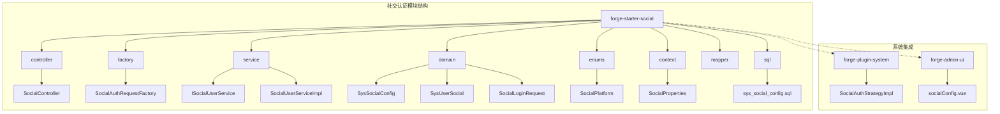
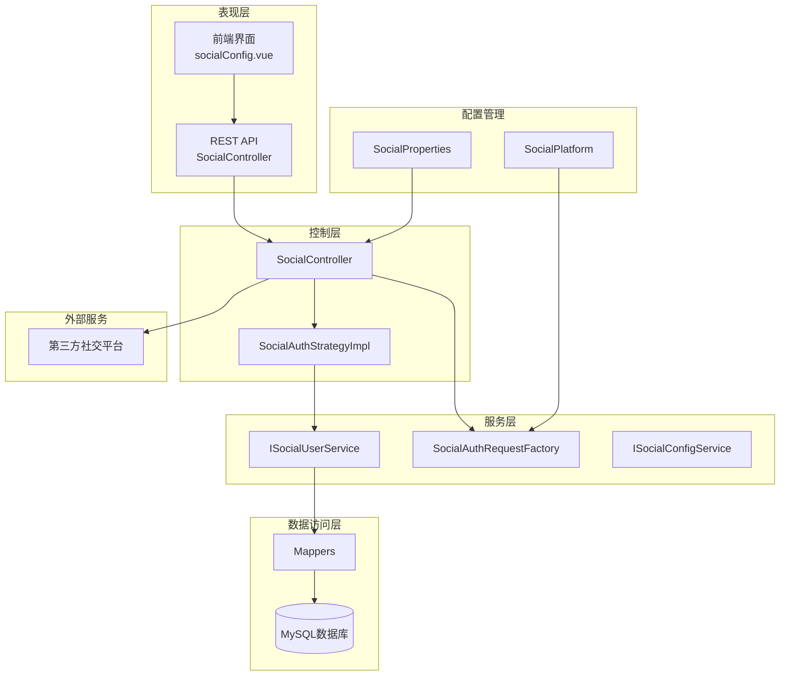
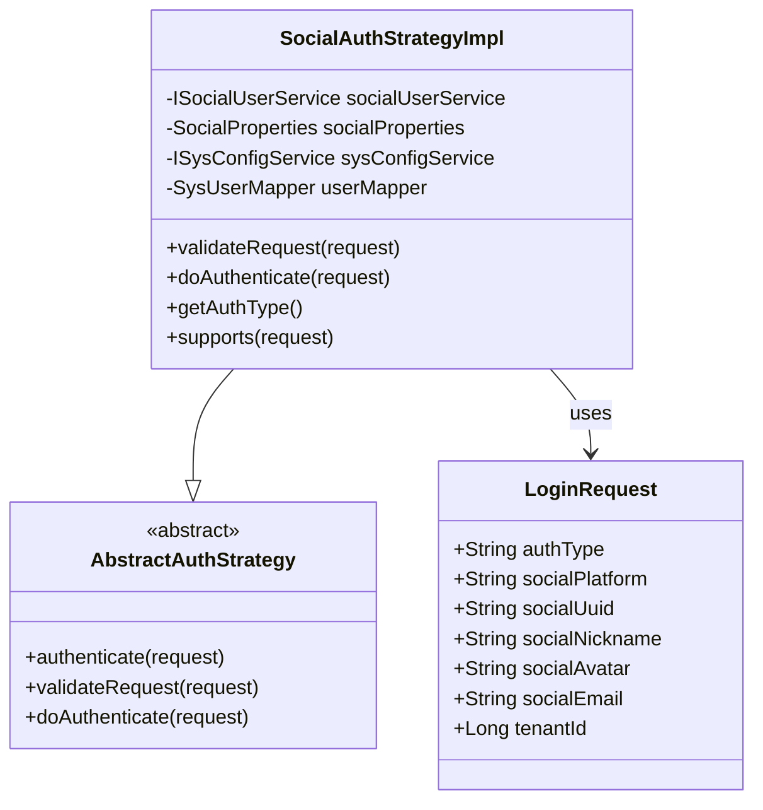
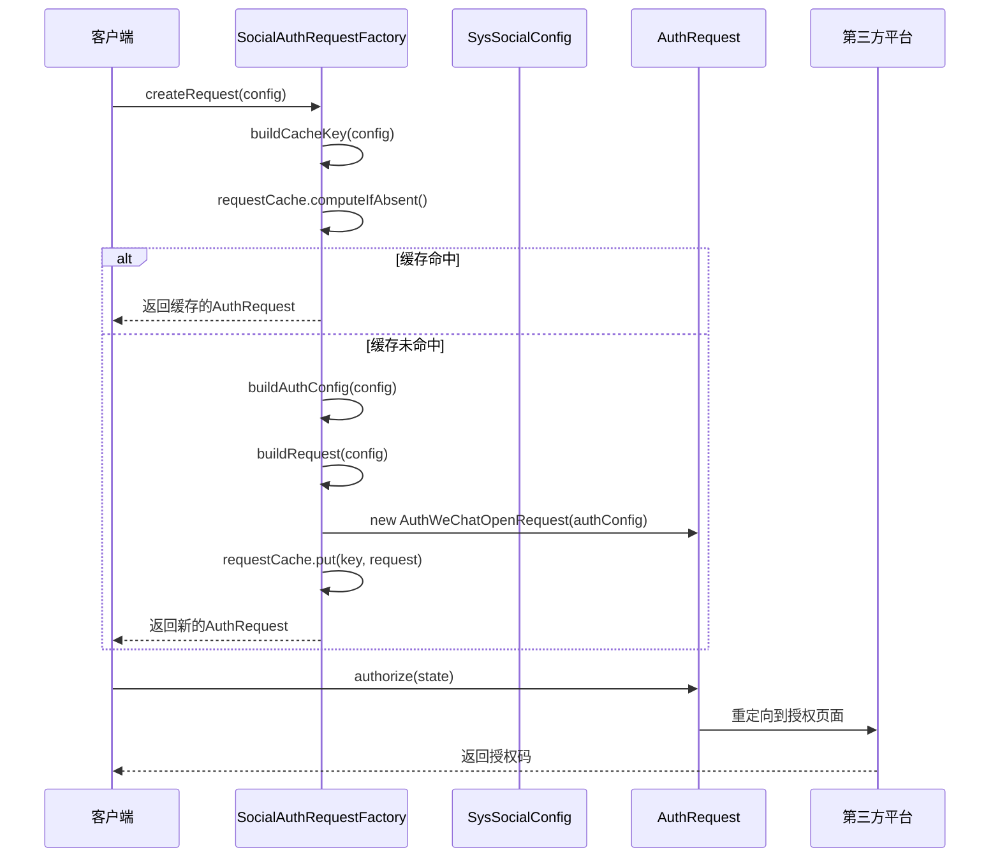
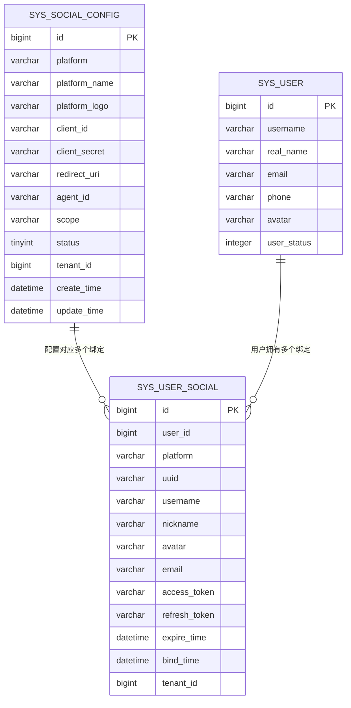
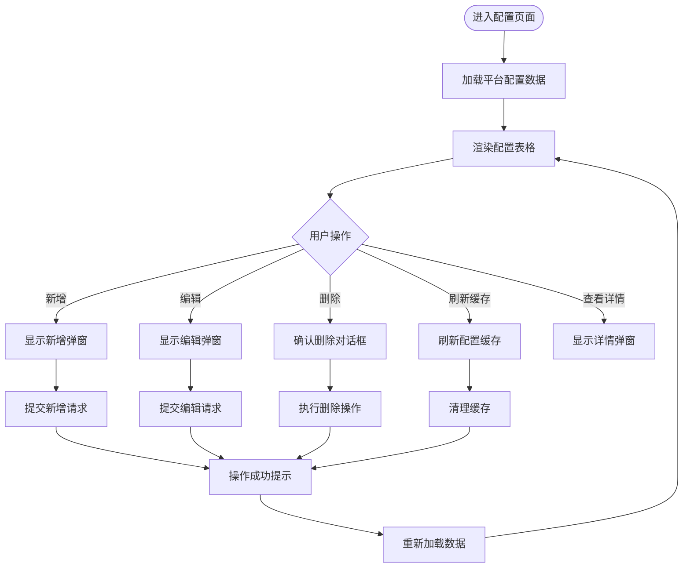
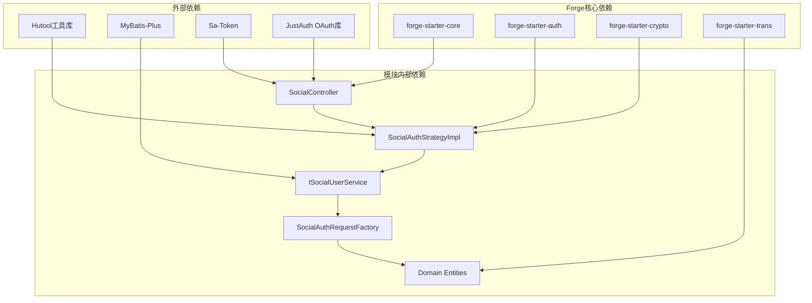

# 社交认证模块

<cite>
**本文档引用的文件**
- [SocialAuthStrategyImpl.java](file://forge/forge-framework/forge-plugin-parent/forge-plugin-system/src/main/java/com/mdframe/forge/plugin/system/strategy/SocialAuthStrategyImpl.java)
- [SocialAuthRequestFactory.java](file://forge/forge-framework/forge-starter-parent/forge-starter-social/src/main/java/com/mdframe/forge/starter/social/factory/SocialAuthRequestFactory.java)
- [SocialController.java](file://forge/forge-framework/forge-starter-parent/forge-starter-social/src/main/java/com/mdframe/forge/starter/social/controller/SocialController.java)
- [SysSocialConfig.java](file://forge/forge-framework/forge-starter-parent/forge-starter-social/src/main/java/com/mdframe/forge/starter/social/domain/entity/SysSocialConfig.java)
- [ISocialUserService.java](file://forge/forge-framework/forge-starter-parent/forge-starter-social/src/main/java/com/mdframe/forge/starter/social/service/ISocialUserService.java)
- [SocialUserServiceImpl.java](file://forge/forge-framework/forge-starter-parent/forge-starter-social/src/main/java/com/mdframe/forge/starter/social/service/impl/SocialUserServiceImpl.java)
- [SocialProperties.java](file://forge/forge-framework/forge-starter-parent/forge-starter-social/src/main/java/com/mdframe/forge/starter/social/context/SocialProperties.java)
- [SocialPlatform.java](file://forge/forge-framework/forge-starter-parent/forge-starter-social/src/main/java/com/mdframe/forge/starter/social/enums/SocialPlatform.java)
- [SocialLoginRequest.java](file://forge/forge-framework/forge-starter-parent/forge-starter-social/src/main/java/com/mdframe/forge/starter/social/domain/dto/SocialLoginRequest.java)
- [sys_social_config.sql](file://forge/forge-framework/forge-starter-parent/forge-starter-social/sql/sys_social_config.sql)
- [socialConfig.vue](file://forge-admin-ui/src/views/system/socialConfig.vue)
</cite>

## 目录
1. [简介](#简介)
2. [项目结构](#项目结构)
3. [核心组件](#核心组件)
4. [架构概览](#架构概览)
5. [详细组件分析](#详细组件分析)
6. [依赖关系分析](#依赖关系分析)
7. [性能考虑](#性能考虑)
8. [故障排除指南](#故障排除指南)
9. [结论](#结论)

## 简介

社交认证模块是Forge框架中一个重要的身份认证扩展功能，它提供了对多种第三方社交平台的统一认证支持。该模块基于流行的OAuth2.0协议，支持微信、钉钉、GitHub、Gitee、QQ、微博、支付宝、百度、谷歌、Facebook、Twitter、飞书等多个主流社交平台。

模块的核心目标是简化多平台社交登录的集成过程，提供统一的认证流程管理和用户绑定机制，同时保持良好的可扩展性和安全性。

## 项目结构

社交认证模块在Forge项目中的组织结构如下：

**图表来源**
- [SocialAuthStrategyImpl.java:1-165](file://forge/forge-framework/forge-plugin-parent/forge-plugin-system/src/main/java/com/mdframe/forge/plugin/system/strategy/SocialAuthStrategyImpl.java#L1-L165)
- [SocialAuthRequestFactory.java:1-123](file://forge/forge-framework/forge-starter-parent/forge-starter-social/src/main/java/com/mdframe/forge/starter/social/factory/SocialAuthRequestFactory.java#L1-L123)

**章节来源**
- [SocialAuthStrategyImpl.java:1-165](file://forge/forge-framework/forge-plugin-parent/forge-plugin-system/src/main/java/com/mdframe/forge/plugin/system/strategy/SocialAuthStrategyImpl.java#L1-L165)
- [SocialAuthRequestFactory.java:1-123](file://forge/forge-framework/forge-starter-parent/forge-starter-social/src/main/java/com/mdframe/forge/starter/social/factory/SocialAuthRequestFactory.java#L1-L123)

## 核心组件

社交认证模块包含以下核心组件：

### 控制器层
- **SocialController**: 提供RESTful API接口，处理社交登录的授权URL获取、回调处理等功能
- **SocialConfigController**: 管理社交平台配置的CRUD操作

### 工厂层
- **SocialAuthRequestFactory**: 负责根据配置动态创建不同平台的认证请求实例，支持缓存机制

### 服务层
- **ISocialUserService**: 定义社交用户绑定的业务接口
- **SocialUserServiceImpl**: 实现用户绑定、解绑、信息更新等核心业务逻辑

### 数据模型层
- **SysSocialConfig**: 存储社交平台配置信息
- **SysUserSocial**: 管理用户与社交平台的绑定关系
- **SocialLoginRequest**: 封装社交登录请求参数

### 配置管理
- **SocialProperties**: 管理社交认证的全局配置属性
- **SocialPlatform**: 定义支持的社交平台枚举

**章节来源**
- [SocialController.java:1-107](file://forge/forge-framework/forge-starter-parent/forge-starter-social/src/main/java/com/mdframe/forge/starter/social/controller/SocialController.java#L1-L107)
- [ISocialUserService.java:1-43](file://forge/forge-framework/forge-starter-parent/forge-starter-social/src/main/java/com/mdframe/forge/starter/social/service/ISocialUserService.java#L1-L43)
- [SocialUserServiceImpl.java:1-89](file://forge/forge-framework/forge-starter-parent/forge-starter-social/src/main/java/com/mdframe/forge/starter/social/service/impl/SocialUserServiceImpl.java#L1-L89)

## 架构概览

社交认证模块采用分层架构设计，确保了良好的关注点分离和可维护性：

**图表来源**
- [SocialController.java:25-107](file://forge/forge-framework/forge-starter-parent/forge-starter-social/src/main/java/com/mdframe/forge/starter/social/controller/SocialController.java#L25-L107)
- [SocialAuthStrategyImpl.java:24-165](file://forge/forge-framework/forge-plugin-parent/forge-plugin-system/src/main/java/com/mdframe/forge/plugin/system/strategy/SocialAuthStrategyImpl.java#L24-L165)

该架构实现了以下关键特性：

1. **策略模式**: 通过`SocialAuthStrategyImpl`实现不同的认证策略
2. **工厂模式**: `SocialAuthRequestFactory`负责创建平台特定的认证请求
3. **依赖注入**: Spring框架管理组件间的依赖关系
4. **事务管理**: 关键业务操作使用事务保证数据一致性

## 详细组件分析

### 社交认证策略实现

`SocialAuthStrategyImpl`是社交认证的核心实现类，继承自抽象认证策略基类：

**图表来源**
- [SocialAuthStrategyImpl.java:24-165](file://forge/forge-framework/forge-plugin-parent/forge-plugin-system/src/main/java/com/mdframe/forge/plugin/system/strategy/SocialAuthStrategyImpl.java#L24-L165)

该策略实现遵循以下认证流程：

1. **验证请求参数**: 确保社交平台类型和用户唯一标识不为空
2. **检查用户绑定**: 查询是否已有用户绑定该社交账户
3. **处理已绑定用户**: 直接加载用户信息并返回登录结果
4. **处理未绑定用户**: 根据配置决定是否自动注册新用户
5. **创建新用户**: 生成用户名、设置默认密码、保存用户信息
6. **绑定社交账户**: 建立用户与社交平台的关联关系
7. **加载登录用户**: 返回完整的登录用户信息

**章节来源**
- [SocialAuthStrategyImpl.java:44-165](file://forge/forge-framework/forge-plugin-parent/forge-plugin-system/src/main/java/com/mdframe/forge/plugin/system/strategy/SocialAuthStrategyImpl.java#L44-L165)

### 认证请求工厂

`SocialAuthRequestFactory`负责根据平台配置动态创建相应的认证请求实例：

**图表来源**
- [SocialAuthRequestFactory.java:47-99](file://forge/forge-framework/forge-starter-parent/forge-starter-social/src/main/java/com/mdframe/forge/starter/social/factory/SocialAuthRequestFactory.java#L47-L99)

工厂模式的优势包括：
- **延迟初始化**: 只有在需要时才创建认证请求实例
- **缓存机制**: 避免重复创建相同的认证请求对象
- **扩展性**: 易于添加新的社交平台支持

**章节来源**
- [SocialAuthRequestFactory.java:32-123](file://forge/forge-framework/forge-starter-parent/forge-starter-social/src/main/java/com/mdframe/forge/starter/social/factory/SocialAuthRequestFactory.java#L32-L123)

### 数据模型设计

社交认证模块使用两个核心数据表来管理配置和用户绑定关系：

**图表来源**
- [sys_social_config.sql:1-44](file://forge/forge-framework/forge-starter-parent/forge-starter-social/sql/sys_social_config.sql#L1-L44)

**章节来源**
- [sys_social_config.sql:1-44](file://forge/forge-framework/forge-starter-parent/forge-starter-social/sql/sys_social_config.sql#L1-L44)

### 前端配置界面

`socialConfig.vue`提供了完整的社交平台配置管理界面：

**图表来源**
- [socialConfig.vue:1-450](file://forge-admin-ui/src/views/system/socialConfig.vue#L1-L450)

**章节来源**
- [socialConfig.vue:1-450](file://forge-admin-ui/src/views/system/socialConfig.vue#L1-L450)

## 依赖关系分析

社交认证模块的依赖关系体现了清晰的分层架构：

**图表来源**
- [SocialController.java:1-24](file://forge/forge-framework/forge-starter-parent/forge-starter-social/src/main/java/com/mdframe/forge/starter/social/controller/SocialController.java#L1-L24)
- [SocialAuthStrategyImpl.java:1-22](file://forge/forge-framework/forge-plugin-parent/forge-plugin-system/src/main/java/com/mdframe/forge/plugin/system/strategy/SocialAuthStrategyImpl.java#L1-L22)

**章节来源**
- [SocialController.java:1-107](file://forge/forge-framework/forge-starter-parent/forge-starter-social/src/main/java/com/mdframe/forge/starter/social/controller/SocialController.java#L1-L107)
- [SocialAuthStrategyImpl.java:1-165](file://forge/forge-framework/forge-plugin-parent/forge-plugin-system/src/main/java/com/mdframe/forge/plugin/system/strategy/SocialAuthStrategyImpl.java#L1-L165)

## 性能考虑

社交认证模块在设计时充分考虑了性能优化：

### 缓存策略
- **请求实例缓存**: `SocialAuthRequestFactory`使用ConcurrentHashMap缓存认证请求实例
- **配置缓存**: 支持手动刷新和自动失效机制
- **连接池优化**: 合理配置HTTP客户端连接池

### 数据访问优化
- **索引设计**: 在关键查询字段上建立适当索引
- **批量操作**: 支持批量查询和更新操作
- **懒加载**: 延迟加载非必要数据

### 并发处理
- **线程安全**: 所有共享资源使用线程安全的数据结构
- **事务管理**: 关键业务操作使用声明式事务
- **锁机制**: 避免死锁和性能瓶颈

## 故障排除指南

### 常见问题及解决方案

#### 1. 授权失败
**症状**: 用户点击授权按钮后返回错误
**可能原因**:
- 回调地址配置错误
- 应用密钥不正确
- 网络连接问题

**解决步骤**:
1. 检查`redirect_uri`配置是否与平台要求一致
2. 验证`client_id`和`client_secret`的有效性
3. 确认网络可达性和防火墙设置

#### 2. 用户绑定异常
**症状**: 用户登录后无法正常绑定社交账户
**可能原因**:
- 数据库连接异常
- 事务回滚
- 并发冲突

**解决步骤**:
1. 查看数据库连接日志
2. 检查事务配置
3. 分析并发场景下的数据竞争

#### 3. 缓存问题
**症状**: 配置修改后未生效
**解决步骤**:
1. 调用`/system/socialConfig/refreshCache`接口
2. 检查缓存清理逻辑
3. 验证配置加载机制

**章节来源**
- [SocialAuthRequestFactory.java:52-67](file://forge/forge-framework/forge-starter-parent/forge-starter-social/src/main/java/com/mdframe/forge/starter/social/factory/SocialAuthRequestFactory.java#L52-L67)
- [SocialController.java:39-46](file://forge/forge-framework/forge-starter-parent/forge-starter-social/src/main/java/com/mdframe/forge/starter/social/controller/SocialController.java#L39-L46)

## 结论

社交认证模块是Forge框架中一个设计精良的身份认证扩展，具有以下特点：

### 技术优势
- **模块化设计**: 清晰的分层架构和职责分离
- **可扩展性**: 支持多种社交平台，易于添加新平台
- **性能优化**: 缓存机制和事务管理确保高效运行
- **安全性**: 完善的参数验证和错误处理机制

### 业务价值
- **用户体验**: 简化的多平台登录流程
- **开发效率**: 标准化的接口和配置管理
- **维护成本**: 统一的代码结构和文档规范

### 发展建议
1. **监控增强**: 添加详细的性能指标和错误追踪
2. **测试覆盖**: 扩展单元测试和集成测试
3. **文档完善**: 补充更多的使用示例和最佳实践
4. **安全加固**: 实施更严格的安全审计和合规检查

该模块为Forge框架提供了强大的社交认证能力，是构建现代Web应用不可或缺的重要组成部分。