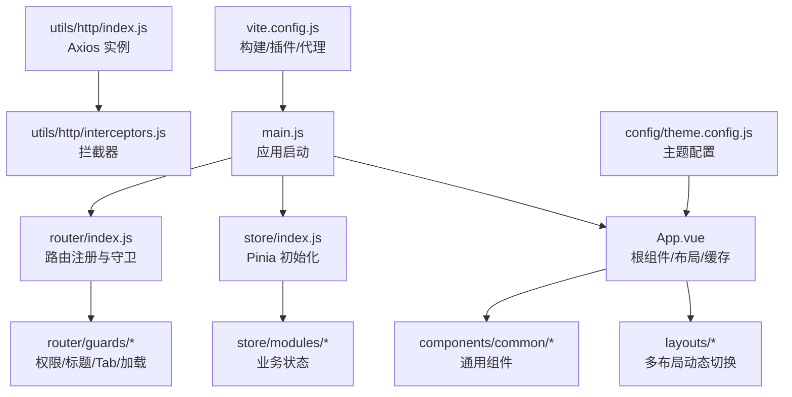
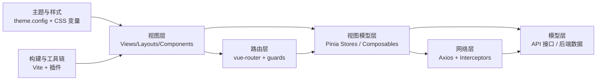
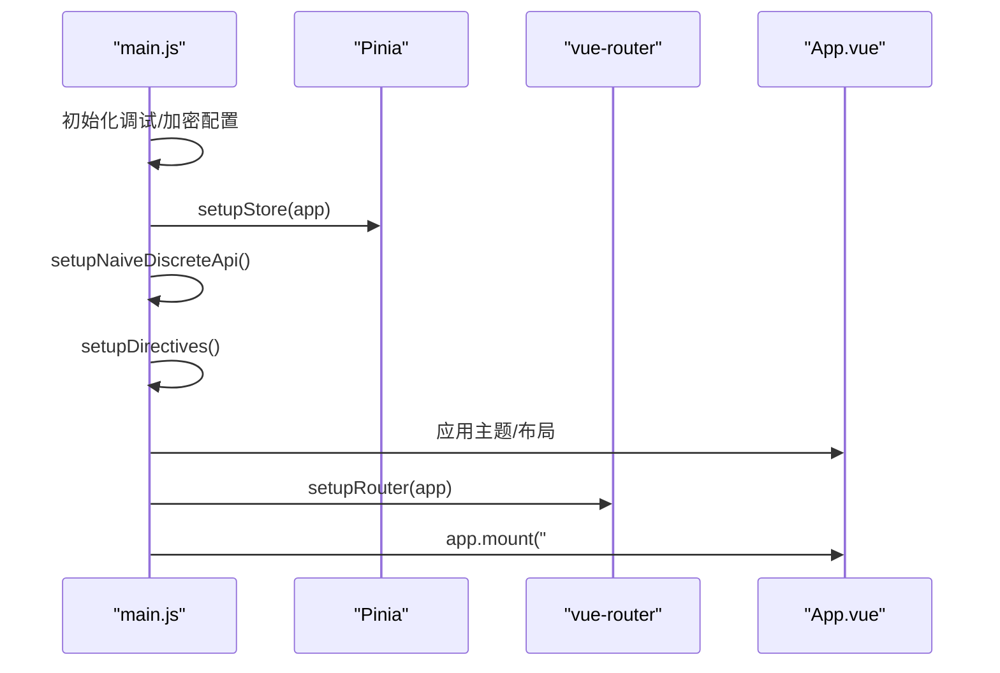
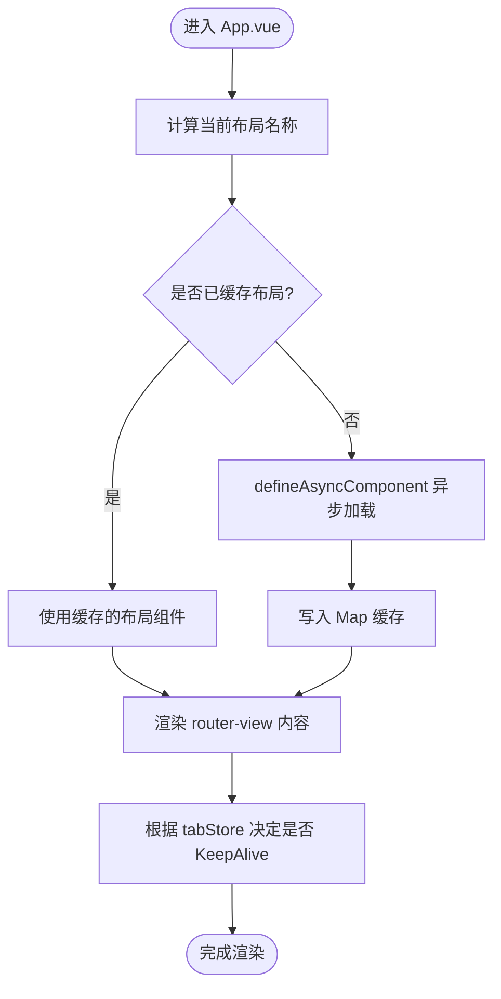
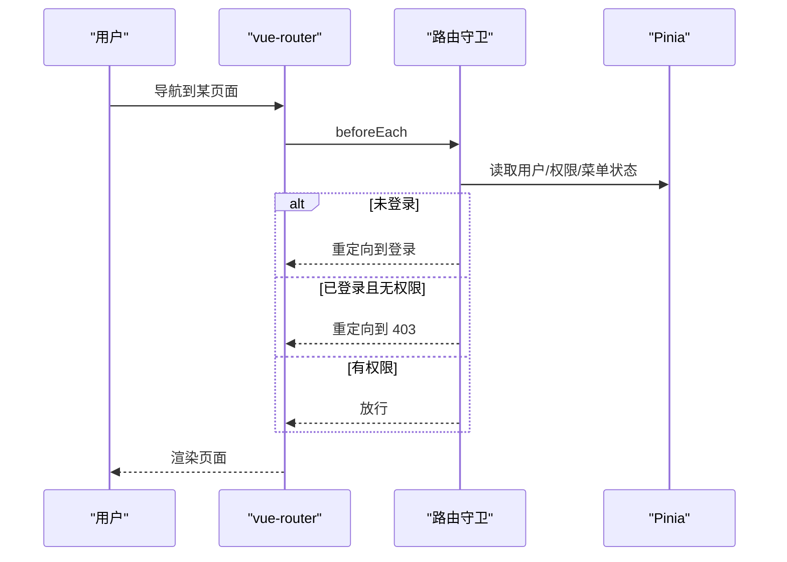
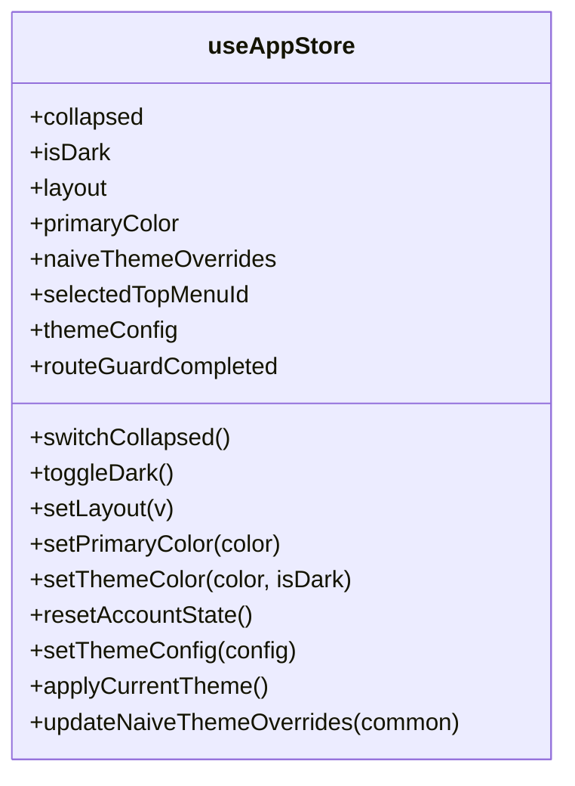
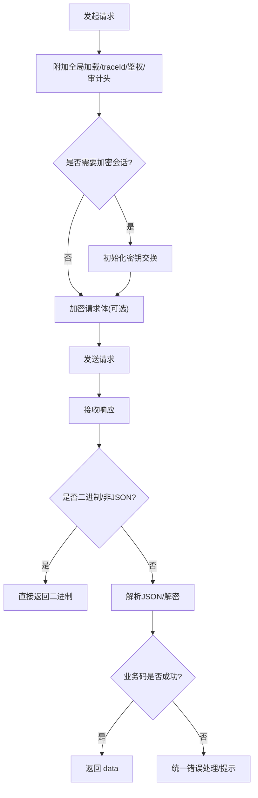
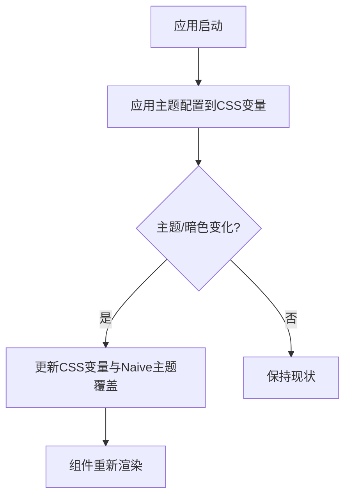
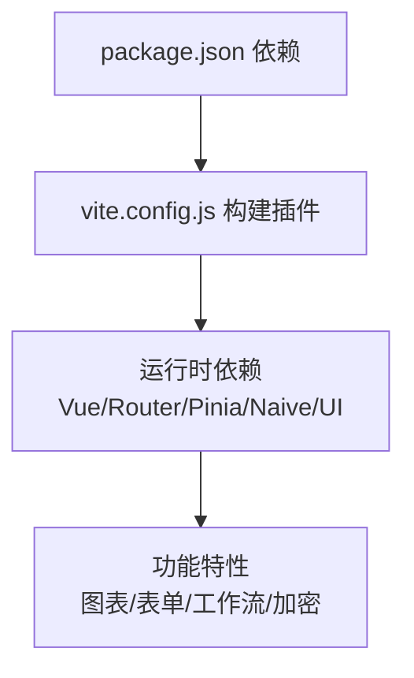

# 前端架构设计

<cite>
**本文引用的文件**
- [package.json](file://forge-admin-ui/package.json)
- [vite.config.js](file://forge-admin-ui/vite.config.js)
- [main.js](file://forge-admin-ui/src/main.js)
- [App.vue](file://forge-admin-ui/src/App.vue)
- [router/index.js](file://forge-admin-ui/src/router/index.js)
- [store/index.js](file://forge-admin-ui/src/store/index.js)
- [store/modules/app.js](file://forge-admin-ui/src/store/modules/app.js)
- [utils/http/index.js](file://forge-admin-ui/src/utils/http/index.js)
- [utils/http/interceptors.js](file://forge-admin-ui/src/utils/http/interceptors.js)
- [config/theme.config.js](file://forge-admin-ui/src/config/theme.config.js)
</cite>

## 目录
1. [简介](#简介)
2. [项目结构](#项目结构)
3. [核心组件](#核心组件)
4. [架构总览](#架构总览)
5. [详细组件分析](#详细组件分析)
6. [依赖关系分析](#依赖关系分析)
7. [性能与构建优化](#性能与构建优化)
8. [故障排查指南](#故障排查指南)
9. [结论](#结论)
10. [附录](#附录)

## 简介
本文件面向 Forge Admin 前端（Vue 3 + TypeScript/JS）的架构设计与实现说明，聚焦 MVVM 模式、组件化开发、状态管理（Pinia）、路由系统、前后端分离与 API 封装、组件通信机制、响应式与主题定制、国际化支持、Vite 构建配置、代码分割与性能优化策略。文档通过架构图表与源码路径引用，帮助读者快速理解并高效扩展。

## 项目结构
- 入口与装配：应用启动流程集中在 main.js，负责初始化调试、加密配置、Store、Naive UI 全局 API、指令、主题、路由守卫与挂载。
- 根组件：App.vue 提供 Naive UI 配置提供者、布局动态切换、KeepAlive 缓存、水印与全局加载等能力。
- 路由：基于 unplugin-vue-router 自动生成路由，结合手动路由定义与守卫，统一处理登录、SSO、权限、标题、Tab 等。
- 状态管理：Pinia + pinia-plugin-persistedstate，按模块拆分（app、auth、permission、tab、tenant、user 等）。
- HTTP 请求：Axios 实例化与拦截器统一封装，涵盖鉴权、加解密、防重放、错误处理、二进制响应、页面审计头注入等。
- 主题与样式：集中主题配置与应用，支持明暗色、主色、菜单区域样式变量注入；使用 UnoCSS 原子化 CSS。
- 构建：Vite + Vue 插件生态，按需自动导入与组件解析，生产构建采用 oxc 压缩与 esbuild CSS 压缩，关闭 sourcemap 与体积上报以降低内存。

**图示来源**
- [main.js:20-50](file://forge-admin-ui/src/main.js#L20-L50)
- [App.vue:1-40](file://forge-admin-ui/src/App.vue#L1-L40)
- [router/index.js:263-286](file://forge-admin-ui/src/router/index.js#L263-L286)
- [store/index.js:4-8](file://forge-admin-ui/src/store/index.js#L4-L8)
- [utils/http/index.js:4-26](file://forge-admin-ui/src/utils/http/index.js#L4-L26)
- [utils/http/interceptors.js:294-444](file://forge-admin-ui/src/utils/http/interceptors.js#L294-L444)
- [config/theme.config.js:145-229](file://forge-admin-ui/src/config/theme.config.js#L145-L229)
- [vite.config.js:14-53](file://forge-admin-ui/vite.config.js#L14-L53)

**章节来源**
- [main.js:20-50](file://forge-admin-ui/src/main.js#L20-L50)
- [App.vue:1-40](file://forge-admin-ui/src/App.vue#L1-L40)
- [router/index.js:263-286](file://forge-admin-ui/src/router/index.js#L263-L286)
- [store/index.js:4-8](file://forge-admin-ui/src/store/index.js#L4-L8)
- [utils/http/index.js:4-26](file://forge-admin-ui/src/utils/http/index.js#L4-L26)
- [utils/http/interceptors.js:294-444](file://forge-admin-ui/src/utils/http/interceptors.js#L294-L444)
- [config/theme.config.js:145-229](file://forge-admin-ui/src/config/theme.config.js#L145-L229)
- [vite.config.js:14-53](file://forge-admin-ui/vite.config.js#L14-L53)

## 核心组件
- 应用启动器（main.js）：顺序执行调试面板、运行时加密配置、创建应用、初始化 Store、Naive 全局 API、指令、主题、企微免登、路由与挂载。
- 根组件（App.vue）：提供 Naive ConfigProvider、消息/对话框容器、动态布局、KeepAlive 缓存、水印层、全局加载遮罩；根据路由 meta 与 store 决定布局与是否显示设置面板。
- 路由（router/index.js）：合并手动路由与自动路由，支持 Hash/History 模式，提供兜底 404；setupRouter 挂载并安装守卫。
- 状态（store/index.js）：创建 Pinia 并启用持久化插件，导出各模块 store。
- HTTP（utils/http）：统一 axios 实例与拦截器，覆盖鉴权、加解密、防重放、错误处理、二进制响应、页面审计头、全局加载控制。
- 主题（config/theme.config.js）：集中主题配置，运行时将主题色、菜单区、头部等映射为 CSS 变量，配合 App.vue 中的 Naive 主题覆盖。

**章节来源**
- [main.js:20-50](file://forge-admin-ui/src/main.js#L20-L50)
- [App.vue:1-40](file://forge-admin-ui/src/App.vue#L1-L40)
- [router/index.js:263-286](file://forge-admin-ui/src/router/index.js#L263-L286)
- [store/index.js:4-8](file://forge-admin-ui/src/store/index.js#L4-L8)
- [utils/http/index.js:4-26](file://forge-admin-ui/src/utils/http/index.js#L4-L26)
- [utils/http/interceptors.js:294-444](file://forge-admin-ui/src/utils/http/interceptors.js#L294-L444)
- [config/theme.config.js:145-229](file://forge-admin-ui/src/config/theme.config.js#L145-L229)

## 架构总览
- MVVM 分层：View（Vue 组件/布局）— ViewModel（Pinia Store + Composables）— Model（API 数据/后端模型）。
- 组件化：通用组件集中于 components/common，业务组件按领域划分；布局通过动态 import 与缓存避免闪烁。
- 路由：文件路由自动生成 + 手动路由补充，配合守卫完成鉴权、权限、标题、Tab 管理。
- 状态：Pinia 模块化，持久化到 sessionStorage，跨组件共享用户、权限、主题、Tab 等状态。
- 网络：Axios 拦截器统一处理认证、加解密、错误提示、二进制下载、页面审计头。
- 构建：Vite 插件链（Vue、JSX、UnoCSS、自动导入、组件解析、路由生成），生产构建使用 oxc/esbuild 压缩，关闭 sourcemap 降低内存。

**图示来源**
- [App.vue:1-40](file://forge-admin-ui/src/App.vue#L1-L40)
- [store/index.js:4-8](file://forge-admin-ui/src/store/index.js#L4-L8)
- [router/index.js:263-286](file://forge-admin-ui/src/router/index.js#L263-L286)
- [utils/http/interceptors.js:294-444](file://forge-admin-ui/src/utils/http/interceptors.js#L294-L444)
- [config/theme.config.js:145-229](file://forge-admin-ui/src/config/theme.config.js#L145-L229)
- [vite.config.js:14-53](file://forge-admin-ui/vite.config.js#L14-L53)

## 详细组件分析

### 应用启动与装配流程
- 启动顺序：调试控制台 → 运行时加密配置 → 创建应用 → 初始化 Store → 初始化 Naive 全局 API → 指令 → 主题 → 企微免登 → 路由 → 挂载。
- 关键职责：确保全局能力在路由与页面渲染前就绪，避免首次渲染时缺失能力导致异常。

**图示来源**
- [main.js:20-50](file://forge-admin-ui/src/main.js#L20-L50)
- [store/index.js:4-8](file://forge-admin-ui/src/store/index.js#L4-L8)
- [router/index.js:283-286](file://forge-admin-ui/src/router/index.js#L283-L286)
- [App.vue:1-40](file://forge-admin-ui/src/App.vue#L1-L40)

**章节来源**
- [main.js:20-50](file://forge-admin-ui/src/main.js#L20-L50)

### 根组件与布局体系
- 主题与语言：通过 Naive ConfigProvider 注入中文与暗色主题，支持主题覆盖。
- 布局动态切换：根据路由 meta 或 store 中的 layout 动态加载 layouts/*/index.vue，并使用 Map 缓存已加载布局，避免重复加载导致的闪烁。
- 页面缓存：使用 KeepAlive 与 tabStore.cacheViews 控制页面缓存，提升体验。
- 水印与加载：全局水印层与全局加载遮罩，保障安全与可感知加载。

**图示来源**
- [App.vue:57-81](file://forge-admin-ui/src/App.vue#L57-L81)
- [App.vue:124-128](file://forge-admin-ui/src/App.vue#L124-L128)

**章节来源**
- [App.vue:1-40](file://forge-admin-ui/src/App.vue#L1-L40)
- [App.vue:57-81](file://forge-admin-ui/src/App.vue#L57-L81)
- [App.vue:124-128](file://forge-admin-ui/src/App.vue#L124-L128)

### 路由系统与守卫
- 路由生成：unplugin-vue-router 扫描 views 目录生成路由，排除特定目录；手动路由补充登录、SSO、404、工作台等。
- 历史模式：根据环境变量选择 Hash 或 History。
- 守卫：集中安装在 setupRouterGuards，负责鉴权、权限、标题、Tab、加载态等。

**图示来源**
- [router/index.js:263-286](file://forge-admin-ui/src/router/index.js#L263-L286)

**章节来源**
- [router/index.js:263-286](file://forge-admin-ui/src/router/index.js#L263-L286)

### 状态管理（Pinia）
- 初始化：createPinia + persistedstate 插件，持久化 key 包含租户信息，存储于 sessionStorage。
- 应用状态（app.js）：维护折叠、暗色、布局、主色、Naive 主题覆盖、顶部菜单选中、主题配置、路由守卫完成标志等；提供主题切换、重置、更新等方法。
- 其他模块：auth、permission、tab、tenant、user 等，分别负责认证、权限、标签页、租户、用户信息。

**图示来源**
- [store/modules/app.js:12-106](file://forge-admin-ui/src/store/modules/app.js#L12-L106)

**章节来源**
- [store/index.js:4-8](file://forge-admin-ui/src/store/index.js#L4-L8)
- [store/modules/app.js:12-106](file://forge-admin-ui/src/store/modules/app.js#L12-L106)

### API 调用封装与拦截器
- 实例化：createAxios 默认 baseURL 来自环境变量，超时时间统一；提供 request、noPrefixRequest、mockRequest 三种实例。
- 请求拦截：注入 traceId、Authorization、页面审计头、防重放参数；显式加密请求需先完成密钥交换；业务选择器请求校验 objectCode。
- 响应拦截：统一解密 Blob JSON、业务码判断、二进制响应直接返回、错误分类与提示、静默鉴权错误处理、重试只读加密请求。

**图示来源**
- [utils/http/index.js:4-26](file://forge-admin-ui/src/utils/http/index.js#L4-L26)
- [utils/http/interceptors.js:524-591](file://forge-admin-ui/src/utils/http/interceptors.js#L524-L591)
- [utils/http/interceptors.js:294-444](file://forge-admin-ui/src/utils/http/interceptors.js#L294-L444)

**章节来源**
- [utils/http/index.js:4-26](file://forge-admin-ui/src/utils/http/index.js#L4-L26)
- [utils/http/interceptors.js:294-444](file://forge-admin-ui/src/utils/http/interceptors.js#L294-L444)
- [utils/http/interceptors.js:524-591](file://forge-admin-ui/src/utils/http/interceptors.js#L524-L591)

### 主题定制与响应式
- 主题配置：集中定义默认主题与明暗模式下的 Header、顶部菜单、侧边菜单样式；运行时将配置写入 CSS 变量，供全局样式与组件库使用。
- 主题切换：App.vue 监听主题变化，调用 store 方法更新主色与 Naive 主题覆盖；响应式字体通过 initResponsiveFont 动态调整字号与组件库字体。
- 样式工程：使用 UnoCSS 原子化 CSS，SCSS 预处理器注入全局变量。

**图示来源**
- [config/theme.config.js:145-229](file://forge-admin-ui/src/config/theme.config.js#L145-L229)
- [App.vue:144-149](file://forge-admin-ui/src/App.vue#L144-L149)

**章节来源**
- [config/theme.config.js:145-229](file://forge-admin-ui/src/config/theme.config.js#L145-L229)
- [App.vue:144-149](file://forge-admin-ui/src/App.vue#L144-L149)

### 组件通信机制
- 父子通信：props/emits 用于组件间数据传递与事件回调。
- 跨层级通信：Pinia Store 作为全局状态中心，组件通过 useXxxStore 访问与修改状态。
- 事件总线：通过 composables 暴露的离散消息（如 useDiscreteMessage）进行轻量级通知。
- 路由级通信：通过路由参数与 query 传递上下文（如 menuKey、objectId 等）。

[本节为概念性说明，不直接分析具体文件]

### 国际化支持
- 语言包：通过 Naive UI 的 zhCN/dateZhCN 提供中文界面。
- 扩展建议：如需多语言文案，可在 i18n 模块中集中管理键值对，并通过 composables 或 store 切换语言。

[本节为概念性说明，不直接分析具体文件]

## 依赖关系分析
- 构建依赖：Vite、Vue、JSX、UnoCSS、自动导入、组件解析、路由生成、DevTools。
- 运行依赖：Vue 3、Vue Router、Pinia、Naive UI、ECharts、BPMN、FormCreate、Axios、Crypto、Dayjs 等。
- 插件与工具：unplugin-vue-router、unplugin-auto-import、unplugin-vue-components、vite-plugin-vue-devtools、rollup-plugin-visualizer（可选）。

**图示来源**
- [package.json:19-105](file://forge-admin-ui/package.json#L19-L105)
- [vite.config.js:21-53](file://forge-admin-ui/vite.config.js#L21-L53)

**章节来源**
- [package.json:19-105](file://forge-admin-ui/package.json#L19-L105)
- [vite.config.js:21-53](file://forge-admin-ui/vite.config.js#L21-L53)

## 性能与构建优化
- 构建优化：
  - 关闭 sourcemap 与 reportCompressedSize，显著降低构建内存占用。
  - 使用 oxc 压缩 JS，esbuild 压缩 CSS，兼顾速度与兼容性。
  - optimizeDeps 预构建常用大依赖，减少首屏二次优化带来的卡顿。
  - base 与 outDir 通过环境变量控制，便于多环境部署。
- 代码分割：
  - 路由与布局采用异步组件与 defineAsyncComponent，结合 Map 缓存避免重复加载。
  - KeepAlive 与 tabStore.cacheViews 控制页面缓存，减少重复渲染。
- 运行时优化：
  - 全局加载与错误提示统一，避免阻塞与抖动。
  - 二进制响应直接返回，不走业务码判断，提升下载性能。
  - 防重放与加密会话按需开启，减少不必要开销。

**章节来源**
- [vite.config.js:160-173](file://forge-admin-ui/vite.config.js#L160-L173)
- [vite.config.js:66-108](file://forge-admin-ui/vite.config.js#L66-L108)
- [App.vue:57-81](file://forge-admin-ui/src/App.vue#L57-L81)
- [utils/http/interceptors.js:338-351](file://forge-admin-ui/src/utils/http/interceptors.js#L338-L351)

## 故障排查指南
- 网络与鉴权：
  - 检查 Authorization 是否正确注入；确认 token 存在且有效。
  - 关注拦截器中的错误分类与提示，必要时查看 detail 字段定位问题。
- 加密与会话：
  - 若出现解密失败或密钥过期，拦截器会尝试重置密钥并仅读重试；若仍失败，提示“安全会话已过期，请重新操作”。
  - 显式加密请求需在无密钥时阻止明文请求，避免降级风险。
- 路由与权限：
  - 确认路由守卫是否放行；检查菜单与权限数据是否加载完成。
  - 对于带参数的路由，注意 preserveOnQuery 与 skipTab 的使用场景。
- 主题与样式：
  - 主题变量未生效时，检查 applyThemeConfig 是否被调用以及 CSS 变量是否正确设置。
  - UnoCSS 与 SCSS 变量冲突时，优先使用 CSS 变量进行覆盖。

**章节来源**
- [utils/http/interceptors.js:300-375](file://forge-admin-ui/src/utils/http/interceptors.js#L300-L375)
- [utils/http/interceptors.js:446-519](file://forge-admin-ui/src/utils/http/interceptors.js#L446-L519)
- [router/index.js:263-286](file://forge-admin-ui/src/router/index.js#L263-L286)
- [config/theme.config.js:145-229](file://forge-admin-ui/src/config/theme.config.js#L145-L229)

## 结论
Forge Admin 前端采用 Vue 3 + Pinia + Vue Router + Vite 的现代技术栈，围绕 MVVM 模式构建了清晰的层次与职责边界。通过统一的 HTTP 拦截器、集中化的主题配置、动态布局与页面缓存、以及完善的构建优化策略，实现了高内聚、低耦合、易扩展的前端架构。建议在后续迭代中继续遵循组件化与状态管理的最佳实践，持续优化首屏性能与可维护性。

## 附录
- 环境变量参考：
  - VITE_HTTP_PORT：开发服务器端口
  - VITE_REQUEST_PREFIX：API 请求前缀
  - VITE_PUBLIC_PATH：应用基础路径
  - VITE_HTTP_PROXY_TARGET：后端代理目标
  - VITE_FLOW_PROXY_TARGET：流程服务代理目标
  - VITE_OUT_DIR：构建输出目录
  - VITE_USE_HASH：是否使用 Hash 路由
  - VITE_DEFAULT_LAYOUT：默认布局

[本节为概念性说明，不直接分析具体文件]