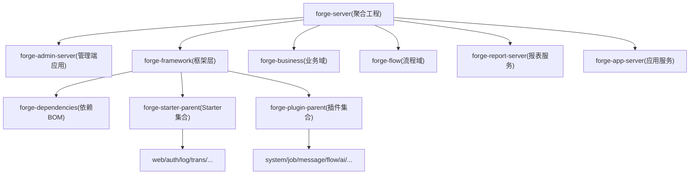
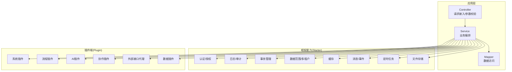
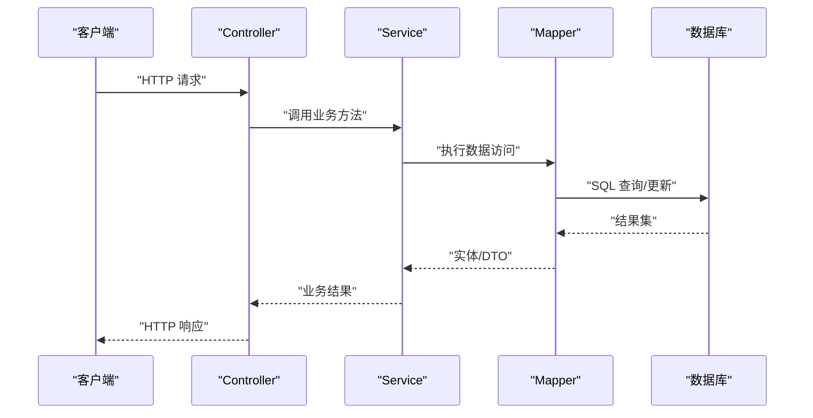
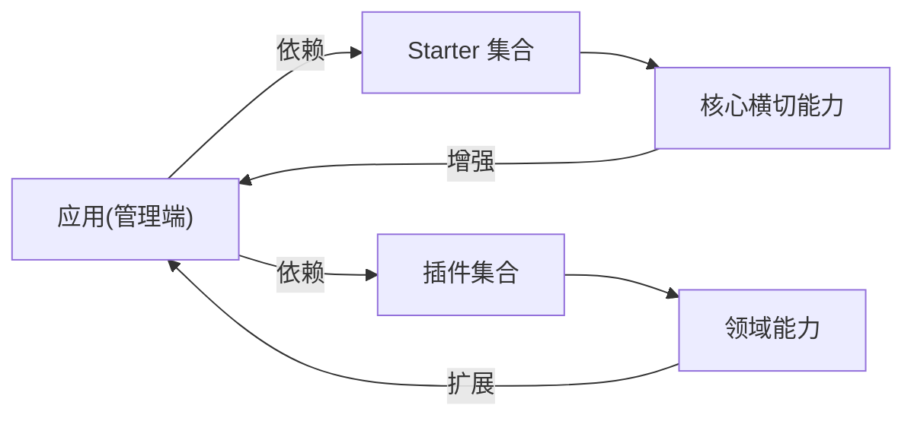

# 后端架构设计

<cite>
**本文引用的文件**
- [forge-server/pom.xml](file://forge-server/pom.xml)
- [forge-framework/pom.xml](file://forge-server/forge-framework/pom.xml)
- [forge-admin-server/pom.xml](file://forge-server/forge-admin-server/pom.xml)
- [forge-starter-parent/pom.xml](file://forge-server/forge-framework/forge-starter-parent/pom.xml)
- [forge-plugin-parent/pom.xml](file://forge-server/forge-framework/forge-plugin-parent/pom.xml)
- [EmployeeController.java](file://forge-server/forge-admin-server/src/main/java/com/mdframe/forge/employee/controller/EmployeeController.java)
- [IEmployeeService.java](file://forge-server/forge-admin-server/src/main/java/com/mdframe/forge/employee/service/IEmployeeService.java)
- [EmployeeMapper.java](file://forge-server/forge-admin-server/src/main/java/com/mdframe/forge/employee/mapper/EmployeeMapper.java)
</cite>

## 目录
1. [简介](#简介)
2. [项目结构](#项目结构)
3. [核心组件](#核心组件)
4. [架构总览](#架构总览)
5. [详细组件分析](#详细组件分析)
6. [依赖关系分析](#依赖关系分析)
7. [性能考量](#性能考量)
8. [故障排查指南](#故障排查指南)
9. [结论](#结论)
10. [附录](#附录)

## 简介
本文件面向 Forge Admin 后端，系统性阐述基于 Spring Boot 3 的微服务与插件化架构。重点覆盖：
- 分层架构模式（Controller-Service-Mapper）
- 微内核 + 插件体系的设计原理与职责划分
- Starter 组件体系（forge-starter-parent）与插件父工程（forge-plugin-parent）的边界
- 多租户隔离、数据权限控制、事务管理策略
- API 设计规范、异常处理机制、日志记录策略
- 扩展点设计与性能优化策略
- 架构图表展示组件依赖关系与数据流向

## 项目结构
Forge Server 采用多模块 Maven 工程，顶层聚合 forge-server，包含应用层、框架层与业务/流程等子域。框架层进一步拆分为依赖管理、Starter 组件集合与插件集合，形成“平台能力可插拔”的工程组织方式。

**图表来源**
- [forge-server/pom.xml:186-193](file://forge-server/pom.xml#L186-L193)
- [forge-framework/pom.xml:30-34](file://forge-server/forge-framework/pom.xml#L30-L34)

**章节来源**
- [forge-server/pom.xml:1-193](file://forge-server/pom.xml#L1-L193)
- [forge-framework/pom.xml:1-46](file://forge-server/forge-framework/pom.xml#L1-L46)

## 核心组件
- 应用入口与装配：forge-admin-server 作为管理端主应用，通过引入多个 starter 与 plugin 完成能力装配。
- 框架基础：forge-starter-parent 提供横切能力（Web、认证、日志、事务、缓存、文件、Excel、配置、任务、ID、数据范围、消息、租户、加解密、WebSocket、API 配置、社交、幂等、出站调用、协作等）。
- 插件域：forge-plugin-parent 提供系统、作业、消息、流程、协作、代码生成、AI、能力中心、MCP、外部接口代理、数据等插件。
- 依赖治理：forge-dependencies 统一版本；顶层 forge-server 通过 dependencyManagement 集中管理第三方依赖与构建插件。

**章节来源**
- [forge-admin-server/pom.xml:14-155](file://forge-server/forge-admin-server/pom.xml#L14-L155)
- [forge-starter-parent/pom.xml:15-39](file://forge-server/forge-framework/forge-starter-parent/pom.xml#L15-L39)
- [forge-plugin-parent/pom.xml:18-30](file://forge-server/forge-framework/forge-plugin-parent/pom.xml#L18-L30)
- [forge-server/pom.xml:129-184](file://forge-server/pom.xml#L129-L184)

## 架构总览
整体采用“Spring Boot 3 + 多模块 + Starter/Plugin”的架构：
- 分层：Controller 负责入参校验与响应封装；Service 承载业务编排；Mapper 负责数据访问。
- 插件化：以插件形式提供领域能力（如流程、AI、协作），通过依赖注入到应用，实现“微内核+插件”的可插拔架构。
- 横切：通过 Starter 提供通用能力（安全、日志、事务、租户、数据范围、缓存、文件、消息、任务等），以最小侵入方式增强应用。
- 数据流：请求经 Web 层进入 Service，必要时跨插件调用（如流程、AI、协作），最终通过 ORM 访问数据库，并通过消息/事件进行异步解耦。

**图表来源**
- [forge-admin-server/pom.xml:14-155](file://forge-server/forge-admin-server/pom.xml#L14-L155)
- [forge-starter-parent/pom.xml:15-39](file://forge-server/forge-framework/forge-starter-parent/pom.xml#L15-L39)
- [forge-plugin-parent/pom.xml:18-30](file://forge-server/forge-framework/forge-plugin-parent/pom.xml#L18-L30)

## 详细组件分析

### 分层架构（Controller-Service-Mapper）
- Controller：接收 HTTP 请求，进行参数校验、上下文组装，并委托给 Service。
- Service：实现业务逻辑，协调各 Starter/Plugin 能力（如鉴权、事务、消息、流程、AI 等）。
- Mapper：定义数据访问接口，配合 MyBatis/MyBatis-Plus 完成 SQL 映射。

**图表来源**
- [EmployeeController.java](file://forge-server/forge-admin-server/src/main/java/com/mdframe/forge/employee/controller/EmployeeController.java)
- [IEmployeeService.java](file://forge-server/forge-admin-server/src/main/java/com/mdframe/forge/employee/service/IEmployeeService.java)
- [EmployeeMapper.java](file://forge-server/forge-admin-server/src/main/java/com/mdframe/forge/employee/mapper/EmployeeMapper.java)

**章节来源**
- [EmployeeController.java](file://forge-server/forge-admin-server/src/main/java/com/mdframe/forge/employee/controller/EmployeeController.java)
- [IEmployeeService.java](file://forge-server/forge-admin-server/src/main/java/com/mdframe/forge/employee/service/IEmployeeService.java)
- [EmployeeMapper.java](file://forge-server/forge-admin-server/src/main/java/com/mdframe/forge/employee/mapper/EmployeeMapper.java)

### 微内核 + 插件体系
- 微内核（应用）：仅关注自身业务编排与装配，不直接耦合具体实现细节。
- 插件：以独立模块提供能力（系统、流程、AI、协作、外部代理、数据等），通过依赖注入被应用使用。
- Starter：提供横切能力（Web、Auth、Log、Trans、Tenant、DataScope、Cache、File、Message、Job、Id、Crypto、WebSocket、API Config、Social、Idempotent、OpenAPI Security、Outbound、Collaboration），以“开箱即用”的方式增强应用。

**图表来源**
- [forge-admin-server/pom.xml:14-155](file://forge-server/forge-admin-server/pom.xml#L14-L155)
- [forge-starter-parent/pom.xml:15-39](file://forge-server/forge-framework/forge-starter-parent/pom.xml#L15-L39)
- [forge-plugin-parent/pom.xml:18-30](file://forge-server/forge-framework/forge-plugin-parent/pom.xml#L18-L30)

**章节来源**
- [forge-admin-server/pom.xml:14-155](file://forge-server/forge-admin-server/pom.xml#L14-L155)
- [forge-starter-parent/pom.xml:15-39](file://forge-server/forge-framework/forge-starter-parent/pom.xml#L15-L39)
- [forge-plugin-parent/pom.xml:18-30](file://forge-server/forge-framework/forge-plugin-parent/pom.xml#L18-L30)

### Starter 组件体系与职责
- 基础能力：core、web、orm、cache、id、crypto、websocket、openapi-security、outbound、collaboration
- 安全与合规：auth、social、openapi-security
- 数据与持久化：datascope、trans、config、file、excel、message
- 运维与可观测性：log、job、idempotent
- 多租户：tenant（结合 datascope 实现数据隔离）

**章节来源**
- [forge-starter-parent/pom.xml:15-39](file://forge-server/forge-framework/forge-starter-parent/pom.xml#L15-L39)

### 插件域与职责
- 系统：系统配置、字典、菜单、角色、用户等基础管理能力
- 流程：BPMN 建模、实例、节点、监控、表单等
- AI：Agent、模型调用、知识库、对话、仪表盘等
- 协作：连接、协同编辑等
- 外部接口代理：对外部系统的统一代理与适配
- 数据：数据源、数据集、数据服务等
- 其他：消息、作业、代码生成、MCP、能力中心等

**章节来源**
- [forge-plugin-parent/pom.xml:18-30](file://forge-server/forge-framework/forge-plugin-parent/pom.xml#L18-L30)

### 多租户隔离机制
- 通过 tenant starter 在请求上下文中维护租户标识，结合 datascope 在 SQL 层自动注入租户条件，实现行级数据隔离。
- 建议：所有业务表包含租户字段；对跨租户操作进行严格校验；敏感接口强制租户上下文。

**章节来源**
- [forge-starter-parent/pom.xml:15-39](file://forge-server/forge-framework/forge-starter-parent/pom.xml#L15-L39)

### 数据权限控制
- 基于 datascope 的数据范围拦截器，结合角色/部门/自定义规则，在查询时动态拼接过滤条件。
- 建议：为高敏数据启用更细粒度范围；避免全表扫描；对复杂范围进行索引优化。

**章节来源**
- [forge-starter-parent/pom.xml:15-39](file://forge-server/forge-framework/forge-starter-parent/pom.xml#L15-L39)

### 事务管理策略
- 通过 trans starter 统一管理事务边界，结合注解式事务声明。
- 建议：将写操作集中在事务内；长事务拆分；跨服务调用采用补偿或 Saga 模式；对读多写少场景考虑只读事务。

**章节来源**
- [forge-starter-parent/pom.xml:15-39](file://forge-server/forge-framework/forge-starter-parent/pom.xml#L15-L39)

### API 设计规范
- 统一入口：由 web starter 提供的控制器基类与全局配置。
- 统一返回：建议统一响应体结构与状态码。
- 文档：集成 OpenAPI/Swagger，便于前后端联调与自动化测试。
- 安全：结合 auth/social/openapi-security 实现鉴权与访问控制。

**章节来源**
- [forge-starter-parent/pom.xml:15-39](file://forge-server/forge-framework/forge-starter-parent/pom.xml#L15-L39)

### 异常处理机制
- 建议在 web 层统一捕获并转换为标准错误响应；结合日志记录关键堆栈与上下文信息。
- 对业务异常与系统异常分类处理，保证前端可感知且安全。

**章节来源**
- [forge-starter-parent/pom.xml:15-39](file://forge-server/forge-framework/forge-starter-parent/pom.xml#L15-L39)

### 日志记录策略
- 通过 log starter 统一采集请求、响应、耗时、上下文（租户、用户、链路ID）。
- 建议：分级输出（info/warn/error）；脱敏敏感信息；集中收集与检索。

**章节来源**
- [forge-starter-parent/pom.xml:15-39](file://forge-server/forge-framework/forge-starter-parent/pom.xml#L15-L39)

### 扩展点设计
- 插件化扩展：新增领域能力以插件形式提供，遵循约定优于配置原则。
- Starter 扩展：通过 SPI/自动装配扩展横切能力（如自定义鉴权、日志格式、数据范围策略）。
- 事件驱动：利用 message/collaboration 等能力进行异步解耦与横向扩展。

**章节来源**
- [forge-plugin-parent/pom.xml:18-30](file://forge-server/forge-framework/forge-plugin-parent/pom.xml#L18-L30)
- [forge-starter-parent/pom.xml:15-39](file://forge-server/forge-framework/forge-starter-parent/pom.xml#L15-L39)

## 依赖关系分析
- 应用层依赖 Starter 与 Plugin，形成“应用编排 + 能力装配”的模式。
- Starter 之间保持低耦合，通过接口与事件交互。
- Plugin 之间通过 Starter 暴露的能力进行协作，避免直接强依赖。

```mermaid
graph TB
Admin["forge-admin-server"] --> S1["forge-starter-web"]
Admin --> S2["forge-starter-auth"]
Admin --> S3["forge-starter-log"]
Admin --> S4["forge-starter-trans"]
Admin --> S5["forge-starter-tenant"]
Admin --> S6["forge-starter-datascope"]
Admin --> P1["forge-plugin-system"]
Admin --> P2["forge-plugin-job"]
Admin --> P3["forge-plugin-message"]
Admin --> P4["forge-plugin-collaboration"]
Admin --> P5["forge-plugin-generator"]
Admin --> P6["forge-plugin-ai"]
Admin --> P7["forge-plugin-mcp"]
Admin --> P8["forge-plugin-capability-platform"]
Admin --> P9["forge-plugin-capability-actions"]
Admin --> P10["forge-plugin-capability-high-risk-approval"]
Admin --> P11["forge-plugin-external"]
Admin --> P12["forge-plugin-data"]
```

**图表来源**
- [forge-admin-server/pom.xml:14-155](file://forge-server/forge-admin-server/pom.xml#L14-L155)

**章节来源**
- [forge-admin-server/pom.xml:14-155](file://forge-server/forge-admin-server/pom.xml#L14-L155)

## 性能考量
- 缓存：合理使用 cache starter，针对热点数据设置过期与一致性策略。
- 数据库：利用 datascope 的 SQL 改写与索引优化；避免 N+1 查询；分页与投影减少数据传输。
- 并发：结合 job/outbound/websocket 进行异步处理；对写热点使用分布式锁与幂等控制。
- 资源：合理配置线程池与连接池；监控慢查询与 GC 指标。
- 可观测性：通过 log 与 actuator 采集关键指标，建立告警与容量规划。

[本节为通用指导，无需特定文件引用]

## 故障排查指南
- 常见问题定位：
  - 鉴权失败：检查 auth/social 配置与 Token 传递；查看日志中的认证上下文。
  - 数据越界：核对 datascope 规则与租户上下文；检查 SQL 是否注入租户条件。
  - 事务异常：确认事务边界与回滚策略；查看事务日志与数据库锁等待。
  - 插件加载失败：检查依赖版本与自动装配；查看启动日志中的插件注册信息。
- 建议：
  - 开启详细日志与链路追踪；对关键路径增加埋点。
  - 使用 actuator 暴露健康检查与指标；建立告警阈值。
  - 对异常进行分类与降级策略，保障核心链路可用性。

**章节来源**
- [forge-starter-parent/pom.xml:15-39](file://forge-server/forge-framework/forge-starter-parent/pom.xml#L15-L39)

## 结论
Forge Admin 后端采用 Spring Boot 3 的多模块架构，结合 Starter 与 Plugin 实现“微内核 + 插件”的可插拔体系。通过分层架构与横切能力解耦，既保证了核心业务的稳定性，又提供了丰富的领域扩展能力。在多租户、数据权限、事务、API、异常与日志等方面形成了系统化方案，具备良好的可维护性与可扩展性。

[本节为总结性内容，无需特定文件引用]

## 附录
- 版本与环境：Spring Boot 3.x、MyBatis-Plus、Flyway、Redisson、Flowable、Spring AI 等依赖在顶层 POM 中统一管理。
- 构建与打包：使用 Spring Boot Maven Plugin 进行重打包；支持 WAR/JAR 两种形态。
- 仓库与镜像：配置了中央仓库与阿里云、华为云镜像以提升依赖下载效率。

**章节来源**
- [forge-server/pom.xml:12-72](file://forge-server/pom.xml#L12-L72)
- [forge-server/pom.xml:129-184](file://forge-server/pom.xml#L129-L184)
- [forge-server/pom.xml:301-367](file://forge-server/pom.xml#L301-L367)