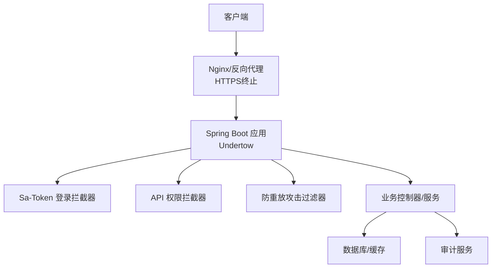
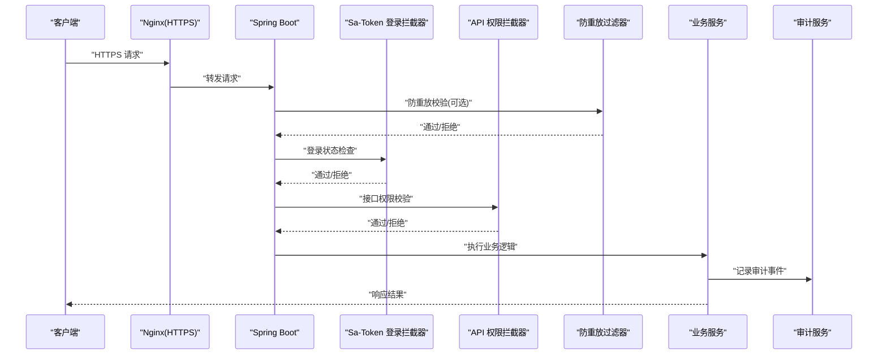
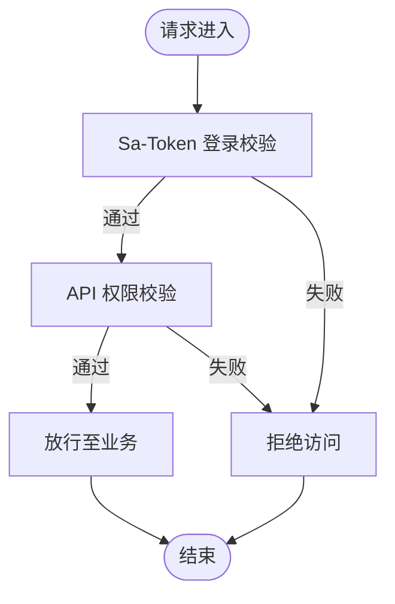
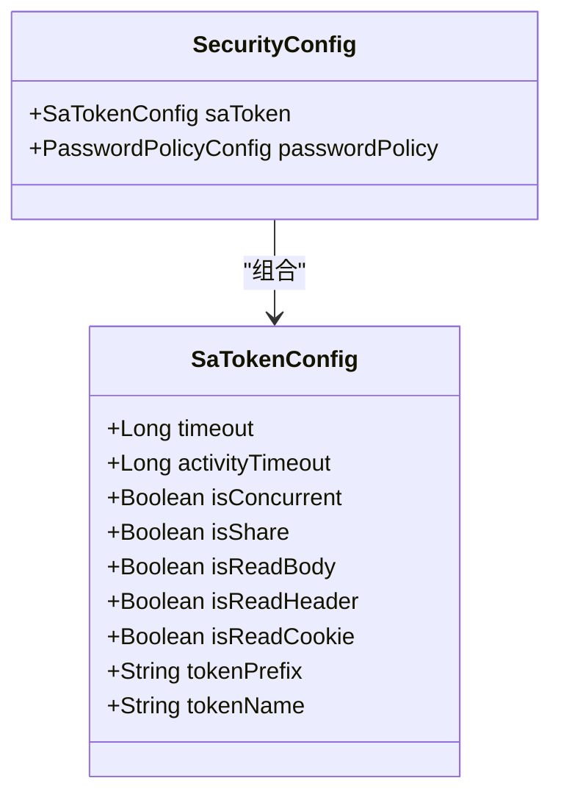
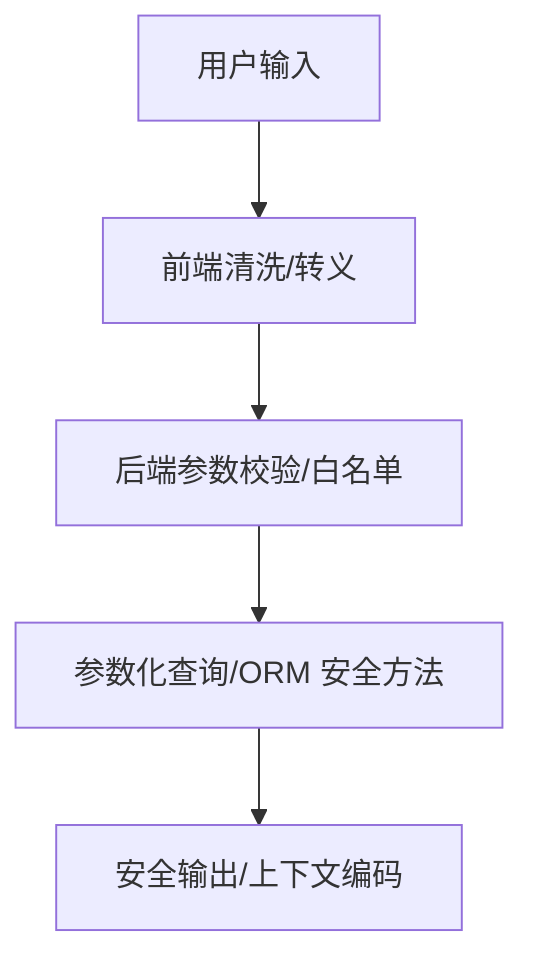
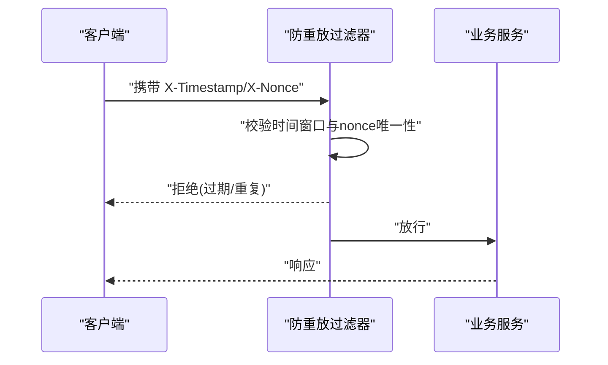
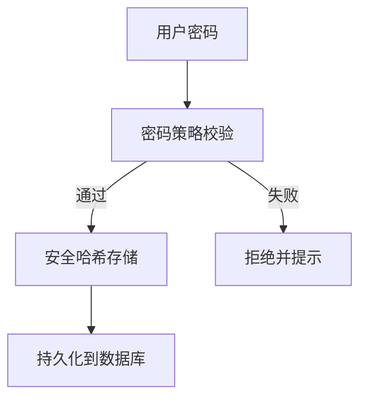
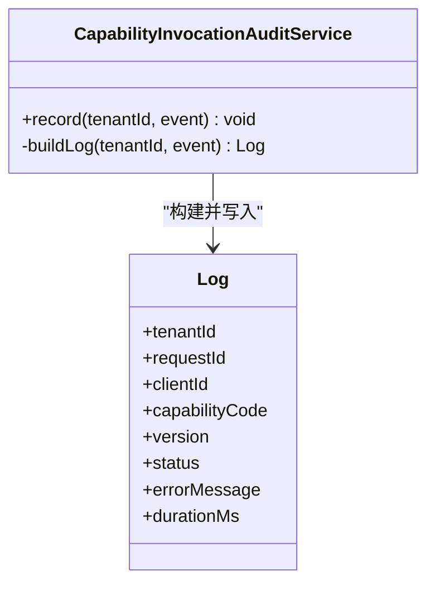
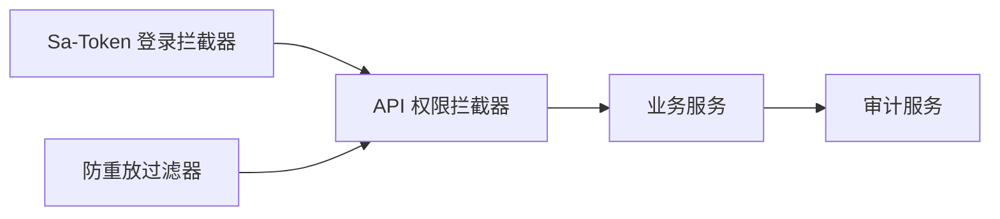

# 安全架构设计

<cite>
**本文引用的文件**
- [SecurityConfig.java](file://forge-server/forge-framework/forge-starter-parent/forge-starter-config/src/main/java/com/mdframe/forge/starter/config/config/SecurityConfig.java)
- [application.yml](file://forge-server/forge-admin-server/src/main/resources/application.yml)
- [SaTokenConfig.java](file://forge-server/forge-framework/forge-starter-parent/forge-starter-auth/src/main/java/com/mdframe/forge/starter/auth/config/SaTokenConfig.java)
- [ApiPermissionInterceptor.java](file://forge-server/forge-framework/forge-starter-parent/forge-starter-auth/src/main/java/com/mdframe/forge/starter/auth/interceptor/ApiPermissionInterceptor.java)
- [ReplayAttackFilter.java](file://forge-server/forge-framework/forge-starter-parent/forge-starter-crypto/src/main/java/com/mdframe/forge/starter/crypto/filter/ReplayAttackFilter.java)
- [CapabilityInvocationAuditService.java](file://forge-server/forge-framework/forge-plugin-parent/forge-plugin-capability-parent/forge-plugin-capability-platform/src/main/java/com/mdframe/forge/plugin/capability/controlplane/service/CapabilityInvocationAuditService.java)
- [sanitize-html.js](file://forge-admin-ui/src/utils/sanitize-html.js)
</cite>

## 目录
1. [简介](#简介)
2. [项目结构](#项目结构)
3. [核心组件](#核心组件)
4. [架构总览](#架构总览)
5. [详细组件分析](#详细组件分析)
6. [依赖关系分析](#依赖关系分析)
7. [性能与安全权衡](#性能与安全权衡)
8. [故障排查指南](#故障排查指南)
9. [结论](#结论)
10. [附录](#附录)

## 简介
本文件面向 Forge Admin 的安全架构设计，围绕基于 Sa-Token 的认证与授权、RBAC 权限模型、JWT/令牌管理、会话控制、接口安全防护（防 SQL 注入、XSS、CSRF）、敏感数据加密、传输层安全（HTTPS）、密码策略、审计日志、访问控制与数据脱敏等主题进行系统化说明。文档通过代码级分析与可视化图表，帮助读者理解安全边界、威胁防护与落地实现。

## 项目结构
本项目采用多模块分层架构：
- 启动与配置：应用配置文件集中管理安全相关参数（如 Sa-Token、能力开放网关开关、加密密钥等）。
- 认证与授权：基于 Sa-Token 的登录校验拦截器与 API 权限拦截器，结合数据库资源表实现细粒度权限控制。
- 安全过滤器：提供防重放攻击过滤、内部调用可信验证等通用安全能力。
- 审计与合规：对关键操作进行不可篡改的审计记录，并对敏感字段进行脱敏与白名单限制。
- 前端安全：提供 HTML 清洗与脚本校验工具，降低 XSS 风险。

**图示来源**
- [SaTokenConfig.java:29-100](file://forge-server/forge-framework/forge-starter-parent/forge-starter-auth/src/main/java/com/mdframe/forge/starter/auth/config/SaTokenConfig.java#L29-L100)
- [ApiPermissionInterceptor.java:44-112](file://forge-server/forge-framework/forge-starter-parent/forge-starter-auth/src/main/java/com/mdframe/forge/starter/auth/interceptor/ApiPermissionInterceptor.java#L44-L112)
- [ReplayAttackFilter.java:35-107](file://forge-server/forge-framework/forge-starter-parent/forge-starter-crypto/src/main/java/com/mdframe/forge/starter/crypto/filter/ReplayAttackFilter.java#L35-L107)

**章节来源**
- [application.yml:1-228](file://forge-server/forge-admin-server/src/main/resources/application.yml#L1-L228)

## 核心组件
- 安全配置对象：封装 Sa-Token 行为（token 有效期、并发登录、读取来源）与密码策略（复杂度、过期天数、历史数量）。
- Sa-Token 配置：注册登录校验拦截器，排除公开路径，统一执行登录检查；随后注册 API 权限拦截器，基于数据库资源表进行权限判定。
- API 权限拦截器：支持注解豁免、强制改密策略、匿名访问控制、通配符匹配与未配置资源的跳过逻辑。
- 防重放攻击过滤器：基于时间戳与 nonce 的原子登记机制，提供可配置的时间窗口与包含/排除路径策略。
- 审计服务：对能力调用进行结构化记录，内置正则过滤敏感键值对，限制错误消息长度，确保审计信息不泄露机密。
- 前端安全工具：HTML 清洗与转义、危险标签与事件处理器移除、脚本大小与内容限制，降低 XSS 风险。

**章节来源**
- [SecurityConfig.java:8-112](file://forge-server/forge-framework/forge-starter-parent/forge-starter-config/src/main/java/com/mdframe/forge/starter/config/config/SecurityConfig.java#L8-L112)
- [SaTokenConfig.java:29-100](file://forge-server/forge-framework/forge-starter-parent/forge-starter-auth/src/main/java/com/mdframe/forge/starter/auth/config/SaTokenConfig.java#L29-L100)
- [ApiPermissionInterceptor.java:44-141](file://forge-server/forge-framework/forge-starter-parent/forge-starter-auth/src/main/java/com/mdframe/forge/starter/auth/interceptor/ApiPermissionInterceptor.java#L44-L141)
- [ReplayAttackFilter.java:35-145](file://forge-server/forge-framework/forge-starter-parent/forge-starter-crypto/src/main/java/com/mdframe/forge/starter/crypto/filter/ReplayAttackFilter.java#L35-L145)
- [CapabilityInvocationAuditService.java:21-43](file://forge-server/forge-framework/forge-plugin-parent/forge-plugin-capability-parent/forge-plugin-capability-platform/src/main/java/com/mdframe/forge/plugin/capability/controlplane/service/CapabilityInvocationAuditService.java#L21-L43)
- [sanitize-html.js:1-69](file://forge-admin-ui/src/utils/sanitize-html.js#L1-L69)

## 架构总览
下图展示请求进入后的安全处理链路：从 Nginx 终止 HTTPS，到 Spring Boot 中的 Sa-Token 登录校验、API 权限校验、防重放过滤，再到业务服务与审计记录。

**图示来源**
- [SaTokenConfig.java:29-100](file://forge-server/forge-framework/forge-starter-parent/forge-starter-auth/src/main/java/com/mdframe/forge/starter/auth/config/SaTokenConfig.java#L29-L100)
- [ApiPermissionInterceptor.java:44-112](file://forge-server/forge-framework/forge-starter-parent/forge-starter-auth/src/main/java/com/mdframe/forge/starter/auth/interceptor/ApiPermissionInterceptor.java#L44-L112)
- [ReplayAttackFilter.java:35-107](file://forge-server/forge-framework/forge-starter-parent/forge-starter-crypto/src/main/java/com/mdframe/forge/starter/crypto/filter/ReplayAttackFilter.java#L35-L107)
- [CapabilityInvocationAuditService.java:21-43](file://forge-server/forge-framework/forge-plugin-parent/forge-plugin-capability-parent/forge-plugin-capability-platform/src/main/java/com/mdframe/forge/plugin/capability/controlplane/service/CapabilityInvocationAuditService.java#L21-L43)

## 详细组件分析

### 认证与授权（Sa-Token + RBAC）
- 登录校验：通过 Sa-Token 拦截器对所有受保护路径执行登录检查，并明确排除登录、注册、重置密码、静态资源、健康检查、WebSocket、MCP/OAuth 专用端点等。
- 权限控制：API 权限拦截器依据数据库资源表配置进行权限判定，支持通配符匹配；若接口未配置资源则跳过校验；支持注解豁免与强制改密策略。
- 会话与令牌：Sa-Token 支持 Redis 存储 Session，可配置 token 有效期、活动超时、并发登录与共享策略；token 前缀与名称可配置。

**图示来源**
- [SaTokenConfig.java:29-100](file://forge-server/forge-framework/forge-starter-parent/forge-starter-auth/src/main/java/com/mdframe/forge/starter/auth/config/SaTokenConfig.java#L29-L100)
- [ApiPermissionInterceptor.java:44-112](file://forge-server/forge-framework/forge-starter-parent/forge-starter-auth/src/main/java/com/mdframe/forge/starter/auth/interceptor/ApiPermissionInterceptor.java#L44-L112)

**章节来源**
- [SaTokenConfig.java:29-100](file://forge-server/forge-framework/forge-starter-parent/forge-starter-auth/src/main/java/com/mdframe/forge/starter/auth/config/SaTokenConfig.java#L29-L100)
- [ApiPermissionInterceptor.java:44-141](file://forge-server/forge-framework/forge-starter-parent/forge-starter-auth/src/main/java/com/mdframe/forge/starter/auth/interceptor/ApiPermissionInterceptor.java#L44-L141)
- [SecurityConfig.java:24-70](file://forge-server/forge-framework/forge-starter-parent/forge-starter-config/src/main/java/com/mdframe/forge/starter/config/config/SecurityConfig.java#L24-L70)

### JWT 令牌管理与会话控制
- 令牌来源：支持从请求体、Header、Cookie 中读取 token，并可配置 token 前缀与名称。
- 会话存储：使用 Redis 作为 Sa-Token 的独立存储，支持连接地址、端口、密码与超时配置。
- 生命周期：可配置 token 有效期与活动超时，支持是否允许同一账号并发登录与共享 token。

**图示来源**
- [SecurityConfig.java:8-112](file://forge-server/forge-framework/forge-starter-parent/forge-starter-config/src/main/java/com/mdframe/forge/starter/config/config/SecurityConfig.java#L8-L112)

**章节来源**
- [application.yml:118-131](file://forge-server/forge-admin-server/src/main/resources/application.yml#L118-L131)
- [SecurityConfig.java:24-70](file://forge-server/forge-framework/forge-starter-parent/forge-starter-config/src/main/java/com/mdframe/forge/starter/config/config/SecurityConfig.java#L24-L70)

### 接口安全防护（SQL 注入、XSS、CSRF）
- SQL 注入防护：通过 MyBatis Plus 的参数化查询与全局配置减少拼接风险；建议配合输入校验与白名单策略。
- XSS 防护：前端提供 HTML 清洗与转义工具，移除危险标签与事件处理器，限制脚本大小与内容模式；后端在输出时也应进行上下文相关的编码。
- CSRF 防护：对于无状态 Bearer Token 的 API，通常无需传统 CSRF；但需确保跨域策略严格、仅信任合法来源，并在必要时启用 SameSite Cookie 策略。

**图示来源**
- [sanitize-html.js:1-69](file://forge-admin-ui/src/utils/sanitize-html.js#L1-L69)

**章节来源**
- [application.yml:97-111](file://forge-server/forge-admin-server/src/main/resources/application.yml#L97-L111)
- [sanitize-html.js:1-69](file://forge-admin-ui/src/utils/sanitize-html.js#L1-L69)

### 防重放攻击与传输层安全
- 防重放：通过时间戳与 nonce 的原子登记机制，支持可配置时间窗口与包含/排除路径；对内部可信调用进行快速放行。
- 传输层安全：建议在 Nginx 或网关层终止 HTTPS，强制使用 TLS；应用内暴露健康检查与监控端点应最小化暴露面。

**图示来源**
- [ReplayAttackFilter.java:35-107](file://forge-server/forge-framework/forge-starter-parent/forge-starter-crypto/src/main/java/com/mdframe/forge/starter/crypto/filter/ReplayAttackFilter.java#L35-L107)

**章节来源**
- [ReplayAttackFilter.java:35-145](file://forge-server/forge-framework/forge-starter-parent/forge-starter-crypto/src/main/java/com/mdframe/forge/starter/crypto/filter/ReplayAttackFilter.java#L35-L145)
- [application.yml:1-228](file://forge-server/forge-admin-server/src/main/resources/application.yml#L1-L228)

### 敏感数据加密与密码安全策略
- 加密与密钥：应用提供加密 bootstrap 与密钥持久化能力，支持版本化密钥与遗留兼容读取；能力开放与高敏感动作可通过环境变量注入 KEK。
- 密码策略：可配置最小长度、复杂度要求（大写/小写/数字/特殊字符）、过期天数与历史数量，避免弱口令与重用。

**图示来源**
- [SecurityConfig.java:72-112](file://forge-server/forge-framework/forge-starter-parent/forge-starter-config/src/main/java/com/mdframe/forge/starter/config/config/SecurityConfig.java#L72-L112)

**章节来源**
- [application.yml:150-213](file://forge-server/forge-admin-server/src/main/resources/application.yml#L150-L213)
- [SecurityConfig.java:72-112](file://forge-server/forge-framework/forge-starter-parent/forge-starter-config/src/main/java/com/mdframe/forge/starter/config/config/SecurityConfig.java#L72-L112)

### 审计日志、访问控制与数据脱敏
- 审计日志：对能力调用进行结构化记录，包含租户、客户端、能力标识、版本、主体类型、结果码、阶段、错误信息与耗时；内置敏感键值对过滤与错误消息长度限制。
- 访问控制：通过 Sa-Token 与 API 权限拦截器实现细粒度访问控制，支持注解豁免与强制改密策略。
- 数据脱敏：审计记录中对敏感字段进行过滤；前端对输出内容进行清洗与转义，避免敏感信息泄露。

**图示来源**
- [CapabilityInvocationAuditService.java:21-43](file://forge-server/forge-framework/forge-plugin-parent/forge-plugin-capability-parent/forge-plugin-capability-platform/src/main/java/com/mdframe/forge/plugin/capability/controlplane/service/CapabilityInvocationAuditService.java#L21-L43)

**章节来源**
- [CapabilityInvocationAuditService.java:21-43](file://forge-server/forge-framework/forge-plugin-parent/forge-plugin-capability-parent/forge-plugin-capability-platform/src/main/java/com/mdframe/forge/plugin/capability/controlplane/service/CapabilityInvocationAuditService.java#L21-L43)
- [ApiPermissionInterceptor.java:44-141](file://forge-server/forge-framework/forge-starter-parent/forge-starter-auth/src/main/java/com/mdframe/forge/starter/auth/interceptor/ApiPermissionInterceptor.java#L44-L141)

## 依赖关系分析
- 认证与权限链：Sa-Token 登录拦截器优先于 API 权限拦截器；后者依赖数据库资源表与权限服务。
- 安全过滤器：防重放过滤器位于请求早期，可快速拒绝非法请求，减轻后续处理压力。
- 审计服务：与业务服务解耦，通过事件驱动记录关键操作，具备容错与限长机制。

**图示来源**
- [SaTokenConfig.java:29-100](file://forge-server/forge-framework/forge-starter-parent/forge-starter-auth/src/main/java/com/mdframe/forge/starter/auth/config/SaTokenConfig.java#L29-L100)
- [ApiPermissionInterceptor.java:44-112](file://forge-server/forge-framework/forge-starter-parent/forge-starter-auth/src/main/java/com/mdframe/forge/starter/auth/interceptor/ApiPermissionInterceptor.java#L44-L112)
- [ReplayAttackFilter.java:35-107](file://forge-server/forge-framework/forge-starter-parent/forge-starter-crypto/src/main/java/com/mdframe/forge/starter/crypto/filter/ReplayAttackFilter.java#L35-L107)
- [CapabilityInvocationAuditService.java:21-43](file://forge-server/forge-framework/forge-plugin-parent/forge-plugin-capability-parent/forge-plugin-capability-platform/src/main/java/com/mdframe/forge/plugin/capability/controlplane/service/CapabilityInvocationAuditService.java#L21-L43)

**章节来源**
- [SaTokenConfig.java:29-100](file://forge-server/forge-framework/forge-starter-parent/forge-starter-auth/src/main/java/com/mdframe/forge/starter/auth/config/SaTokenConfig.java#L29-L100)
- [ApiPermissionInterceptor.java:44-112](file://forge-server/forge-framework/forge-starter-parent/forge-starter-auth/src/main/java/com/mdframe/forge/starter/auth/interceptor/ApiPermissionInterceptor.java#L44-L112)
- [ReplayAttackFilter.java:35-107](file://forge-server/forge-framework/forge-starter-parent/forge-starter-crypto/src/main/java/com/mdframe/forge/starter/crypto/filter/ReplayAttackFilter.java#L35-L107)
- [CapabilityInvocationAuditService.java:21-43](file://forge-server/forge-framework/forge-plugin-parent/forge-plugin-capability-parent/forge-plugin-capability-platform/src/main/java/com/mdframe/forge/plugin/capability/controlplane/service/CapabilityInvocationAuditService.java#L21-L43)

## 性能与安全权衡
- 防重放窗口：时间窗口越大越安全，但会增加缓存占用与冲突概率；建议根据业务容忍度设置合理窗口。
- 权限校验开销：数据库资源表查询与通配符匹配可能带来额外延迟；建议缓存热点资源与权限映射。
- 审计记录：高频调用场景下，异步落库与批处理可降低主流程影响；同时限制错误消息长度以避免大对象写入。
- 前端清洗：复杂 HTML 清洗可能影响渲染性能；建议仅在必要区域启用，并结合服务端输出编码。

[本节为通用指导，不直接分析具体文件]

## 故障排查指南
- 登录被拒：检查 Sa-Token 配置与 Redis 连通性；确认请求头/体中 token 格式与前缀正确。
- 权限不足：核对接口是否在数据库资源表中配置，以及当前用户角色是否拥有对应权限；检查注解豁免是否正确。
- 防重放失败：确认客户端发送的 X-Timestamp 与 X-Nonce 是否符合时间窗口与唯一性要求；检查包含/排除路径配置。
- 审计缺失：查看审计服务是否可用，错误消息是否过长或被过滤；确认租户上下文与请求 ID 传递正确。
- XSS 告警：检查前端是否使用了 HTML 清洗工具；确认输出上下文编码正确，避免将原始 HTML 插入 DOM。

**章节来源**
- [SaTokenConfig.java:29-100](file://forge-server/forge-framework/forge-starter-parent/forge-starter-auth/src/main/java/com/mdframe/forge/starter/auth/config/SaTokenConfig.java#L29-L100)
- [ApiPermissionInterceptor.java:44-141](file://forge-server/forge-framework/forge-starter-parent/forge-starter-auth/src/main/java/com/mdframe/forge/starter/auth/interceptor/ApiPermissionInterceptor.java#L44-L141)
- [ReplayAttackFilter.java:35-145](file://forge-server/forge-framework/forge-starter-parent/forge-starter-crypto/src/main/java/com/mdframe/forge/starter/crypto/filter/ReplayAttackFilter.java#L35-L145)
- [CapabilityInvocationAuditService.java:21-43](file://forge-server/forge-framework/forge-plugin-parent/forge-plugin-capability-parent/forge-plugin-capability-platform/src/main/java/com/mdframe/forge/plugin/capability/controlplane/service/CapabilityInvocationAuditService.java#L21-L43)
- [sanitize-html.js:1-69](file://forge-admin-ui/src/utils/sanitize-html.js#L1-L69)

## 结论
Forge Admin 的安全架构以 Sa-Token 为核心，结合数据库驱动的 RBAC 权限模型与多层拦截器，形成从登录校验、权限控制到防重放与审计的全链路防护。通过可配置的密码策略、加密密钥管理与前端 HTML 清洗，系统有效降低了常见安全风险。建议在部署时启用 HTTPS、最小化暴露面，并根据业务需求调优时间窗口、缓存与审计策略，以实现安全与性能的平衡。

[本节为总结性内容，不直接分析具体文件]

## 附录
- 安全边界：Nginx 终止 HTTPS，应用内通过拦截器与过滤器实施认证、权限与防重放；审计服务独立记录关键操作。
- 威胁防护：SQL 注入通过参数化查询与 ORM 安全方法缓解；XSS 通过前端清洗与后端输出编码缓解；CSRF 在无状态 Bearer Token 模式下风险较低，但仍需严格跨域策略。
- 最佳实践：定期轮换密钥、启用强密码策略、限制敏感输出、最小化权限范围、开启审计与监控。

[本节为通用指导，不直接分析具体文件]