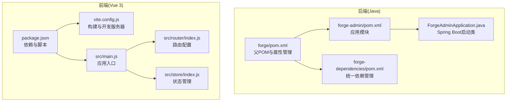
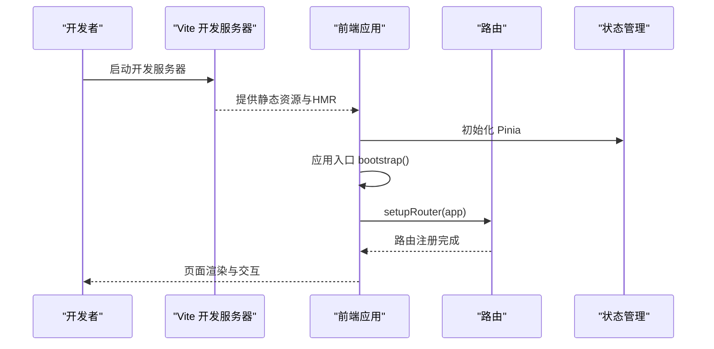
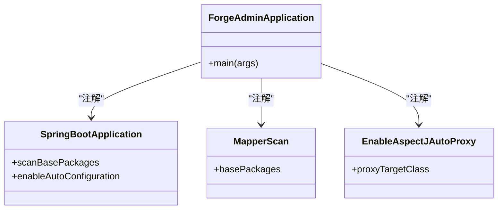
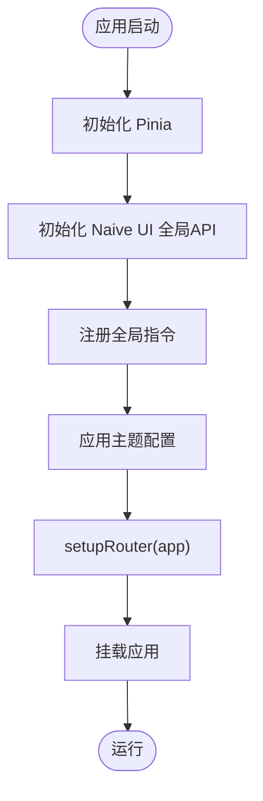
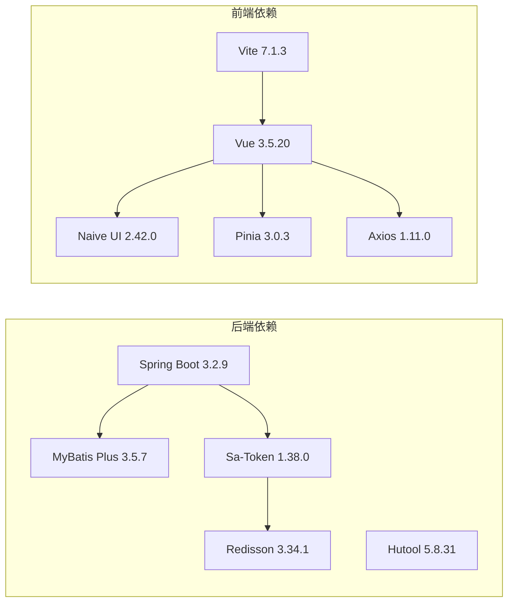

# 技术栈选型

<cite>
**本文档引用的文件**
- [forge/pom.xml](file://forge/pom.xml)
- [forge/forge-admin/pom.xml](file://forge/forge-admin/pom.xml)
- [forge/forge-framework/forge-dependencies/pom.xml](file://forge/forge-framework/forge-dependencies/pom.xml)
- [forge/forge-admin/src/main/java/com/mdframe/forge/admin/ForgeAdminApplication.java](file://forge/forge-admin/src/main/java/com/mdframe/forge/admin/ForgeAdminApplication.java)
- [forge-admin-ui/package.json](file://forge-admin-ui/package.json)
- [forge-admin-ui/vite.config.js](file://forge-admin-ui/vite.config.js)
- [forge-admin-ui/src/main.js](file://forge-admin-ui/src/main.js)
- [forge-admin-ui/src/router/index.js](file://forge-admin-ui/src/router/index.js)
- [forge-admin-ui/src/store/index.js](file://forge-admin-ui/src/store/index.js)
</cite>

## 目录
1. [引言](#引言)
2. [项目结构](#项目结构)
3. [核心组件](#核心组件)
4. [架构总览](#架构总览)
5. [详细组件分析](#详细组件分析)
6. [依赖关系分析](#依赖关系分析)
7. [性能考虑](#性能考虑)
8. [故障排除指南](#故障排除指南)
9. [结论](#结论)
10. [附录](#附录)

## 引言
本文件系统性阐述Forge框架的技术栈选型，重点覆盖后端Spring Boot 3.2.9 + MyBatis Plus + Sa-Token组合与前端Vue 3.5.20 + Naive UI + Vite组合的决策依据、优势与兼容性考量。通过对Maven与package配置、自动装配与启动类、构建工具与开发体验的深入分析，帮助开发者快速理解技术选型的来龙去脉，并为团队技能匹配与学习曲线评估提供参考。

## 项目结构
Forge项目采用多模块聚合结构，后端以Spring Boot为核心，通过统一依赖管理与starter插件体系实现功能模块化；前端基于Vite构建，结合Vue 3与Naive UI提供现代化交互体验。

**图表来源**
- [forge/pom.xml](file://forge/pom.xml#L1-L259)
- [forge/forge-admin/pom.xml](file://forge/forge-admin/pom.xml#L1-L111)
- [forge/forge-framework/forge-dependencies/pom.xml](file://forge/forge-framework/forge-dependencies/pom.xml#L1-L487)
- [forge/forge-admin/src/main/java/com/mdframe/forge/admin/ForgeAdminApplication.java](file://forge/forge-admin/src/main/java/com/mdframe/forge/admin/ForgeAdminApplication.java#L1-L18)
- [forge-admin-ui/package.json](file://forge-admin-ui/package.json#L1-L68)
- [forge-admin-ui/vite.config.js](file://forge-admin-ui/vite.config.js#L1-L86)
- [forge-admin-ui/src/main.js](file://forge-admin-ui/src/main.js#L1-L37)
- [forge-admin-ui/src/router/index.js](file://forge-admin-ui/src/router/index.js#L1-L18)
- [forge-admin-ui/src/store/index.js](file://forge-admin-ui/src/store/index.js#L1-L11)

**章节来源**
- [forge/pom.xml](file://forge/pom.xml#L1-L259)
- [forge/forge-admin/pom.xml](file://forge/forge-admin/pom.xml#L1-L111)
- [forge/forge-framework/forge-dependencies/pom.xml](file://forge/forge-framework/forge-dependencies/pom.xml#L1-L487)
- [forge-admin-ui/package.json](file://forge-admin-ui/package.json#L1-L68)

## 核心组件
- 后端核心
  - Spring Boot 3.2.9：提供自动装配、内嵌容器与生产就绪特性，配合统一依赖管理确保版本一致性。
  - MyBatis Plus 3.5.7：在MyBatis基础上提供通用CRUD、分页、条件构造器等能力，显著提升开发效率。
  - Sa-Token 1.38.0：轻量级权限认证框架，支持会话、JWT、Redis集成，满足多场景鉴权需求。
- 前端核心
  - Vue 3.5.20：组合式API与性能优化，提供现代化开发体验。
  - Naive UI 2.42.0：高质量组件库，内置暗色主题与丰富的UI能力。
  - Vite 7.1.3：极速开发服务器与构建工具，支持热更新与按需编译。

**章节来源**
- [forge/forge-framework/forge-dependencies/pom.xml](file://forge/forge-framework/forge-dependencies/pom.xml#L18-L50)
- [forge/forge-framework/forge-dependencies/pom.xml](file://forge/forge-framework/forge-dependencies/pom.xml#L128-L156)
- [forge/forge-framework/forge-dependencies/pom.xml](file://forge/forge-framework/forge-dependencies/pom.xml#L170-L187)
- [forge-admin-ui/package.json](file://forge-admin-ui/package.json#L32-L36)

## 架构总览
后端通过Spring Boot启动，扫描基础包并启用AOP代理；前端通过Vite启动开发服务器，配置代理与组件自动导入，路由与状态管理在应用入口初始化。

**图表来源**
- [forge-admin-ui/vite.config.js](file://forge-admin-ui/vite.config.js#L13-L85)
- [forge-admin-ui/src/main.js](file://forge-admin-ui/src/main.js#L15-L36)
- [forge-admin-ui/src/router/index.js](file://forge-admin-ui/src/router/index.js#L14-L17)
- [forge-admin-ui/src/store/index.js](file://forge-admin-ui/src/store/index.js#L4-L8)

**章节来源**
- [forge-admin-ui/src/main.js](file://forge-admin-ui/src/main.js#L15-L36)
- [forge-admin-ui/src/router/index.js](file://forge-admin-ui/src/router/index.js#L1-L18)
- [forge-admin-ui/src/store/index.js](file://forge-admin-ui/src/store/index.js#L1-L11)
- [forge-admin-ui/vite.config.js](file://forge-admin-ui/vite.config.js#L13-L85)

## 详细组件分析

### 后端技术栈分析（Spring Boot 3.2.9 + MyBatis Plus + Sa-Token）

- 版本与兼容性
  - Java 17与Spring Boot 3.2.9：面向长期支持与性能优化，具备良好的生态兼容性。
  - MyBatis Plus 3.5.7：与Spring Boot 3适配良好，提供增强的CRUD与条件构造器。
  - Sa-Token 1.38.0：提供Spring Boot 3 Starter与JWT、Redis集成方案，满足会话与鉴权需求。
- 依赖管理与模块化
  - 父POM集中管理版本属性与插件，子模块按需引入starter与插件，降低版本冲突风险。
  - 应用模块聚合多个starter与插件，形成完整的业务能力。
- 启动与扫描
  - 启动类启用Spring Boot自动装配与Mapper扫描，同时开启AspectJ代理以支持AOP切面。

**图表来源**
- [forge/forge-admin/src/main/java/com/mdframe/forge/admin/ForgeAdminApplication.java](file://forge/forge-admin/src/main/java/com/mdframe/forge/admin/ForgeAdminApplication.java#L8-L15)

**章节来源**
- [forge/forge-framework/forge-dependencies/pom.xml](file://forge/forge-framework/forge-dependencies/pom.xml#L76-L101)
- [forge/forge-framework/forge-dependencies/pom.xml](file://forge/forge-framework/forge-dependencies/pom.xml#L128-L156)
- [forge/forge-framework/forge-dependencies/pom.xml](file://forge/forge-framework/forge-dependencies/pom.xml#L170-L187)
- [forge/forge-admin/src/main/java/com/mdframe/forge/admin/ForgeAdminApplication.java](file://forge/forge-admin/src/main/java/com/mdframe/forge/admin/ForgeAdminApplication.java#L8-L15)

### 前端技术栈分析（Vue 3.5.20 + Naive UI + Vite）

- 版本与生态
  - Vue 3.5.20：组合式API成熟稳定，性能与开发体验兼顾。
  - Naive UI 2.42.0：组件丰富、主题可定制，适合企业级后台管理。
  - Vite 7.1.3：冷启动快、热更新高效，开发体验优秀。
- 构建与开发体验
  - Vite配置支持代理转发、路径别名、CSS预处理与插件生态（自动导入、组件解析、DevTools等）。
  - 应用入口顺序初始化Store、全局API、指令与路由，保证运行时一致性。
- 路由与状态管理
  - 路由支持历史模式与哈希模式切换，便于不同部署环境适配。
  - Pinia配合持久化插件，提供跨页面的状态保持能力。

**图表来源**
- [forge-admin-ui/src/main.js](file://forge-admin-ui/src/main.js#L15-L36)
- [forge-admin-ui/src/router/index.js](file://forge-admin-ui/src/router/index.js#L14-L17)
- [forge-admin-ui/src/store/index.js](file://forge-admin-ui/src/store/index.js#L4-L8)

**章节来源**
- [forge-admin-ui/package.json](file://forge-admin-ui/package.json#L13-L41)
- [forge-admin-ui/vite.config.js](file://forge-admin-ui/vite.config.js#L13-L85)
- [forge-admin-ui/src/main.js](file://forge-admin-ui/src/main.js#L15-L36)
- [forge-admin-ui/src/router/index.js](file://forge-admin-ui/src/router/index.js#L1-L18)
- [forge-admin-ui/src/store/index.js](file://forge-admin-ui/src/store/index.js#L1-L11)

## 依赖关系分析
后端通过统一依赖管理集中控制Spring Boot、MyBatis Plus与Sa-Token版本，前端通过package.json统一管理依赖与脚本，两者均强调版本一致性与生态稳定性。

**图表来源**
- [forge/forge-framework/forge-dependencies/pom.xml](file://forge/forge-framework/forge-dependencies/pom.xml#L76-L101)
- [forge/forge-framework/forge-dependencies/pom.xml](file://forge/forge-framework/forge-dependencies/pom.xml#L128-L156)
- [forge/forge-framework/forge-dependencies/pom.xml](file://forge/forge-framework/forge-dependencies/pom.xml#L170-L187)
- [forge-admin-ui/package.json](file://forge-admin-ui/package.json#L13-L41)

**章节来源**
- [forge/forge-framework/forge-dependencies/pom.xml](file://forge/forge-framework/forge-dependencies/pom.xml#L76-L101)
- [forge-admin-ui/package.json](file://forge-admin-ui/package.json#L13-L41)

## 性能考虑
- 后端
  - Spring Boot 3.2.9在启动速度与内存占用方面持续优化，建议结合JVM参数与生产监控工具进行调优。
  - MyBatis Plus的批量操作与缓存策略可减少数据库压力，需注意SQL复杂度与索引设计。
  - Sa-Token的Redis集成可实现分布式会话，需关注Redis延迟与连接池配置。
- 前端
  - Vite的按需编译与Tree Shaking有效降低包体大小，建议结合路由懒加载与组件按需引入。
  - Pinia持久化插件会增加本地存储开销，需合理选择持久化字段与策略。

[本节为通用性能建议，无需特定文件引用]

## 故障排除指南
- 后端常见问题
  - 版本冲突：检查父POM与子模块依赖声明，确保统一版本管理生效。
  - 启动失败：确认Mapper扫描路径与AOP代理配置正确。
- 前端常见问题
  - 代理无效：核对Vite代理配置与后端接口前缀一致。
  - 组件样式异常：检查UnoCSS与Naive UI主题配置是否正确应用。

**章节来源**
- [forge/forge-framework/forge-dependencies/pom.xml](file://forge/forge-framework/forge-dependencies/pom.xml#L76-L101)
- [forge-admin-ui/vite.config.js](file://forge-admin-ui/vite.config.js#L56-L80)
- [forge-admin-ui/src/main.js](file://forge-admin-ui/src/main.js#L18-L22)

## 结论
Forge框架的技术栈选型以“稳定、高效、易维护”为目标：后端通过Spring Boot 3.2.9 + MyBatis Plus + Sa-Token形成高内聚的功能模块与完善的权限体系；前端以Vue 3.5.20 + Naive UI + Vite构建现代化交互与开发体验。统一的版本管理与模块化设计降低了技术债务，提升了团队协作效率。

[本节为总结性内容，无需特定文件引用]

## 附录

### 技术栈版本矩阵
- 后端
  - Spring Boot：3.2.9
  - MyBatis Plus：3.5.7
  - Sa-Token：1.38.0
  - Java：17
- 前端
  - Vue：3.5.20
  - Naive UI：2.42.0
  - Vite：7.1.3
  - Axios：1.11.0
  - Pinia：3.0.3

**章节来源**
- [forge/forge-framework/forge-dependencies/pom.xml](file://forge/forge-framework/forge-dependencies/pom.xml#L18-L50)
- [forge-admin-ui/package.json](file://forge-admin-ui/package.json#L13-L41)

### 学习曲线与技能匹配评估
- 后端
  - Spring Boot：入门门槛适中，建议掌握自动装配、配置与AOP；进阶可学习事务、安全与监控。
  - MyBatis Plus：重点掌握通用CRUD、条件构造器与分页；高级用法包括多数据源与性能优化。
  - Sa-Token：建议从会话与登录流程入手，逐步掌握JWT与Redis集成。
- 前端
  - Vue 3：建议先掌握组合式API与响应式原理，再学习路由与状态管理。
  - Naive UI：熟悉常用表单、表格与弹窗组件，结合主题系统进行定制。
  - Vite：理解插件机制与开发服务器配置，掌握代理与构建优化。

[本节为通用指导，无需特定文件引用]