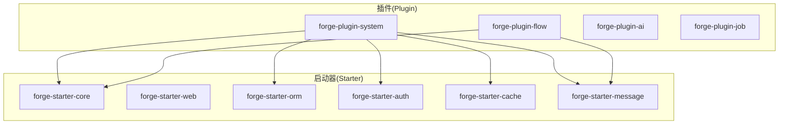
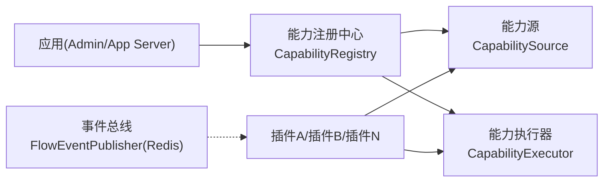
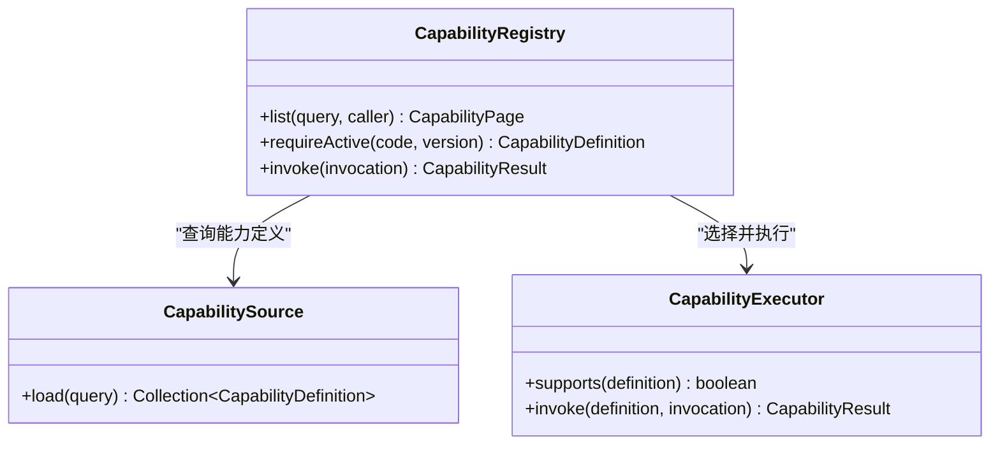
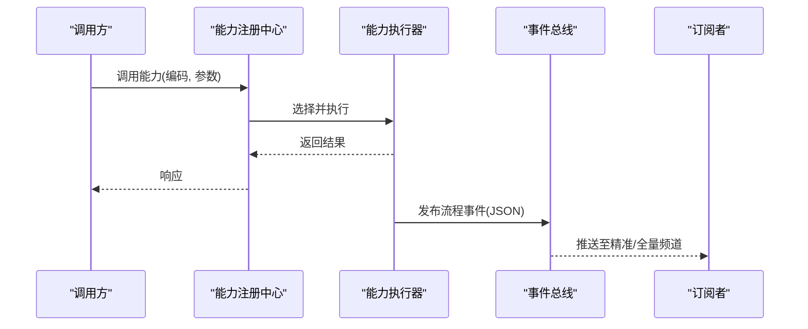
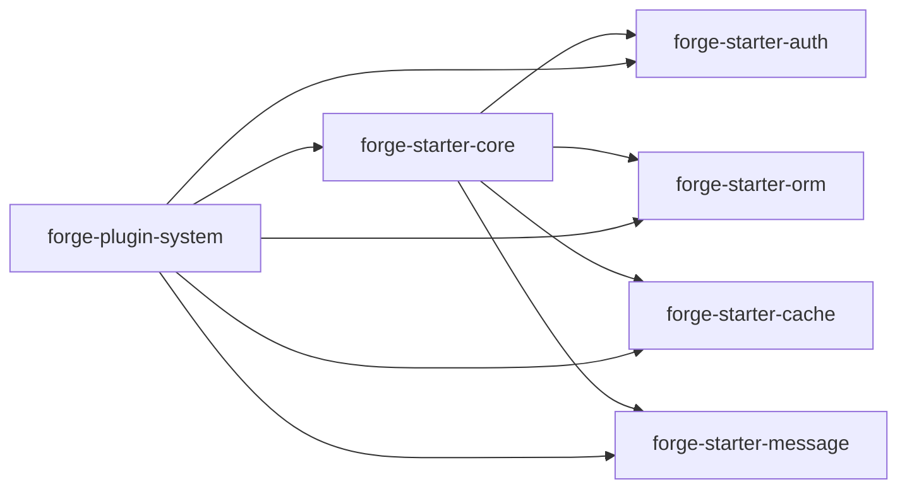
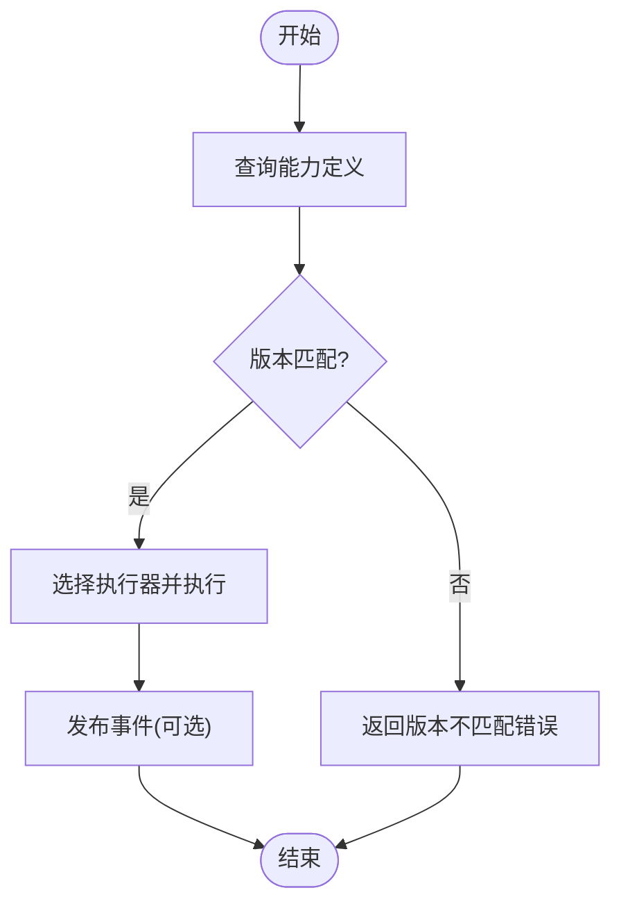

# 插件化架构

<cite>
**本文引用的文件**
- [forge-starter-core/pom.xml](file://forge-server/forge-framework/forge-starter-parent/forge-starter-core/pom.xml)
- [forge-plugin-system/pom.xml](file://forge-server/forge-framework/forge-plugin-parent/forge-plugin-system/pom.xml)
- [CapabilityRegistry.java](file://forge-server/forge-framework/forge-plugin-parent/forge-plugin-capability-parent/forge-plugin-capability-core/src/main/java/com/mdframe/forge/plugin/capability/registry/CapabilityRegistry.java)
- [CapabilitySource.java](file://forge-server/forge-framework/forge-plugin-parent/forge-plugin-capability-parent/forge-plugin-capability-core/src/main/java/com/mdframe/forge/plugin/capability/spi/CapabilitySource.java)
- [CapabilityExecutor.java](file://forge-server/forge-framework/forge-plugin-parent/forge-plugin-capability-parent/forge-plugin-capability-core/src/main/java/com/mdframe/forge/plugin/capability/spi/CapabilityExecutor.java)
- [AutoConfiguration.imports](file://forge-server/forge-framework/forge-plugin-parent/forge-plugin-capability-parent/forge-plugin-capability-core/src/main/resources/META-INF/spring/org.springframework.boot.autoconfigure.AutoConfiguration.imports)
- [FlowEventPublisher.java](file://forge-server/forge-framework/forge-plugin-parent/forge-plugin-flow/src/main/java/com/mdframe/forge/starter/flow/event/FlowEventPublisher.java)
</cite>

## 目录
1. [简介](#简介)
2. [项目结构](#项目结构)
3. [核心组件](#核心组件)
4. [架构总览](#架构总览)
5. [详细组件分析](#详细组件分析)
6. [依赖关系分析](#依赖关系分析)
7. [性能考量](#性能考量)
8. [故障排查指南](#故障排查指南)
9. [结论](#结论)
10. [附录](#附录)

## 简介
本文件面向 Forge Admin 的“微内核 + 插件”体系，系统性阐述其设计原理与实现要点：以 Starter 提供可插拔的基础能力（如 Web、ORM、缓存、消息等），以 Plugin 承载业务域扩展；通过 SPI 服务发现与自动装配完成插件注册、加载与生命周期管理；借助事件总线与配置中心实现插件间通信与动态配置。文档同时给出插件开发规范、热更新思路、版本兼容性策略以及架构图与流程图，帮助开发者快速上手并遵循最佳实践。

## 项目结构
仓库采用分层与模块化组织：
- 启动器层（Starter）：将通用能力封装为独立模块，便于按需引入与自动装配。
- 插件层（Plugin）：围绕业务域或横切能力进行解耦，依赖 Starter 提供的能力。
- 应用层（Server）：组合 Starter 与 Plugin 形成可运行的服务。

图表来源
- [forge-starter-core/pom.xml:1-125](file://forge-server/forge-framework/forge-starter-parent/forge-starter-core/pom.xml#L1-L125)
- [forge-plugin-system/pom.xml:1-103](file://forge-server/forge-framework/forge-plugin-parent/forge-plugin-system/pom.xml#L1-L103)

章节来源
- [forge-starter-core/pom.xml:1-125](file://forge-server/forge-framework/forge-starter-parent/forge-starter-core/pom.xml#L1-L125)
- [forge-plugin-system/pom.xml:1-103](file://forge-server/forge-framework/forge-plugin-parent/forge-plugin-system/pom.xml#L1-L103)

## 核心组件
- 能力注册与执行（SPI）
  - CapabilityRegistry：统一的能力查询、版本要求校验与调用入口。
  - CapabilitySource：按查询条件加载能力定义（插件侧实现）。
  - CapabilityExecutor：根据能力定义选择具体执行器并返回结果。
- 自动装配
  - AutoConfiguration.imports：声明能力模块的自动装配类，使 Spring Boot 在启动时完成初始化。
- 事件总线
  - FlowEventPublisher：基于 Redis Pub/Sub 的流程事件发布器，支持按流程 Key 精准订阅与全量订阅。

章节来源
- [CapabilityRegistry.java:1-17](file://forge-server/forge-framework/forge-plugin-parent/forge-plugin-capability-parent/forge-plugin-capability-core/src/main/java/com/mdframe/forge/plugin/capability/registry/CapabilityRegistry.java#L1-L17)
- [CapabilitySource.java:1-12](file://forge-server/forge-framework/forge-plugin-parent/forge-plugin-capability-parent/forge-plugin-capability-core/src/main/java/com/mdframe/forge/plugin/capability/spi/CapabilitySource.java#L1-L12)
- [CapabilityExecutor.java:1-12](file://forge-server/forge-framework/forge-plugin-parent/forge-plugin-capability-parent/forge-plugin-capability-core/src/main/java/com/mdframe/forge/plugin/capability/spi/CapabilityExecutor.java#L1-L12)
- [AutoConfiguration.imports:1-1](file://forge-server/forge-framework/forge-plugin-parent/forge-plugin-capability-parent/forge-plugin-capability-core/src/main/resources/META-INF/spring/org.springframework.boot.autoconfigure.AutoConfiguration.imports#L1-L1)
- [FlowEventPublisher.java:14-102](file://forge-server/forge-framework/forge-plugin-parent/forge-plugin-flow/src/main/java/com/mdframe/forge/starter/flow/event/FlowEventPublisher.java#L14-L102)

## 架构总览
Forge Admin 采用“微内核 + 插件”的松耦合架构：
- 微内核：由 Starter 组成，提供 Web、ORM、认证、缓存、消息等基础能力，并通过 Spring Boot 自动装配机制启用。
- 插件：以 Plugin 模块形式存在，依赖 Starter 暴露的能力，通过 SPI 接口向内核注册自身能力，并在运行时被调度执行。
- 服务发现：通过 SPI 与自动装配，在启动期扫描并注册能力定义与执行器。
- 事件总线：跨插件异步通信，使用 Redis Pub/Sub 作为消息通道，支持精准与通配订阅。

图表来源
- [CapabilityRegistry.java:1-17](file://forge-server/forge-framework/forge-plugin-parent/forge-plugin-capability-parent/forge-plugin-capability-core/src/main/java/com/mdframe/forge/plugin/capability/registry/CapabilityRegistry.java#L1-L17)
- [CapabilitySource.java:1-12](file://forge-server/forge-framework/forge-plugin-parent/forge-plugin-capability-parent/forge-plugin-capability-core/src/main/java/com/mdframe/forge/plugin/capability/spi/CapabilitySource.java#L1-L12)
- [CapabilityExecutor.java:1-12](file://forge-server/forge-framework/forge-plugin-parent/forge-plugin-capability-parent/forge-plugin-capability-core/src/main/java/com/mdframe/forge/plugin/capability/spi/CapabilityExecutor.java#L1-L12)
- [FlowEventPublisher.java:14-102](file://forge-server/forge-framework/forge-plugin-parent/forge-plugin-flow/src/main/java/com/mdframe/forge/starter/flow/event/FlowEventPublisher.java#L14-L102)

## 详细组件分析

### 能力 SPI 与自动装配
- 能力定义与发现
  - 插件通过实现 CapabilitySource 暴露能力定义集合，供注册中心查询。
  - 自动装配类在启动时加载，完成 SPI 实现类的发现与注册。
- 能力执行
  - CapabilityRegistry 负责根据能力编码与版本要求，选择匹配的 CapabilityExecutor 并执行。
  - 执行器返回标准化结果，屏蔽底层差异。

图表来源
- [CapabilityRegistry.java:1-17](file://forge-server/forge-framework/forge-plugin-parent/forge-plugin-capability-parent/forge-plugin-capability-core/src/main/java/com/mdframe/forge/plugin/capability/registry/CapabilityRegistry.java#L1-L17)
- [CapabilitySource.java:1-12](file://forge-server/forge-framework/forge-plugin-parent/forge-plugin-capability-parent/forge-plugin-capability-core/src/main/java/com/mdframe/forge/plugin/capability/spi/CapabilitySource.java#L1-L12)
- [CapabilityExecutor.java:1-12](file://forge-server/forge-framework/forge-plugin-parent/forge-plugin-capability-parent/forge-plugin-capability-core/src/main/java/com/mdframe/forge/plugin/capability/spi/CapabilityExecutor.java#L1-L12)

章节来源
- [CapabilityRegistry.java:1-17](file://forge-server/forge-framework/forge-plugin-parent/forge-plugin-capability-parent/forge-plugin-capability-core/src/main/java/com/mdframe/forge/plugin/capability/registry/CapabilityRegistry.java#L1-L17)
- [CapabilitySource.java:1-12](file://forge-server/forge-framework/forge-plugin-parent/forge-plugin-capability-parent/forge-plugin-capability-core/src/main/java/com/mdframe/forge/plugin/capability/spi/CapabilitySource.java#L1-L12)
- [CapabilityExecutor.java:1-12](file://forge-server/forge-framework/forge-plugin-parent/forge-plugin-capability-parent/forge-plugin-capability-core/src/main/java/com/mdframe/forge/plugin/capability/spi/CapabilityExecutor.java#L1-L12)
- [AutoConfiguration.imports:1-1](file://forge-server/forge-framework/forge-plugin-parent/forge-plugin-capability-parent/forge-plugin-capability-core/src/main/resources/META-INF/spring/org.springframework.boot.autoconfigure.AutoConfiguration.imports#L1-L1)

### 事件总线（Redis Pub/Sub）
- 发布模式
  - 按流程 Key 精准频道：flow:event:{processDefKey}
  - 全量汇聚频道：flow:event:all
- 订阅模式
  - 支持精确订阅与通配符订阅（PSUBSCRIBE），便于多消费者并行处理。
- 可选依赖
  - 仅在类路径包含 Redis 相关类时生效，未配置则跳过发布并记录告警日志。

图表来源
- [FlowEventPublisher.java:14-102](file://forge-server/forge-framework/forge-plugin-parent/forge-plugin-flow/src/main/java/com/mdframe/forge/starter/flow/event/FlowEventPublisher.java#L14-L102)

章节来源
- [FlowEventPublisher.java:14-102](file://forge-server/forge-framework/forge-plugin-parent/forge-plugin-flow/src/main/java/com/mdframe/forge/starter/flow/event/FlowEventPublisher.java#L14-L102)

### 插件生命周期管理
- 启动阶段
  - 自动装配加载能力模块，扫描并注册 SPI 实现。
  - 能力定义入库或内存缓存，供后续查询与版本校验。
- 运行阶段
  - 通过能力编码与版本进行路由与执行。
  - 事件总线用于跨插件异步通信。
- 卸载/热更新
  - 建议通过能力版本协商与灰度切换实现热更新：新能力以新版本上线，旧版本保留一段时间，逐步迁移后下线。
  - 结合配置中心的动态刷新，可实现无重启的参数级热更新。

章节来源
- [AutoConfiguration.imports:1-1](file://forge-server/forge-framework/forge-plugin-parent/forge-plugin-capability-parent/forge-plugin-capability-core/src/main/resources/META-INF/spring/org.springframework.boot.autoconfigure.AutoConfiguration.imports#L1-L1)
- [FlowEventPublisher.java:14-102](file://forge-server/forge-framework/forge-plugin-parent/forge-plugin-flow/src/main/java/com/mdframe/forge/starter/flow/event/FlowEventPublisher.java#L14-L102)

### 依赖注入机制
- 基于 Spring Boot 自动装配与注解驱动，Starter 提供默认 Bean 与配置绑定。
- 插件通过依赖 Starter 的 API 获取所需能力，避免直接耦合具体实现。
- 通过 @ConditionalOnClass 等条件装配，确保可选依赖（如 Redis）安全降级。

章节来源
- [forge-starter-core/pom.xml:1-125](file://forge-server/forge-framework/forge-starter-parent/forge-starter-core/pom.xml#L1-L125)
- [FlowEventPublisher.java:14-102](file://forge-server/forge-framework/forge-plugin-parent/forge-plugin-flow/src/main/java/com/mdframe/forge/starter/flow/event/FlowEventPublisher.java#L14-L102)

### 插件间通信与配置管理
- 通信
  - 同步：通过能力注册中心调用其他插件暴露的能力。
  - 异步：通过事件总线（Redis Pub/Sub）发布/订阅事件，解耦发送者与接收者。
- 配置
  - 使用 Spring Boot 配置绑定与配置中心，实现运行时动态刷新。
  - 对敏感配置进行加密存储与解密读取。

章节来源
- [FlowEventPublisher.java:14-102](file://forge-server/forge-framework/forge-plugin-parent/forge-plugin-flow/src/main/java/com/mdframe/forge/starter/flow/event/FlowEventPublisher.java#L14-L102)
- [forge-starter-core/pom.xml:1-125](file://forge-server/forge-framework/forge-starter-parent/forge-starter-core/pom.xml#L1-L125)

### 插件开发规范与最佳实践
- 职责边界
  - Starter：提供稳定、通用的基础设施能力（Web、ORM、缓存、消息等）。
  - Plugin：聚焦业务领域或横切能力，仅依赖 Starter 暴露的抽象与 API。
- 扩展点设计
  - 通过 SPI 暴露扩展点（如 CapabilitySource、CapabilityExecutor），保持高内聚低耦合。
- 版本兼容
  - 能力定义携带版本信息，调用方指定版本要求，保证向后兼容。
- 错误处理
  - 统一异常包装与错误码，便于上层治理与监控。
- 可观测性
  - 关键路径埋点与日志输出，配合指标采集与链路追踪。

章节来源
- [CapabilityRegistry.java:1-17](file://forge-server/forge-framework/forge-plugin-parent/forge-plugin-capability-parent/forge-plugin-capability-core/src/main/java/com/mdframe/forge/plugin/capability/registry/CapabilityRegistry.java#L1-L17)
- [CapabilitySource.java:1-12](file://forge-server/forge-framework/forge-plugin-parent/forge-plugin-capability-parent/forge-plugin-capability-core/src/main/java/com/mdframe/forge/plugin/capability/spi/CapabilitySource.java#L1-L12)
- [CapabilityExecutor.java:1-12](file://forge-server/forge-framework/forge-plugin-parent/forge-plugin-capability-parent/forge-plugin-capability-core/src/main/java/com/mdframe/forge/plugin/capability/spi/CapabilityExecutor.java#L1-L12)

### 热更新机制（建议方案）
- 能力版本协商：调用方声明期望版本，注册中心按版本匹配执行器。
- 灰度发布：新旧版本并存，按比例或租户维度分流。
- 配置热更：通过配置中心推送新配置，触发能力行为变更而无需重启。
- 事件回滚：当新版本异常时，通过事件补偿与回滚策略恢复一致性。

[本节为概念性说明，不直接分析具体文件]

## 依赖关系分析
- Starter 与 Plugin 的依赖方向单向：Plugin 依赖 Starter，Starter 不反向依赖 Plugin，保证内核稳定。
- 可选依赖：如 Redis 仅在类路径存在时启用事件总线功能，避免不必要的耦合。
- 自动装配：通过 Spring Boot 的自动装配机制，减少样板代码，提升可维护性。

图表来源
- [forge-starter-core/pom.xml:1-125](file://forge-server/forge-framework/forge-starter-parent/forge-starter-core/pom.xml#L1-L125)
- [forge-plugin-system/pom.xml:1-103](file://forge-server/forge-framework/forge-plugin-parent/forge-plugin-system/pom.xml#L1-L103)

章节来源
- [forge-starter-core/pom.xml:1-125](file://forge-server/forge-framework/forge-starter-parent/forge-starter-core/pom.xml#L1-L125)
- [forge-plugin-system/pom.xml:1-103](file://forge-server/forge-framework/forge-plugin-parent/forge-plugin-system/pom.xml#L1-L103)

## 性能考量
- 能力调用路径短：注册中心到执行器的路由应轻量，避免阻塞。
- 事件总线异步化：流程事件通过 Redis 异步发布，降低主流程延迟。
- 资源隔离：不同插件使用独立的线程池与连接池，避免相互影响。
- 缓存与幂等：热点数据缓存，关键操作幂等，减少重复计算与副作用。

[本节为通用指导，不直接分析具体文件]

## 故障排查指南
- 事件未消费
  - 检查 Redis 是否可用与频道命名是否正确。
  - 确认订阅者已正确注册并监听对应频道。
- 能力未找到或版本不匹配
  - 核对能力编码与版本要求，确认 SPI 实现已注册。
- 自动装配未生效
  - 检查 AutoConfiguration.imports 是否包含正确的装配类。
- 依赖缺失导致功能降级
  - 确认可选依赖（如 Redis）是否在类路径中。

章节来源
- [FlowEventPublisher.java:14-102](file://forge-server/forge-framework/forge-plugin-parent/forge-plugin-flow/src/main/java/com/mdframe/forge/starter/flow/event/FlowEventPublisher.java#L14-L102)
- [AutoConfiguration.imports:1-1](file://forge-server/forge-framework/forge-plugin-parent/forge-plugin-capability-parent/forge-plugin-capability-core/src/main/resources/META-INF/spring/org.springframework.boot.autoconfigure.AutoConfiguration.imports#L1-L1)

## 结论
Forge Admin 的“微内核 + 插件”架构通过 Starter 提供稳定的基础能力，Plugin 实现业务扩展，并以 SPI 与自动装配完成服务发现与集成。事件总线实现了插件间的异步解耦通信，配合版本管理与配置热更，满足高内聚、低耦合与可演进的系统目标。遵循本文的开发规范与最佳实践，可显著提升系统的可维护性与扩展性。

[本节为总结性内容，不直接分析具体文件]

## 附录
- 关键流程图（能力调用）

图表来源
- [CapabilityRegistry.java:1-17](file://forge-server/forge-framework/forge-plugin-parent/forge-plugin-capability-parent/forge-plugin-capability-core/src/main/java/com/mdframe/forge/plugin/capability/registry/CapabilityRegistry.java#L1-L17)
- [FlowEventPublisher.java:14-102](file://forge-server/forge-framework/forge-plugin-parent/forge-plugin-flow/src/main/java/com/mdframe/forge/starter/flow/event/FlowEventPublisher.java#L14-L102)