# 数据库架构设计

<cite>
**本文引用的文件**
- [application.yml](file://forge-server/forge-admin-server/src/main/resources/application.yml)
- [application-dev.example.yml](file://forge-server/forge-admin-server/src/main/resources/application-dev.example.yml)
- [README.md](file://forge-server/db/README.md)
- [init-db.sh](file://forge-server/scripts/db/init-db.sh)
- [dump-safe-full.sh](file://forge-server/scripts/db/dump-safe-full.sh)
- [V1.0.0__baseline.sql](file://forge-server/db/migration/V1.0.0__baseline.sql)
- [V1.0.6__add_logic_delete_to_tenant_table.sql](file://forge-server/db/migration/V1.0.6__add_logic_delete_to_tenant_table.sql)
- [tenant_migration.sql](file://forge-server/forge-framework/forge-starter-parent/forge-starter-tenant/src/main/resources/sql/tenant_migration.sql)
- [JdbcDataSourceProvider.java](file://forge-server/forge-framework/forge-plugin-parent/forge-plugin-data/src/main/java/com/mdframe/forge/plugin/data/support/JdbcDataSourceProvider.java)
- [sql-templates.md](file://.agents/skills/forge-business-flow-development/references/sql-templates.md)
</cite>

## 目录
1. [简介](#简介)
2. [项目结构](#项目结构)
3. [核心组件](#核心组件)
4. [架构总览](#架构总览)
5. [详细组件分析](#详细组件分析)
6. [依赖关系分析](#依赖关系分析)
7. [性能考虑](#性能考虑)
8. [故障排查指南](#故障排查指南)
9. [结论](#结论)
10. [附录](#附录)

## 简介
本文件面向 Forge Admin 的 MySQL 8.0+ 数据库架构，系统性说明多租户数据隔离策略、表结构设计原则与索引优化方案；阐述 Flyway 版本化迁移、数据迁移与种子数据管理；给出主从复制、读写分离与连接池配置建议；覆盖数据备份恢复、性能监控与查询优化策略；并提供 ER 图与表关系图，说明数据一致性保证与事务边界设计。文档内容严格基于仓库中的配置文件、脚本与迁移文件进行归纳与提炼。

## 项目结构
Forge Admin 将数据库相关资产集中在 forge-server/db 目录下，并通过脚本与后端配置协同完成初始化、迁移与导出：
- 迁移脚本：forge-server/db/migration（Flyway 版本化 SQL）
- 种子数据：forge-server/db/seed（required/demo/optional）
- 备份与导出：forge-server/scripts/db（初始化、安全导出等）
- 应用配置：application.yml 与 application-dev.example.yml（Flyway、HikariCP、动态数据源等）

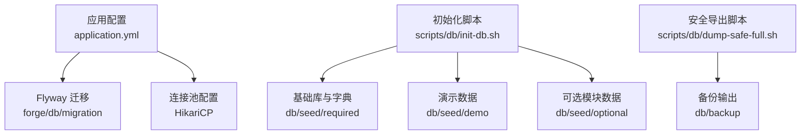

**图表来源**
- [application.yml:65-72](file://forge-server/forge-admin-server/src/main/resources/application.yml#L65-L72)
- [application-dev.example.yml:1-33](file://forge-server/forge-admin-server/src/main/resources/application-dev.example.yml#L1-L33)
- [init-db.sh:88-133](file://forge-server/scripts/db/init-db.sh#L88-L133)
- [dump-safe-full.sh:1-32](file://forge-server/scripts/db/dump-safe-full.sh#L1-L32)

**章节来源**
- [application.yml:65-72](file://forge-server/forge-admin-server/src/main/resources/application.yml#L65-L72)
- [application-dev.example.yml:1-33](file://forge-server/forge-admin-server/src/main/resources/application-dev.example.yml#L1-L33)
- [README.md:13-22](file://forge-server/db/README.md#L13-L22)
- [README.md:129-165](file://forge-server/db/README.md#L129-L165)
- [init-db.sh:88-133](file://forge-server/scripts/db/init-db.sh#L88-L133)

## 核心组件
- 多租户隔离：通过租户上下文与默认行级过滤实现，系统表与业务表按策略纳入隔离范围，并提供联合索引以支撑高效过滤。
- 表结构与字段规范：基线由初始化脚本提供，后续变更通过 Flyway 版本化迁移演进；逻辑删除、审计字段、租户字段为通用约定。
- 迁移与种子：Flyway 负责结构演进；种子数据分必需、演示、可选三类，命名与执行顺序受脚本约束。
- 连接与扩展数据源：主数据源使用 HikariCP；运行时外部数据源通过插件动态创建独立连接池。
- 备份与导出：提供安全导出脚本，排除运行期与敏感数据，生成可复现的结构与数据快照。

**章节来源**
- [tenant_migration.sql:93-106](file://forge-server/forge-framework/forge-starter-parent/forge-starter-tenant/src/main/resources/sql/tenant_migration.sql#L93-L106)
- [V1.0.6__add_logic_delete_to_tenant_table.sql:22-33](file://forge-server/db/migration/V1.0.6__add_logic_delete_to_tenant_table.sql#L22-L33)
- [sql-templates.md:232-241](file://.agents/skills/forge-business-flow-development/references/sql-templates.md#L232-L241)
- [JdbcDataSourceProvider.java:36-69](file://forge-server/forge-framework/forge-plugin-parent/forge-plugin-data/src/main/java/com/mdframe/forge/plugin/data/support/JdbcDataSourceProvider.java#L36-L69)
- [dump-safe-full.sh:1-32](file://forge-server/scripts/db/dump-safe-full.sh#L1-L32)

## 架构总览
下图展示 Forge Admin 在数据库层面的整体架构：应用通过动态数据源访问主库，Flyway 在启动或手动模式下执行迁移；初始化脚本负责建库、导入基础数据与种子数据；安全导出用于生产备份与社区同步。

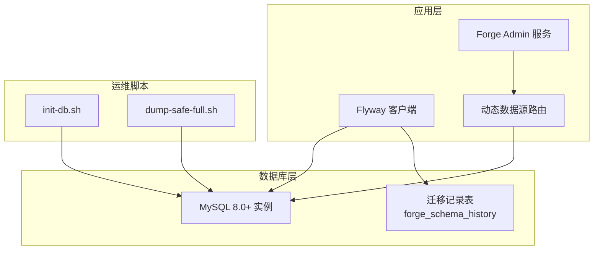

**图表来源**
- [application.yml:65-72](file://forge-server/forge-admin-server/src/main/resources/application.yml#L65-L72)
- [application-dev.example.yml:1-33](file://forge-server/forge-admin-server/src/main/resources/application-dev.example.yml#L1-L33)
- [init-db.sh:88-133](file://forge-server/scripts/db/init-db.sh#L88-L133)
- [dump-safe-full.sh:1-32](file://forge-server/scripts/db/dump-safe-full.sh#L1-L32)

## 详细组件分析

### 多租户数据隔离策略
- 行级隔离：通过租户上下文注入 tenant_id 条件，对业务表进行自动过滤；系统表可按策略选择是否隔离。
- 索引优化：为高频查询列建立联合索引，如角色名与租户、组织父级与租户等，避免全表扫描。
- 历史兼容：对存量租户 ID 进行规范化（统一默认租户），并修复唯一键冲突。

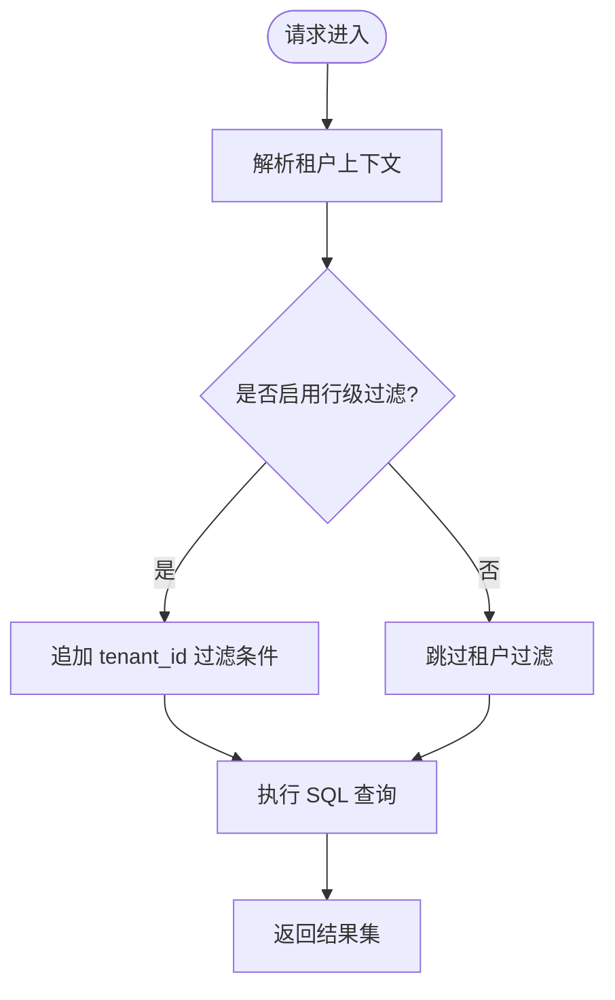

**图表来源**
- [tenant_migration.sql:93-106](file://forge-server/forge-framework/forge-starter-parent/forge-starter-tenant/src/main/resources/sql/tenant_migration.sql#L93-L106)
- [V1.0.6__add_logic_delete_to_tenant_table.sql:22-33](file://forge-server/db/migration/V1.0.6__add_logic_delete_to_tenant_table.sql#L22-L33)

**章节来源**
- [tenant_migration.sql:93-106](file://forge-server/forge-framework/forge-starter-parent/forge-starter-tenant/src/main/resources/sql/tenant_migration.sql#L93-L106)
- [V1.0.6__add_logic_delete_to_tenant_table.sql:22-33](file://forge-server/db/migration/V1.0.6__add_logic_delete_to_tenant_table.sql#L22-L33)

### 表结构设计原则
- 基线与演进：基线由初始化脚本定义，后续变更通过 Flyway 版本化迁移文件演进，禁止直接修改已执行迁移。
- 通用字段：包含逻辑删除、审计字段、租户字段等，确保跨表一致性与可追溯性。
- 命名与约束：迁移文件采用 V版本号__描述.sql 命名；种子数据需显式列名与重复保护，固定 ID 保持唯一。

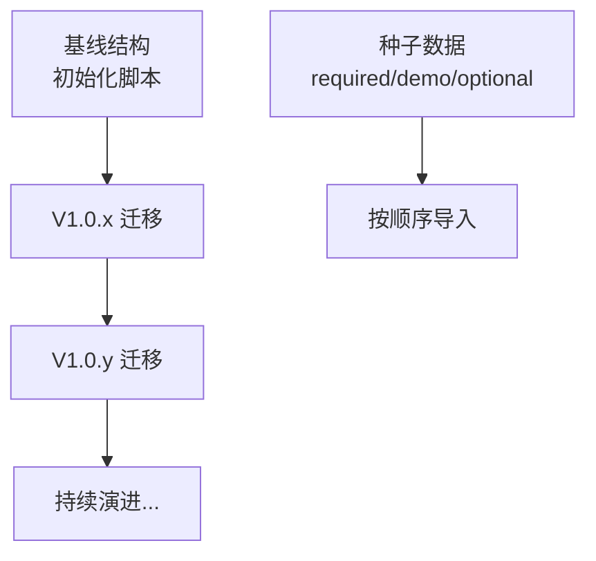

**图表来源**
- [V1.0.0__baseline.sql:1-4](file://forge-server/db/migration/V1.0.0__baseline.sql#L1-L4)
- [sql-templates.md:232-241](file://.agents/skills/forge-business-flow-development/references/sql-templates.md#L232-L241)
- [init-db.sh:116-131](file://forge-server/scripts/db/init-db.sh#L116-L131)

**章节来源**
- [V1.0.0__baseline.sql:1-4](file://forge-server/db/migration/V1.0.0__baseline.sql#L1-L4)
- [sql-templates.md:232-241](file://.agents/skills/forge-business-flow-development/references/sql-templates.md#L232-L241)
- [init-db.sh:116-131](file://forge-server/scripts/db/init-db.sh#L116-L131)

### 索引优化方案
- 联合索引：为高频查询组合列建立索引，例如租户+角色名、租户+父组织等，提升过滤与排序效率。
- 唯一索引：为租户内唯一业务键添加唯一索引，防止重复数据。
- 迁移阶段索引：在迁移脚本中按需新增或重建索引，避免线上大表锁长时间占用。

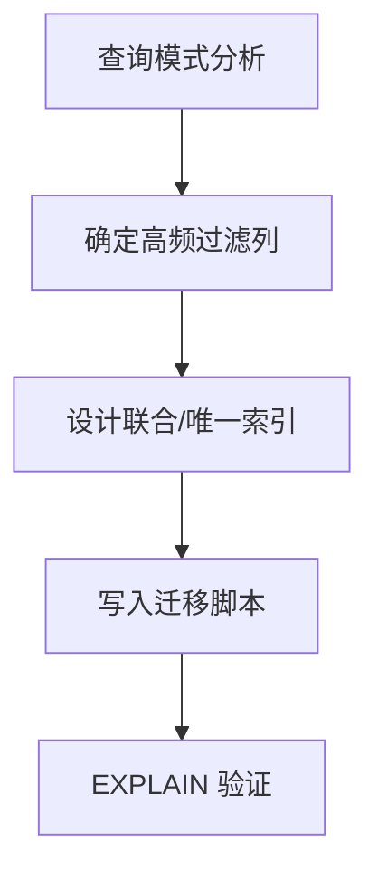

**图表来源**
- [tenant_migration.sql:93-106](file://forge-server/forge-framework/forge-starter-parent/forge-starter-tenant/src/main/resources/sql/tenant_migration.sql#L93-L106)

**章节来源**
- [tenant_migration.sql:93-106](file://forge-server/forge-framework/forge-starter-parent/forge-starter-tenant/src/main/resources/sql/tenant_migration.sql#L93-L106)

### Flyway 数据库版本管理与迁移策略
- 启用方式：可通过环境变量控制 Flyway 启用与迁移目录；默认关闭以避免误改库。
- 基线策略：设置基线版本与历史表名，支持存量库平滑接入。
- 迁移规范：文件名遵循 V版本号__描述.sql；禁止修改已执行迁移；SQL 中避免占位符被错误解析。

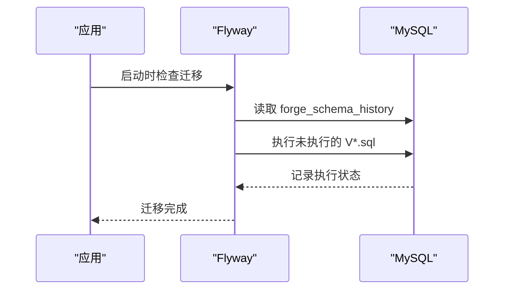

**图表来源**
- [application.yml:65-72](file://forge-server/forge-admin-server/src/main/resources/application.yml#L65-L72)
- [README.md:129-165](file://forge-server/db/README.md#L129-L165)

**章节来源**
- [application.yml:65-72](file://forge-server/forge-admin-server/src/main/resources/application.yml#L65-L72)
- [README.md:129-165](file://forge-server/db/README.md#L129-L165)
- [sql-templates.md:232-241](file://.agents/skills/forge-business-flow-development/references/sql-templates.md#L232-L241)

### 数据迁移与种子数据管理
- 初始化流程：脚本创建数据库、执行初始化脚本、导入必需种子数据，可选导入演示与可选模块数据。
- 分类管理：required 为系统必需；demo 为演示；optional 为可选模块。
- 安全校验：导出前进行 dry-run 检查，确保迁移与种子命名规范、白名单/黑名单与敏感字段规则正确。

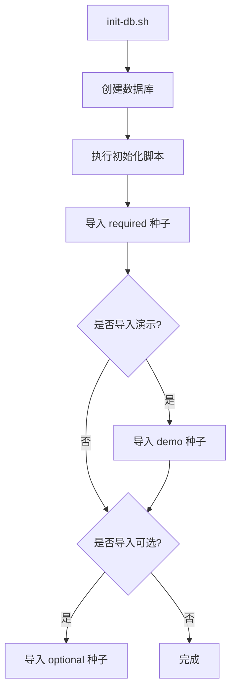

**图表来源**
- [init-db.sh:88-133](file://forge-server/scripts/db/init-db.sh#L88-L133)
- [README.md:45-91](file://forge-server/db/README.md#L45-L91)

**章节来源**
- [init-db.sh:88-133](file://forge-server/scripts/db/init-db.sh#L88-L133)
- [README.md:45-91](file://forge-server/db/README.md#L45-L91)
- [README.md:260-348](file://forge-server/db/README.md#L260-L348)

### 主从复制、读写分离与连接池配置
- 主从复制：推荐 MySQL 8.0+ 原生复制；结合应用侧读写分离策略，读请求走从库，写请求走主库。
- 读写分离：当前示例配置仅定义 master 数据源；可在动态数据源基础上扩展 slave 数据源与路由规则。
- 连接池：使用 HikariCP，配置最大连接数、空闲超时、生命周期与保活时间；批处理语句开启以提升批量操作性能。

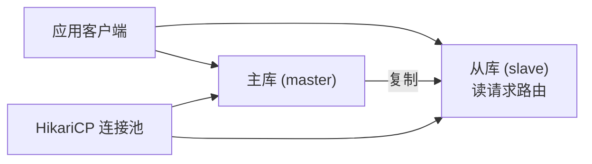

**图表来源**
- [application-dev.example.yml:1-33](file://forge-server/forge-admin-server/src/main/resources/application-dev.example.yml#L1-L33)

**章节来源**
- [application-dev.example.yml:1-33](file://forge-server/forge-admin-server/src/main/resources/application-dev.example.yml#L1-L33)

### 连接池与外部数据源
- 主数据源：HikariCP 参数包括最大连接数、最小空闲、连接超时、空闲超时、最大生命周期与保活时间。
- 外部数据源：插件在运行时根据连接配置动态创建独立 HikariDataSource，便于多租户或多业务域的数据访问隔离。

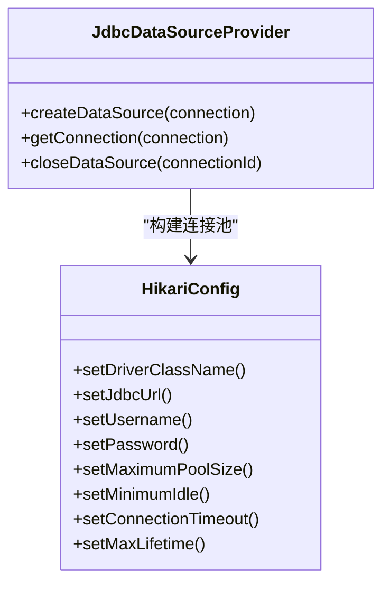

**图表来源**
- [JdbcDataSourceProvider.java:36-69](file://forge-server/forge-framework/forge-plugin-parent/forge-plugin-data/src/main/java/com/mdframe/forge/plugin/data/support/JdbcDataSourceProvider.java#L36-L69)
- [application-dev.example.yml:19-33](file://forge-server/forge-admin-server/src/main/resources/application-dev.example.yml#L19-L33)

**章节来源**
- [JdbcDataSourceProvider.java:36-69](file://forge-server/forge-framework/forge-plugin-parent/forge-plugin-data/src/main/java/com/mdframe/forge/plugin/data/support/JdbcDataSourceProvider.java#L36-L69)
- [application-dev.example.yml:19-33](file://forge-server/forge-admin-server/src/main/resources/application-dev.example.yml#L19-L33)

### 数据备份与恢复
- 安全导出：脚本默认排除运行期/历史表与敏感配置表，生成包含 DDL 与安全 INSERT 的单一 SQL 文件。
- 恢复流程：在生产环境恢复前应先 dry-run 校验，确认忽略表与敏感数据策略符合预期。

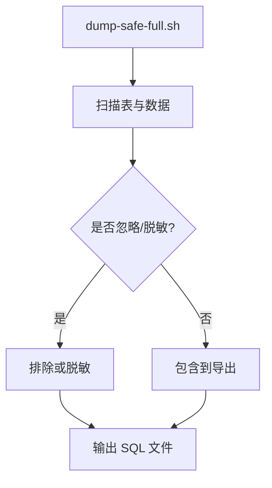

**图表来源**
- [dump-safe-full.sh:1-32](file://forge-server/scripts/db/dump-safe-full.sh#L1-L32)

**章节来源**
- [dump-safe-full.sh:1-32](file://forge-server/scripts/db/dump-safe-full.sh#L1-L32)

### 数据一致性保证与事务边界
- 事务边界：业务命令应封装在本地事务中，失败回滚；幂等键与状态迁移需配合结构化审计摘要。
- 并发控制：状态迁移使用 expected-status 条件更新，影响行数为 0 即视为冲突并回滚，避免竞态。
- 审计与归档：动作日志记录版本、幂等键、可信操作者引用与脱敏后的字段变化；归档任务按保留策略清理。

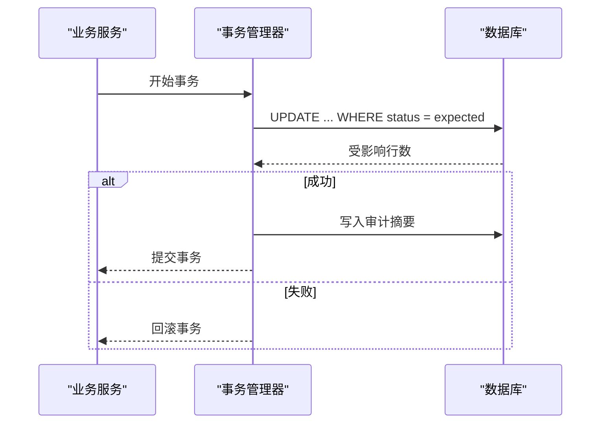

**图表来源**
- [spec.md:67-75](file://code-copilot/changes/lowcode-offline-draft-replay/spec.md#L67-L75)

**章节来源**
- [spec.md:67-75](file://code-copilot/changes/lowcode-offline-draft-replay/spec.md#L67-L75)

### ER 图与表关系图
以下 ER 图展示系统核心实体及其关系，体现租户隔离、权限与资源绑定、组织与岗位等关键关联。

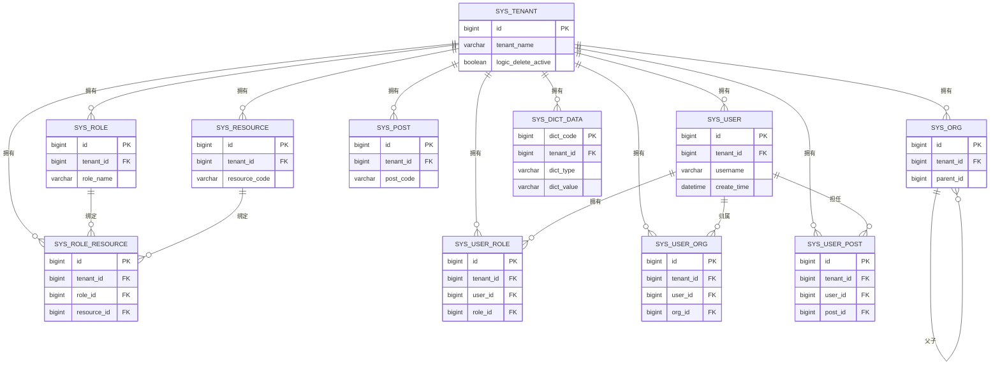

**图表来源**
- [V1.0.6__add_logic_delete_to_tenant_table.sql:22-33](file://forge-server/db/migration/V1.0.6__add_logic_delete_to_tenant_table.sql#L22-L33)
- [tenant_migration.sql:93-106](file://forge-server/forge-framework/forge-starter-parent/forge-starter-tenant/src/main/resources/sql/tenant_migration.sql#L93-L106)

## 依赖关系分析
- 应用与数据库：应用通过动态数据源访问 MySQL；Flyway 在启动或手动模式下执行迁移。
- 脚本与数据库：初始化与安全导出脚本直接操作 MySQL，负责建库、导入数据与导出备份。
- 插件与数据源：运行时外部数据源通过插件动态创建独立连接池，避免与主数据源耦合。

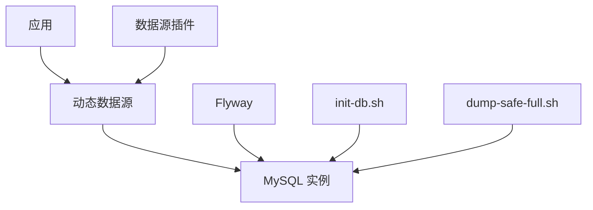

**图表来源**
- [application.yml:65-72](file://forge-server/forge-admin-server/src/main/resources/application.yml#L65-L72)
- [application-dev.example.yml:1-33](file://forge-server/forge-admin-server/src/main/resources/application-dev.example.yml#L1-L33)
- [init-db.sh:88-133](file://forge-server/scripts/db/init-db.sh#L88-L133)
- [dump-safe-full.sh:1-32](file://forge-server/scripts/db/dump-safe-full.sh#L1-L32)
- [JdbcDataSourceProvider.java:36-69](file://forge-server/forge-framework/forge-plugin-parent/forge-plugin-data/src/main/java/com/mdframe/forge/plugin/data/support/JdbcDataSourceProvider.java#L36-L69)

**章节来源**
- [application.yml:65-72](file://forge-server/forge-admin-server/src/main/resources/application.yml#L65-L72)
- [application-dev.example.yml:1-33](file://forge-server/forge-admin-server/src/main/resources/application-dev.example.yml#L1-L33)
- [init-db.sh:88-133](file://forge-server/scripts/db/init-db.sh#L88-L133)
- [dump-safe-full.sh:1-32](file://forge-server/scripts/db/dump-safe-full.sh#L1-L32)
- [JdbcDataSourceProvider.java:36-69](file://forge-server/forge-framework/forge-plugin-parent/forge-plugin-data/src/main/java/com/mdframe/forge/plugin/data/support/JdbcDataSourceProvider.java#L36-L69)

## 性能考虑
- 连接池调优：合理设置最大连接数、空闲超时与生命周期，避免连接泄漏与频繁创建销毁。
- 批处理优化：开启 rewriteBatchedStatements 提升批量插入/更新/删除性能，但需注意对数据库的压力。
- 查询优化：消除 N+1 查询、避免 LIKE 全匹配、使用 FIND_IN_SET 替代多路 LIKE、子查询改为 JOIN 派生表聚合、统计查询增加时间范围限制。
- 索引策略：为高频过滤列建立联合索引，避免全表扫描；唯一索引保障数据一致性。

[本节为通用指导，不直接分析具体文件]

## 故障排查指南
- 迁移失败：检查 flyway.enabled 与 locations 配置；确认迁移文件命名与内容符合规范；查看 forge_schema_history 记录定位问题。
- 连接池异常：核对 HikariCP 参数与数据库连接信息；关注连接超时、空闲超时与最大生命周期设置。
- 多租户越权：确认租户上下文是否正确注入；检查行级过滤是否生效；核查联合索引是否覆盖查询路径。
- 备份异常：使用 dry-run 检查导出策略；确认忽略表与敏感字段规则；核对输出 SQL 完整性。

**章节来源**
- [application.yml:65-72](file://forge-server/forge-admin-server/src/main/resources/application.yml#L65-L72)
- [application-dev.example.yml:19-33](file://forge-server/forge-admin-server/src/main/resources/application-dev.example.yml#L19-L33)
- [tenant_migration.sql:93-106](file://forge-server/forge-framework/forge-starter-parent/forge-starter-tenant/src/main/resources/sql/tenant_migration.sql#L93-L106)
- [dump-safe-full.sh:1-32](file://forge-server/scripts/db/dump-safe-full.sh#L1-L32)

## 结论
Forge Admin 的数据库架构以 MySQL 8.0+ 为基础，通过 Flyway 版本化迁移与分类种子数据管理实现结构演进与数据初始化；借助租户上下文与联合索引达成高效的多租户隔离；使用 HikariCP 与插件化数据源满足主从复制、读写分离与扩展数据源需求；配套的安全导出与初始化脚本保障备份恢复与部署一致性。建议在上线前完善主从复制与读写分离路由，并结合查询优化与索引策略持续提升性能。

## 附录
- 常用命令：
  - 初始化数据库：参考 init-db.sh 帮助与示例
  - 启用 Flyway 自动迁移：设置环境变量后启动服务
  - 安全导出：使用 dump-safe-full.sh 进行 dry-run 与正式导出

**章节来源**
- [README.md:45-91](file://forge-server/db/README.md#L45-L91)
- [README.md:129-165](file://forge-server/db/README.md#L129-L165)
- [init-db.sh:16-31](file://forge-server/scripts/db/init-db.sh#L16-L31)
- [dump-safe-full.sh:24-32](file://forge-server/scripts/db/dump-safe-full.sh#L24-L32)