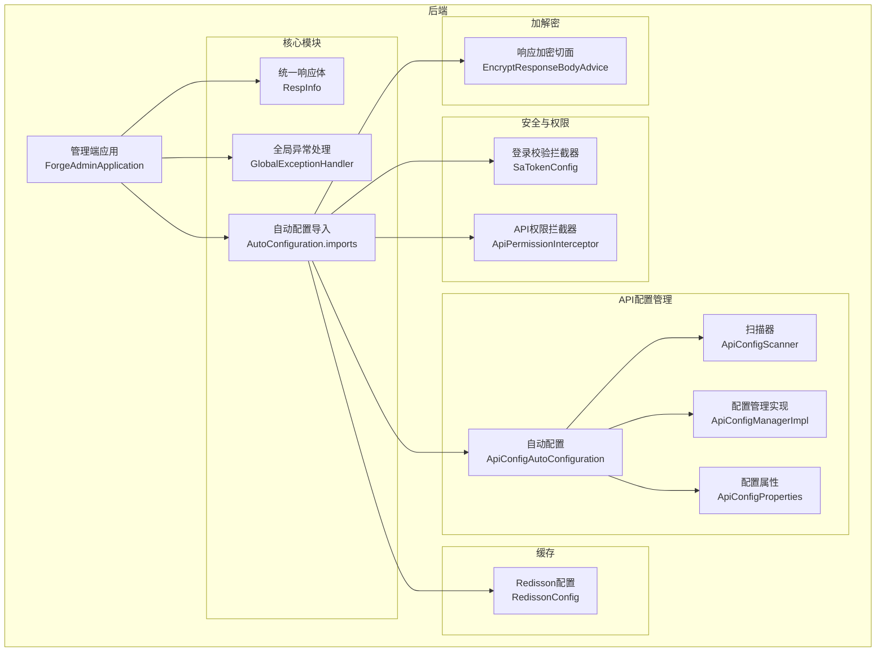
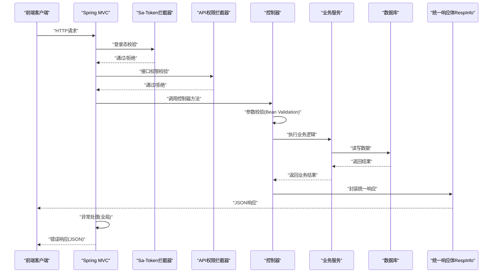
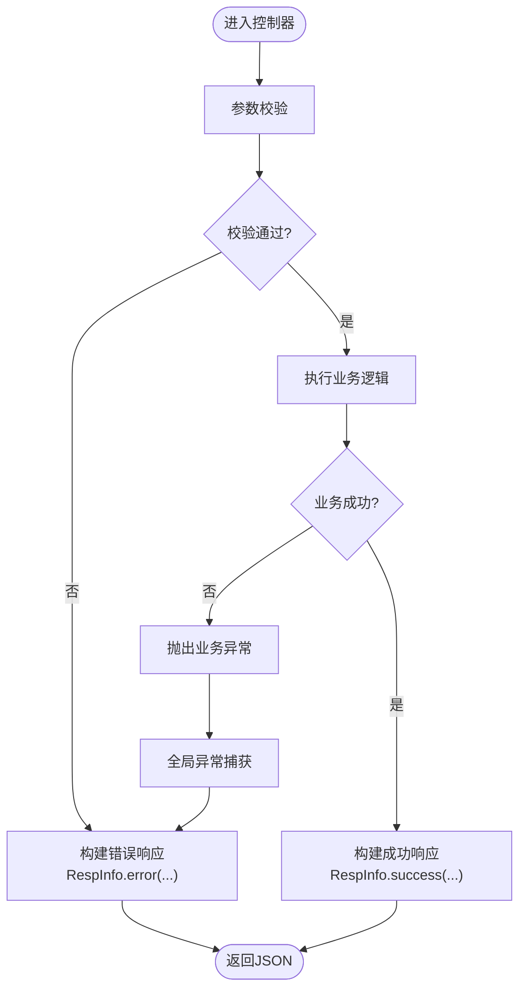
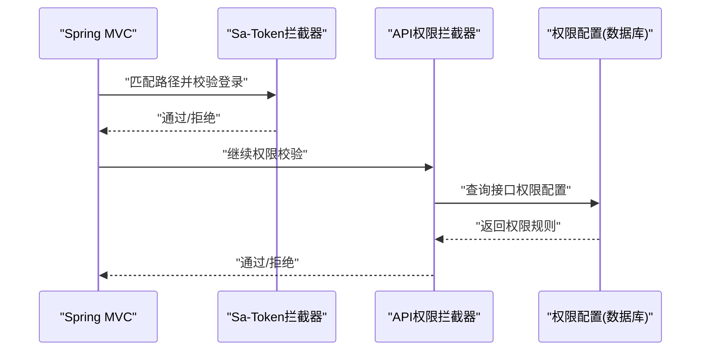
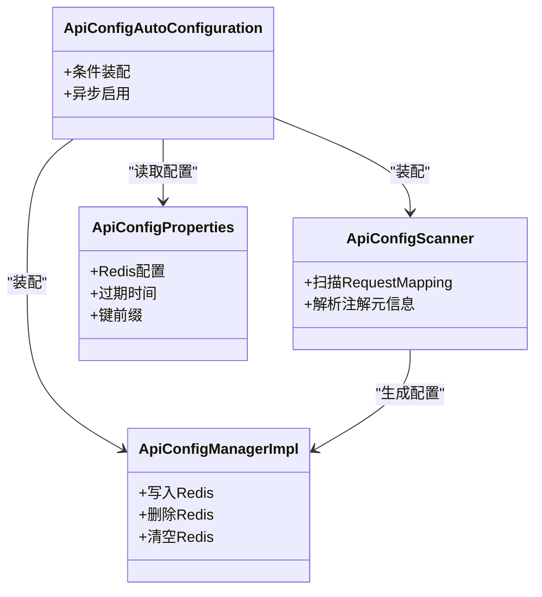
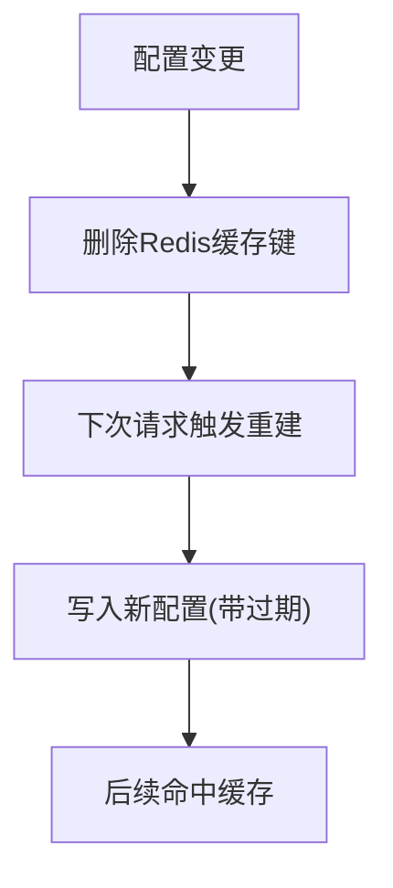
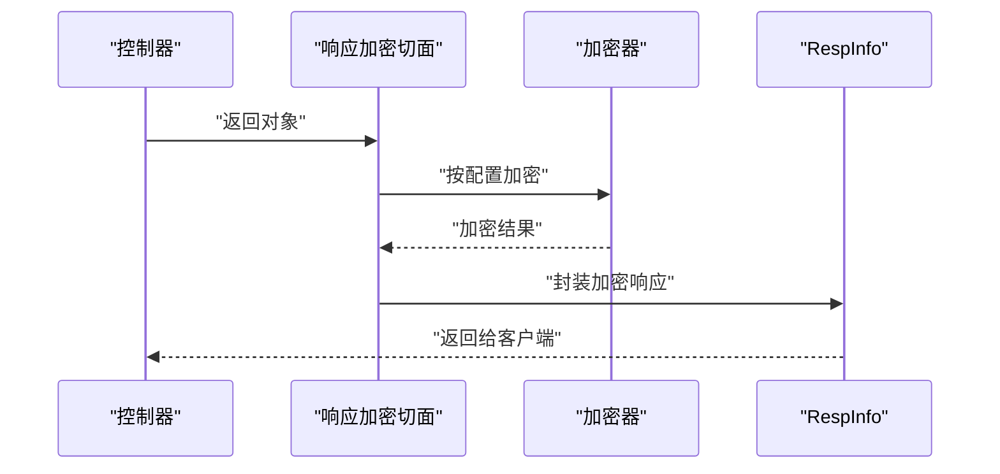
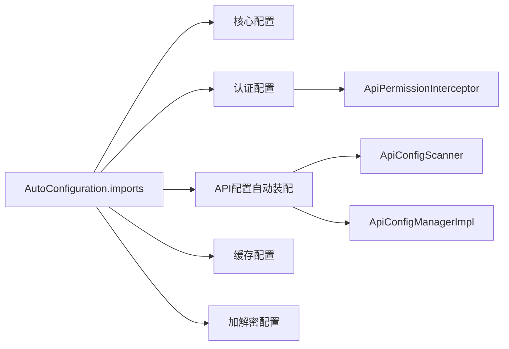

# 数据流设计

<cite>
**本文引用的文件**
- [ForgeAdminApplication.java](file://forge/forge-admin/src/main/java/com/mdframe/forge/admin/ForgeAdminApplication.java)
- [GlobalExceptionHandler.java](file://forge/forge-framework/forge-starter-parent/forge-starter-core/src/main/java/com/mdframe/forge/starter/core/exception/GlobalExceptionHandler.java)
- [RespInfo.java](file://forge/forge-framework/forge-starter-parent/forge-starter-core/src/main/java/com/mdframe/forge/starter/core/domain/RespInfo.java)
- [ApiPermissionInterceptor.java](file://forge/forge-framework/forge-starter-parent/forge-starter-auth/src/main/java/com/mdframe/forge/starter/auth/interceptor/ApiPermissionInterceptor.java)
- [SaTokenConfig.java](file://forge/forge-framework/forge-starter-parent/forge-starter-auth/src/main/java/com/mdframe/forge/starter/auth/config/SaTokenConfig.java)
- [ApiConfigAutoConfiguration.java](file://forge/forge-framework/forge-starter-parent/forge-starter-api-config/src/main/java/com/mdframe/forge/starter/apiconfig/config/ApiConfigAutoConfiguration.java)
- [ApiConfigScanner.java](file://forge/forge-framework/forge-starter-parent/forge-starter-api-config/src/main/java/com/mdframe/forge/starter/apiconfig/registry/ApiConfigScanner.java)
- [ApiConfigManagerImpl.java](file://forge/forge-framework/forge-starter-parent/forge-starter-api-config/src/main/java/com/mdframe/forge/starter/apiconfig/service/impl/ApiConfigManagerImpl.java)
- [ApiConfigProperties.java](file://forge/forge-framework/forge-starter-parent/forge-starter-api-config/src/main/java/com/mdframe/forge/starter/apiconfig/config/ApiConfigProperties.java)
- [EncryptResponseBodyAdvice.java](file://forge/forge-framework/forge-starter-parent/forge-starter-crypto/src/main/java/com/mdframe/forge/starter/crypto/advice/EncryptResponseBodyAdvice.java)
- [RedissonConfig.java](file://forge/forge-framework/forge-starter-parent/forge-starter-cache/src/main/java/com/mdframe/forge/starter/cache/config/RedissonConfig.java)
- [org.springframework.boot.autoconfigure.AutoConfiguration.imports](file://forge/forge-framework/forge-starter-parent/forge-starter-core/src/main/resources/META-INF/spring/org.springframework.boot.autoconfigure.AutoConfiguration.imports)
</cite>

## 目录
1. [引言](#引言)
2. [项目结构](#项目结构)
3. [核心组件](#核心组件)
4. [架构总览](#架构总览)
5. [详细组件分析](#详细组件分析)
6. [依赖关系分析](#依赖关系分析)
7. [性能考虑](#性能考虑)
8. [故障排查指南](#故障排查指南)
9. [结论](#结论)
10. [附录](#附录)

## 引言
本文件面向Forge框架的数据流设计，系统性梳理从“用户请求”到“数据库存储”的完整数据流程，覆盖请求接收、参数验证、业务处理、数据持久化、缓存与一致性、安全与加密、错误处理与性能优化等关键环节。文档以可视化图示呈现典型业务场景的数据流转时序，并给出可操作的优化建议与排障指引。

## 项目结构
Forge采用前后端分离架构：前端为Vue3应用，后端为基于Spring Boot的微服务模块集合。核心模块包括认证鉴权、API配置管理、缓存、加解密、ORM、事务、日志与异常处理等。启动入口位于管理端应用，通过自动装配加载各starter模块。

图表来源
- [ForgeAdminApplication.java](file://forge/forge-admin/src/main/java/com/mdframe/forge/admin/ForgeAdminApplication.java#L1-L18)
- [RespInfo.java](file://forge/forge-framework/forge-starter-parent/forge-starter-core/src/main/java/com/mdframe/forge/starter/core/domain/RespInfo.java#L1-L97)
- [GlobalExceptionHandler.java](file://forge/forge-framework/forge-starter-parent/forge-starter-core/src/main/java/com/mdframe/forge/starter/core/exception/GlobalExceptionHandler.java#L1-L175)
- [org.springframework.boot.autoconfigure.AutoConfiguration.imports](file://forge/forge-framework/forge-starter-parent/forge-starter-core/src/main/resources/META-INF/spring/org.springframework.boot.autoconfigure.AutoConfiguration.imports#L1-L3)
- [SaTokenConfig.java](file://forge/forge-framework/forge-starter-parent/forge-starter-auth/src/main/java/com/mdframe/forge/starter/auth/config/SaTokenConfig.java#L22-L53)
- [ApiPermissionInterceptor.java](file://forge/forge-framework/forge-starter-parent/forge-starter-auth/src/main/java/com/mdframe/forge/starter/auth/interceptor/ApiPermissionInterceptor.java#L1-L43)
- [ApiConfigAutoConfiguration.java](file://forge/forge-framework/forge-starter-parent/forge-starter-api-config/src/main/java/com/mdframe/forge/starter/apiconfig/config/ApiConfigAutoConfiguration.java#L1-L27)
- [ApiConfigScanner.java](file://forge/forge-framework/forge-starter-parent/forge-starter-api-config/src/main/java/com/mdframe/forge/starter/apiconfig/registry/ApiConfigScanner.java#L1-L33)
- [ApiConfigManagerImpl.java](file://forge/forge-framework/forge-starter-parent/forge-starter-api-config/src/main/java/com/mdframe/forge/starter/apiconfig/service/impl/ApiConfigManagerImpl.java#L332-L367)
- [ApiConfigProperties.java](file://forge/forge-framework/forge-starter-parent/forge-starter-api-config/src/main/java/com/mdframe/forge/starter/apiconfig/config/ApiConfigProperties.java#L62-L86)
- [RedissonConfig.java](file://forge/forge-framework/forge-starter-parent/forge-starter-cache/src/main/java/com/mdframe/forge/starter/cache/config/RedissonConfig.java#L1-L34)
- [EncryptResponseBodyAdvice.java](file://forge/forge-framework/forge-starter-parent/forge-starter-crypto/src/main/java/com/mdframe/forge/starter/crypto/advice/EncryptResponseBodyAdvice.java#L1-L26)

章节来源
- [ForgeAdminApplication.java](file://forge/forge-admin/src/main/java/com/mdframe/forge/admin/ForgeAdminApplication.java#L1-L18)
- [org.springframework.boot.autoconfigure.AutoConfiguration.imports](file://forge/forge-framework/forge-starter-parent/forge-starter-core/src/main/resources/META-INF/spring/org.springframework.boot.autoconfigure.AutoConfiguration.imports#L1-L3)

## 核心组件
- 统一响应体RespInfo：标准化HTTP响应结构，包含状态码、消息、数据与时间戳，贯穿所有控制器返回。
- 全局异常处理器：集中捕获并转换各类异常为统一响应，保障前端稳定消费。
- 安全与权限：基于Sa-Token的登录拦截与API权限拦截，结合数据库配置实现细粒度接口权限控制。
- API配置管理：扫描Controller注解，动态维护API配置，支持Redis缓存与异步刷新。
- 缓存：Redisson配置，使用Jackson时间模块编码，提升序列化兼容性。
- 加解密：响应侧加密切面，按API配置决定是否对响应体进行加密包装。
- 启动与装配：通过AutoConfiguration.imports自动装配核心组件。

章节来源
- [RespInfo.java](file://forge/forge-framework/forge-starter-parent/forge-starter-core/src/main/java/com/mdframe/forge/starter/core/domain/RespInfo.java#L1-L97)
- [GlobalExceptionHandler.java](file://forge/forge-framework/forge-starter-parent/forge-starter-core/src/main/java/com/mdframe/forge/starter/core/exception/GlobalExceptionHandler.java#L1-L175)
- [ApiConfigAutoConfiguration.java](file://forge/forge-framework/forge-starter-parent/forge-starter-api-config/src/main/java/com/mdframe/forge/starter/apiconfig/config/ApiConfigAutoConfiguration.java#L1-L27)
- [ApiConfigScanner.java](file://forge/forge-framework/forge-starter-parent/forge-starter-api-config/src/main/java/com/mdframe/forge/starter/apiconfig/registry/ApiConfigScanner.java#L1-L33)
- [ApiConfigManagerImpl.java](file://forge/forge-framework/forge-starter-parent/forge-starter-api-config/src/main/java/com/mdframe/forge/starter/apiconfig/service/impl/ApiConfigManagerImpl.java#L332-L367)
- [ApiConfigProperties.java](file://forge/forge-framework/forge-starter-parent/forge-starter-api-config/src/main/java/com/mdframe/forge/starter/apiconfig/config/ApiConfigProperties.java#L62-L86)
- [RedissonConfig.java](file://forge/forge-framework/forge-starter-parent/forge-starter-cache/src/main/java/com/mdframe/forge/starter/cache/config/RedissonConfig.java#L1-L34)
- [EncryptResponseBodyAdvice.java](file://forge/forge-framework/forge-starter-parent/forge-starter-crypto/src/main/java/com/mdframe/forge/starter/crypto/advice/EncryptResponseBodyAdvice.java#L1-L26)

## 架构总览
下图展示一次典型请求从进入系统到返回响应的关键路径，涵盖鉴权、权限校验、参数校验、业务处理、异常处理与响应封装。

图表来源
- [SaTokenConfig.java](file://forge/forge-framework/forge-starter-parent/forge-starter-auth/src/main/java/com/mdframe/forge/starter/auth/config/SaTokenConfig.java#L22-L53)
- [ApiPermissionInterceptor.java](file://forge/forge-framework/forge-starter-parent/forge-starter-auth/src/main/java/com/mdframe/forge/starter/auth/interceptor/ApiPermissionInterceptor.java#L1-L43)
- [GlobalExceptionHandler.java](file://forge/forge-framework/forge-starter-parent/forge-starter-core/src/main/java/com/mdframe/forge/starter/core/exception/GlobalExceptionHandler.java#L1-L175)
- [RespInfo.java](file://forge/forge-framework/forge-starter-parent/forge-starter-core/src/main/java/com/mdframe/forge/starter/core/domain/RespInfo.java#L1-L97)

## 详细组件分析

### 统一响应体与异常处理
- 统一响应体RespInfo：提供成功/失败/自定义构建方法，统一输出结构，便于前端解析与展示。
- 全局异常处理器：覆盖参数校验、缺失参数、类型不匹配、请求方法不支持、访问拒绝、文件大小超限、空指针、非法参数、运行时异常与未知异常，确保错误信息标准化。

图表来源
- [RespInfo.java](file://forge/forge-framework/forge-starter-parent/forge-starter-core/src/main/java/com/mdframe/forge/starter/core/domain/RespInfo.java#L1-L97)
- [GlobalExceptionHandler.java](file://forge/forge-framework/forge-starter-parent/forge-starter-core/src/main/java/com/mdframe/forge/starter/core/exception/GlobalExceptionHandler.java#L1-L175)

章节来源
- [RespInfo.java](file://forge/forge-framework/forge-starter-parent/forge-starter-core/src/main/java/com/mdframe/forge/starter/core/domain/RespInfo.java#L1-L97)
- [GlobalExceptionHandler.java](file://forge/forge-framework/forge-starter-parent/forge-starter-core/src/main/java/com/mdframe/forge/starter/core/exception/GlobalExceptionHandler.java#L1-L175)

### 安全与权限拦截链
- 登录拦截：排除登录、注册、重置密码、验证码、静态资源、Swagger、健康检查、WebSocket等路径，其余全部校验登录态。
- API权限拦截：根据配置开关与数据库资源表，对受控接口进行权限校验；支持忽略注解与白名单路径。

图表来源
- [SaTokenConfig.java](file://forge/forge-framework/forge-starter-parent/forge-starter-auth/src/main/java/com/mdframe/forge/starter/auth/config/SaTokenConfig.java#L22-L53)
- [ApiPermissionInterceptor.java](file://forge/forge-framework/forge-starter-parent/forge-starter-auth/src/main/java/com/mdframe/forge/starter/auth/interceptor/ApiPermissionInterceptor.java#L1-L43)

章节来源
- [SaTokenConfig.java](file://forge/forge-framework/forge-starter-parent/forge-starter-auth/src/main/java/com/mdframe/forge/starter/auth/config/SaTokenConfig.java#L22-L53)
- [ApiPermissionInterceptor.java](file://forge/forge-framework/forge-starter-parent/forge-starter-auth/src/main/java/com/mdframe/forge/starter/auth/interceptor/ApiPermissionInterceptor.java#L1-L43)

### API配置管理与缓存
- 自动配置：启用API配置管理功能，开启异步刷新能力，注入扫描器与管理器。
- 扫描器：解析Controller中@RequestMapping，提取注解元信息，构建API配置。
- 管理器：将配置写入Redis缓存，支持过期时间与键前缀；提供批量清理与删除。
- 属性：可配置Redis缓存开关、过期时间与键前缀。

图表来源
- [ApiConfigAutoConfiguration.java](file://forge/forge-framework/forge-starter-parent/forge-starter-api-config/src/main/java/com/mdframe/forge/starter/apiconfig/config/ApiConfigAutoConfiguration.java#L1-L27)
- [ApiConfigScanner.java](file://forge/forge-framework/forge-starter-parent/forge-starter-api-config/src/main/java/com/mdframe/forge/starter/apiconfig/registry/ApiConfigScanner.java#L1-L33)
- [ApiConfigManagerImpl.java](file://forge/forge-framework/forge-starter-parent/forge-starter-api-config/src/main/java/com/mdframe/forge/starter/apiconfig/service/impl/ApiConfigManagerImpl.java#L332-L367)
- [ApiConfigProperties.java](file://forge/forge-framework/forge-starter-parent/forge-starter-api-config/src/main/java/com/mdframe/forge/starter/apiconfig/config/ApiConfigProperties.java#L62-L86)

章节来源
- [ApiConfigAutoConfiguration.java](file://forge/forge-framework/forge-starter-parent/forge-starter-api-config/src/main/java/com/mdframe/forge/starter/apiconfig/config/ApiConfigAutoConfiguration.java#L1-L27)
- [ApiConfigScanner.java](file://forge/forge-framework/forge-starter-parent/forge-starter-api-config/src/main/java/com/mdframe/forge/starter/apiconfig/registry/ApiConfigScanner.java#L1-L33)
- [ApiConfigManagerImpl.java](file://forge/forge-framework/forge-starter-parent/forge-starter-api-config/src/main/java/com/mdframe/forge/starter/apiconfig/service/impl/ApiConfigManagerImpl.java#L332-L367)
- [ApiConfigProperties.java](file://forge/forge-framework/forge-starter-parent/forge-starter-api-config/src/main/java/com/mdframe/forge/starter/apiconfig/config/ApiConfigProperties.java#L62-L86)

### 缓存策略与一致性
- Redisson配置：使用Jackson时间模块编码，确保Java 8时间类型的序列化兼容。
- API配置缓存：管理器在写入Redis时设置过期时间，避免缓存常驻内存；提供批量删除与清空能力，保障配置变更后的最终一致性。
- 一致性策略：通过过期时间与显式删除实现“写后失效”，结合异步刷新降低热点命中成本。

图表来源
- [RedissonConfig.java](file://forge/forge-framework/forge-starter-parent/forge-starter-cache/src/main/java/com/mdframe/forge/starter/cache/config/RedissonConfig.java#L1-L34)
- [ApiConfigManagerImpl.java](file://forge/forge-framework/forge-starter-parent/forge-starter-api-config/src/main/java/com/mdframe/forge/starter/apiconfig/service/impl/ApiConfigManagerImpl.java#L332-L367)
- [ApiConfigProperties.java](file://forge/forge-framework/forge-starter-parent/forge-starter-api-config/src/main/java/com/mdframe/forge/starter/apiconfig/config/ApiConfigProperties.java#L62-L86)

章节来源
- [RedissonConfig.java](file://forge/forge-framework/forge-starter-parent/forge-starter-cache/src/main/java/com/mdframe/forge/starter/cache/config/RedissonConfig.java#L1-L34)
- [ApiConfigManagerImpl.java](file://forge/forge-framework/forge-starter-parent/forge-starter-api-config/src/main/java/com/mdframe/forge/starter/apiconfig/service/impl/ApiConfigManagerImpl.java#L332-L367)
- [ApiConfigProperties.java](file://forge/forge-framework/forge-starter-parent/forge-starter-api-config/src/main/java/com/mdframe/forge/starter/apiconfig/config/ApiConfigProperties.java#L62-L86)

### 加密与数据安全
- 响应加密切面：根据API配置与注解标记，对响应体进行加密包装，结合会话密钥存储与交换机制，保障敏感数据传输安全。
- 建议：对高敏字段（如密码、身份证、银行卡号）在业务层与持久化层均实施脱敏与最小化存储策略。

图表来源
- [EncryptResponseBodyAdvice.java](file://forge/forge-framework/forge-starter-parent/forge-starter-crypto/src/main/java/com/mdframe/forge/starter/crypto/advice/EncryptResponseBodyAdvice.java#L1-L26)

章节来源
- [EncryptResponseBodyAdvice.java](file://forge/forge-framework/forge-starter-parent/forge-starter-crypto/src/main/java/com/mdframe/forge/starter/crypto/advice/EncryptResponseBodyAdvice.java#L1-L26)

## 依赖关系分析
- 自动装配导入：通过AutoConfiguration.imports声明核心配置类，确保启动时自动装配。
- 模块耦合：API配置管理依赖扫描器与管理器；权限拦截依赖配置管理与属性；缓存依赖Redisson；加解密依赖API配置与加密器工厂。

图表来源
- [org.springframework.boot.autoconfigure.AutoConfiguration.imports](file://forge/forge-framework/forge-starter-parent/forge-starter-core/src/main/resources/META-INF/spring/org.springframework.boot.autoconfigure.AutoConfiguration.imports#L1-L3)
- [ApiConfigAutoConfiguration.java](file://forge/forge-framework/forge-starter-parent/forge-starter-api-config/src/main/java/com/mdframe/forge/starter/apiconfig/config/ApiConfigAutoConfiguration.java#L1-L27)
- [ApiConfigScanner.java](file://forge/forge-framework/forge-starter-parent/forge-starter-api-config/src/main/java/com/mdframe/forge/starter/apiconfig/registry/ApiConfigScanner.java#L1-L33)
- [ApiConfigManagerImpl.java](file://forge/forge-framework/forge-starter-parent/forge-starter-api-config/src/main/java/com/mdframe/forge/starter/apiconfig/service/impl/ApiConfigManagerImpl.java#L332-L367)
- [ApiPermissionInterceptor.java](file://forge/forge-framework/forge-starter-parent/forge-starter-auth/src/main/java/com/mdframe/forge/starter/auth/interceptor/ApiPermissionInterceptor.java#L1-L43)

章节来源
- [org.springframework.boot.autoconfigure.AutoConfiguration.imports](file://forge/forge-framework/forge-starter-parent/forge-starter-core/src/main/resources/META-INF/spring/org.springframework.boot.autoconfigure.AutoConfiguration.imports#L1-L3)

## 性能考虑
- 参数校验前置：在控制器层尽早发现无效输入，减少无效业务调用。
- 缓存命中优化：合理设置API配置缓存过期时间，降低热点接口的数据库压力。
- 序列化优化：Redisson使用Jackson时间模块，避免时间字段序列化开销。
- 异步刷新：API配置管理启用异步，避免阻塞主线程。
- 响应加密：仅对必要接口启用加密，减少CPU消耗；对大响应体建议分页或压缩。

## 故障排查指南
- 统一错误响应：通过RespInfo统一返回，前端可依据code与message快速定位问题。
- 异常分类处理：全局异常处理器覆盖常见错误类型，便于快速定位是参数问题、权限问题还是系统异常。
- 权限问题：检查API权限拦截器与数据库配置，确认接口是否被正确放行或拦截。
- 缓存问题：若配置未生效，检查Redis键是否存在、过期时间是否正确、是否执行了删除/清空操作。
- 加密问题：确认响应加密切面对应接口已标注加密注解且会话密钥可用。

章节来源
- [RespInfo.java](file://forge/forge-framework/forge-starter-parent/forge-starter-core/src/main/java/com/mdframe/forge/starter/core/domain/RespInfo.java#L1-L97)
- [GlobalExceptionHandler.java](file://forge/forge-framework/forge-starter-parent/forge-starter-core/src/main/java/com/mdframe/forge/starter/core/exception/GlobalExceptionHandler.java#L1-L175)
- [ApiPermissionInterceptor.java](file://forge/forge-framework/forge-starter-parent/forge-starter-auth/src/main/java/com/mdframe/forge/starter/auth/interceptor/ApiPermissionInterceptor.java#L1-L43)
- [ApiConfigManagerImpl.java](file://forge/forge-framework/forge-starter-parent/forge-starter-api-config/src/main/java/com/mdframe/forge/starter/apiconfig/service/impl/ApiConfigManagerImpl.java#L332-L367)

## 结论
Forge框架通过统一响应体、全局异常处理、权限拦截、API配置缓存与加解密切面，构建了清晰、可扩展、可运维的数据流体系。建议在生产环境中结合业务特点进一步细化缓存策略、参数校验规则与加密范围，持续监控关键节点的延迟与错误率，以获得更优的用户体验与系统稳定性。

## 附录
- 关键节点与潜在瓶颈
  - 请求入口：拦截器链路（登录+权限）可能成为瓶颈，需关注白名单配置与规则复杂度。
  - 参数校验：Bean Validation与约束异常处理影响首屏耗时，建议在网关层做基础过滤。
  - 缓存：Redis键数量与过期策略直接影响命中率，需定期评估与优化。
  - 加密：对大响应体的加密成本较高，建议按接口维度精细化启用。
  - 数据库：ORM与事务配置需配合索引与SQL优化，避免慢查询拖累整体吞吐。