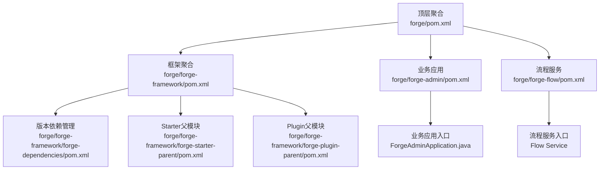
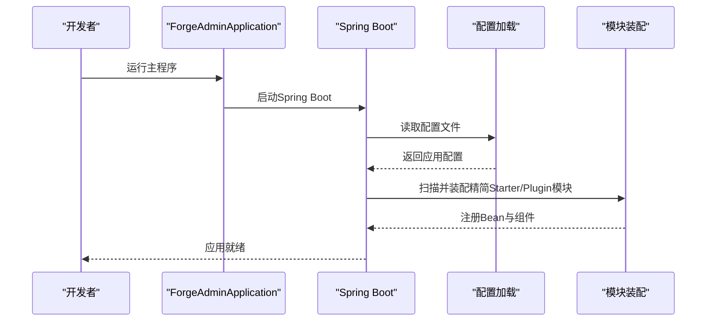
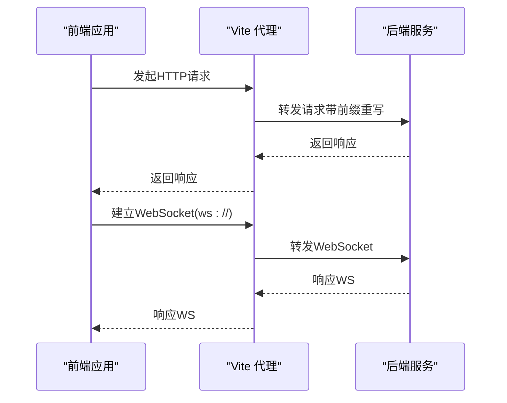
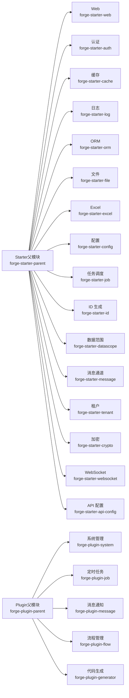
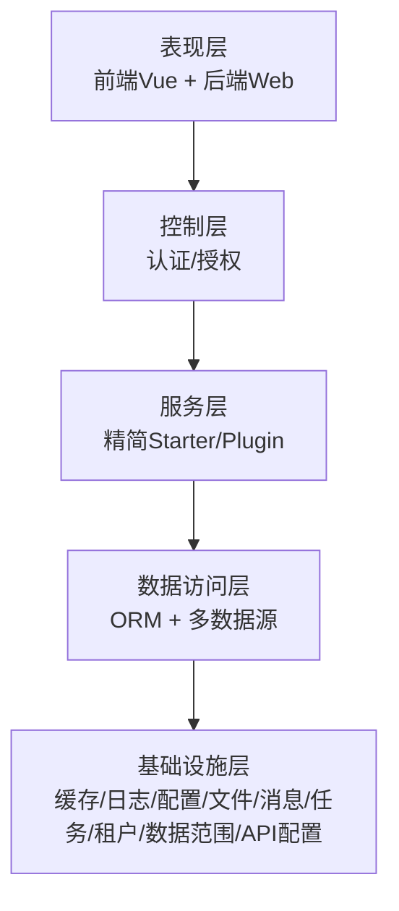
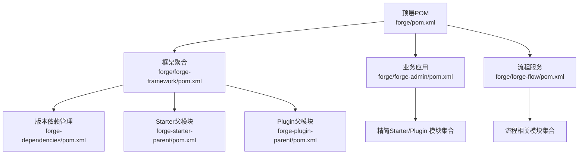

# 架构总览

<cite>
**本文引用的文件**
- [forge/pom.xml](file://forge/pom.xml)
- [forge/forge-framework/pom.xml](file://forge/forge-framework/pom.xml)
- [forge/forge-framework/forge-dependencies/pom.xml](file://forge/forge-framework/forge-dependencies/pom.xml)
- [forge/forge-framework/forge-starter-parent/pom.xml](file://forge/forge-framework/forge-starter-parent/pom.xml)
- [forge/forge-framework/forge-plugin-parent/pom.xml](file://forge/forge-framework/forge-plugin-parent/pom.xml)
- [forge/forge-admin/pom.xml](file://forge/forge-admin/pom.xml)
- [forge/forge-flow/pom.xml](file://forge/forge-flow/pom.xml)
- [forge/forge-admin/src/main/java/com/mdframe/forge/admin/ForgeAdminApplication.java](file://forge/forge-admin/src/main/java/com/mdframe/forge/admin/ForgeAdminApplication.java)
- [forge-admin-ui/package.json](file://forge-admin-ui/package.json)
- [forge-admin-ui/vite.config.js](file://forge-admin-ui/vite.config.js)
- [forge/README.en.md](file://forge/README.en.md)
</cite>

## 更新摘要
**变更内容**
- 更新了模块结构以反映重大架构重组
- 简化了Starter和Plugin模块的数量
- 更新了架构图以展示当前的精简结构
- 调整了依赖分析以符合新的模块组织方式

## 目录
1. [引言](#引言)
2. [项目结构](#项目结构)
3. [核心组件](#核心组件)
4. [架构总览](#架构总览)
5. [详细组件分析](#详细组件分析)
6. [依赖分析](#依赖分析)
7. [性能考虑](#性能考虑)
8. [故障排查指南](#故障排查指南)
9. [结论](#结论)
10. [附录](#附录)

## 引言
本文件面向Forge框架的整体架构总览，旨在帮助开发者快速理解Forge的设计理念、系统边界、前后端分离实现方式、Spring Boot微服务化优势、模块化设计与Maven多模块管理、Starter插件化机制、分层架构（表现层至数据层）以及可扩展性与性能优化策略。Forge采用前后端分离架构，后端基于Spring Boot多模块工程，通过精简的Starter与Plugin两大体系实现功能解耦与复用；前端采用Vue 3 + Vite构建，通过代理与WebSocket连接后端服务。

## 项目结构
Forge采用Maven多模块聚合结构，经过重大架构重组后，顶层聚合模块统一管理版本与插件，子模块分为"框架模块"与"业务模块"两类：
- 顶层聚合：forge（父POM），负责版本属性、插件与仓库配置。
- 框架层：forge-framework（框架聚合），内含版本依赖管理模块forge-dependencies、Starter父模块forge-starter-parent、Plugin父模块forge-plugin-parent。
- 业务层：forge-admin（业务应用）、forge-flow（流程服务），作为后端启动模块，依赖精简后的Starter与Plugin模块。

**更新** 模块结构已简化，从原来的多个Starter和Plugin模块减少到精简的3个主要模块

图表来源
- [forge/pom.xml:114-118](file://forge/pom.xml#L114-L118)
- [forge/forge-framework/pom.xml:30-34](file://forge/forge-framework/pom.xml#L30-L34)
- [forge/forge-framework/forge-dependencies/pom.xml:72-499](file://forge/forge-framework/forge-dependencies/pom.xml#L72-L499)
- [forge/forge-framework/forge-starter-parent/pom.xml:15-35](file://forge/forge-framework/forge-starter-parent/pom.xml#L15-L35)
- [forge/forge-framework/forge-plugin-parent/pom.xml:18-24](file://forge/forge-framework/forge-plugin-parent/pom.xml#L18-L24)
- [forge/forge-admin/pom.xml:1-117](file://forge/forge-admin/pom.xml#L1-L117)
- [forge/forge-flow/pom.xml:1-97](file://forge/forge-flow/pom.xml#L1-L97)

章节来源
- [forge/pom.xml:114-118](file://forge/pom.xml#L114-L118)
- [forge/forge-framework/pom.xml:30-34](file://forge/forge-framework/pom.xml#L30-L34)
- [forge/forge-framework/forge-dependencies/pom.xml:72-499](file://forge/forge-framework/forge-dependencies/pom.xml#L72-L499)
- [forge/forge-framework/forge-starter-parent/pom.xml:15-35](file://forge/forge-framework/forge-starter-parent/pom.xml#L15-L35)
- [forge/forge-framework/forge-plugin-parent/pom.xml:18-24](file://forge/forge-framework/forge-plugin-parent/pom.xml#L18-L24)
- [forge/forge-admin/pom.xml:1-117](file://forge/forge-admin/pom.xml#L1-L117)
- [forge/forge-flow/pom.xml:1-97](file://forge/forge-flow/pom.xml#L1-L97)

## 核心组件
- 后端启动器：ForgeAdminApplication作为Spring Boot入口，扫描com.mdframe.forge包并启用AOP代理，负责装配精简后的Starter与Plugin模块提供的能力。
- 流程服务：forge-flow模块提供独立的流程服务，基于Flowable实现，通过flow-client与业务服务集成。
- 前端应用：基于Vue 3 + Vite，通过Vite代理将HTTP请求转发至后端，WebSocket走/ws前缀代理到同一后端服务，开发期提升联调效率。
- 版本与依赖管理：forge-dependencies集中管理第三方依赖版本，统一由父POM导入，保证各模块一致性与可维护性。
- Starter体系：以forge-starter-*命名的一组模块，覆盖Web、认证、缓存、日志、事务、文件、Excel、配置、任务调度、ID生成、数据范围、消息、租户、加密、WebSocket、API配置等通用能力。
- Plugin体系：以forge-plugin-*命名的一组模块，聚焦系统管理、定时任务、消息通知、流程管理、代码生成等业务能力，便于按需装配。

**更新** 流程服务模块已独立出来，提供专门的流程管理能力

章节来源
- [forge/forge-admin/src/main/java/com/mdframe/forge/admin/ForgeAdminApplication.java:8-15](file://forge/forge-admin/src/main/java/com/mdframe/forge/admin/ForgeAdminApplication.java#L8-L15)
- [forge/forge-flow/pom.xml:16-77](file://forge/forge-flow/pom.xml#L16-L77)
- [forge-admin-ui/vite.config.js:56-87](file://forge-admin-ui/vite.config.js#L56-L87)
- [forge/forge-framework/forge-dependencies/pom.xml:72-499](file://forge/forge-framework/forge-dependencies/pom.xml#L72-L499)
- [forge/forge-framework/forge-starter-parent/pom.xml:15-35](file://forge/forge-framework/forge-starter-parent/pom.xml#L15-L35)
- [forge/forge-framework/forge-plugin-parent/pom.xml:18-24](file://forge/forge-framework/forge-plugin-parent/pom.xml#L18-L24)

## 架构总览
Forge采用前后端分离架构，后端以Spring Boot为核心，通过精简的Starter与Plugin模块化组织功能；前端以Vue 3为基础，借助Vite代理与WebSocket实现与后端的高效通信。整体架构强调模块解耦、可插拔扩展与统一版本治理，经过重组后更加简洁高效。

```mermaid
graph TB
FE["前端应用<br/>Vue 3 + Vite"] --> API["后端接口<br/>Spring Boot 应用"]
WS["WebSocket<br/>/ws 代理"] --> API
subgraph "后端模块"
API --> WEB["Web 层<br/>forge-starter-web"]
API --> AUTH["认证鉴权<br/>forge-starter-auth"]
API --> CACHE["缓存<br/>forge-starter-cache"]
API --> LOG["日志<br/>forge-starter-log"]
API --> ORM["ORM<br/>forge-starter-orm"]
API --> FILE["文件存储<br/>forge-starter-file"]
API --> EXCEL["Excel 导出<br/>forge-starter-excel"]
API --> CONFIG["配置中心<br/>forge-starter-config"]
API --> JOB["任务调度<br/>forge-starter-job"]
API --> ID["ID 生成<br/>forge-starter-id"]
API --> DATASCOPE["数据范围<br/>forge-starter-datascope"]
API --> MSG["消息通道<br/>forge-starter-message"]
API --> TENANT["租户<br/>forge-starter-tenant"]
API --> CRYPTO["加密<br/>forge-starter-crypto"]
API --> WEBSOCKET["WebSocket<br/>forge-starter-websocket"]
API --> APICONF["API 配置<br/>forge-starter-api-config"]
API --> SYS["系统管理<br/>forge-plugin-system"]
API --> JOBPLG["定时任务<br/>forge-plugin-job"]
API --> MSGPLG["消息通知<br/>forge-plugin-message"]
API --> GEN["代码生成<br/>forge-plugin-generator"]
API --> FLOW["流程管理<br/>forge-plugin-flow"]
API --> FLOWCLIENT["流程客户端<br/>forge-flow-client"]
end
```

**更新** 架构已简化，流程服务独立部署，流程客户端通过HTTP调用流程服务

图表来源
- [forge/forge-framework/forge-starter-parent/pom.xml:15-35](file://forge/forge-framework/forge-starter-parent/pom.xml#L15-L35)
- [forge/forge-framework/forge-plugin-parent/pom.xml:18-24](file://forge/forge-framework/forge-plugin-parent/pom.xml#L18-L24)
- [forge/forge-admin/pom.xml:23-80](file://forge/forge-admin/pom.xml#L23-L80)
- [forge/forge-flow/pom.xml:24-63](file://forge/forge-flow/pom.xml#L24-L63)
- [forge-admin-ui/vite.config.js:56-87](file://forge-admin-ui/vite.config.js#L56-L87)

## 详细组件分析

### 后端启动与装配流程
后端通过ForgeAdminApplication启动Spring Boot应用，扫描com.mdframe.forge包并启用AOP代理，随后由Maven依赖链注入精简后的各Starter与Plugin模块的能力，形成完整的业务系统。

**更新** 模块装配已简化，减少了不必要的Starter和Plugin模块

图表来源
- [forge/forge-admin/src/main/java/com/mdframe/forge/admin/ForgeAdminApplication.java:8-15](file://forge/forge-admin/src/main/java/com/mdframe/forge/admin/ForgeAdminApplication.java#L8-L15)
- [forge/forge-admin/pom.xml:13-80](file://forge/forge-admin/pom.xml#L13-L80)

章节来源
- [forge/forge-admin/src/main/java/com/mdframe/forge/admin/ForgeAdminApplication.java:8-15](file://forge/forge-admin/src/main/java/com/mdframe/forge/admin/ForgeAdminApplication.java#L8-L15)
- [forge/forge-admin/pom.xml:13-80](file://forge/forge-admin/pom.xml#L13-L80)

### 前端开发与代理机制
前端通过Vite在开发模式下对HTTP请求进行代理，将带有特定前缀的请求转发到后端目标地址，同时支持WebSocket代理到同一后端服务，简化跨域与联调问题。

**更新** 代理配置已增加流程服务的专门代理规则

图表来源
- [forge-admin-ui/vite.config.js:56-87](file://forge-admin-ui/vite.config.js#L56-L87)

章节来源
- [forge-admin-ui/vite.config.js:56-87](file://forge-admin-ui/vite.config.js#L56-L87)

### 模块化与Starter/Plugin机制
- Starter模块：以forge-starter-*命名，提供通用能力（如Web、认证、缓存、日志、事务、文件、Excel、配置、任务调度、ID生成、数据范围、消息、租户、加密、WebSocket、API配置）。这些模块通过forge-starter-parent聚合，统一版本与依赖。
- Plugin模块：以forge-plugin-*命名，聚焦业务能力（系统管理、定时任务、消息通知、流程管理、代码生成），通过forge-plugin-parent聚合，便于按需装配。

**更新** 模块数量已大幅减少，从原来的20多个模块简化到现在的精简结构

图表来源
- [forge/forge-framework/forge-starter-parent/pom.xml:15-35](file://forge/forge-framework/forge-starter-parent/pom.xml#L15-L35)
- [forge/forge-framework/forge-plugin-parent/pom.xml:18-24](file://forge/forge-framework/forge-plugin-parent/pom.xml#L18-L24)

章节来源
- [forge/forge-framework/forge-starter-parent/pom.xml:15-35](file://forge/forge-framework/forge-starter-parent/pom.xml#L15-L35)
- [forge/forge-framework/forge-plugin-parent/pom.xml:18-24](file://forge/forge-framework/forge-plugin-parent/pom.xml#L18-L24)

### 分层架构设计
- 表现层：Web层（forge-starter-web）提供HTTP接口与WebSocket支持，结合前端Vue应用实现交互。
- 控制层：认证与授权（forge-starter-auth）集成Sa-Token，提供登录、权限校验与会话管理。
- 服务层：由精简后的Starter与Plugin模块提供通用能力与业务能力，遵循单一职责与高内聚低耦合。
- 数据访问层：ORM（forge-starter-orm）基于MyBatis Plus，配合多数据源与分布式ID生成等能力。
- 基础设施层：缓存（Redisson）、日志、配置中心、文件存储、消息通道、任务调度、租户隔离、数据范围控制、API配置等。

**更新** 分层架构保持不变，但具体实现的模块已简化

图表来源
- [forge/forge-framework/forge-starter-parent/pom.xml:15-35](file://forge/forge-framework/forge-starter-parent/pom.xml#L15-L35)
- [forge/forge-framework/forge-plugin-parent/pom.xml:18-24](file://forge/forge-framework/forge-plugin-parent/pom.xml#L18-L24)

章节来源
- [forge/forge-framework/forge-starter-parent/pom.xml:15-35](file://forge/forge-framework/forge-starter-parent/pom.xml#L15-L35)
- [forge/forge-framework/forge-plugin-parent/pom.xml:18-24](file://forge/forge-framework/forge-plugin-parent/pom.xml#L18-L24)

## 依赖分析
- 版本与仓库：顶层POM统一管理版本属性与仓库镜像，forge-dependencies集中声明第三方依赖版本，避免重复与冲突。
- 模块依赖：forge-admin和forge-flow依赖精简后的Starter与Plugin模块，体现业务对通用能力与业务能力的组合使用。
- 技术栈：Spring Boot 3、MyBatis Plus、Redisson、Sa-Token、Undertow Web容器、Quartz（任务调度）、Hutool、MapStruct等。

**更新** 依赖关系已简化，减少了不必要的模块依赖

图表来源
- [forge/pom.xml:94-118](file://forge/pom.xml#L94-L118)
- [forge/forge-framework/forge-dependencies/pom.xml:72-499](file://forge/forge-framework/forge-dependencies/pom.xml#L72-L499)
- [forge/forge-admin/pom.xml:13-80](file://forge/forge-admin/pom.xml#L13-L80)
- [forge/forge-flow/pom.xml:16-77](file://forge/forge-flow/pom.xml#L16-L77)

章节来源
- [forge/pom.xml:94-118](file://forge/pom.xml#L94-L118)
- [forge/forge-framework/forge-dependencies/pom.xml:72-499](file://forge/forge-framework/forge-dependencies/pom.xml#L72-L499)
- [forge/forge-admin/pom.xml:13-80](file://forge/forge-admin/pom.xml#L13-L80)
- [forge/forge-flow/pom.xml:16-77](file://forge/forge-flow/pom.xml#L16-L77)

## 性能考虑
- Web容器：后端使用Undertow替代Tomcat，具备更好的并发与内存占用表现，适合高并发场景。
- 缓存：基于Redisson的分布式缓存与锁，结合Sa-Token实现高性能会话与权限控制。
- ORM与SQL：MyBatis Plus提供高效的数据访问能力，配合多数据源与性能分析工具（P6Spy）优化慢查询。
- 文件与导出：文件存储支持本地与云存储，Excel导出采用高性能库，减少大文件处理开销。
- 日志与监控：Actuator与日志模块提供运行时可观测性，便于性能分析与问题定位。
- 前端代理：Vite代理在开发阶段减少跨域与Nginx配置复杂度，提升联调效率。

**更新** 性能优化策略保持不变，但模块简化有助于减少启动时间和内存占用

章节来源
- [forge/forge-framework/forge-starter-parent/pom.xml:15-35](file://forge/forge-framework/forge-starter-parent/pom.xml#L15-L35)
- [forge/forge-framework/forge-dependencies/pom.xml:202-213](file://forge/forge-framework/forge-dependencies/pom.xml#L202-L213)
- [forge/forge-framework/forge-starter-parent/pom.xml:15-35](file://forge/forge-framework/forge-starter-parent/pom.xml#L15-L35)
- [forge-admin-ui/vite.config.js:56-87](file://forge-admin-ui/vite.config.js#L56-L87)

## 故障排查指南
- 启动失败：检查数据库连接配置与SQL脚本是否正确导入；确认JDK版本与Maven依赖是否完整。
- 认证异常：核对Sa-Token相关配置与JWT签名；检查在线用户表与会话状态。
- 缓存失效：确认Redis连接与序列化配置；检查分布式锁与缓存键空间。
- 文件上传/下载失败：核对文件存储配置（本地/MinIO/OSS）与权限；检查路径与桶权限。
- Excel导出异常：确认模板与列配置；检查内存与超时设置。
- WebSocket连接失败：确认代理配置与后端WebSocket端点；检查浏览器与网络策略。
- 日志与监控：通过Actuator端点与日志模块定位问题；结合操作日志与登录日志分析。
- 流程服务异常：检查流程服务独立部署状态；确认flow-client配置与流程服务端点。

**更新** 新增了流程服务相关的故障排查指导

章节来源
- [forge/forge-admin/pom.xml:13-80](file://forge/forge-admin/pom.xml#L13-L80)
- [forge/forge-flow/pom.xml:16-77](file://forge/forge-flow/pom.xml#L16-L77)
- [forge/forge-framework/forge-starter-parent/pom.xml:15-35](file://forge/forge-framework/forge-starter-parent/pom.xml#L15-L35)
- [forge/forge-framework/forge-starter-parent/pom.xml:15-35](file://forge/forge-framework/forge-starter-parent/pom.xml#L15-L35)
- [forge-admin-ui/vite.config.js:56-87](file://forge-admin-ui/vite.config.js#L56-L87)

## 结论
Forge通过前后端分离、Spring Boot多模块、精简的Starter与Plugin双轨机制，实现了企业级应用的快速搭建与持续演进。经过重大架构重组后，系统更加简洁高效，统一版本治理与清晰的分层设计，使系统具备良好的可维护性、可扩展性与性能表现。建议在实际项目中遵循模块边界与租户隔离规范，充分利用认证、缓存、日志、配置中心与任务调度等能力，结合前端代理与WebSocket实现高效的开发与运维体验。

## 附录
- 快速开始：安装JDK 17+与Maven，导入数据库脚本，更新application.yml中的数据库连接信息，执行mvn clean install后运行ForgeAdminApplication。
- 开发建议：新增业务模块遵循Plugin结构；多租户开发注意租户ID贯穿数据层；权限控制使用Sa-Token并结合数据范围注解；日志记录使用统一注解；国际化资源位于i18n目录；流程相关开发使用独立的forge-flow模块。

**更新** 新增了流程服务模块的开发建议

章节来源
- [forge/README.en.md:49-119](file://forge/README.en.md#L49-L119)
- [forge/forge-admin/src/main/java/com/mdframe/forge/admin/ForgeAdminApplication.java:8-15](file://forge/forge-admin/src/main/java/com/mdframe/forge/admin/ForgeAdminApplication.java#L8-L15)
- [forge/forge-flow/pom.xml:16-77](file://forge/forge-flow/pom.xml#L16-L77)