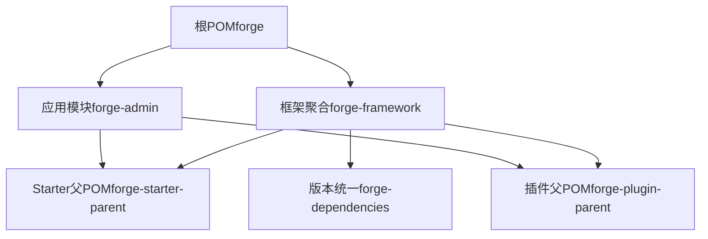
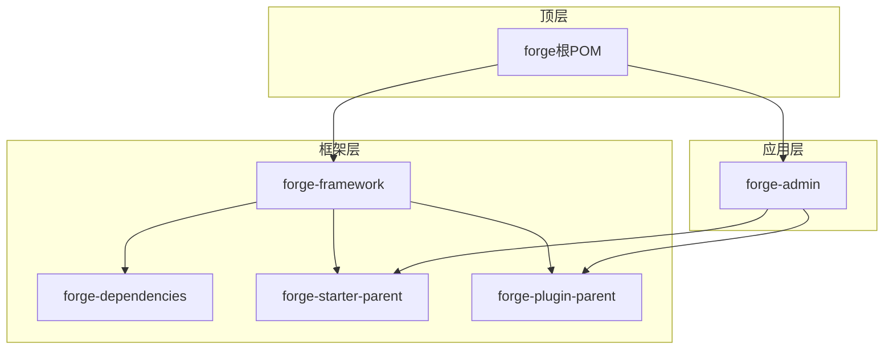
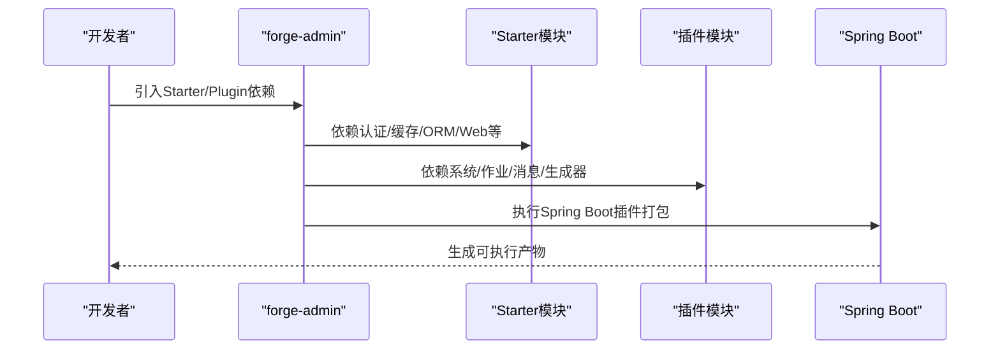
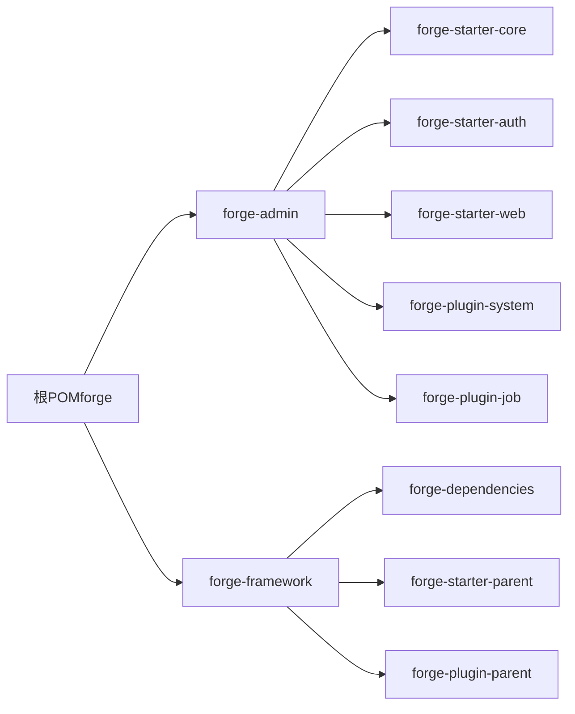

# 模块化设计

<cite>
**本文引用的文件**
- [根POM（forge）](file://forge/pom.xml)
- [框架聚合POM（forge-framework）](file://forge/forge-framework/pom.xml)
- [依赖统一管理POM（forge-dependencies）](file://forge/forge-framework/forge-dependencies/pom.xml)
- [Starter父POM（forge-starter-parent）](file://forge/forge-framework/forge-starter-parent/pom.xml)
- [核心Starter（forge-starter-core）](file://forge/forge-framework/forge-starter-parent/forge-starter-core/pom.xml)
- [认证Starter（forge-starter-auth）](file://forge/forge-framework/forge-starter-parent/forge-starter-auth/pom.xml)
- [Web Stater（forge-starter-web）](file://forge/forge-framework/forge-starter-parent/forge-starter-web/pom.xml)
- [管理端应用POM（forge-admin）](file://forge/forge-admin/pom.xml)
- [系统插件（forge-plugin-system）](file://forge/forge-framework/forge-plugin-parent/forge-plugin-system/pom.xml)
- [定时任务插件（forge-plugin-job）](file://forge/forge-framework/forge-plugin-parent/forge-plugin-job/pom.xml)
- [管理端应用入口（ForgeAdminApplication）](file://forge/forge-admin/src/main/java/com/mdframe/forge/admin/ForgeAdminApplication.java)
- [管理端应用配置（application.yml）](file://forge/forge-admin/src/main/resources/application.yml)
</cite>

## 目录
1. [简介](#简介)
2. [项目结构](#项目结构)
3. [核心组件](#核心组件)
4. [架构总览](#架构总览)
5. [详细组件分析](#详细组件分析)
6. [依赖关系分析](#依赖关系分析)
7. [性能考量](#性能考量)
8. [故障排查指南](#故障排查指南)
9. [结论](#结论)
10. [附录](#附录)

## 简介
本文件面向Forge框架的模块化设计，系统性解析其基于Maven的多模块架构与Starter插件化设计。重点阐述：
- forge-admin与forge-framework两大核心模块的职责划分与依赖关系
- forge-starter-parent作为父POM的设计理念与版本/依赖统一管理策略
- 各Starter模块的功能定位（核心、安全、数据、文件等）
- 模块依赖关系图与模块间通信机制
- 模块化设计带来的代码复用、独立部署、团队协作等收益
- 模块扩展最佳实践与新模块开发指南

## 项目结构
Forge采用“顶层聚合 -> 框架层 -> 应用层”的三层结构：
- 顶层聚合：以forge为根POM，统一版本与仓库配置，并声明forge-admin与forge-framework两个子模块
- 框架层：forge-framework下包含版本统一管理（forge-dependencies）、Starter父POM（forge-starter-parent）、插件父POM（forge-plugin-parent）
- 应用层：forge-admin作为业务应用，聚合所需Starter与插件模块

图表来源
- [根POM（forge）](file://forge/pom.xml#L114-L117)
- [框架聚合POM（forge-framework）](file://forge/forge-framework/pom.xml#L26-L30)
- [管理端应用POM（forge-admin）](file://forge/forge-admin/pom.xml#L13-L76)

章节来源
- [根POM（forge）](file://forge/pom.xml#L1-L259)
- [框架聚合POM（forge-framework）](file://forge/forge-framework/pom.xml#L1-L117)
- [管理端应用POM（forge-admin）](file://forge/forge-admin/pom.xml#L1-L111)

## 核心组件
- forge-admin：业务应用模块，聚合认证、Web、Excel、配置、定时任务、ID生成、加解密、消息、代码生成、API配置等Starter与插件，通过Spring Boot插件打包运行
- forge-framework：框架支撑层，提供版本统一管理与Starter/插件父POM，确保各模块依赖一致性与可维护性
- forge-dependencies：集中声明第三方依赖版本与BOM，统一导入到子模块，避免版本漂移
- forge-starter-parent：Starter模块的父POM，聚合核心、ORM、Web、缓存、认证、日志、事务、文件、Excel、配置、定时、ID、数据域、消息、租户、加密、WebSocket、API配置等模块
- forge-plugin-parent：插件模块父POM，聚合系统、作业、消息、代码生成等插件模块

章节来源
- [管理端应用POM（forge-admin）](file://forge/forge-admin/pom.xml#L13-L76)
- [框架聚合POM（forge-framework）](file://forge/forge-framework/pom.xml#L26-L30)
- [依赖统一管理POM（forge-dependencies）](file://forge/forge-framework/forge-dependencies/pom.xml#L72-L413)
- [Starter父POM（forge-starter-parent）](file://forge/forge-framework/forge-starter-parent/pom.xml#L15-L34)

## 架构总览
Forge采用“父POM + 版本统一 + Starter插件化”的架构模式：
- 父POM负责全局版本与插件配置
- 版本统一管理POM集中声明依赖版本与BOM
- Starter模块按功能拆分，彼此通过依赖组合使用
- 插件模块在Starter之上提供业务能力扩展

图表来源
- [根POM（forge）](file://forge/pom.xml#L114-L117)
- [框架聚合POM（forge-framework）](file://forge/forge-framework/pom.xml#L26-L30)
- [管理端应用POM（forge-admin）](file://forge/forge-admin/pom.xml#L13-L76)

## 详细组件分析

### forge-admin：业务应用模块
- 职责：提供后台管理功能，整合认证、Web容器、Excel导出、配置中心、定时任务、ID生成、加解密、消息、代码生成、API配置等能力
- 依赖：直接依赖多个Starter与插件模块，通过Spring Boot Maven插件打包为可执行应用
- 启动入口：ForgeAdminApplication，启用Aspect代理并扫描指定包路径
- 配置：application.yml中定义 Undertow、MyBatis-Plus、Sa-Token 等关键配置项

图表来源
- [管理端应用POM（forge-admin）](file://forge/forge-admin/pom.xml#L13-L76)
- [管理端应用入口（ForgeAdminApplication）](file://forge/forge-admin/src/main/java/com/mdframe/forge/admin/ForgeAdminApplication.java#L8-L10)
- [管理端应用配置（application.yml）](file://forge/forge-admin/src/main/resources/application.yml#L1-L100)

章节来源
- [管理端应用POM（forge-admin）](file://forge/forge-admin/pom.xml#L13-L76)
- [管理端应用入口（ForgeAdminApplication）](file://forge/forge-admin/src/main/java/com/mdframe/forge/admin/ForgeAdminApplication.java#L1-L18)
- [管理端应用配置（application.yml）](file://forge/forge-admin/src/main/resources/application.yml#L1-L100)

### forge-framework：框架支撑层
- 职责：提供版本统一与模块化父POM，保证依赖一致性与可维护性
- 组成：
  - forge-dependencies：集中声明Spring Boot、MyBatis-Plus、Sa-Token、Hutool、Undertow、Quartz 等依赖版本与BOM
  - forge-starter-parent：聚合各类Starter模块，形成统一的“能力套件”
  - forge-plugin-parent：聚合系统、作业、消息、代码生成等插件模块

章节来源
- [框架聚合POM（forge-framework）](file://forge/forge-framework/pom.xml#L26-L30)
- [依赖统一管理POM（forge-dependencies）](file://forge/forge-framework/forge-dependencies/pom.xml#L72-L413)
- [Starter父POM（forge-starter-parent）](file://forge/forge-framework/forge-starter-parent/pom.xml#L15-L34)

### forge-starter-parent：Starter插件化设计
- 设计理念：将通用能力抽象为Starter模块，按功能拆分，实现“按需装配”，降低耦合并提升复用度
- 功能定位（代表性模块）：
  - 核心（forge-starter-core）：Spring上下文、Web、校验、AOP、工具类、JSON、MapStruct、Sa-Token核心等
  - 认证（forge-starter-auth）：基于Sa-Token的认证鉴权、缓存、验证码、租户、API配置等
  - Web（forge-starter-web）：Web容器（Undertow）、Actuator、验证码、加解密等
  - ORM（未展开具体模块，但由依赖统一管理POM提供MyBatis-Plus等）
  - 缓存（未展开具体模块，但由依赖统一管理POM提供Redisson、Lock4j等）
  - 日志（未展开具体模块，但由依赖统一管理POM提供相关能力）
  - 事务（未展开具体模块，但由依赖统一管理POM提供相关能力）
  - 文件（未展开具体模块，但由依赖统一管理POM提供相关能力）
  - Excel（未展开具体模块，但由依赖统一管理POM提供相关能力）
  - 配置（未展开具体模块，但由依赖统一管理POM提供相关能力）
  - 定时任务（未展开具体模块，但由依赖统一管理POM提供Quartz等）
  - ID生成（未展开具体模块，但由依赖统一管理POM提供相关能力）
  - 数据域（未展开具体模块，但由依赖统一管理POM提供相关能力）
  - 消息（未展开具体模块，但由依赖统一管理POM提供相关能力）
  - 租户（未展开具体模块，但由依赖统一管理POM提供相关能力）
  - 加密（未展开具体模块，但由依赖统一管理POM提供相关能力）
  - WebSocket（未展开具体模块，但由依赖统一管理POM提供相关能力）
  - API配置（未展开具体模块，但由依赖统一管理POM提供相关能力）

章节来源
- [Starter父POM（forge-starter-parent）](file://forge/forge-framework/forge-starter-parent/pom.xml#L15-L34)
- [依赖统一管理POM（forge-dependencies）](file://forge/forge-framework/forge-dependencies/pom.xml#L72-L413)

### forge-plugin-parent：插件化扩展
- 设计理念：在Starter之上提供业务能力扩展，通过插件模块实现“可插拔”能力
- 代表性模块：
  - 系统插件（forge-plugin-system）：系统管理相关能力，依赖核心、ORM、认证、日志、事务、Excel、文件、数据域、租户、加密等
  - 定时任务插件（forge-plugin-job）：基于Starter定时任务与加密能力，集成Quartz

章节来源
- [系统插件（forge-plugin-system）](file://forge/forge-framework/forge-plugin-parent/forge-plugin-system/pom.xml#L15-L71)
- [定时任务插件（forge-plugin-job）](file://forge/forge-framework/forge-plugin-parent/forge-plugin-job/pom.xml#L14-L34)

## 依赖关系分析
Forge的依赖关系遵循“顶层统一 -> 框架层约束 -> 应用层装配”的原则：

图表来源
- [根POM（forge）](file://forge/pom.xml#L114-L117)
- [框架聚合POM（forge-framework）](file://forge/forge-framework/pom.xml#L26-L30)
- [管理端应用POM（forge-admin）](file://forge/forge-admin/pom.xml#L13-L76)

章节来源
- [根POM（forge）](file://forge/pom.xml#L94-L112)
- [管理端应用POM（forge-admin）](file://forge/forge-admin/pom.xml#L13-L76)

## 性能考量
- Web容器：Starter Web使用 Undertow，具备更高的并发与更低的内存占用，适合高并发场景
- ORM与SQL：通过MyBatis-Plus与动态数据源支持，结合日志与性能分析工具，便于定位慢查询
- 缓存与分布式锁：集成Redisson与Lock4j，保障高并发下的数据一致性与性能
- 定时任务：集成Quartz，支持分布式与持久化，满足复杂调度需求

章节来源
- [Web Stater（forge-starter-web）](file://forge/forge-framework/forge-starter-parent/forge-starter-web/pom.xml#L15-L59)
- [依赖统一管理POM（forge-dependencies）](file://forge/forge-framework/forge-dependencies/pom.xml#L158-L213)

## 故障排查指南
- 启动失败：检查application.yml中的端口、数据库、Redis、国际化资源等配置是否正确
- 认证异常：确认Sa-Token相关配置（Redis地址、密码、数据库索引）与认证流程是否匹配
- 定时任务：核对Quartz配置与任务处理器注册情况
- 日志：关注日志级别与输出路径，必要时开启调试日志定位问题

章节来源
- [管理端应用配置（application.yml）](file://forge/forge-admin/src/main/resources/application.yml#L1-L100)
- [定时任务插件（forge-plugin-job）](file://forge/forge-framework/forge-plugin-parent/forge-plugin-job/pom.xml#L23-L33)

## 结论
Forge通过“父POM + 版本统一 + Starter插件化”的多模块架构，实现了：
- 代码复用：能力下沉至Starter与插件，减少重复开发
- 独立部署：模块边界清晰，可按需装配与独立打包
- 团队协作：职责明确、接口稳定，降低模块间耦合
- 可扩展性：新增能力以Starter/插件形式接入，不影响现有模块

## 附录

### 模块扩展最佳实践
- 新增Starter：在forge-starter-parent下新增模块，按功能命名，仅暴露必要的自动装配与配置
- 新增插件：在forge-plugin-parent下新增模块，复用Starter能力，聚焦业务扩展
- 版本管理：统一在forge-dependencies中声明版本，避免子模块各自声明
- 自动装配：通过META-INF目录下的自动装配配置文件，声明条件化配置类
- 文档与示例：为新模块提供README与使用示例，便于团队快速上手

### 新模块开发指南
- 选择父POM：Starter模块继承forge-starter-parent；插件模块继承forge-plugin-parent
- 依赖声明：优先使用forge-dependencies提供的版本，避免版本冲突
- 功能拆分：遵循单一职责，尽量保持模块内聚、模块间低耦合
- 测试覆盖：为关键逻辑编写单元测试与集成测试，确保稳定性
- 发布规范：遵循版本号规则与变更记录，确保可追踪性