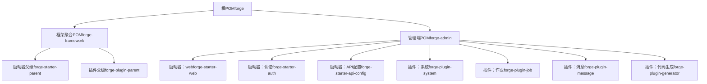
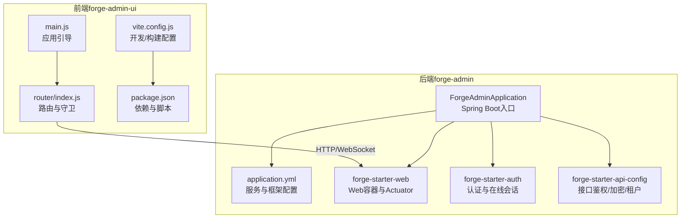
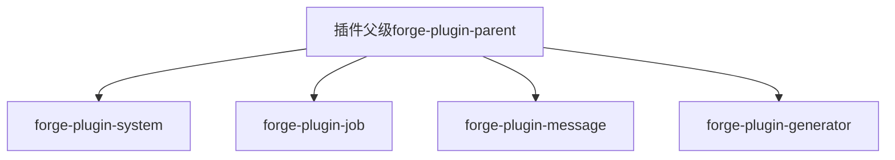
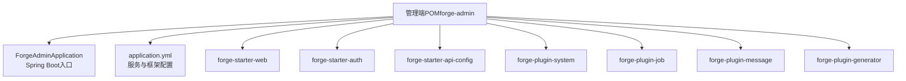
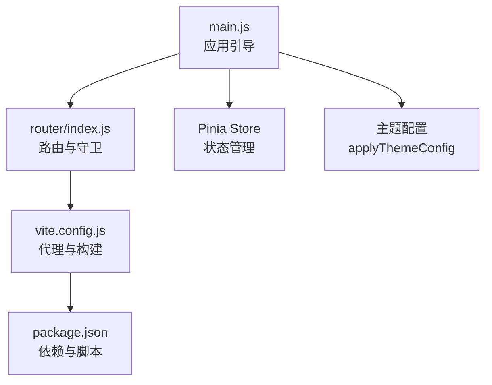
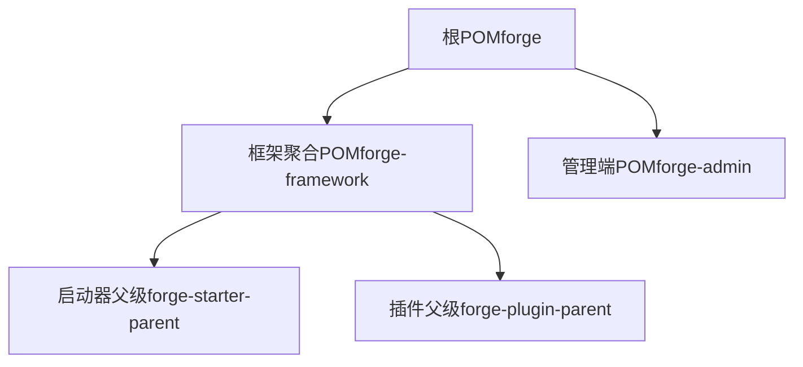

# 系统架构

<cite>
**本文引用的文件**
- [根POM（forge）](file://forge/pom.xml)
- [框架聚合POM（forge-framework）](file://forge/forge-framework/pom.xml)
- [启动器父级POM（forge-starter-parent）](file://forge/forge-framework/forge-starter-parent/pom.xml)
- [插件父级POM（forge-plugin-parent）](file://forge/forge-framework/forge-plugin-parent/pom.xml)
- [管理端POM（forge-admin）](file://forge/forge-admin/pom.xml)
- [管理端应用入口（ForgeAdminApplication）](file://forge/forge-admin/src/main/java/com/mdframe/forge/admin/ForgeAdminApplication.java)
- [管理端应用配置（application.yml）](file://forge/forge-admin/src/main/resources/application.yml)
- [启动器：web（forge-starter-web）](file://forge/forge-framework/forge-starter-parent/forge-starter-web/pom.xml)
- [启动器：认证（forge-starter-auth）](file://forge/forge-framework/forge-starter-parent/forge-starter-auth/pom.xml)
- [启动器：核心（forge-starter-core）](file://forge/forge-framework/forge-starter-parent/forge-starter-core/pom.xml)
- [启动器：API配置（forge-starter-api-config）](file://forge/forge-framework/forge-starter-parent/forge-starter-api-config/pom.xml)
- [前端包配置（package.json）](file://forge-admin-ui/package.json)
- [前端Vite配置（vite.config.js）](file://forge-admin-ui/vite.config.js)
- [前端入口（main.js）](file://forge-admin-ui/src/main.js)
- [前端路由（router/index.js）](file://forge-admin-ui/src/router/index.js)
</cite>

## 目录
1. [简介](#简介)
2. [项目结构](#项目结构)
3. [核心组件](#核心组件)
4. [架构总览](#架构总览)
5. [详细组件分析](#详细组件分析)
6. [依赖分析](#依赖分析)
7. [性能考虑](#性能考虑)
8. [故障排查指南](#故障排查指南)
9. [结论](#结论)
10. [附录](#附录)

## 简介
本文件面向Forge框架的系统架构文档，系统采用前后端分离设计，后端基于Spring Boot微服务化架构，通过“启动器（Starter）+ 插件（Plugin）”的模块化设计实现功能的可插拔扩展；前端采用Vue 3 + Vite构建，通过代理与后端对接，统一管理接口鉴权、加密、租户等能力。本文档从整体架构、技术栈选型、组件关系、系统边界、数据流向、接口设计原则等方面进行系统性阐述，并提供架构图与组件交互图，帮助开发者快速理解系统设计思路与扩展点。

## 项目结构
Forge项目采用多模块Maven聚合结构，分为“框架层”和“业务应用层”两大层面：
- 框架层（forge-framework）：提供统一的依赖管理、启动器父级（forge-starter-parent）与插件父级（forge-plugin-parent），支撑各业务模块按需装配。
- 业务应用层（forge-admin）：以管理后台为核心应用，聚合所需启动器与插件模块，形成完整的业务服务。

图表来源
- [根POM（forge）](file://forge/pom.xml#L114-L117)
- [框架聚合POM（forge-framework）](file://forge/forge-framework/pom.xml#L26-L30)
- [启动器父级POM（forge-starter-parent）](file://forge/forge-framework/forge-starter-parent/pom.xml#L15-L34)
- [插件父级POM（forge-plugin-parent）](file://forge/forge-framework/forge-plugin-parent/pom.xml#L18-L23)
- [管理端POM（forge-admin）](file://forge/forge-admin/pom.xml#L13-L76)

章节来源
- [根POM（forge）](file://forge/pom.xml#L114-L117)
- [框架聚合POM（forge-framework）](file://forge/forge-framework/pom.xml#L26-L30)
- [启动器父级POM（forge-starter-parent）](file://forge/forge-framework/forge-starter-parent/pom.xml#L15-L34)
- [插件父级POM（forge-plugin-parent）](file://forge/forge-framework/forge-plugin-parent/pom.xml#L18-L23)
- [管理端POM（forge-admin）](file://forge/forge-admin/pom.xml#L13-L76)

## 核心组件
- 启动器（Starter）：封装通用能力（Web容器、认证、日志、事务、文件、Excel、配置、定时任务、ID生成、数据权限、消息、租户、加解密、WebSocket、API配置等），通过依赖引入即可启用相应功能。
- 插件（Plugin）：封装业务能力（系统、作业、消息、代码生成等），以模块形式提供，便于按需装配与扩展。
- 管理端应用（forge-admin）：作为业务入口，聚合所需启动器与插件，提供统一的后端服务。
- 前端（forge-admin-ui）：基于Vue 3 + Vite，通过代理转发请求至后端，提供统一的主题、国际化、权限与菜单管理等能力。

章节来源
- [启动器：web（forge-starter-web）](file://forge/forge-framework/forge-starter-parent/forge-starter-web/pom.xml#L14-L59)
- [启动器：认证（forge-starter-auth）](file://forge/forge-framework/forge-starter-parent/forge-starter-auth/pom.xml#L14-L79)
- [启动器：API配置（forge-starter-api-config）](file://forge/forge-framework/forge-starter-parent/forge-starter-api-config/pom.xml#L15-L79)
- [管理端POM（forge-admin）](file://forge/forge-admin/pom.xml#L13-L76)
- [前端包配置（package.json）](file://forge-admin-ui/package.json#L13-L41)

## 架构总览
Forge采用前后端分离架构，后端以Spring Boot为核心，结合 Undertow Web容器与 Sa-Token 认证体系，通过启动器模块化装配通用能力；前端以Vue 3为基础，通过Vite开发与构建，借助代理实现跨域与统一前缀转发。系统边界清晰：后端仅暴露REST接口与WebSocket通道，前端负责界面与交互逻辑。

图表来源
- [前端入口（main.js）](file://forge-admin-ui/src/main.js#L15-L36)
- [前端路由（router/index.js）](file://forge-admin-ui/src/router/index.js#L1-L18)
- [前端包配置（package.json）](file://forge-admin-ui/package.json#L1-L68)
- [前端Vite配置（vite.config.js）](file://forge-admin-ui/vite.config.js#L13-L85)
- [管理端应用入口（ForgeAdminApplication）](file://forge/forge-admin/src/main/java/com/mdframe/forge/admin/ForgeAdminApplication.java#L8-L15)
- [管理端应用配置（application.yml）](file://forge/forge-admin/src/main/resources/application.yml#L1-L100)
- [启动器：web（forge-starter-web）](file://forge/forge-framework/forge-starter-parent/forge-starter-web/pom.xml#L14-L59)
- [启动器：认证（forge-starter-auth）](file://forge/forge-framework/forge-starter-parent/forge-starter-auth/pom.xml#L14-L79)
- [启动器：API配置（forge-starter-api-config）](file://forge/forge-framework/forge-starter-parent/forge-starter-api-config/pom.xml#L15-L79)

## 详细组件分析

### 启动器模块族（Starter Family）
启动器模块族以“父级POM + 子模块”的方式组织，覆盖Web、认证、日志、事务、文件、Excel、配置、定时任务、ID生成、数据权限、消息、租户、加解密、WebSocket、API配置等能力，通过依赖引入即可启用对应功能，降低重复配置成本，提升一致性与可维护性。

```mermaid
graph TB
StarterParent["启动器父级forge-starter-parent"]
S_Core["forge-starter-core"]
S_Web["forge-starter-web"]
S_Auth["forge-starter-auth"]
S_Log["forge-starter-log"]
S_Trans["forge-starter-trans"]
S_File["forge-starter-file"]
S_Excel["forge-starter-excel"]
S_Config["forge-starter-config"]
S_Job["forge-starter-job"]
S_Id["forge-starter-id"]
S_DataScope["forge-starter-datascope"]
S_Msg["forge-starter-message"]
S_Tenant["forge-starter-tenant"]
S_Crypto["forge-starter-crypto"]
S_WS["forge-starter-websocket"]
S_ApiCfg["forge-starter-api-config"]
StarterParent --> S_Core
StarterParent --> S_Web
StarterParent --> S_Auth
StarterParent --> S_Log
StarterParent --> S_Trans
StarterParent --> S_File
StarterParent --> S_Excel
StarterParent --> S_Config
StarterParent --> S_Job
StarterParent --> S_Id
StarterParent --> S_DataScope
StarterParent --> S_Msg
StarterParent --> S_Tenant
StarterParent --> S_Crypto
StarterParent --> S_WS
StarterParent --> S_ApiCfg
```

图表来源
- [启动器父级POM（forge-starter-parent）](file://forge/forge-framework/forge-starter-parent/pom.xml#L15-L34)

章节来源
- [启动器父级POM（forge-starter-parent）](file://forge/forge-framework/forge-starter-parent/pom.xml#L15-L34)
- [启动器：核心（forge-starter-core）](file://forge/forge-framework/forge-starter-parent/forge-starter-core/pom.xml#L14-L122)
- [启动器：web（forge-starter-web）](file://forge/forge-framework/forge-starter-parent/forge-starter-web/pom.xml#L14-L59)
- [启动器：认证（forge-starter-auth）](file://forge/forge-framework/forge-starter-parent/forge-starter-auth/pom.xml#L14-L79)
- [启动器：API配置（forge-starter-api-config）](file://forge/forge-framework/forge-starter-parent/forge-starter-api-config/pom.xml#L15-L79)

### 插件模块族（Plugin Family）
插件模块族以“父级POM + 子模块”的方式组织，提供系统、作业、消息、代码生成等业务能力，便于在管理端应用中按需装配，实现功能的插件化扩展。

图表来源
- [插件父级POM（forge-plugin-parent）](file://forge/forge-framework/forge-plugin-parent/pom.xml#L18-L23)

章节来源
- [插件父级POM（forge-plugin-parent）](file://forge/forge-framework/forge-plugin-parent/pom.xml#L18-L23)

### 管理端应用（forge-admin）
管理端应用作为业务入口，聚合所需的启动器与插件模块，通过Spring Boot自动装配与MyBatis-Plus集成，提供统一的后端服务能力。

图表来源
- [管理端POM（forge-admin）](file://forge/forge-admin/pom.xml#L13-L76)
- [管理端应用入口（ForgeAdminApplication）](file://forge/forge-admin/src/main/java/com/mdframe/forge/admin/ForgeAdminApplication.java#L8-L15)
- [管理端应用配置（application.yml）](file://forge/forge-admin/src/main/resources/application.yml#L1-L100)

章节来源
- [管理端POM（forge-admin）](file://forge/forge-admin/pom.xml#L13-L76)
- [管理端应用入口（ForgeAdminApplication）](file://forge/forge-admin/src/main/java/com/mdframe/forge/admin/ForgeAdminApplication.java#L8-L15)
- [管理端应用配置（application.yml）](file://forge/forge-admin/src/main/resources/application.yml#L1-L100)

### 前端应用（forge-admin-ui）
前端应用基于Vue 3 + Vite，通过路由守卫、状态管理与主题配置完成用户交互与界面渲染；通过Vite代理将请求转发至后端，支持HTTP与WebSocket。

图表来源
- [前端入口（main.js）](file://forge-admin-ui/src/main.js#L15-L36)
- [前端路由（router/index.js）](file://forge-admin-ui/src/router/index.js#L1-L18)
- [前端Vite配置（vite.config.js）](file://forge-admin-ui/vite.config.js#L13-L85)
- [前端包配置（package.json）](file://forge-admin-ui/package.json#L1-L68)

章节来源
- [前端入口（main.js）](file://forge-admin-ui/src/main.js#L15-L36)
- [前端路由（router/index.js）](file://forge-admin-ui/src/router/index.js#L1-L18)
- [前端Vite配置（vite.config.js）](file://forge-admin-ui/vite.config.js#L13-L85)
- [前端包配置（package.json）](file://forge-admin-ui/package.json#L1-L68)

### 数据流与接口设计原则
- 数据流：前端通过HTTP与WebSocket与后端交互，后端通过启动器模块提供统一的Web容器、认证、事务、日志、配置与API治理能力，插件模块提供业务能力。
- 接口设计原则：
  - 统一鉴权：通过API配置启动器集中管理接口鉴权、加密与租户隔离。
  - 可扩展：通过插件化设计，按需装配业务能力，避免功能耦合。
  - 可观测：通过Actuator与日志启动器提供健康检查与审计能力。
  - 性能优先：使用Undertow容器与Caffeine本地缓存，结合Redis实现高并发场景下的低延迟响应。

章节来源
- [启动器：web（forge-starter-web）](file://forge/forge-framework/forge-starter-parent/forge-starter-web/pom.xml#L14-L59)
- [启动器：认证（forge-starter-auth）](file://forge/forge-framework/forge-starter-parent/forge-starter-auth/pom.xml#L14-L79)
- [启动器：API配置（forge-starter-api-config）](file://forge/forge-framework/forge-starter-parent/forge-starter-api-config/pom.xml#L15-L79)
- [管理端应用配置（application.yml）](file://forge/forge-admin/src/main/resources/application.yml#L1-L100)

## 依赖分析
Forge的依赖关系以Maven聚合与模块化为核心，根POM统一版本与插件配置，框架层提供启动器与插件父级，业务层通过管理端POM聚合所需模块。

图表来源
- [根POM（forge）](file://forge/pom.xml#L114-L117)
- [框架聚合POM（forge-framework）](file://forge/forge-framework/pom.xml#L26-L30)
- [启动器父级POM（forge-starter-parent）](file://forge/forge-framework/forge-starter-parent/pom.xml#L15-L34)
- [插件父级POM（forge-plugin-parent）](file://forge/forge-framework/forge-plugin-parent/pom.xml#L18-L23)

章节来源
- [根POM（forge）](file://forge/pom.xml#L114-L117)
- [框架聚合POM（forge-framework）](file://forge/forge-framework/pom.xml#L26-L30)
- [启动器父级POM（forge-starter-parent）](file://forge/forge-framework/forge-starter-parent/pom.xml#L15-L34)
- [插件父级POM（forge-plugin-parent）](file://forge/forge-framework/forge-plugin-parent/pom.xml#L18-L23)

## 性能考虑
- Web容器：采用 Undertow 替代Tomcat，具备更高的吞吐与更低的内存占用，适合高并发场景。
- 缓存策略：结合 Caffeine 本地缓存与 Redis 分布式缓存，减少数据库压力，提升热点数据访问速度。
- 并发模型：通过 Undertow 的 IO/Worker 线程模型与合理的线程池配置，平衡阻塞与非阻塞任务处理。
- 请求处理：合理设置文件上传大小与请求体大小，避免异常放大；对静态资源路径进行明确配置，减少不必要的匹配开销。
- 观测性：启用 Actuator 与日志模块，便于监控与问题定位。

章节来源
- [启动器：web（forge-starter-web）](file://forge/forge-framework/forge-starter-parent/forge-starter-web/pom.xml#L14-L59)
- [管理端应用配置（application.yml）](file://forge/forge-admin/src/main/resources/application.yml#L1-L100)

## 故障排查指南
- 启动失败：检查Spring Boot入口类与包扫描路径是否正确，确认MyBatis Mapper扫描路径是否覆盖到目标包。
- 认证异常：核对 Sa-Token 的Redis配置与数据库索引，确保会话存储可用；检查API配置启动器中的接口白名单与鉴权规则。
- 代理问题：前端Vite代理需与后端上下文路径一致，WebSocket代理需开启ws参数；确认代理rewrite规则与changeOrigin配置。
- 性能瓶颈：关注 Undertow 线程池配置与缓冲区大小；结合本地缓存与分布式缓存策略，评估热点数据命中率。

章节来源
- [管理端应用入口（ForgeAdminApplication）](file://forge/forge-admin/src/main/java/com/mdframe/forge/admin/ForgeAdminApplication.java#L8-L15)
- [管理端应用配置（application.yml）](file://forge/forge-admin/src/main/resources/application.yml#L1-L100)
- [前端Vite配置（vite.config.js）](file://forge-admin-ui/vite.config.js#L56-L80)

## 结论
Forge框架通过“启动器 + 插件”的模块化设计，实现了后端能力的标准化与可插拔扩展；前后端分离架构明确了职责边界，前端通过代理与后端高效协作。该架构在保证功能可扩展的同时，兼顾了性能与可观测性，适合中大型企业级后台管理系统建设。

## 附录
- 技术栈概览
  - 后端：Spring Boot 3、Undertow、Sa-Token、MyBatis-Plus、Redis、Caffeine、Actuator、MapStruct、Lombok、Hutool、Fastjson2、Jackson、EasyExcel、JustAuth、AWS SDK、SMS4J、Flowable等。
  - 前端：Vue 3、Vite、Naive UI、Axios、Pinia、Vue Router、SockJS、STOMP、XLSX、Day.js、CryptoJS、SM-Crypto等。

章节来源
- [根POM（forge）](file://forge/pom.xml#L12-L53)
- [前端包配置（package.json）](file://forge-admin-ui/package.json#L13-L41)