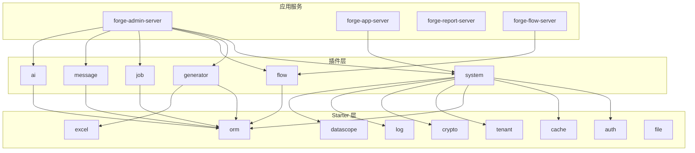
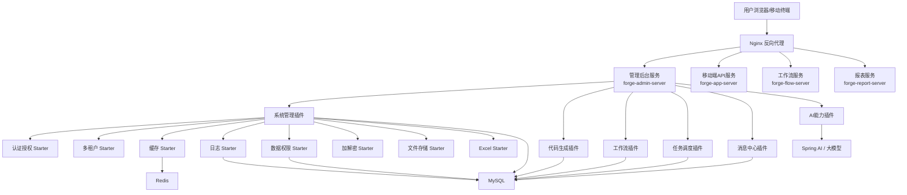
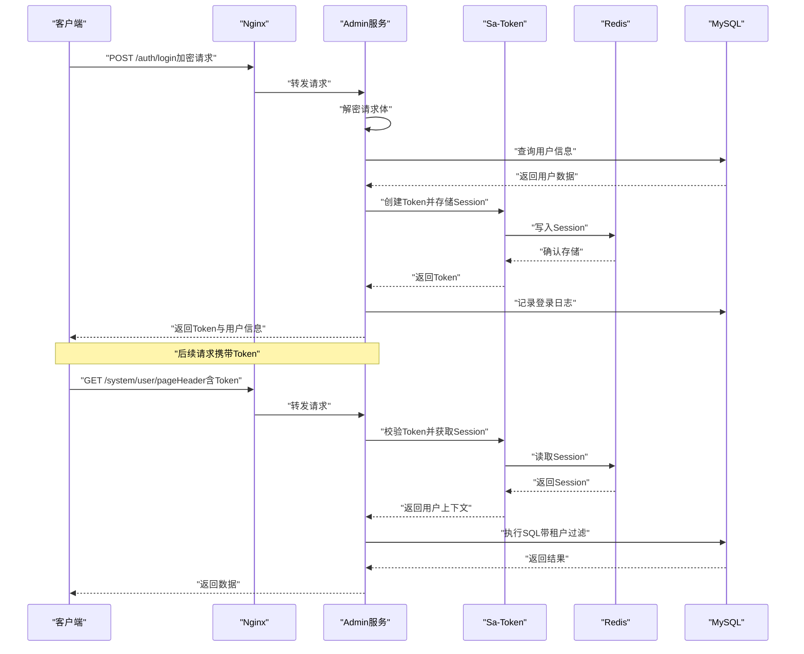
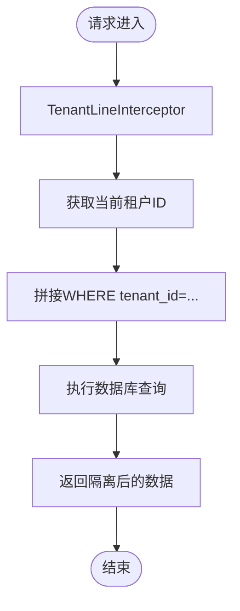
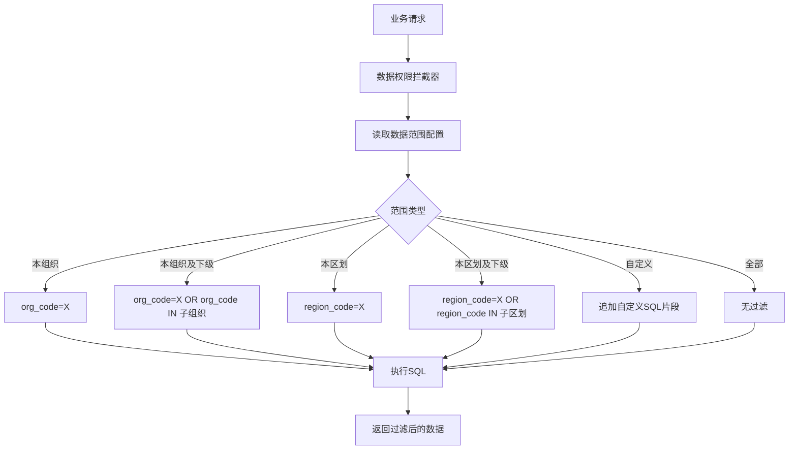
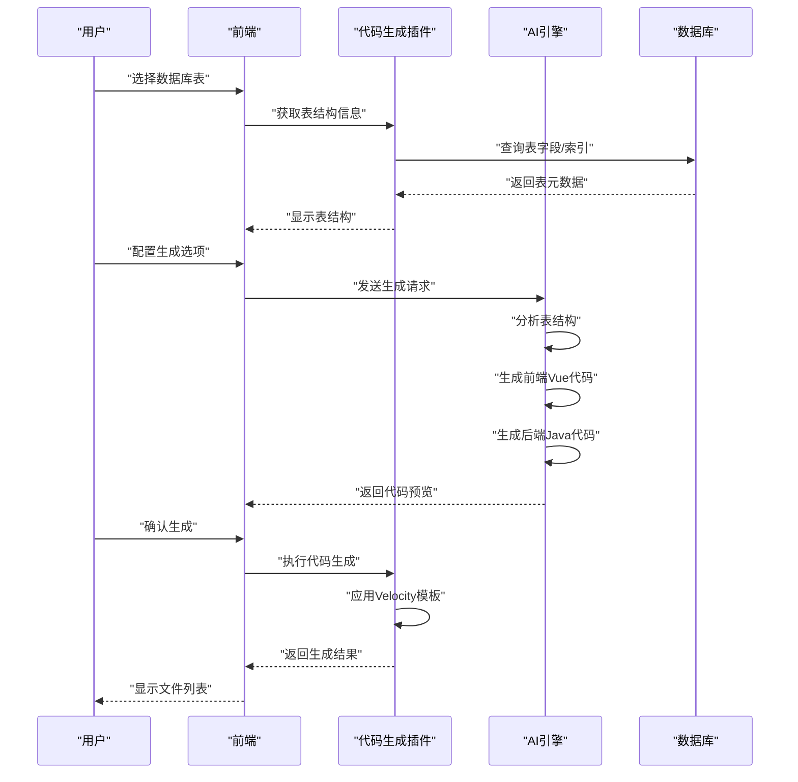
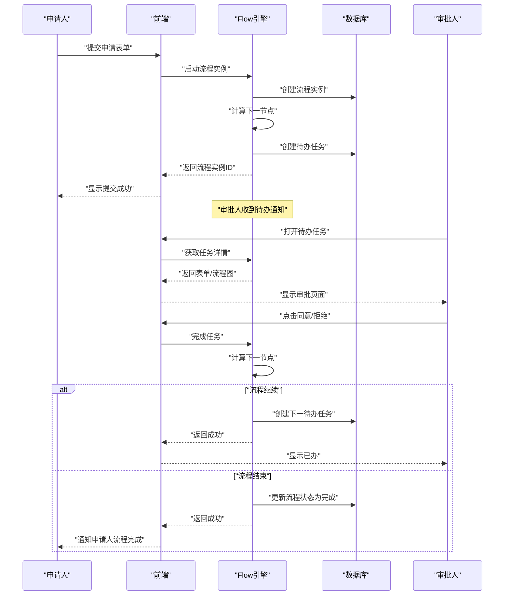
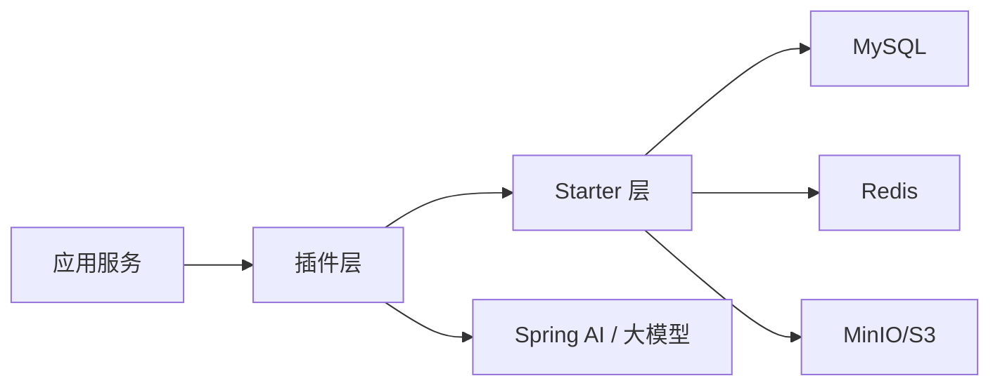

# 系统架构

<cite>
**本文引用的文件**
- [README.md](file://README.md)
- [architecture.md](file://docs/architecture.md)
- [application.yml](file://forge-server/forge-admin-server/src/main/resources/application.yml)
</cite>

## 目录
1. [简介](#简介)
2. [项目结构](#项目结构)
3. [核心组件](#核心组件)
4. [架构总览](#架构总览)
5. [详细组件分析](#详细组件分析)
6. [依赖关系分析](#依赖关系分析)
7. [性能考虑](#性能考虑)
8. [故障排查指南](#故障排查指南)
9. [结论](#结论)
10. [附录](#附录)

## 简介
本文件面向 Forge Admin 系统的整体架构与关键设计，围绕后端分层（Controller-Service-Mapper）、前端 MVVM、微内核+插件体系、Starter 与 Plugin 职责划分、前后端分离与 API 规范、数据流向与组件交互、多租户隔离与安全/监控/日志等横切关注点进行系统化说明。文档同时给出架构图表与流程图，帮助读者快速理解系统边界、技术决策与扩展点。

## 项目结构
Forge Admin 采用“应用服务 + 业务插件 + 技术 Starter”的分层工程组织：
- 应用服务：管理后台、移动端 API、报表、工作流独立服务等聚合入口
- 插件层：系统管理、代码生成、任务调度、消息中心、流程、AI 等业务能力以插件形式提供
- Starter 层：认证、缓存、ORM、多租户、加解密、日志、文件、Excel、数据权限等通用能力封装
- 前端：Vue 3 + Naive UI + Pinia + Vue Router + UnoCSS，按模块组织页面、组件、API 调用与状态管理

```mermaid
graph TB
subgraph "应用服务"
A["forge-admin-server"]
B["forge-app-server"]
C["forge-report-server"]
D["forge-flow-server"]
end
subgraph "插件层"
P1["system"]
P2["generator"]
P3["flow"]
P4["job"]
P5["message"]
P6["ai"]
end
subgraph "Starter 层"
S1["auth"]
S2["cache"]
S3["orm"]
S4["tenant"]
S5["crypto"]
S6["log"]
S7["datascope"]
S8["excel"]
S9["file"]
end
A --> P1; A --> P2; A --> P3; A --> P4; A --> P5; A --> P6
B --> P1; D --> P3
P1 --> S1; P1 --> S2; P1 --> S3; P1 --> S4; P1 --> S5; P1 --> S6; P1 --> S7
P2 --> S3; P2 --> S8
P3 --> S3
P4 --> S3
P5 --> S3
P6 --> S3
```

图表来源
- [architecture.md:64-131](file://docs/architecture.md#L64-L131)

章节来源
- [README.md:241-259](file://README.md#L241-L259)
- [architecture.md:64-131](file://docs/architecture.md#L64-L131)

## 核心组件
- 后端分层
  - Controller：接收请求、参数校验、统一响应封装
  - Service：编排业务逻辑、事务边界、跨组件协作
  - Mapper：数据访问抽象，配合 MyBatis-Plus 完成 SQL 映射与分页
- 前端 MVVM
  - View：页面模板与组件（Naive UI）
  - ViewModel：Pinia Store + Composables 管理状态与副作用
  - Model：API 返回的数据结构与类型定义
- 插件化架构
  - 插件（Plugin）：承载具体业务能力（系统、生成器、流程、任务、消息、AI）
  - Starter：封装横向技术能力（认证、缓存、ORM、多租户、加解密、日志、文件、Excel、数据权限等）
- 多租户隔离
  - 通过拦截器在 SQL 层自动追加 tenant_id 条件，实现数据级隔离；部分系统资源表不在拦截范围

章节来源
- [architecture.md:64-131](file://docs/architecture.md#L64-L131)
- [architecture.md:410-465](file://docs/architecture.md#L410-L465)

## 架构总览
下图展示从客户端到数据层的完整链路，包括网关、应用服务、插件、Starter 与外部存储/AI 能力。

```mermaid
graph TB
U["用户浏览器/移动终端"] --> N["Nginx 反向代理"]
N --> AS["管理后台服务<br/>forge-admin-server"]
N --> MS["移动端API服务<br/>forge-app-server"]
N --> FS["工作流服务<br/>forge-flow-server"]
N --> RS["报表服务<br/>forge-report-server"]
AS --> PL_SYS["系统管理插件"]
AS --> PL_GEN["代码生成插件"]
AS --> PL_FLOW["工作流插件"]
AS --> PL_JOB["任务调度插件"]
AS --> PL_MSG["消息中心插件"]
AS --> PL_AI["AI能力插件"]
PL_SYS --> ST_AUTH["认证授权 Starter"]
PL_SYS --> ST_TEN["多租户 Starter"]
PL_SYS --> ST_CACHE["缓存 Starter"]
PL_SYS --> ST_LOG["日志 Starter"]
PL_SYS --> ST_DS["数据权限 Starter"]
PL_SYS --> ST_CRYPTO["加解密 Starter"]
PL_SYS --> ST_FILE["文件存储 Starter"]
PL_SYS --> ST_EXCEL["Excel Starter"]
ST_CACHE --> RDS["Redis"]
ST_LOG --> DB["MySQL"]
ST_DS --> DB
PL_SYS --> DB
PL_GEN --> DB
PL_FLOW --> DB
PL_JOB --> DB
PL_MSG --> DB
PL_AI --> AI["Spring AI / 大模型"]
```

图表来源
- [architecture.md:264-364](file://docs/architecture.md#L264-L364)

## 详细组件分析

### 认证与授权流程（Sa-Token + Redis）
登录时前端对密码进行加密后发起请求，后端解密并验证用户，创建 Token 并写入 Redis，记录登录日志；后续请求携带 Token，服务端通过 Sa-Token 校验会话与权限，并在查询时附加租户过滤。

```mermaid
sequenceDiagram
participant C as "客户端"
participant G as "Nginx"
participant A as "Admin服务"
participant S as "Sa-Token"
participant R as "Redis"
participant M as "MySQL"
C->>G : "POST /auth/login加密请求"
G->>A : "转发请求"
A->>A : "解密请求体"
A->>M : "查询用户信息"
M-->>A : "返回用户数据"
A->>S : "创建Token并存储Session"
S->>R : "写入Session"
R-->>S : "确认存储"
S-->>A : "返回Token"
A->>M : "记录登录日志"
A-->>C : "返回Token与用户信息"
Note over C,A : "后续请求携带Token"
C->>G : "GET /system/user/pageHeader含Token"
G->>A : "转发请求"
A->>S : "校验Token并获取Session"
S->>R : "读取Session"
R-->>S : "返回Session"
S-->>A : "返回用户上下文"
A->>M : "执行SQL带租户过滤"
M-->>A : "返回结果"
A-->>C : "返回数据"
```

图表来源
- [architecture.md:368-408](file://docs/architecture.md#L368-L408)

章节来源
- [architecture.md:368-408](file://docs/architecture.md#L368-L408)

### 多租户数据隔离机制
所有业务表包含 tenant_id 字段，通过 TenantLineInterceptor 在 SQL 层自动追加 WHERE tenant_id = 当前租户的条件；系统配置类表或全局资源表可配置为不拦截。

```mermaid
flowchart TD
Start(["请求进入"]) --> Interceptor["TenantLineInterceptor"]
Interceptor --> GetTenant["获取当前租户ID"]
GetTenant --> AppendSQL["拼接WHERE tenant_id=..."]
AppendSQL --> Query["执行数据库查询"]
Query --> Result["返回隔离后的数据"]
Result --> End(["结束"])
```

图表来源
- [architecture.md:412-433](file://docs/architecture.md#L412-L433)

章节来源
- [architecture.md:410-433](file://docs/architecture.md#L410-L433)

### 数据权限控制（DataScope）
基于角色与组织/行政区划配置数据范围，拦截器根据规则动态改写 SQL，支持全部、本组织、本组织及下级、本区划、本区划及下级、自定义 SQL 等多种范围。

```mermaid
flowchart TD
Req["业务请求"] --> DSInt["数据权限拦截器"]
DSInt --> ReadCfg["读取数据范围配置"]
ReadCfg --> Decide{"范围类型"}
Decide --> |全部| NoFilter["无过滤"]
Decide --> |本组织| Org["org_code=X"]
Decide --> |本组织及下级| OrgChild["org_code=X OR org_code IN 子组织"]
Decide --> |本区划| Region["region_code=X"]
Decide --> |本区划及下级| RegionChild["region_code=X OR region_code IN 子区划"]
Decide --> |自定义| Custom["追加自定义SQL片段"]
Org --> Exec["执行SQL"]
OrgChild --> Exec
Region --> Exec
RegionChild --> Exec
Custom --> Exec
NoFilter --> Exec
Exec --> Resp["返回过滤后的数据"]
```

图表来源
- [architecture.md:437-465](file://docs/architecture.md#L437-L465)

章节来源
- [architecture.md:435-465](file://docs/architecture.md#L435-L465)

### 代码生成流程（AI + 模板）
选择数据库表后，前端获取表结构，AI 引擎分析元数据并生成前后端代码预览，确认后应用 Velocity 模板输出文件，支持下载与复制。

```mermaid
sequenceDiagram
participant U as "用户"
participant F as "前端"
participant G as "代码生成插件"
participant AI as "AI引擎"
participant DB as "数据库"
U->>F : "选择数据库表"
F->>G : "获取表结构信息"
G->>DB : "查询表字段/索引"
DB-->>G : "返回表元数据"
G-->>F : "显示表结构"
U->>F : "配置生成选项"
F->>AI : "发送生成请求"
AI->>AI : "分析表结构"
AI->>AI : "生成前端Vue代码"
AI->>AI : "生成后端Java代码"
AI-->>F : "返回代码预览"
U->>F : "确认生成"
F->>G : "执行代码生成"
G->>G : "应用Velocity模板"
G-->>F : "返回生成结果"
F-->>U : "显示文件列表"
```

图表来源
- [architecture.md:498-527](file://docs/architecture.md#L498-L527)

章节来源
- [architecture.md:496-527](file://docs/architecture.md#L496-L527)

### 工作流审批流程（Flowable）
申请人提交表单后启动流程实例，计算下一节点并创建待办任务；审批人处理任务后继续流转或结束流程，并通知发起人。

```mermaid
sequenceDiagram
participant U as "申请人"
participant F as "前端"
participant FL as "Flow引擎"
participant DB as "数据库"
U->>F : "提交申请表单"
F->>FL : "启动流程实例"
FL->>DB : "创建流程实例"
FL->>FL : "计算下一节点"
FL->>DB : "创建待办任务"
FL-->>F : "返回流程实例ID"
F-->>U : "显示提交成功"
Note over FL : "审批人收到待办通知"
participant A as "审批人"
A->>F : "打开待办任务"
F->>FL : "获取任务详情"
FL-->>F : "返回表单/流程图"
F-->>A : "显示审批页面"
A->>F : "点击同意/拒绝"
F->>FL : "完成任务"
FL->>FL : "计算下一节点"
alt "流程继续"
FL->>DB : "创建下一待办任务"
FL-->>F : "返回成功"
F-->>A : "显示已办"
else "流程结束"
FL->>DB : "更新流程状态为完成"
FL-->>F : "返回成功"
F-->>U : "通知申请人流程完成"
end
```

图表来源
- [architecture.md:531-565](file://docs/architecture.md#L531-L565)

章节来源
- [architecture.md:529-565](file://docs/architecture.md#L529-L565)

### 前后端分离与 API 设计规范
- 前后端分离：前端通过 Nginx 反向代理访问后端 RESTful API，静态资源由构建产物托管
- API 规范：统一响应封装、参数校验、异常处理、加密接口（SM4/AES）可选开关
- 鉴权：Token 在 Header 中传递，服务端通过 Sa-Token 校验会话与权限
- 多租户：请求上下文注入租户 ID，数据访问层自动过滤

章节来源
- [architecture.md:260-364](file://docs/architecture.md#L260-L364)
- [architecture.md:680-697](file://docs/architecture.md#L680-L697)

## 依赖关系分析
- 应用服务依赖插件，插件依赖 Starter；Starter 之间解耦，通过 Spring Boot 自动装配组合
- 外部依赖：MySQL、Redis、MinIO/S3、Spring AI/大模型
- 横切能力：认证、日志、缓存、数据权限、加解密、文件、Excel 等通过 Starter 注入

```mermaid
graph LR
App["应用服务"] --> Plg["插件层"]
Plg --> St["Starter 层"]
St --> DB["MySQL"]
St --> Cache["Redis"]
St --> OSS["MinIO/S3"]
Plg --> AI["Spring AI / 大模型"]
```

图表来源
- [architecture.md:64-131](file://docs/architecture.md#L64-L131)

章节来源
- [architecture.md:64-131](file://docs/architecture.md#L64-L131)

## 性能考虑
- Undertow 高性能 Web 服务器，合理设置 IO 线程与工作线程池大小
- MyBatis-Plus 分页与缓存开启，减少全表扫描与重复查询
- Redis 作为 Session 与热点缓存介质，降低数据库压力
- 文件上传限制与分片策略，避免大文件阻塞
- 日志级别按需调整，生产环境关闭冗余调试日志
- 多租户与数据权限在 SQL 层拦截，注意索引设计与查询优化

章节来源
- [application.yml:1-22](file://forge-server/forge-admin-server/src/main/resources/application.yml#L1-L22)
- [application.yml:97-111](file://forge-server/forge-admin-server/src/main/resources/application.yml#L97-L111)
- [application.yml:42-48](file://forge-server/forge-admin-server/src/main/resources/application.yml#L42-L48)
- [application.yml:23-30](file://forge-server/forge-admin-server/src/main/resources/application.yml#L23-L30)

## 故障排查指南
- 首次启动报数据库或 Redis 连接错误：检查 application-dev.yml 的 MySQL/Redis 配置是否正确
- 前端请求失败：确认后端端口与 VITE_HTTP_PROXY_TARGET/VITE_FLOW_PROXY_TARGET 指向本地服务
- Flyway 迁移未执行：检查 FORGE_FLYWAY_ENABLED/FORGE_FLYWAY_LOCATIONS 环境变量与脚本路径
- 登录失败或权限不足：检查 Sa-Token 配置、Redis 连通性与角色资源绑定
- 多租户数据为空：确认当前租户上下文是否注入，以及 SQL 拦截是否生效

章节来源
- [README.md:502-518](file://README.md#L502-L518)
- [application.yml:65-72](file://forge-server/forge-admin-server/src/main/resources/application.yml#L65-L72)
- [application.yml:118-131](file://forge-server/forge-admin-server/src/main/resources/application.yml#L118-L131)

## 结论
Forge Admin 通过“微内核 + 插件 + Starter”的分层架构，将通用技术与业务能力解耦，既保证了核心框架的轻量稳定，又提供了灵活的扩展能力。前后端分离与统一的 API 规范提升了交付效率与可维护性；多租户与数据权限在 SQL 层实现，确保企业级数据安全与隔离。结合认证、日志、缓存、文件、Excel 等横切能力，系统具备较强的工程化与可扩展性。

## 附录
- 部署架构：单机与集群部署参考
- 扩展开发：新增业务模块、Starter 组件与前端组件的指引
- 关键技术点：加密通信、数据权限、多租户隔离的实现要点

章节来源
- [architecture.md:569-675](file://docs/architecture.md#L569-L675)
- [architecture.md:678-697](file://docs/architecture.md#L678-L697)