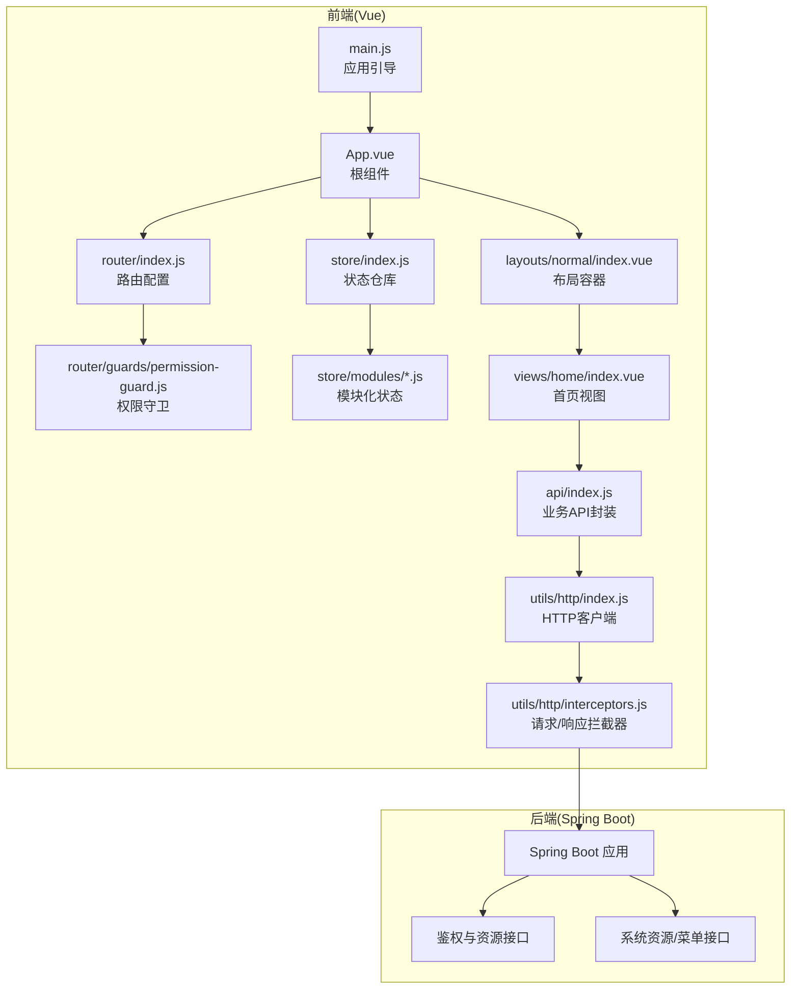
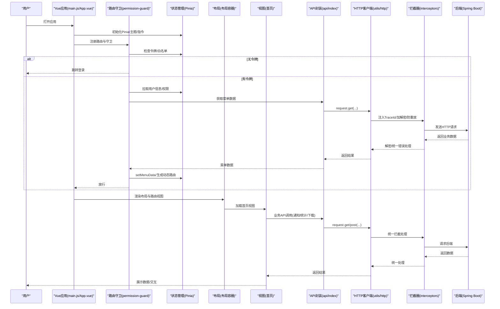
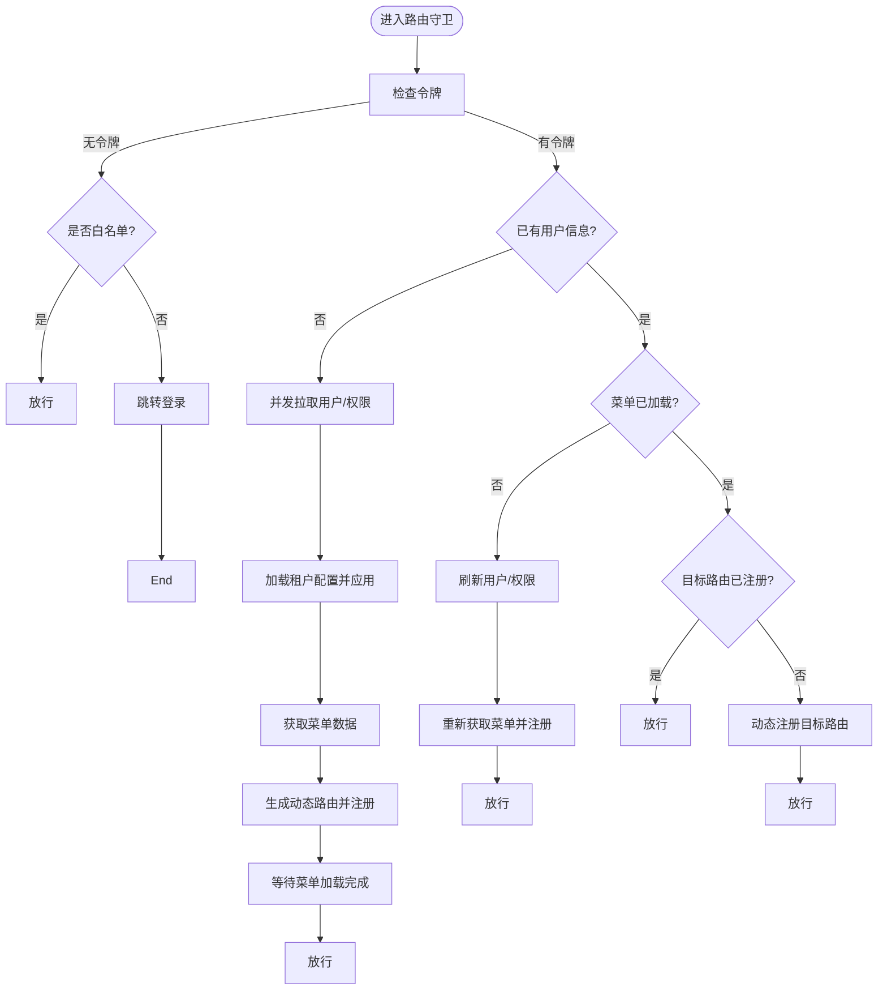
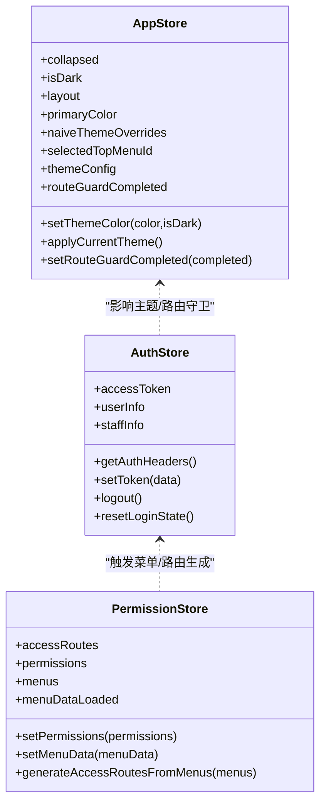
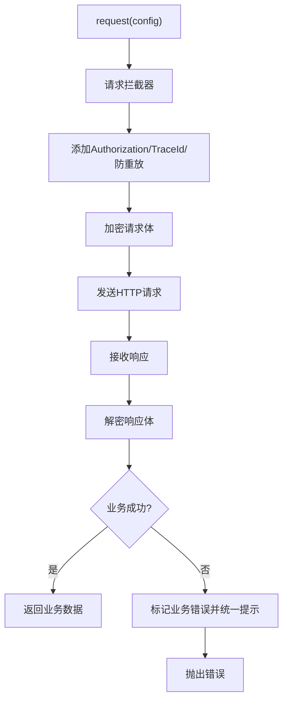
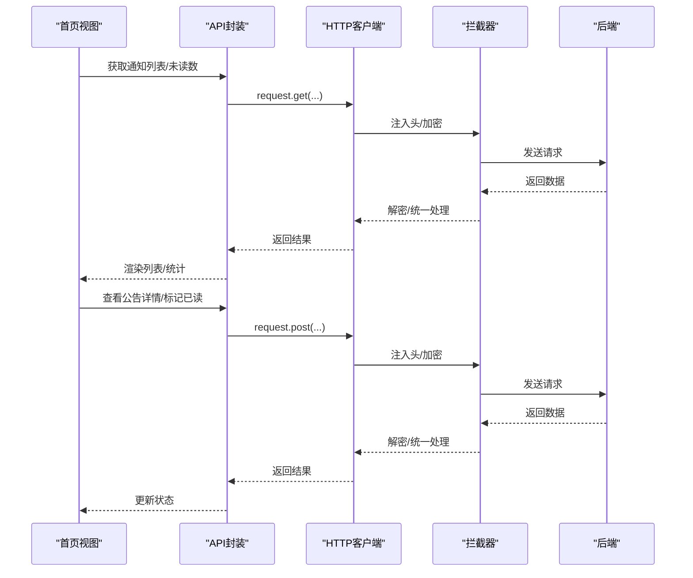
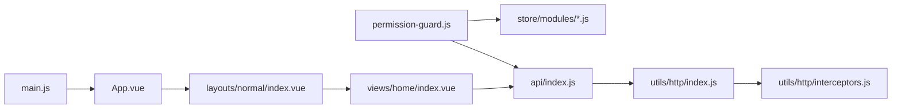

# 组件交互

<cite>
**本文档引用的文件**
- [forge-admin-ui/src/main.js](file://forge-admin-ui/src/main.js)
- [forge-admin-ui/src/App.vue](file://forge-admin-ui/src/App.vue)
- [forge-admin-ui/src/router/index.js](file://forge-admin-ui/src/router/index.js)
- [forge-admin-ui/src/router/guards/index.js](file://forge-admin-ui/src/router/guards/index.js)
- [forge-admin-ui/src/router/guards/permission-guard.js](file://forge-admin-ui/src/router/guards/permission-guard.js)
- [forge-admin-ui/src/store/index.js](file://forge-admin-ui/src/store/index.js)
- [forge-admin-ui/src/store/modules/app.js](file://forge-admin-ui/src/store/modules/app.js)
- [forge-admin-ui/src/store/modules/auth.js](file://forge-admin-ui/src/store/modules/auth.js)
- [forge-admin-ui/src/store/modules/permission.js](file://forge-admin-ui/src/store/modules/permission.js)
- [forge-admin-ui/src/utils/http/index.js](file://forge-admin-ui/src/utils/http/index.js)
- [forge-admin-ui/src/utils/http/interceptors.js](file://forge-admin-ui/src/utils/http/interceptors.js)
- [forge-admin-ui/src/api/index.js](file://forge-admin-ui/src/api/index.js)
- [forge-admin-ui/src/layouts/normal/index.vue](file://forge-admin-ui/src/layouts/normal/index.vue)
- [forge-admin-ui/src/layouts/normal/header/index.vue](file://forge-admin-ui/src/layouts/normal/header/index.vue)
- [forge-admin-ui/src/layouts/normal/sidebar/index.vue](file://forge-admin-ui/src/layouts/normal/sidebar/index.vue)
- [forge-admin-ui/src/views/home/index.vue](file://forge-admin-ui/src/views/home/index.vue)
- [forge-admin-ui/src/components/common/AppPage.vue](file://forge-admin-ui/src/components/common/AppPage.vue)
- [forge-admin-ui/src/utils/storage/index.js](file://forge-admin-ui/src/utils/storage/index.js)
</cite>

## 目录
1. [简介](#简介)
2. [项目结构](#项目结构)
3. [核心组件](#核心组件)
4. [架构总览](#架构总览)
5. [详细组件分析](#详细组件分析)
6. [依赖分析](#依赖分析)
7. [性能考虑](#性能考虑)
8. [故障排查指南](#故障排查指南)
9. [结论](#结论)
10. [附录](#附录)

## 简介
本文件面向Forge框架的前端与后端集成场景，聚焦于从Vue前端到Spring Boot后端的完整请求链路，涵盖路由导航、状态管理、API调用、组件通信与异步数据处理等环节。文档通过时序图与数据流图，帮助开发者快速理解复杂交互逻辑，并总结组件解耦设计原则与最佳实践。

## 项目结构
Forge前端采用模块化组织方式，围绕“引导启动 → 路由守卫 → 状态管理 → 布局渲染 → 视图组件 → API调用”的主线展开；后端通过Spring Boot Starter模块提供能力，前后端通过HTTP协议交互，配合统一鉴权头与安全拦截实现端到端通信。

**图表来源**
- [forge-admin-ui/src/main.js](file://forge-admin-ui/src/main.js#L15-L36)
- [forge-admin-ui/src/App.vue](file://forge-admin-ui/src/App.vue#L1-L150)
- [forge-admin-ui/src/router/index.js](file://forge-admin-ui/src/router/index.js#L1-L18)
- [forge-admin-ui/src/router/guards/permission-guard.js](file://forge-admin-ui/src/router/guards/permission-guard.js#L84-L547)
- [forge-admin-ui/src/store/index.js](file://forge-admin-ui/src/store/index.js#L1-L11)
- [forge-admin-ui/src/store/modules/app.js](file://forge-admin-ui/src/store/modules/app.js#L1-L91)
- [forge-admin-ui/src/store/modules/auth.js](file://forge-admin-ui/src/store/modules/auth.js#L1-L78)
- [forge-admin-ui/src/store/modules/permission.js](file://forge-admin-ui/src/store/modules/permission.js#L1-L269)
- [forge-admin-ui/src/layouts/normal/index.vue](file://forge-admin-ui/src/layouts/normal/index.vue#L1-L192)
- [forge-admin-ui/src/views/home/index.vue](file://forge-admin-ui/src/views/home/index.vue#L1-L1176)
- [forge-admin-ui/src/utils/http/index.js](file://forge-admin-ui/src/utils/http/index.js#L1-L26)
- [forge-admin-ui/src/utils/http/interceptors.js](file://forge-admin-ui/src/utils/http/interceptors.js#L1-L165)
- [forge-admin-ui/src/api/index.js](file://forge-admin-ui/src/api/index.js#L1-L24)

**章节来源**
- [forge-admin-ui/src/main.js](file://forge-admin-ui/src/main.js#L15-L36)
- [forge-admin-ui/src/App.vue](file://forge-admin-ui/src/App.vue#L1-L150)
- [forge-admin-ui/src/router/index.js](file://forge-admin-ui/src/router/index.js#L1-L18)
- [forge-admin-ui/src/router/guards/index.js](file://forge-admin-ui/src/router/guards/index.js#L1-L12)
- [forge-admin-ui/src/router/guards/permission-guard.js](file://forge-admin-ui/src/router/guards/permission-guard.js#L84-L547)
- [forge-admin-ui/src/store/index.js](file://forge-admin-ui/src/store/index.js#L1-L11)
- [forge-admin-ui/src/store/modules/app.js](file://forge-admin-ui/src/store/modules/app.js#L1-L91)
- [forge-admin-ui/src/store/modules/auth.js](file://forge-admin-ui/src/store/modules/auth.js#L1-L78)
- [forge-admin-ui/src/store/modules/permission.js](file://forge-admin-ui/src/store/modules/permission.js#L1-L269)
- [forge-admin-ui/src/utils/http/index.js](file://forge-admin-ui/src/utils/http/index.js#L1-L26)
- [forge-admin-ui/src/utils/http/interceptors.js](file://forge-admin-ui/src/utils/http/interceptors.js#L1-L165)
- [forge-admin-ui/src/api/index.js](file://forge-admin-ui/src/api/index.js#L1-L24)
- [forge-admin-ui/src/layouts/normal/index.vue](file://forge-admin-ui/src/layouts/normal/index.vue#L1-L192)
- [forge-admin-ui/src/views/home/index.vue](file://forge-admin-ui/src/views/home/index.vue#L1-L1176)

## 核心组件
- 应用引导与装配
  - 引导顺序：先初始化状态仓库，再设置全局离线提示，随后注册指令、主题与路由，最后挂载应用。
  - 关键点：状态依赖于路由与UI组件，因此需保证初始化顺序。
- 根组件与布局
  - 根组件负责主题、暗色模式、布局切换、路由视图渲染与标签页缓存策略。
  - 布局容器支持异步按需加载，避免重复加载导致闪烁。
- 路由与守卫
  - 路由采用哈希或历史模式，滚动行为固定至顶部。
  - 权限守卫负责令牌校验、白名单放行、用户信息与权限拉取、菜单数据解析、动态路由注册、租户主题与浏览器标题/图标注入。
- 状态管理
  - Pinia模块化：应用、认证、权限、用户、路由、标签页、租户等。
  - 认证状态携带Authorization头，权限状态驱动路由与菜单生成。
- HTTP与拦截器
  - 统一创建axios实例，注入请求/响应拦截器，实现TraceId、防重放、加解密、统一错误处理。
- API封装
  - 封装用户、登出、菜单、租户配置等接口，开发环境可切换Mock。
- 视图与组件
  - 首页视图演示通知公告、统计卡片、图表渲染与文件下载等典型异步交互。
  - 通用页面容器组件提供统一布局与回顶能力。

**章节来源**
- [forge-admin-ui/src/main.js](file://forge-admin-ui/src/main.js#L15-L36)
- [forge-admin-ui/src/App.vue](file://forge-admin-ui/src/App.vue#L31-L117)
- [forge-admin-ui/src/router/index.js](file://forge-admin-ui/src/router/index.js#L5-L12)
- [forge-admin-ui/src/router/guards/permission-guard.js](file://forge-admin-ui/src/router/guards/permission-guard.js#L84-L547)
- [forge-admin-ui/src/store/modules/app.js](file://forge-admin-ui/src/store/modules/app.js#L7-L90)
- [forge-admin-ui/src/store/modules/auth.js](file://forge-admin-ui/src/store/modules/auth.js#L6-L77)
- [forge-admin-ui/src/store/modules/permission.js](file://forge-admin-ui/src/store/modules/permission.js#L5-L268)
- [forge-admin-ui/src/utils/http/index.js](file://forge-admin-ui/src/utils/http/index.js#L4-L26)
- [forge-admin-ui/src/utils/http/interceptors.js](file://forge-admin-ui/src/utils/http/interceptors.js#L15-L165)
- [forge-admin-ui/src/api/index.js](file://forge-admin-ui/src/api/index.js#L3-L23)
- [forge-admin-ui/src/views/home/index.vue](file://forge-admin-ui/src/views/home/index.vue#L189-L718)
- [forge-admin-ui/src/components/common/AppPage.vue](file://forge-admin-ui/src/components/common/AppPage.vue#L1-L25)

## 架构总览
从前端到后端的完整链路如下：

**图表来源**
- [forge-admin-ui/src/main.js](file://forge-admin-ui/src/main.js#L15-L36)
- [forge-admin-ui/src/App.vue](file://forge-admin-ui/src/App.vue#L17-L27)
- [forge-admin-ui/src/router/guards/permission-guard.js](file://forge-admin-ui/src/router/guards/permission-guard.js#L84-L547)
- [forge-admin-ui/src/api/index.js](file://forge-admin-ui/src/api/index.js#L5-L23)
- [forge-admin-ui/src/utils/http/index.js](file://forge-admin-ui/src/utils/http/index.js#L4-L26)
- [forge-admin-ui/src/utils/http/interceptors.js](file://forge-admin-ui/src/utils/http/interceptors.js#L15-L165)
- [forge-admin-ui/src/views/home/index.vue](file://forge-admin-ui/src/views/home/index.vue#L258-L320)

## 详细组件分析

### 路由与权限守卫
- 关键职责
  - 令牌缺失放行白名单，否则跳转登录。
  - 有令牌时优先完成密钥交换，再拉取用户信息、权限与菜单。
  - 将菜单转换为路由，动态注册到路由器。
  - 应用租户主题、浏览器标题与图标。
  - 等待菜单数据加载完成后放行。
- 异步与并发
  - 使用Promise.all并发拉取用户信息与权限，提升首屏速度。
  - 动态路由注册后强制replace一次，确保路由生效。
- 错误兜底
  - 守卫异常时仍标记完成，避免死锁；最终跳转404。

**图表来源**
- [forge-admin-ui/src/router/guards/permission-guard.js](file://forge-admin-ui/src/router/guards/permission-guard.js#L84-L547)

**章节来源**
- [forge-admin-ui/src/router/guards/permission-guard.js](file://forge-admin-ui/src/router/guards/permission-guard.js#L84-L547)

### 状态管理与主题
- 应用状态
  - 布局、暗色模式、主题色、路由守卫完成状态、Naive UI主题覆盖等。
  - 主题变更时同步更新CSS变量与组件库主题。
- 认证状态
  - 维护accessToken与用户信息，提供Authorization头。
  - 登出/切换角色时重置用户、路由、权限、标签页、WebSocket与密钥交换。
- 权限状态
  - 菜单数据加载状态、权限集合、路由集合。
  - 将后端菜单转换为前端路由，处理外链、keepAlive、redirect等元信息。
- 存储工具
  - 基于前缀的本地/会话存储，避免多租户冲突。

**图表来源**
- [forge-admin-ui/src/store/modules/app.js](file://forge-admin-ui/src/store/modules/app.js#L7-L90)
- [forge-admin-ui/src/store/modules/auth.js](file://forge-admin-ui/src/store/modules/auth.js#L6-L77)
- [forge-admin-ui/src/store/modules/permission.js](file://forge-admin-ui/src/store/modules/permission.js#L5-L268)

**章节来源**
- [forge-admin-ui/src/store/modules/app.js](file://forge-admin-ui/src/store/modules/app.js#L7-L90)
- [forge-admin-ui/src/store/modules/auth.js](file://forge-admin-ui/src/store/modules/auth.js#L6-L77)
- [forge-admin-ui/src/store/modules/permission.js](file://forge-admin-ui/src/store/modules/permission.js#L5-L268)
- [forge-admin-ui/src/utils/storage/index.js](file://forge-admin-ui/src/utils/storage/index.js#L8-L66)

### HTTP客户端与拦截器
- 客户端
  - 默认baseURL来自环境变量，超时12秒；提供不带前缀与Mock实例。
- 拦截器
  - 请求：注入traceId、Authorization、防重放参数；加密请求体。
  - 响应：解密数据；区分业务错误与网络错误；统一错误提示与处理。
  - 异常分支：解密失败重置密钥交换；网络错误统一提示。

**图表来源**
- [forge-admin-ui/src/utils/http/index.js](file://forge-admin-ui/src/utils/http/index.js#L4-L26)
- [forge-admin-ui/src/utils/http/interceptors.js](file://forge-admin-ui/src/utils/http/interceptors.js#L15-L165)

**章节来源**
- [forge-admin-ui/src/utils/http/index.js](file://forge-admin-ui/src/utils/http/index.js#L4-L26)
- [forge-admin-ui/src/utils/http/interceptors.js](file://forge-admin-ui/src/utils/http/interceptors.js#L15-L165)

### 视图与组件交互
- 首页视图
  - 统计卡片、通知公告、图表渲染、快捷入口、附件下载等。
  - 使用请求封装调用后端接口，结合错误处理与消息提示。
- 通用页面容器
  - 提供统一的主内容区、底部与回顶能力，便于复用。

**图表来源**
- [forge-admin-ui/src/views/home/index.vue](file://forge-admin-ui/src/views/home/index.vue#L258-L320)
- [forge-admin-ui/src/api/index.js](file://forge-admin-ui/src/api/index.js#L5-L23)
- [forge-admin-ui/src/utils/http/interceptors.js](file://forge-admin-ui/src/utils/http/interceptors.js#L15-L165)

**章节来源**
- [forge-admin-ui/src/views/home/index.vue](file://forge-admin-ui/src/views/home/index.vue#L258-L320)
- [forge-admin-ui/src/components/common/AppPage.vue](file://forge-admin-ui/src/components/common/AppPage.vue#L1-L25)

## 依赖分析
- 组件耦合与内聚
  - 路由守卫与状态管理强耦合：守卫依赖认证与权限状态，权限状态驱动动态路由。
  - 视图与API封装弱耦合：通过统一API封装调用HTTP客户端，便于替换与测试。
  - 布局与视图弱耦合：布局容器仅负责渲染，具体业务在视图中实现。
- 外部依赖
  - Axios与拦截器提供统一网络层；Pinia提供状态管理；Naive UI提供组件库。
- 循环依赖风险
  - 避免在守卫中直接导入视图组件，采用动态import与路由注册，降低循环依赖概率。

**图表来源**
- [forge-admin-ui/src/router/guards/permission-guard.js](file://forge-admin-ui/src/router/guards/permission-guard.js#L1-L547)
- [forge-admin-ui/src/store/modules/permission.js](file://forge-admin-ui/src/store/modules/permission.js#L1-L269)
- [forge-admin-ui/src/api/index.js](file://forge-admin-ui/src/api/index.js#L1-L24)
- [forge-admin-ui/src/utils/http/index.js](file://forge-admin-ui/src/utils/http/index.js#L1-L26)
- [forge-admin-ui/src/utils/http/interceptors.js](file://forge-admin-ui/src/utils/http/interceptors.js#L1-L165)
- [forge-admin-ui/src/views/home/index.vue](file://forge-admin-ui/src/views/home/index.vue#L1-L1176)
- [forge-admin-ui/src/layouts/normal/index.vue](file://forge-admin-ui/src/layouts/normal/index.vue#L1-L192)
- [forge-admin-ui/src/App.vue](file://forge-admin-ui/src/App.vue#L1-L150)
- [forge-admin-ui/src/main.js](file://forge-admin-ui/src/main.js#L1-L37)

**章节来源**
- [forge-admin-ui/src/router/guards/permission-guard.js](file://forge-admin-ui/src/router/guards/permission-guard.js#L1-L547)
- [forge-admin-ui/src/store/modules/permission.js](file://forge-admin-ui/src/store/modules/permission.js#L1-L269)
- [forge-admin-ui/src/api/index.js](file://forge-admin-ui/src/api/index.js#L1-L24)
- [forge-admin-ui/src/utils/http/index.js](file://forge-admin-ui/src/utils/http/index.js#L1-L26)
- [forge-admin-ui/src/utils/http/interceptors.js](file://forge-admin-ui/src/utils/http/interceptors.js#L1-L165)
- [forge-admin-ui/src/views/home/index.vue](file://forge-admin-ui/src/views/home/index.vue#L1-L1176)
- [forge-admin-ui/src/layouts/normal/index.vue](file://forge-admin-ui/src/layouts/normal/index.vue#L1-L192)
- [forge-admin-ui/src/App.vue](file://forge-admin-ui/src/App.vue#L1-L150)
- [forge-admin-ui/src/main.js](file://forge-admin-ui/src/main.js#L1-L37)

## 性能考虑
- 路由守卫
  - 并发拉取用户信息与权限，减少首屏等待。
  - 动态路由注册后强制replace一次，避免重复渲染。
- 布局与渲染
  - 布局组件异步按需加载并缓存，避免重复加载闪烁。
  - KeepAlive结合标签页缓存策略，减少重复渲染。
- 网络层
  - 统一超时与错误处理，避免长时间阻塞。
  - 防重放参数与TraceId便于问题定位与性能分析。
- 图表与大列表
  - 首页图表在nextTick中初始化，避免DOM未就绪；监听窗口resize自动调整。

[本节为通用指导，无需特定文件引用]

## 故障排查指南
- 登录后无法进入首页
  - 检查路由守卫是否正确拉取用户信息与菜单；确认菜单数据加载完成标志。
  - 若出现“组件不存在”，查看动态注册逻辑与组件glob映射。
- 401/解密失败
  - 检查拦截器解密分支与密钥交换状态；确认防重放参数未被排除。
- 网络错误
  - 检查拦截器对网络错误的统一提示与错误对象构造。
- Mock与真实环境切换
  - 开发环境通过环境变量切换Mock；确认Mock菜单API路径与返回结构一致。

**章节来源**
- [forge-admin-ui/src/router/guards/permission-guard.js](file://forge-admin-ui/src/router/guards/permission-guard.js#L117-L161)
- [forge-admin-ui/src/utils/http/interceptors.js](file://forge-admin-ui/src/utils/http/interceptors.js#L21-L110)
- [forge-admin-ui/src/api/index.js](file://forge-admin-ui/src/api/index.js#L3-L19)

## 结论
Forge前端通过清晰的引导流程、完善的路由守卫、模块化的状态管理与统一的HTTP拦截器，实现了从前端到后端的稳定交互。配合动态路由与布局异步加载，兼顾了性能与可维护性。建议在实际项目中遵循本文的解耦原则与最佳实践，持续优化异步流程与错误处理。

[本节为总结，无需特定文件引用]

## 附录
- 组件解耦设计原则
  - 低耦合高内聚：路由守卫专注鉴权与路由，状态管理专注数据，视图专注展示。
  - 异步优先：并发拉取与延迟注册，缩短首屏时间。
  - 统一出口：HTTP拦截器作为网络层唯一出口，便于扩展与治理。
- 最佳实践建议
  - 使用动态import与路由懒加载，减少首屏体积。
  - 在拦截器中集中处理错误与提示，保持视图简洁。
  - 通过环境变量灵活切换Mock与真实后端，提升开发效率。
  - 对大列表与图表采用虚拟滚动与resize监听，提升交互体验。

[本节为通用指导，无需特定文件引用]