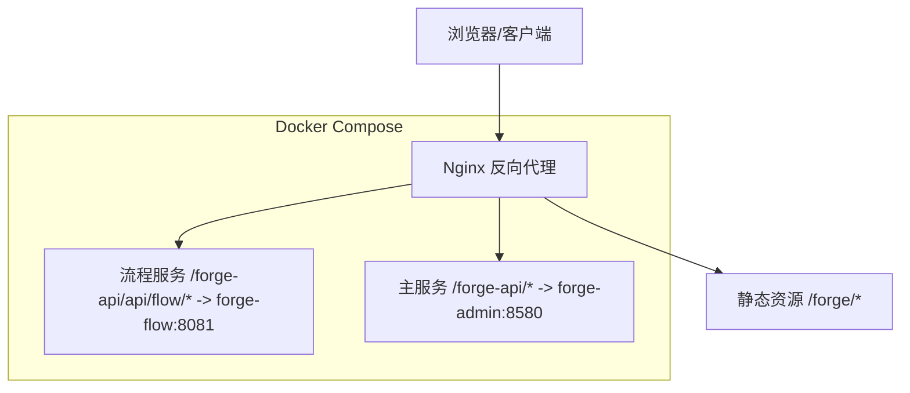
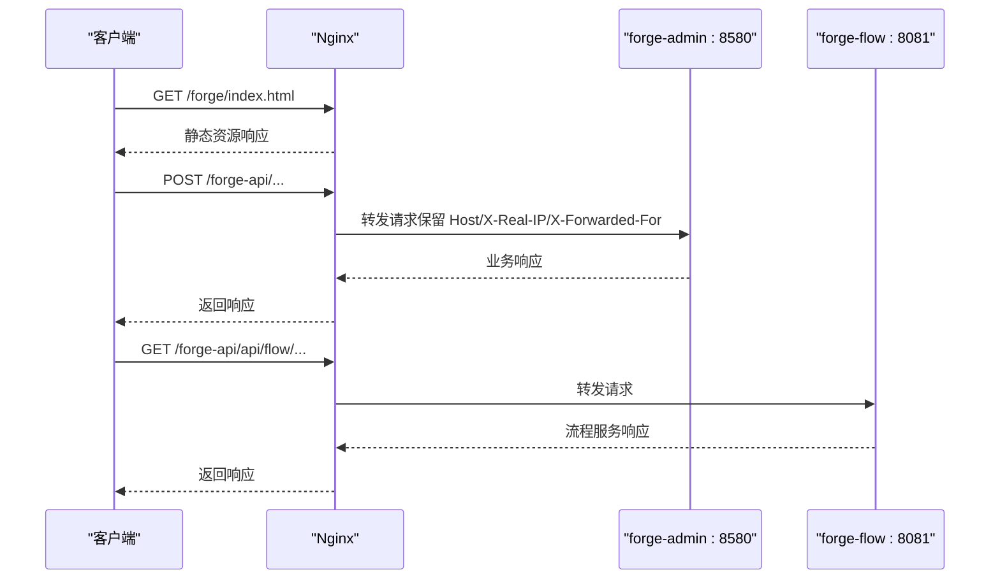
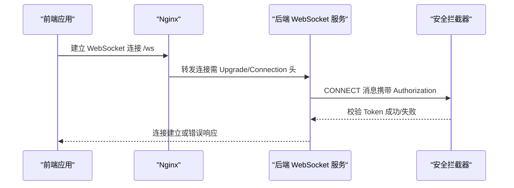
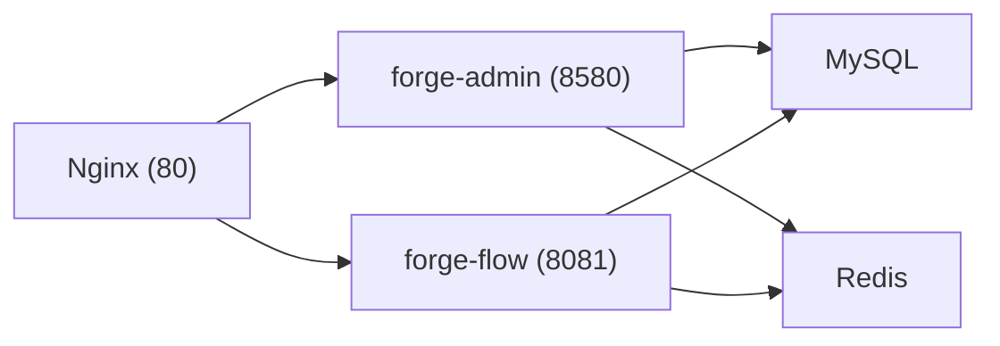

# Nginx反向代理

<cite>
**本文引用的文件**
- [NGINX_CONFIG.md](file://NGINX_CONFIG.md)
- [docker/nginx.conf](file://docker/nginx.conf)
- [docker-forge-admin/nginx.conf](file://docker-forge-admin/nginx.conf)
- [docker/docker-compose.yml](file://docker/docker-compose.yml)
- [forge-admin-ui/vite.config.js](file://forge-admin-ui/vite.config.js)
- [forge-h5-ui/vite.config.js](file://forge-h5-ui/vite.config.js)
- [AuthenticatedWebSocketChannelInterceptor.java](file://forge-server/forge-framework/forge-starter-parent/forge-starter-websocket/src/main/java/com/mdframe/forge/starter/websocket/security/AuthenticatedWebSocketChannelInterceptor.java)
- [WebSocketProperties.java](file://forge-server/forge-framework/forge-starter-parent/forge-starter-websocket/src/main/java/com/mdframe/forge/starter/websocket/security/WebSocketProperties.java)
</cite>

## 目录
1. [简介](#简介)
2. [项目结构](#项目结构)
3. [核心组件](#核心组件)
4. [架构总览](#架构总览)
5. [详细组件分析](#详细组件分析)
6. [依赖关系分析](#依赖关系分析)
7. [性能考虑](#性能考虑)
8. [故障排查指南](#故障排查指南)
9. [结论](#结论)
10. [附录](#附录)

## 简介
本文件面向在生产或容器环境中部署 Forge Admin 的前端与后端服务，提供基于 Nginx 的反向代理配置说明。内容涵盖：
- HTTP 服务器块、位置路由（静态资源与 API）
- 负载均衡与健康检查（概念性建议）
- 静态资源缓存策略、压缩传输与 CDN 集成要点
- WebSocket 支持配置（含安全认证）
- SSL/TLS 证书配置、HTTPS 强制跳转与安全头设置
- 性能优化参数（连接池、缓冲区、并发等）
- 故障排查方法与性能监控建议

## 项目结构
仓库中包含多套 Nginx 配置与编排文件，用于不同部署场景：
- 本地/生产示例配置：NGINX_CONFIG.md
- Docker 环境统一入口：docker/nginx.conf
- 独立运行时的 Nginx 配置：docker-forge-admin/nginx.conf
- 容器编排与服务端口映射：docker/docker-compose.yml
- 前端开发代理与 WebSocket 配置：forge-admin-ui/vite.config.js、forge-h5-ui/vite.config.js
- 后端 WebSocket 安全拦截器与属性：AuthenticatedWebSocketChannelInterceptor.java、WebSocketProperties.java

图表来源
- [docker/nginx.conf:1-41](file://docker/nginx.conf#L1-L41)
- [docker-forge-admin/nginx.conf:1-41](file://docker-forge-admin/nginx.conf#L1-L41)
- [docker/docker-compose.yml:61-149](file://docker/docker-compose.yml#L61-L149)

章节来源
- [NGINX_CONFIG.md:1-91](file://NGINX_CONFIG.md#L1-L91)
- [docker/nginx.conf:1-41](file://docker/nginx.conf#L1-L41)
- [docker-forge-admin/nginx.conf:1-41](file://docker-forge-admin/nginx.conf#L1-L41)
- [docker/docker-compose.yml:1-168](file://docker/docker-compose.yml#L1-L168)

## 核心组件
- HTTP 服务器块与监听端口：默认监听 80，server_name 可替换为域名或 IP。
- 静态资源路由：/forge/ 通过 alias 指向构建产物目录，并启用 try_files 以支持 SPA 路由回退。
- API 反向代理：
  - /forge-api/api/flow/ 转发至流程服务（端口 8081）
  - /forge-api/ 转发至主服务（端口 8580）
- 超时与头部透传：proxy_send_timeout、proxy_read_timeout、proxy_connect_timeout；Host、X-Real-IP、X-Forwarded-For。
- 上传大小限制：client_max_body_size。
- Gzip 压缩：启用 gzip 并指定类型与最小长度。

章节来源
- [NGINX_CONFIG.md:7-48](file://NGINX_CONFIG.md#L7-L48)
- [docker/nginx.conf:1-41](file://docker/nginx.conf#L1-L41)
- [docker-forge-admin/nginx.conf:1-41](file://docker-forge-admin/nginx.conf#L1-L41)

## 架构总览
Nginx 作为统一入口，将请求按路径分发到静态资源或后端服务。在 Docker 环境中，Nginx 通过内部网络访问 forge-admin 与 forge-flow 服务。

图表来源
- [docker/nginx.conf:5-32](file://docker/nginx.conf#L5-L32)
- [docker-forge-admin/nginx.conf:5-32](file://docker-forge-admin/nginx.conf#L5-L32)
- [docker/docker-compose.yml:61-149](file://docker/docker-compose.yml#L61-L149)

## 详细组件分析

### HTTP 服务器块与位置路由
- 监听端口与 server_name：根据部署环境设置为公网域名或内网地址。
- 静态资源 location /forge/：
  - 使用 alias 指向构建输出目录，确保路径正确拼接。
  - index 指定默认页面，try_files 实现 SPA 路由回退。
- API 反向代理：
  - 更精确的路径优先匹配：/forge-api/api/flow/ 先于 /forge-api/ 匹配。
  - 透传关键请求头，便于后端获取真实客户端信息。

章节来源
- [NGINX_CONFIG.md:12-39](file://NGINX_CONFIG.md#L12-L39)
- [docker/nginx.conf:5-32](file://docker/nginx.conf#L5-L32)
- [docker-forge-admin/nginx.conf:5-32](file://docker-forge-admin/nginx.conf#L5-L32)

### 负载均衡与健康检查（概念性建议）
- 当后端服务存在多个实例时，可在 upstream 中定义多个节点，并通过健康检查机制剔除异常节点。
- 结合容器编排（如 Kubernetes Ingress 或外部 LB）可实现更完善的自动发现与健康探测。
- 在本仓库的 Docker Compose 中，每个服务单实例暴露端口，适合单机或小型集群部署。

[本节为概念性说明，不直接引用具体代码]

### 静态资源服务配置
- 缓存策略：
  - 对静态资源（JS/CSS/图片）可开启长期缓存，并在文件名中加入哈希以避免缓存污染。
  - 注意宝塔面板等环境的默认静态资源规则可能覆盖 alias，需调整或禁用冲突规则。
- 压缩传输：
  - 启用 gzip，针对文本类资源进行压缩，降低带宽占用。
- CDN 集成：
  - 可将静态资源托管至 CDN，Nginx 仅负责动态 API 与 HTML 入口；CDN 侧配置缓存与压缩策略。

章节来源
- [NGINX_CONFIG.md:44-48](file://NGINX_CONFIG.md#L44-L48)
- [NGINX_CONFIG.md:53-62](file://NGINX_CONFIG.md#L53-L62)
- [docker/nginx.conf:37-40](file://docker/nginx.conf#L37-L40)
- [docker-forge-admin/nginx.conf:37-40](file://docker-forge-admin/nginx.conf#L37-L40)

### WebSocket 支持配置
- 前端开发代理已启用 WebSocket 代理到后端同一服务：
  - /ws 路径通过 ws: true 启用 WebSocket 代理。
- 生产环境 Nginx 如需支持 WebSocket，应添加升级头与连接保持相关配置（例如 Upgrade、Connection），并将 /ws 转发至后端服务。
- 后端 WebSocket 安全：
  - 通过 AuthenticatedWebSocketChannelInterceptor 强制 CONNECT 阶段携带 Bearer Token，未认证或无效 Token 将被拒绝。
  - WebSocketProperties 控制允许的订阅目标与应用目的地前缀，防止直连消息 Broker。

图表来源
- [forge-admin-ui/vite.config.js:151-157](file://forge-admin-ui/vite.config.js#L151-L157)
- [forge-h5-ui/vite.config.js:95-101](file://forge-h5-ui/vite.config.js#L95-L101)
- [AuthenticatedWebSocketChannelInterceptor.java:18-104](file://forge-server/forge-framework/forge-starter-parent/forge-starter-websocket/src/main/java/com/mdframe/forge/starter/websocket/security/AuthenticatedWebSocketChannelInterceptor.java#L18-L104)
- [WebSocketProperties.java:12-36](file://forge-server/forge-framework/forge-starter-parent/forge-starter-websocket/src/main/java/com/mdframe/forge/starter/websocket/security/WebSocketProperties.java#L12-L36)

章节来源
- [forge-admin-ui/vite.config.js:151-157](file://forge-admin-ui/vite.config.js#L151-L157)
- [forge-h5-ui/vite.config.js:95-101](file://forge-h5-ui/vite.config.js#L95-L101)
- [AuthenticatedWebSocketChannelInterceptor.java:18-104](file://forge-server/forge-framework/forge-starter-parent/forge-starter-websocket/src/main/java/com/mdframe/forge/starter/websocket/security/AuthenticatedWebSocketChannelInterceptor.java#L18-L104)
- [WebSocketProperties.java:12-36](file://forge-server/forge-framework/forge-starter-parent/forge-starter-websocket/src/main/java/com/mdframe/forge/starter/websocket/security/WebSocketProperties.java#L12-L36)

### SSL/TLS 证书配置与 HTTPS 强制跳转
- 建议在 Nginx 中监听 443 并配置证书与密钥，同时启用安全协议版本与加密套件。
- 可通过 80 端口监听并 301 跳转到 https://your-domain.com，确保所有流量加密。
- 安全头设置：
  - HSTS（Strict-Transport-Security）强制浏览器使用 HTTPS。
  - X-Content-Type-Options、X-Frame-Options、Referrer-Policy、Permissions-Policy 等增强安全性。
- 若使用 Let’s Encrypt 或云厂商证书管理，可结合自动化脚本更新证书。

[本节为通用实践说明，不直接引用具体代码]

### 性能优化配置
- 连接与缓冲：
  - worker_processes、worker_connections 根据 CPU 核数与内存调整。
  - sendfile、tcp_nopush、tcp_nodelay 提升静态资源传输效率。
  - proxy_buffer_size、proxy_buffers、proxy_busy_buffers_size 合理设置以应对大响应体。
- 并发与超时：
  - keepalive_timeout、keepalive_requests 控制长连接复用。
  - proxy_send_timeout、proxy_read_timeout、proxy_connect_timeout 避免慢请求阻塞。
- 压缩与缓存：
  - gzip on 与合适的 gzip_types、gzip_min_length。
  - 静态资源缓存头（Cache-Control、Expires）与版本号策略。
- 日志与监控：
  - access_log 与 error_log 分级记录，便于问题定位。
  - 结合 Prometheus + Grafana 或 ELK 栈采集指标与日志。

[本节为通用实践说明，不直接引用具体代码]

## 依赖关系分析
- Nginx 依赖后端服务：
  - forge-admin:8580（主服务）
  - forge-flow:8081（流程服务，可选）
- Docker Compose 编排了 MySQL、Redis、两个后端服务以及 Nginx，并通过内部网络通信。
- 前端开发代理在 Vite 中配置了 /ws 与 API 代理，便于本地调试。

图表来源
- [docker/docker-compose.yml:11-149](file://docker/docker-compose.yml#L11-L149)
- [docker/nginx.conf:12-32](file://docker/nginx.conf#L12-L32)
- [docker-forge-admin/nginx.conf:12-32](file://docker-forge-admin/nginx.conf#L12-L32)

章节来源
- [docker/docker-compose.yml:11-149](file://docker/docker-compose.yml#L11-L149)
- [docker/nginx.conf:12-32](file://docker/nginx.conf#L12-L32)
- [docker-forge-admin/nginx.conf:12-32](file://docker-forge-admin/nginx.conf#L12-L32)

## 性能考虑
- 静态资源：
  - 使用带哈希的文件名与长期缓存，减少重复下载。
  - 启用 gzip 压缩，降低传输体积。
- 反向代理：
  - 合理设置超时与缓冲，避免慢查询拖垮 Nginx。
  - 对频繁调用的接口启用上游连接池（如后端服务自身连接池）。
- WebSocket：
  - 确保 Upgrade/Connection 头正确传递，避免连接中断。
  - 在后端进行鉴权与限流，防止恶意连接。
- 监控：
  - 收集 Nginx 指标（连接数、请求速率、错误率）与后端服务指标（CPU、内存、GC）。
  - 结合告警规则及时发现异常。

[本节为通用实践说明，不直接引用具体代码]

## 故障排查指南
- 静态资源 404：
  - 检查 alias 路径末尾斜杠与 location 前缀是否一致。
  - 确认宝塔面板或其他 Web 服务器的默认静态规则未覆盖 alias。
- API 无法访问：
  - 检查 proxy_pass 目标地址与端口是否正确。
  - 查看 Nginx error_log 与后端服务日志，确认请求是否到达。
- WebSocket 连接失败：
  - 确认 Nginx 已配置 Upgrade/Connection 头转发。
  - 检查后端 WebSocket 安全拦截器是否要求有效 Bearer Token。
- 性能问题：
  - 观察 Nginx 与后端的 CPU、内存、连接数与错误率。
  - 调整 worker_processes、worker_connections、缓冲与超时参数。

章节来源
- [NGINX_CONFIG.md:53-62](file://NGINX_CONFIG.md#L53-L62)
- [AuthenticatedWebSocketChannelInterceptor.java:53-85](file://forge-server/forge-framework/forge-starter-parent/forge-starter-websocket/src/main/java/com/mdframe/forge/starter/websocket/security/AuthenticatedWebSocketChannelInterceptor.java#L53-L85)

## 结论
本仓库提供了适用于本地与容器环境的 Nginx 反向代理基础配置，覆盖了静态资源、API 转发、Gzip 压缩与上传大小限制。对于生产环境，建议补充 SSL/TLS、HTTPS 强制跳转、安全头、WebSocket 升级头、负载均衡与健康检查、性能调优与监控告警等能力，以提升安全性与稳定性。

## 附录
- 环境变量与端口：
  - NGINX_PORT、ADMIN_PORT、FLOW_PORT、MYSQL_PORT、REDIS_PORT 可在 docker-compose.yml 中配置。
- 前端构建与代理：
  - vite.config.js 中配置了开发代理与 WebSocket 代理，便于本地联调。

章节来源
- [docker/docker-compose.yml:11-149](file://docker/docker-compose.yml#L11-L149)
- [forge-admin-ui/vite.config.js:139-157](file://forge-admin-ui/vite.config.js#L139-L157)
- [forge-h5-ui/vite.config.js:72-101](file://forge-h5-ui/vite.config.js#L72-L101)