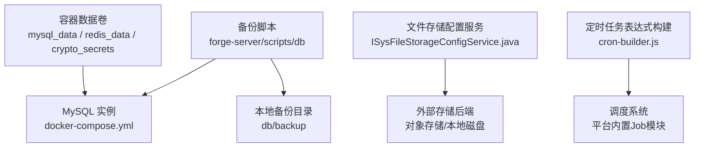
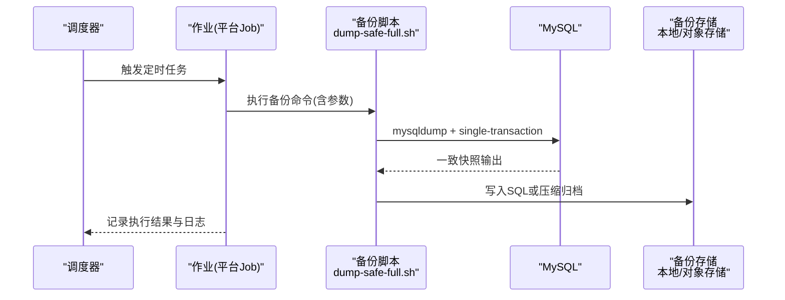
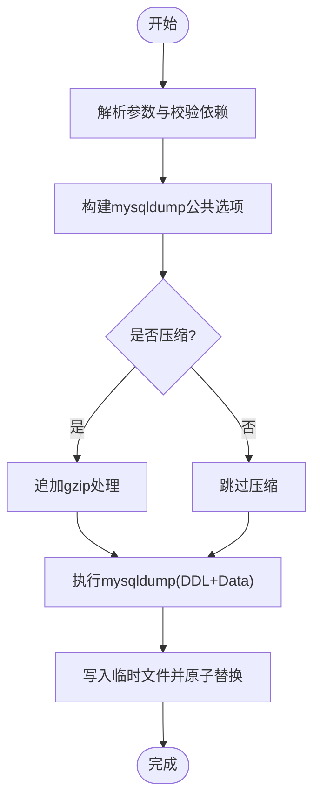
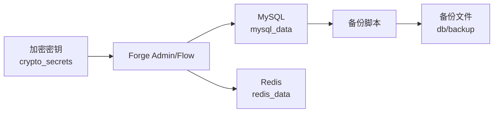

# 备份恢复

<cite>
**本文引用的文件**
- [dump-safe-full.sh](file://forge-server/scripts/db/dump-safe-full.sh)
- [init-db.sh](file://forge-server/scripts/db/init-db.sh)
- [export-community-db.sh](file://forge-server/scripts/db/export-community-db.sh)
- [docker-compose.yml](file://docker/docker-compose.yml)
- [ISysFileStorageConfigService.java](file://forge-server/forge-framework/forge-plugin-parent/forge-plugin-system/src/main/java/com/mdframe/forge/plugin/system/service/ISysFileStorageConfigService.java)
- [SysFileStorageConfigController.java](file://forge-server/forge-framework/forge-plugin-parent/forge-plugin-system/src/main/java/com/mdframe/forge/plugin/system/controller/SysFileStorageConfigController.java)
- [cron-builder.js](file://forge-admin-ui/src/components/job/cron-builder.js)
</cite>

## 目录
1. [简介](#简介)
2. [项目结构](#项目结构)
3. [核心组件](#核心组件)
4. [架构总览](#架构总览)
5. [详细组件分析](#详细组件分析)
6. [依赖关系分析](#依赖关系分析)
7. [性能考虑](#性能考虑)
8. [故障排查指南](#故障排查指南)
9. [结论](#结论)
10. [附录](#附录)

## 简介
本指南面向Forge Admin的运维与开发团队，提供完整的数据库与文件存储备份、恢复与演练方案。内容覆盖：
- 数据库全量备份策略与事务一致性保证
- 增量备份思路与落地建议（结合MySQL生态）
- 备份脚本使用方法、定时任务配置、存储空间管理与备份加密
- 灾难恢复流程：数据恢复验证、服务重启顺序与业务连续性保障
- 文件存储备份方案：用户上传文件、配置文件与日志文件的备份策略
- 备份测试、恢复演练与最佳实践

## 项目结构
仓库中与备份恢复直接相关的代码与脚本主要集中在以下位置：
- 数据库备份与初始化脚本：forge-server/scripts/db
- 容器编排与持久化卷：docker/docker-compose.yml
- 文件存储配置能力：forge-server/forge-framework/.../system 下的服务与控制器
- 前端定时任务表达式构建：forge-admin-ui/src/components/job/cron-builder.js

图表来源
- [dump-safe-full.sh:1-454](file://forge-server/scripts/db/dump-safe-full.sh#L1-L454)
- [docker-compose.yml:11-168](file://docker/docker-compose.yml#L11-L168)
- [ISysFileStorageConfigService.java:1-49](file://forge-server/forge-framework/forge-plugin-parent/forge-plugin-system/src/main/java/com/mdframe/forge/plugin/system/service/ISysFileStorageConfigService.java#L1-L49)
- [cron-builder.js:1-42](file://forge-admin-ui/src/components/job/cron-builder.js#L1-L42)

章节来源
- [docker-compose.yml:11-168](file://docker/docker-compose.yml#L11-L168)
- [dump-safe-full.sh:1-454](file://forge-server/scripts/db/dump-safe-full.sh#L1-L454)

## 核心组件
- 安全全量导出脚本：支持DDL+数据导出，默认跳过运行期/日志/敏感表，支持压缩、SSL、只读模式等选项，适合生产环境定期全量备份。
- 数据库初始化脚本：用于新建或重建库，按序执行种子SQL与可选模块数据。
- 社区版导出工具：导出Schema与Seed并生成摘要，便于合规与审计。
- 文件存储配置服务：提供默认存储配置查询、启用/禁用、创建桶/目录、连接测试等能力，支撑多后端存储的统一管理。
- 定时任务表达式构建：提供常用调度类型到Cron表达式的转换，便于在平台内配置周期性备份任务。

章节来源
- [dump-safe-full.sh:1-454](file://forge-server/scripts/db/dump-safe-full.sh#L1-L454)
- [init-db.sh:1-134](file://forge-server/scripts/db/init-db.sh#L1-L134)
- [export-community-db.sh:1-36](file://forge-server/scripts/db/export-community-db.sh#L1-L36)
- [ISysFileStorageConfigService.java:1-49](file://forge-server/forge-framework/forge-plugin-parent/forge-plugin-system/src/main/java/com/mdframe/forge/plugin/system/service/ISysFileStorageConfigService.java#L1-L49)
- [SysFileStorageConfigController.java:112-139](file://forge-server/forge-framework/forge-plugin-parent/forge-plugin-system/src/main/java/com/mdframe/forge/plugin/system/controller/SysFileStorageConfigController.java#L112-L139)
- [cron-builder.js:1-42](file://forge-admin-ui/src/components/job/cron-builder.js#L1-L42)

## 架构总览
下图展示了从“计划触发”到“备份产出”的关键路径，以及恢复时的服务启动顺序。

图表来源
- [dump-safe-full.sh:203-217](file://forge-server/scripts/db/dump-safe-full.sh#L203-L217)
- [docker-compose.yml:11-168](file://docker/docker-compose.yml#L11-L168)

## 详细组件分析

### 数据库全量备份：dump-safe-full.sh
- 功能要点
  - 使用mysqldump进行逻辑备份，开启single-transaction、skip-lock-tables、quick、hex-blob、complete-insert等选项，确保在线、低干扰、高一致性。
  - 默认跳过Flowable运行时表与版本表；默认跳过日志/运行期/敏感配置表，避免冗余与敏感信息泄露。
  - 支持--gzip压缩输出、--ssl-mode加密传输、--dry-run预览将要执行的命令。
  - 输出包含DDL与INSERT语句，并在末尾恢复外键与唯一性检查开关，便于后续导入。
- 典型用法
  - 通过环境变量MYSQL_PWD传入密码，或使用--password参数。
  - 指定host/port/database/user，必要时设置ssl-mode。
  - 可通过--ignore-data-table/--ignore-data-regex进一步排除特定表的数据。
  - 输出目录默认位于项目根db/backup，也可自定义--output-dir或--output。
- 事务一致性
  - 基于InnoDB的single-transaction实现快照级一致性，不锁表，不影响在线读写。
- 注意事项
  - 需要安装mysql/mysqldump/gzip客户端。
  - 大库备份耗时较长，建议在低峰期执行。
  - 若需包含日志或敏感数据，请使用对应开关显式开启。

图表来源
- [dump-safe-full.sh:167-227](file://forge-server/scripts/db/dump-safe-full.sh#L167-L227)
- [dump-safe-full.sh:385-454](file://forge-server/scripts/db/dump-safe-full.sh#L385-L454)

章节来源
- [dump-safe-full.sh:1-454](file://forge-server/scripts/db/dump-safe-full.sh#L1-L454)

### 数据库初始化与重建：init-db.sh
- 功能要点
  - 创建数据库并设置字符集与排序规则。
  - 依次执行全量初始化SQL、必需种子数据、可选模块与演示数据。
  - 支持跳过admin初始化、按需导入demo/optional/module数据。
- 适用场景
  - 新环境初始化、测试环境重建、灾难恢复后重新灌入基础数据。
- 注意
  - 执行前请确认目标库为空或已做好备份。
  - 如需完整业务数据，应配合全量备份恢复后再执行种子数据。

章节来源
- [init-db.sh:1-134](file://forge-server/scripts/db/init-db.sh#L1-L134)

### 社区版导出：export-community-db.sh
- 功能要点
  - 调用Node脚本导出Schema与Seed，并进行敏感数据扫描。
  - 生成summary.md汇总导出模式与检查结果。
- 适用场景
  - 合规审计、发布包准备、第三方交付前的数据基线导出。

章节来源
- [export-community-db.sh:1-36](file://forge-server/scripts/db/export-community-db.sh#L1-L36)

### 文件存储备份：配置与服务
- 能力概览
  - 提供默认存储配置查询、启用/禁用、创建桶/目录、连接测试等接口，便于统一接入多种后端存储。
  - 前端上传组件通过默认配置获取存储策略，支持多存储选项选择。
- 备份策略建议
  - 对象存储：利用云厂商自带的跨地域复制、版本控制与生命周期策略。
  - 本地磁盘：通过操作系统级快照或rsync同步至异地节点。
  - 配置项：对sys_file_storage_config等配置表纳入数据库备份范围（默认脚本会排除敏感表，可按需开启）。
- 相关接口
  - 获取默认配置、获取启用的存储选项、创建桶/目录、测试连接等。

章节来源
- [ISysFileStorageConfigService.java:1-49](file://forge-server/forge-framework/forge-plugin-parent/forge-plugin-system/src/main/java/com/mdframe/forge/plugin/system/service/ISysFileStorageConfigService.java#L1-L49)
- [SysFileStorageConfigController.java:112-139](file://forge-server/forge-framework/forge-plugin-parent/forge-plugin-system/src/main/java/com/mdframe/forge/plugin/system/controller/SysFileStorageConfigController.java#L112-L139)

### 定时任务与调度：cron-builder.js
- 功能要点
  - 将简单调度类型（每分钟/每小时/每天/每周/每月）转换为标准Cron表达式。
  - 便于在平台作业中配置周期性备份任务。
- 使用建议
  - 在平台作业中心创建“备份作业”，使用生成的Cron表达式设定周期。
  - 结合告警与重试机制，确保备份任务可靠执行。

章节来源
- [cron-builder.js:1-42](file://forge-admin-ui/src/components/job/cron-builder.js#L1-L42)

## 依赖关系分析
- 备份脚本依赖
  - 外部工具：mysql、mysqldump、gzip（可选）。
  - 网络与安全：MySQL主机、端口、SSL模式。
  - 文件系统：输出目录权限与空间。
- 容器化部署依赖
  - MySQL数据卷：mysql_data
  - Redis数据卷：redis_data（缓存与会话）
  - 密钥卷：crypto_secrets（加密相关配置）
- 服务启动顺序
  - 先启动MySQL与Redis，再启动Flow与Admin，最后前端Nginx。

图表来源
- [docker-compose.yml:11-168](file://docker/docker-compose.yml#L11-L168)
- [dump-safe-full.sh:167-227](file://forge-server/scripts/db/dump-safe-full.sh#L167-L227)

章节来源
- [docker-compose.yml:11-168](file://docker/docker-compose.yml#L11-L168)
- [dump-safe-full.sh:167-227](file://forge-server/scripts/db/dump-safe-full.sh#L167-L227)

## 性能考虑
- 备份窗口
  - 全量备份建议在业务低峰期执行，避免影响线上性能。
  - 大库可拆分导出（如按表组）或采用物理备份工具（如XtraBackup）做增量。
- 资源占用
  - mysqldump的single-transaction会产生一定undo压力，监控CPU/IO/内存。
  - 压缩会增加CPU开销，但显著减少I/O与网络带宽占用。
- 并发与锁
  - 脚本默认skip-lock-tables，避免阻塞写操作；但仍需关注长事务与热点表。
- 存储规划
  - 为db/backup预留足够空间，并结合保留策略清理历史备份。
  - 对对象存储启用版本控制与生命周期规则，自动归档与过期清理。

[本节为通用指导，无需具体文件引用]

## 故障排查指南
- 常见错误
  - 缺少mysql/mysqldump/gzip客户端：安装对应工具后重试。
  - 权限不足：确保对输出目录有写权限，MySQL用户具备备份所需权限。
  - SSL连接失败：核对--ssl-mode与证书配置。
  - 空间不足：清理历史备份或扩容磁盘。
- 恢复验证
  - 先在隔离环境导入备份，校验关键表行数与业务主流程。
  - 对比应用侧指标（登录、表单提交、流程流转）是否正常。
- 日志与回滚
  - 记录每次备份/恢复的时间点、操作人、源/目标环境与结果。
  - 若恢复失败，立即回滚到上一可用版本，并保留现场日志。

章节来源
- [dump-safe-full.sh:167-227](file://forge-server/scripts/db/dump-safe-full.sh#L167-L227)
- [docker-compose.yml:11-168](file://docker/docker-compose.yml#L11-L168)

## 结论
- 使用dump-safe-full.sh可实现生产级安全全量备份，兼顾一致性与最小干扰。
- 结合平台作业与cron-builder.js，可将备份纳入统一调度与告警体系。
- 文件存储应依托对象存储的版本控制与生命周期策略，或本地快照/同步方案。
- 恢复演练必须常态化，确保RTO/RPO满足业务要求。

[本节为总结性内容，无需具体文件引用]

## 附录

### 备份策略建议
- 全量备份
  - 每日一次，低峰期执行，保留至少7-14天。
  - 使用--gzip压缩，并传输至异地存储。
- 增量备份
  - 基于MySQL binlog或物理备份工具（如XtraBackup）实现小时级增量。
  - 与全量备份组合，满足更短RPO。
- 事务一致性
  - 依赖single-transaction快照；避免在备份期间执行长时间大事务。
- 敏感数据
  - 默认排除敏感表；如需导出，显式开启并加强保护。

[本节为通用指导，无需具体文件引用]

### 定时任务配置参考
- 在平台作业中心创建“数据库备份”作业，使用cron-builder.js生成的表达式，例如每天凌晨2点执行。
- 作业参数示例（概念说明）
  - host/port/database/user/password
  - ssl-mode（可选）
  - gzip（可选）
  - output-dir（可选）
- 告警与重试
  - 配置失败重试与告警通知，确保异常及时暴露。

章节来源
- [cron-builder.js:1-42](file://forge-admin-ui/src/components/job/cron-builder.js#L1-L42)

### 存储空间管理
- 本地备份
  - 定期清理超过保留期的备份文件。
  - 监控磁盘使用率，设置阈值告警。
- 对象存储
  - 启用版本控制，设置生命周期策略自动归档与删除。
  - 跨地域复制提升容灾能力。

[本节为通用指导，无需具体文件引用]

### 备份文件加密
- 传输加密
  - 使用--ssl-mode连接MySQL，防止明文传输。
- 静态加密
  - 对备份文件进行压缩后，使用gpg或云KMS进行加密。
  - 密钥与备份分离保管，遵循最小权限原则。

[本节为通用指导，无需具体文件引用]

### 灾难恢复流程
- 恢复步骤
  - 停止写入：暂停对外服务或切换到只读。
  - 恢复数据库：导入最近的全量备份，必要时回放binlog。
  - 恢复文件存储：从对象存储或本地快照还原。
  - 启动服务：按顺序启动MySQL -> Redis -> Flow -> Admin -> UI。
  - 验证业务：登录、表单、流程、报表等关键链路。
- 服务重启顺序
  - 依据容器编排依赖：先数据库与缓存，再后端服务，最后前端。

章节来源
- [docker-compose.yml:61-149](file://docker/docker-compose.yml#L61-L149)

### 备份测试与恢复演练
- 定期演练
  - 每月进行一次完整恢复演练，记录RTO/RPO。
- 自动化验证
  - 恢复后自动执行健康检查脚本，校验关键表与接口。
- 文档与复盘
  - 记录演练过程、问题与改进措施，持续优化预案。

[本节为通用指导，无需具体文件引用]