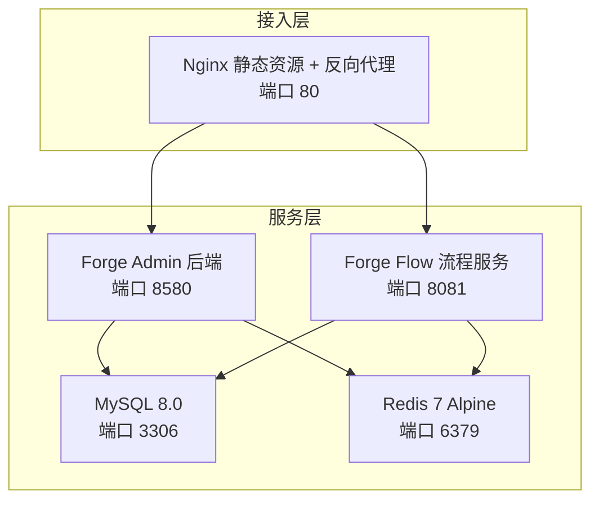
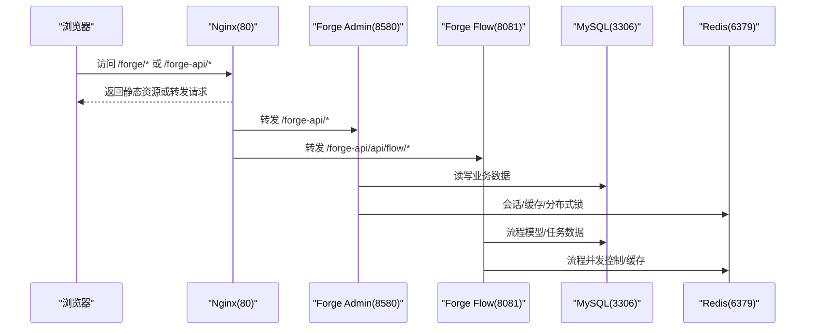
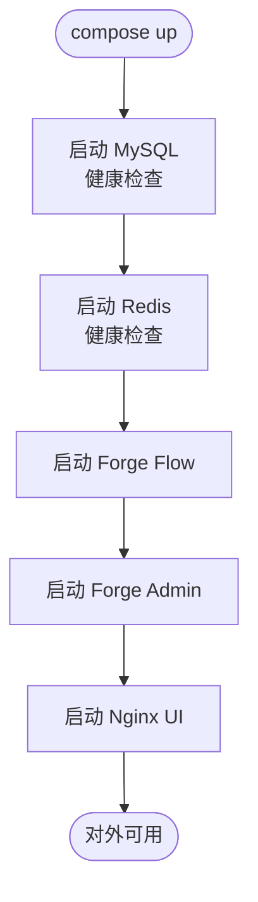
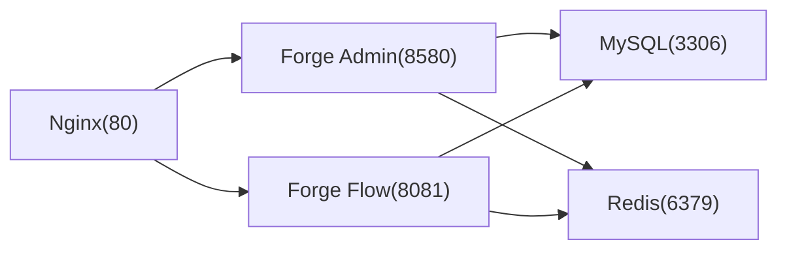

# 容器化部署

<cite>
**本文引用的文件**
- [docker/Dockerfile.admin](file://docker/Dockerfile.admin)
- [docker/Dockerfile.flow](file://docker/Dockerfile.flow)
- [docker/Dockerfile.ui](file://docker/Dockerfile.ui)
- [docker/docker-compose.yml](file://docker/docker-compose.yml)
- [docker/nginx.conf](file://docker/nginx.conf)
- [docker-forge-admin/Dockerfile.admin](file://docker-forge-admin/Dockerfile.admin)
- [docker-forge-admin/Dockerfile.flow](file://docker-forge-admin/Dockerfile.flow)
- [docker-forge-admin/Dockerfile.ui](file://docker-forge-admin/Dockerfile.ui)
- [docker-forge-admin/docker-compose.yml](file://docker-forge-admin/docker-compose.yml)
- [docker-forge-admin/application-datasource.yml](file://docker-forge-admin/application-datasource.yml)
</cite>

## 目录
1. [简介](#简介)
2. [项目结构](#项目结构)
3. [核心组件](#核心组件)
4. [架构总览](#架构总览)
5. [详细组件分析](#详细组件分析)
6. [依赖关系分析](#依赖关系分析)
7. [性能与资源优化](#性能与资源优化)
8. [故障排查指南](#故障排查指南)
9. [结论](#结论)
10. [附录](#附录)

## 简介
本指南面向生产环境，提供 Forge Admin 的容器化部署综合方案。内容覆盖多阶段镜像构建、Dockerfile 配置要点、Docker Compose 编排、网络与数据卷管理、环境变量注入、健康检查、日志收集、监控与调优、安全加固与故障恢复策略等。文档基于仓库中 docker 与 docker-forge-admin 两套编排实现进行对比说明，帮助你在不同工程结构下选择合适方案并落地生产。

## 项目结构
仓库包含两套可独立使用的容器化方案：
- docker：以根级 forge/ 为后端源码上下文，构建 forge-admin、forge-flow 与前端 UI 镜像，并通过 nginx 统一入口对外暴露。
- docker-forge-admin：以 forge-server 为后端源码上下文，使用 application-datasource.yml 挂载外部配置，便于在容器中灵活调整数据库与缓存连接参数。

**图示来源**
- [docker/docker-compose.yml:11-168](file://docker/docker-compose.yml#L11-L168)
- [docker-forge-admin/docker-compose.yml:11-173](file://docker-forge-admin/docker-compose.yml#L11-L173)

**章节来源**
- [docker/docker-compose.yml:11-168](file://docker/docker-compose.yml#L11-L168)
- [docker-forge-admin/docker-compose.yml:11-173](file://docker-forge-admin/docker-compose.yml#L11-L173)

## 核心组件
- 后端镜像（Admin）：基于 JRE 运行 Spring Boot 应用，通过环境变量注入数据库与 Redis 连接信息，支持加密密钥持久化与启动开关。
- 后端镜像（Flow）：流程引擎服务，同样基于 JRE，提供工作流建模与执行能力。
- 前端镜像（UI）：Node 构建产物由 Nginx 托管，提供静态资源与路由回退；同时作为反向代理将 /forge-api 转发至后端。
- 数据与缓存：MySQL 8.0 与 Redis 7 Alpine，均具备健康检查与持久化卷。
- 编排：Compose 定义服务依赖、网络、卷、端口映射与环境变量，确保启动顺序与可用性。

**章节来源**
- [docker/Dockerfile.admin:1-39](file://docker/Dockerfile.admin#L1-L39)
- [docker/Dockerfile.flow:1-37](file://docker/Dockerfile.flow#L1-L37)
- [docker/Dockerfile.ui:1-17](file://docker/Dockerfile.ui#L1-L17)
- [docker/docker-compose.yml:11-168](file://docker/docker-compose.yml#L11-L168)
- [docker-forge-admin/Dockerfile.admin:1-32](file://docker-forge-admin/Dockerfile.admin#L1-L32)
- [docker-forge-admin/Dockerfile.flow:1-30](file://docker-forge-admin/Dockerfile.flow#L1-L30)
- [docker-forge-admin/Dockerfile.ui:1-17](file://docker-forge-admin/Dockerfile.ui#L1-L17)
- [docker-forge-admin/docker-compose.yml:11-173](file://docker-forge-admin/docker-compose.yml#L11-L173)

## 架构总览
下图展示请求从浏览器到 Nginx，再到后端服务的完整链路，以及后端对 MySQL 与 Redis 的访问路径。

**图示来源**
- [docker/nginx.conf:1-42](file://docker/nginx.conf#L1-L42)
- [docker/docker-compose.yml:61-149](file://docker/docker-compose.yml#L61-L149)
- [docker-forge-admin/docker-compose.yml:61-154](file://docker-forge-admin/docker-compose.yml#L61-L154)

## 详细组件分析

### Dockerfile 多阶段构建与镜像大小控制
- 构建阶段
  - 后端：使用 JDK 镜像执行 Maven 打包，仅输出最终 jar。
  - 前端：使用 Node 镜像安装依赖并构建 dist，再复制到 Nginx 镜像。
- 运行阶段
  - 后端：基于 JRE 镜像，仅拷贝 jar 与必要环境变量，显著减小镜像体积。
  - 前端：基于 Nginx Alpine，仅拷贝构建产物与配置文件。
- 关键优化点
  - 分层缓存：先复制 package.json/pnpm-lock.yaml 再安装依赖，提升缓存命中率。
  - 最小运行时：JRE 替代 JDK，Alpine 基础镜像减少冗余。
  - 单职责：每个阶段只做一件事，避免多余工具链进入运行镜像。

**章节来源**
- [docker/Dockerfile.admin:1-39](file://docker/Dockerfile.admin#L1-L39)
- [docker/Dockerfile.flow:1-37](file://docker/Dockerfile.flow#L1-L37)
- [docker/Dockerfile.ui:1-17](file://docker/Dockerfile.ui#L1-L17)
- [docker-forge-admin/Dockerfile.admin:1-32](file://docker-forge-admin/Dockerfile.admin#L1-L32)
- [docker-forge-admin/Dockerfile.flow:1-30](file://docker-forge-admin/Dockerfile.flow#L1-L30)
- [docker-forge-admin/Dockerfile.ui:1-17](file://docker-forge-admin/Dockerfile.ui#L1-L17)

### 后端运行环境与参数注入
- 环境变量
  - 数据库：MYSQL_HOST/MYSQL_PORT/MYSQL_DB/MYSQL_USER/MYSQL_PASSWORD
  - 缓存：REDIS_HOST/REDIS_PORT/REDIS_PASSWORD
  - 流程服务：FLOW_CLIENT_URL
  - JVM：JAVA_OPTS（内存限制）
  - 安全：FORGE_CRYPTO_* 系列开关与密钥持久化配置
- 启动命令
  - 通过 -D 参数注入 Spring 属性，覆盖默认配置，适配容器动态环境。
  - 支持 profiles 切换（prod）。
- 注意事项
  - 敏感信息建议通过外部密钥管理或 Compose secrets 注入，避免硬编码。
  - 数据库 URL 中的时区、字符集、批处理等参数需与生产一致。

**章节来源**
- [docker/Dockerfile.admin:14-38](file://docker/Dockerfile.admin#L14-L38)
- [docker/Dockerfile.flow:14-36](file://docker/Dockerfile.flow#L14-L36)
- [docker-forge-admin/Dockerfile.admin:14-31](file://docker-forge-admin/Dockerfile.admin#L14-L31)
- [docker-forge-admin/Dockerfile.flow:14-29](file://docker-forge-admin/Dockerfile.flow#L14-L29)

### Docker Compose 编排与服务依赖
- 服务定义
  - mysql：初始化脚本挂载、健康检查、字符集与排序规则设置。
  - redis：密码保护、AOF 持久化、健康检查。
  - forge-flow：依赖 mysql/redis 健康后启动。
  - forge-admin：依赖 mysql/redis 健康与 flow 启动后启动。
  - forge-ui：依赖 admin/flow 启动后暴露 80 端口。
- 网络与卷
  - 自定义 bridge 网络隔离服务间通信。
  - 数据卷持久化 MySQL 与 Redis 数据，以及加密密钥存储。
- 环境变量
  - 通过 .env 或 compose 内联方式注入，支持默认值与覆盖。

**图示来源**
- [docker/docker-compose.yml:11-168](file://docker/docker-compose.yml#L11-L168)
- [docker-forge-admin/docker-compose.yml:11-173](file://docker-forge-admin/docker-compose.yml#L11-L173)

**章节来源**
- [docker/docker-compose.yml:11-168](file://docker/docker-compose.yml#L11-L168)
- [docker-forge-admin/docker-compose.yml:11-173](file://docker-forge-admin/docker-compose.yml#L11-L173)

### Nginx 反向代理与静态资源
- 静态资源：/forge/* 指向构建产物目录，启用 try_files 实现 SPA 路由回退。
- API 代理：/forge-api/* 转发至 forge-admin，/forge-api/api/flow/* 转发至 forge-flow。
- 超时与上传：合理设置代理超时与最大请求体大小，满足大文件上传场景。
- 压缩：开启 Gzip，降低带宽占用。

**章节来源**
- [docker/nginx.conf:1-42](file://docker/nginx.conf#L1-L42)

### 数据源与缓存配置（application-datasource.yml）
- 数据源
  - HikariCP 连接池参数：最大连接数、空闲时间、生命周期等。
  - JDBC URL 含时区、字符集、批处理等生产常用参数。
- Redis
  - 连接地址、密码、超时、重试次数与连接池大小。
  - 线程与 Netty 线程数用于高并发场景。
- Flowable
  - 自动更新 schema、异步执行器激活、历史级别与字体配置。

**章节来源**
- [docker-forge-admin/application-datasource.yml:1-61](file://docker-forge-admin/application-datasource.yml#L1-L61)

## 依赖关系分析
- 服务间依赖
  - forge-admin 依赖 mysql、redis、forge-flow。
  - forge-flow 依赖 mysql、redis。
  - forge-ui 依赖 forge-admin、forge-flow。
- 构建依赖
  - 后端：Maven 打包生成 jar。
  - 前端：pnpm 安装依赖并构建 dist。
- 外部依赖
  - MySQL 8.0、Redis 7 Alpine、Nginx 1.25。

**图示来源**
- [docker/docker-compose.yml:61-149](file://docker/docker-compose.yml#L61-L149)
- [docker-forge-admin/docker-compose.yml:61-154](file://docker-forge-admin/docker-compose.yml#L61-L154)

**章节来源**
- [docker/docker-compose.yml:61-149](file://docker/docker-compose.yml#L61-L149)
- [docker-forge-admin/docker-compose.yml:61-154](file://docker-forge-admin/docker-compose.yml#L61-L154)

## 性能与资源优化
- 镜像体积
  - 使用 JRE 运行后端，Alpine 作为前端基础镜像，减少冗余包。
  - 多阶段构建分离构建与运行环境。
- JVM 参数
  - JAVA_OPTS 设置堆大小，结合容器资源限制（CPU/内存）避免 OOM。
- 连接池与超时
  - HikariCP 连接池大小与超时时间根据负载调优。
  - Redis 连接池与重试间隔平衡吞吐与稳定性。
- Nginx 优化
  - 合理代理超时与 Gzip 压缩，提升首屏与接口响应速度。
- 资源限制（生产建议）
  - 为各服务设置 CPU 与内存上限，防止相互影响。
  - 使用只读文件系统与最小权限用户运行容器进程。

[本节为通用指导，不直接分析具体文件]

## 故障排查指南
- 启动失败
  - 检查依赖服务健康状态（mysql/redis），确认端口与网络连通。
  - 核对环境变量是否注入正确，尤其是数据库与 Redis 密码。
- 数据库连接异常
  - 校验 JDBC URL 中的时区、字符集与认证插件。
  - 确认数据库账号权限与表结构初始化完成。
- Redis 连接失败
  - 检查密码与端口，确认 Redis 已启用 requirepass。
- 前端无法访问
  - 确认 Nginx 已挂载构建产物与配置文件，/forge 路由回退生效。
- 日志定位
  - 查看容器标准输出与应用日志，结合 Compose logs 快速定位问题。

**章节来源**
- [docker/docker-compose.yml:33-37](file://docker/docker-compose.yml#L33-L37)
- [docker/docker-compose.yml:53-57](file://docker/docker-compose.yml#L53-L57)
- [docker-forge-admin/docker-compose.yml:33-37](file://docker-forge-admin/docker-compose.yml#L33-L37)
- [docker-forge-admin/docker-compose.yml:53-57](file://docker-forge-admin/docker-compose.yml#L53-L57)

## 结论
本项目提供了两套成熟的容器化方案，分别适配不同的工程结构与运维需求。通过多阶段构建、最小运行时、健康检查与数据卷持久化，实现了可重复、可观测、可扩展的生产级部署。建议在正式环境结合密钥管理、资源限制、日志与监控体系，持续优化性能与安全性。

[本节为总结性内容，不直接分析具体文件]

## 附录
- 一键部署步骤（参考 Compose 注释）
  - 进入 docker 或 docker-forge-admin 目录，复制环境变量模板并修改。
  - 使用 docker compose up -d 启动全部服务。
  - 访问 http://localhost/forge，默认管理员账号见 README。
- 生产最佳实践清单
  - 使用外部密钥管理服务注入敏感配置。
  - 为所有服务设置健康检查与重启策略。
  - 启用日志采集与集中存储，配合告警规则。
  - 定期备份 MySQL 数据与加密密钥卷。
  - 灰度发布与回滚策略，确保变更可控。

**章节来源**
- [docker/docker-compose.yml:1-9](file://docker/docker-compose.yml#L1-L9)
- [docker-forge-admin/docker-compose.yml:1-9](file://docker-forge-admin/docker-compose.yml#L1-L9)