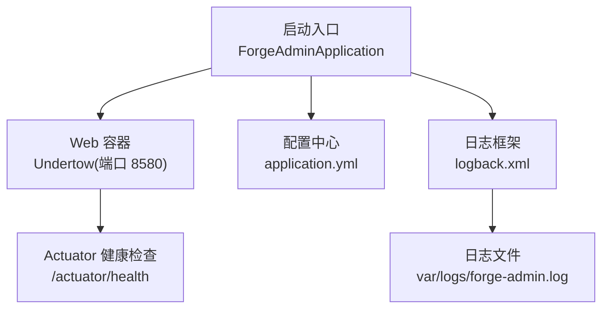
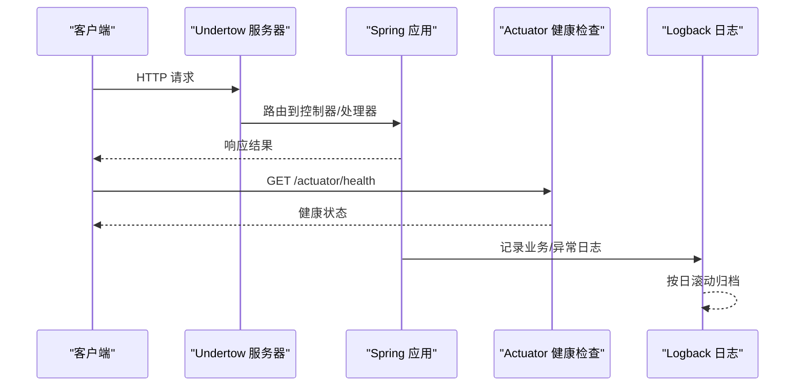
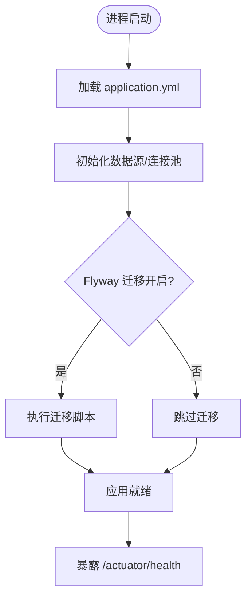
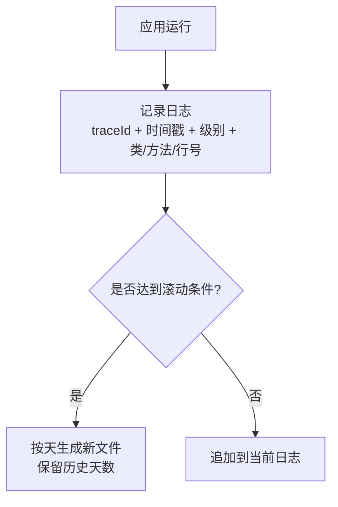
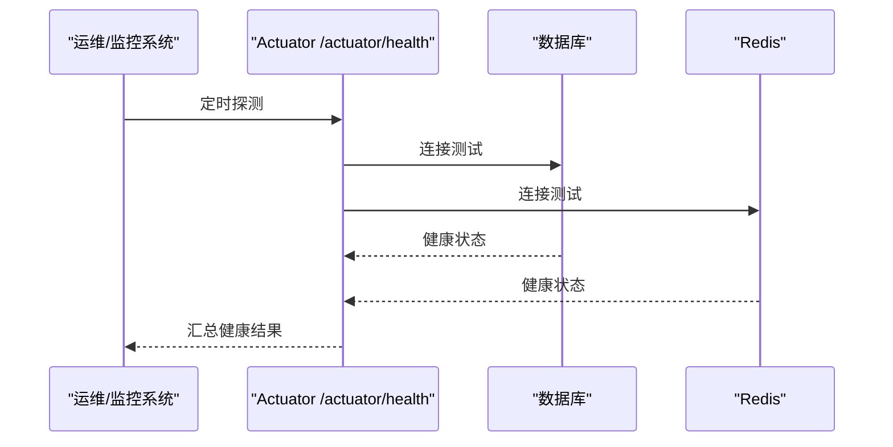
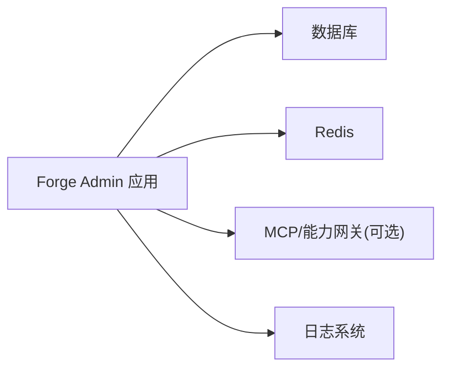

# 故障排查

<cite>
**本文引用的文件**
- [application.yml](file://forge-server/forge-admin-server/src/main/resources/application.yml)
- [logback.xml](file://forge-server/forge-admin-server/src/main/resources/logback.xml)
- [ForgeAdminApplication.java](file://forge-server/forge-admin-server/src/main/java/com/mdframe/forge/admin/ForgeAdminApplication.java)
</cite>

## 目录
1. [简介](#简介)
2. [项目结构](#项目结构)
3. [核心组件](#核心组件)
4. [架构总览](#架构总览)
5. [详细组件分析](#详细组件分析)
6. [依赖关系分析](#依赖关系分析)
7. [性能注意事项](#性能注意事项)
8. [故障排查指南](#故障排查指南)
9. [结论](#结论)
10. [附录](#附录)

## 简介
本指南面向 Forge Admin 的运维与开发人员，聚焦常见问题的快速定位与解决，包括启动失败、连接超时、内存溢出和性能问题。文档提供日志分析方法（错误日志定位、堆栈跟踪分析、性能日志解读）、调试工具与技巧（远程调试、线程 dump、内存分析）、系统健康检查方法（服务状态、依赖可用性、资源使用率），并给出典型故障场景的解决案例与预防措施建议。

## 项目结构
Forge Admin 后端以 Spring Boot 应用形式运行，入口类为 ForgeAdminApplication，配置文件位于 resources 下，包含 application.yml 与 logback.xml。应用通过 Undertow 作为 Web 容器，启用 Actuator 暴露 health 端点用于健康检查；日志输出到 var/logs 目录，按天滚动。

图表来源
- [ForgeAdminApplication.java:8-15](file://forge-server/forge-admin-server/src/main/java/com/mdframe/forge/admin/ForgeAdminApplication.java#L8-L15)
- [application.yml:2-21](file://forge-server/forge-admin-server/src/main/resources/application.yml#L2-L21)
- [application.yml:220-227](file://forge-server/forge-admin-server/src/main/resources/application.yml#L220-L227)
- [logback.xml:3-6](file://forge-server/forge-admin-server/src/main/resources/logback.xml#L3-L6)
- [logback.xml:14-27](file://forge-server/forge-admin-server/src/main/resources/logback.xml#L14-L27)

章节来源
- [ForgeAdminApplication.java:8-15](file://forge-server/forge-admin-server/src/main/java/com/mdframe/forge/admin/ForgeAdminApplication.java#L8-L15)
- [application.yml:2-21](file://forge-server/forge-admin-server/src/main/resources/application.yml#L2-L21)
- [application.yml:220-227](file://forge-server/forge-admin-server/src/main/resources/application.yml#L220-L227)
- [logback.xml:3-6](file://forge-server/forge-admin-server/src/main/resources/logback.xml#L3-L6)
- [logback.xml:14-27](file://forge-server/forge-admin-server/src/main/resources/logback.xml#L14-L27)

## 核心组件
- 应用启动器：Spring Boot 主类负责扫描包、启用 Mapper 扫描与 AOP。
- Web 服务器：Undertow 配置了 IO 与 worker 线程数、缓冲区大小等，影响并发与内存占用。
- 健康检查：Actuator 暴露 health 端点，默认仅返回基础健康信息。
- 日志系统：Logback 控制台与文件输出，支持 traceId 追踪，按日滚动保留历史。

章节来源
- [ForgeAdminApplication.java:8-15](file://forge-server/forge-admin-server/src/main/java/com/mdframe/forge/admin/ForgeAdminApplication.java#L8-L15)
- [application.yml:2-21](file://forge-server/forge-admin-server/src/main/resources/application.yml#L2-L21)
- [application.yml:220-227](file://forge-server/forge-admin-server/src/main/resources/application.yml#L220-L227)
- [logback.xml:3-6](file://forge-server/forge-admin-server/src/main/resources/logback.xml#L3-L6)
- [logback.xml:14-27](file://forge-server/forge-admin-server/src/main/resources/logback.xml#L14-L27)

## 架构总览
下图展示了请求从进入 Web 层到健康检查与日志落盘的关键路径，便于在故障时快速定位环节。

图表来源
- [application.yml:2-21](file://forge-server/forge-admin-server/src/main/resources/application.yml#L2-L21)
- [application.yml:220-227](file://forge-server/forge-admin-server/src/main/resources/application.yml#L220-L227)
- [logback.xml:3-6](file://forge-server/forge-admin-server/src/main/resources/logback.xml#L3-L6)
- [logback.xml:14-27](file://forge-server/forge-admin-server/src/main/resources/logback.xml#L14-L27)

## 详细组件分析

### 启动流程与常见问题
- 启动入口：主类启用包扫描、Mapper 扫描与 AOP。若启动失败，优先检查端口占用、上下文路径、数据库/Redis 连通性、Flyway 迁移是否成功。
- 关键配置项：
  - 端口与上下文路径：server.port、server.servlet.context-path
  - Undertow 线程与缓冲：server.undertow.threads.io/worker、buffer-size、direct-buffers
  - 文件上传限制：spring.servlet.multipart.max-file-size、max-request-size
  - Flyway 迁移开关与位置：spring.flyway.enabled、locations、baseline-version
  - 健康检查：management.endpoints.web.exposure.include=health

图表来源
- [application.yml:2-21](file://forge-server/forge-admin-server/src/main/resources/application.yml#L2-L21)
- [application.yml:65-72](file://forge-server/forge-admin-server/src/main/resources/application.yml#L65-L72)
- [application.yml:220-227](file://forge-server/forge-admin-server/src/main/resources/application.yml#L220-L227)

章节来源
- [ForgeAdminApplication.java:8-15](file://forge-server/forge-admin-server/src/main/java/com/mdframe/forge/admin/ForgeAdminApplication.java#L8-L15)
- [application.yml:2-21](file://forge-server/forge-admin-server/src/main/resources/application.yml#L2-L21)
- [application.yml:65-72](file://forge-server/forge-admin-server/src/main/resources/application.yml#L65-L72)
- [application.yml:220-227](file://forge-server/forge-admin-server/src/main/resources/application.yml#L220-L227)

### 日志系统与诊断
- 日志路径与格式：日志输出到 var/logs，文件名含 traceId，便于跨链路追踪。
- 滚动策略：按天滚动，保留最近 30 天。
- 模块级别控制：com.mdframe.forge 与 org.springframework 日志级别可调整；MyBatis SQL 日志可单独调至 debug。
- 建议：
  - 生产环境保持 info，仅在定位问题时临时提升特定模块到 debug。
  - 结合 traceId 过滤错误日志，快速定位问题请求。

图表来源
- [logback.xml:3-6](file://forge-server/forge-admin-server/src/main/resources/logback.xml#L3-L6)
- [logback.xml:14-27](file://forge-server/forge-admin-server/src/main/resources/logback.xml#L14-L27)

章节来源
- [logback.xml:3-6](file://forge-server/forge-admin-server/src/main/resources/logback.xml#L3-L6)
- [logback.xml:14-27](file://forge-server/forge-admin-server/src/main/resources/logback.xml#L14-L27)

### 健康检查与依赖监控
- 健康检查端点：/actuator/health，默认仅返回基础健康信息。
- 依赖检查要点：
  - 数据库连接：确认连接串、账号密码、网络可达。
  - Redis 会话：Sa-Token 使用 Redis 存储 Session，需检查 host/port/password/timeout。
  - 外部能力网关/MCP：根据环境变量开关与地址配置。

图表来源
- [application.yml:220-227](file://forge-server/forge-admin-server/src/main/resources/application.yml#L220-L227)
- [application.yml:118-131](file://forge-server/forge-admin-server/src/main/resources/application.yml#L118-L131)

章节来源
- [application.yml:118-131](file://forge-server/forge-admin-server/src/main/resources/application.yml#L118-L131)
- [application.yml:220-227](file://forge-server/forge-admin-server/src/main/resources/application.yml#L220-L227)

## 依赖关系分析
- 运行时依赖：
  - 数据库：通过 MyBatisPlus 访问，SQL 日志可通过 logback 控制。
  - Redis：用于 Sa-Token 会话存储，连接参数来自 spring.data.redis.*。
  - 外部能力：MCP/Open Gateway 等由环境变量控制开关与地址。
- 耦合点：
  - 启动阶段依赖数据库与 Redis 连通性。
  - 健康检查聚合各依赖状态。
  - 日志贯穿全链路，traceId 关联请求。

图表来源
- [application.yml:97-111](file://forge-server/forge-admin-server/src/main/resources/application.yml#L97-L111)
- [application.yml:118-131](file://forge-server/forge-admin-server/src/main/resources/application.yml#L118-L131)
- [application.yml:73-96](file://forge-server/forge-admin-server/src/main/resources/application.yml#L73-L96)
- [logback.xml:3-6](file://forge-server/forge-admin-server/src/main/resources/logback.xml#L3-L6)

章节来源
- [application.yml:97-111](file://forge-server/forge-admin-server/src/main/resources/application.yml#L97-L111)
- [application.yml:118-131](file://forge-server/forge-admin-server/src/main/resources/application.yml#L118-L131)
- [application.yml:73-96](file://forge-server/forge-admin-server/src/main/resources/application.yml#L73-L96)
- [logback.xml:3-6](file://forge-server/forge-admin-server/src/main/resources/logback.xml#L3-L6)

## 性能注意事项
- Undertow 线程模型：
  - io 线程处理非阻塞 I/O，worker 线程处理阻塞任务。根据负载合理设置 io 与 worker。
  - direct-buffers=true 可减少拷贝开销，但会增加直接内存使用。
- 文件上传限制：multipart 最大文件大小与请求大小需与业务匹配，避免过大导致内存压力。
- 日志级别：生产保持 info，仅在定位问题时临时提升 debug，避免 I/O 与序列化开销。
- 健康检查频率：根据监控平台设定合适的探测间隔，避免频繁调用造成额外负载。

章节来源
- [application.yml:2-21](file://forge-server/forge-admin-server/src/main/resources/application.yml#L2-L21)
- [application.yml:42-48](file://forge-server/forge-admin-server/src/main/resources/application.yml#L42-L48)
- [application.yml:24-30](file://forge-server/forge-admin-server/src/main/resources/application.yml#L24-L30)

## 故障排查指南

### 启动失败
- 现象：进程无法启动或启动后立即退出。
- 可能原因：
  - 端口被占用或 context-path 冲突。
  - 数据库/Redis 不可达或认证失败。
  - Flyway 迁移失败或版本不兼容。
- 诊断步骤：
  - 检查 server.port 与 server.servlet.context-path 配置。
  - 查看启动日志中的异常堆栈，定位具体失败点。
  - 验证数据库连接串、账号权限与网络连通性。
  - 检查 Flyway 开关与 locations，必要时关闭迁移或修正脚本。
  - 使用 /actuator/health 验证健康状态。
- 参考配置位置：
  - 端口与上下文路径：[application.yml:2-7](file://forge-server/forge-admin-server/src/main/resources/application.yml#L2-L7)
  - Flyway 配置：[application.yml:65-72](file://forge-server/forge-admin-server/src/main/resources/application.yml#L65-L72)
  - 健康检查：[application.yml:220-227](file://forge-server/forge-admin-server/src/main/resources/application.yml#L220-L227)

章节来源
- [application.yml:2-7](file://forge-server/forge-admin-server/src/main/resources/application.yml#L2-L7)
- [application.yml:65-72](file://forge-server/forge-admin-server/src/main/resources/application.yml#L65-L72)
- [application.yml:220-227](file://forge-server/forge-admin-server/src/main/resources/application.yml#L220-L227)

### 连接超时
- 现象：数据库或 Redis 操作超时，接口响应缓慢或失败。
- 可能原因：
  - 网络延迟或防火墙限制。
  - 连接池耗尽或慢查询。
  - Redis 连接超时配置过小。
- 诊断步骤：
  - 检查数据库连接与慢查询日志（可通过 MyBatis SQL 日志辅助）。
  - 检查 Redis 连接参数与 timeout。
  - 观察 Undertow worker 线程是否打满。
  - 使用 /actuator/health 检查依赖健康状态。
- 参考配置位置：
  - Redis 超时：[application.yml:118-131](file://forge-server/forge-admin-server/src/main/resources/application.yml#L118-L131)
  - MyBatis SQL 日志：[application.yml:97-111](file://forge-server/forge-admin-server/src/main/resources/application.yml#L97-L111)
  - Undertow 线程：[application.yml:17-21](file://forge-server/forge-admin-server/src/main/resources/application.yml#L17-L21)

章节来源
- [application.yml:118-131](file://forge-server/forge-admin-server/src/main/resources/application.yml#L118-L131)
- [application.yml:97-111](file://forge-server/forge-admin-server/src/main/resources/application.yml#L97-L111)
- [application.yml:17-21](file://forge-server/forge-admin-server/src/main/resources/application.yml#L17-L21)

### 内存溢出（OOM）
- 现象：进程频繁重启、GC 抖动、出现 OutOfMemoryError。
- 可能原因：
  - 直接内存使用过高（direct-buffers=true）。
  - 大文件上传或批量数据处理导致堆内存不足。
  - 日志级别过高导致大量对象创建。
- 诊断步骤：
  - 收集 JVM 启动参数与 GC 日志，分析堆与直接内存使用。
  - 抓取堆转储（heap dump）进行离线分析。
  - 降低日志级别，减少不必要的对象分配。
  - 调整 multipart 限制与批处理大小。
- 参考配置位置：
  - 直接内存与缓冲：[application.yml:12-16](file://forge-server/forge-admin-server/src/main/resources/application.yml#L12-L16)
  - 文件上传限制：[application.yml:42-48](file://forge-server/forge-admin-server/src/main/resources/application.yml#L42-L48)
  - 日志级别：[application.yml:24-30](file://forge-server/forge-admin-server/src/main/resources/application.yml#L24-L30)

章节来源
- [application.yml:12-16](file://forge-server/forge-admin-server/src/main/resources/application.yml#L12-L16)
- [application.yml:42-48](file://forge-server/forge-admin-server/src/main/resources/application.yml#L42-L48)
- [application.yml:24-30](file://forge-server/forge-admin-server/src/main/resources/application.yml#L24-L30)

### 性能问题
- 现象：接口响应慢、吞吐下降、CPU 或内存偏高。
- 可能原因：
  - 慢查询或索引缺失。
  - 线程池饱和（Undertow worker 线程不足）。
  - 日志过多或序列化开销大。
- 诊断步骤：
  - 开启 MyBatis SQL 日志定位慢查询。
  - 调整 Undertow 线程与缓冲参数。
  - 降低日志级别，避免在生产环境长时间开启 debug。
  - 使用 /actuator/health 与监控指标评估依赖健康。
- 参考配置位置：
  - SQL 日志：[application.yml:97-111](file://forge-server/forge-admin-server/src/main/resources/application.yml#L97-L111)
  - Undertow 线程：[application.yml:17-21](file://forge-server/forge-admin-server/src/main/resources/application.yml#L17-L21)
  - 日志级别：[application.yml:24-30](file://forge-server/forge-admin-server/src/main/resources/application.yml#L24-L30)

章节来源
- [application.yml:97-111](file://forge-server/forge-admin-server/src/main/resources/application.yml#L97-L111)
- [application.yml:17-21](file://forge-server/forge-admin-server/src/main/resources/application.yml#L17-L21)
- [application.yml:24-30](file://forge-server/forge-admin-server/src/main/resources/application.yml#L24-L30)

### 日志分析方法
- 错误日志定位：
  - 使用 grep 或日志平台按 traceId 过滤错误日志。
  - 关注 com.mdframe.forge 与 org.springframework 的 ERROR 级别日志。
- 堆栈跟踪分析：
  - 定位异常抛出点与方法调用链，结合日志中的类名、方法名与行号。
  - 对重复出现的异常进行根因分析（如连接超时、空指针等）。
- 性能日志解读：
  - 通过 MyBatis SQL 日志识别慢查询与 N+1 问题。
  - 结合 Undertow 线程使用情况判断是否线程瓶颈。
- 参考配置位置：
  - 日志格式与路径：[logback.xml:3-6](file://forge-server/forge-admin-server/src/main/resources/logback.xml#L3-L6)
  - 滚动策略：[logback.xml:14-27](file://forge-server/forge-admin-server/src/main/resources/logback.xml#L14-L27)
  - 模块日志级别：[application.yml:24-30](file://forge-server/forge-admin-server/src/main/resources/application.yml#L24-L30)

章节来源
- [logback.xml:3-6](file://forge-server/forge-admin-server/src/main/resources/logback.xml#L3-L6)
- [logback.xml:14-27](file://forge-server/forge-admin-server/src/main/resources/logback.xml#L14-L27)
- [application.yml:24-30](file://forge-server/forge-admin-server/src/main/resources/application.yml#L24-L30)

### 调试工具与技巧
- 远程调试：
  - 使用 IDE 远程调试模式连接到运行中的进程，附加断点。
  - 注意在生产环境谨慎使用，避免影响性能与安全。
- 线程 dump：
  - 使用 jstack 抓取线程快照，分析死锁、阻塞与热点方法。
  - 结合 Undertow worker 线程使用情况判断是否线程饱和。
- 内存分析：
  - 使用 jmap 抓取堆转储，借助 MAT/VisualVM 分析内存泄漏与热点对象。
  - 关注直接内存使用与 GC 行为。
- 健康检查：
  - 定期调用 /actuator/health，集成到监控系统进行告警。

章节来源
- [application.yml:220-227](file://forge-server/forge-admin-server/src/main/resources/application.yml#L220-L227)

### 系统健康检查方法
- 服务状态监控：
  - 通过 /actuator/health 获取基础健康信息。
  - 将健康检查纳入监控平台，设置阈值与告警。
- 依赖服务可用性：
  - 数据库：检查连接与慢查询。
  - Redis：检查连接参数与超时。
  - 外部能力：检查 MCP/Open Gateway 开关与地址。
- 资源使用率检查：
  - CPU、内存、磁盘 I/O、网络带宽。
  - 关注 Undertow 线程池与直接内存使用。

章节来源
- [application.yml:118-131](file://forge-server/forge-admin-server/src/main/resources/application.yml#L118-L131)
- [application.yml:220-227](file://forge-server/forge-admin-server/src/main/resources/application.yml#L220-L227)

### 典型故障场景与解决案例
- 启动失败：
  - 现象：端口占用导致启动失败。
  - 处理：修改 server.port 或释放端口，重启后验证 /actuator/health。
- 连接超时：
  - 现象：Redis 连接超时。
  - 处理：检查 spring.data.redis.host/port/password/timeout，确保网络可达。
- 内存溢出：
  - 现象：大文件上传触发 OOM。
  - 处理：调整 multipart 限制与 JVM 堆大小，优化批处理逻辑。
- 性能问题：
  - 现象：接口响应慢。
  - 处理：开启 SQL 日志定位慢查询，优化索引与查询逻辑，调整 Undertow 线程。

章节来源
- [application.yml:2-7](file://forge-server/forge-admin-server/src/main/resources/application.yml#L2-L7)
- [application.yml:42-48](file://forge-server/forge-admin-server/src/main/resources/application.yml#L42-L48)
- [application.yml:118-131](file://forge-server/forge-admin-server/src/main/resources/application.yml#L118-L131)
- [application.yml:97-111](file://forge-server/forge-admin-server/src/main/resources/application.yml#L97-L111)

### 预防措施建议
- 配置治理：
  - 严格区分开发、测试、生产环境配置，避免误配。
  - 对敏感配置（如密码、密钥）使用环境变量或密钥管理服务。
- 监控与告警：
  - 接入健康检查与关键指标监控，设置阈值告警。
  - 对日志进行集中采集与分析，建立错误与性能基线。
- 容量规划：
  - 根据业务峰值预估线程池、连接池与内存需求。
  - 定期进行压测与容量演练。
- 变更管理：
  - 变更前备份配置与数据，灰度发布与回滚预案。
  - 变更后持续观察健康与性能指标。

## 结论
通过合理的配置、完善的日志与健康检查机制，以及规范的调试与监控实践，可以显著提升 Forge Admin 的可观测性与稳定性。建议在生产环境中持续优化线程模型、连接池与日志级别，并结合监控告警实现主动式运维。

## 附录
- 常用命令与工具：
  - 健康检查：curl http://localhost:8580/actuator/health
  - 日志查看：tail -f var/logs/forge-admin.log
  - 线程 dump：jstack <pid>
  - 堆转储：jmap -dump:format=b,file=heap.hprof <pid>
- 参考配置路径：
  - 应用配置：application.yml
  - 日志配置：logback.xml
  - 启动入口：ForgeAdminApplication.java