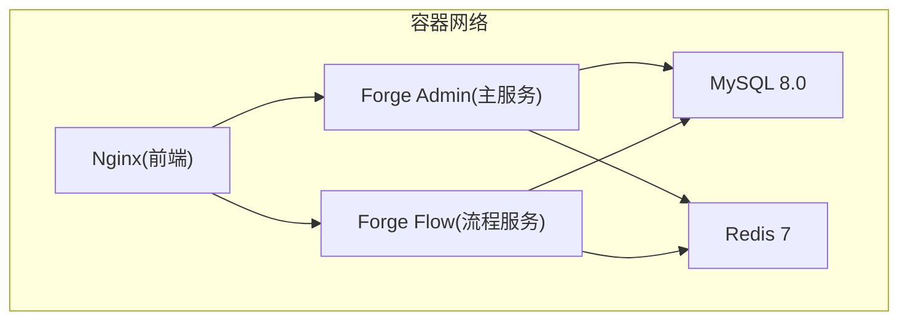
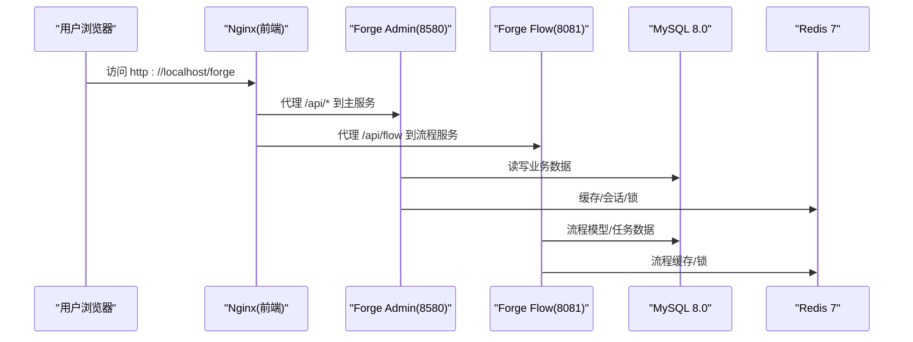
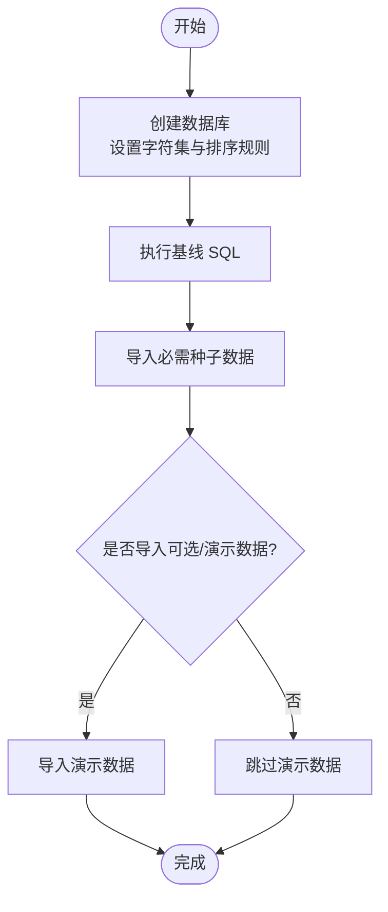
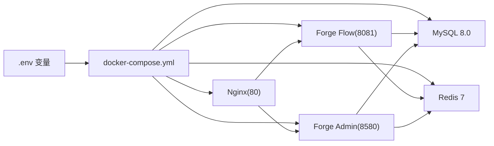
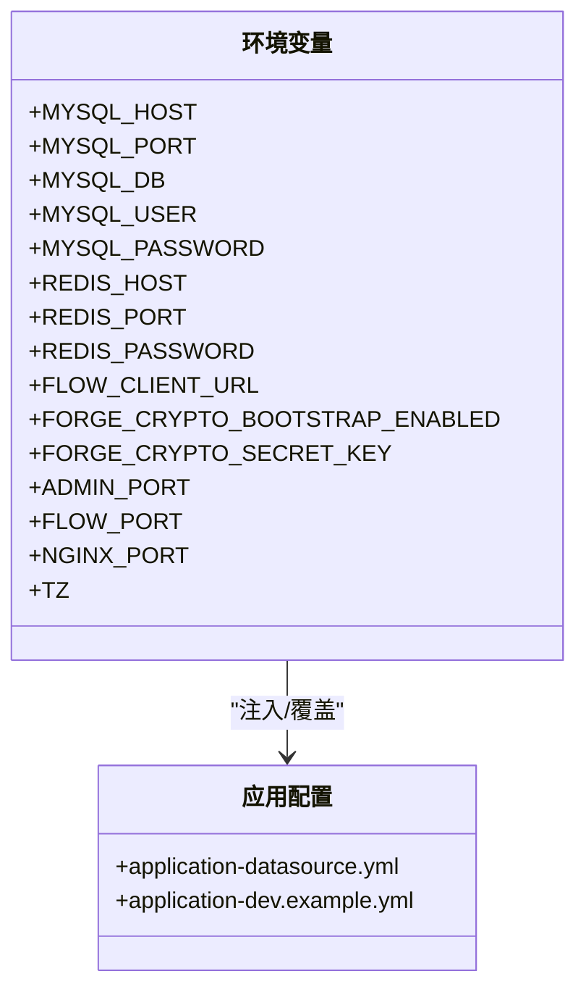
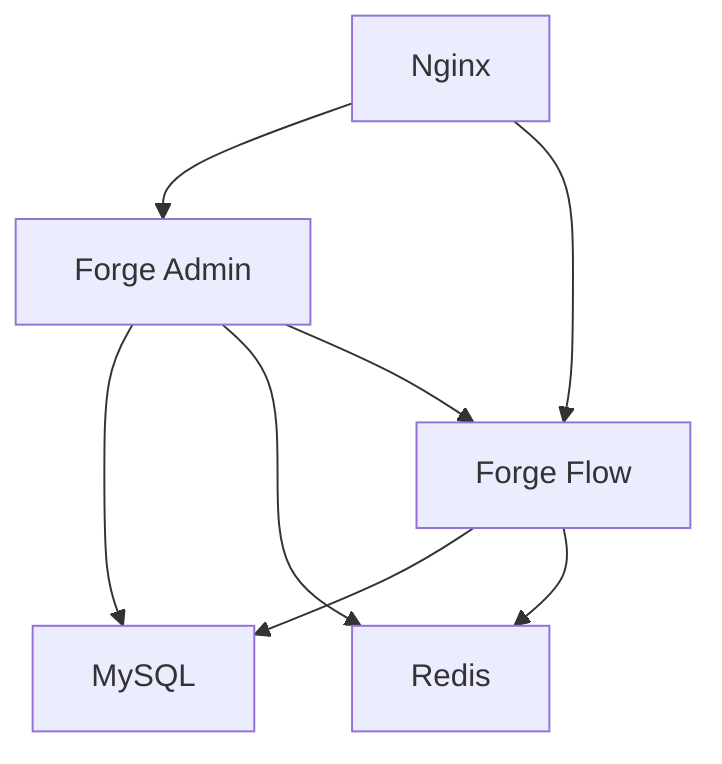

# 环境搭建

<cite>
**本文引用的文件**
- [README.md](file://README.md)
- [docker-compose.yml（根目录）](file://docker/docker-compose.yml)
- [docker-compose.yml（docker-forge-admin）](file://docker-forge-admin/docker-compose.yml)
- [application-datasource.yml（docker-forge-admin）](file://docker-forge-admin/application-datasource.yml)
- [init-db.sh](file://forge-server/scripts/db/init-db.sh)
- [package.json（前端）](file://forge-admin-ui/package.json)
- [vite.config.js（前端）](file://forge-admin-ui/vite.config.js)
- [application-dev.example.yml（后端开发示例）](file://forge-server/forge-admin-server/src/main/resources/application-dev.example.yml)
</cite>

## 目录
1. [简介](#简介)
2. [项目结构](#项目结构)
3. [核心组件](#核心组件)
4. [架构总览](#架构总览)
5. [详细组件分析](#详细组件分析)
6. [依赖关系分析](#依赖关系分析)
7. [性能注意事项](#性能注意事项)
8. [故障排查指南](#故障排查指南)
9. [结论](#结论)
10. [附录](#附录)

## 简介
本指南面向 Forge Admin 开发环境的快速搭建，覆盖基础环境安装、数据库初始化（Flyway 迁移与种子数据）、前端开发环境配置、Docker Compose 一键部署、环境变量与服务通信，以及常见问题排查。目标是让开发者在本地或容器中快速运行后台管理端、流程服务、MySQL、Redis 与 Nginx 前端代理。

## 项目结构
Forge Admin 采用前后端分离与多服务编排：
- 后端服务：主后台服务 forge-admin、独立流程服务 forge-flow、可选报表服务 forge-report
- 基础设施：MySQL 8.0+、Redis 6.0+（Compose 中提供 Redis 7）
- 前端：Vite + Vue 3，Nginx 作为生产静态资源与反向代理
- 数据库：Flyway 迁移脚本位于 db/migration；种子数据位于 db/seed



图表来源
- [docker-compose.yml（根目录）:11-149](file://docker/docker-compose.yml#L11-L149)
- [docker-compose.yml（docker-forge-admin）:11-154](file://docker-forge-admin/docker-compose.yml#L11-L154)

章节来源
- [README.md:241-259](file://README.md#L241-L259)

## 核心组件
- 后端服务
  - 主后台服务：默认端口 8580，负责系统管理与业务接口
  - 流程服务：默认端口 8081，Flowable 工作流引擎与任务执行
  - 报表服务（可选）：默认端口 8581，AI 大屏报表服务
- 基础设施
  - MySQL 8.0：字符集 utf8mb4，支持 Flyway 迁移
  - Redis：缓存、分布式锁与会话能力
- 前端
  - Vite 构建与开发服务器，默认端口 3000
  - Nginx 聚合访问入口，默认端口 80

章节来源
- [README.md:263-393](file://README.md#L263-L393)
- [docker-compose.yml（根目录）:11-149](file://docker/docker-compose.yml#L11-L149)
- [docker-compose.yml（docker-forge-admin）:11-154](file://docker-forge-admin/docker-compose.yml#L11-L154)

## 架构总览
下图展示 Docker Compose 编排下的服务依赖与通信路径：
- 启动顺序：MySQL、Redis 健康检查通过后，启动流程服务，再启动主服务；最后启动 Nginx
- 环境变量注入：通过 .env 或 docker-compose 的 environment 字段传递数据库、Redis、加密等配置
- 数据卷：持久化 MySQL 数据、Redis 数据与加密密钥



图表来源
- [docker-compose.yml（根目录）:61-149](file://docker/docker-compose.yml#L61-L149)
- [docker-compose.yml（docker-forge-admin）:61-154](file://docker-forge-admin/docker-compose.yml#L61-L154)

## 详细组件分析

### 基础环境安装与版本要求
- Java 17：Spring Boot 3.x 运行环境
- Node.js 20.19+：前端开发与构建
- pnpm 8+：包管理器
- MySQL 8.0+：数据库与 Flyway 迁移
- Redis 6.0+：缓存与分布式锁（Compose 使用 Redis 7）

章节来源
- [README.md:263-274](file://README.md#L263-L274)

### 数据库初始化流程（Flyway 迁移与种子数据）
- 推荐方式：使用统一初始化脚本创建数据库并导入必需数据，支持演示与可选数据
- 迁移策略：主后台服务启动时执行 db/migration 中的 Flyway 脚本；可通过环境变量控制迁移位置与开关
- 验证状态：查询 schema_history 表查看迁移执行结果



图表来源
- [init-db.sh:93-133](file://forge-server/scripts/db/init-db.sh#L93-L133)
- [README.md:292-341](file://README.md#L292-L341)

章节来源
- [init-db.sh:1-134](file://forge-server/scripts/db/init-db.sh#L1-L134)
- [README.md:292-341](file://README.md#L292-L341)

### 前端开发环境配置（Vite）
- 包管理：pnpm install 安装依赖
- 开发服务器：pnpm dev 启动，默认端口由环境变量控制
- 代理配置：通过 VITE_HTTP_PROXY_TARGET 与 VITE_FLOW_PROXY_TARGET 将请求转发至后端与流程服务
- 构建优化：关闭 sourcemap、使用 oxc 压缩、减少内存占用

```mermaid
flowchart TD
DevStart["pnpm dev"] --> LoadEnv["加载 .env 环境变量"]
LoadEnv --> ProxyCfg["配置代理目标<br/>主服务/流程服务"]
ProxyCfg --> Serve["启动 Vite 开发服务器"]
Serve --> Browser["浏览器访问前端页面"]
Browser --> |/api/*| Proxy["代理到后端服务"]
Browser --> /api/flow| ProxyFlow["代理到流程服务"]
```

图表来源
- [vite.config.js:14-158](file://forge-admin-ui/vite.config.js#L14-L158)
- [package.json:6-17](file://forge-admin-ui/package.json#L6-L17)

章节来源
- [package.json:6-17](file://forge-admin-ui/package.json#L6-L17)
- [vite.config.js:14-158](file://forge-admin-ui/vite.config.js#L14-L158)
- [README.md:377-393](file://README.md#L377-L393)

### Docker Compose 一键部署方案
- 服务清单：MySQL、Redis、流程服务、主服务、Nginx
- 依赖与健康检查：MySQL/Redis 健康检查通过后启动应用服务；主服务依赖流程服务
- 环境变量：通过 .env 或 compose 的 environment 注入数据库、Redis、加密等参数
- 端口映射：默认暴露 80(Nginx)、8580(主服务)、8081(流程服务)、3306(MySQL)、6379(Redis)
- 数据卷：mysql_data、redis_data、crypto_secrets



图表来源
- [docker-compose.yml（根目录）:11-149](file://docker/docker-compose.yml#L11-L149)
- [docker-compose.yml（docker-forge-admin）:11-154](file://docker-forge-admin/docker-compose.yml#L11-L154)

章节来源
- [docker-compose.yml（根目录）:1-168](file://docker/docker-compose.yml#L1-L168)
- [docker-compose.yml（docker-forge-admin）:1-173](file://docker-forge-admin/docker-compose.yml#L1-L173)

### 环境变量配置与服务间通信
- 数据库连接：MYSQL_HOST、MYSQL_PORT、MYSQL_DB、MYSQL_USER、MYSQL_PASSWORD
- Redis 连接：REDIS_HOST、REDIS_PORT、REDIS_PASSWORD
- 服务地址：FLOW_CLIENT_URL 指向流程服务地址
- 加密与安全：FORGE_CRYPTO_* 系列用于密钥引导与持久化
- 端口与环境：ADMIN_PORT、FLOW_PORT、NGINX_PORT、MYSQL_PORT、REDIS_PORT、TZ



图表来源
- [docker-compose.yml（根目录）:75-126](file://docker/docker-compose.yml#L75-L126)
- [docker-compose.yml（docker-forge-admin）:75-129](file://docker-forge-admin/docker-compose.yml#L75-L129)
- [application-datasource.yml:1-61](file://docker-forge-admin/application-datasource.yml#L1-L61)
- [application-dev.example.yml:1-89](file://forge-server/forge-admin-server/src/main/resources/application-dev.example.yml#L1-L89)

章节来源
- [docker-compose.yml（根目录）:75-126](file://docker/docker-compose.yml#L75-L126)
- [docker-compose.yml（docker-forge-admin）:75-129](file://docker-forge-admin/docker-compose.yml#L75-L129)
- [application-datasource.yml:1-61](file://docker-forge-admin/application-datasource.yml#L1-L61)
- [application-dev.example.yml:1-89](file://forge-server/forge-admin-server/src/main/resources/application-dev.example.yml#L1-L89)

## 依赖关系分析
- 服务依赖
  - 主服务依赖 MySQL、Redis、流程服务
  - 流程服务依赖 MySQL、Redis
  - Nginx 依赖主服务与流程服务
- 配置依赖
  - 应用通过 application-datasource.yml 读取环境变量配置数据源与 Redis
  - 开发环境示例配置 application-dev.example.yml 提供本地调试参考



图表来源
- [docker-compose.yml（根目录）:61-149](file://docker/docker-compose.yml#L61-L149)
- [docker-compose.yml（docker-forge-admin）:61-154](file://docker-forge-admin/docker-compose.yml#L61-L154)
- [application-datasource.yml:1-61](file://docker-forge-admin/application-datasource.yml#L1-L61)

章节来源
- [docker-compose.yml（根目录）:61-149](file://docker/docker-compose.yml#L61-L149)
- [docker-compose.yml（docker-forge-admin）:61-154](file://docker-forge-admin/docker-compose.yml#L61-L154)
- [application-datasource.yml:1-61](file://docker-forge-admin/application-datasource.yml#L1-L61)

## 性能注意事项
- 构建阶段
  - 前端构建关闭 sourcemap、reportCompressedSize，使用 oxc 压缩降低内存占用
- 运行时
  - 合理设置连接池大小与超时时间
  - 为 MySQL 与 Redis 预留足够内存与 I/O 资源
  - 在生产环境启用 HTTPS 与最小权限原则

章节来源
- [vite.config.js:160-173](file://forge-admin-ui/vite.config.js#L160-L173)
- [application-datasource.yml:14-21](file://docker-forge-admin/application-datasource.yml#L14-L21)

## 故障排查指南
- 首次启动报数据库或 Redis 连接错误
  - 确认已复制并修改 application-dev.yml，填写正确的 MySQL/Redis 连接信息
- 前端请求后端失败
  - 检查 .env.development 中的 VITE_HTTP_PROXY_TARGET 与 VITE_FLOW_PROXY_TARGET 是否指向本地服务
- 数据库迁移未执行
  - 检查 FORGE_FLYWAY_LOCATIONS 与 FORGE_FLYWAY_ENABLED 环境变量是否覆盖了默认配置
  - 查询 schema_history 表确认迁移状态
- 端口冲突或服务无法访问
  - 调整 docker-compose 中的端口映射变量（如 ADMIN_PORT、FLOW_PORT、NGINX_PORT）
  - 确认防火墙与容器网络连通性

章节来源
- [README.md:502-518](file://README.md#L502-L518)
- [README.md:330-341](file://README.md#L330-L341)
- [docker-compose.yml（根目录）:24-37](file://docker/docker-compose.yml#L24-L37)
- [docker-compose.yml（docker-forge-admin）:23-37](file://docker-forge-admin/docker-compose.yml#L23-L37)

## 结论
通过本指南，你可以在本地或容器中快速搭建 Forge Admin 开发环境：安装基础环境、初始化数据库、配置前端开发服务器、使用 Docker Compose 一键编排所有服务，并通过环境变量灵活控制服务通信与行为。遇到问题时，可依据排查指南定位并解决常见环境异常。

## 附录
- 快速命令参考
  - 初始化数据库：使用 init-db.sh 指定主机、端口、数据库、用户与密码
  - 启动后端：进入对应模块目录执行 Maven 启动命令
  - 启动前端：进入前端目录执行 pnpm install 与 pnpm dev
  - 一键部署：进入 docker 目录，复制 .env 并执行 docker compose up -d

章节来源
- [README.md:292-393](file://README.md#L292-L393)
- [init-db.sh:16-31](file://forge-server/scripts/db/init-db.sh#L16-L31)
- [docker-compose.yml（根目录）:1-9](file://docker/docker-compose.yml#L1-L9)