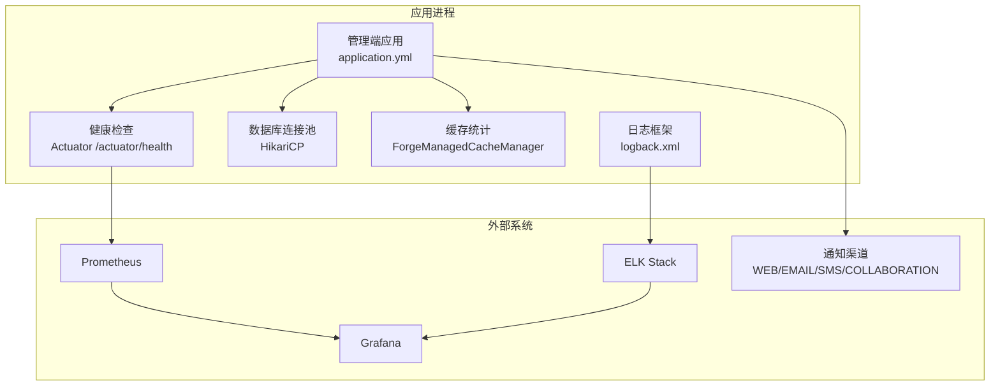
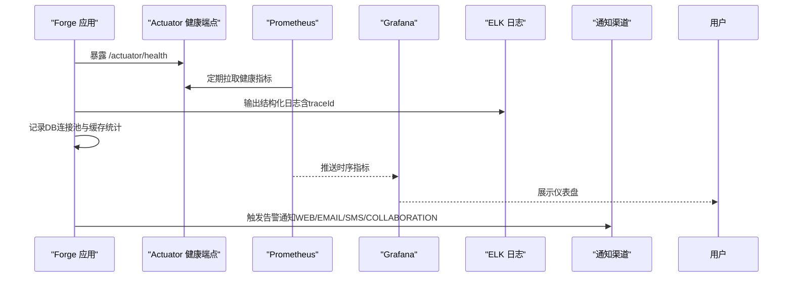
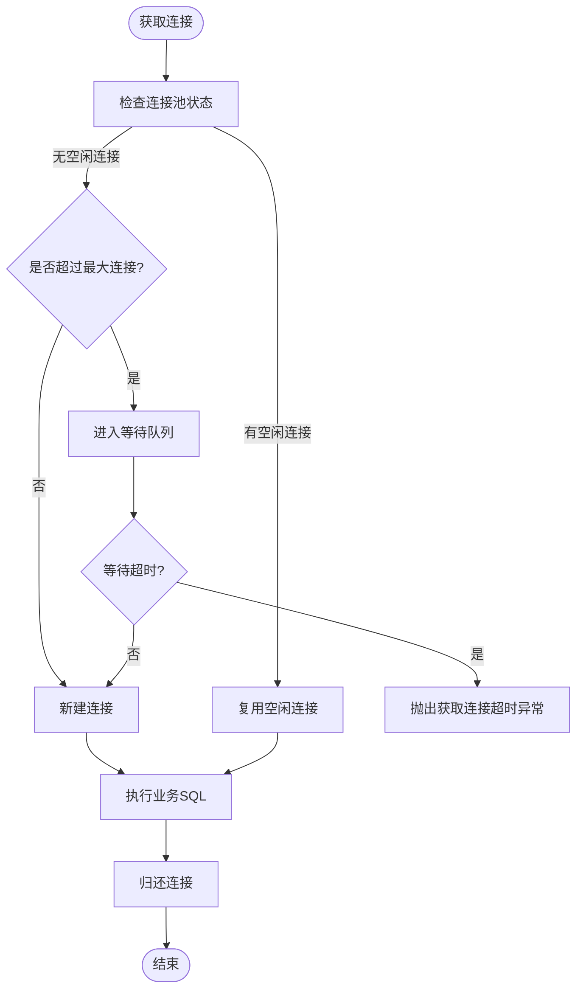
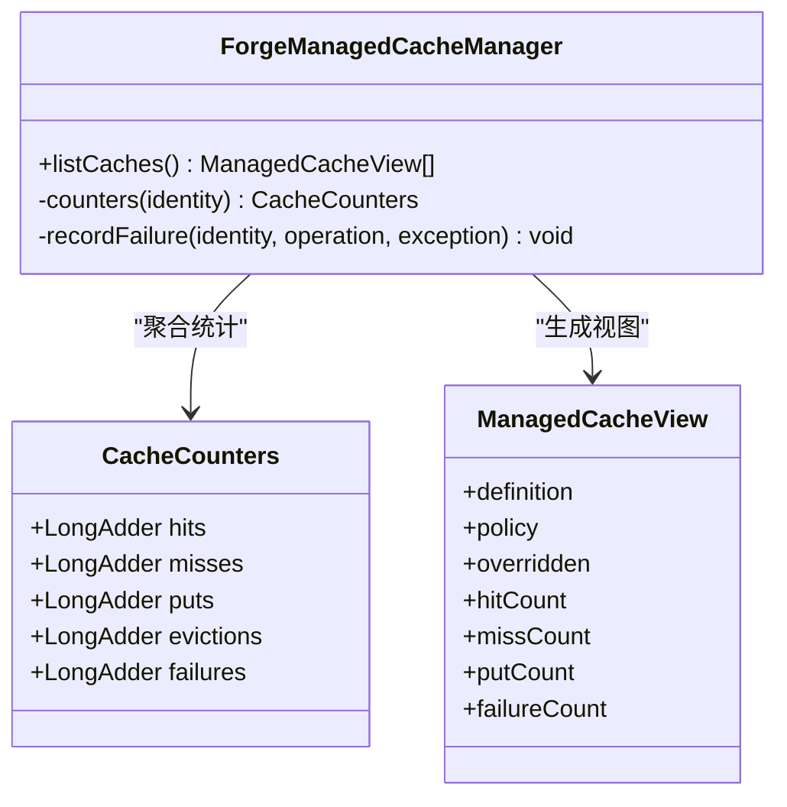
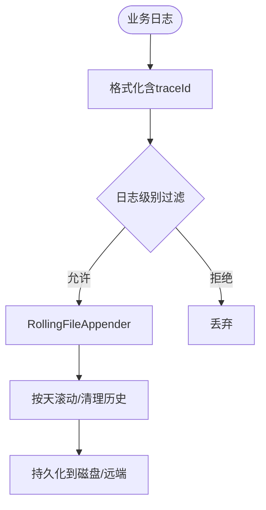
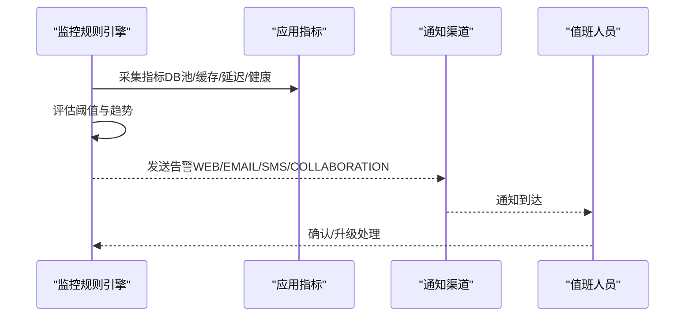
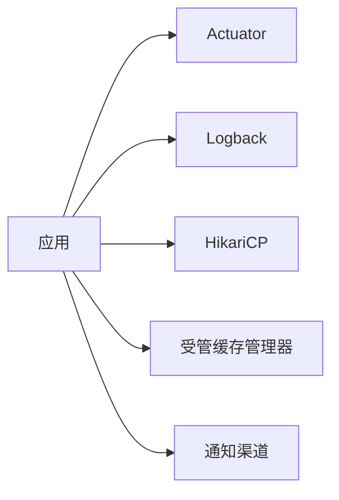

# 监控告警

<cite>
**本文引用的文件**
- [application.yml](file://forge-server/forge-admin-server/src/main/resources/application.yml)
- [logback.xml（管理端）](file://forge-server/forge-admin-server/src/main/resources/logback.xml)
- [logback.xml（应用端）](file://forge-server/forge-app-server/src/main/resources/logback.xml)
- [logback.xml（流程端）](file://forge-server/forge-flow/forge-flow-server/src/main/resources/logback.xml)
- [logback.xml（报表端）](file://forge-server/forge-report-server/src/main/resources/logback.xml)
- [ConfigManagerService.java](file://forge-server/forge-framework/forge-starter-parent/forge-starter-config/src/main/java/com/mdframe/forge/starter/config/service/ConfigManagerService.java)
- [LogProperties.java](file://forge-server/forge-framework/forge-starter-parent/forge-starter-core/src/main/java/com/mdframe/forge/starter/core/context/LogProperties.java)
- [JdbcDataSourceProvider.java](file://forge-server/forge-framework/forge-plugin-parent/forge-plugin-data/src/main/java/com/mdframe/forge/plugin/data/support/JdbcDataSourceProvider.java)
- [ForgeManagedCacheManager.java](file://forge-server/forge-framework/forge-starter-parent/forge-starter-cache/src/main/java/com/mdframe/forge/starter/cache/managed/ForgeManagedCacheManager.java)
- [FlowNotifyChannelController.java](file://forge-server/forge-flow/forge-flow-server/src/main/java/com/mdframe/forge/flow/controller/FlowNotifyChannelController.java)
- [FlowNotifyConfig.java](file://forge-server/forge-framework/forge-plugin-parent/forge-plugin-flow/src/main/java/com/mdframe/forge/starter/flow/support/FlowNotifyConfig.java)
- [JobLogSanitizer.java](file://forge-server/forge-framework/forge-plugin-parent/forge-plugin-job/src/main/java/com/mdframe/forge/plugin/job/support/JobLogSanitizer.java)
- [ActuatorAnonymousSurfaceContractTest.java](file://forge-server/forge-framework/forge-starter-parent/forge-starter-auth/src/test/java/com/mdframe/forge/starter/auth/config/ActuatorAnonymousSurfaceContractTest.java)
</cite>

## 目录
1. [简介](#简介)
2. [项目结构](#项目结构)
3. [核心组件](#核心组件)
4. [架构总览](#架构总览)
5. [详细组件分析](#详细组件分析)
6. [依赖关系分析](#依赖关系分析)
7. [性能考量](#性能考量)
8. [故障排查指南](#故障排查指南)
9. [结论](#结论)
10. [附录](#附录)

## 简介
本指南面向 Forge Admin 的运维与平台工程团队，提供一套可落地的监控、日志与告警配置方案。内容覆盖：
- 系统指标采集：JVM 运行指标、数据库连接池状态、Redis 缓存命中率与服务响应时间
- 日志策略：结构化日志格式、日志级别与轮转策略
- 告警规则：阈值设置、通知渠道集成与告警升级机制
- 可视化面板：基于 Prometheus + Grafana 或 ELK Stack 的展示方案
- 性能瓶颈识别、容量规划与扩展性建议

## 项目结构
本项目采用多模块后端与前后端分离架构。监控与可观测性相关的关键位置如下：
- 应用配置与 Actuator 暴露：管理端 application.yml 中启用健康检查端点
- 日志框架：各服务通过 logback.xml 统一输出带 traceId 的结构化日志，并按天滚动
- 运行时指标：
  - 数据库连接池：HikariCP 在数据源提供者中创建并配置
  - Redis 缓存：受管缓存管理器维护命中/未命中/写入/淘汰/失败等计数器
  - 服务健康：Actuator health 暴露基础健康信息
- 告警与通知：流程通知渠道控制器提供可用渠道列表，配合业务侧事件矩阵实现通知分发

图表来源
- [application.yml:220-228](file://forge-server/forge-admin-server/src/main/resources/application.yml#L220-L228)
- [logback.xml（管理端）:1-33](file://forge-server/forge-admin-server/src/main/resources/logback.xml#L1-L33)
- [JdbcDataSourceProvider.java:36-56](file://forge-server/forge-framework/forge-plugin-parent/forge-plugin-data/src/main/java/com/mdframe/forge/plugin/data/support/JdbcDataSourceProvider.java#L36-L56)
- [ForgeManagedCacheManager.java:240-266](file://forge-server/forge-framework/forge-starter-parent/forge-starter-cache/src/main/java/com/mdframe/forge/starter/cache/managed/ForgeManagedCacheManager.java#L240-L266)
- [FlowNotifyChannelController.java:23-58](file://forge-server/forge-flow/forge-flow-server/src/main/java/com/mdframe/forge/flow/controller/FlowNotifyChannelController.java#L23-L58)

章节来源
- [application.yml:1-228](file://forge-server/forge-admin-server/src/main/resources/application.yml#L1-L228)
- [logback.xml（管理端）:1-33](file://forge-server/forge-admin-server/src/main/resources/logback.xml#L1-L33)

## 核心组件
- 配置中心与动态刷新：通过配置管理服务按分组读写配置，支持日志、认证、加解密等分组；日志配置属性支持热更新
- 日志体系：统一使用 Logback，输出包含 traceId 的结构化日志，按日滚动保留固定天数
- 数据库连接池：HikariCP 作为默认连接池，提供最小空闲、最大连接、超时与生命周期等关键参数
- 缓存统计：受管缓存管理器聚合本地与 Redis 缓存的命中、未命中、写入、淘汰与失败计数，便于计算命中率
- 健康检查：仅暴露 /actuator/health，避免敏感端点泄露
- 通知渠道：流程通知提供 WEB/EMAIL/SMS/COLLABORATION 等渠道，前端可配置事件×渠道矩阵

章节来源
- [ConfigManagerService.java:1-199](file://forge-server/forge-framework/forge-starter-parent/forge-starter-config/src/main/java/com/mdframe/forge/starter/config/service/ConfigManagerService.java#L1-L199)
- [LogProperties.java:1-81](file://forge-server/forge-framework/forge-starter-parent/forge-starter-core/src/main/java/com/mdframe/forge/starter/core/context/LogProperties.java#L1-L81)
- [JdbcDataSourceProvider.java:36-69](file://forge-server/forge-framework/forge-plugin-parent/forge-plugin-data/src/main/java/com/mdframe/forge/plugin/data/support/JdbcDataSourceProvider.java#L36-L69)
- [ForgeManagedCacheManager.java:240-521](file://forge-server/forge-framework/forge-starter-parent/forge-starter-cache/src/main/java/com/mdframe/forge/starter/cache/managed/ForgeManagedCacheManager.java#L240-L521)
- [application.yml:220-228](file://forge-server/forge-admin-server/src/main/resources/application.yml#L220-L228)
- [FlowNotifyChannelController.java:23-58](file://forge-server/forge-flow/forge-flow-server/src/main/java/com/mdframe/forge/flow/controller/FlowNotifyChannelController.java#L23-L58)

## 架构总览
下图展示了从应用到监控与告警的整体链路：应用通过 Actuator 暴露健康指标，日志经 Logback 输出至集中式存储，数据库连接池与缓存统计为关键资源指标来源，Prometheus 抓取指标后由 Grafana 可视化，ELK 用于日志检索与分析，通知渠道用于告警触达。

图表来源
- [application.yml:220-228](file://forge-server/forge-admin-server/src/main/resources/application.yml#L220-L228)
- [logback.xml（管理端）:1-33](file://forge-server/forge-admin-server/src/main/resources/logback.xml#L1-L33)
- [JdbcDataSourceProvider.java:36-56](file://forge-server/forge-framework/forge-plugin-parent/forge-plugin-data/src/main/java/com/mdframe/forge/plugin/data/support/JdbcDataSourceProvider.java#L36-L56)
- [ForgeManagedCacheManager.java:240-266](file://forge-server/forge-framework/forge-starter-parent/forge-starter-cache/src/main/java/com/mdframe/forge/starter/cache/managed/ForgeManagedCacheManager.java#L240-L266)
- [FlowNotifyChannelController.java:23-58](file://forge-server/forge-flow/forge-flow-server/src/main/java/com/mdframe/forge/flow/controller/FlowNotifyChannelController.java#L23-L58)

## 详细组件分析

### JVM 与系统指标采集
- 健康检查：仅暴露 /actuator/health，避免过度暴露内部端点
- 线程与IO：Undertow 线程数与缓冲区大小影响吞吐与延迟，需结合压测调优
- 建议接入 Spring Boot Actuator 的 metrics 端点（如需要），由 Prometheus 抓取 JVM 内存、GC、线程、类加载等指标

章节来源
- [application.yml:1-31](file://forge-server/forge-admin-server/src/main/resources/application.yml#L1-L31)
- [application.yml:220-228](file://forge-server/forge-admin-server/src/main/resources/application.yml#L220-L228)
- [ActuatorAnonymousSurfaceContractTest.java:1-26](file://forge-server/forge-framework/forge-starter-parent/forge-starter-auth/src/test/java/com/mdframe/forge/starter/auth/config/ActuatorAnonymousSurfaceContractTest.java#L1-L26)

### 数据库连接池状态（HikariCP）
- 关键参数：最大连接数、最小空闲、空闲超时、连接超时、最大生命周期、连接测试SQL
- 监控要点：活跃连接数、等待队列、获取连接耗时、连接泄漏检测
- 调优建议：根据并发峰值与慢查询比例调整最大连接数；合理设置 idleTimeout 与 maxLifetime 以释放僵尸连接

图表来源
- [JdbcDataSourceProvider.java:36-56](file://forge-server/forge-framework/forge-plugin-parent/forge-plugin-data/src/main/java/com/mdframe/forge/plugin/data/support/JdbcDataSourceProvider.java#L36-L56)

章节来源
- [JdbcDataSourceProvider.java:36-69](file://forge-server/forge-framework/forge-plugin-parent/forge-plugin-data/src/main/java/com/mdframe/forge/plugin/data/support/JdbcDataSourceProvider.java#L36-L69)

### Redis 缓存命中率
- 指标来源：受管缓存管理器汇总 hits、misses、puts、evictions、failures
- 命中率计算：hits / (hits + misses)
- 多级缓存：支持 LOCAL/REDIS/MULTI 模式，注意本地 TTL 不应大于 Redis TTL
- 告警建议：命中率低于阈值或失败率突增时触发告警

图表来源
- [ForgeManagedCacheManager.java:240-266](file://forge-server/forge-framework/forge-starter-parent/forge-starter-cache/src/main/java/com/mdframe/forge/starter/cache/managed/ForgeManagedCacheManager.java#L240-L266)
- [ForgeManagedCacheManager.java:505-521](file://forge-server/forge-framework/forge-starter-parent/forge-starter-cache/src/main/java/com/mdframe/forge/starter/cache/managed/ForgeManagedCacheManager.java#L505-L521)

章节来源
- [ForgeManagedCacheManager.java:240-521](file://forge-server/forge-framework/forge-starter-parent/forge-starter-cache/src/main/java/com/mdframe/forge/starter/cache/managed/ForgeManagedCacheManager.java#L240-L521)

### 服务响应时间与链路追踪
- 建议在网关或拦截器层埋点记录请求耗时、状态码、接口路径，并关联 traceId
- 将响应时间分位（P50/P90/P99）与错误率纳入 Grafana 面板
- 日志中已包含 traceId，便于跨服务定位慢请求

章节来源
- [logback.xml（管理端）:1-33](file://forge-server/forge-admin-server/src/main/resources/logback.xml#L1-L33)
- [logback.xml（应用端）:1-33](file://forge-server/forge-app-server/src/main/resources/logback.xml#L1-L33)
- [logback.xml（流程端）:1-33](file://forge-server/forge-flow/forge-flow-server/src/main/resources/logback.xml#L1-L33)
- [logback.xml（报表端）:1-33](file://forge-server/forge-report-server/src/main/resources/logback.xml#L1-L33)

### 日志收集策略
- 结构化格式：统一输出包含 traceId、时间、线程、级别、logger、方法行号与消息
- 日志级别：应用级默认 info，框架与 SQL 日志按需降低级别以减少噪音
- 轮转策略：按天滚动，保留固定历史天数，控制磁盘占用
- 敏感信息脱敏：任务日志输出前进行敏感字段掩码与长度截断

图表来源
- [logback.xml（管理端）:1-33](file://forge-server/forge-admin-server/src/main/resources/logback.xml#L1-L33)
- [LogProperties.java:1-81](file://forge-server/forge-framework/forge-starter-parent/forge-starter-core/src/main/java/com/mdframe/forge/starter/core/context/LogProperties.java#L1-L81)
- [JobLogSanitizer.java:87-116](file://forge-server/forge-framework/forge-plugin-parent/forge-plugin-job/src/main/java/com/mdframe/forge/plugin/job/support/JobLogSanitizer.java#L87-L116)

章节来源
- [logback.xml（管理端）:1-33](file://forge-server/forge-admin-server/src/main/resources/logback.xml#L1-L33)
- [LogProperties.java:1-81](file://forge-server/forge-framework/forge-starter-parent/forge-starter-core/src/main/java/com/mdframe/forge/starter/core/context/LogProperties.java#L1-L81)
- [JobLogSanitizer.java:87-116](file://forge-server/forge-framework/forge-plugin-parent/forge-plugin-job/src/main/java/com/mdframe/forge/plugin/job/support/JobLogSanitizer.java#L87-L116)

### 告警规则配置
- 阈值建议：
  - 数据库连接池：活跃连接接近上限、获取连接耗时 P95 超阈值、连接泄漏告警
  - Redis 缓存：命中率低于阈值、失败率突增、淘汰率过高
  - 服务响应：P95/P99 延迟上升、错误率升高
  - 健康检查：/actuator/health 不可用
- 通知渠道集成：内置 WEB/EMAIL/SMS/COLLABORATION，可在流程模型中配置事件×渠道矩阵
- 告警升级：低危→中危→高危，结合值班与升级策略，确保问题及时闭环

图表来源
- [FlowNotifyChannelController.java:23-58](file://forge-server/forge-flow/forge-flow-server/src/main/java/com/mdframe/forge/flow/controller/FlowNotifyChannelController.java#L23-L58)
- [FlowNotifyConfig.java:79-120](file://forge-server/forge-framework/forge-plugin-parent/forge-plugin-flow/src/main/java/com/mdframe/forge/starter/flow/support/FlowNotifyConfig.java#L79-L120)

章节来源
- [FlowNotifyChannelController.java:23-58](file://forge-server/forge-flow/forge-flow-server/src/main/java/com/mdframe/forge/flow/controller/FlowNotifyChannelController.java#L23-L58)
- [FlowNotifyConfig.java:79-120](file://forge-server/forge-framework/forge-plugin-parent/forge-plugin-flow/src/main/java/com/mdframe/forge/starter/flow/support/FlowNotifyConfig.java#L79-L120)

### 监控面板配置（Prometheus + Grafana / ELK）
- Prometheus + Grafana：
  - 指标：JVM 内存/GC、线程、Undertow 线程池、HTTP 请求耗时与错误率、数据库连接池、缓存命中率
  - 面板：概览（健康/错误率/延迟）、数据库（连接池/慢查询）、缓存（命中率/失败率）、服务（QPS/延迟分布）
- ELK Stack：
  - 索引策略：按天索引，保留周期与压缩策略
  - 关键字段：traceId、level、logger、method、line、message
  - 看板：错误日志TopN、慢请求日志、敏感信息脱敏校验

[本节为概念性说明，不直接引用具体代码]

## 依赖关系分析
- 应用对 Actuator 的依赖：仅暴露健康端点，减少攻击面
- 日志对 Logback 的依赖：统一输出格式与轮转策略
- 数据访问对 HikariCP 的依赖：连接池参数直接影响数据库压力与稳定性
- 缓存对 Redisson/本地缓存的依赖：统计计数器用于命中率与失败率计算
- 通知对渠道适配器的依赖：前端矩阵驱动后端规范化渠道集合

图表来源
- [application.yml:220-228](file://forge-server/forge-admin-server/src/main/resources/application.yml#L220-L228)
- [logback.xml（管理端）:1-33](file://forge-server/forge-admin-server/src/main/resources/logback.xml#L1-L33)
- [JdbcDataSourceProvider.java:36-56](file://forge-server/forge-framework/forge-plugin-parent/forge-plugin-data/src/main/java/com/mdframe/forge/plugin/data/support/JdbcDataSourceProvider.java#L36-L56)
- [ForgeManagedCacheManager.java:240-266](file://forge-server/forge-framework/forge-starter-parent/forge-starter-cache/src/main/java/com/mdframe/forge/starter/cache/managed/ForgeManagedCacheManager.java#L240-L266)
- [FlowNotifyChannelController.java:23-58](file://forge-server/forge-flow/forge-flow-server/src/main/java/com/mdframe/forge/flow/controller/FlowNotifyChannelController.java#L23-L58)

章节来源
- [application.yml:220-228](file://forge-server/forge-admin-server/src/main/resources/application.yml#L220-L228)
- [JdbcDataSourceProvider.java:36-56](file://forge-server/forge-framework/forge-plugin-parent/forge-plugin-data/src/main/java/com/mdframe/forge/plugin/data/support/JdbcDataSourceProvider.java#L36-L56)
- [ForgeManagedCacheManager.java:240-266](file://forge-server/forge-framework/forge-starter-parent/forge-starter-cache/src/main/java/com/mdframe/forge/starter/cache/managed/ForgeManagedCacheManager.java#L240-L266)
- [FlowNotifyChannelController.java:23-58](file://forge-server/forge-flow/forge-flow-server/src/main/java/com/mdframe/forge/flow/controller/FlowNotifyChannelController.java#L23-L58)

## 性能考量
- 线程与缓冲：Undertow IO 线程与 worker 线程需根据 CPU 核数与负载调优；buffer-size 与 direct-buffers 影响内存与吞吐
- 数据库连接池：根据并发与慢查询比例调整最大连接数与超时；开启连接测试SQL避免脏连接
- 缓存策略：合理设置本地与 Redis TTL，避免频繁失效；关注淘汰与失败率
- 日志开销：生产环境降低非必要日志级别；使用异步或批量方式输出；控制单条日志大小
- 容量规划：依据 QPS、P99 延迟与资源利用率（CPU/内存/磁盘/网络）制定扩容阈值；预留 30%+ 冗余

[本节提供通用指导，不直接引用具体代码]

## 故障排查指南
- 健康检查不可用：检查 /actuator/health 暴露与鉴权配置，确保仅匿名暴露必要端点
- 数据库连接耗尽：观察连接池活跃数与等待队列，排查慢查询与长事务；必要时扩容或限流
- 缓存命中率低：检查缓存键设计、TTL 与热点数据；关注失败率与淘汰率
- 日志缺失或过大：确认 Logback 配置与轮转策略；检查 traceId 是否贯穿全链路；避免大对象入日志
- 告警风暴：合并相似告警、设置静默期与抑制规则；完善告警升级与值班流程

章节来源
- [application.yml:220-228](file://forge-server/forge-admin-server/src/main/resources/application.yml#L220-L228)
- [logback.xml（管理端）:1-33](file://forge-server/forge-admin-server/src/main/resources/logback.xml#L1-L33)
- [JdbcDataSourceProvider.java:36-69](file://forge-server/forge-framework/forge-plugin-parent/forge-plugin-data/src/main/java/com/mdframe/forge/plugin/data/support/JdbcDataSourceProvider.java#L36-L69)
- [ForgeManagedCacheManager.java:240-521](file://forge-server/forge-framework/forge-starter-parent/forge-starter-cache/src/main/java/com/mdframe/forge/starter/cache/managed/ForgeManagedCacheManager.java#L240-L521)

## 结论
通过统一的日志规范、合理的连接池与缓存策略、以及完善的监控与告警体系，Forge Admin 可实现对系统健康与性能的全面掌控。建议在生产环境逐步落地 Prometheus + Grafana 与 ELK 栈，并结合业务特征持续优化阈值与面板，形成“可观测—可诊断—可治理”的闭环。

[本节为总结性内容，不直接引用具体代码]

## 附录
- 关键配置项参考：
  - 应用端口与上下文路径、Undertow 线程与缓冲
  - 日志级别与配置文件路径
  - Actuator 健康端点暴露范围
  - 数据库连接池关键参数
  - 缓存统计维度与命中率计算
  - 通知渠道与事件矩阵

[本节为补充信息，不直接引用具体代码]