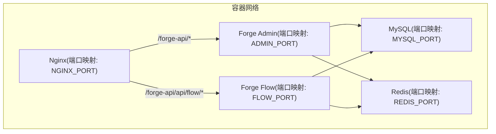
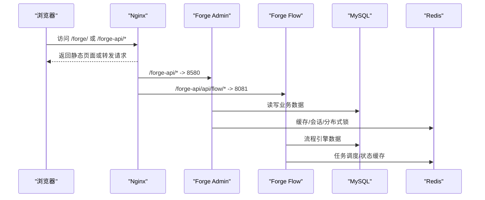
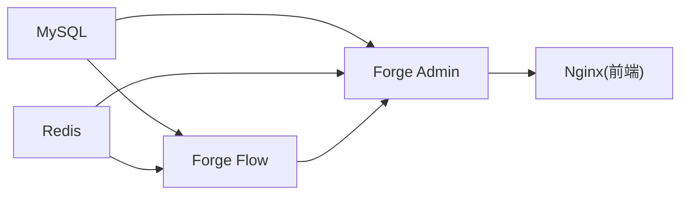

# 部署与运维

<cite>
**本文引用的文件**
- [docker/docker-compose.yml](file://docker/docker-compose.yml)
- [docker/nginx.conf](file://docker/nginx.conf)
- [docker/Dockerfile.admin](file://docker/Dockerfile.admin)
- [docker-forge-admin/docker-compose.yml](file://docker-forge-admin/docker-compose.yml)
- [docker-forge-admin/nginx.conf](file://docker-forge-admin/nginx.conf)
- [docker-forge-admin/application-datasource.yml](file://docker-forge-admin/application-datasource.yml)
- [NGINX_CONFIG.md](file://NGINX_CONFIG.md)
- [forge-server/scripts/db/init-db.sh](file://forge-server/scripts/db/init-db.sh)
- [forge-server/scripts/db/dump-safe-full.sh](file://forge-server/scripts/db/dump-safe-full.sh)
- [forge-server/forge-admin-server/src/main/resources/logback.xml](file://forge-server/forge-admin-server/src/main/resources/logback.xml)
- [forge-server/forge-flow/forge-flow-server/src/main/resources/logback.xml](file://forge-server/forge-flow/forge-flow-server/src/main/resources/logback.xml)
- [forge-server/forge-report-server/src/main/resources/logback.xml](file://forge-server/forge-report-server/src/main/resources/logback.xml)
- [README.md](file://README.md)
</cite>

## 目录
1. [简介](#简介)
2. [项目结构](#项目结构)
3. [核心组件](#核心组件)
4. [架构总览](#架构总览)
5. [详细组件分析](#详细组件分析)
6. [依赖关系分析](#依赖关系分析)
7. [性能考虑](#性能考虑)
8. [故障排查指南](#故障排查指南)
9. [结论](#结论)
10. [附录](#附录)

## 简介
本指南面向 Forge Admin 的部署与运维，覆盖开发环境搭建、生产环境部署、Docker 容器化配置、Nginx 反向代理与负载均衡、环境变量管理、日志收集策略、监控告警建议、数据库初始化脚本、备份恢复方案以及性能调优与常见问题处理。文档基于仓库内提供的 Docker Compose、Nginx 配置、应用启动参数、数据库初始化与备份脚本、日志配置等实际材料整理而成，确保可落地执行。

## 项目结构
本项目提供两套一键部署编排：
- docker 目录：基础编排，包含 MySQL、Redis、流程服务、主服务、前端 Nginx，以及 Nginx 转发规则。
- docker-forge-admin 目录：增强编排，支持挂载外部 application-prod.yml 与迁移脚本目录，便于生产环境灵活配置与版本演进。

图示来源
- [docker/docker-compose.yml:11-149](file://docker/docker-compose.yml#L11-L149)
- [docker-forge-admin/docker-compose.yml:11-154](file://docker-forge-admin/docker-compose.yml#L11-L154)
- [docker/nginx.conf:1-42](file://docker/nginx.conf#L1-L42)
- [docker-forge-admin/nginx.conf:1-42](file://docker-forge-admin/nginx.conf#L1-L42)

章节来源
- [docker/docker-compose.yml:11-149](file://docker/docker-compose.yml#L11-L149)
- [docker-forge-admin/docker-compose.yml:11-154](file://docker-forge-admin/docker-compose.yml#L11-L154)
- [docker/nginx.conf:1-42](file://docker/nginx.conf#L1-L42)
- [docker-forge-admin/nginx.conf:1-42](file://docker-forge-admin/nginx.conf#L1-L42)

## 核心组件
- 数据库：MySQL 8.0，使用 utf8mb4 字符集与排序规则，提供健康检查与数据持久化卷。
- 缓存：Redis 7 Alpine，启用密码与 AOF 持久化，提供健康检查。
- 流程服务：独立 Flowable 服务，先于主服务启动，暴露 API 供 Nginx 转发。
- 主服务：Spring Boot 应用，通过 JVM 参数注入数据库与 Redis 连接信息，暴露管理接口。
- 前端 Nginx：统一入口，静态资源与 API 反向代理，Gzip 压缩与上传大小限制。

章节来源
- [docker/docker-compose.yml:15-149](file://docker/docker-compose.yml#L15-L149)
- [docker/Dockerfile.admin:1-39](file://docker/Dockerfile.admin#L1-L39)
- [docker-forge-admin/application-datasource.yml:1-61](file://docker-forge-admin/application-datasource.yml#L1-L61)
- [docker/nginx.conf:1-42](file://docker/nginx.conf#L1-L42)

## 架构总览
下图展示从浏览器到后端服务的请求路径，包括 Nginx 路由、API 转发与服务间依赖。

图示来源
- [docker/docker-compose.yml:61-149](file://docker/docker-compose.yml#L61-L149)
- [docker-forge-admin/docker-compose.yml:61-154](file://docker-forge-admin/docker-compose.yml#L61-L154)
- [docker/nginx.conf:5-32](file://docker/nginx.conf#L5-L32)
- [docker-forge-admin/nginx.conf:5-32](file://docker-forge-admin/nginx.conf#L5-L32)

## 详细组件分析

### Nginx 反向代理与负载均衡
- 静态资源：/forge/ 指向前端构建产物，启用 try_files 以支持 SPA 路由。
- API 转发：/forge-api/api/flow/* 转发至流程服务；/forge-api/* 转发至主服务。
- 超时与头部：设置代理超时与真实 IP 透传，便于审计与限流。
- 上传限制：client_max_body_size 控制文件大小。
- Gzip：对常见文本类型进行压缩，提升传输效率。

生产部署时，可将 Nginx 配置放置于系统 nginx.conf 或宝塔面板站点配置中，注意注释默认静态缓存规则以避免 404。

章节来源
- [docker/nginx.conf:1-42](file://docker/nginx.conf#L1-L42)
- [docker-forge-admin/nginx.conf:1-42](file://docker-forge-admin/nginx.conf#L1-L42)
- [NGINX_CONFIG.md:1-91](file://NGINX_CONFIG.md#L1-L91)

### Docker 容器化与编排
- 基础镜像：JDK 17 JRE 运行 Spring Boot 应用，构建阶段使用 Maven 打包。
- 环境变量：通过 compose 注入 MySQL/Redis/FLOW_CLIENT_URL 等关键参数，支持 .env 覆盖。
- 数据卷：mysql_data、redis_data、crypto_secrets 用于持久化敏感与业务数据。
- 健康检查：MySQL 与 Redis 提供健康检查，保障依赖就绪后再启动上层服务。
- 多套编排：docker 与 docker-forge-admin 两套 compose，后者支持挂载 application-prod.yml 与迁移目录。

章节来源
- [docker/docker-compose.yml:11-168](file://docker/docker-compose.yml#L11-L168)
- [docker-forge-admin/docker-compose.yml:11-173](file://docker-forge-admin/docker-compose.yml#L11-L173)
- [docker/Dockerfile.admin:1-39](file://docker/Dockerfile.admin#L1-L39)

### 环境变量与配置管理
- 运行时注入：Compose 将数据库、缓存、加密密钥等以环境变量形式注入容器。
- 应用配置：application-datasource.yml 通过占位符读取环境变量，定义 Hikari 连接池与 Redisson 配置。
- 加密与密钥：支持引导模式与持久化密钥，可通过环境变量开启或关闭相关能力。
- 最佳实践：敏感信息通过 .env 或外部密钥管理服务注入，避免硬编码。

章节来源
- [docker/docker-compose.yml:75-132](file://docker/docker-compose.yml#L75-L132)
- [docker-forge-admin/docker-compose.yml:75-137](file://docker-forge-admin/docker-compose.yml#L75-L137)
- [docker-forge-admin/application-datasource.yml:1-61](file://docker-forge-admin/application-datasource.yml#L1-L61)

### 数据库初始化与迁移
- 初始化脚本：提供命令行工具，创建数据库并依次执行基线 SQL、必需种子数据，可选导入演示与模块数据。
- 迁移规范：迁移脚本位于 db/migration，命名遵循版本号递增，启动时由框架自动执行。
- 幂等性：所有脚本需具备幂等保护，避免重复执行导致异常。
- 查看执行状态：通过 schema_history 表确认迁移是否成功。

章节来源
- [forge-server/scripts/db/init-db.sh:1-134](file://forge-server/scripts/db/init-db.sh#L1-L134)
- [README.md:292-341](file://README.md#L292-L341)

### 备份与恢复方案
- 安全导出：提供全量导出脚本，默认跳过日志、运行时与敏感配置表，支持 gzip 压缩输出。
- 可控范围：支持忽略特定表或正则匹配，支持 dry-run 预览命令与排除范围。
- 恢复方式：导出的 SQL 可直接通过 mysql 客户端恢复到目标库。
- 建议策略：定期定时执行导出，保留多份历史快照，跨机或对象存储异地备份。

章节来源
- [forge-server/scripts/db/dump-safe-full.sh:1-455](file://forge-server/scripts/db/dump-safe-full.sh#L1-L455)

### 日志收集策略
- 日志位置：各服务将日志输出至 ./var/logs 目录下，按天滚动，保留固定天数。
- 日志格式：包含 traceId、时间戳、线程、级别、类与方法行号、消息体，便于链路追踪。
- 收集建议：在容器环境中将日志目录挂载到宿主机或接入集中式日志平台（如 ELK/Loki），配合 logrotate 或容器日志驱动管理。

章节来源
- [forge-server/forge-admin-server/src/main/resources/logback.xml:1-33](file://forge-server/forge-admin-server/src/main/resources/logback.xml#L1-L33)
- [forge-server/forge-flow/forge-flow-server/src/main/resources/logback.xml:1-33](file://forge-server/forge-flow/forge-flow-server/src/main/resources/logback.xml#L1-L33)
- [forge-server/forge-report-server/src/main/resources/logback.xml:1-33](file://forge-server/forge-report-server/src/main/resources/logback.xml#L1-L33)

### 监控与告警建议
- 进程与端口：通过容器编排的 depends_on 与健康检查保证依赖就绪；对外暴露端口由 Nginx 统一收敛。
- 指标采集：可在 JVM 层暴露指标（如 Micrometer），结合 Prometheus + Grafana 可视化；或使用云厂商监控集成。
- 告警阈值：CPU/内存/磁盘使用率、JVM GC 次数、数据库连接池活跃数、Redis 命中率、接口错误率与延迟。
- 日志告警：对关键错误日志关键字（如连接失败、超时）进行实时告警。

[本节为通用建议，不直接分析具体文件]

## 依赖关系分析
服务间依赖与启动顺序如下：
- MySQL、Redis 作为基础设施优先启动并提供健康检查。
- 流程服务依赖 MySQL、Redis，先于主服务启动。
- 主服务依赖 MySQL、Redis、流程服务。
- 前端 Nginx 最后启动，负责静态资源与 API 转发。

图示来源
- [docker/docker-compose.yml:61-149](file://docker/docker-compose.yml#L61-L149)
- [docker-forge-admin/docker-compose.yml:61-154](file://docker-forge-admin/docker-compose.yml#L61-L154)

章节来源
- [docker/docker-compose.yml:61-149](file://docker/docker-compose.yml#L61-L149)
- [docker-forge-admin/docker-compose.yml:61-154](file://docker-forge-admin/docker-compose.yml#L61-L154)

## 性能考虑
- 数据库连接池：HikariCP 最大连接数、空闲连接、超时与生命周期参数可按负载调整。
- Redis 连接：Redisson 连接池大小、重试次数与超时影响并发与稳定性。
- Nginx 优化：合理设置代理超时、Gzip 压缩、静态资源缓存与上传大小限制。
- JVM 参数：根据容器资源限制设置堆大小与线程数，避免过度分配。
- 迁移与备份：大库导出建议使用单事务与快速模式，减少锁与 IO 压力。

章节来源
- [docker-forge-admin/application-datasource.yml:14-44](file://docker-forge-admin/application-datasource.yml#L14-L44)
- [docker/Dockerfile.admin:14-38](file://docker/Dockerfile.admin#L14-L38)
- [docker/nginx.conf:12-40](file://docker/nginx.conf#L12-L40)

## 故障排查指南
- 首次启动数据库或 Redis 连接失败：检查环境变量是否正确注入，服务是否健康，端口是否冲突。
- 前端请求后端失败：确认 Nginx 转发路径与后端端口，检查 .env 中的代理目标地址。
- 新增配置项未生效：确认环境变量优先级与配置文件加载顺序，必要时重启服务。
- 误提交敏感配置：立即更换密钥或密码，清理仓库历史并补充忽略规则。
- 数据库迁移异常：查看 schema_history 表，定位失败脚本，修复后重新执行。

章节来源
- [README.md:502-519](file://README.md#L502-L519)
- [docker/docker-compose.yml:33-57](file://docker/docker-compose.yml#L33-L57)
- [docker-forge-admin/docker-compose.yml:33-57](file://docker-forge-admin/docker-compose.yml#L33-L57)

## 结论
本指南基于仓库内的编排、配置与脚本，提供了从开发到生产的完整部署与运维路径。通过统一的 Nginx 入口、容器化编排、环境变量管理与标准化的数据库初始化与备份脚本，可实现稳定、可维护、可扩展的企业级后台系统部署。建议在生产环境完善日志收集与监控告警体系，并结合业务负载持续调优数据库连接池、Redis 连接与 JVM 参数。

## 附录

### 快速开始（本地与容器）
- 本地开发：复制应用配置示例为本地配置，初始化数据库，分别启动后端与前端服务。
- 容器一键部署：进入 docker 或 docker-forge-admin 目录，准备 .env，执行 compose up -d，访问 Nginx 端口。

章节来源
- [README.md:263-427](file://README.md#L263-L427)
- [docker/docker-compose.yml:1-9](file://docker/docker-compose.yml#L1-L9)
- [docker-forge-admin/docker-compose.yml:1-9](file://docker-forge-admin/docker-compose.yml#L1-L9)

### 生产环境 Nginx 配置要点
- 域名与监听：替换 server_name 与 listen 端口。
- 静态资源路径：确保 alias 结尾带斜杠，避免路径拼接错误。
- 代理超时与头部：保持合理的超时与真实 IP 透传。
- 上传限制与压缩：根据业务需求调整 client_max_body_size 与 Gzip。

章节来源
- [NGINX_CONFIG.md:1-91](file://NGINX_CONFIG.md#L1-L91)

### 数据库初始化与备份命令参考
- 初始化：使用 init-db.sh 指定 host/port/database/user/password，按需导入演示或模块数据。
- 备份：使用 dump-safe-full.sh 指定数据库与输出目录，可选择 gzip 压缩与忽略表。

章节来源
- [forge-server/scripts/db/init-db.sh:16-134](file://forge-server/scripts/db/init-db.sh#L16-L134)
- [forge-server/scripts/db/dump-safe-full.sh:24-58](file://forge-server/scripts/db/dump-safe-full.sh#L24-L58)