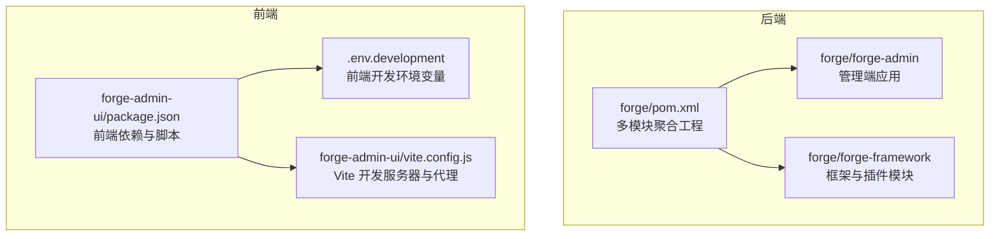
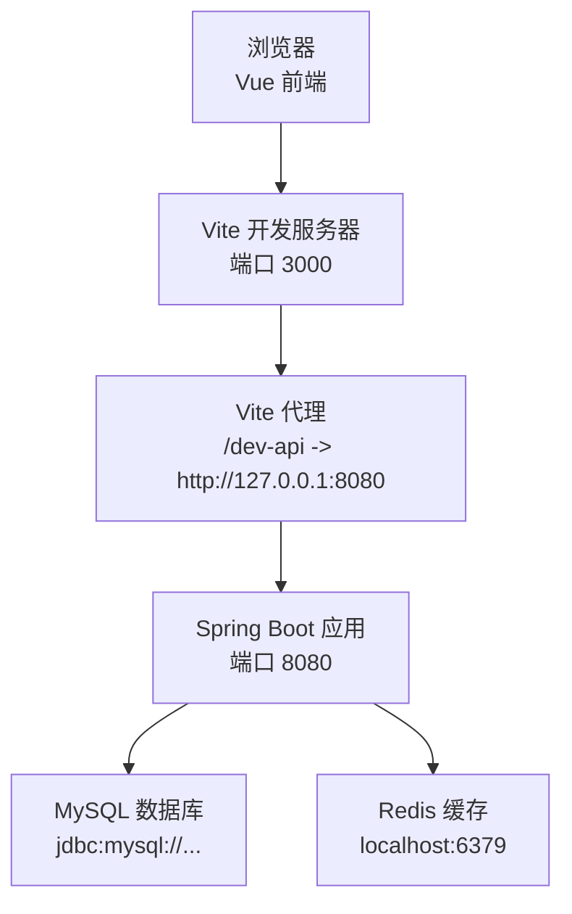
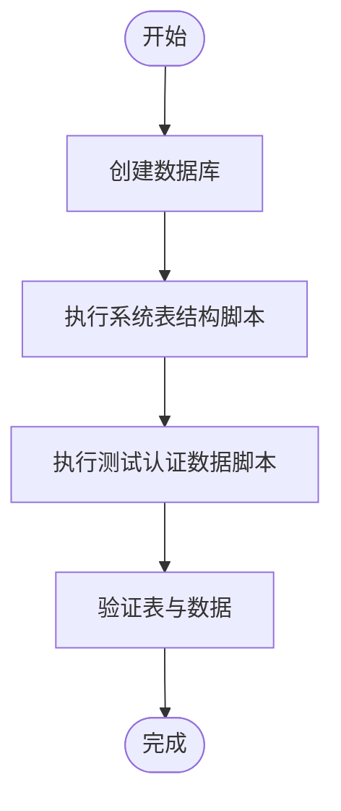
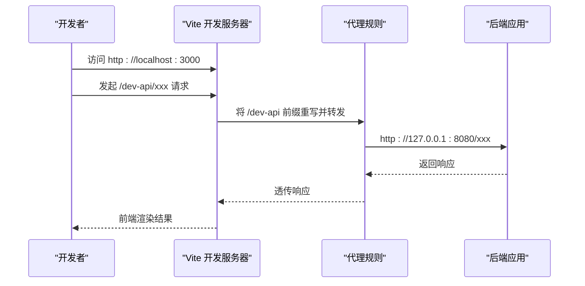
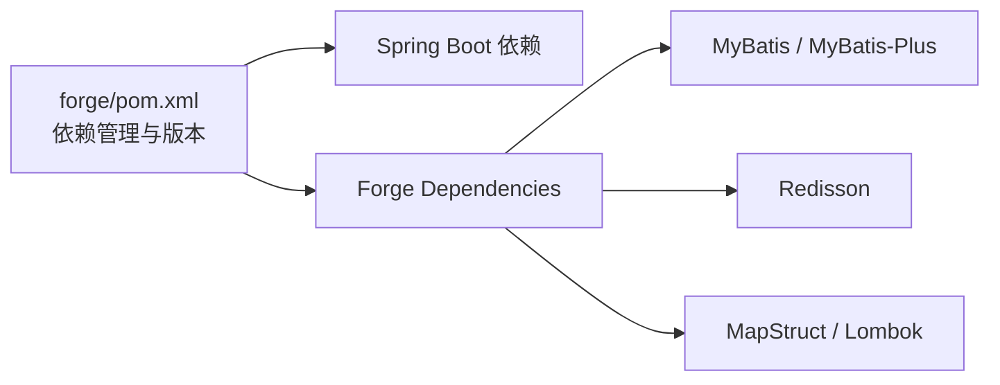

# 开发环境搭建

<cite>
**本文引用的文件**
- [forge/pom.xml](file://forge/pom.xml)
- [forge/forge-admin/src/main/resources/application-dev.yml](file://forge/forge-admin/src/main/resources/application-dev.yml)
- [forge-admin-ui/.env.development](file://forge-admin-ui/.env.development)
- [forge-admin-ui/vite.config.js](file://forge-admin-ui/vite.config.js)
- [forge-admin-ui/package.json](file://forge-admin-ui/package.json)
- [forge/forge-admin/sql/sys.sql](file://forge/forge-admin/sql/sys.sql)
- [forge/forge-admin/src/main/resources/sql/test_auth_data.sql](file://forge/forge-admin/src/main/resources/sql/test_auth_data.sql)
</cite>

## 目录
1. [简介](#简介)
2. [项目结构](#项目结构)
3. [核心组件](#核心组件)
4. [架构总览](#架构总览)
5. [详细组件分析](#详细组件分析)
6. [依赖分析](#依赖分析)
7. [性能注意事项](#性能注意事项)
8. [故障排除指南](#故障排除指南)
9. [结论](#结论)
10. [附录](#附录)

## 简介
本指南面向首次参与Forge框架项目的开发者，提供从零开始搭建完整开发环境的操作步骤与配置要点，涵盖以下内容：
- JDK 17 安装与环境准备
- Maven 环境设置与仓库配置
- MySQL 数据库初始化与测试数据导入
- Redis 缓存配置与启动
- Node.js 与 pnpm 的安装与前端依赖安装
- IDE 配置建议（IntelliJ IDEA、VSCode）
- 后端项目导入与启动
- 前端项目启动与代理配置
- application-dev.yml 与 .env.development 的关键配置项说明

## 项目结构
Forge 采用多模块 Maven 工程组织，包含后端框架模块与管理端应用模块；前端采用 Vite + Vue 3 技术栈。

**图表来源**
- [forge/pom.xml](file://forge/pom.xml#L114-L119)
- [forge-admin-ui/package.json](file://forge-admin-ui/package.json#L1-L68)
- [forge-admin-ui/.env.development](file://forge-admin-ui/.env.development#L1-L16)
- [forge-admin-ui/vite.config.js](file://forge-admin-ui/vite.config.js#L1-L86)

**章节来源**
- [forge/pom.xml](file://forge/pom.xml#L114-L119)

## 核心组件
- 后端聚合工程：统一管理 Java 版本、Spring Boot 版本、依赖版本与构建插件，启用 profiles 以区分 dev/prod 环境。
- 后端应用模块：包含数据库连接、Redis 连接、动态数据源、Hikari 连接池等配置。
- 前端工程：基于 Vite 的 Vue 3 应用，通过 .env.development 控制端口、请求前缀与后端代理目标。

**章节来源**
- [forge/pom.xml](file://forge/pom.xml#L12-L61)
- [forge/forge-admin/src/main/resources/application-dev.yml](file://forge/forge-admin/src/main/resources/application-dev.yml#L1-L70)
- [forge-admin-ui/.env.development](file://forge-admin-ui/.env.development#L1-L16)

## 架构总览
下图展示了前后端交互的关键流程：前端通过 Vite 代理将 /dev-api 前缀的请求转发至后端 8080 端口，后端使用 MySQL 作为主库，Redis 作为缓存与分布式锁支持。

**图表来源**
- [forge-admin-ui/.env.development](file://forge-admin-ui/.env.development#L3-L15)
- [forge-admin-ui/vite.config.js](file://forge-admin-ui/vite.config.js#L56-L80)
- [forge/forge-admin/src/main/resources/application-dev.yml](file://forge/forge-admin/src/main/resources/application-dev.yml#L16-L18)
- [forge/forge-admin/src/main/resources/application-dev.yml](file://forge/forge-admin/src/main/resources/application-dev.yml#L38-L44)

## 详细组件分析

### JDK 与 Maven 环境
- Java 版本要求：Java 17（由 Maven 属性统一指定）。
- Maven 仓库：配置了华为云与阿里云镜像，加速依赖下载。
- 构建插件：编译插件、Surefire 单测插件、flatten 版本管理插件等。

建议操作
- 安装 JDK 17 并配置 JAVA_HOME 与 PATH。
- 配置本地 Maven 使用国内镜像加速（可复用项目中已提供的镜像配置）。
- 在 IDE 中指向正确的 JDK 与 Maven 版本。

**章节来源**
- [forge/pom.xml](file://forge/pom.xml#L12-L61)
- [forge/pom.xml](file://forge/pom.xml#L223-L256)

### MySQL 数据库初始化
- 数据库连接：后端 application-dev.yml 中配置了主库地址、用户名、密码与 Hikari 连接池参数。
- 初始化脚本：提供系统表结构与测试认证数据脚本，便于快速初始化开发环境。

初始化步骤
- 创建数据库（名称可自定义，但需与后端配置一致）。
- 执行系统表结构脚本，创建租户、用户、组织、岗位、角色、资源、配置、字典等核心表。
- 执行测试认证数据脚本，插入默认租户、用户、角色、资源与权限映射，便于登录测试。

**图表来源**
- [forge/forge-admin/sql/sys.sql](file://forge/forge-admin/sql/sys.sql#L1-L333)
- [forge/forge-admin/src/main/resources/sql/test_auth_data.sql](file://forge/forge-admin/src/main/resources/sql/test_auth_data.sql#L1-L168)

**章节来源**
- [forge/forge-admin/src/main/resources/application-dev.yml](file://forge/forge-admin/src/main/resources/application-dev.yml#L16-L18)
- [forge/forge-admin/sql/sys.sql](file://forge/forge-admin/sql/sys.sql#L1-L333)
- [forge/forge-admin/src/main/resources/sql/test_auth_data.sql](file://forge/forge-admin/src/main/resources/sql/test_auth_data.sql#L1-L168)

### Redis 缓存配置
- Redis 连接：后端 application-dev.yml 中配置了 host、port、database、password、超时与 SSL 等参数。
- Redisson 配置：提供了单机模式的 Redisson YAML 配置片段，包含连接池大小、重试策略等。

建议操作
- 启动本地 Redis 服务，确保端口与密码与配置一致。
- 如需启用 SSL 或调整连接池，请根据实际环境修改相应参数。

**章节来源**
- [forge/forge-admin/src/main/resources/application-dev.yml](file://forge/forge-admin/src/main/resources/application-dev.yml#L38-L63)

### Node.js 与 pnpm 前端环境
- Node.js：前端工程使用 Vite，需安装 Node.js（推荐 LTS 版本）。
- pnpm：前端 package.json 中声明了依赖与脚本，可直接使用 pnpm 安装依赖并启动开发服务器。

建议操作
- 安装 pnpm（或使用 npm/yarn，但推荐 pnpm 以获得更快的安装速度）。
- 在 forge-admin-ui 目录执行依赖安装与启动命令。

**章节来源**
- [forge-admin-ui/package.json](file://forge-admin-ui/package.json#L1-L68)

### IDE 配置建议

#### IntelliJ IDEA
- 语言级别：选择 Java 17。
- Maven：设置 Maven Home Path 与 Settings File 指向本地配置（可复用项目中已配置的镜像）。
- 运行配置：为后端应用模块创建运行配置，激活 dev profile；为前端工程创建 npm/Node 运行配置，指向 Vite 开发服务器。
- Lombok：启用注解处理（项目中已配置相关处理器）。

#### VSCode
- 推荐插件：ESLint、Volar、UnoCSS、Vue Language Features (Volar)、SCSS IntelliSense。
- 前端调试：使用 Live Server 或 Vite Dev Server 启动前端，结合后端代理进行联调。

### 后端项目导入与启动
- 使用 IDE 导入 forge/pom.xml 为 Maven 项目，确保依赖解析完成。
- 启动后端应用模块（如 ForgeAdminApplication 所在模块），确保 application-dev.yml 中的数据库与 Redis 配置正确。
- 若使用 Maven 命令启动，可在根目录执行 mvn spring-boot:run（需确保 profiles 激活 dev）。

**章节来源**
- [forge/pom.xml](file://forge/pom.xml#L63-L91)

### 前端项目启动与代理配置
- 环境变量：.env.development 中定义了前端开发端口、请求前缀、静态资源 Host、模板下载路径以及后端代理目标。
- Vite 配置：vite.config.js 读取环境变量，配置开发服务器端口与代理规则，将 /dev-api 前缀请求转发至后端 8080 端口。
- 启动命令：在 forge-admin-ui 目录执行 pnpm dev，打开浏览器访问前端地址即可。

**图表来源**
- [forge-admin-ui/.env.development](file://forge-admin-ui/.env.development#L3-L15)
- [forge-admin-ui/vite.config.js](file://forge-admin-ui/vite.config.js#L56-L80)

**章节来源**
- [forge-admin-ui/.env.development](file://forge-admin-ui/.env.development#L1-L16)
- [forge-admin-ui/vite.config.js](file://forge-admin-ui/vite.config.js#L13-L86)

### 配置文件详解

#### application-dev.yml 关键项
- 数据源与连接池：主库地址、驱动类、用户名、密码、Hikari 连接池参数（最大连接数、最小空闲、超时等）。
- Redis：主机、端口、数据库索引、密码、超时、SSL 与 Redisson 配置。
- 配置中心数据源：示例中指向主库配置，便于统一管理。

建议核对
- 数据库地址与凭据是否与本地/测试环境一致。
- Redis 地址与密码是否正确。
- 如需启用 SSL 或调整连接池参数，请按需修改。

**章节来源**
- [forge/forge-admin/src/main/resources/application-dev.yml](file://forge/forge-admin/src/main/resources/application-dev.yml#L1-L70)

#### .env.development 关键项
- VITE_HTTP_PORT：前端开发端口（默认 3000）。
- VITE_REQUEST_PREFIX：请求前缀（默认 /dev-api）。
- VITE_HTTP_PROXY_TARGET：后端代理目标（默认 http://127.0.0.1:8080）。
- 其他资源与模板路径可根据需要调整。

建议核对
- 前端端口未被占用。
- 代理目标与后端实际监听端口一致。
- 如需跨域或 WebSocket 支持，可在 Vite 配置中补充代理规则。

**章节来源**
- [forge-admin-ui/.env.development](file://forge-admin-ui/.env.development#L1-L16)
- [forge-admin-ui/vite.config.js](file://forge-admin-ui/vite.config.js#L56-L80)

## 依赖分析
- 后端依赖管理：通过 Spring Boot 与 Forge Dependencies 统一版本，集中管理 MyBatis、Sa-Token、Redisson、MapStruct 等常用组件。
- 前端依赖：Vue 3、Naive UI、Axios、Pinia、WebSocket 支持等，满足后台管理系统常见需求。

**图表来源**
- [forge/pom.xml](file://forge/pom.xml#L94-L112)

**章节来源**
- [forge/pom.xml](file://forge/pom.xml#L94-L112)

## 性能注意事项
- 数据库批处理：JDBC URL 中启用了批处理优化参数，批量操作性能更优，但需注意对数据库的压力。
- 连接池参数：合理设置最大连接数、空闲连接、超时时间，避免连接泄漏与资源耗尽。
- Redis 连接池：根据并发量调整连接池大小与最小空闲，减少连接抖动。
- 前端代理：开发阶段使用 Vite 代理，生产环境建议后端统一处理跨域与静态资源。

## 故障排除指南
- 启动后端报数据库连接异常
  - 检查 application-dev.yml 中的数据库地址、用户名、密码是否正确。
  - 确认数据库已创建并执行了系统表结构与测试数据脚本。
- 启动前端报端口冲突
  - 修改 .env.development 中的 VITE_HTTP_PORT，或释放被占用端口。
- 代理无法转发请求
  - 确认 VITE_REQUEST_PREFIX 与后端控制器前缀一致。
  - 确认 VITE_HTTP_PROXY_TARGET 指向后端实际监听地址。
- Redis 连接失败
  - 确认本地 Redis 服务已启动，密码与端口与 application-dev.yml 一致。
- 前端 WebSocket 无法连接
  - 在 vite.config.js 中确认 /ws 代理已启用并指向相同目标。

**章节来源**
- [forge/forge-admin/src/main/resources/application-dev.yml](file://forge/forge-admin/src/main/resources/application-dev.yml#L16-L18)
- [forge-admin-ui/.env.development](file://forge-admin-ui/.env.development#L3-L15)
- [forge-admin-ui/vite.config.js](file://forge-admin-ui/vite.config.js#L56-L80)

## 结论
按照本指南完成 JDK 17、Maven、MySQL、Redis、Node.js 与 pnpm 的安装与配置，并正确导入后端与前端项目，即可快速搭建 Forge 框架的开发环境。通过 application-dev.yml 与 .env.development 的关键配置项核对，确保数据库、缓存与前后端代理一致，即可顺利启动并进行二次开发。

## 附录
- 快速启动清单
  - 安装 JDK 17 与 Maven，并配置镜像。
  - 启动本地 MySQL 与 Redis。
  - 在后端执行系统表结构与测试数据脚本。
  - 在前端执行依赖安装与启动命令。
  - 启动后端应用模块，访问前端页面进行联调。