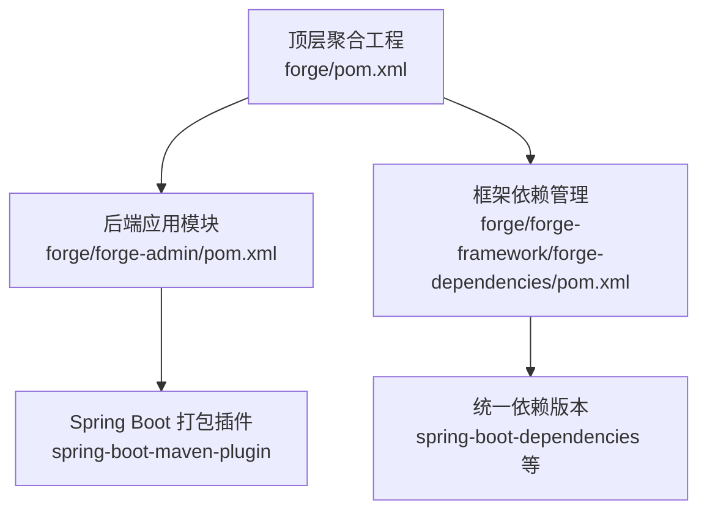
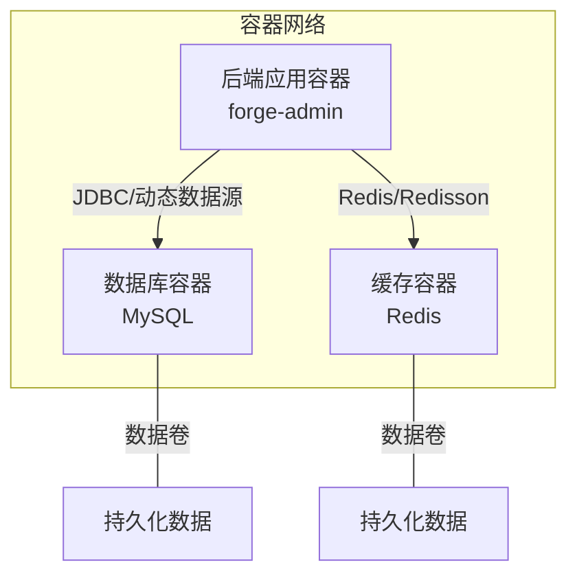
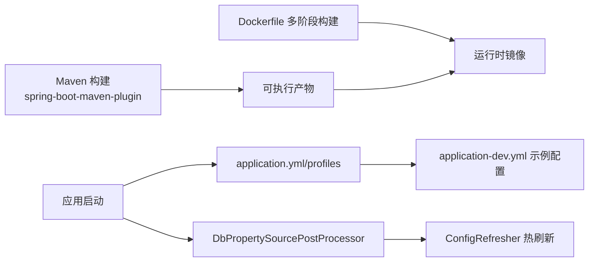

# 容器化部署

<cite>
**本文引用的文件**
- [forge/pom.xml](file://forge/pom.xml)
- [forge/forge-admin/pom.xml](file://forge/forge-admin/pom.xml)
- [forge/forge-admin/src/main/resources/application.yml](file://forge/forge-admin/src/main/resources/application.yml)
- [forge/forge-admin/src/main/resources/application-dev.yml](file://forge/forge-admin/src/main/resources/application-dev.yml)
- [forge/forge-framework/forge-dependencies/pom.xml](file://forge/forge-framework/forge-dependencies/pom.xml)
- [forge/forge-framework/forge-starter-parent/forge-starter-config/src/main/java/com/mdframe/forge/starter/property/DbPropertySourcePostProcessor.java](file://forge/forge-framework/forge-starter-parent/forge-starter-config/src/main/java/com/mdframe/forge/starter/property/DbPropertySourcePostProcessor.java)
- [forge/forge-framework/forge-starter-parent/forge-starter-config/src/main/java/com/mdframe/forge/starter/property/refresh/ConfigRefresher.java](file://forge/forge-framework/forge-starter-parent/forge-starter-config/src/main/java/com/mdframe/forge/starter/property/refresh/ConfigRefresher.java)
- [forge/forge-framework/forge-starter-parent/forge-starter-config/src/main/java/com/mdframe/forge/starter/property/DbPropertySource.java](file://forge/forge-framework/forge-starter-parent/forge-starter-config/src/main/java/com/mdframe/forge/starter/property/DbPropertySource.java)
- [forge/forge-framework/forge-starter-parent/forge-starter-config/src/main/java/com/mdframe/forge/starter/property/ConfigDbProperties.java](file://forge/forge-framework/forge-starter-parent/forge-starter-config/src/main/java/com/mdframe/forge/starter/property/ConfigDbProperties.java)
- [forge/forge-framework/forge-starter-parent/forge-starter-config/src/main/resources/META-INF/spring.factories](file://forge/forge-framework/forge-starter-parent/forge-starter-config/src/main/resources/META-INF/spring.factories)
- [forge/forge-framework/forge-starter-parent/forge-starter-id/src/main/java/com/mdframe/forge/starter/id/generator/FusionDisposableWorkerIdAssigner.java](file://forge/forge-framework/forge-starter-parent/forge-starter-id/src/main/java/com/mdframe/forge/starter/id/generator/FusionDisposableWorkerIdAssigner.java)
</cite>

## 目录
1. [简介](#简介)
2. [项目结构](#项目结构)
3. [核心组件](#核心组件)
4. [架构总览](#架构总览)
5. [组件详解](#组件详解)
6. [依赖关系分析](#依赖关系分析)
7. [性能与资源建议](#性能与资源建议)
8. [故障排查指南](#故障排查指南)
9. [结论](#结论)
10. [附录](#附录)

## 简介
本指南面向Forge框架的容器化部署，覆盖Dockerfile多阶段构建策略、JDK版本选择、应用打包优化、镜像构建命令与最佳实践，并提供基于Docker Compose的服务编排方案（后端应用、数据库、缓存）。同时说明容器网络、数据卷、环境变量传递、健康检查、日志收集与资源限制等生产环境必备配置，帮助读者在容器环境中稳定、高效地运行Forge应用。

## 项目结构
Forge采用Maven多模块结构，核心模块包括：
- 顶层聚合工程：统一版本与构建配置
- 框架依赖管理：集中管理第三方依赖版本
- 后端应用模块：基于Spring Boot的业务服务
- 框架启动器与插件：按功能拆分的可复用模块

图表来源
- [forge/pom.xml](file://forge/pom.xml#L114-L119)
- [forge/forge-admin/pom.xml](file://forge/forge-admin/pom.xml#L78-L108)
- [forge/forge-framework/forge-dependencies/pom.xml](file://forge/forge-framework/forge-dependencies/pom.xml#L72-L413)

章节来源
- [forge/pom.xml](file://forge/pom.xml#L114-L119)
- [forge/forge-admin/pom.xml](file://forge/forge-admin/pom.xml#L78-L108)
- [forge/forge-framework/forge-dependencies/pom.xml](file://forge/forge-framework/forge-dependencies/pom.xml#L72-L413)

## 核心组件
- JDK与Spring Boot版本
  - JDK版本：17
  - Spring Boot版本：3.2.9
- 应用打包
  - 使用Spring Boot Maven插件进行repackage，支持生成可执行jar/war
- 配置体系
  - application.yml作为通用配置入口，通过profiles.active切换环境
  - application-dev.yml提供开发环境数据库与Redis配置示例
- 动态配置能力
  - 通过EnvironmentPostProcessor从数据库加载配置，实现配置中心化与热刷新

章节来源
- [forge/pom.xml](file://forge/pom.xml#L12-L61)
- [forge/forge-admin/pom.xml](file://forge/forge-admin/pom.xml#L82-L91)
- [forge/forge-admin/src/main/resources/application.yml](file://forge/forge-admin/src/main/resources/application.yml#L39-L40)
- [forge/forge-admin/src/main/resources/application-dev.yml](file://forge/forge-admin/src/main/resources/application-dev.yml#L1-L70)
- [forge/forge-framework/forge-starter-parent/forge-starter-config/src/main/resources/META-INF/spring.factories](file://forge/forge-framework/forge-starter-parent/forge-starter-config/src/main/resources/META-INF/spring.factories#L1-L2)

## 架构总览
Forge容器化部署建议采用“后端应用+数据库+缓存”三层编排，容器间通过自定义网络通信，数据持久化通过命名卷或绑定挂载实现，环境变量用于传递数据库、Redis等敏感配置。

图表来源
- [forge/forge-admin/src/main/resources/application-dev.yml](file://forge/forge-admin/src/main/resources/application-dev.yml#L1-L70)
- [forge/forge-admin/src/main/resources/application.yml](file://forge/forge-admin/src/main/resources/application.yml#L32-L100)

## 组件详解

### Dockerfile编写规范与多阶段构建
- 基础镜像选择
  - 使用官方OpenJDK 17镜像作为基础镜像，确保与项目JDK版本一致
- 多阶段构建策略
  - 第一阶段：使用Maven构建可执行jar（或war），启用spring-boot-maven-plugin repackage
  - 第二阶段：复制构建产物至精简运行时镜像，避免携带构建工具与依赖
- 应用打包优化
  - 仅复制最终产物，减少层体积
  - 清理无关文件，降低镜像大小
- 运行用户与安全
  - 使用非root用户运行应用，限制权限
  - 设置工作目录与入口命令，明确暴露端口
- 健康检查
  - 提供HTTP健康检查端点，结合容器健康探针

章节来源
- [forge/forge-admin/pom.xml](file://forge/forge-admin/pom.xml#L82-L91)
- [forge/pom.xml](file://forge/pom.xml#L12-L61)

### JDK版本选择与兼容性
- JDK 17与Spring Boot 3.2.9组合，确保长期支持与性能平衡
- 构建与运行均使用相同JDK版本，避免类库不兼容

章节来源
- [forge/pom.xml](file://forge/pom.xml#L12-L61)

### 应用打包与启动
- 使用spring-boot-maven-plugin的repackage目标生成可执行jar/war
- 通过application.yml指定端口、 Undertow线程模型、国际化、静态资源路径等
- 通过profiles.active切换环境，配合application-dev.yml注入数据库与Redis配置

章节来源
- [forge/forge-admin/pom.xml](file://forge/forge-admin/pom.xml#L82-L106)
- [forge/forge-admin/src/main/resources/application.yml](file://forge/forge-admin/src/main/resources/application.yml#L1-L100)
- [forge/forge-admin/src/main/resources/application-dev.yml](file://forge/forge-admin/src/main/resources/application-dev.yml#L1-L70)

### 动态配置与数据库驱动
- 动态配置加载
  - 通过EnvironmentPostProcessor在应用启动早期从数据库加载配置，优先于默认配置源
  - 支持sys_config与config_properties表，实现配置中心化与热刷新
- 数据库驱动
  - 使用MySQL Connector/J，配合动态数据源与HikariCP连接池
- Redis集成
  - 通过Redisson与Sa-Token整合，支持分布式锁与会话存储

章节来源
- [forge/forge-framework/forge-starter-parent/forge-starter-config/src/main/java/com/mdframe/forge/starter/property/DbPropertySourcePostProcessor.java](file://forge/forge-framework/forge-starter-parent/forge-starter-config/src/main/java/com/mdframe/forge/starter/property/DbPropertySourcePostProcessor.java#L19-L49)
- [forge/forge-framework/forge-starter-parent/forge-starter-config/src/main/java/com/mdframe/forge/starter/property/refresh/ConfigRefresher.java](file://forge/forge-framework/forge-starter-parent/forge-starter-config/src/main/java/com/mdframe/forge/starter/property/refresh/ConfigRefresher.java#L22-L85)
- [forge/forge-framework/forge-starter-parent/forge-starter-config/src/main/java/com/mdframe/forge/starter/property/DbPropertySource.java](file://forge/forge-framework/forge-starter-parent/forge-starter-config/src/main/java/com/mdframe/forge/starter/property/DbPropertySource.java#L10-L33)
- [forge/forge-framework/forge-starter-parent/forge-starter-config/src/main/java/com/mdframe/forge/starter/property/ConfigDbProperties.java](file://forge/forge-framework/forge-starter-parent/forge-starter-config/src/main/java/com/mdframe/forge/starter/property/ConfigDbProperties.java#L7-L45)
- [forge/forge-framework/forge-starter-parent/forge-starter-config/src/main/resources/META-INF/spring.factories](file://forge/forge-framework/forge-starter-parent/forge-starter-config/src/main/resources/META-INF/spring.factories#L1-L2)
- [forge/forge-admin/src/main/resources/application-dev.yml](file://forge/forge-admin/src/main/resources/application-dev.yml#L13-L18)
- [forge/forge-admin/src/main/resources/application.yml](file://forge/forge-admin/src/main/resources/application.yml#L87-L100)

### 分布式ID生成与容器识别
- 容器内ID生成器自动识别Docker环境，使用容器模式生成worker节点信息
- 便于在容器化场景下保证全局唯一ID生成的稳定性

章节来源
- [forge/forge-framework/forge-starter-parent/forge-starter-id/src/main/java/com/mdframe/forge/starter/id/generator/FusionDisposableWorkerIdAssigner.java](file://forge/forge-framework/forge-starter-parent/forge-starter-id/src/main/java/com/mdframe/forge/starter/id/generator/FusionDisposableWorkerIdAssigner.java#L49-L62)

### Docker Compose编排配置要点
- 服务定义
  - 后端应用：映射端口、挂载日志目录、传递环境变量（数据库、Redis地址与凭据）
  - 数据库：使用命名卷持久化数据，设置初始化脚本或预置数据
  - 缓存：使用命名卷持久化，开放端口供应用访问
- 网络与数据卷
  - 使用自定义桥接网络，服务间通过服务名互通
  - 数据卷用于持久化数据库与Redis数据
- 环境变量传递
  - 通过环境变量注入数据库URL、用户名、密码、Redis地址与密码
- 健康检查与重启策略
  - 为数据库与缓存配置健康检查，应用容器配置健康探针
  - 设置合理的重启策略，保障服务可用性
- 日志收集
  - 将应用日志输出到标准输出，结合Compose日志驱动或外部日志系统
- 资源限制
  - 为各服务设置CPU与内存限制，避免资源争抢

### 镜像构建命令与最佳实践
- 构建命令
  - 在顶层目录执行Maven构建，生成可执行jar/war
  - 使用Dockerfile进行多阶段构建，复制最终产物到运行时镜像
- 最佳实践
  - 分层缓存：将依赖安装与源码复制分层，提升缓存命中率
  - 最小化镜像：仅包含运行所需文件，移除构建工具与调试信息
  - 安全基线：使用非root用户运行，最小权限原则
  - 健康检查：为应用与下游服务配置健康检查
  - 日志与监控：输出标准日志，预留监控端点

## 依赖关系分析
Forge的容器化部署依赖于以下关键关系：
- 版本一致性：JDK 17与Spring Boot 3.2.9的组合确保兼容性
- 打包链路：Maven插件生成可执行产物，Dockerfile复制产物到运行时镜像
- 配置链路：application.yml通过profiles.active加载对应环境配置；开发环境示例在application-dev.yml中提供数据库与Redis配置
- 动态配置：DbPropertySourcePostProcessor在启动早期从数据库加载配置，ConfigRefresher支持热刷新

图表来源
- [forge/forge-admin/pom.xml](file://forge/forge-admin/pom.xml#L82-L106)
- [forge/forge-admin/src/main/resources/application.yml](file://forge/forge-admin/src/main/resources/application.yml#L39-L40)
- [forge/forge-admin/src/main/resources/application-dev.yml](file://forge/forge-admin/src/main/resources/application-dev.yml#L1-L70)
- [forge/forge-framework/forge-starter-parent/forge-starter-config/src/main/java/com/mdframe/forge/starter/property/DbPropertySourcePostProcessor.java](file://forge/forge-framework/forge-starter-parent/forge-starter-config/src/main/java/com/mdframe/forge/starter/property/DbPropertySourcePostProcessor.java#L19-L49)
- [forge/forge-framework/forge-starter-parent/forge-starter-config/src/main/java/com/mdframe/forge/starter/property/refresh/ConfigRefresher.java](file://forge/forge-framework/forge-starter-parent/forge-starter-config/src/main/java/com/mdframe/forge/starter/property/refresh/ConfigRefresher.java#L22-L85)

章节来源
- [forge/pom.xml](file://forge/pom.xml#L12-L61)
- [forge/forge-admin/pom.xml](file://forge/forge-admin/pom.xml#L82-L106)
- [forge/forge-admin/src/main/resources/application.yml](file://forge/forge-admin/src/main/resources/application.yml#L39-L40)
- [forge/forge-admin/src/main/resources/application-dev.yml](file://forge/forge-admin/src/main/resources/application-dev.yml#L1-L70)
- [forge/forge-framework/forge-starter-parent/forge-starter-config/src/main/java/com/mdframe/forge/starter/property/DbPropertySourcePostProcessor.java](file://forge/forge-framework/forge-starter-parent/forge-starter-config/src/main/java/com/mdframe/forge/starter/property/DbPropertySourcePostProcessor.java#L19-L49)
- [forge/forge-framework/forge-starter-parent/forge-starter-config/src/main/java/com/mdframe/forge/starter/property/refresh/ConfigRefresher.java](file://forge/forge-framework/forge-starter-parent/forge-starter-config/src/main/java/com/mdframe/forge/starter/property/refresh/ConfigRefresher.java#L22-L85)

## 性能与资源建议
- JVM参数调优
  - 在容器中合理设置堆大小与GC参数，避免频繁Full GC
- Web服务器
  - Undertow线程模型已在application.yml中配置，可根据并发量调整IO线程与worker线程
- 数据库连接池
  - HikariCP参数已在application-dev.yml中示例化，建议根据实例规格与QPS调优
- 缓存与会话
  - Redis与Redisson配置示例可用于高并发场景下的分布式锁与会话存储
- 资源限制
  - 为数据库、缓存与应用容器设置CPU与内存上限，防止资源争抢

章节来源
- [forge/forge-admin/src/main/resources/application.yml](file://forge/forge-admin/src/main/resources/application.yml#L8-L22)
- [forge/forge-admin/src/main/resources/application-dev.yml](file://forge/forge-admin/src/main/resources/application-dev.yml#L19-L34)

## 故障排查指南
- 启动失败
  - 检查JDK版本与Spring Boot版本是否匹配
  - 确认application.yml中的profiles.active与对应环境配置是否存在
- 数据库连接异常
  - 核对application-dev.yml中的数据库URL、用户名、密码是否正确
  - 确认容器网络连通性与端口映射
- Redis连接异常
  - 核对Redis地址、端口与密码，确认容器网络可达
- 动态配置未生效
  - 检查DbPropertySourcePostProcessor是否成功加载配置
  - 确认数据库中存在sys_config或config_properties表且数据正确
- 健康检查失败
  - 为应用与下游服务配置健康检查端点与探针
  - 查看容器日志定位具体错误

章节来源
- [forge/forge-admin/src/main/resources/application.yml](file://forge/forge-admin/src/main/resources/application.yml#L39-L40)
- [forge/forge-admin/src/main/resources/application-dev.yml](file://forge/forge-admin/src/main/resources/application-dev.yml#L1-L70)
- [forge/forge-framework/forge-starter-parent/forge-starter-config/src/main/java/com/mdframe/forge/starter/property/DbPropertySourcePostProcessor.java](file://forge/forge-framework/forge-starter-parent/forge-starter-config/src/main/java/com/mdframe/forge/starter/property/DbPropertySourcePostProcessor.java#L22-L49)
- [forge/forge-framework/forge-starter-parent/forge-starter-config/src/main/java/com/mdframe/forge/starter/property/refresh/ConfigRefresher.java](file://forge/forge-framework/forge-starter-parent/forge-starter-config/src/main/java/com/mdframe/forge/starter/property/refresh/ConfigRefresher.java#L22-L85)

## 结论
通过多阶段Docker构建、JDK 17与Spring Boot 3.2.9的版本组合、以及基于Docker Compose的后端+数据库+缓存编排，Forge可在容器环境中实现稳定、可扩展与可维护的部署。配合动态配置、健康检查、日志与资源限制等生产必备配置，可进一步提升系统的可靠性与可观测性。

## 附录
- Dockerfile多阶段构建建议
  - 第一阶段：安装Maven，执行构建，生成可执行jar/war
  - 第二阶段：复制产物至精简运行时镜像，设置非root用户与入口命令
- Docker Compose编排清单
  - 后端应用：端口映射、环境变量、健康检查、日志与资源限制
  - 数据库：命名卷、初始化脚本、端口映射
  - 缓存：命名卷、端口映射、健康检查
- 生产环境建议
  - 使用只读根文件系统、最小权限用户、健康检查与重启策略
  - 配置集中化与热刷新，结合外部日志与监控系统