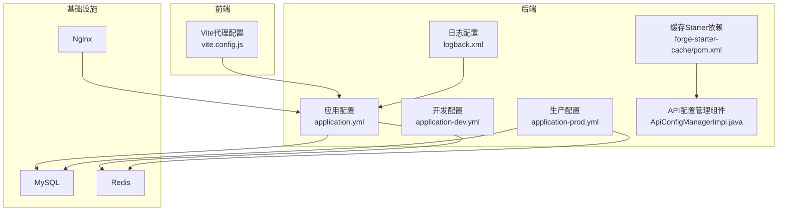
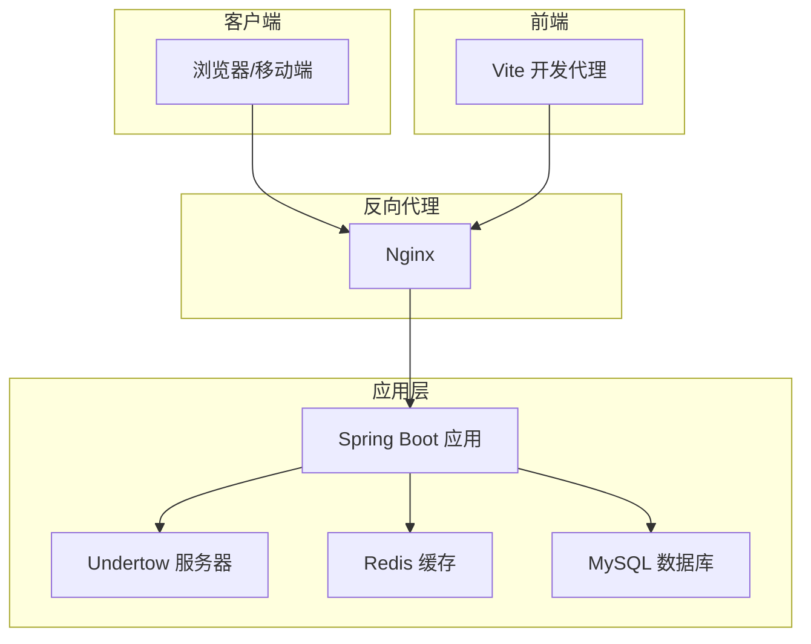
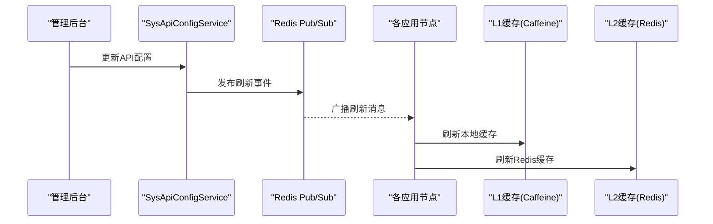
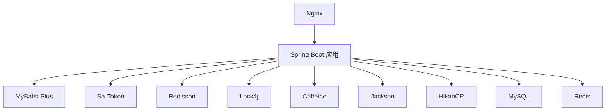

# 服务器配置

<cite>
**本文引用的文件**
- [application.yml](file://forge/forge-admin/src/main/resources/application.yml)
- [application-dev.yml](file://forge/forge-admin/src/main/resources/application-dev.yml)
- [application-prod.yml](file://forge/forge-admin/src/main/resources/application-prod.yml)
- [logback.xml](file://forge/forge-admin/src/main/resources/logback.xml)
- [pom.xml（缓存Starter）](file://forge/forge-framework/forge-starter-parent/forge-starter-cache/pom.xml)
- [API配置管理计划](file://plans/api-config-management-plan.md)
- [缓存管理说明](file://CACHE_MANAGEMENT_README.md)
- [vite.config.js（前端代理）](file://forge-admin-ui/vite.config.js)
- [ApiConfigManagerImpl.java](file://forge/forge-framework/forge-starter-parent/forge-starter-api-config/src/main/java/com/mdframe/forge/starter/apiconfig/service/impl/ApiConfigManagerImpl.java)
</cite>

## 目录
1. [简介](#简介)
2. [项目结构](#项目结构)
3. [核心组件](#核心组件)
4. [架构总览](#架构总览)
5. [详细组件分析](#详细组件分析)
6. [依赖关系分析](#依赖关系分析)
7. [性能考量](#性能考量)
8. [故障排查指南](#故障排查指南)
9. [结论](#结论)
10. [附录](#附录)

## 简介
本指南面向生产环境部署Forge框架，覆盖Linux服务器环境准备（JDK 17、MySQL、Redis）、application-prod.yml关键参数说明（数据库、缓存、文件存储、安全等）、Nginx反向代理与HTTPS、进程守护与系统服务注册、以及性能调优、安全加固与防火墙配置等运维要点。文档以仓库内现有配置与文档为依据，确保可落地实施。

## 项目结构
Forge项目采用多模块结构，生产配置集中在admin模块的resources目录；缓存能力由独立starter模块提供；前端通过Vite开发代理对接后端；API配置管理组件具备两级缓存与刷新机制。

**图表来源**
- [application.yml](file://forge/forge-admin/src/main/resources/application.yml#L1-L100)
- [application-dev.yml](file://forge/forge-admin/src/main/resources/application-dev.yml#L1-L70)
- [application-prod.yml](file://forge/forge-admin/src/main/resources/application-prod.yml#L1-L1)
- [logback.xml](file://forge/forge-admin/src/main/resources/logback.xml#L1-L49)
- [pom.xml（缓存Starter）](file://forge/forge-framework/forge-starter-parent/forge-starter-cache/pom.xml#L1-L45)
- [ApiConfigManagerImpl.java](file://forge/forge-framework/forge-starter-parent/forge-starter-api-config/src/main/java/com/mdframe/forge/starter/apiconfig/service/impl/ApiConfigManagerImpl.java#L25-L68)
- [vite.config.js（前端代理）](file://forge-admin-ui/vite.config.js#L64-L85)

**章节来源**
- [application.yml](file://forge/forge-admin/src/main/resources/application.yml#L1-L100)
- [application-dev.yml](file://forge/forge-admin/src/main/resources/application-dev.yml#L1-L70)
- [application-prod.yml](file://forge/forge-admin/src/main/resources/application-prod.yml#L1-L1)
- [logback.xml](file://forge/forge-admin/src/main/resources/logback.xml#L1-L49)
- [pom.xml（缓存Starter）](file://forge/forge-framework/forge-starter-parent/forge-starter-cache/pom.xml#L1-L45)
- [ApiConfigManagerImpl.java](file://forge/forge-framework/forge-starter-parent/forge-starter-api-config/src/main/java/com/mdframe/forge/starter/apiconfig/service/impl/ApiConfigManagerImpl.java#L25-L68)
- [vite.config.js（前端代理）](file://forge-admin-ui/vite.config.js#L64-L85)

## 核心组件
- 应用配置中心：application.yml定义服务器端口、Undertow线程模型、静态资源路径、Jackson格式化、MyBatis-Plus全局配置、Sa-Token Redis会话等。
- 开发/生产配置：application-dev.yml提供开发态数据库与Redis示例；生产态配置文件application-prod.yml用于覆盖生产参数（当前仓库中为空文件，需按需补充）。
- 日志系统：logback.xml集中输出到./var/logs，并按日期滚动。
- 缓存能力：forge-starter-cache引入Redisson、Lock4j、Caffeine等，支撑两级缓存与分布式锁。
- API配置管理：两级缓存（Caffeine + Redis）+ Redis Pub/Sub刷新，保障配置变更的低延迟一致性。

**章节来源**
- [application.yml](file://forge/forge-admin/src/main/resources/application.yml#L1-L100)
- [application-dev.yml](file://forge/forge-admin/src/main/resources/application-dev.yml#L1-L70)
- [application-prod.yml](file://forge/forge-admin/src/main/resources/application-prod.yml#L1-L1)
- [logback.xml](file://forge/forge-admin/src/main/resources/logback.xml#L1-L49)
- [pom.xml（缓存Starter）](file://forge/forge-framework/forge-starter-parent/forge-starter-cache/pom.xml#L1-L45)
- [ApiConfigManagerImpl.java](file://forge/forge-framework/forge-starter-parent/forge-starter-api-config/src/main/java/com/mdframe/forge/starter/apiconfig/service/impl/ApiConfigManagerImpl.java#L25-L68)

## 架构总览
生产部署涉及后端（Spring Boot + Undertow）、缓存（Redis + Redisson + Caffeine）、数据库（MySQL + HikariCP）、前端（Vite代理）与反向代理（Nginx）。API配置管理组件通过两级缓存与事件刷新，确保高可用与一致性。

**图表来源**
- [application.yml](file://forge/forge-admin/src/main/resources/application.yml#L1-L100)
- [logback.xml](file://forge/forge-admin/src/main/resources/logback.xml#L1-L49)
- [pom.xml（缓存Starter）](file://forge/forge-framework/forge-starter-parent/forge-starter-cache/pom.xml#L1-L45)
- [vite.config.js（前端代理）](file://forge-admin-ui/vite.config.js#L64-L85)

## 详细组件分析

### Linux服务器环境准备
- JDK 17安装
  - 推荐使用包管理器安装或下载官方tar.gz版本，配置JAVA_HOME与PATH。
  - 验证：java -version、javac -version。
- MySQL数据库
  - 安装MySQL并初始化数据库与账号；导入系统所需表结构与基础数据。
  - 生产数据库连接参数在application-prod.yml中配置（当前为空文件，需按需补充）。
- Redis缓存
  - 安装Redis并配置认证、持久化策略；确保网络连通性与安全访问。
  - Redisson与Caffeine在缓存Starter中引入，用于两级缓存与分布式锁。

**章节来源**
- [application-dev.yml](file://forge/forge-admin/src/main/resources/application-dev.yml#L1-L70)
- [pom.xml（缓存Starter）](file://forge/forge-framework/forge-starter-parent/forge-starter-cache/pom.xml#L1-L45)

### application-prod.yml生产环境配置要点
- 数据库连接（MySQL）
  - 数据源类型、驱动、URL、用户名、密码、连接池参数（最大连接数、最小空闲、连接超时、校验超时、空闲与生命周期等）。
  - HikariCP参数建议结合业务QPS与数据库规格进行压测调优。
- 缓存配置（Redis）
  - Redis地址、端口、数据库索引、密码、超时、SSL开关、Redisson配置（单机地址、数据库、密码、连接超时、重试次数、线程池大小等）。
- 文件存储
  - 前端静态资源由Nginx托管；后端文件存储路径与访问域名在生产配置中统一管理。
- 安全设置
  - Sa-Token使用Redis存储会话，需确保Redis安全访问与密码强度。
  - 建议开启HTTPS与强密码策略，生产密钥与证书由运维统一管理。
- 其他关键参数
  - Undertow线程模型（IO线程、Worker线程）、静态资源路径、Jackson序列化配置、MyBatis-Plus全局配置等。

注意：当前仓库中application-prod.yml为空文件，需按上述要点补充完整。

**章节来源**
- [application.yml](file://forge/forge-admin/src/main/resources/application.yml#L1-L100)
- [application-dev.yml](file://forge/forge-admin/src/main/resources/application-dev.yml#L1-L70)

### Nginx反向代理配置
- 静态资源服务
  - 将前端构建产物目录映射为静态资源根目录，开启Gzip压缩与缓存头。
- HTTPS配置
  - 配置SSL证书与私钥；启用TLS 1.2+；禁用弱密码套件；强制HTTP重定向至HTTPS。
- 负载均衡
  - 多实例部署时，配置upstream与轮询策略；健康检查与熔断降级策略视业务需求而定。
- 代理后端
  - 将/api前缀转发至Spring Boot应用；WebSocket路径/ws同样转发；设置超时与缓冲区大小。

**章节来源**
- [vite.config.js（前端代理）](file://forge-admin-ui/vite.config.js#L64-L85)

### 进程守护、系统服务与开机自启
- 进程守护
  - 使用nohup或screen保持应用在后台运行；或使用systemd管理。
- 系统服务注册（systemd）
  - 创建.service文件，设置WorkingDirectory、ExecStart、Restart策略、日志输出路径。
  - 使用systemctl enable forge-admin.service实现开机自启。
- 开机自启
  - 确保JDK、MySQL、Redis随系统启动；应用服务在依赖服务就绪后再启动。

**章节来源**
- [logback.xml](file://forge/forge-admin/src/main/resources/logback.xml#L1-L49)

### 缓存管理与API配置刷新
- 两级缓存架构
  - L1：Caffeine本地缓存（容量、过期时间）；L2：Redis远程缓存（键前缀、过期秒数）。
- 刷新机制
  - 通过Redis Pub/Sub发布刷新事件，各节点监听并同步刷新本地与Redis缓存。
- 可视化管理
  - 提供缓存列表查询、详情查看、删除与清空等操作；支持按模式匹配搜索与分页。

**图表来源**
- [API配置管理计划](file://plans/api-config-management-plan.md#L244-L302)
- [ApiConfigManagerImpl.java](file://forge/forge-framework/forge-starter-parent/forge-starter-api-config/src/main/java/com/mdframe/forge/starter/apiconfig/service/impl/ApiConfigManagerImpl.java#L25-L68)

**章节来源**
- [API配置管理计划](file://plans/api-config-management-plan.md#L244-L302)
- [ApiConfigManagerImpl.java](file://forge/forge-framework/forge-starter-parent/forge-starter-api-config/src/main/java/com/mdframe/forge/starter/apiconfig/service/impl/ApiConfigManagerImpl.java#L25-L68)
- [缓存管理说明](file://CACHE_MANAGEMENT_README.md#L1-L190)

## 依赖关系分析
- 后端依赖
  - Spring Boot、MyBatis-Plus、Sa-Token、Redisson、Lock4j、Caffeine、Jackson等。
- 前端依赖
  - Vue 3、Naive UI、AiCrudPage等；开发代理将/api前缀转发至后端。
- 基础设施
  - MySQL（HikariCP连接池）、Redis（Redisson客户端）、Nginx（反向代理与HTTPS）。

**图表来源**
- [application.yml](file://forge/forge-admin/src/main/resources/application.yml#L1-L100)
- [pom.xml（缓存Starter）](file://forge/forge-framework/forge-starter-parent/forge-starter-cache/pom.xml#L1-L45)
- [vite.config.js（前端代理）](file://forge-admin-ui/vite.config.js#L64-L85)

**章节来源**
- [application.yml](file://forge/forge-admin/src/main/resources/application.yml#L1-L100)
- [pom.xml（缓存Starter）](file://forge/forge-framework/forge-starter-parent/forge-starter-cache/pom.xml#L1-L45)
- [vite.config.js（前端代理）](file://forge-admin-ui/vite.config.js#L64-L85)

## 性能考量
- Undertow线程模型
  - IO线程数与Worker线程数根据CPU核数与并发连接数调整；合理设置buffer-size与direct-buffers。
- 数据库连接池
  - HikariCP参数（最大连接、最小空闲、连接超时、校验超时、空闲与生命周期）需结合QPS与RT压测优化。
- 缓存策略
  - L1（Caffeine）容量与过期时间、L2（Redis）键前缀与过期秒数；热点键预热与冷键淘汰策略。
- 日志与磁盘
  - 日志滚动策略与保留天数；避免高频写入导致磁盘IO瓶颈。
- 前端与反向代理
  - Nginx启用Gzip与静态缓存；合理设置代理超时与缓冲区大小。

**章节来源**
- [application.yml](file://forge/forge-admin/src/main/resources/application.yml#L1-L100)
- [logback.xml](file://forge/forge-admin/src/main/resources/logback.xml#L1-L49)
- [API配置管理计划](file://plans/api-config-management-plan.md#L244-L302)

## 故障排查指南
- 缓存管理
  - 菜单不显示：检查菜单SQL是否执行、角色权限是否分配、清理浏览器缓存后重登。
  - 缓存列表为空：检查Redis连接、确认Redis中存在数据、核对搜索模式。
  - 删除失败：检查后端日志、确认键名正确、检查Redis服务状态。
- 日志定位
  - 日志输出到./var/logs，按日期滚动；关注traceId辅助定位请求链路。
- 前端代理
  - /api前缀未转发：检查Vite代理配置target与rewrite规则；确认WebSocket/ws代理配置。

**章节来源**
- [缓存管理说明](file://CACHE_MANAGEMENT_README.md#L134-L190)
- [logback.xml](file://forge/forge-admin/src/main/resources/logback.xml#L1-L49)
- [vite.config.js（前端代理）](file://forge-admin-ui/vite.config.js#L64-L85)

## 结论
本指南基于仓库现有配置与文档，给出了生产环境部署的完整路径：环境准备、配置要点、反向代理、进程守护与系统服务、性能与安全加固。建议在上线前完成压测与演练，确保数据库、缓存与应用层协同稳定。

## 附录
- 生产配置补充清单
  - 数据库连接：URL、用户名、密码、连接池参数。
  - Redis连接：host、port、password、database、timeout、ssl.enabled、Redisson配置。
  - 文件存储：本地存储路径与对外访问域名。
  - 安全：HTTPS证书、Sa-Token会话安全、强密码策略。
- 建议的运维流程
  - 预发布验证（压测、日志、缓存）→灰度发布 → 全量切换 → 回滚预案。