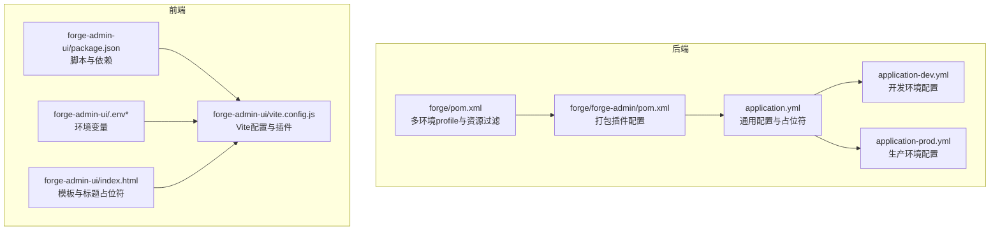
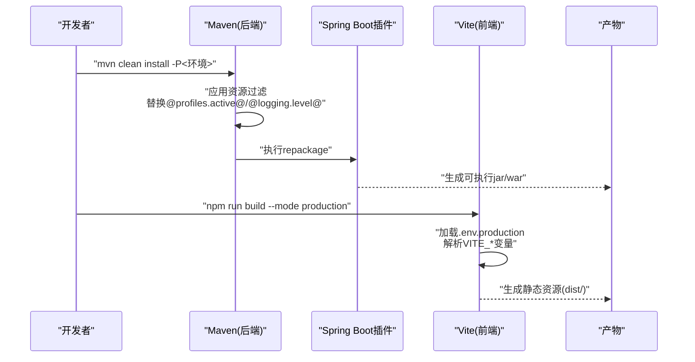
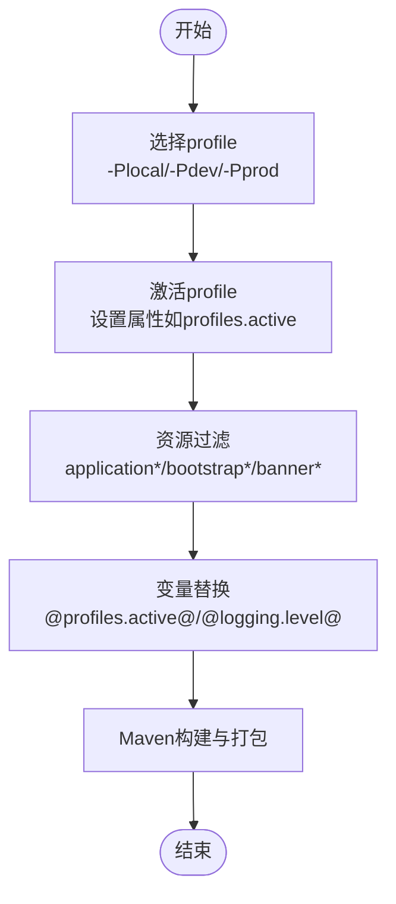
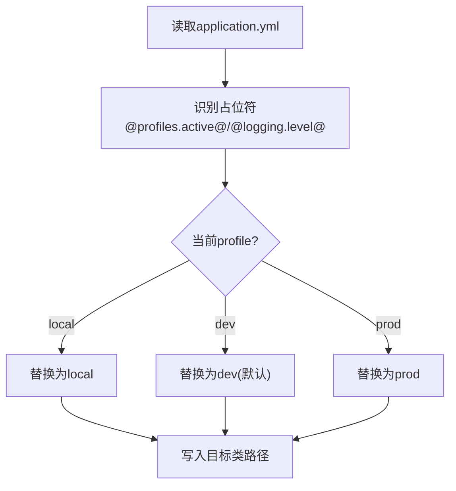
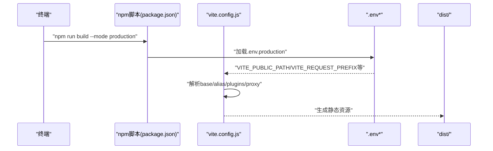
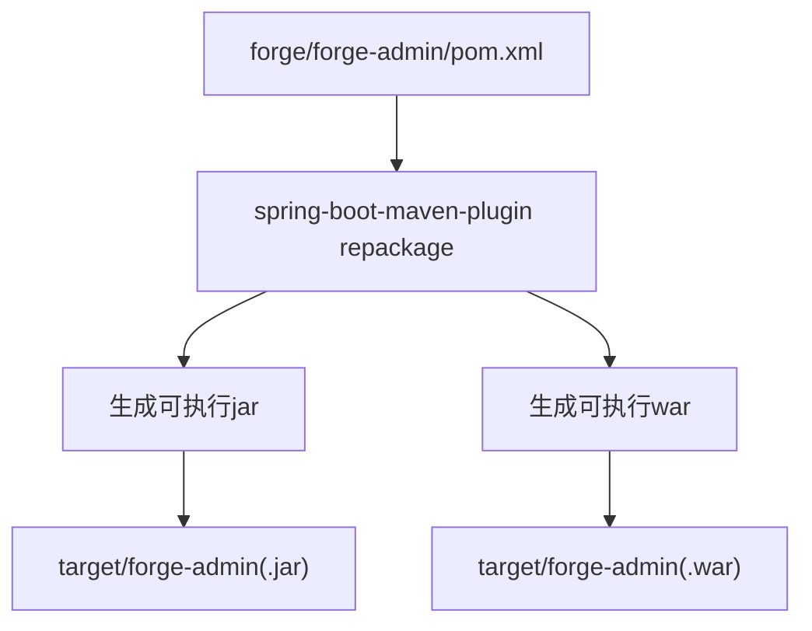
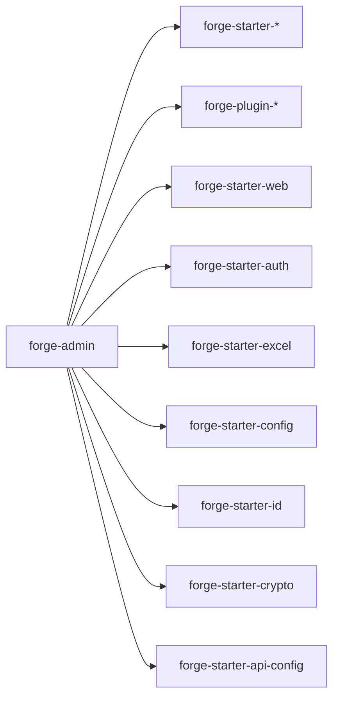

# 构建与打包

<cite>
**本文引用的文件**
- [forge/pom.xml](file://forge/pom.xml)
- [forge/forge-admin/pom.xml](file://forge/forge-admin/pom.xml)
- [forge/forge-admin/src/main/resources/application.yml](file://forge/forge-admin/src/main/resources/application.yml)
- [forge/forge-admin/src/main/resources/application-dev.yml](file://forge/forge-admin/src/main/resources/application-dev.yml)
- [forge/forge-admin/src/main/resources/application-prod.yml](file://forge/forge-admin/src/main/resources/application-prod.yml)
- [forge-admin-ui/vite.config.js](file://forge-admin-ui/vite.config.js)
- [forge-admin-ui/package.json](file://forge-admin-ui/package.json)
- [forge-admin-ui/.env](file://forge-admin-ui/.env)
- [forge-admin-ui/.env.development](file://forge-admin-ui/.env.development)
- [forge-admin-ui/.env.production](file://forge-admin-ui/.env.production)
- [forge-admin-ui/index.html](file://forge-admin-ui/index.html)
</cite>

## 目录
1. [简介](#简介)
2. [项目结构](#项目结构)
3. [核心组件](#核心组件)
4. [架构总览](#架构总览)
5. [详细组件分析](#详细组件分析)
6. [依赖分析](#依赖分析)
7. [性能考量](#性能考量)
8. [故障排查指南](#故障排查指南)
9. [结论](#结论)
10. [附录](#附录)

## 简介
本指南面向Forge框架的构建与打包流程，覆盖后端Maven多环境构建（local/dev/prod）、配置文件过滤与变量替换、前端Vite构建与静态资源处理、以及从代码编译到最终产物生成的完整步骤。同时提供常见问题排查与解决方案，帮助开发者在不同环境下稳定产出可部署产物。

## 项目结构
Forge采用多模块Maven工程组织，后端主模块统一管理依赖与构建插件；前端独立使用Vite进行开发与生产构建。关键文件分布如下：
- 后端：根POM定义多环境profile与资源过滤；子模块forge-admin通过Spring Boot Maven插件打包为可执行产物。
- 前端：Vite配置集中于vite.config.js，结合.env系列环境变量实现不同环境的构建与代理。

**图表来源**
- [forge/pom.xml](file://forge/pom.xml#L63-L91)
- [forge/pom.xml](file://forge/pom.xml#L203-L221)
- [forge/forge-admin/pom.xml](file://forge/forge-admin/pom.xml#L78-L108)
- [forge/forge-admin/src/main/resources/application.yml](file://forge/forge-admin/src/main/resources/application.yml#L23-L41)
- [forge/forge-admin/src/main/resources/application-dev.yml](file://forge/forge-admin/src/main/resources/application-dev.yml#L1-L70)
- [forge-admin-ui/vite.config.js](file://forge-admin-ui/vite.config.js#L13-L85)
- [forge-admin-ui/package.json](file://forge-admin-ui/package.json#L6-L12)
- [forge-admin-ui/.env.development](file://forge-admin-ui/.env.development#L1-L16)
- [forge-admin-ui/.env.production](file://forge-admin-ui/.env.production#L1-L14)
- [forge-admin-ui/index.html](file://forge-admin-ui/index.html#L7-L7)

**章节来源**
- [forge/pom.xml](file://forge/pom.xml#L63-L91)
- [forge/pom.xml](file://forge/pom.xml#L203-L221)
- [forge/forge-admin/pom.xml](file://forge/forge-admin/pom.xml#L78-L108)
- [forge/forge-admin/src/main/resources/application.yml](file://forge/forge-admin/src/main/resources/application.yml#L23-L41)
- [forge-admin-ui/vite.config.js](file://forge-admin-ui/vite.config.js#L13-L85)
- [forge-admin-ui/package.json](file://forge-admin-ui/package.json#L6-L12)

## 核心组件
- Maven多环境profile与激活
  - local、dev、prod三套profile，分别设置profiles.active与日志级别等属性；dev默认激活。
- 资源过滤与变量替换
  - 通过资源过滤启用application*、bootstrap*、banner*等文件的占位符替换，占位符来源于profile属性。
- Spring Boot打包
  - 使用spring-boot-maven-plugin重打包，支持jar/war两种产物形态。
- 前端Vite构建
  - 通过Vite插件链与环境变量控制代理、别名、公共路径与构建行为。

**章节来源**
- [forge/pom.xml](file://forge/pom.xml#L63-L91)
- [forge/pom.xml](file://forge/pom.xml#L203-L221)
- [forge/forge-admin/pom.xml](file://forge/forge-admin/pom.xml#L78-L108)
- [forge-admin-ui/vite.config.js](file://forge-admin-ui/vite.config.js#L13-L85)

## 架构总览
下图展示从本地开发到生产发布的整体构建与打包路径，涵盖Maven后端与Vite前端的协同关系。

**图表来源**
- [forge/pom.xml](file://forge/pom.xml#L203-L221)
- [forge/forge-admin/pom.xml](file://forge/forge-admin/pom.xml#L80-L92)
- [forge-admin-ui/package.json](file://forge-admin-ui/package.json#L6-L12)
- [forge-admin-ui/.env.production](file://forge-admin-ui/.env.production#L1-L14)

## 详细组件分析

### Maven多环境构建与激活
- profile定义与激活
  - local：设置profiles.active=local，日志级别info。
  - dev：设置profiles.active=dev，日志级别info，默认激活。
  - prod：设置profiles.active=prod，日志级别warn。
- 资源过滤策略
  - 默认关闭过滤；对application*、bootstrap*、banner*启用过滤，使占位符生效。
  - 占位符示例：@profiles.active@、@logging.level@。
- 测试分组
  - Surefire插件读取profiles.active作为测试分组标签，便于按环境选择性执行测试。

**图表来源**
- [forge/pom.xml](file://forge/pom.xml#L63-L91)
- [forge/pom.xml](file://forge/pom.xml#L203-L221)
- [forge/forge-admin/pom.xml](file://forge/forge-admin/pom.xml#L78-L108)

**章节来源**
- [forge/pom.xml](file://forge/pom.xml#L63-L91)
- [forge/pom.xml](file://forge/pom.xml#L203-L221)
- [forge/forge-admin/pom.xml](file://forge/forge-admin/pom.xml#L78-L108)

### application*.yml 的过滤机制与变量替换
- application.yml
  - 通过占位符注入：profiles.active、logging.level。
  - 示例占位符：spring.profiles.active: @profiles.active@；日志级别：@logging.level@。
- application-dev.yml
  - 提供开发环境的数据库、Redis、分布式配置等示例。
- application-prod.yml
  - 提供生产环境的配置占位与示例，便于在CI/CD中注入真实值。

**图表来源**
- [forge/forge-admin/src/main/resources/application.yml](file://forge/forge-admin/src/main/resources/application.yml#L23-L41)
- [forge/forge-admin/src/main/resources/application-dev.yml](file://forge/forge-admin/src/main/resources/application-dev.yml#L1-L70)
- [forge/forge-admin/src/main/resources/application-prod.yml](file://forge/forge-admin/src/main/resources/application-prod.yml#L1-L20)

**章节来源**
- [forge/forge-admin/src/main/resources/application.yml](file://forge/forge-admin/src/main/resources/application.yml#L23-L41)
- [forge/forge-admin/src/main/resources/application-dev.yml](file://forge/forge-admin/src/main/resources/application-dev.yml#L1-L70)
- [forge/forge-admin/src/main/resources/application-prod.yml](file://forge/forge-admin/src/main/resources/application-prod.yml#L1-L20)

### 前端Vite构建配置
- 构建命令
  - 开发：npm run dev（Vite内置开发服务器）。
  - 生产：npm run build（基于Vite的生产构建）。
- 环境变量
  - .env：全局默认变量（租户、标题、默认布局等）。
  - .env.development：开发环境端口、代理、请求前缀等。
  - .env.production：生产环境公共路径、路由前缀、请求前缀等。
- Vite配置要点
  - base：根据VITE_PUBLIC_PATH决定静态资源公共路径。
  - server.proxy：将带前缀的请求转发至后端服务，支持WebSocket/ws。
  - plugins：Vue、JSX、UnoCSS、自动导入、组件解析、自定义插件与开发工具。
  - define.global：为特定依赖提供全局对象。
  - css.preprocessorOptions：统一SCSS变量注入。
- HTML模板
  - index.html中<title>使用%VITE_TITLE%占位符，构建时由Vite注入。

**图表来源**
- [forge-admin-ui/package.json](file://forge-admin-ui/package.json#L6-L12)
- [forge-admin-ui/vite.config.js](file://forge-admin-ui/vite.config.js#L13-L85)
- [forge-admin-ui/.env.production](file://forge-admin-ui/.env.production#L1-L14)
- [forge-admin-ui/index.html](file://forge-admin-ui/index.html#L7-L7)

**章节来源**
- [forge-admin-ui/package.json](file://forge-admin-ui/package.json#L6-L12)
- [forge-admin-ui/vite.config.js](file://forge-admin-ui/vite.config.js#L13-L85)
- [forge-admin-ui/.env](file://forge-admin-ui/.env#L1-L26)
- [forge-admin-ui/.env.development](file://forge-admin-ui/.env.development#L1-L16)
- [forge-admin-ui/.env.production](file://forge-admin-ui/.env.production#L1-L14)
- [forge-admin-ui/index.html](file://forge-admin-ui/index.html#L7-L7)

### Spring Boot 打包与产物形态
- 插件与目标
  - spring-boot-maven-plugin：repackage生成可执行jar/war。
  - maven-jar-plugin、maven-war-plugin：补充jar/war打包细节。
- 产物命名
  - finalName与warName均指向模块artifactId，确保产物名一致。

**图表来源**
- [forge/forge-admin/pom.xml](file://forge/forge-admin/pom.xml#L78-L108)

**章节来源**
- [forge/forge-admin/pom.xml](file://forge/forge-admin/pom.xml#L78-L108)

## 依赖分析
- 后端模块间依赖
  - forge-admin依赖多个starter与plugin模块，形成系统能力组合。
- 前端依赖与脚本
  - Vue3、NaiveUI、Axios、Pinia、路由等核心依赖；Vite与各类插件提升开发体验与构建效率。

**图表来源**
- [forge/forge-admin/pom.xml](file://forge/forge-admin/pom.xml#L13-L76)

**章节来源**
- [forge/forge-admin/pom.xml](file://forge/forge-admin/pom.xml#L13-L76)

## 性能考量
- 后端
  - 资源过滤仅针对必要文件，避免不必要的文本处理开销。
  - 单元测试按环境分组执行，减少无关测试耗时。
- 前端
  - Vite构建阶段按需加载与插件链优化；生产模式建议开启代码压缩与资源内联策略（在具体项目中按需配置）。
  - 代理配置减少跨域与重复请求，提升开发调试效率。

[本节为通用指导，不涉及具体文件分析]

## 故障排查指南
- 后端资源未替换或占位符残留
  - 检查是否正确激活profile（-Plocal/dev/prod），确认资源过滤范围包含application*。
  - 确认application.yml中占位符拼写与大小写一致。
- 日志级别不符合预期
  - 检查对应profile的logging.level属性是否正确设置。
- Spring Boot打包失败或产物异常
  - 确认spring-boot-maven-plugin版本与Spring Boot版本匹配。
  - 检查finalName与warName是否符合预期。
- 前端构建产物路径错误
  - 检查VITE_PUBLIC_PATH与VITE_BASE_URL是否与后端静态资源映射一致。
- 开发代理无效或404
  - 确认VITE_REQUEST_PREFIX与后端接口前缀一致；代理target地址正确且允许跨域。
- 页面标题未替换
  - 检查index.html中%VITE_TITLE%是否存在于.env或.env.development中。

**章节来源**
- [forge/pom.xml](file://forge/pom.xml#L203-L221)
- [forge/forge-admin/src/main/resources/application.yml](file://forge/forge-admin/src/main/resources/application.yml#L23-L41)
- [forge/forge-admin/pom.xml](file://forge/forge-admin/pom.xml#L78-L108)
- [forge-admin-ui/vite.config.js](file://forge-admin-ui/vite.config.js#L56-L80)
- [forge-admin-ui/.env.development](file://forge-admin-ui/.env.development#L1-L16)
- [forge-admin-ui/index.html](file://forge-admin-ui/index.html#L7-L7)

## 结论
通过合理配置Maven多环境profile与资源过滤、结合Spring Boot插件完成可执行产物打包，配合Vite在不同环境下的变量注入与代理策略，Forge框架能够稳定地在local、dev、prod环境中生成一致且可部署的产物。遵循本文提供的流程与排错建议，可显著降低构建与集成成本。

[本节为总结性内容，不涉及具体文件分析]

## 附录
- 构建流程清单
  - 后端
    - 清理：mvn clean
    - 安装（含过滤与打包）：mvn install -P<环境>
  - 前端
    - 安装依赖：npm install
    - 开发：npm run dev
    - 生产构建：npm run build --mode production
- 关键文件速览
  - 后端：forge/pom.xml、forge/forge-admin/pom.xml、application*.yml
  - 前端：vite.config.js、package.json、.env*

[本节为概览性内容，不涉及具体文件分析]