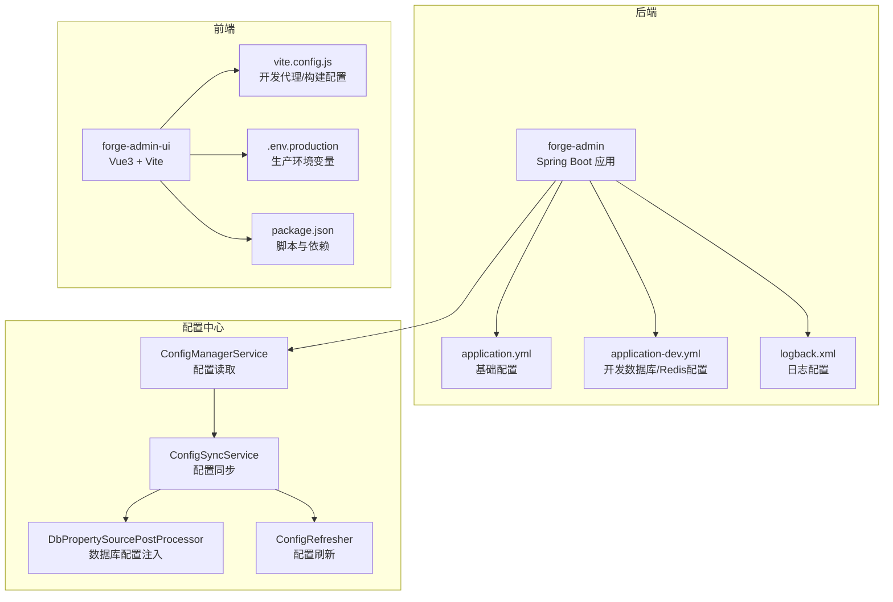
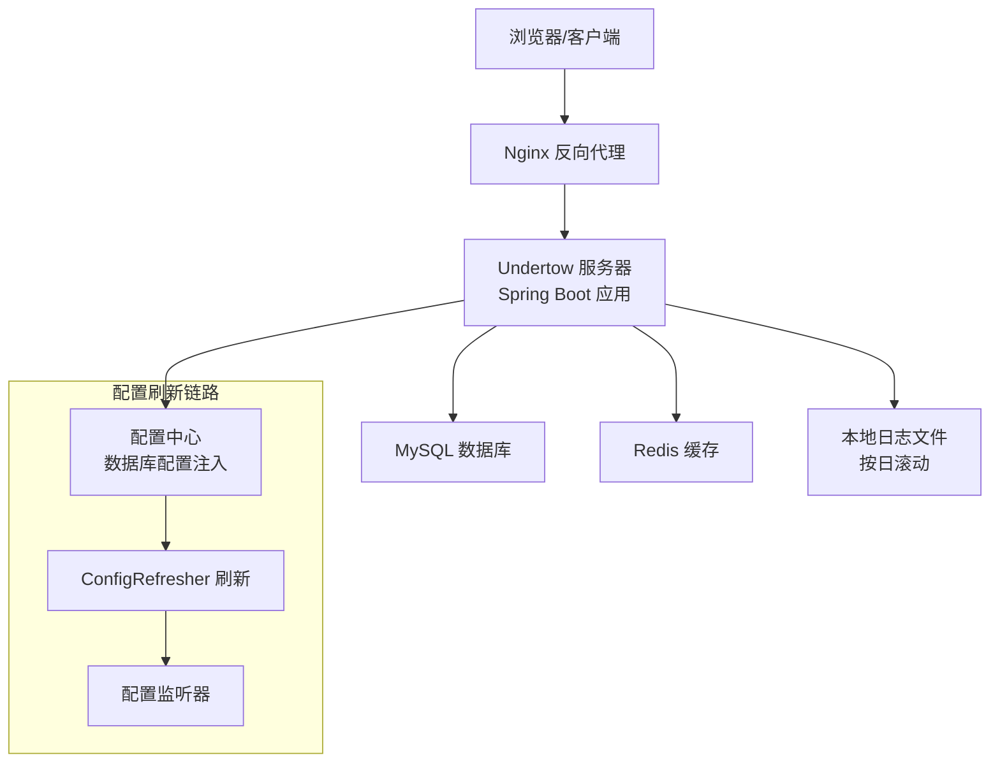
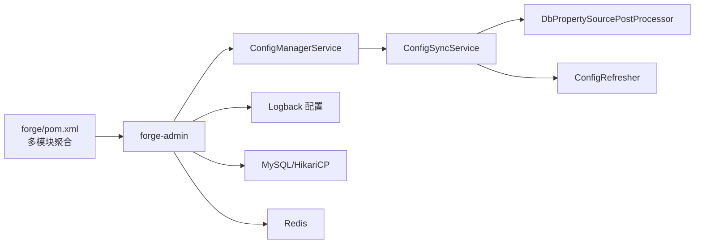

# 生产环境部署

<cite>
**本文引用的文件**
- [forge/pom.xml](file://forge/pom.xml)
- [forge/forge-admin/src/main/resources/application.yml](file://forge/forge-admin/src/main/resources/application.yml)
- [forge/forge-admin/src/main/resources/application-dev.yml](file://forge/forge-admin/src/main/resources/application-dev.yml)
- [forge/forge-admin/src/main/resources/logback.xml](file://forge/forge-admin/src/main/resources/logback.xml)
- [forge-admin-ui/vite.config.js](file://forge-admin-ui/vite.config.js)
- [forge-admin-ui/.env.production](file://forge-admin-ui/.env.production)
- [forge-admin-ui/package.json](file://forge-admin-ui/package.json)
- [forge/forge-framework/forge-starter-parent/forge-starter-config/src/main/java/com/mdframe/forge/starter/config/controller/ConfigManageController.java](file://forge/forge-framework/forge-starter-parent/forge-starter-config/src/main/java/com/mdframe/forge/starter/config/controller/ConfigManageController.java)
- [forge/forge-framework/forge-starter-parent/forge-starter-config/src/main/java/com/mdframe/forge/starter/config/service/ConfigManagerService.java](file://forge/forge-framework/forge-starter-parent/forge-starter-config/src/main/java/com/mdframe/forge/starter/config/service/ConfigManagerService.java)
- [forge/forge-framework/forge-starter-parent/forge-starter-config/src/main/java/com/mdframe/forge/starter/config/service/ConfigSyncService.java](file://forge/forge-framework/forge-starter-parent/forge-starter-config/src/main/java/com/mdframe/forge/starter/config/service/ConfigSyncService.java)
- [forge/forge-framework/forge-starter-parent/forge-starter-config/src/main/java/com/mdframe/forge/starter/property/DbPropertySourcePostProcessor.java](file://forge/forge-framework/forge-starter-parent/forge-starter-config/src/main/java/com/mdframe/forge/starter/property/DbPropertySourcePostProcessor.java)
- [forge/forge-framework/forge-starter-parent/forge-starter-config/src/main/java/com/mdframe/forge/starter/property/refresh/ConfigRefresher.java](file://forge/forge-framework/forge-starter-parent/forge-starter-config/src/main/java/com/mdframe/forge/starter/property/refresh/ConfigRefresher.java)
- [forge/forge-framework/forge-starter-parent/forge-starter-crypto/src/main/java/com/mdframe/forge/starter/crypto/advice/EncryptResponseBodyAdvice.java](file://forge/forge-framework/forge-starter-parent/forge-starter-crypto/src/main/java/com/mdframe/forge/starter/crypto/advice/EncryptResponseBodyAdvice.java)
- [forge/forge-framework/forge-starter-parent/forge-starter-api-config/src/main/java/com/mdframe/forge/starter/apiconfig/service/impl/ApiConfigManagerImpl.java](file://forge/forge-framework/forge-starter-parent/forge-starter-api-config/src/main/java/com/mdframe/forge/starter/apiconfig/service/impl/ApiConfigManagerImpl.java)
- [forge/forge-framework/forge-plugin-parent/forge-plugin-generator/src/main/java/com/mdframe/forge/plugin/generator/util/DynamicDataSourceUtil.java](file://forge/forge-framework/forge-plugin-parent/forge-plugin-generator/src/main/java/com/mdframe/forge/plugin/generator/util/DynamicDataSourceUtil.java)
- [forge/forge-framework/forge-starter-parent/forge-starter-id/src/main/java/com/mdframe/forge/starter/id/config/IdGeneratorConfiguration.java](file://forge/forge-framework/forge-starter-parent/forge-starter-id/src/main/java/com/mdframe/forge/starter/id/config/IdGeneratorConfiguration.java)
- [forge/forge-framework/forge-starter-parent/forge-starter-job/src/main/resources/application-job-example.yml](file://forge/forge-framework/forge-starter-parent/forge-starter-job/src/main/resources/application-job-example.yml)
- [plans/api-config-management-plan.md](file://plans/api-config-management-plan.md)
</cite>

## 目录
1. [简介](#简介)
2. [项目结构](#项目结构)
3. [核心组件](#核心组件)
4. [架构总览](#架构总览)
5. [详细组件分析](#详细组件分析)
6. [依赖关系分析](#依赖关系分析)
7. [性能考量](#性能考量)
8. [故障排查指南](#故障排查指南)
9. [结论](#结论)
10. [附录](#附录)

## 简介
本指南面向在生产环境部署 Forge 框架的工程团队，覆盖从前端构建、后端打包、容器化到运维上线的全流程。重点包括：
- Maven 构建与多环境配置
- 前端构建与代理配置
- Docker 镜像制作与容器编排思路
- Nginx 反向代理、SSL 证书、负载均衡
- 数据库连接池优化与运维要点
- Linux 服务器部署、进程守护、日志轮转、性能调优
- 生产环境配置文件 application-prod.yml 与 .env.production 的配置要点

## 项目结构
Forge 采用多模块 Maven 结构，后端主模块为 forge-admin，前端位于 forge-admin-ui。后端通过 Undertow 作为 Web 服务器，日志通过 Logback 输出到本地文件并支持按天滚动。

图表来源
- [forge/pom.xml](file://forge/pom.xml#L114-L119)
- [forge/forge-admin/src/main/resources/application.yml](file://forge/forge-admin/src/main/resources/application.yml#L1-L100)
- [forge/forge-admin/src/main/resources/application-dev.yml](file://forge/forge-admin/src/main/resources/application-dev.yml#L1-L70)
- [forge/forge-admin/src/main/resources/logback.xml](file://forge/forge-admin/src/main/resources/logback.xml#L1-L49)
- [forge-admin-ui/vite.config.js](file://forge-admin-ui/vite.config.js#L1-L86)
- [forge-admin-ui/.env.production](file://forge-admin-ui/.env.production#L1-L14)
- [forge-admin-ui/package.json](file://forge-admin-ui/package.json#L1-L68)
- [forge/forge-framework/forge-starter-parent/forge-starter-config/src/main/java/com/mdframe/forge/starter/config/service/ConfigManagerService.java](file://forge/forge-framework/forge-starter-parent/forge-starter-config/src/main/java/com/mdframe/forge/starter/config/service/ConfigManagerService.java#L1-L54)
- [forge/forge-framework/forge-starter-parent/forge-starter-config/src/main/java/com/mdframe/forge/starter/config/service/ConfigSyncService.java](file://forge/forge-framework/forge-starter-parent/forge-starter-config/src/main/java/com/mdframe/forge/starter/config/service/ConfigSyncService.java#L97-L120)
- [forge/forge-framework/forge-starter-parent/forge-starter-config/src/main/java/com/mdframe/forge/starter/property/DbPropertySourcePostProcessor.java](file://forge/forge-framework/forge-starter-parent/forge-starter-config/src/main/java/com/mdframe/forge/starter/property/DbPropertySourcePostProcessor.java#L39-L65)
- [forge/forge-framework/forge-starter-parent/forge-starter-config/src/main/java/com/mdframe/forge/starter/property/refresh/ConfigRefresher.java](file://forge/forge-framework/forge-starter-parent/forge-starter-config/src/main/java/com/mdframe/forge/starter/property/refresh/ConfigRefresher.java#L114-L156)

章节来源
- [forge/pom.xml](file://forge/pom.xml#L114-L119)
- [forge/forge-admin/src/main/resources/application.yml](file://forge/forge-admin/src/main/resources/application.yml#L1-L100)
- [forge/forge-admin/src/main/resources/application-dev.yml](file://forge/forge-admin/src/main/resources/application-dev.yml#L1-L70)
- [forge/forge-admin/src/main/resources/logback.xml](file://forge/forge-admin/src/main/resources/logback.xml#L1-L49)
- [forge-admin-ui/vite.config.js](file://forge-admin-ui/vite.config.js#L1-L86)
- [forge-admin-ui/.env.production](file://forge-admin-ui/.env.production#L1-L14)
- [forge-admin-ui/package.json](file://forge-admin-ui/package.json#L1-L68)

## 核心组件
- 后端应用启动与 Web 服务器
  - Undertow 线程模型与 IO/worker 线程数配置，适合高并发场景。
  - 日志输出至本地文件并按天滚动，便于生产环境日志管理。
- 前端构建与代理
  - Vite 开发代理支持 WebSocket，生产环境通过 .env.production 配置静态资源路径与请求前缀。
- 配置中心与动态刷新
  - 支持从数据库表加载配置，提供刷新事件与监听机制，实现配置热更新。
- 加密与接口配置
  - 加密拦截器支持路径白/黑名单与排除路径，接口配置管理器支持精确/通配/前缀匹配的路径评分与缓存。

章节来源
- [forge/forge-admin/src/main/resources/application.yml](file://forge/forge-admin/src/main/resources/application.yml#L1-L100)
- [forge/forge-admin/src/main/resources/logback.xml](file://forge/forge-admin/src/main/resources/logback.xml#L1-L49)
- [forge-admin-ui/vite.config.js](file://forge-admin-ui/vite.config.js#L56-L84)
- [forge-admin-ui/.env.production](file://forge-admin-ui/.env.production#L1-L14)
- [forge/forge-framework/forge-starter-parent/forge-starter-config/src/main/java/com/mdframe/forge/starter/config/controller/ConfigManageController.java](file://forge/forge-framework/forge-starter-parent/forge-starter-config/src/main/java/com/mdframe/forge/starter/config/controller/ConfigManageController.java#L143-L162)
- [forge/forge-framework/forge-starter-parent/forge-starter-config/src/main/java/com/mdframe/forge/starter/config/service/ConfigManagerService.java](file://forge/forge-framework/forge-starter-parent/forge-starter-config/src/main/java/com/mdframe/forge/starter/config/service/ConfigManagerService.java#L1-L54)
- [forge/forge-framework/forge-starter-parent/forge-starter-config/src/main/java/com/mdframe/forge/starter/config/service/ConfigSyncService.java](file://forge/forge-framework/forge-starter-parent/forge-starter-config/src/main/java/com/mdframe/forge/starter/config/service/ConfigSyncService.java#L97-L120)
- [forge/forge-framework/forge-starter-parent/forge-starter-config/src/main/java/com/mdframe/forge/starter/property/DbPropertySourcePostProcessor.java](file://forge/forge-framework/forge-starter-parent/forge-starter-config/src/main/java/com/mdframe/forge/starter/property/DbPropertySourcePostProcessor.java#L39-L65)
- [forge/forge-framework/forge-starter-parent/forge-starter-config/src/main/java/com/mdframe/forge/starter/property/refresh/ConfigRefresher.java](file://forge/forge-framework/forge-starter-parent/forge-starter-config/src/main/java/com/mdframe/forge/starter/property/refresh/ConfigRefresher.java#L114-L156)
- [forge/forge-framework/forge-starter-parent/forge-starter-crypto/src/main/java/com/mdframe/forge/starter/crypto/advice/EncryptResponseBodyAdvice.java](file://forge/forge-framework/forge-starter-parent/forge-starter-crypto/src/main/java/com/mdframe/forge/starter/crypto/advice/EncryptResponseBodyAdvice.java#L166-L197)
- [forge/forge-framework/forge-starter-parent/forge-starter-api-config/src/main/java/com/mdframe/forge/starter/apiconfig/service/impl/ApiConfigManagerImpl.java](file://forge/forge-framework/forge-starter-parent/forge-starter-api-config/src/main/java/com/mdframe/forge/starter/apiconfig/service/impl/ApiConfigManagerImpl.java#L132-L172)

## 架构总览
下图展示生产环境部署的关键交互：前端通过 Nginx 反代，后端 Undertow 提供 REST/WebSocket 服务，配置中心从数据库加载配置并通过刷新事件驱动运行时更新；日志按天滚动，数据库连接池由 HikariCP 管理。

图表来源
- [forge/forge-admin/src/main/resources/application.yml](file://forge/forge-admin/src/main/resources/application.yml#L1-L100)
- [forge/forge-admin/src/main/resources/application-dev.yml](file://forge/forge-admin/src/main/resources/application-dev.yml#L1-L70)
- [forge/forge-admin/src/main/resources/logback.xml](file://forge/forge-admin/src/main/resources/logback.xml#L1-L49)
- [forge/forge-framework/forge-starter-parent/forge-starter-config/src/main/java/com/mdframe/forge/starter/property/DbPropertySourcePostProcessor.java](file://forge/forge-framework/forge-starter-parent/forge-starter-config/src/main/java/com/mdframe/forge/starter/property/DbPropertySourcePostProcessor.java#L39-L65)
- [forge/forge-framework/forge-starter-parent/forge-starter-config/src/main/java/com/mdframe/forge/starter/property/refresh/ConfigRefresher.java](file://forge/forge-framework/forge-starter-parent/forge-starter-config/src/main/java/com/mdframe/forge/starter/property/refresh/ConfigRefresher.java#L114-L156)

## 详细组件分析

### 后端构建与打包（Maven）
- 多环境 Profile
  - 通过 profiles.active 切换 dev/prod 等环境，日志级别在 prod 下设为 warn。
- 资源过滤
  - application*.yml 与 bootstrap* 会被过滤，便于注入变量。
- 编译与测试
  - 统一 Java 版本与注解处理器，Surefire 按环境标签执行测试。
- 仓库与插件仓库
  - 配置华为云与阿里云镜像，提升依赖下载稳定性。

章节来源
- [forge/pom.xml](file://forge/pom.xml#L63-L91)
- [forge/pom.xml](file://forge/pom.xml#L203-L221)
- [forge/pom.xml](file://forge/pom.xml#L223-L256)

### 前端构建与代理（Vite）
- 基础路径与请求前缀
  - VITE_PUBLIC_PATH/VITE_BASE_URL 控制静态资源路径；VITE_REQUEST_PREFIX 作为后端代理前缀。
- 代理配置
  - 通过 VITE_HTTP_PROXY_TARGET 将 /cbc-server 前缀请求代理到后端，WebSocket 走 /ws。
- 构建优化
  - chunkSizeWarningLimit 提升体积告警阈值，减少误报。

章节来源
- [forge-admin-ui/.env.production](file://forge-admin-ui/.env.production#L1-L14)
- [forge-admin-ui/vite.config.js](file://forge-admin-ui/vite.config.js#L13-L84)
- [forge-admin-ui/package.json](file://forge-admin-ui/package.json#L6-L12)

### 日志与配置中心（Logback + 数据库配置）
- 日志配置
  - 输出到 ./var/logs，按天滚动，保留 30 天历史。
- 数据库配置注入
  - 通过 DbPropertySourcePostProcessor 从 sys_config 表加载配置，注册为最高优先级属性源。
- 配置刷新
  - ConfigRefresher 负责将数据库配置转换为驼峰键并合并到环境；ConfigManageController 提供 /refresh 触发刷新事件。

章节来源
- [forge/forge-admin/src/main/resources/logback.xml](file://forge/forge-admin/src/main/resources/logback.xml#L1-L49)
- [forge/forge-framework/forge-starter-parent/forge-starter-config/src/main/java/com/mdframe/forge/starter/property/DbPropertySourcePostProcessor.java](file://forge/forge-framework/forge-starter-parent/forge-starter-config/src/main/java/com/mdframe/forge/starter/property/DbPropertySourcePostProcessor.java#L39-L65)
- [forge/forge-framework/forge-starter-parent/forge-starter-config/src/main/java/com/mdframe/forge/starter/property/refresh/ConfigRefresher.java](file://forge/forge-framework/forge-starter-parent/forge-starter-config/src/main/java/com/mdframe/forge/starter/property/refresh/ConfigRefresher.java#L114-L156)
- [forge/forge-framework/forge-starter-parent/forge-starter-config/src/main/java/com/mdframe/forge/starter/config/controller/ConfigManageController.java](file://forge/forge-framework/forge-starter-parent/forge-starter-config/src/main/java/com/mdframe/forge/starter/config/controller/ConfigManageController.java#L143-L162)

### 接口配置与加密策略
- 接口配置管理
  - ApiConfigManagerImpl 依据路径精确匹配、通配符匹配与前缀匹配计算得分，支持 L1/L2 缓存与数据库三层优先级。
- 加密策略
  - EncryptResponseBodyAdvice 支持路径白/黑名单与排除路径，结合 Crypto 配置实现按接口维度的加解密控制。

章节来源
- [forge/forge-framework/forge-starter-parent/forge-starter-api-config/src/main/java/com/mdframe/forge/starter/apiconfig/service/impl/ApiConfigManagerImpl.java](file://forge/forge-framework/forge-starter-parent/forge-starter-api-config/src/main/java/com/mdframe/forge/starter/apiconfig/service/impl/ApiConfigManagerImpl.java#L132-L172)
- [forge/forge-framework/forge-starter-parent/forge-starter-crypto/src/main/java/com/mdframe/forge/starter/crypto/advice/EncryptResponseBodyAdvice.java](file://forge/forge-framework/forge-starter-parent/forge-starter-crypto/src/main/java/com/mdframe/forge/starter/crypto/advice/EncryptResponseBodyAdvice.java#L166-L197)

### 数据库连接池与动态数据源
- HikariCP 连接池
  - application-dev.yml 展示了 maxPoolSize、minIdle、connectionTimeout、validationTimeout、idleTimeout、maxLifetime 等关键参数。
- 动态数据源
  - DynamicDataSourceUtil 提供按数据源 ID 缓存 DataSource 的能力，支持创建、获取、移除与清空，避免重复创建造成资源浪费。

章节来源
- [forge/forge-admin/src/main/resources/application-dev.yml](file://forge/forge-admin/src/main/resources/application-dev.yml#L1-L70)
- [forge/forge-framework/forge-plugin-parent/forge-plugin-generator/src/main/java/com/mdframe/forge/plugin/generator/util/DynamicDataSourceUtil.java](file://forge/forge-framework/forge-plugin-parent/forge-plugin-generator/src/main/java/com/mdframe/forge/plugin/generator/util/DynamicDataSourceUtil.java#L1-L113)

### 幂等与 ID 生成
- UID 生成器
  - IdGeneratorConfiguration 配置 CachedUidGenerator 的 boostPower、paddingFactor、scheduleInterval 等参数，提升高并发下的 UID 生成吞吐。

章节来源
- [forge/forge-framework/forge-starter-parent/forge-starter-id/src/main/java/com/mdframe/forge/starter/id/config/IdGeneratorConfiguration.java](file://forge/forge-framework/forge-starter-parent/forge-starter-id/src/main/java/com/mdframe/forge/starter/id/config/IdGeneratorConfiguration.java#L35-L54)

### 任务调度（可选）
- 分布式部署模式
  - application-job-example.yml 展示了分布式模式下的线程池大小、集群模式、注册中心类型与执行器服务列表等配置要点。

章节来源
- [forge/forge-framework/forge-starter-parent/forge-starter-job/src/main/resources/application-job-example.yml](file://forge/forge-framework/forge-starter-parent/forge-starter-job/src/main/resources/application-job-example.yml#L36-L66)

## 依赖关系分析
后端模块间依赖与配置中心注入关系如下：

图表来源
- [forge/pom.xml](file://forge/pom.xml#L114-L119)
- [forge/forge-framework/forge-starter-parent/forge-starter-config/src/main/java/com/mdframe/forge/starter/config/service/ConfigManagerService.java](file://forge/forge-framework/forge-starter-parent/forge-starter-config/src/main/java/com/mdframe/forge/starter/config/service/ConfigManagerService.java#L1-L54)
- [forge/forge-framework/forge-starter-parent/forge-starter-config/src/main/java/com/mdframe/forge/starter/config/service/ConfigSyncService.java](file://forge/forge-framework/forge-starter-parent/forge-starter-config/src/main/java/com/mdframe/forge/starter/config/service/ConfigSyncService.java#L97-L120)
- [forge/forge-framework/forge-starter-parent/forge-starter-config/src/main/java/com/mdframe/forge/starter/property/DbPropertySourcePostProcessor.java](file://forge/forge-framework/forge-starter-parent/forge-starter-config/src/main/java/com/mdframe/forge/starter/property/DbPropertySourcePostProcessor.java#L39-L65)
- [forge/forge-framework/forge-starter-parent/forge-starter-config/src/main/java/com/mdframe/forge/starter/property/refresh/ConfigRefresher.java](file://forge/forge-framework/forge-starter-parent/forge-starter-config/src/main/java/com/mdframe/forge/starter/property/refresh/ConfigRefresher.java#L114-L156)

章节来源
- [forge/pom.xml](file://forge/pom.xml#L114-L119)
- [forge/forge-framework/forge-starter-parent/forge-starter-config/src/main/java/com/mdframe/forge/starter/config/service/ConfigManagerService.java](file://forge/forge-framework/forge-starter-parent/forge-starter-config/src/main/java/com/mdframe/forge/starter/config/service/ConfigManagerService.java#L1-L54)
- [forge/forge-framework/forge-starter-parent/forge-starter-config/src/main/java/com/mdframe/forge/starter/config/service/ConfigSyncService.java](file://forge/forge-framework/forge-starter-parent/forge-starter-config/src/main/java/com/mdframe/forge/starter/config/service/ConfigSyncService.java#L97-L120)
- [forge/forge-framework/forge-starter-parent/forge-starter-config/src/main/java/com/mdframe/forge/starter/property/DbPropertySourcePostProcessor.java](file://forge/forge-framework/forge-starter-parent/forge-starter-config/src/main/java/com/mdframe/forge/starter/property/DbPropertySourcePostProcessor.java#L39-L65)
- [forge/forge-framework/forge-starter-parent/forge-starter-config/src/main/java/com/mdframe/forge/starter/property/refresh/ConfigRefresher.java](file://forge/forge-framework/forge-starter-parent/forge-starter-config/src/main/java/com/mdframe/forge/starter/property/refresh/ConfigRefresher.java#L114-L156)

## 性能考量
- Undertow 线程模型
  - IO 线程与 worker 线程数量可根据 CPU 核心数与业务并发量调整，避免阻塞任务过多导致排队。
- HikariCP 连接池
  - 合理设置 maxPoolSize、minIdle、connectionTimeout、validationTimeout、idleTimeout、maxLifetime，结合业务峰值流量压测确定最优值。
- 配置中心刷新
  - 使用 ConfigRefresher 将数据库配置转换为驼峰键，降低键名不一致带来的性能损耗；通过刷新事件驱动配置变更，避免重启。
- 日志滚动
  - 按天滚动并限制保留天数，避免磁盘占用过大；生产环境建议将日志挂载到独立卷或集中采集。
- 前端构建
  - 提升 chunkSizeWarningLimit，关注实际产物体积；合理拆分代码与懒加载，减少首屏体积。

章节来源
- [forge/forge-admin/src/main/resources/application.yml](file://forge/forge-admin/src/main/resources/application.yml#L8-L21)
- [forge/forge-admin/src/main/resources/application-dev.yml](file://forge/forge-admin/src/main/resources/application-dev.yml#L19-L33)
- [forge/forge-framework/forge-starter-parent/forge-starter-config/src/main/java/com/mdframe/forge/starter/property/refresh/ConfigRefresher.java](file://forge/forge-framework/forge-starter-parent/forge-starter-config/src/main/java/com/mdframe/forge/starter/property/refresh/ConfigRefresher.java#L114-L156)
- [forge/forge-admin/src/main/resources/logback.xml](file://forge/forge-admin/src/main/resources/logback.xml#L15-L27)
- [forge-admin-ui/vite.config.js](file://forge-admin-ui/vite.config.js#L81-L84)

## 故障排查指南
- 配置不生效
  - 检查 DbPropertySourcePostProcessor 是否成功注册数据库配置源；确认 sys_config 表中配置键值正确。
  - 通过 ConfigManageController 的 /refresh 接口手动触发刷新事件，观察监听器日志。
- 接口鉴权/加密异常
  - 核对 EncryptResponseBodyAdvice 的排除路径与 includePaths 配置；检查 API 配置管理器的路径匹配评分与缓存状态。
- 日志未滚动或路径错误
  - 确认 logback.xml 中 log.path 与容器挂载卷映射；检查文件权限与磁盘空间。
- 数据库连接池问题
  - 关注 HikariCP 参数设置与慢查询日志；结合业务峰值评估 maxPoolSize 与连接超时时间。

章节来源
- [forge/forge-framework/forge-starter-parent/forge-starter-config/src/main/java/com/mdframe/forge/starter/property/DbPropertySourcePostProcessor.java](file://forge/forge-framework/forge-starter-parent/forge-starter-config/src/main/java/com/mdframe/forge/starter/property/DbPropertySourcePostProcessor.java#L39-L65)
- [forge/forge-framework/forge-starter-parent/forge-starter-config/src/main/java/com/mdframe/forge/starter/config/controller/ConfigManageController.java](file://forge/forge-framework/forge-starter-parent/forge-starter-config/src/main/java/com/mdframe/forge/starter/config/controller/ConfigManageController.java#L143-L162)
- [forge/forge-framework/forge-starter-parent/forge-starter-crypto/src/main/java/com/mdframe/forge/starter/crypto/advice/EncryptResponseBodyAdvice.java](file://forge/forge-framework/forge-starter-parent/forge-starter-crypto/src/main/java/com/mdframe/forge/starter/crypto/advice/EncryptResponseBodyAdvice.java#L166-L197)
- [forge/forge-framework/forge-starter-parent/forge-starter-api-config/src/main/java/com/mdframe/forge/starter/apiconfig/service/impl/ApiConfigManagerImpl.java](file://forge/forge-framework/forge-starter-parent/forge-starter-api-config/src/main/java/com/mdframe/forge/starter/apiconfig/service/impl/ApiConfigManagerImpl.java#L132-L172)
- [forge/forge-admin/src/main/resources/logback.xml](file://forge/forge-admin/src/main/resources/logback.xml#L1-L49)
- [forge/forge-admin/src/main/resources/application-dev.yml](file://forge/forge-admin/src/main/resources/application-dev.yml#L19-L33)

## 结论
本指南提供了从构建到上线的完整生产部署路径：后端通过 Maven 多环境 Profile 与资源过滤完成打包，前端通过 Vite 与 .env.production 配置生产环境变量，日志与配置中心保障运维可观测性与可维护性。结合数据库连接池优化、Nginx 反代与 SSL、以及容器化与进程守护策略，可实现稳定高效的生产运行。

## 附录

### 生产环境部署步骤（建议流程）
- 准备阶段
  - 准备 Linux 服务器，安装 JDK 17、Maven、Node.js、Docker、Nginx。
  - 准备数据库与 Redis，初始化 sys_config 与接口配置表。
- 后端构建
  - 使用 Maven Profile 切换到 prod，执行构建并生成可执行包。
- 前端构建
  - 在 .env.production 中配置 VITE_PUBLIC_PATH、VITE_BASE_URL、VITE_REQUEST_PREFIX、VITE_HTTP_PROXY_TARGET。
  - 执行前端构建，产出静态资源目录。
- 容器化与部署
  - 制作 Docker 镜像：后端打包产物放入镜像，前端静态资源挂载或内嵌。
  - 使用 Docker Compose 或 Kubernetes 部署，挂载日志卷与配置卷。
- 反向代理与 SSL
  - Nginx 反代静态资源与后端 API，配置 HTTPS 证书与负载均衡。
- 运维与监控
  - 配置进程守护（如 systemd），设置日志轮转，监控 CPU/内存/连接池指标。
- 配置文件要点
  - application.yml：server、logging、spring.profiles.active、undertow 线程模型。
  - application-dev.yml：数据库与 Redis 连接参数、HikariCP 连接池参数。
  - logback.xml：日志路径与滚动策略。
  - .env.production：静态资源路径、请求前缀、代理目标。

章节来源
- [forge/pom.xml](file://forge/pom.xml#L63-L91)
- [forge/pom.xml](file://forge/pom.xml#L203-L221)
- [forge/forge-admin/src/main/resources/application.yml](file://forge/forge-admin/src/main/resources/application.yml#L1-L100)
- [forge/forge-admin/src/main/resources/application-dev.yml](file://forge/forge-admin/src/main/resources/application-dev.yml#L1-L70)
- [forge/forge-admin/src/main/resources/logback.xml](file://forge/forge-admin/src/main/resources/logback.xml#L1-L49)
- [forge-admin-ui/.env.production](file://forge-admin-ui/.env.production#L1-L14)
- [forge-admin-ui/vite.config.js](file://forge-admin-ui/vite.config.js#L13-L84)