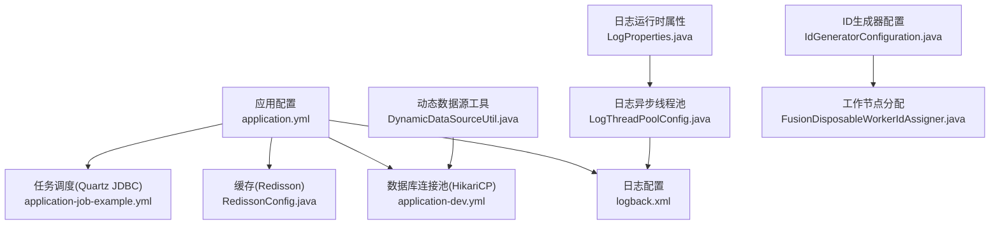
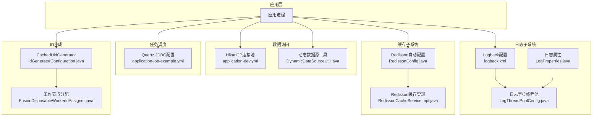
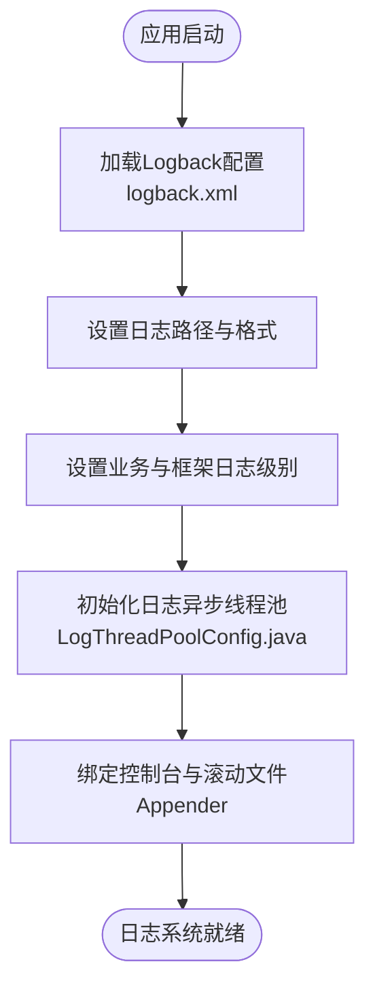
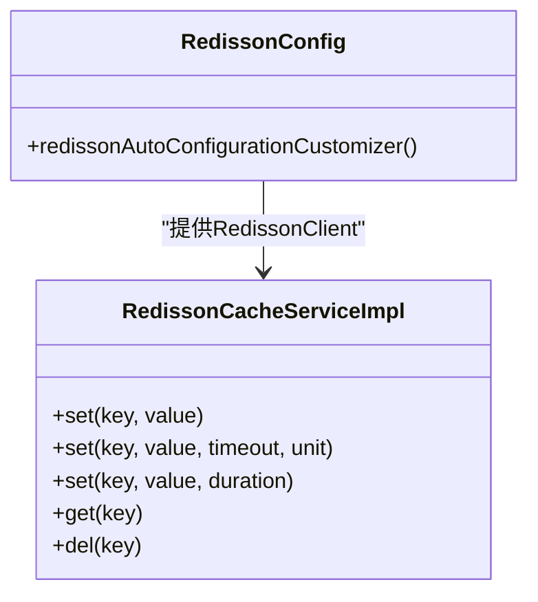
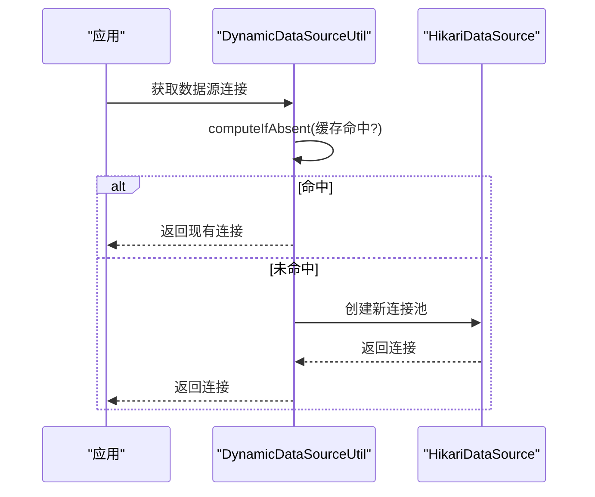
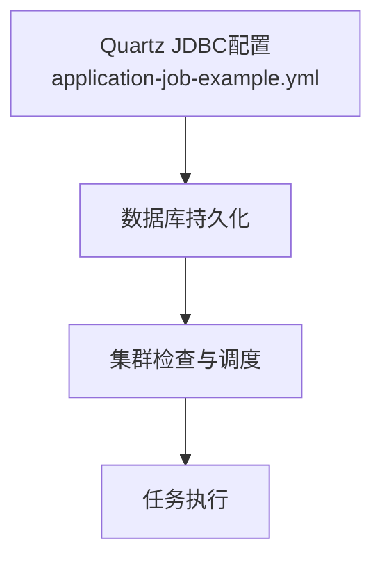
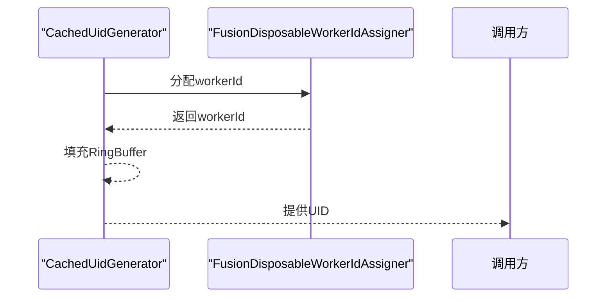
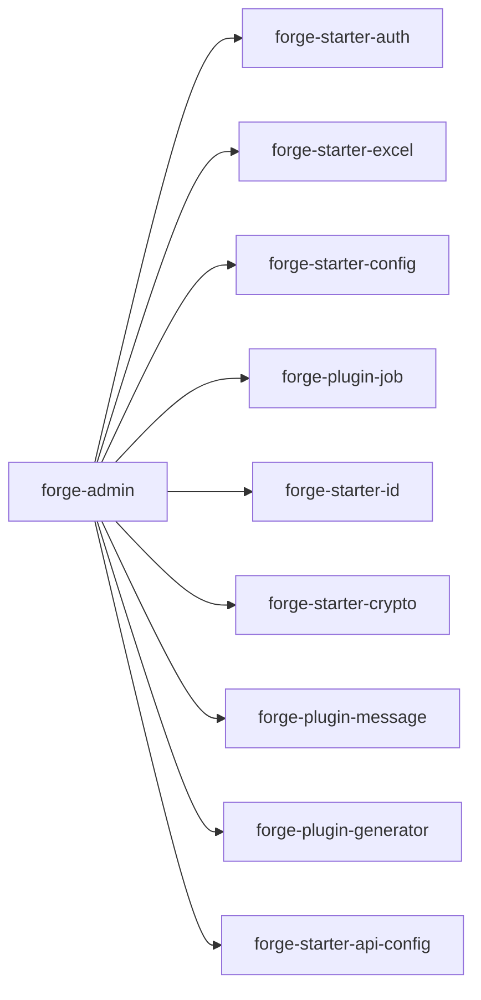

# 监控与运维

<cite>
**本文引用的文件**
- [forge-admin/pom.xml](file://forge/forge-admin/pom.xml)
- [application.yml](file://forge/forge-admin/src/main/resources/application.yml)
- [application-dev.yml](file://forge/forge-admin/src/main/resources/application-dev.yml)
- [logback.xml](file://forge/forge-admin/src/main/resources/logback.xml)
- [LogProperties.java](file://forge/forge-framework/forge-starter-parent/forge-starter-core/src/main/java/com/mdframe/forge/starter/core/context/LogProperties.java)
- [LogThreadPoolConfig.java](file://forge/forge-framework/forge-starter-parent/forge-starter-log/src/main/java/com/mdframe/forge/starter/log/config/LogThreadPoolConfig.java)
- [ConfigConverter.java](file://forge/forge-framework/forge-starter-parent/forge-starter-config/src/main/java/com/mdframe/forge/starter/config/converter/ConfigConverter.java)
- [RedissonConfig.java](file://forge/forge-framework/forge-starter-parent/forge-starter-cache/src/main/java/com/mdframe/forge/starter/cache/config/RedissonConfig.java)
- [RedissonCacheServiceImpl.java](file://forge/forge-framework/forge-starter-parent/forge-starter-cache/src/main/java/com/mdframe/forge/starter/cache/service/impl/RedissonCacheServiceImpl.java)
- [DynamicDataSourceUtil.java](file://forge/forge-framework/forge-plugin-parent/forge-plugin-generator/src/main/java/com/mdframe/forge/plugin/generator/util/DynamicDataSourceUtil.java)
- [application-job-example.yml](file://forge/forge-framework/forge-plugin-parent/forge-plugin-job/src/main/resources/application-job-example.yml)
- [IdGeneratorConfiguration.java](file://forge/forge-framework/forge-starter-parent/forge-starter-id/src/main/java/com/mdframe/forge/starter/id/config/IdGeneratorConfiguration.java)
- [FusionDisposableWorkerIdAssigner.java](file://forge/forge-framework/forge-starter-parent/forge-starter-id/src/main/java/com/mdframe/forge/starter/id/generator/FusionDisposableWorkerIdAssigner.java)
- [sys_notice.sql](file://forge/forge-framework/forge-plugin-parent/forge-plugin-system/src/main/resources/sql/sys_notice.sql)
</cite>

## 目录
1. [简介](#简介)
2. [项目结构](#项目结构)
3. [核心组件](#核心组件)
4. [架构总览](#架构总览)
5. [详细组件分析](#详细组件分析)
6. [依赖关系分析](#依赖关系分析)
7. [性能考量](#性能考量)
8. [故障排查指南](#故障排查指南)
9. [结论](#结论)
10. [附录](#附录)

## 简介
本指南面向Forge框架生产环境的监控与运维，围绕应用日志配置与轮转、系统监控指标采集、性能调优（JVM参数、数据库连接池、缓存命中率）、故障排查流程、备份与灾难恢复、安全审计以及监控告警与自动化运维脚本给出可落地的最佳实践与实施建议。文档以仓库中的实际配置与组件为依据，帮助读者快速建立稳定、可观测、可恢复的生产体系。

## 项目结构
Forge采用多模块结构，核心运行时位于forge-admin，配套能力通过forge-starter与forge-plugin扩展。生产环境的关键配置集中在application.yml与logback.xml，日志异步化通过独立线程池实现，缓存基于Redisson，数据库连接池采用HikariCP，任务调度使用Quartz并持久化至数据库。

图表来源
- [application.yml](file://forge/forge-admin/src/main/resources/application.yml#L1-L100)
- [application-dev.yml](file://forge/forge-admin/src/main/resources/application-dev.yml#L1-L33)
- [logback.xml](file://forge/forge-admin/src/main/resources/logback.xml#L1-L49)
- [LogThreadPoolConfig.java](file://forge/forge-framework/forge-starter-parent/forge-starter-log/src/main/java/com/mdframe/forge/starter/log/config/LogThreadPoolConfig.java#L1-L57)
- [LogProperties.java](file://forge/forge-framework/forge-starter-parent/forge-starter-core/src/main/java/com/mdframe/forge/starter/core/context/LogProperties.java#L1-L71)
- [RedissonConfig.java](file://forge/forge-framework/forge-starter-parent/forge-starter-cache/src/main/java/com/mdframe/forge/starter/cache/config/RedissonConfig.java#L1-L34)
- [DynamicDataSourceUtil.java](file://forge/forge-framework/forge-plugin-parent/forge-plugin-generator/src/main/java/com/mdframe/forge/plugin/generator/util/DynamicDataSourceUtil.java#L1-L113)
- [application-job-example.yml](file://forge/forge-framework/forge-plugin-parent/forge-plugin-job/src/main/resources/application-job-example.yml#L1-L34)
- [IdGeneratorConfiguration.java](file://forge/forge-framework/forge-starter-parent/forge-starter-id/src/main/java/com/mdframe/forge/starter/id/config/IdGeneratorConfiguration.java#L35-L54)
- [FusionDisposableWorkerIdAssigner.java](file://forge/forge-framework/forge-starter-parent/forge-starter-id/src/main/java/com/mdframe/forge/starter/id/generator/FusionDisposableWorkerIdAssigner.java#L46-L64)

章节来源
- [forge-admin/pom.xml](file://forge/forge-admin/pom.xml#L1-L111)
- [application.yml](file://forge/forge-admin/src/main/resources/application.yml#L1-L100)
- [application-dev.yml](file://forge/forge-admin/src/main/resources/application-dev.yml#L1-L33)
- [logback.xml](file://forge/forge-admin/src/main/resources/logback.xml#L1-L49)

## 核心组件
- 日志系统：基于Logback的滚动文件输出，结合异步线程池降低I/O阻塞；支持traceId串联链路，按日期滚动，保留历史天数可配置。
- 缓存系统：基于Redisson的自动配置，使用Jackson JSON编解码器，支持Java 8时间类型；提供统一缓存接口实现。
- 数据库连接池：HikariCP在主库与动态数据源场景下均有配置，支持连接池大小、空闲、超时、校验等参数。
- 任务调度：Quartz使用JDBC持久化，支持集群部署，线程池规模可配置。
- ID生成：基于Snowflake的UID生成器，支持缓冲与扩容，工作节点自动分配。

章节来源
- [logback.xml](file://forge/forge-admin/src/main/resources/logback.xml#L1-L49)
- [LogThreadPoolConfig.java](file://forge/forge-framework/forge-starter-parent/forge-starter-log/src/main/java/com/mdframe/forge/starter/log/config/LogThreadPoolConfig.java#L1-L57)
- [LogProperties.java](file://forge/forge-framework/forge-starter-parent/forge-starter-core/src/main/java/com/mdframe/forge/starter/core/context/LogProperties.java#L1-L71)
- [RedissonConfig.java](file://forge/forge-framework/forge-starter-parent/forge-starter-cache/src/main/java/com/mdframe/forge/starter/cache/config/RedissonConfig.java#L1-L34)
- [RedissonCacheServiceImpl.java](file://forge/forge-framework/forge-starter-parent/forge-starter-cache/src/main/java/com/mdframe/forge/starter/cache/service/impl/RedissonCacheServiceImpl.java#L1-L46)
- [application-dev.yml](file://forge/forge-admin/src/main/resources/application-dev.yml#L1-L33)
- [DynamicDataSourceUtil.java](file://forge/forge-framework/forge-plugin-parent/forge-plugin-generator/src/main/java/com/mdframe/forge/plugin/generator/util/DynamicDataSourceUtil.java#L1-L113)
- [application-job-example.yml](file://forge/forge-framework/forge-plugin-parent/forge-plugin-job/src/main/resources/application-job-example.yml#L1-L34)
- [IdGeneratorConfiguration.java](file://forge/forge-framework/forge-starter-parent/forge-starter-id/src/main/java/com/mdframe/forge/starter/id/config/IdGeneratorConfiguration.java#L35-L54)
- [FusionDisposableWorkerIdAssigner.java](file://forge/forge-framework/forge-starter-parent/forge-starter-id/src/main/java/com/mdframe/forge/starter/id/generator/FusionDisposableWorkerIdAssigner.java#L46-L64)

## 架构总览
下图展示生产环境关键组件交互：应用通过Logback写入日志，异步线程池保障吞吐；缓存通过Redisson访问；数据库连接池由HikariCP提供；任务调度持久化至数据库；ID生成器提供全局唯一ID。

图表来源
- [logback.xml](file://forge/forge-admin/src/main/resources/logback.xml#L1-L49)
- [LogThreadPoolConfig.java](file://forge/forge-framework/forge-starter-parent/forge-starter-log/src/main/java/com/mdframe/forge/starter/log/config/LogThreadPoolConfig.java#L1-L57)
- [LogProperties.java](file://forge/forge-framework/forge-starter-parent/forge-starter-core/src/main/java/com/mdframe/forge/starter/core/context/LogProperties.java#L1-L71)
- [RedissonConfig.java](file://forge/forge-framework/forge-starter-parent/forge-starter-cache/src/main/java/com/mdframe/forge/starter/cache/config/RedissonConfig.java#L1-L34)
- [RedissonCacheServiceImpl.java](file://forge/forge-framework/forge-starter-parent/forge-starter-cache/src/main/java/com/mdframe/forge/starter/cache/service/impl/RedissonCacheServiceImpl.java#L1-L46)
- [application-dev.yml](file://forge/forge-admin/src/main/resources/application-dev.yml#L1-L33)
- [DynamicDataSourceUtil.java](file://forge/forge-framework/forge-plugin-parent/forge-plugin-generator/src/main/java/com/mdframe/forge/plugin/generator/util/DynamicDataSourceUtil.java#L1-L113)
- [application-job-example.yml](file://forge/forge-framework/forge-plugin-parent/forge-plugin-job/src/main/resources/application-job-example.yml#L1-L34)
- [IdGeneratorConfiguration.java](file://forge/forge-framework/forge-starter-parent/forge-starter-id/src/main/java/com/mdframe/forge/starter/id/config/IdGeneratorConfiguration.java#L35-L54)
- [FusionDisposableWorkerIdAssigner.java](file://forge/forge-framework/forge-starter-parent/forge-starter-id/src/main/java/com/mdframe/forge/starter/id/generator/FusionDisposableWorkerIdAssigner.java#L46-L64)

## 详细组件分析

### 日志配置与轮转策略
- 日志路径与输出格式：通过Logback配置文件设置日志目录与输出格式，包含traceId以便链路追踪。
- 滚动策略：基于时间的滚动策略，按日生成文件，保留历史天数可配置。
- 日志级别：针对业务包与Spring框架分别设置级别，便于生产环境聚焦关键信息。
- 异步落盘：通过独立线程池异步写日志，避免阻塞业务线程；线程池参数可通过配置中心下发调整。
- 控制台与文件双通道：同时输出到控制台与滚动文件，便于开发与生产环境差异化观察。

图表来源
- [logback.xml](file://forge/forge-admin/src/main/resources/logback.xml#L1-L49)
- [LogThreadPoolConfig.java](file://forge/forge-framework/forge-starter-parent/forge-starter-log/src/main/java/com/mdframe/forge/starter/log/config/LogThreadPoolConfig.java#L1-L57)

章节来源
- [logback.xml](file://forge/forge-admin/src/main/resources/logback.xml#L1-L49)
- [LogProperties.java](file://forge/forge-framework/forge-starter-parent/forge-starter-core/src/main/java/com/mdframe/forge/starter/core/context/LogProperties.java#L1-L71)
- [LogThreadPoolConfig.java](file://forge/forge-framework/forge-starter-parent/forge-starter-log/src/main/java/com/mdframe/forge/starter/log/config/LogThreadPoolConfig.java#L1-L57)
- [ConfigConverter.java](file://forge/forge-framework/forge-starter-parent/forge-starter-config/src/main/java/com/mdframe/forge/starter/config/converter/ConfigConverter.java#L137-L155)

### 缓存与命中率优化
- Redisson自动配置：使用Jackson JSON编解码器，支持Java 8时间类型，确保序列化一致性。
- 统一缓存接口：提供set/get/ttl等常用操作，便于业务侧统一接入。
- 命中率优化建议：
  - 合理设置TTL与预热策略，避免热点Key集中过期。
  - 利用分布式锁与限流保护缓存穿透与击穿。
  - 结合监控指标（命中率、延迟、内存占用）持续调参。

图表来源
- [RedissonConfig.java](file://forge/forge-framework/forge-starter-parent/forge-starter-cache/src/main/java/com/mdframe/forge/starter/cache/config/RedissonConfig.java#L1-L34)
- [RedissonCacheServiceImpl.java](file://forge/forge-framework/forge-starter-parent/forge-starter-cache/src/main/java/com/mdframe/forge/starter/cache/service/impl/RedissonCacheServiceImpl.java#L1-L46)

章节来源
- [RedissonConfig.java](file://forge/forge-framework/forge-starter-parent/forge-starter-cache/src/main/java/com/mdframe/forge/starter/cache/config/RedissonConfig.java#L1-L34)
- [RedissonCacheServiceImpl.java](file://forge/forge-framework/forge-starter-parent/forge-starter-cache/src/main/java/com/mdframe/forge/starter/cache/service/impl/RedissonCacheServiceImpl.java#L1-L46)

### 数据库连接池与动态数据源
- HikariCP参数：最大连接数、最小空闲、连接超时、校验超时、空闲与生命周期等参数在主库配置中明确。
- 动态数据源：按租户/业务维度创建独立连接池，支持连接测试、移除与清空，避免资源泄漏。
- 生产建议：
  - 根据QPS与事务复杂度调整最大连接数与空闲数。
  - 定期巡检连接池状态与慢SQL，结合数据库端参数优化。

图表来源
- [DynamicDataSourceUtil.java](file://forge/forge-framework/forge-plugin-parent/forge-plugin-generator/src/main/java/com/mdframe/forge/plugin/generator/util/DynamicDataSourceUtil.java#L1-L113)
- [application-dev.yml](file://forge/forge-admin/src/main/resources/application-dev.yml#L1-L33)

章节来源
- [application-dev.yml](file://forge/forge-admin/src/main/resources/application-dev.yml#L1-L33)
- [DynamicDataSourceUtil.java](file://forge/forge-framework/forge-plugin-parent/forge-plugin-generator/src/main/java/com/mdframe/forge/plugin/generator/util/DynamicDataSourceUtil.java#L1-L113)

### 任务调度与持久化
- Quartz JDBC持久化：任务与触发器持久化至数据库，支持集群部署与高可用。
- 线程池规模：根据任务并发与执行时长配置线程数量与优先级。
- 建议：
  - 任务拆分与幂等设计，避免长时间阻塞。
  - 监控任务执行时延与失败重试策略。

图表来源
- [application-job-example.yml](file://forge/forge-framework/forge-plugin-parent/forge-plugin-job/src/main/resources/application-job-example.yml#L1-L34)

章节来源
- [application-job-example.yml](file://forge/forge-framework/forge-plugin-parent/forge-plugin-job/src/main/resources/application-job-example.yml#L1-L34)

### ID生成器与工作节点
- CachedUidGenerator：支持缓冲区扩容与周期填充，减少数据库压力。
- 工作节点分配：容器与物理机自动识别，保证workerId唯一性。

图表来源
- [IdGeneratorConfiguration.java](file://forge/forge-framework/forge-starter-parent/forge-starter-id/src/main/java/com/mdframe/forge/starter/id/config/IdGeneratorConfiguration.java#L35-L54)
- [FusionDisposableWorkerIdAssigner.java](file://forge/forge-framework/forge-starter-parent/forge-starter-id/src/main/java/com/mdframe/forge/starter/id/generator/FusionDisposableWorkerIdAssigner.java#L46-L64)

章节来源
- [IdGeneratorConfiguration.java](file://forge/forge-framework/forge-starter-parent/forge-starter-id/src/main/java/com/mdframe/forge/starter/id/config/IdGeneratorConfiguration.java#L35-L54)
- [FusionDisposableWorkerIdAssigner.java](file://forge/forge-framework/forge-starter-parent/forge-starter-id/src/main/java/com/mdframe/forge/starter/id/generator/FusionDisposableWorkerIdAssigner.java#L46-L64)

## 依赖关系分析
- forge-admin聚合了鉴权、Excel、配置中心、作业、ID、加解密、消息、代码生成、API配置等模块，形成完整的后台管理能力。
- 运维相关依赖集中在日志、缓存、数据库连接池与任务调度模块，这些模块通过配置文件与自动配置类参与生产运行。

图表来源
- [forge-admin/pom.xml](file://forge/forge-admin/pom.xml#L1-L111)

章节来源
- [forge-admin/pom.xml](file://forge/forge-admin/pom.xml#L1-L111)

## 性能考量
- JVM参数优化（建议方向）
  - 堆大小与GC策略：结合业务峰值QPS与对象分配速率，选择合适GC算法与堆上限，降低Full GC频率。
  - JIT与类元数据：开启必要的JIT优化与类元数据容量，避免频繁类加载导致的停顿。
  - 线程与IO：合理设置线程栈大小与IO线程数，避免上下文切换开销过大。
- 数据库连接池
  - 连接池大小：根据并发连接需求与数据库承载能力设定最大连接数与空闲数。
  - 超时与校验：缩短连接超时与校验超时，提高异常连接剔除效率。
  - 批处理：对批量写入场景启用批处理优化，减少往返次数。
- 缓存命中率
  - TTL与预热：热点数据提前预热，合理设置TTL，避免集中过期。
  - 缓存穿透防护：使用布隆过滤器或短TTL兜底。
  - 冷热分离：区分热数据与冷数据，采用不同缓存介质与淘汰策略。

## 故障排查指南
- 日志定位
  - 检查日志路径与滚动策略是否正确，确认traceId是否注入。
  - 关注异步线程池队列积压与拒绝策略触发情况。
- 数据库问题
  - 连接池状态：观察活跃连接数、等待时间、超时次数。
  - 动态数据源：核对目标数据源是否存在、连接测试是否通过。
- 缓存异常
  - Redis连接与序列化：确认Redis可用性与编解码器兼容性。
  - 缓存键空间：排查Key过期与内存压力。
- 任务调度
  - 数据库持久化：确认任务表存在且集群配置正确。
  - 执行异常：查看任务执行日志与重试策略。
- ID生成
  - workerId冲突：检查工作节点分配逻辑与容器环境识别。

章节来源
- [logback.xml](file://forge/forge-admin/src/main/resources/logback.xml#L1-L49)
- [LogThreadPoolConfig.java](file://forge/forge-framework/forge-starter-parent/forge-starter-log/src/main/java/com/mdframe/forge/starter/log/config/LogThreadPoolConfig.java#L1-L57)
- [DynamicDataSourceUtil.java](file://forge/forge-framework/forge-plugin-parent/forge-plugin-generator/src/main/java/com/mdframe/forge/plugin/generator/util/DynamicDataSourceUtil.java#L1-L113)
- [application-job-example.yml](file://forge/forge-framework/forge-plugin-parent/forge-plugin-job/src/main/resources/application-job-example.yml#L1-L34)
- [RedissonConfig.java](file://forge/forge-framework/forge-starter-parent/forge-starter-cache/src/main/java/com/mdframe/forge/starter/cache/config/RedissonConfig.java#L1-L34)

## 结论
通过规范的日志配置与异步化、稳健的数据库连接池与动态数据源、可靠的缓存与ID生成、以及任务调度的持久化与集群化，Forge框架可在生产环境中实现高可用与可观测。配合完善的监控告警与自动化运维脚本，可进一步提升稳定性与交付效率。

## 附录
- 备份策略
  - 数据库：全量+增量备份，定期校验恢复演练。
  - 配置与日志：配置文件纳入版本管理，日志归档保留合规周期。
- 灾难恢复
  - 多活部署：数据库与应用多机房部署，任务调度集群化。
  - 快速回切：自动化脚本与健康检查结合，缩短RTO/RPO。
- 安全审计
  - 登录与操作日志：通过配置中心开关与参数控制，避免敏感信息泄露。
  - 权限与加密：鉴权模块与加解密模块协同，确保传输与存储安全。
- 监控告警
  - 指标采集：CPU、内存、磁盘、网络、连接池、缓存命中率、任务执行时延。
  - 告警阈值：基于历史基线与业务峰谷设定阈值，避免误报与漏报。
- 自动化运维脚本示例（建议）
  - 部署：打包、停止、替换、启动、健康检查。
  - 备份：定时任务执行数据库与日志归档。
  - 诊断：一键收集日志、堆栈、连接池状态、任务执行详情。