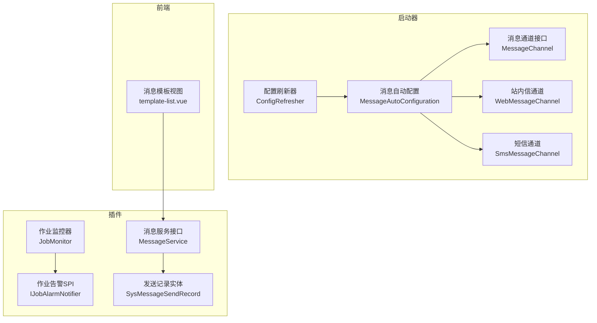
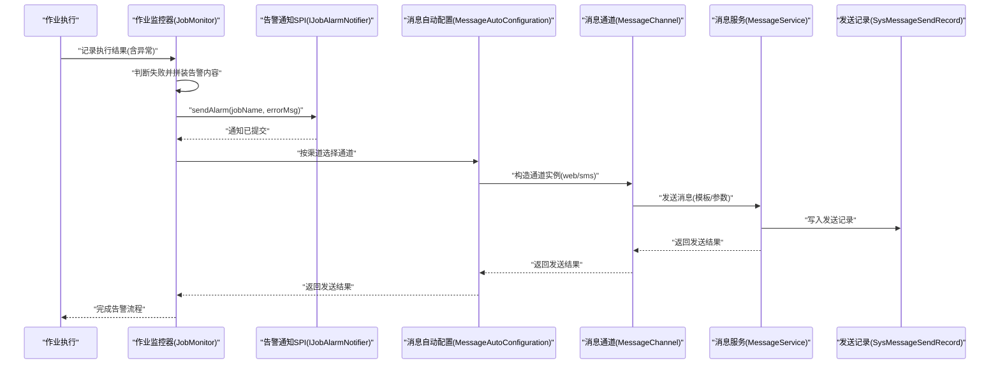
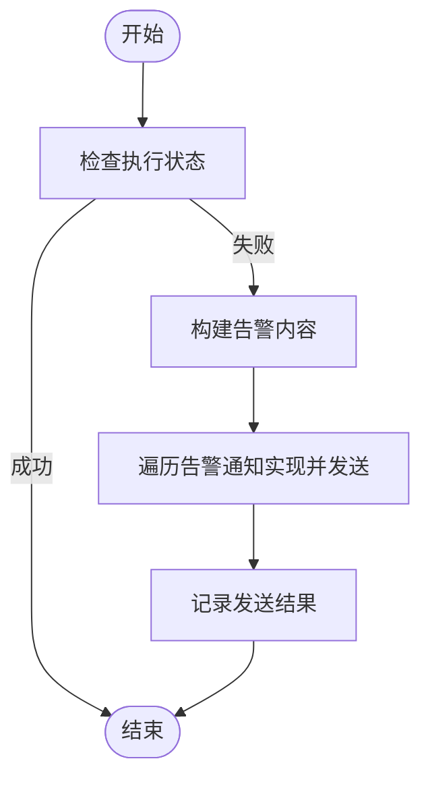
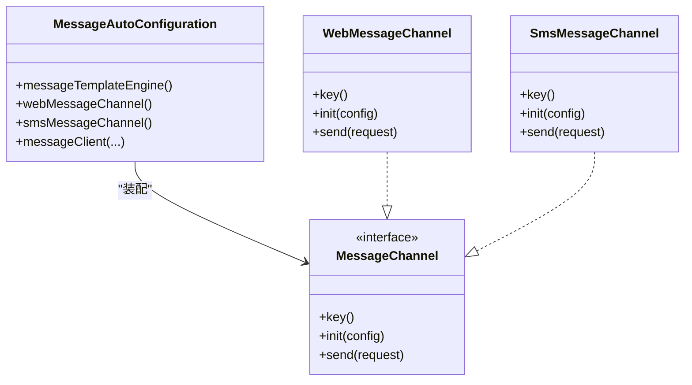
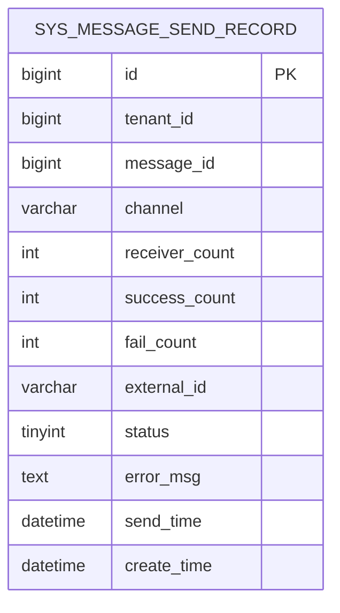
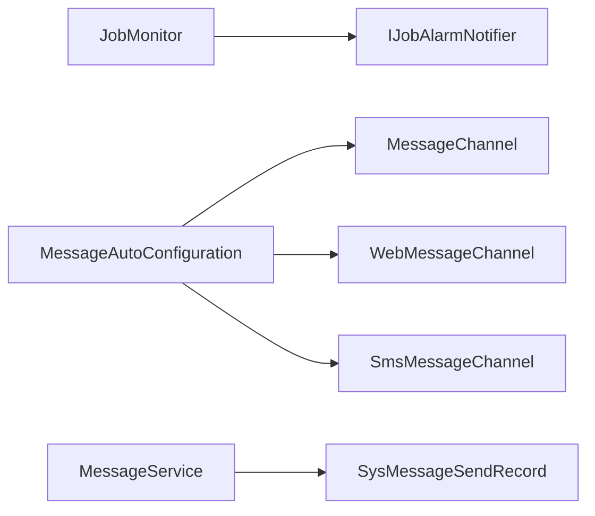

# 告警配置

<cite>
**本文引用的文件**
- [forge-starter-message/MessageAutoConfiguration.java](file://forge/forge-framework/forge-starter-parent/forge-starter-message/src/main/java/com/mdframe/forge/starter/message/config/MessageAutoConfiguration.java)
- [forge-starter-message/MessageChannel.java](file://forge/forge-framework/forge-starter-parent/forge-starter-message/src/main/java/com/mdframe/forge/starter/message/channel/MessageChannel.java)
- [forge-starter-message/WebMessageChannel.java](file://forge/forge-framework/forge-starter-parent/forge-starter-message/src/main/java/com/mdframe/forge/starter/message/channel/WebMessageChannel.java)
- [forge-starter-message/SmsMessageChannel.java](file://forge/forge-framework/forge-starter-parent/forge-starter-message/src/main/java/com/mdframe/forge/starter/message/channel/SmsMessageChannel.java)
- [forge-plugin-message/MessageService.java](file://forge/forge-framework/forge-plugin-parent/forge-plugin-message/src/main/java/com/mdframe/forge/plugin/message/service/MessageService.java)
- [forge-plugin-message/SysMessageSendRecord.java](file://forge/forge-framework/forge-plugin-parent/forge-plugin-message/src/main/java/com/mdframe/forge/plugin/message/domain/entity/SysMessageSendRecord.java)
- [forge-plugin-message/message_tables.sql](file://forge/forge-framework/forge-plugin-parent/forge-plugin-message/src/main/resources/sql/message_tables.sql)
- [forge-plugin-job/IJobAlarmNotifier.java](file://forge/forge-framework/forge-plugin-parent/forge-plugin-job/src/main/java/com/mdframe/forge/plugin/job/spi/IJobAlarmNotifier.java)
- [forge-plugin-job/JobMonitor.java](file://forge/forge-framework/forge-plugin-parent/forge-plugin-job/src/main/java/com/mdframe/forge/plugin/job/monitor/JobMonitor.java)
- [forge-admin-ui/template-list.vue](file://forge-admin-ui/src/views/message/template-list.vue)
- [forge-starter-config/ConfigRefresher.java](file://forge/forge-framework/forge-starter-parent/forge-starter-config/src/main/java/com/mdframe/forge/starter/property/refresh/ConfigRefresher.java)
- [forge-starter-config/AppConfigExample.java](file://forge/forge-framework/forge-starter-parent/forge-starter-config/src/main/java/com/mdframe/forge/starter/property/example/AppConfigExample.java)
</cite>

## 目录
1. [简介](#简介)
2. [项目结构](#项目结构)
3. [核心组件](#核心组件)
4. [架构总览](#架构总览)
5. [详细组件分析](#详细组件分析)
6. [依赖关系分析](#依赖关系分析)
7. [性能考量](#性能考量)
8. [故障排查指南](#故障排查指南)
9. [结论](#结论)
10. [附录](#附录)

## 简介
本指南面向Forge平台的告警配置与管理，目标是建立完善的告警机制与通知体系，覆盖系统资源、应用性能与业务逻辑三类告警，并提供邮件、短信、站内信、推送等通知渠道的配置方法；同时给出告警分级、去重、抑制、升级等高级特性的落地建议，并说明如何通过监控仪表板查看实时告警与历史记录。

## 项目结构
Forge采用“启动器+插件”的分层架构：
- 启动器模块提供通用能力（如消息通道、配置刷新）。
- 插件模块提供业务能力（如消息插件、作业监控与告警）。
- 前端管理界面用于配置消息模板与查看消息发送记录。

**图表来源**
- [forge-starter-message/MessageAutoConfiguration.java](file://forge/forge-framework/forge-starter-parent/forge-starter-message/src/main/java/com/mdframe/forge/starter/message/config/MessageAutoConfiguration.java#L1-L47)
- [forge-starter-message/MessageChannel.java](file://forge/forge-framework/forge-starter-parent/forge-starter-message/src/main/java/com/mdframe/forge/starter/message/channel/MessageChannel.java#L1-L40)
- [forge-starter-message/WebMessageChannel.java](file://forge/forge-framework/forge-starter-parent/forge-starter-message/src/main/java/com/mdframe/forge/starter/message/channel/WebMessageChannel.java#L1-L16)
- [forge-starter-message/SmsMessageChannel.java](file://forge/forge-framework/forge-starter-parent/forge-starter-message/src/main/java/com/mdframe/forge/starter/message/channel/SmsMessageChannel.java#L1-L15)
- [forge-plugin-message/MessageService.java](file://forge/forge-framework/forge-plugin-parent/forge-plugin-message/src/main/java/com/mdframe/forge/plugin/message/service/MessageService.java#L1-L51)
- [forge-plugin-message/SysMessageSendRecord.java](file://forge/forge-framework/forge-plugin-parent/forge-plugin-message/src/main/java/com/mdframe/forge/plugin/message/domain/entity/SysMessageSendRecord.java#L1-L83)
- [forge-plugin-job/JobMonitor.java](file://forge/forge-framework/forge-plugin-parent/forge-plugin-job/src/main/java/com/mdframe/forge/plugin/job/monitor/JobMonitor.java#L1-L106)
- [forge-plugin-job/IJobAlarmNotifier.java](file://forge/forge-framework/forge-plugin-parent/forge-plugin-job/src/main/java/com/mdframe/forge/plugin/job/spi/IJobAlarmNotifier.java#L1-L16)
- [forge-admin-ui/template-list.vue](file://forge-admin-ui/src/views/message/template-list.vue#L57-L84)
- [forge-starter-config/ConfigRefresher.java](file://forge/forge-framework/forge-starter-parent/forge-starter-config/src/main/java/com/mdframe/forge/starter/property/refresh/ConfigRefresher.java#L51-L156)

**章节来源**
- [forge-starter-message/MessageAutoConfiguration.java](file://forge/forge-framework/forge-starter-parent/forge-starter-message/src/main/java/com/mdframe/forge/starter/message/config/MessageAutoConfiguration.java#L1-L47)
- [forge-plugin-job/JobMonitor.java](file://forge/forge-framework/forge-plugin-parent/forge-plugin-job/src/main/java/com/mdframe/forge/plugin/job/monitor/JobMonitor.java#L1-L106)

## 核心组件
- 告警通知SPI：定义统一的告警发送接口，便于扩展至钉钉、企业微信、邮件等渠道。
- 作业监控器：在任务执行失败时触发告警通知，并持久化执行日志。
- 消息通道：抽象消息发送渠道（站内信、短信、邮件、推送），启动器提供自动装配与条件启用。
- 消息服务与发送记录：提供消息发送、模板管理、发送记录查询等能力。
- 配置刷新：支持数据库配置的动态刷新，保障告警策略与通知参数的实时生效。

**章节来源**
- [forge-plugin-job/IJobAlarmNotifier.java](file://forge/forge-framework/forge-plugin-parent/forge-plugin-job/src/main/java/com/mdframe/forge/plugin/job/spi/IJobAlarmNotifier.java#L1-L16)
- [forge-plugin-job/JobMonitor.java](file://forge/forge-framework/forge-plugin-parent/forge-plugin-job/src/main/java/com/mdframe/forge/plugin/job/monitor/JobMonitor.java#L1-L106)
- [forge-starter-message/MessageChannel.java](file://forge/forge-framework/forge-starter-parent/forge-starter-message/src/main/java/com/mdframe/forge/starter/message/channel/MessageChannel.java#L1-L40)
- [forge-starter-message/MessageAutoConfiguration.java](file://forge/forge-framework/forge-starter-parent/forge-starter-message/src/main/java/com/mdframe/forge/starter/message/config/MessageAutoConfiguration.java#L1-L47)
- [forge-plugin-message/MessageService.java](file://forge/forge-framework/forge-plugin-parent/forge-plugin-message/src/main/java/com/mdframe/forge/plugin/message/service/MessageService.java#L1-L51)
- [forge-plugin-message/SysMessageSendRecord.java](file://forge/forge-framework/forge-plugin-parent/forge-plugin-message/src/main/java/com/mdframe/forge/plugin/message/domain/entity/SysMessageSendRecord.java#L1-L83)
- [forge-starter-config/ConfigRefresher.java](file://forge/forge-framework/forge-starter-parent/forge-starter-config/src/main/java/com/mdframe/forge/starter/property/refresh/ConfigRefresher.java#L51-L156)

## 架构总览
下图展示了从任务执行失败到告警通知与消息发送的整体流程，以及配置刷新对通知参数的影响。

**图表来源**
- [forge-plugin-job/JobMonitor.java](file://forge/forge-framework/forge-plugin-parent/forge-plugin-job/src/main/java/com/mdframe/forge/plugin/job/monitor/JobMonitor.java#L35-L75)
- [forge-plugin-job/IJobAlarmNotifier.java](file://forge/forge-framework/forge-plugin-parent/forge-plugin-job/src/main/java/com/mdframe/forge/plugin/job/spi/IJobAlarmNotifier.java#L7-L15)
- [forge-starter-message/MessageAutoConfiguration.java](file://forge/forge-framework/forge-starter-parent/forge-starter-message/src/main/java/com/mdframe/forge/starter/message/config/MessageAutoConfiguration.java#L21-L45)
- [forge-starter-message/MessageChannel.java](file://forge/forge-framework/forge-starter-parent/forge-starter-message/src/main/java/com/mdframe/forge/starter/message/channel/MessageChannel.java#L5-L40)
- [forge-plugin-message/MessageService.java](file://forge/forge-framework/forge-plugin-parent/forge-plugin-message/src/main/java/com/mdframe/forge/plugin/message/service/MessageService.java#L14-L50)
- [forge-plugin-message/SysMessageSendRecord.java](file://forge/forge-framework/forge-plugin-parent/forge-plugin-message/src/main/java/com/mdframe/forge/plugin/message/domain/entity/SysMessageSendRecord.java#L14-L82)

## 详细组件分析

### 作业监控与告警通知
- 触发条件：当任务执行状态为失败时，监控器会拼装告警内容并通过所有可用的告警通知实现进行发送。
- 异常处理：异常堆栈会被截断并写入日志，避免超长文本影响存储与传输。
- 通知渠道：通过SPI接口统一对外发送，具体实现可扩展多种渠道。

**图表来源**
- [forge-plugin-job/JobMonitor.java](file://forge/forge-framework/forge-plugin-parent/forge-plugin-job/src/main/java/com/mdframe/forge/plugin/job/monitor/JobMonitor.java#L35-L75)

**章节来源**
- [forge-plugin-job/JobMonitor.java](file://forge/forge-framework/forge-plugin-parent/forge-plugin-job/src/main/java/com/mdframe/forge/plugin/job/monitor/JobMonitor.java#L1-L106)
- [forge-plugin-job/IJobAlarmNotifier.java](file://forge/forge-framework/forge-plugin-parent/forge-plugin-job/src/main/java/com/mdframe/forge/plugin/job/spi/IJobAlarmNotifier.java#L1-L16)

### 消息通道与自动配置
- 自动装配：根据配置属性条件启用不同渠道（如web/sms），未显式配置时默认启用web通道。
- 接口契约：消息通道需实现key、init、send三个方法，便于统一调度与扩展。
- 占位实现：短信通道当前为占位实现，实际对接第三方网关需在init与send中补充。

**图表来源**
- [forge-starter-message/MessageAutoConfiguration.java](file://forge/forge-framework/forge-starter-parent/forge-starter-message/src/main/java/com/mdframe/forge/starter/message/config/MessageAutoConfiguration.java#L17-L46)
- [forge-starter-message/MessageChannel.java](file://forge/forge-framework/forge-starter-parent/forge-starter-message/src/main/java/com/mdframe/forge/starter/message/channel/MessageChannel.java#L5-L40)
- [forge-starter-message/WebMessageChannel.java](file://forge/forge-framework/forge-starter-parent/forge-starter-message/src/main/java/com/mdframe/forge/starter/message/channel/WebMessageChannel.java#L5-L15)
- [forge-starter-message/SmsMessageChannel.java](file://forge/forge-framework/forge-starter-parent/forge-starter-message/src/main/java/com/mdframe/forge/starter/message/channel/SmsMessageChannel.java#L5-L15)

**章节来源**
- [forge-starter-message/MessageAutoConfiguration.java](file://forge/forge-framework/forge-starter-parent/forge-starter-message/src/main/java/com/mdframe/forge/starter/message/config/MessageAutoConfiguration.java#L1-L47)
- [forge-starter-message/MessageChannel.java](file://forge/forge-framework/forge-starter-parent/forge-starter-message/src/main/java/com/mdframe/forge/starter/message/channel/MessageChannel.java#L1-L40)
- [forge-starter-message/WebMessageChannel.java](file://forge/forge-framework/forge-starter-parent/forge-starter-message/src/main/java/com/mdframe/forge/starter/message/channel/WebMessageChannel.java#L1-L16)
- [forge-starter-message/SmsMessageChannel.java](file://forge/forge-framework/forge-starter-parent/forge-starter-message/src/main/java/com/mdframe/forge/starter/message/channel/SmsMessageChannel.java#L1-L15)

### 消息服务与发送记录
- 消息服务：提供发送消息、标记已读、分页查询、未读统计、详情查询等能力。
- 发送记录：记录每次消息发送的渠道、接收人数、成功/失败数、外部ID、状态与错误信息等，便于审计与追踪。

**图表来源**
- [forge-plugin-message/SysMessageSendRecord.java](file://forge/forge-framework/forge-plugin-parent/forge-plugin-message/src/main/java/com/mdframe/forge/plugin/message/domain/entity/SysMessageSendRecord.java#L14-L82)
- [forge-plugin-message/message_tables.sql](file://forge/forge-framework/forge-plugin-parent/forge-plugin-message/src/main/resources/sql/message_tables.sql#L43-L60)

**章节来源**
- [forge-plugin-message/MessageService.java](file://forge/forge-framework/forge-plugin-parent/forge-plugin-message/src/main/java/com/mdframe/forge/plugin/message/service/MessageService.java#L1-L51)
- [forge-plugin-message/SysMessageSendRecord.java](file://forge/forge-framework/forge-plugin-parent/forge-plugin-message/src/main/java/com/mdframe/forge/plugin/message/domain/entity/SysMessageSendRecord.java#L1-L83)
- [forge-plugin-message/message_tables.sql](file://forge/forge-framework/forge-plugin-parent/forge-plugin-message/src/main/resources/sql/message_tables.sql#L43-L60)

### 前端模板与渠道展示
- 前端模板列表页面展示了消息发送渠道选项（站内信、短信、邮件、推送），便于在管理界面中选择与配置。

**章节来源**
- [forge-admin-ui/template-list.vue](file://forge-admin-ui/src/views/message/template-list.vue#L57-L84)

### 配置刷新与动态生效
- 配置刷新器：周期性从数据库加载配置，比较新旧配置差异，更新PropertySource并刷新@RefreshScope作用域内的Bean。
- 示例配置类：演示如何标注@RefreshScope并绑定配置前缀，使数据库中的配置变更在30秒内自动生效（或手动触发刷新）。

**章节来源**
- [forge-starter-config/ConfigRefresher.java](file://forge/forge-framework/forge-starter-parent/forge-starter-config/src/main/java/com/mdframe/forge/starter/property/refresh/ConfigRefresher.java#L51-L156)
- [forge-starter-config/AppConfigExample.java](file://forge/forge-framework/forge-starter-parent/forge-starter-config/src/main/java/com/mdframe/forge/starter/property/example/AppConfigExample.java#L1-L39)

## 依赖关系分析
- 组件耦合：作业监控器依赖告警通知SPI与日志存储SPI；消息自动配置依赖消息通道实现与模板引擎；消息服务依赖发送记录实体与通道集合。
- 条件装配：消息通道通过配置属性条件启用，避免未配置时的空指针风险。
- 可扩展性：通过SPI与接口抽象，新增通知渠道（如邮件、钉钉机器人）只需实现对应接口并在容器中注册。

**图表来源**
- [forge-plugin-job/JobMonitor.java](file://forge/forge-framework/forge-plugin-parent/forge-plugin-job/src/main/java/com/mdframe/forge/plugin/job/monitor/JobMonitor.java#L24-L30)
- [forge-plugin-job/IJobAlarmNotifier.java](file://forge/forge-framework/forge-plugin-parent/forge-plugin-job/src/main/java/com/mdframe/forge/plugin/job/spi/IJobAlarmNotifier.java#L7-L15)
- [forge-starter-message/MessageAutoConfiguration.java](file://forge/forge-framework/forge-starter-parent/forge-starter-message/src/main/java/com/mdframe/forge/starter/message/config/MessageAutoConfiguration.java#L21-L45)
- [forge-starter-message/MessageChannel.java](file://forge/forge-framework/forge-starter-parent/forge-starter-message/src/main/java/com/mdframe/forge/starter/message/channel/MessageChannel.java#L5-L40)
- [forge-plugin-message/MessageService.java](file://forge/forge-framework/forge-plugin-parent/forge-plugin-message/src/main/java/com/mdframe/forge/plugin/message/service/MessageService.java#L14-L50)
- [forge-plugin-message/SysMessageSendRecord.java](file://forge/forge-framework/forge-plugin-parent/forge-plugin-message/src/main/java/com/mdframe/forge/plugin/message/domain/entity/SysMessageSendRecord.java#L14-L82)

**章节来源**
- [forge-plugin-job/JobMonitor.java](file://forge/forge-framework/forge-plugin-parent/forge-plugin-job/src/main/java/com/mdframe/forge/plugin/job/monitor/JobMonitor.java#L1-L106)
- [forge-starter-message/MessageAutoConfiguration.java](file://forge/forge-framework/forge-starter-parent/forge-starter-message/src/main/java/com/mdframe/forge/starter/message/config/MessageAutoConfiguration.java#L1-L47)
- [forge-plugin-message/MessageService.java](file://forge/forge-framework/forge-plugin-parent/forge-plugin-message/src/main/java/com/mdframe/forge/plugin/message/service/MessageService.java#L1-L51)

## 性能考量
- 告警异步化：建议将告警通知与业务执行解耦，避免阻塞任务执行路径。
- 去重与抑制：在告警产生侧增加去重键（如指标+维度组合），在通知侧设置抑制窗口，防止风暴传播。
- 存储优化：对日志与发送记录进行分区与归档，限制单表大小，定期清理过期数据。
- 配置刷新频率：默认30秒检查一次，可根据环境调整；在高并发场景下避免频繁刷新带来的抖动。

## 故障排查指南
- 告警未发送
  - 检查告警通知实现是否正确注册为Spring Bean，且未被过滤。
  - 确认作业状态码与失败判定逻辑一致。
- 通知渠道不可用
  - 检查消息通道的启用配置（如web.enabled、sms.enabled）。
  - 确认短信通道的初始化参数与第三方网关对接情况。
- 发送记录异常
  - 查看发送记录表的状态字段与错误信息字段，定位失败原因。
  - 核对模板与参数是否匹配，确认模板引擎渲染是否正常。
- 配置未生效
  - 确认@RefreshScope注解与配置前缀绑定是否正确。
  - 检查配置刷新器是否正常运行，必要时手动触发刷新。

**章节来源**
- [forge-plugin-job/JobMonitor.java](file://forge/forge-framework/forge-plugin-parent/forge-plugin-job/src/main/java/com/mdframe/forge/plugin/job/monitor/JobMonitor.java#L55-L75)
- [forge-starter-message/MessageAutoConfiguration.java](file://forge/forge-framework/forge-starter-parent/forge-starter-message/src/main/java/com/mdframe/forge/starter/message/config/MessageAutoConfiguration.java#L27-L37)
- [forge-plugin-message/SysMessageSendRecord.java](file://forge/forge-framework/forge-plugin-parent/forge-plugin-message/src/main/java/com/mdframe/forge/plugin/message/domain/entity/SysMessageSendRecord.java#L62-L71)
- [forge-starter-config/ConfigRefresher.java](file://forge/forge-framework/forge-starter-parent/forge-starter-config/src/main/java/com/mdframe/forge/starter/property/refresh/ConfigRefresher.java#L51-L85)

## 结论
Forge提供了以SPI为核心的告警通知框架与以消息通道抽象为基础的通知体系，结合作业监控器与消息服务，能够快速搭建覆盖系统、应用与业务的多维告警机制。通过配置刷新能力，告警策略与通知参数可动态生效；配合去重、抑制与升级等高级特性，可进一步提升告警质量与运维效率。

## 附录

### 告警规则配置建议
- 系统资源告警
  - CPU：使用阈值与趋势双因子，结合去重键（主机名+指标）。
  - 内存：关注使用率与交换比例，设置短期峰值与长期平均两种规则。
  - 磁盘：容量与inode双阈值，区分根分区与业务分区。
  - 网络：带宽利用率与连接数双指标，区分内外网。
- 应用性能告警
  - 响应时间：P95/P99与均值偏离度。
  - 错误率：HTTP 5xx、业务异常码占比。
  - 吞吐量：QPS与事务数，结合容量规划。
- 业务逻辑告警
  - 异常事件：订单金额异常、支付超时、库存负数等。
  - 数据不一致：对账差异、重复交易、幂等校验失败。

### 通知渠道配置要点
- 站内信：适用于内部运维人员，支持模板与参数化。
- 短信：适用于紧急告警，需配置签名与模板，注意限额与白名单。
- 邮件：适用于跨团队与外部合作方，建议分组投递。
- 钉钉/企业微信：适用于即时沟通，需配置机器人与群组权限。

### 告警分级与处理流程
- 一级（严重）：即时电话与短信通知，负责人30分钟内响应，工单自动创建。
- 二级（较高）：短信+站内信，负责人2小时内响应。
- 三级（一般）：站内信提醒，责任人当日闭环。
- 四级（提示）：静默记录，纳入周报与复盘。

### 高级特性配置
- 去重：按“指标+维度+告警类型”生成去重键，避免重复通知。
- 抑制：同一时间段内同类告警抑制，待恢复后再补发。
- 升级：未在N时间内处理的告警自动升级至更高等级渠道。

### 监控仪表板与历史记录
- 实时告警：通过前端模板页面查看消息发送状态与渠道分布。
- 历史记录：基于发送记录表进行分页查询与筛选，支持按时间、渠道、状态等维度检索。

**章节来源**
- [forge-admin-ui/template-list.vue](file://forge-admin-ui/src/views/message/template-list.vue#L57-L84)
- [forge-plugin-message/SysMessageSendRecord.java](file://forge/forge-framework/forge-plugin-parent/forge-plugin-message/src/main/java/com/mdframe/forge/plugin/message/domain/entity/SysMessageSendRecord.java#L14-L82)