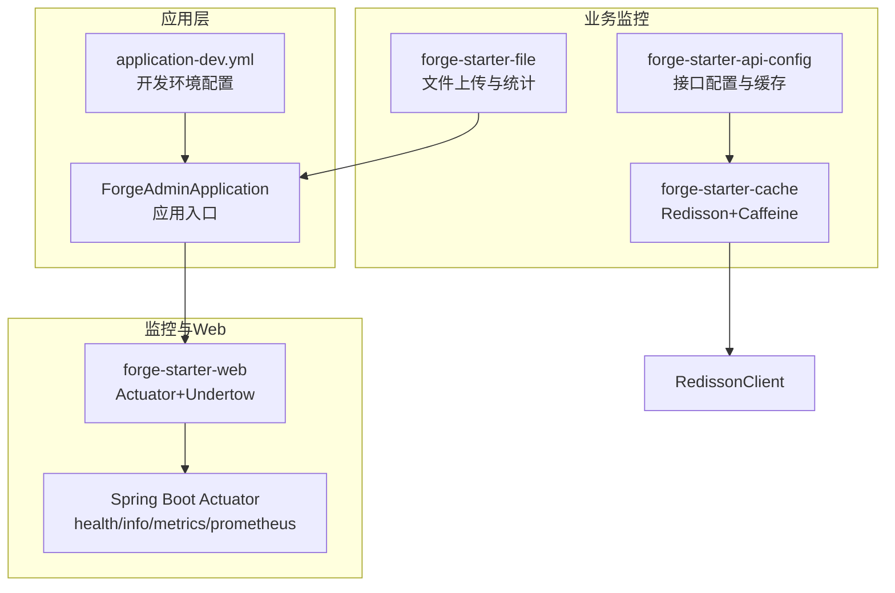
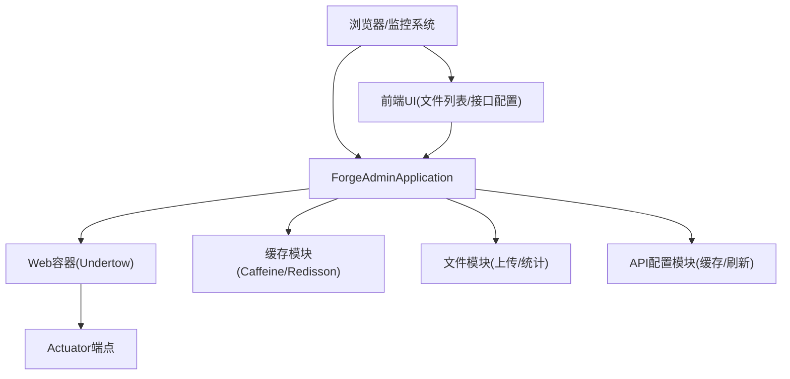
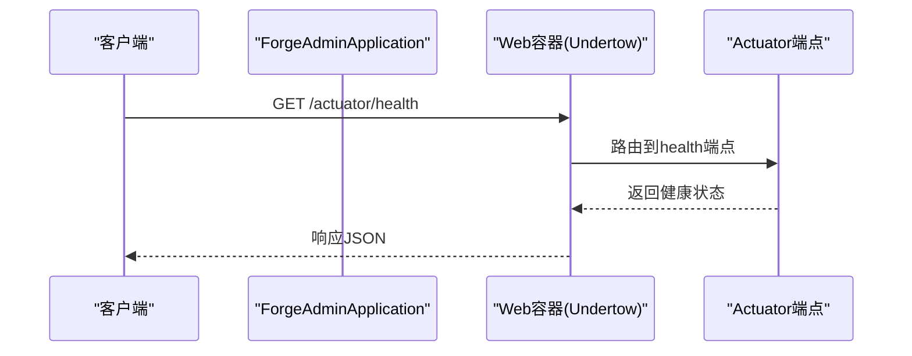
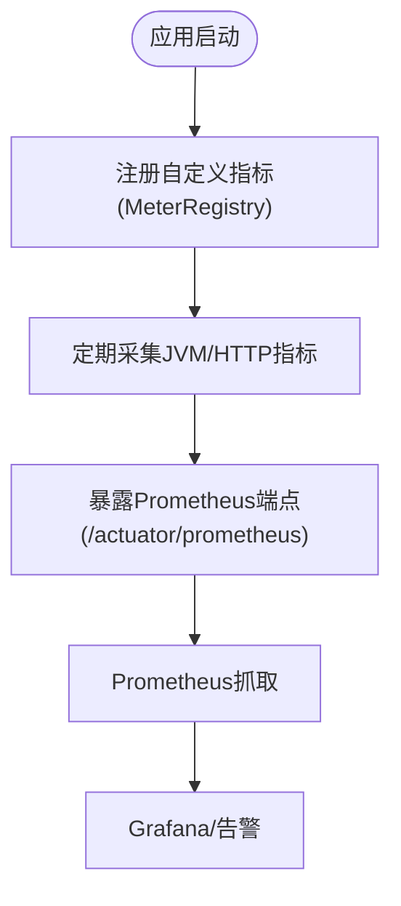
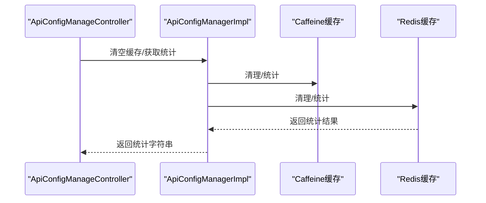
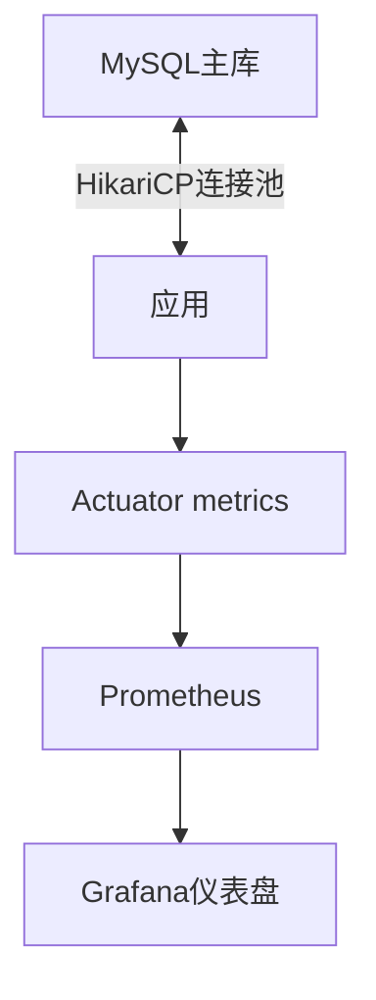
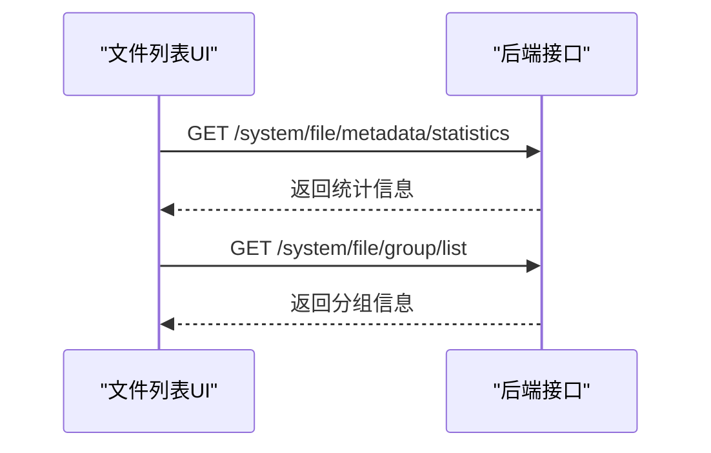
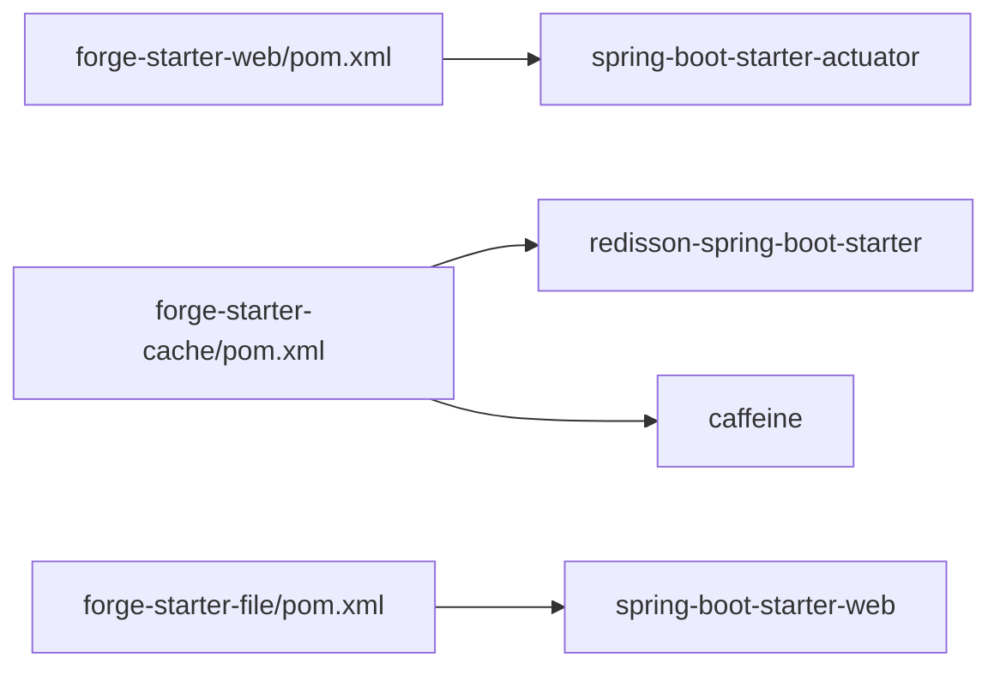

# 应用监控

<cite>
**本文引用的文件**
- [forge/pom.xml](file://forge/pom.xml)
- [forge/forge-admin/src/main/resources/application.yml](file://forge/forge-admin/src/main/resources/application.yml)
- [forge/forge-admin/src/main/resources/application-dev.yml](file://forge/forge-admin/src/main/resources/application-dev.yml)
- [forge/forge-admin/src/main/java/com/mdframe/forge/admin/ForgeAdminApplication.java](file://forge/forge-admin/src/main/java/com/mdframe/forge/admin/ForgeAdminApplication.java)
- [forge/forge-framework/forge-starter-parent/forge-starter-web/pom.xml](file://forge/forge-framework/forge-starter-parent/forge-starter-web/pom.xml)
- [forge/forge-framework/forge-starter-parent/forge-starter-cache/pom.xml](file://forge/forge-framework/forge-starter-parent/forge-starter-cache/pom.xml)
- [forge/forge-framework/forge-starter-parent/forge-starter-file/pom.xml](file://forge/forge-framework/forge-starter-parent/forge-starter-file/pom.xml)
- [forge/forge-framework/forge-starter-parent/forge-starter-cache/src/main/java/com/mdframe/forge/starter/cache/config/RedissonConfig.java](file://forge/forge-framework/forge-starter-parent/forge-starter-cache/src/main/java/com/mdframe/forge/starter/cache/config/RedissonConfig.java)
- [forge/forge-framework/forge-starter-parent/forge-starter-cache/src/main/java/com/mdframe/forge/starter/cache/service/impl/RedissonCacheServiceImpl.java](file://forge/forge-framework/forge-starter-parent/forge-starter-cache/src/main/java/com/mdframe/forge/starter/cache/service/impl/RedissonCacheServiceImpl.java)
- [forge/forge-framework/forge-starter-parent/forge-starter-api-config/src/main/java/com/mdframe/forge/starter/apiconfig/controller/ApiConfigManageController.java](file://forge/forge-framework/forge-starter-parent/forge-starter-api-config/src/main/java/com/mdframe/forge/starter/apiconfig/controller/ApiConfigManageController.java)
- [forge/forge-framework/forge-starter-parent/forge-starter-api-config/src/main/java/com/mdframe/forge/starter/apiconfig/service/impl/ApiConfigManagerImpl.java](file://forge/forge-framework/forge-starter-parent/forge-starter-api-config/src/main/java/com/mdframe/forge/starter/apiconfig/service/impl/ApiConfigManagerImpl.java)
- [forge-admin-ui/src/views/system/file-list.vue](file://forge-admin-ui/src/views/system/file-list.vue)
- [forge-admin-ui/src/views/system/apiConfig.vue](file://forge-admin-ui/src/views/system/apiConfig.vue)
</cite>

## 目录
1. [简介](#简介)
2. [项目结构](#项目结构)
3. [核心组件](#核心组件)
4. [架构总览](#架构总览)
5. [组件详解](#组件详解)
6. [依赖关系分析](#依赖关系分析)
7. [性能考量](#性能考量)
8. [故障排查指南](#故障排查指南)
9. [结论](#结论)
10. [附录](#附录)

## 简介
本文件面向Forge应用的监控体系，系统性阐述如何在Spring Boot 3.2.9 + Undertow环境下启用与配置Actuator监控端点（health、info、metrics、prometheus），采集应用运行时指标（CPU、内存、线程、GC），并结合Spring Boot Admin实现可视化管理；同时覆盖数据库连接池、缓存、文件上传等业务监控指标的配置与实现思路。文档以仓库现有代码为依据，提供可落地的配置与扩展建议。

## 项目结构
Forge采用多模块聚合工程，监控相关能力主要分布在：
- 应用启动模块：forge-admin，负责应用启动与基础配置
- Web与监控基础：forge-starter-web，引入Actuator与Undertow
- 缓存与锁：forge-starter-cache，集成Redisson与Caffeine
- 文件存储：forge-starter-file，提供文件上传与元数据能力
- API配置管理：forge-starter-api-config，提供接口行为与缓存监控

**图表来源**
- [forge/forge-admin/src/main/java/com/mdframe/forge/admin/ForgeAdminApplication.java](file://forge/forge-admin/src/main/java/com/mdframe/forge/admin/ForgeAdminApplication.java#L1-L17)
- [forge/forge-admin/src/main/resources/application-dev.yml](file://forge/forge-admin/src/main/resources/application-dev.yml#L1-L70)
- [forge/forge-framework/forge-starter-parent/forge-starter-web/pom.xml](file://forge/forge-framework/forge-starter-parent/forge-starter-web/pom.xml#L44-L48)
- [forge/forge-framework/forge-starter-parent/forge-starter-cache/pom.xml](file://forge/forge-framework/forge-starter-parent/forge-starter-cache/pom.xml#L21-L35)
- [forge/forge-framework/forge-starter-parent/forge-starter-file/pom.xml](file://forge/forge-framework/forge-starter-parent/forge-starter-file/pom.xml#L14-L24)

**章节来源**
- [forge/pom.xml](file://forge/pom.xml#L114-L119)
- [forge/forge-admin/src/main/java/com/mdframe/forge/admin/ForgeAdminApplication.java](file://forge/forge-admin/src/main/java/com/mdframe/forge/admin/ForgeAdminApplication.java#L1-L17)
- [forge/forge-admin/src/main/resources/application.yml](file://forge/forge-admin/src/main/resources/application.yml#L1-L100)
- [forge/forge-admin/src/main/resources/application-dev.yml](file://forge/forge-admin/src/main/resources/application-dev.yml#L1-L70)

## 核心组件
- Actuator监控端点：通过web模块引入，提供health、info、metrics、prometheus等标准端点
- Undertow Web容器：高性能容器，配合Actuator提供稳定监控
- 缓存监控：Redisson + Caffeine两级缓存，提供缓存命中率、容量等统计
- API配置监控：接口行为配置与缓存刷新，支持缓存统计与清空
- 文件上传监控：前端统计接口与上传配置，便于业务侧监控

**章节来源**
- [forge/forge-framework/forge-starter-parent/forge-starter-web/pom.xml](file://forge/forge-framework/forge-starter-parent/forge-starter-web/pom.xml#L44-L48)
- [forge/forge-framework/forge-starter-parent/forge-starter-cache/pom.xml](file://forge/forge-framework/forge-starter-parent/forge-starter-cache/pom.xml#L21-L35)
- [forge/forge-framework/forge-starter-parent/forge-starter-api-config/src/main/java/com/mdframe/forge/starter/apiconfig/controller/ApiConfigManageController.java](file://forge/forge-framework/forge-starter-parent/forge-starter-api-config/src/main/java/com/mdframe/forge/starter/apiconfig/controller/ApiConfigManageController.java#L63-L90)

## 架构总览
下图展示监控体系在应用中的交互关系：应用启动后由Web模块引入Actuator，业务模块（缓存、文件、API配置）通过各自组件暴露运行指标，前端UI通过REST接口读取统计信息。

**图表来源**
- [forge/forge-admin/src/main/java/com/mdframe/forge/admin/ForgeAdminApplication.java](file://forge/forge-admin/src/main/java/com/mdframe/forge/admin/ForgeAdminApplication.java#L1-L17)
- [forge/forge-framework/forge-starter-parent/forge-starter-web/pom.xml](file://forge/forge-framework/forge-starter-parent/forge-starter-web/pom.xml#L26-L48)
- [forge-admin-ui/src/views/system/file-list.vue](file://forge-admin-ui/src/views/system/file-list.vue#L376-L422)
- [forge-admin-ui/src/views/system/apiConfig.vue](file://forge-admin-ui/src/views/system/apiConfig.vue#L107-L133)

## 组件详解

### Spring Boot Actuator监控端点配置
- 依赖引入：在web模块中引入spring-boot-starter-actuator，即可启用默认监控端点
- 端点能力：health（健康检查）、info（应用信息）、metrics（运行指标）、prometheus（Prometheus导出）
- 端点访问：默认路径为 /actuator，可通过配置调整暴露策略与安全策略

**图表来源**
- [forge/forge-framework/forge-starter-parent/forge-starter-web/pom.xml](file://forge/forge-framework/forge-starter-parent/forge-starter-web/pom.xml#L44-L48)

**章节来源**
- [forge/forge-framework/forge-starter-parent/forge-starter-web/pom.xml](file://forge/forge-framework/forge-starter-parent/forge-starter-web/pom.xml#L44-L48)

### 健康检查指标（health）
- 默认健康指示器：数据库、磁盘空间、Redis等
- 自定义健康指示器：可在应用中注册业务健康检查（如第三方服务可用性）
- 健康状态：通过 /actuator/health 访问，支持分组与详情开关

**章节来源**
- [forge/forge-admin/src/main/resources/application.yml](file://forge/forge-admin/src/main/resources/application.yml#L1-L100)

### 应用信息与构建信息（info）
- info端点：默认暴露应用版本、名称等基础信息
- 自定义信息：可通过配置注入构建时间、Git提交号等

**章节来源**
- [forge/forge-admin/src/main/resources/application.yml](file://forge/forge-admin/src/main/resources/application.yml#L32-L40)

### 运行时指标采集（metrics）
- 默认指标：JVM内存、线程、GC、HTTP请求、Tomcat/UncleTow连接等
- 自定义指标：通过MeterRegistry注册计数器、计时器、分布摘要等
- Prometheus导出：启用 /actuator/prometheus 端点，供Prometheus抓取

**图表来源**
- [forge/forge-framework/forge-starter-parent/forge-starter-web/pom.xml](file://forge/forge-framework/forge-starter-parent/forge-starter-web/pom.xml#L44-L48)

**章节来源**
- [forge/forge-framework/forge-starter-parent/forge-starter-web/pom.xml](file://forge/forge-framework/forge-starter-parent/forge-starter-web/pom.xml#L44-L48)

### Spring Boot Admin管理面板
- 版本与依赖：项目中已声明spring-boot-admin版本属性，可用于集成Admin UI
- 面板能力：应用列表、健康状态、指标图表、日志与配置管理
- 集成方式：在应用中引入Admin客户端依赖，并在Admin UI中注册应用实例

**章节来源**
- [forge/pom.xml](file://forge/pom.xml#L29-L29)

### 缓存使用情况监控
- 缓存架构：L1（Caffeine本地缓存）+ L2（Redis分布式缓存）
- 缓存统计：提供缓存命中率、加载次数、驱逐次数等统计信息
- 缓存刷新：支持按接口、模块、全局刷新，确保多节点一致性

**图表来源**
- [forge/forge-framework/forge-starter-parent/forge-starter-api-config/src/main/java/com/mdframe/forge/starter/apiconfig/controller/ApiConfigManageController.java](file://forge/forge-framework/forge-starter-parent/forge-starter-api-config/src/main/java/com/mdframe/forge/starter/apiconfig/controller/ApiConfigManageController.java#L63-L90)
- [forge/forge-framework/forge-starter-parent/forge-starter-api-config/src/main/java/com/mdframe/forge/starter/apiconfig/service/impl/ApiConfigManagerImpl.java](file://forge/forge-framework/forge-starter-parent/forge-starter-api-config/src/main/java/com/mdframe/forge/starter/apiconfig/service/impl/ApiConfigManagerImpl.java#L293-L330)

**章节来源**
- [forge/forge-framework/forge-starter-parent/forge-starter-cache/pom.xml](file://forge/forge-framework/forge-starter-parent/forge-starter-cache/pom.xml#L21-L35)
- [forge/forge-framework/forge-starter-parent/forge-starter-cache/src/main/java/com/mdframe/forge/starter/cache/config/RedissonConfig.java](file://forge/forge-framework/forge-starter-parent/forge-starter-cache/src/main/java/com/mdframe/forge/starter/cache/config/RedissonConfig.java#L1-L34)
- [forge/forge-framework/forge-starter-parent/forge-starter-cache/src/main/java/com/mdframe/forge/starter/cache/service/impl/RedissonCacheServiceImpl.java](file://forge/forge-framework/forge-starter-parent/forge-starter-cache/src/main/java/com/mdframe/forge/starter/cache/service/impl/RedissonCacheServiceImpl.java#L1-L46)
- [forge/forge-framework/forge-starter-parent/forge-starter-api-config/src/main/java/com/mdframe/forge/starter/apiconfig/controller/ApiConfigManageController.java](file://forge/forge-framework/forge-starter-parent/forge-starter-api-config/src/main/java/com/mdframe/forge/starter/apiconfig/controller/ApiConfigManageController.java#L63-L90)
- [forge/forge-framework/forge-starter-parent/forge-starter-api-config/src/main/java/com/mdframe/forge/starter/apiconfig/service/impl/ApiConfigManagerImpl.java](file://forge/forge-framework/forge-starter-parent/forge-starter-api-config/src/main/java/com/mdframe/forge/starter/apiconfig/service/impl/ApiConfigManagerImpl.java#L293-L330)

### 数据库连接池监控
- 连接池：HikariCP（通过dev配置可见）
- 监控维度：最大连接数、最小空闲、连接超时、空闲超时、最大生存时间、保活时间
- 可视化：可通过Prometheus抓取HikariCP指标，结合Grafana展示

**图表来源**
- [forge/forge-admin/src/main/resources/application-dev.yml](file://forge/forge-admin/src/main/resources/application-dev.yml#L1-L70)

**章节来源**
- [forge/forge-admin/src/main/resources/application-dev.yml](file://forge/forge-admin/src/main/resources/application-dev.yml#L1-L70)

### 文件上传监控
- 前端统计：文件列表页通过REST接口获取总数、图片数、文档数等统计
- 上传配置：前端计算上传URL与请求头，便于统一接入鉴权与埋点
- 业务指标：可扩展后端统计接口，记录上传量、失败率、类型分布等

**图表来源**
- [forge-admin-ui/src/views/system/file-list.vue](file://forge-admin-ui/src/views/system/file-list.vue#L376-L422)

**章节来源**
- [forge-admin-ui/src/views/system/file-list.vue](file://forge-admin-ui/src/views/system/file-list.vue#L376-L422)

### 接口行为与配置监控
- 接口配置：统一管理鉴权、加密、租户隔离、限流等行为
- 缓存与刷新：两级缓存架构，支持事件驱动刷新，保障多节点一致性
- 前端展示：接口配置页面展示各项开关状态，便于运维核对

**章节来源**
- [forge-admin-ui/src/views/system/apiConfig.vue](file://forge-admin-ui/src/views/system/apiConfig.vue#L107-L133)

## 依赖关系分析
- Actuator依赖：由web模块引入，作为监控能力的基础
- 缓存依赖：Redisson + Caffeine，提供两级缓存与序列化配置
- 文件依赖：Web起步依赖，支撑文件上传与静态资源
- API配置依赖：提供接口行为配置与缓存管理

**图表来源**
- [forge/forge-framework/forge-starter-parent/forge-starter-web/pom.xml](file://forge/forge-framework/forge-starter-parent/forge-starter-web/pom.xml#L44-L48)
- [forge/forge-framework/forge-starter-parent/forge-starter-cache/pom.xml](file://forge/forge-framework/forge-starter-parent/forge-starter-cache/pom.xml#L21-L35)
- [forge/forge-framework/forge-starter-parent/forge-starter-file/pom.xml](file://forge/forge-framework/forge-starter-parent/forge-starter-file/pom.xml#L14-L24)

**章节来源**
- [forge/forge-framework/forge-starter-parent/forge-starter-web/pom.xml](file://forge/forge-framework/forge-starter-parent/forge-starter-web/pom.xml#L44-L48)
- [forge/forge-framework/forge-starter-parent/forge-starter-cache/pom.xml](file://forge/forge-framework/forge-starter-parent/forge-starter-cache/pom.xml#L21-L35)
- [forge/forge-framework/forge-starter-parent/forge-starter-file/pom.xml](file://forge/forge-framework/forge-starter-parent/forge-starter-file/pom.xml#L14-L24)

## 性能考量
- Undertow容器：相比Tomcat具备更高吞吐与更低延迟，适合高并发场景
- Actuator开销：默认端点轻量，建议仅在受控网络内暴露生产环境端点
- 缓存命中率：通过L1/L2缓存统计评估热点数据分布，必要时调整过期策略
- 连接池参数：根据业务峰值合理设置最大连接数与超时时间，避免连接抖动
- 文件上传：限制单文件与总大小，结合前端进度与断点续传提升用户体验

## 故障排查指南
- Actuator端点不可达：确认web模块已引入Actuator依赖，检查端点暴露与安全配置
- 缓存异常：检查Redis连接与序列化配置，关注缓存统计与刷新事件
- 数据库连接池：观察连接池指标，排查连接泄漏与慢查询
- 文件上传失败：核对上传URL、鉴权头、存储类型与后端统计接口

**章节来源**
- [forge/forge-framework/forge-starter-parent/forge-starter-web/pom.xml](file://forge/forge-framework/forge-starter-parent/forge-starter-web/pom.xml#L44-L48)
- [forge/forge-framework/forge-starter-parent/forge-starter-cache/src/main/java/com/mdframe/forge/starter/cache/config/RedissonConfig.java](file://forge/forge-framework/forge-starter-parent/forge-starter-cache/src/main/java/com/mdframe/forge/starter/cache/config/RedissonConfig.java#L1-L34)
- [forge/forge-admin/src/main/resources/application-dev.yml](file://forge/forge-admin/src/main/resources/application-dev.yml#L1-L70)
- [forge-admin-ui/src/views/system/file-list.vue](file://forge-admin-ui/src/views/system/file-list.vue#L376-L422)

## 结论
Forge项目已具备完善的监控基础设施：Actuator端点、Undertow容器、两级缓存、文件上传与API配置管理。建议在生产环境中：
- 明确端点暴露范围与鉴权策略
- 建立Prometheus+Grafana监控看板
- 配置关键指标阈值与告警规则
- 持续优化连接池与缓存策略
- 丰富业务指标（文件上传、接口调用、业务成功率等）

## 附录
- Actuator端点清单：health、info、metrics、prometheus
- 缓存统计字段：命中率、命中次数、未命中次数、加载次数、驱逐次数
- 数据库连接池关键参数：最大连接数、最小空闲、连接超时、空闲超时、最大生存时间、保活时间
- 前端监控接口：文件统计、分组列表、上传配置