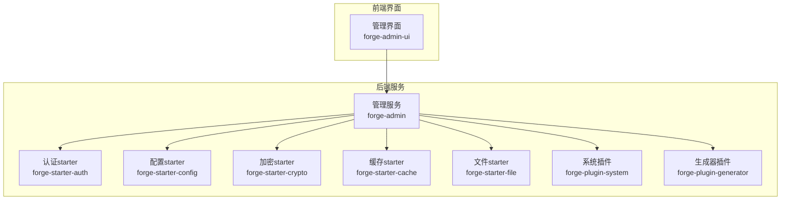
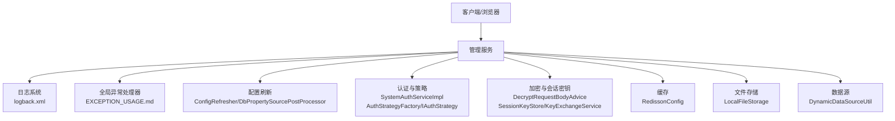
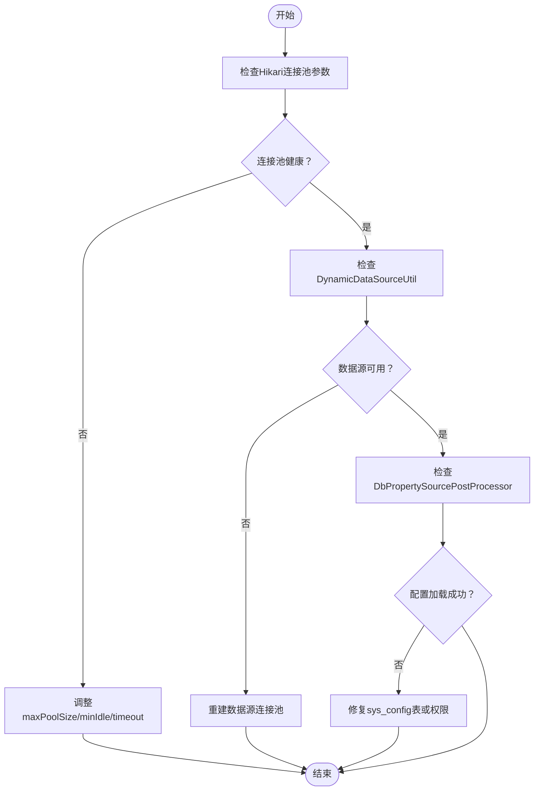
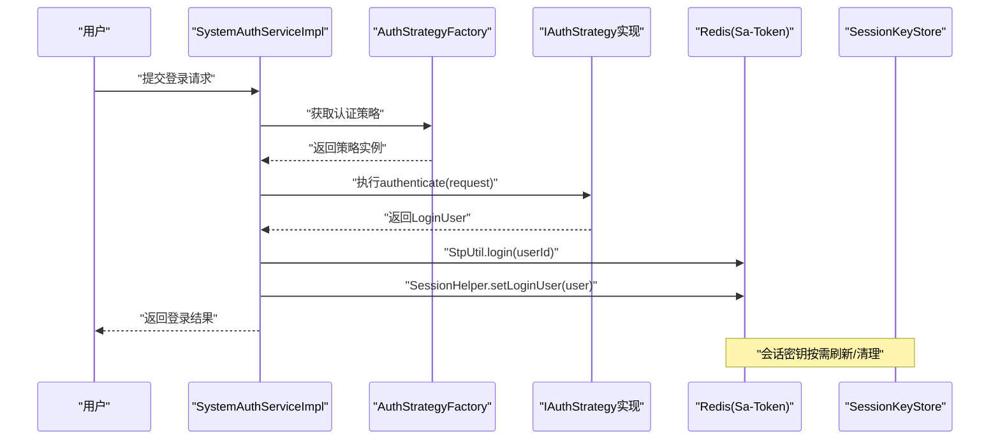
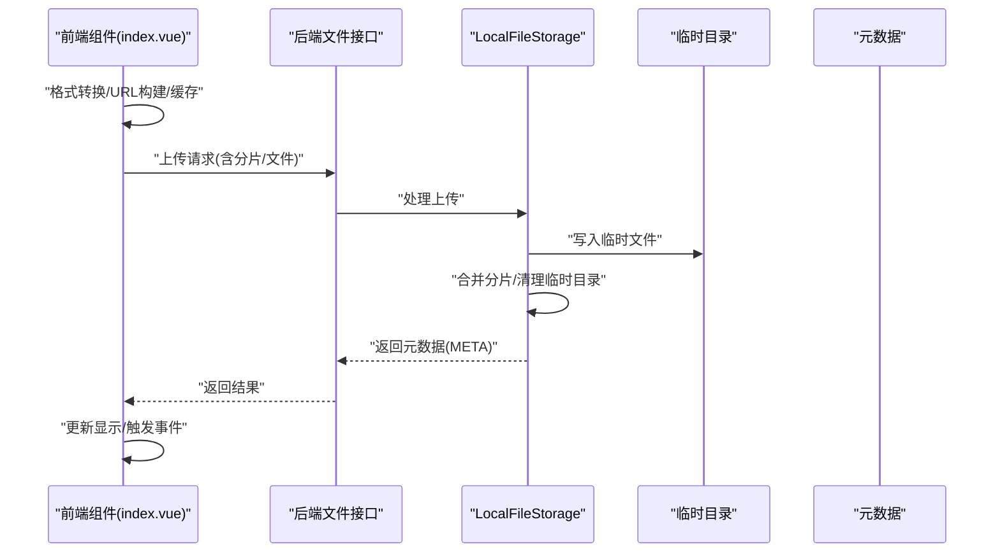
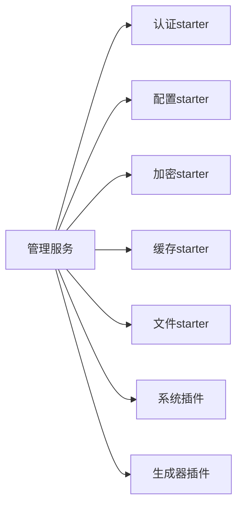

# 故障排查

<cite>
**本文引用的文件**
- [application.yml](file://forge/forge-admin/src/main/resources/application.yml)
- [application-dev.yml](file://forge/forge-admin/src/main/resources/application-dev.yml)
- [logback.xml](file://forge/forge-admin/src/main/resources/logback.xml)
- [EXCEPTION_USAGE.md](file://forge/forge-framework/forge-starter-parent/forge-starter-core/EXCEPTION_USAGE.md)
- [ConfigRefresher.java](file://forge/forge-framework/forge-starter-parent/forge-starter-config/src/main/java/com/mdframe/forge/starter/property/refresh/ConfigRefresher.java)
- [DbPropertySourcePostProcessor.java](file://forge/forge-framework/forge-starter-parent/forge-starter-config/src/main/java/com/mdframe/forge/starter/property/DbPropertySourcePostProcessor.java)
- [DynamicDataSourceUtil.java](file://forge/forge-framework/forge-plugin-parent/forge-plugin-generator/src/main/java/com/mdframe/forge/plugin/generator/util/DynamicDataSourceUtil.java)
- [LocalFileStorage.java](file://forge/forge-framework/forge-starter-parent/forge-starter-file/src/main/java/com/mdframe/forge/starter/file/storage/impl/LocalFileStorage.java)
- [index.vue（图片上传组件）](file://forge-admin-ui/src/components/image-upload/index.vue)
- [index.vue（文件上传组件）](file://forge-admin-ui/src/components/file-upload/index.vue)
- [SystemAuthServiceImpl.java](file://forge/forge-framework/forge-plugin-parent/forge-plugin-system/src/main/java/com/mdframe/forge/plugin/system/service/impl/SystemAuthServiceImpl.java)
- [AuthStrategyFactory.java](file://forge/forge-framework/forge-starter-parent/forge-starter-auth/src/main/java/com/mdframe/forge/starter/auth/strategy/AuthStrategyFactory.java)
- [IAuthStrategy.java](file://forge/forge-framework/forge-starter-parent/forge-starter-auth/src/main/java/com/mdframe/forge/starter/auth/strategy/IAuthStrategy.java)
- [DecryptRequestBodyAdvice.java](file://forge/forge-framework/forge-starter-parent/forge-starter-crypto/src/main/java/com/mdframe/forge/starter/crypto/advice/DecryptRequestBodyAdvice.java)
- [SessionKeyStore.java](file://forge/forge-framework/forge-starter-parent/forge-starter-crypto/src/main/java/com/mdframe/forge/starter/crypto/keyexchange/SessionKeyStore.java)
- [KeyExchangeService.java](file://forge/forge-framework/forge-starter-parent/forge-starter-crypto/src/main/java/com/mdframe/forge/starter/crypto/keyexchange/KeyExchangeService.java)
- [RedissonConfig.java](file://forge/forge-framework/forge-starter-parent/forge-starter-cache/src/main/java/com/mdframe/forge/starter/cache/config/RedissonConfig.java)
- [pom.xml（框架聚合）](file://forge/forge-framework/pom.xml)
</cite>

## 目录
1. [简介](#简介)
2. [项目结构](#项目结构)
3. [核心组件](#核心组件)
4. [架构总览](#架构总览)
5. [详细组件分析](#详细组件分析)
6. [依赖关系分析](#依赖关系分析)
7. [性能考量](#性能考量)
8. [故障排查指南](#故障排查指南)
9. [结论](#结论)
10. [附录](#附录)

## 简介
本指南面向Forge系统运维与开发人员，提供系统性的故障诊断与解决流程。覆盖应用启动失败、数据库连接异常、权限认证问题、文件上传失败等典型问题，并结合系统内置的日志、异常处理、配置刷新、加密与缓存能力，给出可落地的排查步骤、应急响应预案与性能优化建议。同时，提供建立问题知识库与最佳实践的方法，帮助团队持续提升故障处理效率。

## 项目结构
Forge系统由后端Spring Boot微服务与前端Vue管理界面组成，采用多模块聚合构建。后端通过starter与plugin模块提供认证、配置、缓存、文件、作业等通用能力；前端提供上传、字典、路由守卫等UI能力。

图表来源
- [pom.xml（框架聚合）](file://forge/forge-framework/pom.xml#L26-L30)

章节来源
- [pom.xml（框架聚合）](file://forge/forge-framework/pom.xml#L1-L117)

## 核心组件
- 配置与日志
  - application.yml与application-dev.yml提供服务端口、 Undertow线程池、文件上传大小、MyBatis-Plus、Sa-Token与Redis配置。
  - logback.xml定义日志输出格式、滚动策略与模块日志级别，支持traceId串联调用链。
- 异常处理
  - EXCEPTION_USAGE.md定义统一异常体系（BusinessException、ExceptionUtil、GlobalExceptionHandler），规范错误码与响应格式。
- 配置刷新
  - ConfigRefresher与DbPropertySourcePostProcessor从数据库表加载配置，支持热更新与降级。
- 数据源与文件存储
  - DynamicDataSourceUtil管理动态数据源连接池；LocalFileStorage实现本地文件分片上传与元数据构建。
- 认证与加密
  - SystemAuthServiceImpl执行登录策略；AuthStrategyFactory与IAuthStrategy抽象认证策略；DecryptRequestBodyAdvice与SessionKeyStore/KeyExchangeService支撑会话密钥管理。
- 缓存
  - RedissonConfig自定义Jackson序列化器，适配Java8时间类型，保障缓存读写稳定性。

章节来源
- [application.yml](file://forge/forge-admin/src/main/resources/application.yml#L1-L100)
- [application-dev.yml](file://forge/forge-admin/src/main/resources/application-dev.yml#L1-L70)
- [logback.xml](file://forge/forge-admin/src/main/resources/logback.xml#L1-L49)
- [EXCEPTION_USAGE.md](file://forge/forge-framework/forge-starter-parent/forge-starter-core/EXCEPTION_USAGE.md#L1-L358)
- [ConfigRefresher.java](file://forge/forge-framework/forge-starter-parent/forge-starter-config/src/main/java/com/mdframe/forge/starter/property/refresh/ConfigRefresher.java#L114-L156)
- [DbPropertySourcePostProcessor.java](file://forge/forge-framework/forge-starter-parent/forge-starter-config/src/main/java/com/mdframe/forge/starter/property/DbPropertySourcePostProcessor.java#L39-L65)
- [DynamicDataSourceUtil.java](file://forge/forge-framework/forge-plugin-parent/forge-plugin-generator/src/main/java/com/mdframe/forge/plugin/generator/util/DynamicDataSourceUtil.java#L1-L43)
- [LocalFileStorage.java](file://forge/forge-framework/forge-starter-parent/forge-starter-file/src/main/java/com/mdframe/forge/starter/file/storage/impl/LocalFileStorage.java#L221-L252)
- [SystemAuthServiceImpl.java](file://forge/forge-framework/forge-plugin-parent/forge-plugin-system/src/main/java/com/mdframe/forge/plugin/system/service/impl/SystemAuthServiceImpl.java#L66-L101)
- [AuthStrategyFactory.java](file://forge/forge-framework/forge-starter-parent/forge-starter-auth/src/main/java/com/mdframe/forge/starter/auth/strategy/AuthStrategyFactory.java#L1-L42)
- [IAuthStrategy.java](file://forge/forge-framework/forge-starter-parent/forge-starter-auth/src/main/java/com/mdframe/forge/starter/auth/strategy/IAuthStrategy.java#L1-L55)
- [DecryptRequestBodyAdvice.java](file://forge/forge-framework/forge-starter-parent/forge-starter-crypto/src/main/java/com/mdframe/forge/starter/crypto/advice/DecryptRequestBodyAdvice.java#L138-L174)
- [SessionKeyStore.java](file://forge/forge-framework/forge-starter-parent/forge-starter-crypto/src/main/java/com/mdframe/forge/starter/crypto/keyexchange/SessionKeyStore.java#L48-L77)
- [KeyExchangeService.java](file://forge/forge-framework/forge-starter-parent/forge-starter-crypto/src/main/java/com/mdframe/forge/starter/crypto/keyexchange/KeyExchangeService.java#L47-L63)
- [RedissonConfig.java](file://forge/forge-framework/forge-starter-parent/forge-starter-cache/src/main/java/com/mdframe/forge/starter/cache/config/RedissonConfig.java#L1-L34)

## 架构总览
下图展示故障排查涉及的关键组件交互：日志采集与异常处理、配置刷新、认证与加密、缓存、文件存储与数据源。

图表来源
- [logback.xml](file://forge/forge-admin/src/main/resources/logback.xml#L1-L49)
- [EXCEPTION_USAGE.md](file://forge/forge-framework/forge-starter-parent/forge-starter-core/EXCEPTION_USAGE.md#L106-L140)
- [ConfigRefresher.java](file://forge/forge-framework/forge-starter-parent/forge-starter-config/src/main/java/com/mdframe/forge/starter/property/refresh/ConfigRefresher.java#L114-L156)
- [DbPropertySourcePostProcessor.java](file://forge/forge-framework/forge-starter-parent/forge-starter-config/src/main/java/com/mdframe/forge/starter/property/DbPropertySourcePostProcessor.java#L39-L65)
- [SystemAuthServiceImpl.java](file://forge/forge-framework/forge-plugin-parent/forge-plugin-system/src/main/java/com/mdframe/forge/plugin/system/service/impl/SystemAuthServiceImpl.java#L66-L101)
- [AuthStrategyFactory.java](file://forge/forge-framework/forge-starter-parent/forge-starter-auth/src/main/java/com/mdframe/forge/starter/auth/strategy/AuthStrategyFactory.java#L1-L42)
- [IAuthStrategy.java](file://forge/forge-framework/forge-starter-parent/forge-starter-auth/src/main/java/com/mdframe/forge/starter/auth/strategy/IAuthStrategy.java#L1-L55)
- [DecryptRequestBodyAdvice.java](file://forge/forge-framework/forge-starter-parent/forge-starter-crypto/src/main/java/com/mdframe/forge/starter/crypto/advice/DecryptRequestBodyAdvice.java#L138-L174)
- [SessionKeyStore.java](file://forge/forge-framework/forge-starter-parent/forge-starter-crypto/src/main/java/com/mdframe/forge/starter/crypto/keyexchange/SessionKeyStore.java#L48-L77)
- [KeyExchangeService.java](file://forge/forge-framework/forge-starter-parent/forge-starter-crypto/src/main/java/com/mdframe/forge/starter/crypto/keyexchange/KeyExchangeService.java#L47-L63)
- [RedissonConfig.java](file://forge/forge-framework/forge-starter-parent/forge-starter-cache/src/main/java/com/mdframe/forge/starter/cache/config/RedissonConfig.java#L1-L34)
- [LocalFileStorage.java](file://forge/forge-framework/forge-starter-parent/forge-starter-file/src/main/java/com/mdframe/forge/starter/file/storage/impl/LocalFileStorage.java#L221-L252)
- [DynamicDataSourceUtil.java](file://forge/forge-framework/forge-plugin-parent/forge-plugin-generator/src/main/java/com/mdframe/forge/plugin/generator/util/DynamicDataSourceUtil.java#L1-L43)

## 详细组件分析

### 应用启动失败
- 排查要点
  - 端口占用与上下文路径：确认server.port与context-path配置，避免端口冲突。
  - Undertow线程池：检查io与worker线程数，评估并发压力。
  - 日志级别：确保com.mdframe.forge与org.springframework日志级别合理，便于定位。
  - 数据源与Redis：确认dev环境下的数据库URL、账号密码与Redis连接参数。
- 关联配置
  - 服务端口、Undertow线程池、日志配置、文件上传大小、MyBatis-Plus、Sa-Token与Redis。
- 应急措施
  - 临时降低日志级别至info，减少I/O开销；必要时临时关闭SQL日志打印。

章节来源
- [application.yml](file://forge/forge-admin/src/main/resources/application.yml#L1-L100)
- [application-dev.yml](file://forge/forge-admin/src/main/resources/application-dev.yml#L1-L70)
- [logback.xml](file://forge/forge-admin/src/main/resources/logback.xml#L1-L49)

### 数据库连接异常
- 排查要点
  - Hikari连接池参数：maxPoolSize、minIdle、connectionTimeout、validationTimeout、idleTimeout、maxLifetime。
  - 动态数据源：确认DynamicDataSourceUtil是否正确创建与复用数据源连接池。
  - 配置刷新：DbPropertySourcePostProcessor从sys_config表加载配置，若失败需检查表结构与权限。
- 关联配置
  - application-dev.yml中的数据源与Hikari参数；DynamicDataSourceUtil；DbPropertySourcePostProcessor。
- 应急措施
  - 临时切换到单数据源（primary=master），绕过动态数据源；检查网络连通与防火墙。

图表来源
- [application-dev.yml](file://forge/forge-admin/src/main/resources/application-dev.yml#L1-L70)
- [DynamicDataSourceUtil.java](file://forge/forge-framework/forge-plugin-parent/forge-plugin-generator/src/main/java/com/mdframe/forge/plugin/generator/util/DynamicDataSourceUtil.java#L1-L43)
- [DbPropertySourcePostProcessor.java](file://forge/forge-framework/forge-starter-parent/forge-starter-config/src/main/java/com/mdframe/forge/starter/property/DbPropertySourcePostProcessor.java#L39-L65)

章节来源
- [application-dev.yml](file://forge/forge-admin/src/main/resources/application-dev.yml#L1-L70)
- [DynamicDataSourceUtil.java](file://forge/forge-framework/forge-plugin-parent/forge-plugin-generator/src/main/java/com/mdframe/forge/plugin/generator/util/DynamicDataSourceUtil.java#L1-L43)
- [DbPropertySourcePostProcessor.java](file://forge/forge-framework/forge-starter-parent/forge-starter-config/src/main/java/com/mdframe/forge/starter/property/DbPropertySourcePostProcessor.java#L39-L65)

### 权限认证问题
- 排查要点
  - 登录流程：SystemAuthServiceImpl执行认证策略、在线用户管理、Sa-Token登录与Session写入。
  - 策略选择：AuthStrategyFactory根据authType与client选择策略，IAuthStrategy定义支持范围。
  - 加密与会话：DecryptRequestBodyAdvice按需获取会话密钥；SessionKeyStore/KeyExchangeService维护会话密钥生命周期。
- 关联配置
  - sa-token配置（host/port/password/database/timeout）；认证策略接口与实现。
- 应急措施
  - 关闭在线用户管理开关进行隔离测试；检查会话密钥是否存在与过期刷新。

图表来源
- [SystemAuthServiceImpl.java](file://forge/forge-framework/forge-plugin-parent/forge-plugin-system/src/main/java/com/mdframe/forge/plugin/system/service/impl/SystemAuthServiceImpl.java#L66-L101)
- [AuthStrategyFactory.java](file://forge/forge-framework/forge-starter-parent/forge-starter-auth/src/main/java/com/mdframe/forge/starter/auth/strategy/AuthStrategyFactory.java#L1-L42)
- [IAuthStrategy.java](file://forge/forge-framework/forge-starter-parent/forge-starter-auth/src/main/java/com/mdframe/forge/starter/auth/strategy/IAuthStrategy.java#L1-L55)
- [DecryptRequestBodyAdvice.java](file://forge/forge-framework/forge-starter-parent/forge-starter-crypto/src/main/java/com/mdframe/forge/starter/crypto/advice/DecryptRequestBodyAdvice.java#L138-L174)
- [SessionKeyStore.java](file://forge/forge-framework/forge-starter-parent/forge-starter-crypto/src/main/java/com/mdframe/forge/starter/crypto/keyexchange/SessionKeyStore.java#L48-L77)
- [KeyExchangeService.java](file://forge/forge-framework/forge-starter-parent/forge-starter-crypto/src/main/java/com/mdframe/forge/starter/crypto/keyexchange/KeyExchangeService.java#L47-L63)

章节来源
- [SystemAuthServiceImpl.java](file://forge/forge-framework/forge-plugin-parent/forge-plugin-system/src/main/java/com/mdframe/forge/plugin/system/service/impl/SystemAuthServiceImpl.java#L66-L101)
- [AuthStrategyFactory.java](file://forge/forge-framework/forge-starter-parent/forge-starter-auth/src/main/java/com/mdframe/forge/starter/auth/strategy/AuthStrategyFactory.java#L1-L42)
- [IAuthStrategy.java](file://forge/forge-framework/forge-starter-parent/forge-starter-auth/src/main/java/com/mdframe/forge/starter/auth/strategy/IAuthStrategy.java#L1-L55)
- [DecryptRequestBodyAdvice.java](file://forge/forge-framework/forge-starter-parent/forge-starter-crypto/src/main/java/com/mdframe/forge/starter/crypto/advice/DecryptRequestBodyAdvice.java#L138-L174)
- [SessionKeyStore.java](file://forge/forge-framework/forge-starter-parent/forge-starter-crypto/src/main/java/com/mdframe/forge/starter/crypto/keyexchange/SessionKeyStore.java#L48-L77)
- [KeyExchangeService.java](file://forge/forge-framework/forge-starter-parent/forge-starter-crypto/src/main/java/com/mdframe/forge/starter/crypto/keyexchange/KeyExchangeService.java#L47-L63)

### 文件上传失败
- 排查要点
  - 前端上传组件：index.vue（图片上传）与index.vue（文件上传）负责格式转换、URL构建与缓存。
  - 后端存储：LocalFileStorage实现分片上传、临时目录清理与元数据构建。
  - 上传限制：application.yml中的multipart.max-file-size与max-request-size。
- 关联配置
  - application.yml中的文件上传配置；LocalFileStorage实现细节。
- 应急措施
  - 临时提高上传大小限制；检查磁盘空间与目标目录权限；回滚到单文件直传策略。

图表来源
- [index.vue（图片上传组件）](file://forge-admin-ui/src/components/image-upload/index.vue#L296-L340)
- [index.vue（文件上传组件）](file://forge-admin-ui/src/components/file-upload/index.vue#L221-L396)
- [LocalFileStorage.java](file://forge/forge-framework/forge-starter-parent/forge-starter-file/src/main/java/com/mdframe/forge/starter/file/storage/impl/LocalFileStorage.java#L221-L252)
- [application.yml](file://forge/forge-admin/src/main/resources/application.yml#L41-L48)

章节来源
- [index.vue（图片上传组件）](file://forge-admin-ui/src/components/image-upload/index.vue#L296-L340)
- [index.vue（文件上传组件）](file://forge-admin-ui/src/components/file-upload/index.vue#L221-L396)
- [LocalFileStorage.java](file://forge/forge-framework/forge-starter-parent/forge-starter-file/src/main/java/com/mdframe/forge/starter/file/storage/impl/LocalFileStorage.java#L221-L252)
- [application.yml](file://forge/forge-admin/src/main/resources/application.yml#L41-L48)

### 配置热更新异常
- 排查要点
  - DbPropertySourcePostProcessor从sys_config表加载配置并注入环境；ConfigRefresher提供驼峰转换与异常告警。
  - 若加载失败，需检查表结构、字段类型与数据库连接。
- 应急措施
  - 临时回退到本地配置；修复sys_config表后重试加载。

章节来源
- [DbPropertySourcePostProcessor.java](file://forge/forge-framework/forge-starter-parent/forge-starter-config/src/main/java/com/mdframe/forge/starter/property/DbPropertySourcePostProcessor.java#L39-L65)
- [ConfigRefresher.java](file://forge/forge-framework/forge-starter-parent/forge-starter-config/src/main/java/com/mdframe/forge/starter/property/refresh/ConfigRefresher.java#L114-L156)

### 缓存与会话异常
- 排查要点
  - RedissonConfig自定义Jackson序列化器，支持Java8时间类型；检查Redis连接参数与密码。
  - 会话密钥：SessionKeyStore提供增删改查与过期刷新；KeyExchangeService提供会话密钥获取与清理。
- 应急措施
  - 临时禁用动态密钥；检查Redis服务状态与网络连通。

章节来源
- [RedissonConfig.java](file://forge/forge-framework/forge-starter-parent/forge-starter-cache/src/main/java/com/mdframe/forge/starter/cache/config/RedissonConfig.java#L1-L34)
- [SessionKeyStore.java](file://forge/forge-framework/forge-starter-parent/forge-starter-crypto/src/main/java/com/mdframe/forge/starter/crypto/keyexchange/SessionKeyStore.java#L48-L77)
- [KeyExchangeService.java](file://forge/forge-framework/forge-starter-parent/forge-starter-crypto/src/main/java/com/mdframe/forge/starter/crypto/keyexchange/KeyExchangeService.java#L47-L63)

## 依赖关系分析
- 组件耦合
  - 管理服务依赖各starter与plugin模块；认证与策略解耦；文件与数据源独立。
- 外部依赖
  - MySQL(Hikari)、Redis(Redisson)、前端UI组件。
- 潜在风险
  - 配置刷新失败导致功能降级；动态数据源池异常影响多租户或多数据源场景；文件存储磁盘空间不足。

图表来源
- [pom.xml（框架聚合）](file://forge/forge-framework/pom.xml#L26-L30)

章节来源
- [pom.xml（框架聚合）](file://forge/forge-framework/pom.xml#L1-L117)

## 性能考量
- 数据库查询优化
  - 合理设置Hikari连接池参数，避免连接超时与抖动；批量操作启用rewriteBatchedStatements以提升吞吐。
- 缓存策略调整
  - 使用Redisson自定义序列化器，减少序列化开销；合理设置过期时间与容量上限。
- 线程池配置优化
  - Undertow IO线程与worker线程数按CPU核数与QPS调优；避免过多阻塞线程导致上下文切换。
- 文件上传性能
  - 分片上传与临时目录清理策略；磁盘I/O与带宽限制评估。

章节来源
- [application-dev.yml](file://forge/forge-admin/src/main/resources/application-dev.yml#L1-L70)
- [application.yml](file://forge/forge-admin/src/main/resources/application.yml#L1-L100)
- [LocalFileStorage.java](file://forge/forge-framework/forge-starter-parent/forge-starter-file/src/main/java/com/mdframe/forge/starter/file/storage/impl/LocalFileStorage.java#L221-L252)
- [RedissonConfig.java](file://forge/forge-framework/forge-starter-parent/forge-starter-cache/src/main/java/com/mdframe/forge/starter/cache/config/RedissonConfig.java#L1-L34)

## 故障排查指南

### 通用排查流程
- 快速定位
  - 通过logback.xml中的traceId串联请求链路，定位具体模块与异常堆栈。
  - 使用EXCEPTION_USAGE.md规范的错误码与响应格式，快速识别业务异常类型。
- 逐步缩小
  - 逐层检查：前端组件 → 后端接口 → 认证/加密/缓存 → 文件存储 → 数据库连接 → 配置刷新。
- 应急处置
  - 降级：关闭高开销功能（如SQL日志、动态密钥、在线用户管理）。
  - 快速恢复：回滚配置/代码至稳定版本；重启服务；恢复数据库/Redis连接。
  - 数据回滚：针对配置变更与关键业务操作准备回滚脚本与快照。

章节来源
- [logback.xml](file://forge/forge-admin/src/main/resources/logback.xml#L1-L49)
- [EXCEPTION_USAGE.md](file://forge/forge-framework/forge-starter-parent/forge-starter-core/EXCEPTION_USAGE.md#L106-L140)

### 典型故障与步骤

#### 应用启动失败
- 现象
  - 服务无法启动或启动后立即退出。
- 步骤
  - 检查server.port与context-path；查看日志中端口占用与上下文路径冲突。
  - 降低日志级别，观察启动阶段异常。
  - 临时关闭SQL日志打印，排除日志I/O影响。
- 应急
  - 更换端口或临时禁用特定starter模块进行隔离。

章节来源
- [application.yml](file://forge/forge-admin/src/main/resources/application.yml#L1-L100)
- [logback.xml](file://forge/forge-admin/src/main/resources/logback.xml#L1-L49)

#### 数据库连接异常
- 现象
  - 连接超时、获取连接失败、事务异常。
- 步骤
  - 检查Hikari参数（maxPoolSize、minIdle、connectionTimeout、validationTimeout）。
  - 查看DynamicDataSourceUtil是否重复创建或泄漏连接。
  - 检查sys_config表加载是否成功（DbPropertySourcePostProcessor）。
- 应急
  - 临时固定主数据源；检查网络与防火墙；回滚到单数据源配置。

章节来源
- [application-dev.yml](file://forge/forge-admin/src/main/resources/application-dev.yml#L1-L70)
- [DynamicDataSourceUtil.java](file://forge/forge-framework/forge-plugin-parent/forge-plugin-generator/src/main/java/com/mdframe/forge/plugin/generator/util/DynamicDataSourceUtil.java#L1-L43)
- [DbPropertySourcePostProcessor.java](file://forge/forge-framework/forge-starter-parent/forge-starter-config/src/main/java/com/mdframe/forge/starter/property/DbPropertySourcePostProcessor.java#L39-L65)

#### 权限认证问题
- 现象
  - 登录失败、Token无效、权限不足。
- 步骤
  - 检查SystemAuthServiceImpl登录流程与策略选择。
  - 验证AuthStrategyFactory与IAuthStrategy实现是否匹配请求。
  - 检查DecryptRequestBodyAdvice与SessionKeyStore的会话密钥获取与过期。
- 应急
  - 关闭在线用户管理开关；检查Redis连接；清理会话密钥。

章节来源
- [SystemAuthServiceImpl.java](file://forge/forge-framework/forge-plugin-parent/forge-plugin-system/src/main/java/com/mdframe/forge/plugin/system/service/impl/SystemAuthServiceImpl.java#L66-L101)
- [AuthStrategyFactory.java](file://forge/forge-framework/forge-starter-parent/forge-starter-auth/src/main/java/com/mdframe/forge/starter/auth/strategy/AuthStrategyFactory.java#L1-L42)
- [IAuthStrategy.java](file://forge/forge-framework/forge-starter-parent/forge-starter-auth/src/main/java/com/mdframe/forge/starter/auth/strategy/IAuthStrategy.java#L1-L55)
- [DecryptRequestBodyAdvice.java](file://forge/forge-framework/forge-starter-parent/forge-starter-crypto/src/main/java/com/mdframe/forge/starter/crypto/advice/DecryptRequestBodyAdvice.java#L138-L174)
- [SessionKeyStore.java](file://forge/forge-framework/forge-starter-parent/forge-starter-crypto/src/main/java/com/mdframe/forge/starter/crypto/keyexchange/SessionKeyStore.java#L48-L77)

#### 文件上传失败
- 现象
  - 上传超时、文件损坏、URL不可访问。
- 步骤
  - 检查前端组件的URL构建与缓存逻辑。
  - 查看后端LocalFileStorage的分片合并与临时目录清理。
  - 核对application.yml中的上传大小限制。
- 应急
  - 临时提高上传限制；检查磁盘空间与权限；回滚到单文件直传。

章节来源
- [index.vue（图片上传组件）](file://forge-admin-ui/src/components/image-upload/index.vue#L296-L340)
- [index.vue（文件上传组件）](file://forge-admin-ui/src/components/file-upload/index.vue#L221-L396)
- [LocalFileStorage.java](file://forge/forge-framework/forge-starter-parent/forge-starter-file/src/main/java/com/mdframe/forge/starter/file/storage/impl/LocalFileStorage.java#L221-L252)
- [application.yml](file://forge/forge-admin/src/main/resources/application.yml#L41-L48)

#### 配置热更新异常
- 现象
  - 配置未生效、功能异常。
- 步骤
  - 检查DbPropertySourcePostProcessor是否成功从sys_config表加载配置。
  - 查看ConfigRefresher的异常告警与驼峰转换逻辑。
- 应急
  - 回退到本地配置；修复sys_config表后重试。

章节来源
- [DbPropertySourcePostProcessor.java](file://forge/forge-framework/forge-starter-parent/forge-starter-config/src/main/java/com/mdframe/forge/starter/property/DbPropertySourcePostProcessor.java#L39-L65)
- [ConfigRefresher.java](file://forge/forge-framework/forge-starter-parent/forge-starter-config/src/main/java/com/mdframe/forge/starter/property/refresh/ConfigRefresher.java#L114-L156)

#### 缓存与会话异常
- 现象
  - 缓存读写失败、会话丢失。
- 步骤
  - 检查Redis连接参数与密码；确认RedissonConfig的序列化器配置。
  - 检查SessionKeyStore的密钥存在性与过期刷新。
- 应急
  - 临时禁用动态密钥；检查Redis服务状态。

章节来源
- [RedissonConfig.java](file://forge/forge-framework/forge-starter-parent/forge-starter-cache/src/main/java/com/mdframe/forge/starter/cache/config/RedissonConfig.java#L1-L34)
- [SessionKeyStore.java](file://forge/forge-framework/forge-starter-parent/forge-starter-crypto/src/main/java/com/mdframe/forge/starter/crypto/keyexchange/SessionKeyStore.java#L48-L77)

### 应急响应预案
- 系统降级
  - 关闭SQL日志打印、动态密钥、在线用户管理等高开销功能。
- 快速恢复
  - 回滚配置/代码至稳定版本；重启服务；恢复数据库/Redis连接。
- 数据回滚
  - 针对配置变更与关键业务操作准备回滚脚本与快照。

章节来源
- [EXCEPTION_USAGE.md](file://forge/forge-framework/forge-starter-parent/forge-starter-core/EXCEPTION_USAGE.md#L314-L339)

### 性能优化建议
- 数据库
  - 合理设置Hikari参数；批量操作启用批处理优化。
- 缓存
  - 使用Redisson自定义序列化器；设置合理的过期与容量。
- 线程池
  - Undertow IO与worker线程按QPS与CPU核数调优。
- 文件上传
  - 分片上传与磁盘I/O评估；临时目录清理策略。

章节来源
- [application-dev.yml](file://forge/forge-admin/src/main/resources/application-dev.yml#L1-L70)
- [application.yml](file://forge/forge-admin/src/main/resources/application.yml#L1-L100)
- [LocalFileStorage.java](file://forge/forge-framework/forge-starter-parent/forge-starter-file/src/main/java/com/mdframe/forge/starter/file/storage/impl/LocalFileStorage.java#L221-L252)
- [RedissonConfig.java](file://forge/forge-framework/forge-starter-parent/forge-starter-cache/src/main/java/com/mdframe/forge/starter/cache/config/RedissonConfig.java#L1-L34)

### 建立问题知识库与最佳实践
- 知识库
  - 按故障类型分类（启动、数据库、认证、文件、配置、缓存）；记录现象、根因、步骤、应急措施与回滚方案。
- 最佳实践
  - 统一异常码与响应格式；规范日志traceId；定期演练应急恢复；沉淀配置模板与回滚脚本。

章节来源
- [EXCEPTION_USAGE.md](file://forge/forge-framework/forge-starter-parent/forge-starter-core/EXCEPTION_USAGE.md#L314-L339)

## 结论
通过统一的日志与异常处理、完善的配置与数据源管理、健壮的认证与加密、稳定的缓存与文件存储，Forge系统具备较强的可运维性。遵循本文提供的排查流程与应急预案，可显著缩短故障定位与恢复时间；配合知识库与最佳实践，持续提升团队故障处理效率。

## 附录
- 关键配置参考
  - 服务端口与线程池：[application.yml](file://forge/forge-admin/src/main/resources/application.yml#L1-L100)
  - 数据源与Redis：[application-dev.yml](file://forge/forge-admin/src/main/resources/application-dev.yml#L1-L70)
  - 日志格式与级别：[logback.xml](file://forge/forge-admin/src/main/resources/logback.xml#L1-L49)
  - 异常处理规范：[EXCEPTION_USAGE.md](file://forge/forge-framework/forge-starter-parent/forge-starter-core/EXCEPTION_USAGE.md#L106-L140)
- 组件实现参考
  - 配置刷新：[ConfigRefresher.java](file://forge/forge-framework/forge-starter-parent/forge-starter-config/src/main/java/com/mdframe/forge/starter/property/refresh/ConfigRefresher.java#L114-L156)，[DbPropertySourcePostProcessor.java](file://forge/forge-framework/forge-starter-parent/forge-starter-config/src/main/java/com/mdframe/forge/starter/property/DbPropertySourcePostProcessor.java#L39-L65)
  - 数据源：[DynamicDataSourceUtil.java](file://forge/forge-framework/forge-plugin-parent/forge-plugin-generator/src/main/java/com/mdframe/forge/plugin/generator/util/DynamicDataSourceUtil.java#L1-L43)
  - 文件存储：[LocalFileStorage.java](file://forge/forge-framework/forge-starter-parent/forge-starter-file/src/main/java/com/mdframe/forge/starter/file/storage/impl/LocalFileStorage.java#L221-L252)
  - 认证与策略：[SystemAuthServiceImpl.java](file://forge/forge-framework/forge-plugin-parent/forge-plugin-system/src/main/java/com/mdframe/forge/plugin/system/service/impl/SystemAuthServiceImpl.java#L66-L101)，[AuthStrategyFactory.java](file://forge/forge-framework/forge-starter-parent/forge-starter-auth/src/main/java/com/mdframe/forge/starter/auth/strategy/AuthStrategyFactory.java#L1-L42)，[IAuthStrategy.java](file://forge/forge-framework/forge-starter-parent/forge-starter-auth/src/main/java/com/mdframe/forge/starter/auth/strategy/IAuthStrategy.java#L1-L55)
  - 加密与会话：[DecryptRequestBodyAdvice.java](file://forge/forge-framework/forge-starter-parent/forge-starter-crypto/src/main/java/com/mdframe/forge/starter/crypto/advice/DecryptRequestBodyAdvice.java#L138-L174)，[SessionKeyStore.java](file://forge/forge-framework/forge-starter-parent/forge-starter-crypto/src/main/java/com/mdframe/forge/starter/crypto/keyexchange/SessionKeyStore.java#L48-L77)，[KeyExchangeService.java](file://forge/forge-framework/forge-starter-parent/forge-starter-crypto/src/main/java/com/mdframe/forge/starter/crypto/keyexchange/KeyExchangeService.java#L47-L63)
  - 缓存：[RedissonConfig.java](file://forge/forge-framework/forge-starter-parent/forge-starter-cache/src/main/java/com/mdframe/forge/starter/cache/config/RedissonConfig.java#L1-L34)