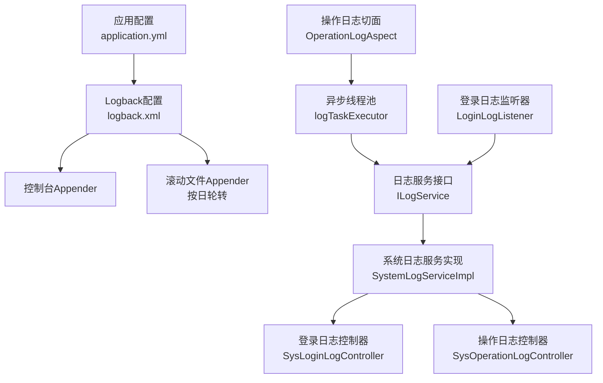
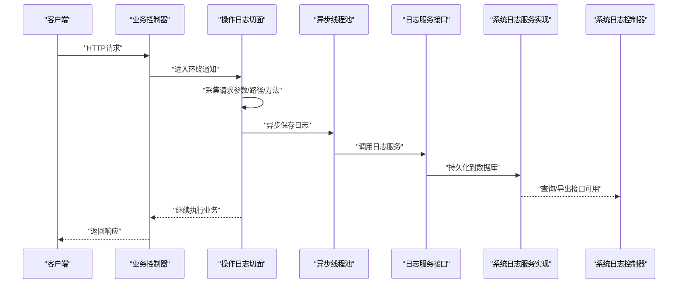
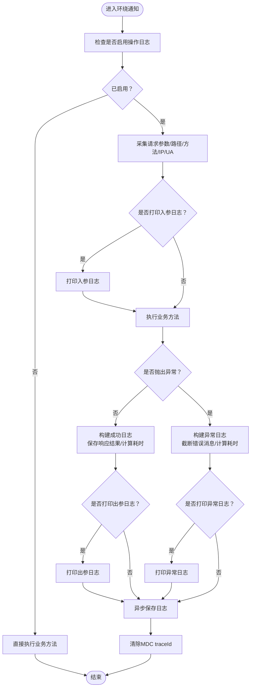
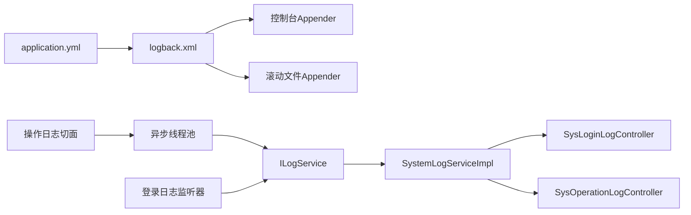

# 日志管理

<cite>
**本文引用的文件**
- [forge/forge-admin/src/main/resources/logback.xml](file://forge/forge-admin/src/main/resources/logback.xml)
- [forge/forge-admin/src/main/resources/application.yml](file://forge/forge-admin/src/main/resources/application.yml)
- [forge/forge-admin/src/main/resources/application-dev.yml](file://forge/forge-admin/src/main/resources/application-dev.yml)
- [forge/forge-admin/src/main/resources/application-prod.yml](file://forge/forge-admin/src/main/resources/application-prod.yml)
- [forge/forge-framework/forge-starter-parent/forge-starter-log/src/main/java/com/mdframe/forge/starter/log/aspect/OperationLogAspect.java](file://forge/forge-framework/forge-starter-parent/forge-starter-log/src/main/java/com/mdframe/forge/starter/log/aspect/OperationLogAspect.java)
- [forge/forge-framework/forge-starter-parent/forge-starter-log/src/main/java/com/mdframe/forge/starter/log/listener/LoginLogListener.java](file://forge/forge-framework/forge-starter-parent/forge-starter-log/src/main/java/com/mdframe/forge/starter/log/listener/LoginLogListener.java)
- [forge/forge-framework/forge-starter-parent/forge-starter-core/src/main/java/com/mdframe/forge/starter/core/context/LogProperties.java](file://forge/forge-framework/forge-starter-parent/forge-starter-core/src/main/java/com/mdframe/forge/starter/core/context/LogProperties.java)
- [forge/forge-framework/forge-starter-parent/forge-starter-config/src/main/java/com/mdframe/forge/starter/config/controller/ConfigManageController.java](file://forge/forge-framework/forge-starter-parent/forge-starter-config/src/main/java/com/mdframe/forge/starter/config/controller/ConfigManageController.java)
- [forge/forge-framework/forge-starter-parent/forge-starter-config/src/main/java/com/mdframe/forge/starter/config/converter/ConfigConverter.java](file://forge/forge-framework/forge-starter-parent/forge-starter-config/src/main/java/com/mdframe/forge/starter/config/converter/ConfigConverter.java)
- [forge/forge-framework/forge-plugin-parent/forge-plugin-system/src/main/java/com/mdframe/forge/plugin/system/controller/SysLoginLogController.java](file://forge/forge-framework/forge-plugin-parent/forge-plugin-system/src/main/java/com/mdframe/forge/plugin/system/controller/SysLoginLogController.java)
- [forge/forge-framework/forge-plugin-parent/forge-plugin-system/src/main/java/com/mdframe/forge/plugin/system/controller/SysOperationLogController.java](file://forge/forge-framework/forge-plugin-parent/forge-plugin-system/src/main/java/com/mdframe/forge/plugin/system/controller/SysOperationLogController.java)
- [forge/forge-framework/forge-plugin-parent/forge-plugin-system/src/main/java/com/mdframe/forge/plugin/system/service/impl/SystemLogServiceImpl.java](file://forge/forge-framework/forge-plugin-parent/forge-plugin-system/src/main/java/com/mdframe/forge/plugin/system/service/impl/SystemLogServiceImpl.java)
</cite>

## 目录
1. [简介](#简介)
2. [项目结构](#项目结构)
3. [核心组件](#核心组件)
4. [架构总览](#架构总览)
5. [组件详解](#组件详解)
6. [依赖关系分析](#依赖关系分析)
7. [性能与异步策略](#性能与异步策略)
8. [故障排查指南](#故障排查指南)
9. [结论](#结论)
10. [附录](#附录)

## 简介
本指南面向Forge平台的日志管理，目标是建立统一的日志收集、存储、分析与检索体系。内容涵盖：
- Logback配置文件结构与关键元素（appender、logger级别、格式化规则）
- 多环境日志配置策略（开发、测试、生产），含异步写入、轮转与压缩建议
- 日志分析工具集成方案（以ELK为例）
- 分类管理：操作日志、登录日志、异常日志
- 敏感信息脱敏与追踪（traceId）
- 基于日志的问题诊断与性能分析实践

## 项目结构
Forge的日志体系由“应用配置 + Logback + 切面与监听器 + 存储与查询”四部分组成：
- 应用配置：Spring Boot通过application.yml加载日志配置并指定Logback配置文件
- Logback：定义日志输出位置、格式、滚动策略与级别
- 切面与监听器：通过AOP与事件监听实现操作日志与登录日志的采集与异步落库
- 存储与查询：系统插件提供控制器与服务，支持登录与操作日志的查询与导出

图表来源
- [forge/forge-admin/src/main/resources/application.yml](file://forge/forge-admin/src/main/resources/application.yml#L23-L29)
- [forge/forge-admin/src/main/resources/logback.xml](file://forge/forge-admin/src/main/resources/logback.xml#L1-L48)
- [forge/forge-framework/forge-starter-parent/forge-starter-log/src/main/java/com/mdframe/forge/starter/log/aspect/OperationLogAspect.java](file://forge/forge-framework/forge-starter-parent/forge-starter-log/src/main/java/com/mdframe/forge/starter/log/aspect/OperationLogAspect.java#L34-L208)
- [forge/forge-framework/forge-starter-parent/forge-starter-log/src/main/java/com/mdframe/forge/starter/log/listener/LoginLogListener.java](file://forge/forge-framework/forge-starter-parent/forge-starter-log/src/main/java/com/mdframe/forge/starter/log/listener/LoginLogListener.java#L153-L211)
- [forge/forge-framework/forge-plugin-parent/forge-plugin-system/src/main/java/com/mdframe/forge/plugin/system/controller/SysLoginLogController.java](file://forge/forge-framework/forge-plugin-parent/forge-plugin-system/src/main/java/com/mdframe/forge/plugin/system/controller/SysLoginLogController.java)
- [forge/forge-framework/forge-plugin-parent/forge-plugin-system/src/main/java/com/mdframe/forge/plugin/system/controller/SysOperationLogController.java](file://forge/forge-framework/forge-plugin-parent/forge-plugin-system/src/main/java/com/mdframe/forge/plugin/system/controller/SysOperationLogController.java)
- [forge/forge-framework/forge-plugin-parent/forge-plugin-system/src/main/java/com/mdframe/forge/plugin/system/service/impl/SystemLogServiceImpl.java](file://forge/forge-framework/forge-plugin-parent/forge-plugin-system/src/main/java/com/mdframe/forge/plugin/system/service/impl/SystemLogServiceImpl.java)

章节来源
- [forge/forge-admin/src/main/resources/application.yml](file://forge/forge-admin/src/main/resources/application.yml#L23-L29)
- [forge/forge-admin/src/main/resources/logback.xml](file://forge/forge-admin/src/main/resources/logback.xml#L1-L48)

## 核心组件
- Logback配置：定义日志路径、格式、控制台与滚动文件Appender、logger级别与根logger策略
- 日志属性与动态配置：通过LogProperties与配置中心转换器实现可运行时调整
- 操作日志切面：围绕控制器方法织入，异步记录请求/响应、异常、耗时等
- 登录日志监听器：基于Sa-Token事件，异步记录登录/登出/锁定/解封等行为
- 系统日志服务与控制器：提供登录与操作日志的查询与管理能力

章节来源
- [forge/forge-framework/forge-starter-parent/forge-starter-core/src/main/java/com/mdframe/forge/starter/core/context/LogProperties.java](file://forge/forge-framework/forge-starter-parent/forge-starter-core/src/main/java/com/mdframe/forge/starter/core/context/LogProperties.java#L1-L71)
- [forge/forge-framework/forge-starter-parent/forge-starter-config/src/main/java/com/mdframe/forge/starter/config/converter/ConfigConverter.java](file://forge/forge-framework/forge-starter-parent/forge-starter-config/src/main/java/com/mdframe/forge/starter/config/converter/ConfigConverter.java#L143-L155)
- [forge/forge-framework/forge-starter-parent/forge-starter-log/src/main/java/com/mdframe/forge/starter/log/aspect/OperationLogAspect.java](file://forge/forge-framework/forge-starter-parent/forge-starter-log/src/main/java/com/mdframe/forge/starter/log/aspect/OperationLogAspect.java#L34-L208)
- [forge/forge-framework/forge-starter-parent/forge-starter-log/src/main/java/com/mdframe/forge/starter/log/listener/LoginLogListener.java](file://forge/forge-framework/forge-starter-parent/forge-starter-log/src/main/java/com/mdframe/forge/starter/log/listener/LoginLogListener.java#L153-L211)
- [forge/forge-framework/forge-plugin-parent/forge-plugin-system/src/main/java/com/mdframe/forge/plugin/system/controller/SysLoginLogController.java](file://forge/forge-framework/forge-plugin-parent/forge-plugin-system/src/main/java/com/mdframe/forge/plugin/system/controller/SysLoginLogController.java)
- [forge/forge-framework/forge-plugin-parent/forge-plugin-system/src/main/java/com/mdframe/forge/plugin/system/controller/SysOperationLogController.java](file://forge/forge-framework/forge-plugin-parent/forge-plugin-system/src/main/java/com/mdframe/forge/plugin/system/controller/SysOperationLogController.java)
- [forge/forge-framework/forge-plugin-parent/forge-plugin-system/src/main/java/com/mdframe/forge/plugin/system/service/impl/SystemLogServiceImpl.java](file://forge/forge-framework/forge-plugin-parent/forge-plugin-system/src/main/java/com/mdframe/forge/plugin/system/service/impl/SystemLogServiceImpl.java)

## 架构总览
下图展示从请求进入至日志落库的关键流程，包括切面采集、异步线程池、日志服务与系统控制器。

图表来源
- [forge/forge-framework/forge-starter-parent/forge-starter-log/src/main/java/com/mdframe/forge/starter/log/aspect/OperationLogAspect.java](file://forge/forge-framework/forge-starter-parent/forge-starter-log/src/main/java/com/mdframe/forge/starter/log/aspect/OperationLogAspect.java#L65-L196)
- [forge/forge-framework/forge-plugin-parent/forge-plugin-system/src/main/java/com/mdframe/forge/plugin/system/service/impl/SystemLogServiceImpl.java](file://forge/forge-framework/forge-plugin-parent/forge-plugin-system/src/main/java/com/mdframe/forge/plugin/system/service/impl/SystemLogServiceImpl.java)
- [forge/forge-framework/forge-plugin-parent/forge-plugin-system/src/main/java/com/mdframe/forge/plugin/system/controller/SysLoginLogController.java](file://forge/forge-framework/forge-plugin-parent/forge-plugin-system/src/main/java/com/mdframe/forge/plugin/system/controller/SysLoginLogController.java)
- [forge/forge-framework/forge-plugin-parent/forge-plugin-system/src/main/java/com/mdframe/forge/plugin/system/controller/SysOperationLogController.java](file://forge/forge-framework/forge-plugin-parent/forge-plugin-system/src/main/java/com/mdframe/forge/plugin/system/controller/SysOperationLogController.java)

## 组件详解

### Logback配置文件结构与规则
- 日志路径与格式
  - 日志路径通过属性统一管理，便于多环境切换
  - 输出格式包含traceId、时间、线程、级别、类名、方法行号、消息，便于定位与关联
- Appender
  - 控制台Appender：用于开发调试
  - 滚动文件Appender：按日轮转，保留历史天数，编码采用统一格式
- Logger与根Logger
  - 指定模块与框架日志级别，避免过量输出
  - 根Logger同时绑定控制台输出；系统操作日志通过另一个root绑定文件输出

章节来源
- [forge/forge-admin/src/main/resources/logback.xml](file://forge/forge-admin/src/main/resources/logback.xml#L1-L48)

### 多环境日志配置策略
- 开发环境
  - application-dev.yml中可配置数据源、Redis等，日志级别与输出策略由application.yml与logback.xml共同决定
- 测试/生产环境
  - application-prod.yml当前为空，建议在此处覆盖日志级别、输出路径与滚动策略
  - 可通过Spring Profile激活不同配置文件，实现差异化日志策略

章节来源
- [forge/forge-admin/src/main/resources/application-dev.yml](file://forge/forge-admin/src/main/resources/application-dev.yml#L1-L70)
- [forge/forge-admin/src/main/resources/application-prod.yml](file://forge/forge-admin/src/main/resources/application-prod.yml#L1-L1)
- [forge/forge-admin/src/main/resources/application.yml](file://forge/forge-admin/src/main/resources/application.yml#L39-L40)

### 日志格式化与traceId追踪
- 在Logback中通过MDC注入traceId，并在输出格式中包含该字段，确保跨服务链路可追踪
- 切面在执行前后设置与清理MDC中的traceId，保证每条日志具备唯一标识

章节来源
- [forge/forge-admin/src/main/resources/logback.xml](file://forge/forge-admin/src/main/resources/logback.xml#L5-L6)
- [forge/forge-framework/forge-starter-parent/forge-starter-log/src/main/java/com/mdframe/forge/starter/log/aspect/OperationLogAspect.java](file://forge/forge-framework/forge-starter-parent/forge-starter-log/src/main/java/com/mdframe/forge/starter/log/aspect/OperationLogAspect.java#L51-L52)
- [forge/forge-framework/forge-starter-parent/forge-starter-log/src/main/java/com/mdframe/forge/starter/log/aspect/OperationLogAspect.java](file://forge/forge-framework/forge-starter-parent/forge-starter-log/src/main/java/com/mdframe/forge/starter/log/aspect/OperationLogAspect.java#L189-L193)

### 操作日志切面与异步落库
- 切点范围：拦截控制器层（含@RestController与@Controller），自动采集请求上下文
- 功能要点：
  - 参数截断与脱敏：通过配置项限制请求/响应最大长度，避免日志膨胀
  - 异常捕获：记录错误消息与执行时长
  - 异步保存：使用独立线程池，降低对主业务的影响
  - 控制台打印：可选地在控制台输出入参/出参/异常日志，便于快速定位
- 关键配置项：是否启用、是否打印、排除路径、线程池大小与队列容量

图表来源
- [forge/forge-framework/forge-starter-parent/forge-starter-log/src/main/java/com/mdframe/forge/starter/log/aspect/OperationLogAspect.java](file://forge/forge-framework/forge-starter-parent/forge-starter-log/src/main/java/com/mdframe/forge/starter/log/aspect/OperationLogAspect.java#L65-L196)

章节来源
- [forge/forge-framework/forge-starter-parent/forge-starter-log/src/main/java/com/mdframe/forge/starter/log/aspect/OperationLogAspect.java](file://forge/forge-framework/forge-starter-parent/forge-starter-log/src/main/java/com/mdframe/forge/starter/log/aspect/OperationLogAspect.java#L34-L208)
- [forge/forge-framework/forge-starter-parent/forge-starter-core/src/main/java/com/mdframe/forge/starter/core/context/LogProperties.java](file://forge/forge-framework/forge-starter-parent/forge-starter-core/src/main/java/com/mdframe/forge/starter/core/context/LogProperties.java#L1-L71)

### 登录日志监听器与异步落库
- 基于Sa-Token事件模型，监听登录、登出、锁定、解封等事件
- 异步保存：与操作日志一致，使用独立线程池与日志服务接口
- traceId：在事件回调中生成并注入MDC，保证登录行为可追踪

章节来源
- [forge/forge-framework/forge-starter-parent/forge-starter-log/src/main/java/com/mdframe/forge/starter/log/listener/LoginLogListener.java](file://forge/forge-framework/forge-starter-parent/forge-starter-log/src/main/java/com/mdframe/forge/starter/log/listener/LoginLogListener.java#L153-L211)

### 日志配置的动态化与管理
- LogProperties：集中定义日志相关配置项，支持运行时刷新
- ConfigConverter：将前端传入的JSON转换为配置键值对，便于集中管理
- ConfigManageController：提供更新日志配置与触发刷新的REST接口

章节来源
- [forge/forge-framework/forge-starter-parent/forge-starter-core/src/main/java/com/mdframe/forge/starter/core/context/LogProperties.java](file://forge/forge-framework/forge-starter-parent/forge-starter-core/src/main/java/com/mdframe/forge/starter/core/context/LogProperties.java#L1-L71)
- [forge/forge-framework/forge-starter-parent/forge-starter-config/src/main/java/com/mdframe/forge/starter/config/converter/ConfigConverter.java](file://forge/forge-framework/forge-starter-parent/forge-starter-config/src/main/java/com/mdframe/forge/starter/config/converter/ConfigConverter.java#L143-L155)
- [forge/forge-framework/forge-starter-parent/forge-starter-config/src/main/java/com/mdframe/forge/starter/config/controller/ConfigManageController.java](file://forge/forge-framework/forge-starter-parent/forge-starter-config/src/main/java/com/mdframe/forge/starter/config/controller/ConfigManageController.java#L143-L162)

### 系统日志的存储与查询
- SystemLogServiceImpl：实现日志服务接口，负责将异步日志持久化到数据库
- SysLoginLogController / SysOperationLogController：提供登录与操作日志的查询、分页、筛选等接口

章节来源
- [forge/forge-framework/forge-plugin-parent/forge-plugin-system/src/main/java/com/mdframe/forge/plugin/system/service/impl/SystemLogServiceImpl.java](file://forge/forge-framework/forge-plugin-parent/forge-plugin-system/src/main/java/com/mdframe/forge/plugin/system/service/impl/SystemLogServiceImpl.java)
- [forge/forge-framework/forge-plugin-parent/forge-plugin-system/src/main/java/com/mdframe/forge/plugin/system/controller/SysLoginLogController.java](file://forge/forge-framework/forge-plugin-parent/forge-plugin-system/src/main/java/com/mdframe/forge/plugin/system/controller/SysLoginLogController.java)
- [forge/forge-framework/forge-plugin-parent/forge-plugin-system/src/main/java/com/mdframe/forge/plugin/system/controller/SysOperationLogController.java](file://forge/forge-framework/forge-plugin-parent/forge-plugin-system/src/main/java/com/mdframe/forge/plugin/system/controller/SysOperationLogController.java)

## 依赖关系分析
- Logback与Spring Boot：通过application.yml的logging.config指向logback.xml
- 切面与监听器：依赖ILogService接口与线程池，最终落地到SystemLogServiceImpl
- 控制器：依赖系统日志服务实现，提供查询能力

图表来源
- [forge/forge-admin/src/main/resources/application.yml](file://forge/forge-admin/src/main/resources/application.yml#L23-L29)
- [forge/forge-admin/src/main/resources/logback.xml](file://forge/forge-admin/src/main/resources/logback.xml#L1-L48)
- [forge/forge-framework/forge-starter-parent/forge-starter-log/src/main/java/com/mdframe/forge/starter/log/aspect/OperationLogAspect.java](file://forge/forge-framework/forge-starter-parent/forge-starter-log/src/main/java/com/mdframe/forge/starter/log/aspect/OperationLogAspect.java#L34-L208)
- [forge/forge-framework/forge-plugin-parent/forge-plugin-system/src/main/java/com/mdframe/forge/plugin/system/service/impl/SystemLogServiceImpl.java](file://forge/forge-framework/forge-plugin-parent/forge-plugin-system/src/main/java/com/mdframe/forge/plugin/system/service/impl/SystemLogServiceImpl.java)
- [forge/forge-framework/forge-plugin-parent/forge-plugin-system/src/main/java/com/mdframe/forge/plugin/system/controller/SysLoginLogController.java](file://forge/forge-framework/forge-plugin-parent/forge-plugin-system/src/main/java/com/mdframe/forge/plugin/system/controller/SysLoginLogController.java)
- [forge/forge-framework/forge-plugin-parent/forge-plugin-system/src/main/java/com/mdframe/forge/plugin/system/controller/SysOperationLogController.java](file://forge/forge-framework/forge-plugin-parent/forge-plugin-system/src/main/java/com/mdframe/forge/plugin/system/controller/SysOperationLogController.java)

章节来源
- [forge/forge-admin/src/main/resources/application.yml](file://forge/forge-admin/src/main/resources/application.yml#L23-L29)
- [forge/forge-admin/src/main/resources/logback.xml](file://forge/forge-admin/src/main/resources/logback.xml#L1-L48)
- [forge/forge-framework/forge-starter-parent/forge-starter-log/src/main/java/com/mdframe/forge/starter/log/aspect/OperationLogAspect.java](file://forge/forge-framework/forge-starter-parent/forge-starter-log/src/main/java/com/mdframe/forge/starter/log/aspect/OperationLogAspect.java#L34-L208)
- [forge/forge-framework/forge-plugin-parent/forge-plugin-system/src/main/java/com/mdframe/forge/plugin/system/service/impl/SystemLogServiceImpl.java](file://forge/forge-framework/forge-plugin-parent/forge-plugin-system/src/main/java/com/mdframe/forge/plugin/system/service/impl/SystemLogServiceImpl.java)

## 性能与异步策略
- 异步写入
  - 操作日志与登录日志均通过独立线程池异步保存，避免阻塞主线程
  - 线程池核心/最大线程数与队列容量可通过LogProperties配置
- 日志轮转
  - 使用基于时间的滚动策略，按日生成文件，保留一定历史天数，减少单文件过大
- 日志裁剪
  - 请求参数与响应结果的最大长度限制，防止日志膨胀
- 建议
  - 生产环境建议开启滚动压缩（如gzip），并结合集中式日志收集（见附录）

章节来源
- [forge/forge-framework/forge-starter-parent/forge-starter-core/src/main/java/com/mdframe/forge/starter/core/context/LogProperties.java](file://forge/forge-framework/forge-starter-parent/forge-starter-core/src/main/java/com/mdframe/forge/starter/core/context/LogProperties.java#L58-L71)
- [forge/forge-admin/src/main/resources/logback.xml](file://forge/forge-admin/src/main/resources/logback.xml#L18-L22)
- [forge/forge-framework/forge-starter-parent/forge-starter-log/src/main/java/com/mdframe/forge/starter/log/aspect/OperationLogAspect.java](file://forge/forge-framework/forge-starter-parent/forge-starter-log/src/main/java/com/mdframe/forge/starter/log/aspect/OperationLogAspect.java#L154-L157)

## 故障排查指南
- 日志未输出或输出异常
  - 检查application.yml中的logging.config是否正确指向logback.xml
  - 检查Logback配置中appender与logger级别是否匹配
- traceId缺失
  - 确认Logback输出格式包含traceId占位符
  - 确认切面/监听器在执行前已设置MDC，在finally中清理
- 日志过大或磁盘占用高
  - 调整滚动策略与历史天数
  - 启用压缩并定期清理旧日志
  - 通过LogProperties限制请求/响应最大长度
- 查询不到日志
  - 确认异步线程池正常运行且日志服务实现已部署
  - 检查控制器接口是否可用并正确分页/筛选

章节来源
- [forge/forge-admin/src/main/resources/application.yml](file://forge/forge-admin/src/main/resources/application.yml#L23-L29)
- [forge/forge-admin/src/main/resources/logback.xml](file://forge/forge-admin/src/main/resources/logback.xml#L5-L6)
- [forge/forge-framework/forge-starter-parent/forge-starter-log/src/main/java/com/mdframe/forge/starter/log/aspect/OperationLogAspect.java](file://forge/forge-framework/forge-starter-parent/forge-starter-log/src/main/java/com/mdframe/forge/starter/log/aspect/OperationLogAspect.java#L51-L52)
- [forge/forge-framework/forge-starter-parent/forge-starter-log/src/main/java/com/mdframe/forge/starter/log/aspect/OperationLogAspect.java](file://forge/forge-framework/forge-starter-parent/forge-starter-log/src/main/java/com/mdframe/forge/starter/log/aspect/OperationLogAspect.java#L189-L193)
- [forge/forge-framework/forge-plugin-parent/forge-plugin-system/src/main/java/com/mdframe/forge/plugin/system/service/impl/SystemLogServiceImpl.java](file://forge/forge-framework/forge-plugin-parent/forge-plugin-system/src/main/java/com/mdframe/forge/plugin/system/service/impl/SystemLogServiceImpl.java)

## 结论
Forge的日志体系通过Logback统一输出、AOP与监听器自动采集、异步落库与集中查询，形成了完整的闭环。配合动态配置与多环境策略，可在开发、测试与生产环境中灵活适配。建议在生产环境引入集中式日志收集与分析（见附录），进一步提升可观测性与问题定位效率。

## 附录

### 多环境日志配置建议
- 开发环境
  - 控制台输出为主，日志级别较低，便于调试
- 测试环境
  - 适度提高日志级别，开启必要的SQL日志
- 生产环境
  - 仅输出必要级别日志，开启按日滚动与历史保留
  - 建议启用压缩与定期清理策略

章节来源
- [forge/forge-admin/src/main/resources/application-dev.yml](file://forge/forge-admin/src/main/resources/application-dev.yml#L1-L70)
- [forge/forge-admin/src/main/resources/application-prod.yml](file://forge/forge-admin/src/main/resources/application-prod.yml#L1-L1)
- [forge/forge-admin/src/main/resources/logback.xml](file://forge/forge-admin/src/main/resources/logback.xml#L18-L22)

### ELK集成方案（Elasticsearch、Logstash、Kibana）
- 收集
  - 在应用侧保持现有滚动文件输出不变
  - 在服务器上部署Filebeat，读取滚动日志文件并发送到Logstash/Elasticsearch
- 处理
  - Logstash可选：若需结构化解析，可在Logstash中定义grok规则与过滤器
  - 或直接由Filebeat将JSON格式日志发送到Elasticsearch
- 展示
  - 使用Kibana创建仪表板与可视化，按traceId、时间、级别、模块等维度检索
- 建议
  - 对敏感字段进行脱敏（见下一节）
  - 设定索引模板与生命周期策略，控制存储成本

[本节为通用实践说明，不直接分析具体源文件，故无章节来源]

### 敏感信息脱敏与保护
- traceId：已在输出格式中包含，便于端到端追踪
- 请求/响应参数：通过LogProperties限制最大长度，避免泄露
- 建议
  - 在Logstash/Kibana侧对手机号、身份证、银行卡等敏感字段进行脱敏显示
  - 对生产日志进行访问控制与审计

[本节为通用实践说明，不直接分析具体源文件，故无章节来源]

### 通过日志进行问题诊断与性能分析
- 问题诊断
  - 使用traceId串联一次请求的全链路日志
  - 结合异常日志与操作日志，定位失败原因与耗时瓶颈
- 性能分析
  - 依据操作日志中的执行时长分布，识别慢接口与热点模块
  - 结合数据库SQL日志（如MyBatis Mapper）与线程池状态，评估系统瓶颈

章节来源
- [forge/forge-admin/src/main/resources/logback.xml](file://forge/forge-admin/src/main/resources/logback.xml#L34-L34)
- [forge/forge-framework/forge-starter-parent/forge-starter-log/src/main/java/com/mdframe/forge/starter/log/aspect/OperationLogAspect.java](file://forge/forge-framework/forge-starter-parent/forge-starter-log/src/main/java/com/mdframe/forge/starter/log/aspect/OperationLogAspect.java#L160-L161)